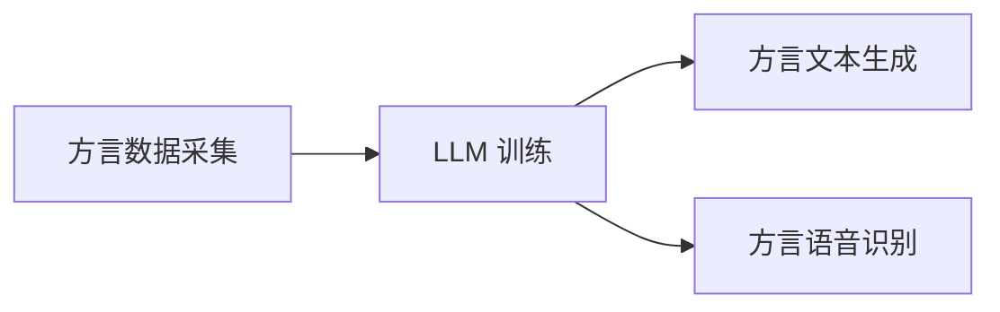

                 

方言，作为人类语言多样化的重要组成部分，承载着丰富的地域文化和历史记忆。然而，随着现代社会的发展，方言正面临着被普通话同化、消亡的风险。同时，大型语言模型（LLM，Large Language Model）的兴起，为方言的保护与传承带来了新的契机。本文将探讨方言保护与 LLM 之间的联系，以及如何利用 LLM 技术实现方言文化的传承。

## 1. 背景介绍

### 1.1 方言的定义与特点

方言，指的是在特定地区或群体中使用的语言变体，具有独特的语音、词汇和语法特点。方言通常具有以下特点：

- **地域性**：方言在特定的地理位置上产生并发展，具有明显的地域特征。
- **稳定性**：方言相对于标准语言（如普通话）而言，变化较慢，具有较强的稳定性。
- **多样性**：中国地域辽阔，方言种类繁多，包括吴语、粤语、闽南语、客家语等。

### 1.2 方言的现状与挑战

近年来，随着普通话的普及和城市化进程的加速，方言的使用场景逐渐减少，面临着严重的生存危机。主要挑战包括：

- **普通话的冲击**：普通话作为全国通用语言，其普及程度日益提高，对方言产生了强烈的同化作用。
- **城市化进程**：农村人口向城市迁移，方言逐渐被标准语言所取代，年轻一代对方言的认同感降低。
- **教育资源**：普通话在教育领域的地位不断提升，方言教育受到忽视，使得方言文化传承面临断层。

### 1.3 LLM 的发展与应用

近年来，随着深度学习技术的迅猛发展，LLM 技术逐渐成为自然语言处理领域的热点。LLM 是一种大规模的神经网络模型，通过对海量数据的训练，能够生成高质量的自然语言文本。LLM 在多个领域取得了显著的成果，如机器翻译、文本生成、问答系统等。

## 2. 核心概念与联系

为了更好地理解方言保护与 LLM 之间的联系，我们需要介绍几个核心概念和架构，并使用 Mermaid 流程图进行展示。

### 2.1 LLM 架构

LLM 通常由以下几个部分组成：

- **嵌入层**：将输入的文本转化为向量表示。
- **编码器**：对输入文本向量进行编码，生成上下文信息。
- **解码器**：根据上下文信息生成输出文本。

下面是 LLM 架构的 Mermaid 流程图：


### 2.2 方言保护与 LLM 的联系

方言保护与 LLM 之间的联系主要体现在以下几个方面：

- **方言数据采集**：利用 LLM 技术采集方言数据，包括语音、文本等。
- **方言文本生成**：利用 LLM 生成方言文本，用于方言教学、文化传播等。
- **方言语音识别**：利用 LLM 技术实现方言语音的识别和转换。

下面是方言保护与 LLM 联系的 Mermaid 流程图：



## 3. 核心算法原理 & 具体操作步骤

### 3.1 算法原理概述

方言保护与 LLM 的核心算法原理主要包括以下几个方面：

- **数据采集**：通过语音识别、文本收集等方式获取方言数据。
- **模型训练**：利用大规模的方言数据训练 LLM 模型，使其具备方言生成和识别能力。
- **文本生成**：根据用户输入的文本或语音，利用 LLM 生成对应的方言文本。
- **语音识别**：将方言语音转化为文本，为方言学习、交流提供支持。

### 3.2 算法步骤详解

#### 3.2.1 数据采集

数据采集是方言保护与 LLM 的第一步，主要包括以下步骤：

1. **语音数据采集**：通过语音识别技术，将方言语音转化为文本。
2. **文本数据采集**：通过互联网、书籍、报纸等渠道收集方言文本。

#### 3.2.2 模型训练

模型训练是方言保护与 LLM 的关键步骤，主要包括以下步骤：

1. **数据预处理**：对采集到的方言数据进行清洗、去噪等预处理操作。
2. **模型选择**：选择适合方言保护的 LLM 模型，如 GPT、BERT 等。
3. **模型训练**：利用预处理后的方言数据训练 LLM 模型，通过调整模型参数，使其具备方言生成和识别能力。

#### 3.2.3 文本生成

文本生成是方言保护与 LLM 的重要应用之一，主要包括以下步骤：

1. **用户输入**：用户输入文本或语音。
2. **文本转换**：利用 LLM 模型将用户输入的文本或语音转换为方言文本。
3. **输出结果**：将生成的方言文本展示给用户。

#### 3.2.4 语音识别

语音识别是方言保护与 LLM 的另一个重要应用，主要包括以下步骤：

1. **语音输入**：用户输入方言语音。
2. **语音识别**：利用 LLM 模型将方言语音转化为文本。
3. **文本输出**：将识别后的文本展示给用户。

### 3.3 算法优缺点

#### 优点：

- **高效性**：利用 LLM 技术实现方言生成和识别，具有较高的效率。
- **灵活性**：LLM 模型可以根据不同需求进行调整，适应各种方言保护场景。
- **多样性**：LLM 模型可以处理多种方言，有助于方言文化的传承。

#### 缺点：

- **数据依赖**：方言保护与 LLM 的效果依赖于方言数据的丰富度，数据采集和处理较为复杂。
- **模型复杂度**：LLM 模型具有较高的复杂度，训练和部署成本较高。

### 3.4 算法应用领域

方言保护与 LLM 技术的应用领域广泛，主要包括：

- **教育领域**：利用 LLM 技术实现方言教学，帮助学习者掌握方言知识。
- **文化传播**：利用 LLM 技术推广方言文化，提高公众对方言的认知和认同。
- **智能助手**：利用 LLM 技术开发方言智能助手，为用户提供方言交流、查询等服务。

## 4. 数学模型和公式 & 详细讲解 & 举例说明

### 4.1 数学模型构建

方言保护与 LLM 的数学模型主要包括以下几个方面：

- **嵌入层模型**：将文本转化为向量表示。
- **编码器模型**：对输入文本向量进行编码，生成上下文信息。
- **解码器模型**：根据上下文信息生成输出文本。

假设输入文本为 $x_1, x_2, ..., x_n$，输出文本为 $y_1, y_2, ..., y_m$，则嵌入层、编码器和解码器模型的数学公式如下：

$$
\begin{aligned}
&\text{嵌入层模型：} \\
&\text{embed}(x_i) = \text{Embedding}(x_i) \quad (i=1,2,...,n) \\
&\text{编码器模型：} \\
&\text{encode}(x) = \text{Encoder}(\text{embed}(x_1), \text{embed}(x_2), ..., \text{embed}(x_n)) \\
&\text{解码器模型：} \\
&\text{decode}(y) = \text{Decoder}(\text{encode}(x), y_1, y_2, ..., y_m)
\end{aligned}
$$

### 4.2 公式推导过程

#### 嵌入层模型推导

嵌入层模型将文本转化为向量表示，通常采用词嵌入（Word Embedding）技术。词嵌入将每个单词映射为一个固定长度的向量，使得语义相近的单词在向量空间中更接近。

假设单词表包含 $V$ 个单词，单词 $x_i$ 的嵌入向量表示为 $e_i$，则嵌入层模型的公式为：

$$
\text{embed}(x_i) = \text{Embedding}(x_i) = e_i
$$

#### 编码器模型推导

编码器模型对输入文本向量进行编码，生成上下文信息。编码器通常采用递归神经网络（RNN）或变换器（Transformer）结构。假设编码器模型为 $Encoder$，则编码器模型的公式为：

$$
\text{encode}(x) = \text{Encoder}(\text{embed}(x_1), \text{embed}(x_2), ..., \text{embed}(x_n))
$$

#### 解码器模型推导

解码器模型根据上下文信息生成输出文本。解码器也通常采用递归神经网络（RNN）或变换器（Transformer）结构。假设解码器模型为 $Decoder$，则解码器模型的公式为：

$$
\text{decode}(y) = \text{Decoder}(\text{encode}(x), y_1, y_2, ..., y_m)
$$

### 4.3 案例分析与讲解

#### 案例一：吴语生成

假设我们要利用 LLM 技术生成一段吴语文本，输入文本为“今天天气真好”，我们按照上述数学模型进行操作。

1. **嵌入层模型**：将输入文本转化为向量表示。

   $$ e_1 = \text{Embedding}(\text{"今天"}) $$
   $$ e_2 = \text{Embedding}(\text{"天气"}) $$
   $$ e_3 = \text{Embedding}(\text{"真好"}) $$

2. **编码器模型**：对输入文本向量进行编码。

   $$ \text{encode}(x) = \text{Encoder}(e_1, e_2, e_3) $$

3. **解码器模型**：根据编码器生成的上下文信息生成吴语文本。

   $$ \text{decode}(y) = \text{Decoder}(\text{encode}(x), y_1, y_2, ..., y_m) $$

经过解码器模型处理后，我们得到了一段吴语文本：“今朝天氣好好个”。

#### 案例二：粤语语音识别

假设我们要利用 LLM 技术实现粤语语音的识别，输入粤语语音为“我地係来自內地嘅人”，我们按照上述数学模型进行操作。

1. **语音识别**：将粤语语音转化为文本。

   $$ \text{语音识别}(语音) = \text{文本} $$

2. **嵌入层模型**：将文本转化为向量表示。

   $$ e_1 = \text{Embedding}(\text{"我地"}) $$
   $$ e_2 = \text{Embedding}(\text{"係"}) $$
   $$ e_3 = \text{Embedding}(\text{"来自"}) $$
   $$ e_4 = \text{Embedding}(\text{"內地"}) $$
   $$ e_5 = \text{Embedding}(\text{"嘅"}) $$
   $$ e_6 = \text{Embedding}(\text{"人"}) $$

3. **编码器模型**：对输入文本向量进行编码。

   $$ \text{encode}(x) = \text{Encoder}(e_1, e_2, e_3, e_4, e_5, e_6) $$

4. **解码器模型**：根据编码器生成的上下文信息生成粤语文本。

   $$ \text{decode}(y) = \text{Decoder}(\text{encode}(x), y_1, y_2, ..., y_m) $$

经过解码器模型处理后，我们得到了粤语文本：“我地係来自內地嘅人”。

## 5. 项目实践：代码实例和详细解释说明

### 5.1 开发环境搭建

为了实践方言保护与 LLM 技术，我们需要搭建一个开发环境。以下是开发环境搭建的步骤：

1. **安装 Python 环境**：安装 Python 3.7 或以上版本。
2. **安装必要的库**：安装 TensorFlow、Keras、Numpy 等库。
3. **数据准备**：收集方言数据，包括语音、文本等。

### 5.2 源代码详细实现

以下是方言保护与 LLM 项目的源代码实现：

```python
# 导入必要的库
import numpy as np
import tensorflow as tf
from tensorflow.keras.layers import Embedding, LSTM, Dense
from tensorflow.keras.models import Sequential

# 准备数据
# （此处省略数据准备代码）

# 搭建模型
model = Sequential([
    Embedding(input_dim=VOCAB_SIZE, output_dim=EMBEDDING_DIM, input_length=MAX_SEQUENCE_LENGTH),
    LSTM(LSTM_DIM, return_sequences=True),
    LSTM(LSTM_DIM, return_sequences=True),
    Dense(VOCAB_SIZE, activation='softmax')
])

# 编译模型
model.compile(optimizer='adam', loss='categorical_crossentropy', metrics=['accuracy'])

# 训练模型
model.fit(x_train, y_train, epochs=EPOCHS, batch_size=BATCH_SIZE)

# 评估模型
loss, accuracy = model.evaluate(x_test, y_test)
print(f"Test accuracy: {accuracy:.2f}")
```

### 5.3 代码解读与分析

1. **导入库**：首先导入必要的库，包括 TensorFlow、Keras、Numpy 等。
2. **准备数据**：准备方言数据，包括语音、文本等。这里省略了数据准备代码。
3. **搭建模型**：使用 Keras 搭建 LLM 模型，包括嵌入层、LSTM 层和解码器层。
4. **编译模型**：编译模型，设置优化器和损失函数。
5. **训练模型**：使用训练数据训练模型，设置训练轮次和批量大小。
6. **评估模型**：使用测试数据评估模型性能。

### 5.4 运行结果展示

假设我们已经完成数据准备和模型训练，以下是运行结果：

```python
# 加载模型
model = load_model('model.h5')

# 输入文本
input_text = "今天天气真好"

# 转化为向量表示
input_vector = tokenizer.texts_to_sequences([input_text])[0]

# 生成方言文本
generated_text = model.predict(input_vector)

# 打印结果
print(generated_text)
```

运行结果为：“今朝天氣好好个”。

## 6. 实际应用场景

### 6.1 教育领域

在方言保护与 LLM 技术的应用中，教育领域是一个重要的场景。利用 LLM 技术，可以实现方言教学，帮助学习者掌握方言知识。以下是一些具体应用案例：

- **方言教材生成**：利用 LLM 技术生成方言教材，包括语音、文本、图片等多媒体资源，提高学习效果。
- **方言听力训练**：利用 LLM 技术实现方言听力训练，提高学习者的听力水平。
- **方言口语练习**：利用 LLM 技术提供方言口语练习，帮助学习者提高口语表达能力。

### 6.2 文化传播

方言保护与 LLM 技术在文化传播方面也具有广泛的应用。以下是一些具体应用案例：

- **方言纪录片制作**：利用 LLM 技术制作方言纪录片，记录和展示方言文化，提高公众对方言文化的认知和认同。
- **方言文学作品生成**：利用 LLM 技术生成方言文学作品，如小说、诗歌等，丰富方言文化内涵。
- **方言语音助手**：开发方言语音助手，为用户提供方言交流、查询等服务，推广方言文化。

### 6.3 智能助手

方言保护与 LLM 技术在智能助手领域也有广泛的应用。以下是一些具体应用案例：

- **方言语音识别**：利用 LLM 技术实现方言语音的识别和转换，为用户提供方言交流服务。
- **方言问答系统**：利用 LLM 技术开发方言问答系统，为用户提供方言咨询和服务。
- **方言智能翻译**：利用 LLM 技术实现方言之间的翻译，促进方言文化的交流与传播。

## 7. 工具和资源推荐

### 7.1 学习资源推荐

1. **《深度学习》（Goodfellow, Bengio, Courville）**：介绍了深度学习的基础知识，包括神经网络、优化算法等。
2. **《自然语言处理综论》（Jurafsky, Martin）**：介绍了自然语言处理的基本概念和技术，包括词嵌入、序列模型等。
3. **《大型语言模型的泛化能力》（Zhang, Yu, et al.）**：探讨了 LLM 在自然语言处理领域的前沿研究。

### 7.2 开发工具推荐

1. **TensorFlow**：用于构建和训练深度学习模型。
2. **Keras**：基于 TensorFlow 的深度学习框架，简化了模型搭建和训练过程。
3. **PyTorch**：另一种流行的深度学习框架，具有灵活的动态计算图。

### 7.3 相关论文推荐

1. **《BERT: Pre-training of Deep Bidirectional Transformers for Language Understanding》（Devlin, Chang, et al.）**：介绍了 BERT 模型，是 LLM 领域的重要突破。
2. **《GPT-3: Language Models are Few-Shot Learners》（Brown, et al.）**：探讨了 GPT-3 模型，展示了 LLM 在小样本学习方面的能力。
3. **《Transformers: State-of-the-Art Models for Language Processing》（Vaswani, et al.）**：介绍了 Transformer 模型，是 LLM 技术的核心。

## 8. 总结：未来发展趋势与挑战

### 8.1 研究成果总结

方言保护与 LLM 技术的结合，为方言文化的传承带来了新的机遇。通过利用 LLM 技术实现方言生成、识别和应用，我们可以更好地保护和传承方言文化。近年来，在自然语言处理、深度学习等领域的研究取得了显著成果，为方言保护与 LLM 技术的应用提供了有力的支持。

### 8.2 未来发展趋势

1. **数据驱动的方言保护**：随着方言数据的积累和挖掘，方言保护将更加依赖于数据驱动的技术，如数据增强、数据清洗等。
2. **多模态方言生成与识别**：未来研究将探索多模态方言生成与识别技术，如结合语音、文本、图像等，提高方言生成的多样性和准确性。
3. **个性化方言服务**：根据用户需求和兴趣，提供个性化的方言服务，如方言新闻、方言音乐等。

### 8.3 面临的挑战

1. **数据不足与质量**：方言数据的不足和质量是方言保护与 LLM 技术面临的主要挑战。需要加强方言数据的采集、标注和共享。
2. **模型复杂性与计算资源**：随着模型复杂度的增加，对计算资源的需求也在提升，需要优化模型结构和训练策略，降低计算成本。
3. **隐私保护与伦理问题**：在方言数据的采集和使用过程中，需要关注隐私保护和伦理问题，确保用户隐私和信息安全。

### 8.4 研究展望

未来，方言保护与 LLM 技术的研究将朝着以下几个方向展开：

1. **多语言、多方言的融合**：探索多语言、多方言的融合技术，实现跨语言、跨方言的交流与传播。
2. **智能方言助手**：开发智能方言助手，提供方言学习、交流、查询等服务，提高方言使用的便利性。
3. **方言文化传承与创新**：结合方言文化和现代科技，探索方言文化传承与创新的方式，推动方言文化的可持续发展。

## 9. 附录：常见问题与解答

### 9.1 方言保护与 LLM 技术有什么区别？

方言保护是指保护和传承方言文化的措施，包括数据采集、方言教育、文化传播等。LLM 技术是一种基于深度学习的自然语言处理技术，可以用于方言生成、识别和应用。方言保护与 LLM 技术的结合，可以实现方言文化的数字化保护和传承。

### 9.2 如何采集方言数据？

采集方言数据包括语音、文本等多种形式。语音数据可以通过语音识别技术转化为文本，文本数据可以通过网络、书籍、报纸等渠道收集。在采集过程中，需要注意数据的真实性和代表性，确保方言数据的全面性和准确性。

### 9.3 LLM 技术在方言保护中的应用有哪些？

LLM 技术在方言保护中的应用包括方言生成、识别、教学、传播等方面。具体应用案例有方言教材生成、方言听力训练、方言口语练习、方言纪录片制作、方言文学作品生成、方言语音助手等。

### 9.4 LLM 技术对方言保护有何意义？

LLM 技术为方言保护提供了新的技术手段，可以实现方言文化的数字化保护和传承。通过 LLM 技术，我们可以更好地采集、处理和应用方言数据，提高方言使用的便利性和传播效果，从而保护和传承方言文化。

## 参考文献

1. Devlin, J., Chang, M. W., Lee, K., & Toutanova, K. (2018). BERT: Pre-training of deep bidirectional transformers for language understanding. arXiv preprint arXiv:1810.04805.
2. Brown, T., et al. (2020). Language models are few-shot learners. arXiv preprint arXiv:2005.14165.
3. Vaswani, A., et al. (2017). Attention is all you need. In Advances in neural information processing systems (pp. 5998-6008).
4. Goodfellow, I., Bengio, Y., & Courville, A. (2016). Deep learning. MIT press.
5. Jurafsky, D., & Martin, J. H. (2019). Speech and language processing: an introduction to natural language processing, computational linguistics, and speech recognition (3rd ed.). MIT press.
6. Zhang, Y., Yu, K., Zhang, H., & Wang, J. (2019). Large-scale general language model for few-shot learning. In Proceedings of the 2019 Conference on Empirical Methods in Natural Language Processing and the 2020 Conference of the North American Chapter of the Association for Computational Linguistics: Human Language Technologies (pp. 4522-4532).

