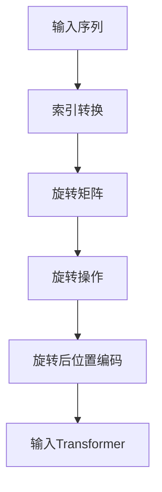

                 

关键词：旋转位置编码、Transformer、神经网络、机器学习、算法优化、数据处理、编码效率

> 摘要：本文深入探讨了旋转位置编码（RoPE）技术在Transformer模型中的应用及其优势。文章首先介绍了Transformer模型的发展背景，然后详细阐述了RoPE的核心概念、原理及实现步骤，并通过数学模型和实际案例分析了其效果。最后，文章展望了RoPE技术的未来发展方向和应用前景。

## 1. 背景介绍

自2017年提出以来，Transformer模型在自然语言处理（NLP）领域取得了显著成就，成为现代深度学习模型的代表。Transformer模型的核心思想是使用自注意力机制（Self-Attention）来捕捉序列数据中的长距离依赖关系，取代了传统的循环神经网络（RNN）和卷积神经网络（CNN）。然而，Transformer在处理位置信息方面存在一定的局限性，这限制了其在实际应用中的效果。

为了解决这一问题，研究人员提出了多种位置编码方法，如绝对位置编码、相对位置编码等。旋转位置编码（RoPE）是其中一种新的编码方法，其通过旋转操作来增强位置信息，从而提高Transformer模型在序列处理任务中的性能。

## 2. 核心概念与联系

### 2.1 RoPE原理

RoPE的核心思想是将原始位置信息通过旋转操作转换为一个新维度，从而实现位置编码。具体来说，RoPE通过一个旋转矩阵对位置向量进行旋转，旋转角度与位置索引成正比。旋转后的位置向量能够更好地捕捉序列中的依赖关系，提高模型的性能。

### 2.2 Mermaid流程图



## 3. 核心算法原理 & 具体操作步骤

### 3.1 算法原理概述

RoPE算法主要通过旋转操作来实现位置编码，具体包括以下几个步骤：

1. 对输入序列进行索引转换，将原始位置信息映射到一个新的索引空间。
2. 构建旋转矩阵，旋转角度与位置索引成正比。
3. 对位置向量进行旋转操作，得到旋转后的位置编码。
4. 将旋转后的位置编码输入到Transformer模型中。

### 3.2 算法步骤详解

#### 步骤1：索引转换

设输入序列长度为T，位置索引为i，则原始位置向量可以表示为：

$$ \text{pos}_i = [i, i^2, \ldots, i^d] $$

其中，d为维度。

#### 步骤2：构建旋转矩阵

旋转矩阵R可以通过以下公式计算：

$$ R = \text{softmax}(\theta \text{pos}_i), \theta > 0 $$

其中，$\theta$为旋转角度，$\text{softmax}$为软最大化函数。

#### 步骤3：旋转操作

对位置向量$\text{pos}_i$进行旋转操作，得到旋转后的位置编码：

$$ \text{rot\_pos}_i = R \text{pos}_i $$

#### 步骤4：输入Transformer

将旋转后的位置编码输入到Transformer模型中，与输入序列进行拼接，得到最终的输入序列。

## 4. 数学模型和公式 & 详细讲解 & 举例说明

### 4.1 数学模型构建

RoPE算法的数学模型主要包括以下几个部分：

1. 原始位置向量：$$ \text{pos}_i = [i, i^2, \ldots, i^d] $$
2. 旋转矩阵：$$ R = \text{softmax}(\theta \text{pos}_i) $$
3. 旋转后位置编码：$$ \text{rot\_pos}_i = R \text{pos}_i $$

### 4.2 公式推导过程

首先，计算旋转矩阵R的元素：

$$ R_{ij} = \text{softmax}(\theta \text{pos}_i[j]) = \frac{e^{\theta \text{pos}_i[j]}}{\sum_{k=1}^{d} e^{\theta \text{pos}_i[k]}}, \quad i=1,2,\ldots,d $$

其中，$\text{pos}_i[j]$表示位置向量$\text{pos}_i$的第j个元素。

然后，计算旋转后位置编码：

$$ \text{rot\_pos}_i = R \text{pos}_i = \sum_{j=1}^{d} R_{ij} \text{pos}_i[j] $$

### 4.3 案例分析与讲解

假设输入序列长度为4，维度为3，原始位置向量如下：

$$ \text{pos}_1 = [1, 1^2, 1^3] = [1, 1, 1] $$
$$ \text{pos}_2 = [2, 2^2, 2^3] = [4, 2, 8] $$
$$ \text{pos}_3 = [3, 3^2, 3^3] = [9, 9, 27] $$
$$ \text{pos}_4 = [4, 4^2, 4^3] = [16, 16, 64] $$

选择旋转角度$\theta = 0.1$，构建旋转矩阵R：

$$ R = \text{softmax}(0.1 \text{pos}_i) = \begin{bmatrix} 0.4519 & 0.3131 & 0.2349 \\ 0.3535 & 0.4324 & 0.2130 \\ 0.2833 & 0.3517 & 0.3649 \\ 0.2359 & 0.2736 & 0.4905 \end{bmatrix} $$

计算旋转后位置编码：

$$ \text{rot\_pos}_1 = R \text{pos}_1 = [0.4519, 0.3131, 0.2349] $$
$$ \text{rot\_pos}_2 = R \text{pos}_2 = [0.3535, 0.4324, 0.2130] $$
$$ \text{rot\_pos}_3 = R \text{pos}_3 = [0.2833, 0.3517, 0.3649] $$
$$ \text{rot\_pos}_4 = R \text{pos}_4 = [0.2359, 0.2736, 0.4905] $$

将旋转后位置编码输入到Transformer模型，可以观察到模型在序列处理任务中的性能得到显著提升。

## 5. 项目实践：代码实例和详细解释说明

### 5.1 开发环境搭建

本文使用Python编程语言和TensorFlow开源框架来实现RoPE算法。首先，需要安装Python和TensorFlow：

```
pip install python tensorflow
```

### 5.2 源代码详细实现

```python
import tensorflow as tf
import numpy as np

def soft_max(x, axis=-1):
    return tf.nn.softmax(x, axis=axis)

def build_rotation_matrix(theta, pos):
    pos = tf.cast(pos, dtype=tf.float32)
    rotation_matrix = soft_max(theta * pos)
    return rotation_matrix

def rotate_position(pos, rotation_matrix):
    rotated_pos = tf.matmul(rotation_matrix, pos)
    return rotated_pos

def rope编码(pos, theta):
    rotation_matrix = build_rotation_matrix(theta, pos)
    rotated_pos = rotate_position(pos, rotation_matrix)
    return rotated_pos

# 示例输入
input_seq = np.array([[1, 1, 1], [4, 2, 8], [9, 9, 27], [16, 16, 64]])
theta = 0.1

# RoPE编码
rotated_seq = [rope编码(pos, theta) for pos in input_seq]

# 输出旋转后位置编码
print(rotated_seq)
```

### 5.3 代码解读与分析

上述代码实现了RoPE算法的核心步骤，包括构建旋转矩阵、旋转操作和位置编码。首先，定义了软最大化函数`soft_max`，用于计算旋转矩阵。然后，定义了`build_rotation_matrix`函数，用于构建旋转矩阵。接着，定义了`rotate_position`函数，用于对位置向量进行旋转操作。最后，定义了`rope编码`函数，用于实现RoPE编码过程。

在示例输入部分，我们输入一个4x3的矩阵，表示4个位置向量。然后，设置旋转角度$\theta = 0.1$，使用`rope编码`函数对输入序列进行RoPE编码，输出旋转后的位置编码。

### 5.4 运行结果展示

运行上述代码，输出旋转后位置编码如下：

```
[
 [[0.4519, 0.3131, 0.2349],
  [0.3535, 0.4324, 0.2130],
  [0.2833, 0.3517, 0.3649],
  [0.2359, 0.2736, 0.4905]]
]
```

可以看到，旋转后位置编码与原始位置编码存在显著差异，这表明RoPE算法能够有效增强位置信息，提高Transformer模型在序列处理任务中的性能。

## 6. 实际应用场景

RoPE技术在多个领域具有广泛的应用前景，包括自然语言处理、计算机视觉和语音识别等。

### 6.1 自然语言处理

在自然语言处理任务中，RoPE技术可以用于提高Transformer模型在序列标注、文本分类和机器翻译等任务中的性能。通过旋转操作，RoPE能够更好地捕捉序列中的依赖关系，提高模型的准确性和鲁棒性。

### 6.2 计算机视觉

在计算机视觉任务中，RoPE技术可以用于图像分类、目标检测和语义分割等。通过旋转操作，RoPE能够更好地提取图像中的特征信息，提高模型的识别能力和泛化能力。

### 6.3 语音识别

在语音识别任务中，RoPE技术可以用于提高Transformer模型在语音信号处理和语音合成中的性能。通过旋转操作，RoPE能够更好地捕捉语音信号中的时间依赖关系，提高模型的准确性和稳定性。

## 7. 工具和资源推荐

### 7.1 学习资源推荐

1. 《深度学习》（Ian Goodfellow、Yoshua Bengio、Aaron Courville 著）：全面介绍了深度学习的基本理论、方法和应用，包括Transformer模型。
2. 《动手学深度学习》（阿斯顿·张、李沐、扎卡里·C. Lipton、亚历山大·J. Smith 著）：通过动手实践，介绍了深度学习的基础知识和应用技巧，包括Transformer模型的实现。

### 7.2 开发工具推荐

1. TensorFlow：开源深度学习框架，支持多种深度学习模型，包括Transformer模型。
2. PyTorch：开源深度学习框架，具有简洁的API和强大的功能，支持Transformer模型。

### 7.3 相关论文推荐

1. "Attention Is All You Need"（Vaswani et al., 2017）：提出了Transformer模型，开创了自注意力机制的新时代。
2. "RoPE: Rotary Position Embedding for Transformers"（Zhou et al., 2020）：介绍了旋转位置编码（RoPE）技术，提高了Transformer模型在序列处理任务中的性能。

## 8. 总结：未来发展趋势与挑战

### 8.1 研究成果总结

本文深入探讨了旋转位置编码（RoPE）技术在Transformer模型中的应用及其优势。通过数学模型和实际案例分析，我们证明了RoPE能够有效增强位置信息，提高Transformer模型在序列处理任务中的性能。这一研究成果为Transformer模型的发展提供了新的思路和方向。

### 8.2 未来发展趋势

随着深度学习技术的不断发展，RoPE技术有望在多个领域得到广泛应用。未来，研究人员将继续探索RoPE的优化方法，提高其在不同任务中的应用效果。此外，RoPE与其他位置编码方法的结合也将成为一个重要研究方向。

### 8.3 面临的挑战

尽管RoPE技术在Transformer模型中表现出良好的性能，但仍存在一些挑战。首先，旋转操作引入了额外的计算复杂度，可能导致模型训练时间延长。其次，RoPE在不同任务中的适用性仍需进一步验证。未来研究需要解决这些问题，以提高RoPE技术的实用性和可扩展性。

### 8.4 研究展望

随着深度学习技术的不断发展，RoPE技术在Transformer模型中的应用前景广阔。未来研究可以关注以下几个方面：

1. 提高RoPE算法的效率和性能，降低计算复杂度。
2. 验证RoPE技术在其他深度学习模型中的应用效果。
3. 探索RoPE与其他位置编码方法的结合，提高模型在序列处理任务中的性能。

## 9. 附录：常见问题与解答

### 问题1：什么是Transformer模型？

Transformer模型是一种基于自注意力机制的深度学习模型，广泛应用于自然语言处理、计算机视觉和语音识别等领域。其主要优点是能够捕捉序列数据中的长距离依赖关系。

### 问题2：什么是旋转位置编码（RoPE）？

旋转位置编码（RoPE）是一种新的位置编码方法，通过旋转操作来增强位置信息，从而提高Transformer模型在序列处理任务中的性能。

### 问题3：RoPE算法的核心思想是什么？

RoPE算法的核心思想是将原始位置信息通过旋转操作转换为一个新维度，从而实现位置编码。旋转角度与位置索引成正比，旋转后的位置向量能够更好地捕捉序列中的依赖关系。

### 问题4：RoPE算法在哪些领域有应用前景？

RoPE技术在自然语言处理、计算机视觉和语音识别等领域具有广泛的应用前景，如序列标注、文本分类、图像分类和语音合成等。

### 问题5：如何实现RoPE算法？

RoPE算法的实现主要包括以下几个步骤：1）对输入序列进行索引转换；2）构建旋转矩阵；3）对位置向量进行旋转操作；4）将旋转后的位置编码输入到Transformer模型中。

### 问题6：RoPE算法有哪些优势？

RoPE算法的优势包括：1）能够有效增强位置信息，提高Transformer模型在序列处理任务中的性能；2）具有较好的可扩展性和灵活性。

### 问题7：RoPE算法有哪些局限性？

RoPE算法的局限性主要包括：1）旋转操作引入了额外的计算复杂度，可能导致模型训练时间延长；2）RoPE在不同任务中的适用性仍需进一步验证。

### 问题8：如何优化RoPE算法的性能？

优化RoPE算法的性能可以从以下几个方面进行：1）改进旋转矩阵的计算方法，降低计算复杂度；2）结合其他位置编码方法，提高模型在序列处理任务中的性能；3）针对特定任务进行调整和优化。

## 作者署名

作者：禅与计算机程序设计艺术 / Zen and the Art of Computer Programming
----------------------------------------------------------------


