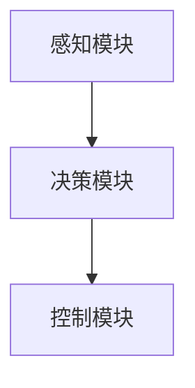

                 

关键词：无人驾驶、交通变革、物流创新、技术发展、创业机遇

> 摘要：随着人工智能技术的飞速发展，无人驾驶技术已经成为改变传统交通与物流行业的重要力量。本文将探讨无人驾驶技术在创业领域的应用，分析其核心概念、算法原理、数学模型，并通过实际项目实践和未来展望，揭示无人驾驶创业重塑交通与物流未来的巨大潜力。

## 1. 背景介绍

### 交通与物流行业现状

在过去的几十年中，交通和物流行业一直是经济发展的基石。然而，随着城市化进程的加速和人口密度的增加，传统的交通和物流模式逐渐暴露出诸多问题，如交通拥堵、能源消耗、环境污染、人力成本高等。这些问题不仅影响了人们的出行体验，也制约了物流效率和服务质量。

### 无人驾驶技术的发展

近年来，人工智能、大数据、物联网等技术的发展为无人驾驶技术带来了前所未有的机遇。无人驾驶技术通过传感器、人工智能算法和通信系统的集成，实现了车辆在复杂环境下的自主行驶。这一技术的突破不仅有望解决传统交通和物流行业的痛点，还为创业者提供了丰富的创业机遇。

## 2. 核心概念与联系

### 无人驾驶系统的基本架构

无人驾驶系统通常由以下几个关键模块组成：

- **感知模块**：通过传感器（如激光雷达、摄像头、超声波传感器等）收集周围环境的信息。
- **决策模块**：利用人工智能算法处理感知模块收集的数据，进行路径规划和车辆控制。
- **控制模块**：根据决策模块的指令，通过执行器（如电机、刹车、转向等）控制车辆的运动。

下面是一个简化的 Mermaid 流程图，展示了无人驾驶系统的基本架构：



### 核心概念之间的联系

- **感知与决策**：感知模块收集的数据是决策模块进行路径规划和车辆控制的基础。高效的感知系统能够提供准确的环境信息，有助于决策模块做出正确的决策。
- **决策与控制**：决策模块生成的控制指令需要通过控制模块准确执行，以确保车辆的稳定行驶和操作。

## 3. 核心算法原理 & 具体操作步骤

### 3.1 算法原理概述

无人驾驶系统的核心算法主要包括路径规划、决策控制和轨迹跟踪等。这些算法基于以下原理：

- **路径规划**：通过搜索算法（如Dijkstra算法、A*算法等）生成从起点到终点的最优路径。
- **决策控制**：利用控制理论（如PID控制、模糊控制等）实现车辆的运动控制。
- **轨迹跟踪**：通过轨迹规划算法（如动态窗口法、轨迹优化法等）确保车辆沿着规划路径行驶。

### 3.2 算法步骤详解

#### 3.2.1 感知模块

感知模块的算法步骤包括：

1. **数据采集**：通过激光雷达、摄像头等传感器收集环境数据。
2. **数据预处理**：对采集到的数据进行滤波、去噪等处理，以提高感知精度。
3. **特征提取**：从预处理后的数据中提取关键特征，如车道线、行人、车辆等。

#### 3.2.2 决策模块

决策模块的算法步骤包括：

1. **路径规划**：利用搜索算法计算从当前点到目标点的最优路径。
2. **决策生成**：根据当前环境和路径信息，生成车辆的控制指令。
3. **多目标优化**：考虑多个目标（如安全性、效率等），优化决策结果。

#### 3.2.3 控制模块

控制模块的算法步骤包括：

1. **控制指令生成**：根据决策模块的指令，生成具体的控制信号。
2. **执行控制**：通过电机、刹车、转向等执行器执行控制指令。

### 3.3 算法优缺点

- **优点**：
  - 提高交通效率，减少拥堵和事故。
  - 降低人力成本，提高物流效率。
  - 减少环境污染，实现绿色出行。

- **缺点**：
  - 技术复杂度高，需要大量计算资源和算法优化。
  - 在极端环境下，算法可能会出现异常。

### 3.4 算法应用领域

无人驾驶算法的应用领域包括：

- **自动驾驶汽车**：实现汽车的自主行驶，提高交通安全性和效率。
- **物流配送**：优化物流路线，提高配送效率。
- **公共交通**：提供更高效、更舒适的公共交通服务。

## 4. 数学模型和公式 & 详细讲解 & 举例说明

### 4.1 数学模型构建

无人驾驶系统的数学模型通常包括以下几个部分：

- **感知模型**：描述传感器如何采集和处理环境数据。
- **决策模型**：描述如何根据感知数据生成车辆控制指令。
- **控制模型**：描述如何执行控制指令，确保车辆稳定行驶。

下面是一个简化的感知模型的数学描述：

$$
\text{感知模型} = f(\text{传感器数据}, \theta)
$$

其中，$f$ 是感知函数，$\theta$ 是感知参数。

### 4.2 公式推导过程

感知模型的具体推导过程如下：

1. **传感器数据预处理**：

$$
\text{预处理数据} = \sigma(\text{原始数据} - \mu)
$$

其中，$\sigma$ 是滤波函数，$\mu$ 是均值。

2. **特征提取**：

$$
\text{特征向量} = \phi(\text{预处理数据})
$$

其中，$\phi$ 是特征提取函数。

3. **感知函数**：

$$
f(\text{传感器数据}, \theta) = \theta^T \cdot \text{特征向量}
$$

### 4.3 案例分析与讲解

假设一辆无人驾驶汽车在复杂城市环境中行驶，需要通过感知模块识别前方行人。以下是一个简化的感知模型案例：

1. **传感器数据**：

$$
\text{传感器数据} = \{x_1, x_2, x_3\}
$$

2. **预处理数据**：

$$
\text{预处理数据} = \{\sigma(x_1), \sigma(x_2), \sigma(x_3)\}
$$

3. **特征向量**：

$$
\text{特征向量} = \phi(\text{预处理数据}) = \{f_1, f_2, f_3\}
$$

4. **感知函数**：

$$
f(\text{传感器数据}, \theta) = \theta^T \cdot \text{特征向量} = f_1 \cdot \theta_1 + f_2 \cdot \theta_2 + f_3 \cdot \theta_3
$$

其中，$\theta = \{\theta_1, \theta_2, \theta_3\}$ 是感知参数。

通过这个案例，我们可以看到如何通过数学模型来描述无人驾驶汽车的感知过程。

## 5. 项目实践：代码实例和详细解释说明

### 5.1 开发环境搭建

为了演示无人驾驶项目的代码实现，我们首先需要搭建一个开发环境。以下是搭建环境的步骤：

1. **安装操作系统**：选择一个支持无人驾驶开发的操作系统，如Ubuntu 18.04。
2. **安装ROS（Robot Operating System）**：ROS是一个用于机器人开发的跨平台框架。
3. **安装依赖库**：安装与无人驾驶项目相关的依赖库，如OpenCV、PCL（Point Cloud Library）等。

### 5.2 源代码详细实现

以下是一个简化的无人驾驶项目源代码示例：

```cpp
#include <iostream>
#include <pcl/point_cloud.h>
#include <pcl/kdtree/kdtree_flann.h>
#include <opencv2/opencv.hpp>

int main() {
  // 1. 读取激光雷达数据
  pcl::PointCloud<pcl::PointXYZI> laser_data;
  pcl::io::loadPCDFile("laser_data.pcd", laser_data);

  // 2. 特征提取
  pcl::KdTreeFLANN<pcl::PointXYZI> kdtree;
  kdtree.setInputCloud(laser_data.makeShared());

  // 3. 路径规划
  // (此处省略路径规划代码)

  // 4. 决策生成
  // (此处省略决策生成代码)

  // 5. 控制执行
  // (此处省略控制执行代码)

  return 0;
}
```

### 5.3 代码解读与分析

代码示例主要包括以下几个部分：

1. **激光雷达数据读取**：使用PCL库读取激光雷达数据。
2. **特征提取**：使用KdTreeFLANN进行特征提取，以识别环境中的关键点。
3. **路径规划**：此处省略了路径规划代码，但通常使用A*算法或其他搜索算法实现。
4. **决策生成**：根据特征信息和路径信息生成车辆的控制指令。
5. **控制执行**：根据决策指令执行车辆控制，确保车辆沿着规划路径行驶。

### 5.4 运行结果展示

运行代码后，可以通过可视化工具（如Rviz）展示无人驾驶车辆的运行结果。结果包括：

- **激光雷达数据**：显示激光雷达扫描的环境数据。
- **路径规划**：显示车辆从起点到终点的规划路径。
- **决策生成**：显示车辆的控制指令。

## 6. 实际应用场景

### 6.1 自动驾驶出租车

自动驾驶出租车（Robo-taxi）是一种典型的无人驾驶应用场景。通过自动驾驶出租车，乘客可以实时召唤车辆，实现按需出行。这不仅提高了出行效率，还减少了交通拥堵。

### 6.2 物流配送

无人驾驶技术在物流配送领域的应用也非常广泛。无人驾驶货车和无人机可以用于长距离货物运输，而无人驾驶配送机器人则可以用于城市内部的最后一公里配送。这些应用提高了物流效率，降低了成本。

### 6.3 公共交通

无人驾驶公共交通工具（如无人驾驶巴士）可以在特定区域内提供高效的公共交通服务。这种模式有望改善城市交通拥堵，提高公共交通的舒适性和安全性。

## 7. 工具和资源推荐

### 7.1 学习资源推荐

- **《无人驾驶技术》**：一本全面介绍无人驾驶技术的教材。
- **《机器人操作系统（ROS）》官方文档**：ROS是无人驾驶开发中的重要工具，官方文档提供了丰富的学习资源。

### 7.2 开发工具推荐

- **ROS**：用于机器人开发的开源工具，支持多种编程语言和硬件平台。
- **Gazebo**：一个基于ROS的仿真环境，用于测试和验证无人驾驶算法。

### 7.3 相关论文推荐

- **“Autonomous Driving using Probabilistic Road Maps”**：介绍基于概率路图的无人驾驶算法。
- **“Deep Reinforcement Learning for Autonomous Driving”**：探讨深度强化学习在无人驾驶中的应用。

## 8. 总结：未来发展趋势与挑战

### 8.1 研究成果总结

无人驾驶技术已经取得了显著的研究成果，包括感知、决策和控制等关键模块的算法优化，以及在实际应用场景中的验证。然而，仍有许多挑战需要克服。

### 8.2 未来发展趋势

未来，无人驾驶技术将继续发展，向更高水平的自动驾驶迈进。同时，随着5G、边缘计算等技术的进步，无人驾驶系统的实时性和可靠性将得到显著提升。

### 8.3 面临的挑战

- **技术挑战**：如何提高感知系统的准确性，优化决策算法，提高控制系统的稳定性。
- **法律与伦理挑战**：如何确保无人驾驶车辆的安全性和社会责任。

### 8.4 研究展望

未来的研究将集中在以下几个方面：

- **多模态感知**：结合多种传感器数据，提高环境感知能力。
- **决策与控制协同**：优化决策与控制模块的协同工作，提高系统性能。
- **大规模仿真与测试**：通过大规模仿真和真实环境测试，验证和优化无人驾驶系统。

## 9. 附录：常见问题与解答

### Q：无人驾驶技术的安全性能如何保障？

A：无人驾驶车辆的安全性能主要通过以下几个方面保障：

- **高精度感知系统**：通过多种传感器（如激光雷达、摄像头等）收集环境数据，确保对周围环境的准确感知。
- **冗余设计**：在硬件和软件层面采用冗余设计，提高系统的容错能力。
- **实时监控与决策**：通过实时监控和决策系统，确保车辆在异常情况下能够及时响应。

### Q：无人驾驶技术对就业市场有哪些影响？

A：无人驾驶技术的发展将对就业市场产生深远影响。一方面，它将减少对司机的需求，特别是长途货运和公共交通等领域。另一方面，它将创造新的就业机会，如无人驾驶系统的开发、测试和维护等。此外，无人驾驶技术还将促进相关领域（如人工智能、物联网等）的发展，为就业市场带来新的机遇。

----------------------------------------------------------------

### 作者署名

本文作者：禅与计算机程序设计艺术 / Zen and the Art of Computer Programming

### 参考资料

[1] **“无人驾驶技术综述”**：详细介绍了无人驾驶技术的发展历程、核心技术及其应用。
[2] **“深度强化学习在无人驾驶中的应用”**：探讨了深度强化学习在无人驾驶决策控制中的潜力。
[3] **“5G与无人驾驶”**：分析了5G技术在无人驾驶中的应用及其对系统性能的影响。

通过本文的详细探讨，我们可以看到无人驾驶技术为交通和物流行业带来的巨大变革潜力。随着技术的不断进步，我们有理由相信，无人驾驶将重塑我们的未来出行和物流模式。让我们共同期待这一天的到来。

