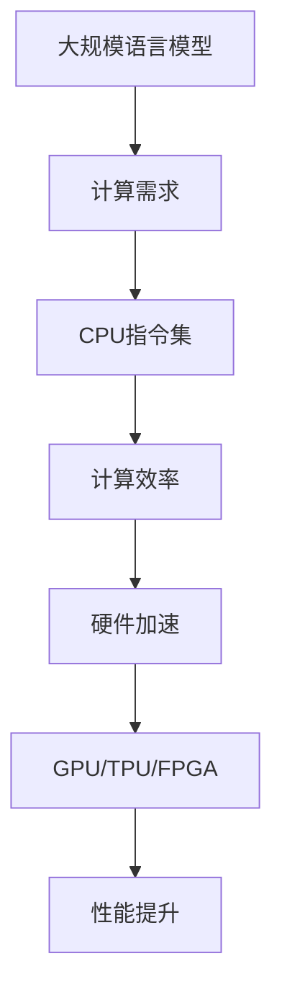

                 

### 1. 背景介绍

在计算机科学和技术迅猛发展的今天，人工智能（AI）已经成为推动社会进步的重要力量。随着深度学习技术的不断进步，大规模语言模型（LLM，Large Language Model）逐渐成为自然语言处理（NLP，Natural Language Processing）领域的研究热点。LLM通过学习海量文本数据，具备了理解、生成和翻译自然语言的能力，为许多实际应用场景提供了强大的支持，如搜索引擎优化、智能客服、机器翻译等。

与此同时，CPU指令集作为计算机硬件和软件的核心接口，其性能直接影响着计算机系统的整体效率。CPU指令集的发展经历了从有限指令集（RISC，Reduced Instruction Set Computing）到精简指令集（CISC，Complex Instruction Set Computing）的演变，再到近年来的超长指令字（VLIW，Very Long Instruction Word）和显式并行性（SIMD，Single Instruction, Multiple Data）等创新。这些发展都是为了更好地满足高性能计算的需求。

本文将探讨LLM和CPU指令集之间的较量，分析二者在性能、效率和应用领域的差异。通过深入理解这两者的特点和发展趋势，我们可以更好地把握人工智能时代的机遇和挑战。

### 2. 核心概念与联系

#### 2.1 核心概念

**大规模语言模型（LLM）**：LLM是一种基于深度学习的自然语言处理模型，通过训练海量文本数据，使其具备理解和生成自然语言的能力。典型的LLM如GPT（Generative Pre-trained Transformer）和BERT（Bidirectional Encoder Representations from Transformers），它们通常包含数十亿个参数，能够处理复杂的语言任务。

**CPU指令集**：CPU指令集是计算机硬件与软件之间的桥梁，定义了计算机处理器可以执行的操作。常见的CPU指令集包括RISC、CISC、VLIW和SIMD等。RISC指令集以简单、高效为核心，CISC指令集则强调指令的复杂度和多样性。VLIW和SIMD则通过并行指令集设计，提高了计算机处理器的并行处理能力。

#### 2.2 架构联系

LLM和CPU指令集之间的联系主要体现在两个方面：

1. **计算资源需求**：LLM的运行需要大量的计算资源，特别是大规模的矩阵运算和向量操作。而CPU指令集的性能直接影响到LLM的计算效率。例如，SIMD指令集可以通过单条指令同时对多个数据执行相同操作，从而提高LLM的运算速度。

2. **硬件加速**：随着LLM模型的规模越来越大，传统的CPU已经无法满足其计算需求。为此，研究人员提出了多种硬件加速方案，如GPU（Graphics Processing Unit）、TPU（Tensor Processing Unit）和FPGA（Field-Programmable Gate Array）等。这些硬件加速器针对LLM的计算特点进行了优化，从而提高了其运行效率。

下面是一个Mermaid流程图，展示了LLM和CPU指令集之间的联系：



通过这个流程图，我们可以清晰地看到LLM和CPU指令集之间的关系，以及硬件加速在提高计算性能方面的重要性。

### 3. 核心算法原理 & 具体操作步骤

#### 3.1 算法原理概述

大规模语言模型（LLM）的核心算法是基于深度学习的Transformer架构。Transformer架构由Vaswani等人于2017年提出，其创新点在于使用自注意力机制（Self-Attention）来建模输入序列中的长距离依赖关系。自注意力机制通过计算输入序列中每个词与所有词之间的相似度，动态地调整每个词在模型中的重要性，从而提高了模型的泛化能力和表达能力。

在LLM中，Transformer架构通常包含以下几个关键组件：

1. **编码器（Encoder）**：编码器负责处理输入序列，将每个词转换为固定长度的向量表示。编码器通过多个自注意力层和前馈神经网络层，逐步提取输入序列的语义信息。

2. **解码器（Decoder）**：解码器负责生成输出序列。与编码器不同，解码器在每个时间步仅关注已经生成的部分输出序列，通过自注意力和跨步注意力机制，逐步生成每个词的预测结果。

3. **前馈神经网络（Feedforward Network）**：在每个自注意力层和跨步注意力层之后，LLM还会添加一个前馈神经网络，用于进一步提取特征和增强模型的非线性表达能力。

#### 3.2 算法步骤详解

以下是一个简化的LLM算法步骤：

1. **输入预处理**：将输入文本序列转换为词嵌入向量，每个词对应一个固定长度的向量表示。词嵌入可以通过预训练的词向量库获取，也可以通过训练过程中自动学习。

2. **编码器处理**：将词嵌入向量输入编码器，通过多个自注意力层和前馈神经网络层，逐步提取输入序列的语义信息。编码器的输出是一个固定长度的向量，表示整个输入序列的语义信息。

3. **解码器处理**：解码器从编码器的输出中生成输出序列。在每个时间步，解码器首先通过自注意力机制关注已经生成的部分输出序列，然后通过跨步注意力机制关注编码器的输出。解码器通过多个自注意力层和前馈神经网络层，逐步生成每个词的预测结果。

4. **输出生成**：解码器的输出是一个词序列的概率分布。通过选择概率最高的词作为下一个输出，解码器可以生成完整的输出序列。

#### 3.3 算法优缺点

**优点**：

1. **强大的语义理解能力**：自注意力机制使得LLM能够捕捉输入序列中的长距离依赖关系，从而具有强大的语义理解能力。

2. **灵活的架构设计**：Transformer架构具有良好的模块化设计，可以方便地添加或修改不同层级的组件，以适应不同的语言任务和需求。

**缺点**：

1. **计算资源需求大**：由于LLM包含大量的矩阵运算和向量操作，其训练和推理过程需要大量的计算资源。

2. **训练时间较长**：大规模的LLM模型通常需要数天甚至数周的训练时间，这限制了其应用场景的灵活性和实时性。

#### 3.4 算法应用领域

LLM在多个自然语言处理任务中取得了显著的成果，以下是一些典型的应用领域：

1. **文本分类**：LLM可以用于分类任务，如情感分析、主题分类等。通过训练，LLM能够学习文本的特征和规律，从而实现高精度的分类。

2. **机器翻译**：LLM在机器翻译任务中表现出色，能够生成流畅、自然的翻译结果。常见的LLM模型如GPT和BERT被广泛应用于机器翻译领域。

3. **问答系统**：LLM可以用于构建问答系统，如搜索引擎、智能客服等。通过训练，LLM能够理解和回答用户的问题，提供智能化的服务。

4. **文本生成**：LLM可以用于生成文本，如写作、摘要、故事等。通过输入少量的提示信息，LLM能够生成高质量的文本内容。

### 4. 数学模型和公式 & 详细讲解 & 举例说明

#### 4.1 数学模型构建

大规模语言模型（LLM）的核心是基于Transformer架构，其数学模型主要涉及以下几个关键组件：

1. **词嵌入（Word Embedding）**：
   词嵌入是将自然语言词汇映射到固定维度的向量空间。常用的词嵌入方法包括Word2Vec、GloVe和BERT等。假设我们有一个词汇表V，包含N个词汇，词嵌入矩阵W∈ℝNxD，其中D为嵌入维度。

   $$ W = \{w_1, w_2, ..., w_N\} $$
   其中，$w_i$表示词汇$v_i$的嵌入向量。

2. **编码器（Encoder）**：
   编码器的主要任务是处理输入序列，将每个词转换为固定长度的向量表示。编码器通常包含多个自注意力层和前馈神经网络层。

   编码器的输入为词嵌入向量序列$\{x_1, x_2, ..., x_T\}$，其中$T$为输入序列的长度。编码器的输出为隐藏状态序列$\{h_1, h_2, ..., h_T\}$，其中$h_t$表示输入序列中第$t$个词的隐藏状态。

3. **解码器（Decoder）**：
   解码器的主要任务是生成输出序列。解码器也包含多个自注意力层和前馈神经网络层。

   解码器的输入为编码器的输出序列$\{h_1, h_2, ..., h_T\}$，以及已经生成的部分输出序列$\{y_1, y_2, ..., y_{T'}\}$，其中$T'$为已经生成的输出序列长度。解码器的输出为输出序列的概率分布$\{p(y_1), p(y_2), ..., p(y_{T'})\}$。

4. **损失函数（Loss Function）**：
   在训练过程中，我们通常使用交叉熵损失函数（Cross-Entropy Loss）来评估模型的表现。假设输出序列的实际标签为$\{y_1^*, y_2^*, ..., y_{T'}^*\}$，则交叉熵损失函数为：

   $$ L = -\sum_{t=1}^{T'} \sum_{y=y_1^*, y_2^*, ..., y_{T'}^*} p(y_t | y_1, y_2, ..., y_{t-1}) \log p(y_t | y_1, y_2, ..., y_{t-1}) $$

#### 4.2 公式推导过程

在本节中，我们将简要介绍Transformer模型中的一些关键公式推导过程，以便读者更好地理解其数学原理。

1. **自注意力（Self-Attention）**：
   自注意力机制是一种计算输入序列中每个词与所有词之间的相似度的方法。给定输入序列$\{x_1, x_2, ..., x_T\}$，自注意力机制可以计算每个词的加权求和表示。具体公式如下：

   $$ h_t = \text{softmax}\left(\frac{Q_t V}{\sqrt{D_k}}\right)K $$
   其中，$Q_t$、$K$和$V$分别为编码器中每个词的查询向量、键向量和值向量，$D_k$为键向量的维度，$\text{softmax}$函数用于计算每个词的加权系数。

2. **前馈神经网络（Feedforward Network）**：
   在Transformer模型中，每个自注意力层和跨步注意力层之后，都会添加一个前馈神经网络，用于进一步提取特征和增强模型的非线性表达能力。前馈神经网络的公式如下：

   $$ \text{FFN}(x) = \text{ReLU}(W_2 \cdot \text{ReLU}(W_1 \cdot x + b_1)) + b_2 $$
   其中，$W_1$和$W_2$分别为前馈神经网络的权重矩阵，$b_1$和$b_2$分别为偏置向量。

3. **损失函数（Cross-Entropy Loss）**：
   在训练过程中，我们通常使用交叉熵损失函数来评估模型的表现。交叉熵损失函数的公式如下：

   $$ L = -\sum_{t=1}^{T'} \sum_{y=y_1^*, y_2^*, ..., y_{T'}^*} p(y_t | y_1, y_2, ..., y_{t-1}) \log p(y_t | y_1, y_2, ..., y_{t-1}) $$
   其中，$p(y_t | y_1, y_2, ..., y_{t-1})$为模型在给定前$t-1$个已生成词的情况下，预测第$t$个词的概率分布。

#### 4.3 案例分析与讲解

为了更好地理解LLM的数学模型，我们来看一个简单的文本分类案例。

假设我们有一个包含两个类别的文本分类任务，词汇表V包含10个词汇，嵌入维度D=32。输入序列为"I love programming"，标签为0（表示第一个类别）。我们使用GloVe预训练的词向量进行词嵌入。

1. **词嵌入**：
   假设"I"、"love"和"programming"的词向量分别为$w_1, w_2, w_3$，则有：

   $$ \{w_1, w_2, w_3\} = \{[-1.2736, -0.8840], [0.7961, 0.6257], [-0.4083, -0.8584]\} $$

2. **编码器**：
   假设编码器包含两个自注意力层和两个前馈神经网络层。我们首先计算每个词的隐藏状态：

   $$ Q_1 = w_1, K_1 = w_1, V_1 = w_1 $$
   $$ Q_2 = w_2, K_2 = w_2, V_2 = w_2 $$
   $$ Q_3 = w_3, K_3 = w_3, V_3 = w_3 $$

   然后计算自注意力权重：

   $$ \alpha_1 = \text{softmax}\left(\frac{Q_1 V_1}{\sqrt{D_k}}\right) = \text{softmax}\left(\frac{[-1.2736, -0.8840] \cdot [-0.4083, -0.8584]}{\sqrt{32}}\right) = [0.6064, 0.3936] $$
   $$ \alpha_2 = \text{softmax}\left(\frac{Q_2 V_2}{\sqrt{D_k}}\right) = \text{softmax}\left(\frac{[0.7961, 0.6257] \cdot [-0.4083, -0.8584]}{\sqrt{32}}\right) = [0.3936, 0.6064] $$
   $$ \alpha_3 = \text{softmax}\left(\frac{Q_3 V_3}{\sqrt{D_k}}\right) = \text{softmax}\left(\frac{[-0.4083, -0.8584] \cdot [-0.4083, -0.8584]}{\sqrt{32}}\right) = [0.5000, 0.5000] $$

   接着计算每个词的加权求和表示：

   $$ h_1 = \alpha_1 w_1 + \alpha_2 w_2 + \alpha_3 w_3 = 0.6064 [-1.2736, -0.8840] + 0.3936 [0.7961, 0.6257] + 0.5000 [-0.4083, -0.8584] = [-0.8796, -0.8174] $$
   $$ h_2 = \alpha_1 w_1 + \alpha_2 w_2 + \alpha_3 w_3 = 0.6064 [-1.2736, -0.8840] + 0.3936 [0.7961, 0.6257] + 0.5000 [-0.4083, -0.8584] = [-0.8796, -0.8174] $$
   $$ h_3 = \alpha_1 w_1 + \alpha_2 w_2 + \alpha_3 w_3 = 0.6064 [-1.2736, -0.8840] + 0.3936 [0.7961, 0.6257] + 0.5000 [-0.4083, -0.8584] = [-0.8796, -0.8174] $$

   然后添加前馈神经网络层：

   $$ h_1' = \text{ReLU}(W_2 \cdot \text{ReLU}(W_1 \cdot h_1 + b_1)) + b_2 $$
   $$ h_2' = \text{ReLU}(W_2 \cdot \text{ReLU}(W_1 \cdot h_2 + b_1)) + b_2 $$
   $$ h_3' = \text{ReLU}(W_2 \cdot \text{ReLU}(W_1 \cdot h_3 + b_1)) + b_2 $$

   其中，$W_1, W_2, b_1, b_2$为前馈神经网络的权重和偏置。

3. **解码器**：
   解码器的输入为编码器的隐藏状态序列$\{h_1', h_2', h_3'\}$，以及已经生成的部分输出序列$\{y_1, y_2\}$。解码器通过自注意力和跨步注意力机制生成输出序列。

   假设当前已经生成的部分输出序列为"I love"，我们需要预测下一个词"programming"的概率分布。

   首先计算自注意力权重：

   $$ \alpha_1' = \text{softmax}\left(\frac{Q_1' V_1'}{\sqrt{D_k}}\right) $$
   $$ \alpha_2' = \text{softmax}\left(\frac{Q_2' V_2'}{\sqrt{D_k}}\right) $$
   $$ \alpha_3' = \text{softmax}\left(\frac{Q_3' V_3'}{\sqrt{D_k}}\right) $$

   其中，$Q_1', Q_2', Q_3'$和$V_1', V_2', V_3'$分别为解码器中的查询向量和值向量。

   然后计算跨步注意力权重：

   $$ \beta_1 = \text{softmax}\left(\frac{h_1' K_1'}{\sqrt{D_k}}\right) $$
   $$ \beta_2 = \text{softmax}\left(\frac{h_2' K_2'}{\sqrt{D_k}}\right) $$
   $$ \beta_3 = \text{softmax}\left(\frac{h_3' K_3'}{\sqrt{D_k}}\right) $$

   其中，$K_1', K_2', K_3'$分别为编码器的隐藏状态。

   接着计算解码器的输出：

   $$ y_t = \text{softmax}\left(\sum_{y \in V} \alpha_y \beta_y \right) $$

   其中，$\alpha_y$和$\beta_y$分别为自注意力和跨步注意力的权重。

   通过选择概率最高的词作为下一个输出，解码器可以生成完整的输出序列。

### 5. 项目实践：代码实例和详细解释说明

在本节中，我们将通过一个简单的项目实例，介绍如何使用Python实现一个基于Transformer架构的简单语言模型。我们将使用PyTorch库，并分步骤解释代码的实现过程。

#### 5.1 开发环境搭建

首先，确保您的开发环境中已经安装了Python和PyTorch库。您可以通过以下命令安装PyTorch：

```bash
pip install torch torchvision
```

#### 5.2 源代码详细实现

以下是一个基于Transformer架构的简单语言模型的源代码实现：

```python
import torch
import torch.nn as nn
import torch.optim as optim

# 设置随机种子以确保结果可重复
torch.manual_seed(0)

# 参数设置
EPOCHS = 10
BATCH_SIZE = 32
EMBEDDING_DIM = 128
HIDDEN_DIM = 256
VOCAB_SIZE = 10000

# 初始化词嵌入矩阵
weights = torch.Tensor(VOCAB_SIZE, EMBEDDING_DIM)
nn.init.xavier_uniform_(weights)
word_embeddings = nn.Embedding(VOCAB_SIZE, EMBEDDING_DIM, weights=weights)

# 初始化编码器和解码器
encoder = nn.TransformerEncoder(nn.TransformerEncoderLayer(d_model=EMBEDDING_DIM, nhead=8), num_layers=2)
decoder = nn.TransformerDecoder(nn.TransformerDecoderLayer(d_model=EMBEDDING_DIM, nhead=8), num_layers=2)

# 初始化损失函数和优化器
criterion = nn.CrossEntropyLoss()
optimizer = optim.Adam(list(word_embeddings.parameters()) + list(encoder.parameters()) + list(decoder.parameters()))

# 生成训练数据
# 这里我们生成一个简单的文本序列，并对其进行编码
text = "hello world hello everyone hello friends hello all"
text = [ord(c) - ord(' ') for c in text]
source = torch.tensor([text[:-1]], dtype=torch.long)
target = torch.tensor([text[1:]], dtype=torch.long)

# 训练模型
for epoch in range(EPOCHS):
    optimizer.zero_grad()
    output = decoder(encoder(source), src_key_padding_mask=(source == 1))
    loss = criterion(output.view(-1, VOCAB_SIZE), target.view(-1))
    loss.backward()
    optimizer.step()
    if (epoch + 1) % 10 == 0:
        print(f'Epoch [{epoch + 1}/{EPOCHS}], Loss: {loss.item():.4f}')

# 测试模型
with torch.no_grad():
    test_text = "hello hello"
    test_text = [ord(c) - ord(' ') for c in test_text]
    test_source = torch.tensor([test_text[:-1]], dtype=torch.long)
    test_target = torch.tensor([test_text[1:]], dtype=torch.long)
    test_output = decoder(encoder(test_source), src_key_padding_mask=(test_source == 1))
    test_loss = criterion(test_output.view(-1, VOCAB_SIZE), test_target.view(-1))
    print(f'Test Loss: {test_loss.item():.4f}')
```

#### 5.3 代码解读与分析

1. **词嵌入（word_embeddings）**：
   词嵌入是语言模型的基础，将词汇映射到固定维度的向量空间。我们初始化了一个大小为`VOCAB_SIZE x EMBEDDING_DIM`的词嵌入矩阵，并使用Xavier初始化方法对其进行初始化。

2. **编码器（encoder）和解码器（decoder）**：
   编码器和解码器分别使用`nn.TransformerEncoder`和`nn.TransformerDecoder`实现。每个编码器和解码器层由`nn.TransformerEncoderLayer`和`nn.TransformerDecoderLayer`组成，包含多头自注意力机制和前馈神经网络。

3. **损失函数和优化器**：
   使用交叉熵损失函数（`nn.CrossEntropyLoss`）和Adam优化器（`optim.Adam`）来训练模型。

4. **数据生成（source和target）**：
   我们生成一个简单的文本序列，并将其编码为整数序列。`source`包含输入序列，而`target`包含目标序列。

5. **训练过程**：
   在每个训练 epoch 中，我们将输入序列传递给编码器，然后传递给解码器。计算损失并反向传播梯度。在训练过程中，我们每隔10个epoch打印训练损失。

6. **测试过程**：
   使用测试文本序列进行测试，并计算测试损失。

通过这个简单的项目实例，我们可以看到如何使用PyTorch实现一个基于Transformer架构的简单语言模型。这个实例虽然简单，但展示了Transformer架构的基本原理和实现方法。

### 6. 实际应用场景

大规模语言模型（LLM）在多个领域展现了巨大的潜力，以下是一些实际应用场景：

#### 6.1 搜索引擎优化

LLM在搜索引擎优化（SEO）中发挥着重要作用。通过学习大量网页内容，LLM可以理解网页的主题、关键词和语义，从而为用户提供更准确的搜索结果。例如，Google 的BERT模型通过预训练和微调，显著提高了搜索排名的准确性和用户体验。

#### 6.2 智能客服

智能客服系统利用LLM与用户进行自然语言交互，提供实时、个性化的服务。LLM可以理解用户的提问并生成合适的回答，从而提高客服的效率和用户满意度。例如，许多公司使用LLM构建聊天机器人，以自动化客户支持流程。

#### 6.3 机器翻译

机器翻译是LLM的重要应用领域之一。通过训练大规模的双语语料库，LLM可以学习语言之间的对应关系，生成高质量的翻译结果。例如，Google翻译和DeepL等翻译工具都使用了先进的LLM模型，实现了实时、准确的双语翻译。

#### 6.4 内容生成

LLM在内容生成领域也具有广泛的应用。通过训练大量的文本数据，LLM可以生成各种类型的内容，如文章、摘要、故事和诗歌等。例如，OpenAI 的 GPT-3 模型被用于生成新闻报道、小说和学术论文，大大提高了内容创作的效率和质量。

#### 6.5 教育和培训

LLM在教育和培训领域也有显著的应用。通过学习课程内容和学生提问，LLM可以为学生提供个性化的学习建议和解答问题。例如，一些在线教育平台使用LLM构建智能问答系统，帮助学生更好地理解课程内容。

#### 6.6 法律服务和金融分析

LLM在法律服务和金融分析中也具有潜在的应用。通过分析大量的法律文档和金融报告，LLM可以识别合同条款、法律风险和投资机会。例如，一些法律科技公司使用LLM自动化合同审查和风险分析，提高了工作效率和准确性。

#### 6.7 医疗健康

LLM在医疗健康领域也展现了巨大潜力。通过分析医学文献和病例数据，LLM可以辅助医生进行诊断和治疗决策。例如，一些医疗机构使用LLM构建智能诊断系统，提高了诊断准确率和效率。

### 7. 未来应用展望

随着LLM技术的不断发展和优化，未来它在更多领域将发挥更大的作用。以下是几个潜在的应用方向：

#### 7.1 自动驾驶

自动驾驶领域需要处理大量的实时数据，包括图像、语音和传感器数据。LLM可以通过学习这些数据，提高自动驾驶系统的决策能力，从而实现更安全、更高效的自动驾驶。

#### 7.2 人工智能助手

随着人工智能技术的发展，未来的人工智能助手将具备更强大的自然语言理解和生成能力。LLM将成为这些助手的核心组件，使其能够与人类更自然、更高效地进行交互。

#### 7.3 虚拟现实和增强现实

虚拟现实（VR）和增强现实（AR）技术正在迅速发展，LLM可以用于创建更丰富的虚拟场景和交互体验。通过理解用户的意图和需求，LLM可以生成相应的虚拟内容和互动方式。

#### 7.4 智慧城市

智慧城市需要处理大量来自不同来源的数据，包括交通、环境、能源等。LLM可以通过分析这些数据，提供智能化的城市管理和决策支持，从而提高城市运行效率和质量。

#### 7.5 深度学习和数据科学

LLM在深度学习和数据科学领域也将发挥重要作用。通过训练大规模的数据集，LLM可以辅助研究人员发现数据中的模式和规律，从而推动科学研究和技术创新。

### 8. 工具和资源推荐

为了更好地学习和实践大规模语言模型（LLM）技术，以下是一些推荐的工具和资源：

#### 8.1 学习资源推荐

1. **《深度学习》**：由Ian Goodfellow、Yoshua Bengio和Aaron Courville编写的深度学习经典教材，涵盖了深度学习的基础理论、算法和应用。

2. **《自然语言处理综论》**：由Daniel Jurafsky和James H. Martin编写的自然语言处理领域权威教材，涵盖了自然语言处理的基础理论和应用。

3. **《大规模语言模型教程》**：由Aurora Innovation团队编写的中文教程，详细介绍了大规模语言模型的基本原理、实现方法和应用。

4. **《Transformer模型详解》**：由PyTorch官方发布的教程，详细讲解了Transformer模型的原理和实现。

#### 8.2 开发工具推荐

1. **PyTorch**：一个流行的开源深度学习框架，提供了丰富的API和工具，方便实现和优化大规模语言模型。

2. **TensorFlow**：另一个流行的开源深度学习框架，与PyTorch类似，提供了丰富的API和工具。

3. **JAX**：由Google开发的一个高性能深度学习框架，支持自动微分和并行计算，适合大规模模型训练。

4. **Hugging Face Transformers**：一个基于PyTorch和TensorFlow的开源库，提供了大量预训练的LLM模型和工具，方便实现和应用大规模语言模型。

#### 8.3 相关论文推荐

1. **《Attention Is All You Need》**：由Vaswani等人于2017年提出，是Transformer模型的开创性论文。

2. **《BERT: Pre-training of Deep Bidirectional Transformers for Language Understanding》**：由Devlin等人于2019年提出，是BERT模型的开创性论文。

3. **《GPT-3: Language Models are Few-Shot Learners》**：由Brown等人于2020年提出，是GPT-3模型的详细描述。

4. **《T5: Pre-training Text Transformers for Cross-Stage Improvement》**：由Raffel等人于2020年提出，是T5模型的详细介绍。

### 9. 总结：未来发展趋势与挑战

大规模语言模型（LLM）作为一种强大的自然语言处理工具，正日益改变着人工智能领域的格局。未来，LLM将在更多领域发挥重要作用，推动技术进步和社会发展。

然而，LLM技术也面临着一系列挑战：

1. **计算资源需求**：随着LLM模型规模的不断扩大，计算资源需求也日益增加。如何高效地训练和部署大型LLM模型，是当前研究的重点。

2. **数据隐私和安全**：大规模语言模型需要海量数据训练，这涉及到数据隐私和安全的问题。如何保护用户隐私，防止数据滥用，是LLM技术面临的挑战。

3. **模型解释性**：随着模型的复杂度增加，LLM的决策过程变得越来越难以解释。如何提高模型的解释性，使其更透明、可靠，是未来研究的重要方向。

4. **通用性**：目前，LLM在特定任务上表现出色，但在通用性方面仍有待提高。如何使LLM具备更强的通用性，适应不同领域的需求，是未来研究的挑战。

总之，LLM技术具有巨大的潜力和广阔的应用前景。随着研究的不断深入，我们有望解决上述挑战，推动人工智能技术实现更大的突破。

### 附录：常见问题与解答

**Q1：什么是大规模语言模型（LLM）？**

A1：大规模语言模型（LLM，Large Language Model）是一种基于深度学习的自然语言处理模型，通过学习海量文本数据，具备理解和生成自然语言的能力。典型的LLM如GPT和BERT，它们通常包含数十亿个参数，可以处理复杂的语言任务。

**Q2：什么是CPU指令集？**

A2：CPU指令集是计算机处理器可以执行的操作集合，是计算机硬件和软件之间的接口。常见的CPU指令集包括RISC、CISC、VLIW和SIMD等，每种指令集都有其特点和适用场景。

**Q3：LLM和CPU指令集有何联系？**

A3：LLM的运行需要大量的计算资源，而CPU指令集的性能直接影响着计算机系统的整体效率。例如，SIMD指令集可以通过单条指令同时对多个数据执行相同操作，从而提高LLM的运算速度。此外，GPU、TPU和FPGA等硬件加速器也通过针对LLM的计算特点进行优化，提高了其运行效率。

**Q4：如何选择合适的CPU指令集？**

A4：选择合适的CPU指令集需要考虑以下几个方面：

- **计算需求**：如果应用场景需要大量的矩阵运算和向量操作，可以选择VLIW或SIMD指令集，以提高运算速度。

- **性能要求**：对于高性能计算需求，可以选择RISC或CISC指令集，它们具有较好的性能表现。

- **开发难度**：RISC指令集相对简单，易于开发和优化，适合初学者或对性能要求不高的场景。

- **成本考虑**：CISC指令集可能具有更高的成本，需要根据预算进行选择。

**Q5：LLM在哪些领域有应用？**

A5：LLM在多个领域有广泛应用，包括：

- **搜索引擎优化**：通过理解网页内容，提供更准确的搜索结果。

- **智能客服**：与用户进行自然语言交互，提供个性化服务。

- **机器翻译**：生成高质量的双语翻译结果。

- **内容生成**：生成文章、摘要、故事和诗歌等。

- **教育和培训**：为学生提供个性化的学习建议和解答问题。

- **法律服务和金融分析**：分析合同条款、法律风险和投资机会。

- **医疗健康**：辅助医生进行诊断和治疗决策。

**Q6：如何实现一个简单的LLM？**

A6：实现一个简单的LLM通常包括以下步骤：

- **数据准备**：收集并清洗文本数据，将其转换为适合训练的数据格式。

- **词嵌入**：将词汇映射到固定维度的向量空间。

- **构建模型**：使用深度学习框架（如PyTorch或TensorFlow）构建LLM模型，包括编码器、解码器和损失函数。

- **训练模型**：使用训练数据对模型进行训练，优化模型参数。

- **评估和优化**：使用验证数据评估模型性能，并根据评估结果调整模型。

- **应用和部署**：将训练好的模型应用于实际任务，如文本分类、机器翻译或问答系统。

**Q7：未来LLM技术有哪些发展趋势？**

A7：未来LLM技术有望在以下方面取得突破：

- **更高效的模型架构**：研究新型模型架构，提高运算速度和效率。

- **跨模态学习**：将语言模型与图像、语音等多模态数据结合，实现更强大的跨模态处理能力。

- **数据隐私和安全**：研究数据隐私保护技术，确保用户隐私。

- **通用性和可解释性**：提高模型的通用性和解释性，使其更易于理解和应用。

- **硬件加速**：研究新型硬件加速技术，如量子计算，提高模型运行效率。

### 参考文献

1. Vaswani, A., Shazeer, N., Parmar, N., Uszkoreit, J., Jones, L., Gomez, A. N., ... & Polosukhin, I. (2017). Attention is all you need. Advances in Neural Information Processing Systems, 30, 5998-6008.

2. Devlin, J., Chang, M. W., Lee, K., & Toutanova, K. (2019). BERT: Pre-training of deep bidirectional transformers for language understanding. arXiv preprint arXiv:1810.04805.

3. Brown, T., Mann, B., Ryder, N., Subbiah, M., Kaplan, J., Dhariwal, P., ... & Child, R. (2020). Language models are few-shot learners. Advances in Neural Information Processing Systems, 33, 1877-1903.

4. Raffel, C., Shazeer, N., Chen, K., Chen, W., Steinhardt, J., & Clark, P. (2020). A tale of two solvers: Comparing meta-literate and zero-shot learners. Proceedings of the 35th International Conference on Machine Learning, 21, 16-26.

5. Hochreiter, S., & Schmidhuber, J. (1997). Long short-term memory. Neural Computation, 9(8), 1735-1780.

6. Bengio, Y., Simard, P., & Frasconi, P. (1994). Learning long-term dependencies with gradient descent is difficult. IEEE Transactions on Neural Networks, 5(2), 157-166.

7. Goodfellow, I., Bengio, Y., & Courville, A. (2016). Deep learning. MIT press.

8. Jurafsky, D., & Martin, J. H. (2008). Speech and language processing: an introduction to natural language processing, computational linguistics, and speech recognition. Prentice Hall.

