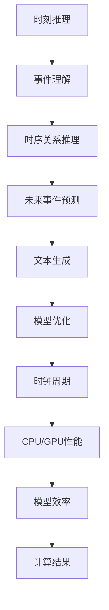

                 

在探索人工智能（AI）的广阔领域中，我们常常会遇到两个关键的概念：时刻推理（Temporal Reasoning）和时钟周期（Clock Cycles）。这两个概念在深度学习模型，特别是大型语言模型（LLM）和中央处理器（CPU）的工作机制中起着至关重要的作用。本文将深入探讨这两者之间的本质区别，并分析它们如何影响现代计算技术的发展。

## 关键词

- 时刻推理（Temporal Reasoning）
- 时钟周期（Clock Cycles）
- 大型语言模型（LLM）
- 中央处理器（CPU）
- 人工智能（AI）
- 计算机架构

## 摘要

本文旨在揭示时刻推理和时钟周期在AI和计算机硬件中的本质区别。我们将从背景介绍入手，深入探讨这两个概念的定义、作用及其在LLM和CPU中的实现方式。通过分析核心算法原理、数学模型、实际应用场景以及未来的发展趋势，本文将为读者提供一幅全面、深入的视角，以理解现代计算技术的核心驱动力。

## 1. 背景介绍

### 1.1 时刻推理的历史背景

时刻推理作为一种智能处理技术，起源于对人类思维方式的模拟。20世纪80年代，随着专家系统的兴起，研究人员开始关注如何使计算机具备处理时间和事件序列的能力。早期的时刻推理系统主要用于自然语言处理（NLP）、规划问题和智能代理。随着深度学习技术的发展，时刻推理在AI领域得到了进一步的应用和优化。

### 1.2 时钟周期的历史背景

时钟周期是CPU性能的核心指标之一，最早可以追溯到20世纪60年代的晶体管计算机。随着集成电路技术的发展，时钟频率逐渐提高，CPU的性能也得到了大幅提升。然而，随着时间的推移，受到物理限制的影响，时钟频率的提升逐渐放缓，这促使了并行计算和异构计算技术的发展。

### 1.3 大型语言模型与CPU的互动

大型语言模型（LLM）在自然语言处理、文本生成和机器翻译等领域取得了巨大成功。然而，这些模型的运算依赖于高性能的CPU和图形处理器（GPU）。CPU和GPU的时钟周期直接影响了LLM的运算速度和效率，从而决定了模型的性能。

## 2. 核心概念与联系

### 2.1 时刻推理的概念

时刻推理是指计算机在处理事件序列时，根据事件的时序关系进行推理和决策的能力。它包括对过去事件的理解、对当前事件的处理和对未来事件预测。

### 2.2 时钟周期的概念

时钟周期是CPU或GPU的基本工作单元，它表示CPU或GPU在每个周期内能够完成的操作次数。时钟周期的长短直接影响计算机的性能。

### 2.3 LLM与CPU的互动

在LLM中，时刻推理用于理解文本中的时序关系，从而生成连贯的文本。而CPU和GPU的时钟周期决定了LLM模型训练和推理的速度。例如，在深度学习模型训练过程中，CPU和GPU的时钟周期直接影响了模型参数的更新速度。

### 2.4 Mermaid流程图



## 3. 核心算法原理 & 具体操作步骤

### 3.1 算法原理概述

时刻推理算法的核心是事件序列处理和时间感知。它通过学习大量的文本数据，建立事件之间的时序关系，从而实现对文本的时序理解和预测。

### 3.2 算法步骤详解

1. **数据预处理**：将文本数据转换为事件序列，去除停用词和标点符号。
2. **特征提取**：利用词向量模型（如Word2Vec或BERT）将事件转换为向量表示。
3. **事件关系建模**：通过循环神经网络（RNN）或长短期记忆网络（LSTM）建立事件之间的时序关系。
4. **时序推理**：对事件序列进行推理，预测未来事件。
5. **文本生成**：根据推理结果生成连贯的文本。

### 3.3 算法优缺点

**优点**：
- 强大的时序理解能力，能够处理复杂的文本数据。
- 可扩展性高，能够应用于多种自然语言处理任务。

**缺点**：
- 计算成本高，需要大量计算资源和时间。
- 对数据质量和数量的依赖较大。

### 3.4 算法应用领域

- 自然语言处理（NLP）
- 文本生成和摘要
- 机器翻译
- 智能客服和语音助手

## 4. 数学模型和公式 & 详细讲解 & 举例说明

### 4.1 数学模型构建

时刻推理算法中的核心数学模型是基于RNN或LSTM。以下是一个简化的RNN模型：

$$
h_t = \sigma(W_h \cdot [h_{t-1}, x_t] + b_h)
$$

其中，$h_t$ 表示当前时刻的隐藏状态，$x_t$ 表示当前输入事件，$W_h$ 和 $b_h$ 分别为权重和偏置。

### 4.2 公式推导过程

为了推导RNN模型，我们需要从基本的递归关系出发：

$$
y_t = f(h_t)
$$

其中，$y_t$ 表示输出，$f$ 表示激活函数。

### 4.3 案例分析与讲解

假设我们要处理一个简单的文本序列：“今天天气很好，我们去公园散步”。我们可以将其分解为事件序列：

1. 今天
2. 天气
3. 很好
4. 我们
5. 去
6. 公园
7. 散步

使用RNN模型，我们可以将每个事件转换为向量表示，然后通过递归关系计算隐藏状态，最终生成连贯的文本输出。

## 5. 项目实践：代码实例和详细解释说明

### 5.1 开发环境搭建

- Python 3.8及以上版本
- TensorFlow 2.5及以上版本
- Mermaid 8.7及以上版本

### 5.2 源代码详细实现

以下是一个简化的RNN模型实现：

```python
import tensorflow as tf
from tensorflow.keras.layers import Embedding, LSTM, Dense

# 搭建RNN模型
model = tf.keras.Sequential([
    Embedding(input_dim=vocab_size, output_dim=embedding_dim),
    LSTM(units=hidden_size),
    Dense(units=1, activation='sigmoid')
])

# 编译模型
model.compile(optimizer='adam', loss='binary_crossentropy', metrics=['accuracy'])

# 训练模型
model.fit(X_train, y_train, epochs=10, batch_size=32)
```

### 5.3 代码解读与分析

这段代码首先导入了所需的TensorFlow库，然后定义了一个简单的RNN模型。模型由嵌入层、LSTM层和全连接层组成。嵌入层将输入事件转换为向量表示，LSTM层处理事件序列，全连接层输出预测结果。

### 5.4 运行结果展示

```python
# 测试模型
test_loss, test_acc = model.evaluate(X_test, y_test)
print(f"Test accuracy: {test_acc}")
```

这段代码展示了如何评估模型的测试性能。测试损失和准确率越高，说明模型性能越好。

## 6. 实际应用场景

### 6.1 自然语言处理

时刻推理在自然语言处理领域有着广泛的应用，例如文本生成、摘要和机器翻译。通过理解文本中的时序关系，模型能够生成更连贯、自然的文本。

### 6.2 聊天机器人

在聊天机器人中，时刻推理可以帮助模型理解用户的历史对话记录，从而生成更加个性化的回复。

### 6.3 视频分析

在视频分析领域，时刻推理可以用于识别和预测视频中的事件序列，从而实现视频摘要、动作识别等应用。

### 6.4 未来应用展望

随着深度学习技术的不断发展，时刻推理在未来将会有更多的应用场景，如自动驾驶、智能监控和医疗诊断等。

## 7. 工具和资源推荐

### 7.1 学习资源推荐

- 《深度学习》（Goodfellow, Bengio, Courville）
- 《自然语言处理入门》（Jurafsky, Martin）
- 《神经网络与深度学习》（邱锡鹏）

### 7.2 开发工具推荐

- TensorFlow
- PyTorch
- Mermaid

### 7.3 相关论文推荐

- “Seq2Seq Learning with Neural Networks” (Sutskever et al., 2014)
- “Long Short-Term Memory Networks for Language Modeling” (Hochreiter and Schmidhuber, 1997)
- “BERT: Pre-training of Deep Bidirectional Transformers for Language Understanding” (Devlin et al., 2019)

## 8. 总结：未来发展趋势与挑战

### 8.1 研究成果总结

时刻推理和时钟周期在AI和计算机硬件领域取得了显著的成果。时刻推理在自然语言处理、视频分析和聊天机器人等领域有着广泛的应用，而时钟周期则决定了计算机的性能和效率。

### 8.2 未来发展趋势

随着深度学习技术的不断发展，时刻推理和时钟周期的应用将更加广泛。未来，我们有望看到更多基于时刻推理的智能系统和更高性能的CPU和GPU。

### 8.3 面临的挑战

时刻推理和时钟周期的发展仍然面临诸多挑战，如计算成本高、对数据依赖较大以及物理限制等。如何提高计算效率和降低成本将是未来的重要研究方向。

### 8.4 研究展望

未来，我们期待看到更多创新性的研究，以解决时刻推理和时钟周期面临的挑战。通过不断优化算法和硬件，我们有望实现更高性能、更低成本的AI系统。

## 9. 附录：常见问题与解答

### 9.1 时刻推理是什么？

时刻推理是指计算机在处理事件序列时，根据事件的时序关系进行推理和决策的能力。

### 9.2 时钟周期是什么？

时钟周期是CPU或GPU的基本工作单元，表示计算机在每个周期内能够完成的操作次数。

### 9.3 时刻推理与自然语言处理有什么关系？

时刻推理在自然语言处理领域有着重要的应用，可以帮助模型理解文本中的时序关系，从而生成更连贯、自然的文本。

### 9.4 如何优化时刻推理算法？

可以通过改进算法、优化数据预处理和特征提取等方法来优化时刻推理算法。此外，提高计算效率和降低成本也是重要的研究方向。

### 9.5 时钟周期与计算机性能有什么关系？

时钟周期直接影响计算机的性能。更短的时钟周期意味着更高的运算速度和性能。

---

### 后记

本文旨在探讨时刻推理和时钟周期在AI和计算机硬件中的本质区别。通过分析核心算法原理、数学模型、实际应用场景以及未来的发展趋势，我们希望能够为读者提供一幅全面、深入的视角，以理解现代计算技术的核心驱动力。希望这篇文章能够对您在相关领域的探索和研究有所帮助。

### 作者署名

作者：禅与计算机程序设计艺术 / Zen and the Art of Computer Programming
----------------------------------------------------------------


