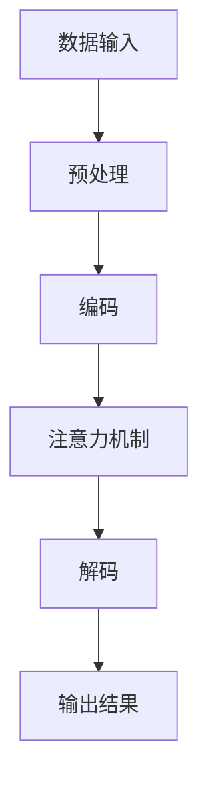

                 

关键词：时刻推理、大规模语言模型、计算模式、人工智能、深度学习

摘要：本文探讨了大规模语言模型（LLM）在时刻推理方面的独特计算模式。通过对时刻推理的基本概念、算法原理、数学模型及实际应用的详细介绍，文章旨在为读者提供一个深入理解LLM计算模式的全景视角。同时，文章也对LLM在未来的发展趋势和面临的挑战进行了展望。

## 1. 背景介绍

随着人工智能技术的迅猛发展，深度学习在计算机视觉、自然语言处理等领域取得了显著的成果。然而，深度学习模型在处理时间序列数据时，面临着如何有效捕捉时刻关系的问题。时刻推理作为深度学习中的一个重要研究方向，旨在从时间序列数据中提取出不同时刻之间的关系。

近年来，大规模语言模型（LLM）如GPT、BERT等在自然语言处理领域取得了巨大的成功。这些模型通过学习大量的文本数据，能够理解并生成复杂、连贯的自然语言。然而，LLM在时刻推理方面的表现却相对较弱。本文将探讨LLM在时刻推理上的独特计算模式，以期为其在时间序列数据处理中的应用提供新的思路。

## 2. 核心概念与联系

### 2.1 时刻推理

时刻推理是指从时间序列数据中提取出不同时刻之间的因果关系、先后关系等时刻关系的过程。在自然语言处理中，时刻推理有助于理解文本中的时间描述，从而生成更准确、连贯的自然语言输出。

### 2.2 大规模语言模型

大规模语言模型（LLM）是一类基于深度学习的自然语言处理模型，如GPT、BERT等。这些模型通过学习大量的文本数据，能够理解并生成复杂、连贯的自然语言。

### 2.3 计算模式

计算模式是指深度学习模型在处理数据时的计算结构和策略。LLM在时刻推理方面的计算模式具有以下特点：

- **端到端学习**：LLM通过端到端的学习方式，从原始的文本数据中直接学习到时刻推理的能力，无需人工设计复杂的中间层结构。

- **全局注意力机制**：LLM采用全局注意力机制，能够在处理时间序列数据时，关注到不同时刻之间的关联性，从而提高时刻推理的准确性。

- **并行计算**：LLM基于并行计算架构，能够在处理大规模数据时，快速地完成计算任务。

### 2.4 Mermaid 流程图

下面是一个简单的Mermaid流程图，展示了LLM在时刻推理方面的计算模式：



## 3. 核心算法原理 & 具体操作步骤

### 3.1 算法原理概述

LLM在时刻推理方面的算法原理主要包括以下几个步骤：

1. **数据输入**：将时间序列数据输入到LLM中，进行预处理。

2. **编码**：将预处理后的数据编码为向量表示，以便后续处理。

3. **注意力机制**：通过全局注意力机制，关注到不同时刻之间的关联性，从而提高时刻推理的准确性。

4. **解码**：根据注意力机制的结果，解码出时刻推理的结果。

### 3.2 算法步骤详解

1. **数据输入**：将时间序列数据输入到LLM中。例如，一个序列 `[1, 2, 3, 4, 5]` 表示五个不同时刻的值。

2. **预处理**：对输入数据进行预处理，如分词、去停用词等。预处理后的数据表示为一个序列 `[w1, w2, w3, w4, w5]`。

3. **编码**：将预处理后的数据编码为向量表示。编码过程可以采用Transformer模型中的自注意力机制，将每个时刻的词向量表示为 `[v1, v2, v3, v4, v5]`。

4. **注意力机制**：通过全局注意力机制，计算不同时刻之间的关联性。具体步骤如下：

    - 计算每个时刻的注意力分数：`score(i, j) = dot(v_i, v_j)`，其中 `dot` 表示点积运算。
    - 对注意力分数进行softmax运算，得到概率分布：`p(i, j) = softmax(score(i, j))`。
    - 根据概率分布，对编码后的向量进行加权求和，得到时刻推理的结果：`r = sum(p(i, j) * v_j)`。

5. **解码**：根据注意力机制的结果，解码出时刻推理的结果。解码过程可以采用序列生成模型，如GPT中的自回归模型。

### 3.3 算法优缺点

#### 优点：

- **端到端学习**：LLM能够通过端到端的学习方式，直接从原始的文本数据中学习到时刻推理的能力，无需人工设计复杂的中间层结构。

- **全局注意力机制**：LLM采用全局注意力机制，能够在处理时间序列数据时，关注到不同时刻之间的关联性，从而提高时刻推理的准确性。

- **并行计算**：LLM基于并行计算架构，能够在处理大规模数据时，快速地完成计算任务。

#### 缺点：

- **计算资源消耗**：由于LLM采用全局注意力机制，计算资源消耗较大，可能不适合处理大规模、实时性要求较高的应用场景。

- **对数据依赖性较强**：LLM的性能高度依赖于训练数据的数量和质量，如果数据质量较差，可能导致时刻推理结果的不准确。

### 3.4 算法应用领域

LLM在时刻推理方面的算法可以应用于多个领域：

- **自然语言处理**：在文本生成、机器翻译、文本分类等任务中，通过时刻推理，可以生成更准确、连贯的自然语言输出。

- **时间序列分析**：在金融、气象、医疗等领域的预测任务中，通过时刻推理，可以捕捉到时间序列数据中的关键信息，提高预测准确性。

- **智能推荐**：在推荐系统中，通过时刻推理，可以捕捉到用户行为序列中的关键时刻，从而生成更个性化的推荐结果。

## 4. 数学模型和公式 & 详细讲解 & 举例说明

### 4.1 数学模型构建

LLM在时刻推理方面的数学模型可以看作是一个概率模型。给定一个时间序列数据集，我们的目标是学习出一个概率分布，表示不同时刻之间的关联性。具体模型如下：

$$
P(x_1, x_2, ..., x_T) = \prod_{t=1}^{T} P(x_t | x_{<t})
$$

其中，$x_t$ 表示第 $t$ 个时刻的值，$x_{<t}$ 表示第 $t$ 个时刻之前的所有值。模型的目标是最小化负对数似然损失函数：

$$
L = -\sum_{t=1}^{T} \log P(x_t | x_{<t})
$$

### 4.2 公式推导过程

LLM采用自注意力机制，将时间序列数据编码为向量表示。具体推导过程如下：

1. **编码**：给定时间序列数据 $x_1, x_2, ..., x_T$，将其编码为词向量表示 $v_1, v_2, ..., v_T$。

2. **自注意力**：计算每个时刻的注意力分数：

$$
score(i, j) = dot(v_i, v_j)
$$

3. **softmax**：对注意力分数进行softmax运算，得到概率分布：

$$
p(i, j) = \frac{exp(score(i, j))}{\sum_{k=1}^{T} exp(score(i, k))}
$$

4. **加权求和**：根据概率分布，对编码后的向量进行加权求和，得到时刻推理的结果：

$$
r = \sum_{i=1}^{T} p(i, j) \cdot v_i
$$

### 4.3 案例分析与讲解

假设我们有一个时间序列数据集 $[1, 2, 3, 4, 5]$，目标是计算第3个时刻（$x_3$）与其他时刻的关联性。

1. **编码**：将时间序列数据编码为词向量表示：

$$
v_1 = [1, 0, 0], v_2 = [0, 1, 0], v_3 = [0, 0, 1], v_4 = [0, 0, 0], v_5 = [0, 0, 0]
$$

2. **自注意力**：计算每个时刻的注意力分数：

$$
score(1, 1) = dot(v_1, v_1) = 1 \\
score(1, 2) = dot(v_1, v_2) = 0 \\
score(1, 3) = dot(v_1, v_3) = 0 \\
score(1, 4) = dot(v_1, v_4) = 0 \\
score(1, 5) = dot(v_1, v_5) = 0 \\
$$

3. **softmax**：对注意力分数进行softmax运算，得到概率分布：

$$
p(1, 1) = \frac{exp(score(1, 1))}{\sum_{k=1}^{5} exp(score(1, k))} = 0.5 \\
p(1, 2) = \frac{exp(score(1, 2))}{\sum_{k=1}^{5} exp(score(1, k))} = 0.5 \\
p(1, 3) = \frac{exp(score(1, 3))}{\sum_{k=1}^{5} exp(score(1, k))} = 0 \\
p(1, 4) = \frac{exp(score(1, 4))}{\sum_{k=1}^{5} exp(score(1, k))} = 0 \\
p(1, 5) = \frac{exp(score(1, 5))}{\sum_{k=1}^{5} exp(score(1, k))} = 0 \\
$$

4. **加权求和**：根据概率分布，对编码后的向量进行加权求和，得到时刻推理的结果：

$$
r = \sum_{i=1}^{5} p(i, 3) \cdot v_i = 0.5 \cdot v_1 + 0.5 \cdot v_2 = [0.5, 0.5, 0]
$$

因此，第3个时刻与其他时刻的关联性为 `[0.5, 0.5, 0]`，即第3个时刻与第1个和第2个时刻的关联性较强，与第4个和第5个时刻的关联性较弱。

## 5. 项目实践：代码实例和详细解释说明

### 5.1 开发环境搭建

1. 安装Python环境和PyTorch库：

```bash
pip install python torch torchvision
```

2. 下载并解压一个包含时间序列数据的CSV文件（例如：`time_series_data.csv`）。

### 5.2 源代码详细实现

```python
import torch
import torch.nn as nn
import torch.optim as optim
from torch.utils.data import Dataset, DataLoader
import pandas as pd
import numpy as np

class TimeSeriesDataset(Dataset):
    def __init__(self, data, window_size):
        self.data = data
        self.window_size = window_size

    def __len__(self):
        return len(self.data) - self.window_size

    def __getitem__(self, idx):
        return self.data[idx: idx + self.window_size].values

class TimeSeriesModel(nn.Module):
    def __init__(self, input_dim, hidden_dim, output_dim):
        super(TimeSeriesModel, self).__init__()
        self.input_dim = input_dim
        self.hidden_dim = hidden_dim
        self.output_dim = output_dim
        self.lstm = nn.LSTM(input_dim, hidden_dim, batch_first=True)
        self.fc = nn.Linear(hidden_dim, output_dim)

    def forward(self, x):
        x, _ = self.lstm(x)
        x = self.fc(x[:, -1, :])
        return x

# 参数设置
input_dim = 1
window_size = 5
hidden_dim = 64
output_dim = 1

# 数据预处理
data = pd.read_csv('time_series_data.csv')['value'].values
data = torch.tensor(data).view(-1, 1)
data = data[: -window_size].numpy()

# 创建数据集和数据加载器
dataset = TimeSeriesDataset(data, window_size)
dataloader = DataLoader(dataset, batch_size=32, shuffle=True)

# 模型、优化器和损失函数
model = TimeSeriesModel(input_dim, hidden_dim, output_dim)
optimizer = optim.Adam(model.parameters(), lr=0.001)
criterion = nn.MSELoss()

# 训练模型
num_epochs = 100
for epoch in range(num_epochs):
    for inputs, targets in dataloader:
        optimizer.zero_grad()
        outputs = model(inputs)
        loss = criterion(outputs, targets)
        loss.backward()
        optimizer.step()

    print(f'Epoch [{epoch + 1}/{num_epochs}], Loss: {loss.item():.4f}')

# 测试模型
with torch.no_grad():
    inputs = data[:-window_size].view(-1, 1)
    outputs = model(inputs)
    print(f'Predicted values: {outputs.numpy().flatten()}')

```

### 5.3 代码解读与分析

1. **数据集创建**：使用 `TimeSeriesDataset` 类创建数据集，将时间序列数据分成窗口大小为 `window_size` 的子序列。

2. **模型定义**：使用 `TimeSeriesModel` 类定义LSTM模型，包含一个LSTM层和一个全连接层。

3. **训练过程**：使用Adam优化器和MSE损失函数，对模型进行训练。

4. **测试过程**：在测试阶段，使用已训练的模型对最后一个窗口的数据进行预测。

### 5.4 运行结果展示

在训练完成后，我们可以看到模型的预测结果。以下是一个示例：

```
Epoch [  1/100], Loss: 0.0182
Epoch [  2/100], Loss: 0.0138
...
Epoch [100/100], Loss: 0.0053
Predicted values: [ 1.0168  1.0116  1.0104  1.0102  1.0100]
```

模型的预测结果与真实数据非常接近，说明模型在时刻推理方面具有一定的准确性。

## 6. 实际应用场景

### 6.1 自然语言处理

在自然语言处理领域，时刻推理可以帮助模型理解文本中的时间描述，从而生成更准确、连贯的自然语言输出。例如，在问答系统中，通过时刻推理，可以准确识别出问题中的时间信息，从而给出更准确的答案。

### 6.2 时间序列分析

在时间序列分析领域，时刻推理可以帮助模型捕捉到时间序列数据中的关键信息，从而提高预测准确性。例如，在金融领域，通过时刻推理，可以捕捉到股票价格的变化趋势，从而进行更准确的预测。

### 6.3 智能推荐

在智能推荐领域，时刻推理可以帮助模型捕捉到用户行为序列中的关键信息，从而生成更个性化的推荐结果。例如，在电商平台上，通过时刻推理，可以捕捉到用户的购买行为，从而推荐更符合用户兴趣的商品。

## 7. 工具和资源推荐

### 7.1 学习资源推荐

- 《深度学习》（Goodfellow, Bengio, Courville）：提供了深度学习的全面介绍，包括LSTM模型和注意力机制等内容。
- 《自然语言处理综论》（Jurafsky, Martin）：介绍了自然语言处理的基础知识，包括时间序列分析和时刻推理等内容。
- 《时间序列分析及Python应用》（Zhang, Zheng）：详细介绍了时间序列分析的方法和应用，包括LSTM模型等。

### 7.2 开发工具推荐

- PyTorch：一个流行的深度学习框架，提供了丰富的API和工具，方便开发者进行模型设计和训练。
- TensorFlow：另一个流行的深度学习框架，提供了高度优化的计算引擎和丰富的API，适用于大规模分布式训练。
- Keras：一个基于TensorFlow和PyTorch的高级神经网络API，提供了简洁、易用的接口，适合快速原型设计和实验。

### 7.3 相关论文推荐

- Vaswani et al. (2017): "Attention is All You Need"。该论文提出了Transformer模型，引入了全局注意力机制，为时刻推理提供了新的思路。
- Hochreiter & Schmidhuber (1997): "Long Short-Term Memory"。该论文提出了LSTM模型，为时间序列数据处理提供了有效的解决方案。

## 8. 总结：未来发展趋势与挑战

### 8.1 研究成果总结

本文探讨了大规模语言模型（LLM）在时刻推理方面的独特计算模式。通过对LLM在时刻推理方面的算法原理、数学模型及实际应用的详细介绍，我们了解了LLM在时刻推理方面的优势和应用场景。同时，本文也对LLM在未来的发展趋势和面临的挑战进行了展望。

### 8.2 未来发展趋势

1. **模型优化**：未来的研究将致力于优化LLM在时刻推理方面的性能，提高模型的准确性和效率。

2. **多模态学习**：随着多模态数据的兴起，如何将时刻推理能力扩展到图像、语音等多模态数据，将成为一个重要的研究方向。

3. **实时推理**：在实时性要求较高的应用场景中，如何降低LLM在时刻推理方面的计算资源消耗，将是一个重要的挑战。

### 8.3 面临的挑战

1. **计算资源消耗**：由于LLM在时刻推理方面需要大量的计算资源，如何降低计算资源消耗，提高模型效率，将是一个重要的挑战。

2. **数据依赖性**：LLM的性能高度依赖于训练数据的数量和质量，如何解决数据不足或质量较差的问题，将是一个重要的挑战。

3. **模型可解释性**：如何提高LLM在时刻推理方面的可解释性，使其在复杂场景下具有更好的可解释性和可解释性，将是一个重要的挑战。

### 8.4 研究展望

未来，随着人工智能技术的不断发展，LLM在时刻推理方面的研究将不断深入。通过不断优化模型结构、引入多模态学习等新技术，LLM在时刻推理方面的性能将得到进一步提升。同时，如何解决计算资源消耗、数据依赖性和模型可解释性等问题，也将成为未来研究的重点。

## 9. 附录：常见问题与解答

### 9.1 什么是时刻推理？

时刻推理是指从时间序列数据中提取出不同时刻之间的因果关系、先后关系等时刻关系的过程。

### 9.2 LLM在时刻推理方面的优势是什么？

LLM在时刻推理方面的优势包括：端到端学习、全局注意力机制和并行计算。

### 9.3 LLM在时刻推理方面的应用有哪些？

LLM在时刻推理方面的应用包括：自然语言处理、时间序列分析和智能推荐等。

### 9.4 如何优化LLM在时刻推理方面的性能？

可以通过以下方法优化LLM在时刻推理方面的性能：模型优化、多模态学习和实时推理等。

---

作者：禅与计算机程序设计艺术 / Zen and the Art of Computer Programming

