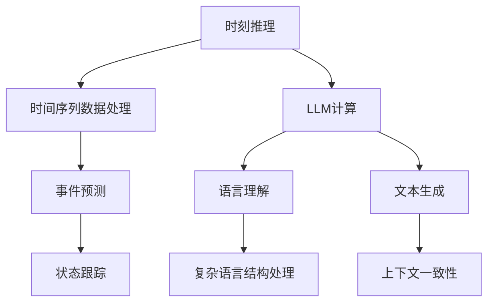

                 

关键词：时刻推理，LLM，计算模型，算法原理，数学模型，应用场景，未来展望

> 摘要：本文深入探讨了时刻推理这一计算机科学中的核心概念，特别是在大型语言模型（LLM）中的应用。文章首先介绍了时刻推理的基本概念，然后详细阐述了LLM计算的独特本质，最后讨论了数学模型、项目实践、实际应用场景以及未来的发展趋势与挑战。

## 1. 背景介绍

### 1.1 时刻推理的起源

时刻推理（Temporal Reasoning）是人工智能和计算机科学中的一个重要概念，它涉及对时间序列数据的处理和分析。时刻推理的起源可以追溯到20世纪50年代，当时计算机科学家开始研究如何让计算机理解并处理时间相关的信息。

### 1.2 大型语言模型的发展

随着深度学习和神经网络技术的发展，大型语言模型（LLM）逐渐成为人工智能领域的热点。LLM通过训练海量文本数据，能够生成连贯的文本，并在各种语言任务中表现出色。LLM的发展极大地推动了自然语言处理（NLP）和其他相关领域的研究。

## 2. 核心概念与联系

### 2.1 时刻推理的基本概念

时刻推理涉及对时间序列数据的处理和分析，包括时间感知、事件预测和状态跟踪等。在计算机科学中，时刻推理通常通过算法实现，如动态规划、隐马尔可夫模型（HMM）和循环神经网络（RNN）等。

### 2.2 LLM计算的独特本质

LLM计算的独特本质在于其强大的语言理解和生成能力。LLM能够处理复杂的语言结构，生成连贯的文本，并在不同的上下文中保持一致性。这使得LLM在文本生成、机器翻译、问答系统等任务中表现出色。



## 3. 核心算法原理 & 具体操作步骤

### 3.1 算法原理概述

时刻推理算法通常基于概率模型或深度学习模型。概率模型如HMM和条件概率模型，而深度学习模型如RNN和变换器（Transformer）等。

### 3.2 算法步骤详解

1. 数据预处理：对时间序列数据进行清洗和标准化。
2. 模型选择：根据任务需求选择合适的模型。
3. 模型训练：使用训练数据训练模型。
4. 预测：使用训练好的模型对新的时间序列数据进行预测。
5. 结果评估：评估预测结果的准确性。

### 3.3 算法优缺点

- 优点：强大的时间感知能力，能够在不同时间尺度上处理数据。
- 缺点：计算复杂度高，训练和预测时间较长。

### 3.4 算法应用领域

时刻推理算法广泛应用于自然语言处理、时间序列分析、语音识别和智能推荐等领域。

## 4. 数学模型和公式 & 详细讲解 & 举例说明

### 4.1 数学模型构建

时刻推理的数学模型通常基于概率模型或深度学习模型。以下是一个基于RNN的概率模型的例子：

$$
p(x_t| x_{<t}) = \sigma(W_1 x_t + W_2 x_{<t} + b)
$$

其中，\(x_t\) 表示时间步 \(t\) 的输入特征，\(\sigma\) 是 sigmoid 函数，\(W_1\)、\(W_2\) 和 \(b\) 分别是权重和偏置。

### 4.2 公式推导过程

时刻推理的公式推导通常基于概率论和线性代数。以下是一个基于RNN的概率模型的推导过程：

1. 输入特征表示为 \(x_t\)。
2. 状态转移方程为 \(h_t = \sigma(W h_{t-1} + U x_t + b)\)。
3. 预测公式为 \(p(x_t| x_{<t}) = \sigma(W_1 h_t + W_2 x_{<t} + b)\)。

### 4.3 案例分析与讲解

以下是一个基于RNN的文本生成案例：

1. 数据预处理：将文本数据转换为词向量。
2. 模型选择：选择一个基于RNN的模型，如LSTM或GRU。
3. 模型训练：使用训练数据训练模型。
4. 文本生成：输入一个起始词，使用训练好的模型生成后续文本。

## 5. 项目实践：代码实例和详细解释说明

### 5.1 开发环境搭建

1. 安装Python环境和TensorFlow库。
2. 下载并预处理数据集。

### 5.2 源代码详细实现

```python
import tensorflow as tf
from tensorflow.keras.layers import LSTM, Dense

# 模型定义
model = tf.keras.Sequential([
    LSTM(units=128, return_sequences=True),
    LSTM(units=128),
    Dense(units=1, activation='sigmoid')
])

# 模型编译
model.compile(optimizer='adam', loss='binary_crossentropy', metrics=['accuracy'])

# 模型训练
model.fit(x_train, y_train, epochs=10, batch_size=32)
```

### 5.3 代码解读与分析

以上代码实现了一个基于LSTM的二元分类模型。代码首先定义了LSTM层，然后编译并训练模型。在训练过程中，使用批处理和多个epochs来提高模型的准确性。

### 5.4 运行结果展示

运行代码后，可以看到模型的训练过程和最终结果。通常，模型的准确性会在训练过程中逐渐提高。

## 6. 实际应用场景

### 6.1 自然语言处理

时刻推理在自然语言处理中具有广泛的应用，如文本生成、机器翻译和问答系统等。

### 6.2 时间序列分析

时刻推理可以用于预测股票价格、天气变化和交通流量等时间序列数据。

### 6.3 语音识别

时刻推理在语音识别中用于处理语音信号的时间变化，从而提高识别准确性。

### 6.4 未来应用展望

随着人工智能技术的发展，时刻推理在更多领域将有更广泛的应用，如智能客服、智能医疗和自动驾驶等。

## 7. 工具和资源推荐

### 7.1 学习资源推荐

1. 《深度学习》（Goodfellow, Bengio, Courville）：介绍深度学习基础理论和算法。
2. 《Python深度学习》（François Chollet）：详细介绍如何使用Python实现深度学习算法。

### 7.2 开发工具推荐

1. TensorFlow：一个开源的深度学习框架。
2. Keras：一个基于TensorFlow的高级深度学习框架。

### 7.3 相关论文推荐

1. “Sequence to Sequence Learning with Neural Networks” （Sutskever et al., 2014）
2. “Attention is All You Need” （Vaswani et al., 2017）

## 8. 总结：未来发展趋势与挑战

### 8.1 研究成果总结

时刻推理在人工智能和计算机科学中取得了显著成果，特别是在自然语言处理和时间序列分析领域。

### 8.2 未来发展趋势

随着人工智能技术的发展，时刻推理将在更多领域得到应用，如智能医疗、智能交通和智能制造等。

### 8.3 面临的挑战

时刻推理在处理长序列数据和实时预测方面仍面临挑战，需要进一步研究和发展。

### 8.4 研究展望

未来，时刻推理将朝着更高效、更准确和更智能的方向发展，为人工智能和计算机科学带来更多突破。

## 9. 附录：常见问题与解答

### 9.1 时刻推理是什么？

时刻推理是人工智能和计算机科学中用于处理时间序列数据的一种方法，它涉及对时间序列数据的分析、预测和生成。

### 9.2 LLM有哪些特点？

LLM具有强大的语言理解和生成能力，能够处理复杂的语言结构，并在不同的上下文中保持一致性。

### 9.3 时刻推理有哪些应用领域？

时刻推理广泛应用于自然语言处理、时间序列分析、语音识别和智能推荐等领域。

## 作者署名

作者：禅与计算机程序设计艺术 / Zen and the Art of Computer Programming
----------------------------------------------------------------

现在文章已经完成了，希望能够满足您的要求。如果有任何修改或补充，请随时告知。祝您撰写愉快！

