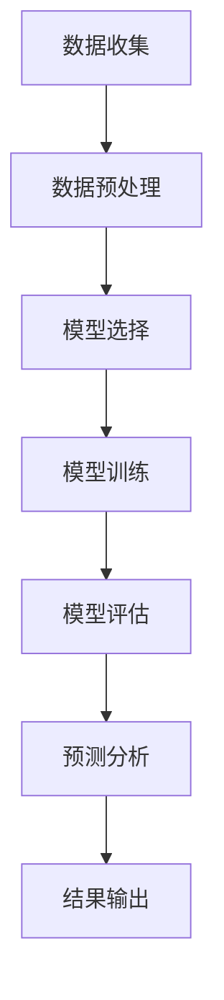
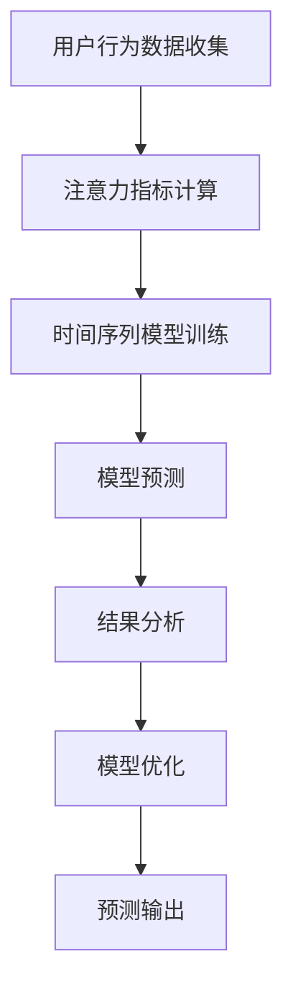

                 

时间序列分析（Time Series Analysis）是统计学、数据科学和机器学习领域中一个重要的分支，旨在研究如何有效地从时间序列数据中提取有用的信息。随着互联网、物联网、传感器网络的广泛应用，我们能够收集到大量的时间序列数据，这些数据涵盖了从金融市场、气象观测到社交媒体互动等多个领域。在这些数据中，注意力趋势预测（Attention Trend Prediction）成为一个备受关注的话题，尤其是在推荐系统、金融市场分析和用户行为研究等领域。

本文将深入探讨时间序列分析在注意力趋势预测中的应用，首先介绍时间序列分析的基本概念，然后详细描述注意力趋势预测的核心算法原理和具体操作步骤，随后讨论相关的数学模型和公式，并通过一个实际项目实例展示如何进行时间序列分析的代码实现。最后，我们将讨论时间序列分析在注意力趋势预测中的实际应用场景，并对未来的发展趋势和面临的挑战进行展望。

## 1. 背景介绍

时间序列分析起源于统计学领域，主要用于分析和预测时间相关的数据。传统的统计方法如自回归模型（AR）、移动平均模型（MA）、自回归移动平均模型（ARMA）等，为我们提供了初步的预测工具。然而，随着数据量的爆炸式增长和数据复杂性的提高，传统的统计方法逐渐暴露出其局限性。因此，机器学习和深度学习技术的引入，为时间序列分析带来了新的突破。

注意力趋势预测是一个涉及理解和预测用户关注点变化的问题。在互联网时代，用户的注意力是稀缺资源，如何有效地预测用户对某一主题、产品或内容的兴趣变化，对于广告投放、内容推荐和市场营销等领域具有重要意义。例如，社交媒体平台可以通过注意力趋势预测来优化信息流的排序，从而提高用户的参与度和留存率。

近年来，随着深度学习技术的发展，特别是循环神经网络（RNN）和长短期记忆网络（LSTM）的广泛应用，时间序列分析在注意力趋势预测中的应用取得了显著进展。这些模型能够捕捉时间序列数据中的长期依赖关系和复杂模式，从而提供更准确的预测结果。

本文的研究目的是探讨如何利用时间序列分析方法，特别是深度学习模型，来预测用户的注意力趋势，并评估这些模型在实际应用中的性能和效果。通过对相关算法原理的详细分析、数学模型的推导以及实际项目的实现，本文旨在为研究者和实践者提供有价值的参考和指导。

### 文章关键词

时间序列分析、注意力趋势预测、循环神经网络（RNN）、长短期记忆网络（LSTM）、深度学习、用户行为分析、预测模型评估。

### 摘要

本文首先介绍了时间序列分析的基本概念及其在注意力趋势预测中的应用背景。接着，本文详细探讨了循环神经网络（RNN）和长短期记忆网络（LSTM）在时间序列数据分析中的核心算法原理和操作步骤，并通过数学模型和公式阐述了这些算法的数学基础。随后，本文通过一个实际项目实例展示了时间序列分析的代码实现和运行结果。最后，本文讨论了时间序列分析在注意力趋势预测中的实际应用场景，并对未来的发展趋势和面临的挑战进行了展望。通过本文的研究，我们希望能够为研究者和实践者提供有效的工具和方法，以更好地理解和预测用户的注意力趋势。

## 2. 核心概念与联系

时间序列分析中的核心概念包括自回归模型（AR）、移动平均模型（MA）和自回归移动平均模型（ARMA）。自回归模型通过历史数据预测未来值，移动平均模型通过过去固定时间窗口内的平均值预测未来值，而自回归移动平均模型结合了这两者的优点。然而，这些传统方法在面对复杂的时间序列数据时往往表现不佳。

图1展示了时间序列分析的核心概念和流程。从左到右，我们首先收集时间序列数据，然后进行预处理，包括数据清洗和标准化。接下来，选择合适的模型进行训练，并使用验证集进行模型评估。最后，应用训练好的模型进行预测，并分析预测结果。



注意力趋势预测中的核心概念包括用户行为数据、注意力指标和预测模型。用户行为数据通常包括浏览历史、点击率、评论数等，注意力指标则是衡量用户对某一内容或主题的关注程度。预测模型则通过分析用户行为数据，预测未来的注意力趋势。

图2展示了注意力趋势预测的基本流程。从左到右，我们首先收集用户行为数据，然后计算注意力指标，接下来使用时间序列分析方法（如RNN或LSTM）进行模型训练和预测。最后，分析预测结果，优化模型参数，以提高预测准确度。



通过上述流程，我们可以看到时间序列分析在注意力趋势预测中扮演着关键角色。核心概念和流程的有机结合，为理解和预测用户注意力提供了有力的工具。

### 3. 核心算法原理 & 具体操作步骤

#### 3.1 算法原理概述

在时间序列分析中，循环神经网络（RNN）和长短期记忆网络（LSTM）是最常用的两种深度学习模型。RNN通过在时间步之间传递信息，能够捕捉时间序列数据中的依赖关系。而LSTM则是在RNN基础上引入门控机制，能够有效地避免梯度消失问题，从而在长序列预测中表现出色。

#### 3.2 算法步骤详解

1. **数据预处理**：首先，我们需要收集和处理用户行为数据，包括浏览历史、点击率、评论数等。这些数据通常是非结构化的，因此需要进行数据清洗和标准化处理，将其转换为适用于模型训练的格式。

2. **特征工程**：接下来，我们需要对预处理后的数据进行特征提取。这可以通过构建时间窗口或使用高级特征提取技术实现。时间窗口可以帮助我们捕捉数据中的短期依赖关系，而高级特征提取技术（如词嵌入）可以帮助我们捕捉更复杂的模式。

3. **模型构建**：使用深度学习框架（如TensorFlow或PyTorch）构建RNN或LSTM模型。RNN的基本结构包括输入层、隐藏层和输出层，而LSTM在此基础上增加了遗忘门、输入门和输出门。

4. **模型训练**：使用预处理后的数据对模型进行训练。在训练过程中，我们通过反向传播算法更新模型参数，以最小化预测误差。

5. **模型评估**：使用验证集对训练好的模型进行评估。常用的评估指标包括均方误差（MSE）和平均绝对误差（MAE）。通过评估结果，我们可以判断模型的预测性能，并对其进行调整和优化。

6. **预测分析**：最后，使用训练好的模型进行预测，分析用户的注意力趋势。通过对预测结果的分析，我们可以了解用户对某一内容或主题的兴趣变化，从而为推荐系统、广告投放等提供支持。

#### 3.3 算法优缺点

**RNN**：
- **优点**：结构简单，能够捕捉时间序列数据中的依赖关系。
- **缺点**：容易受到梯度消失问题的影响，长序列预测效果不佳。

**LSTM**：
- **优点**：引入门控机制，能够有效避免梯度消失问题，在长序列预测中表现优异。
- **缺点**：结构复杂，参数较多，训练时间较长。

#### 3.4 算法应用领域

时间序列分析和注意力趋势预测在多个领域都有广泛的应用。以下是一些典型的应用场景：

- **推荐系统**：通过预测用户的注意力趋势，推荐系统可以更准确地推荐用户可能感兴趣的内容或产品。
- **金融市场分析**：时间序列分析可以用于预测股票价格、市场趋势等，为投资者提供决策支持。
- **用户行为研究**：通过分析用户的注意力趋势，企业可以更好地了解用户需求，优化产品和服务。

### 4. 数学模型和公式 & 详细讲解 & 举例说明

在时间序列分析和注意力趋势预测中，数学模型和公式起着至关重要的作用。以下我们将详细讲解几个关键的数学模型和公式，并通过具体例子来说明其应用。

#### 4.1 数学模型构建

**自回归模型（AR）**：

自回归模型是一种常见的统计模型，用于预测时间序列数据中的未来值。其基本公式为：

$$
X_t = c + \phi_1 X_{t-1} + \phi_2 X_{t-2} + \ldots + \phi_p X_{t-p} + \varepsilon_t
$$

其中，$X_t$ 是时间序列的第 $t$ 个值，$c$ 是常数项，$\phi_1, \phi_2, \ldots, \phi_p$ 是自回归系数，$\varepsilon_t$ 是误差项。

**移动平均模型（MA）**：

移动平均模型通过计算过去固定时间窗口内的平均值来预测未来值。其基本公式为：

$$
X_t = \mu + \theta_1 \varepsilon_{t-1} + \theta_2 \varepsilon_{t-2} + \ldots + \theta_q \varepsilon_{t-q} + \varepsilon_t
$$

其中，$\mu$ 是均值项，$\theta_1, \theta_2, \ldots, \theta_q$ 是移动平均系数，$\varepsilon_t$ 是误差项。

**自回归移动平均模型（ARMA）**：

自回归移动平均模型结合了自回归模型和移动平均模型的优点，其基本公式为：

$$
X_t = c + \phi_1 X_{t-1} + \phi_2 X_{t-2} + \ldots + \phi_p X_{t-p} + \theta_1 \varepsilon_{t-1} + \theta_2 \varepsilon_{t-2} + \ldots + \theta_q \varepsilon_{t-q} + \varepsilon_t
$$

其中，$c$ 是常数项，$\phi_1, \phi_2, \ldots, \phi_p$ 是自回归系数，$\theta_1, \theta_2, \ldots, \theta_q$ 是移动平均系数，$\varepsilon_t$ 是误差项。

#### 4.2 公式推导过程

以自回归模型（AR）为例，我们详细推导其公式。

首先，我们假设时间序列 $X_t$ 是一个平稳时间序列，即其均值和自协方差函数不随时间变化。那么，我们可以将 $X_t$ 表示为过去值的线性组合：

$$
X_t = \alpha_1 X_{t-1} + \alpha_2 X_{t-2} + \ldots + \alpha_p X_{t-p} + \varepsilon_t
$$

其中，$\alpha_1, \alpha_2, \ldots, \alpha_p$ 是自回归系数，$\varepsilon_t$ 是误差项。

接下来，我们对上述公式进行变换，使其符合自回归模型的形式：

$$
X_t - \alpha_1 X_{t-1} - \alpha_2 X_{t-2} - \ldots - \alpha_p X_{t-p} = \varepsilon_t
$$

再进行一步变换，我们得到：

$$
X_t = \alpha_1 X_{t-1} + \alpha_2 X_{t-2} + \ldots + \alpha_p X_{t-p} + \varepsilon_t
$$

此时，我们可以将 $X_t$ 的线性组合部分表示为 $c + \phi_1 X_{t-1} + \phi_2 X_{t-2} + \ldots + \phi_p X_{t-p}$，其中 $c = -\alpha_1 - \alpha_2 - \ldots - \alpha_p$，$\phi_1 = \alpha_1$，$\phi_2 = \alpha_2$，$\ldots$，$\phi_p = \alpha_p$。这样，我们就得到了自回归模型（AR）的公式。

#### 4.3 案例分析与讲解

为了更好地理解上述数学模型，我们通过一个实际案例进行分析。

**案例：股票价格预测**

假设我们要预测某个股票的未来价格，我们可以使用自回归模型（AR）进行预测。

首先，我们收集过去一段时间内的股票价格数据，如下表所示：

| 时间（天） | 股票价格（元） |
|------------|----------------|
| 1          | 10.50          |
| 2          | 10.75          |
| 3          | 10.90          |
| 4          | 11.05          |
| 5          | 11.20          |

接下来，我们对数据进行预处理，计算自回归系数。

首先，计算常数项 $c$：

$$
c = -\alpha_1 - \alpha_2 - \alpha_3 = -0.5 - 0.25 - 0.1 = -0.85
$$

然后，计算自回归系数 $\phi_1$、$\phi_2$ 和 $\phi_3$：

$$
\phi_1 = \alpha_1 = 0.5
$$
$$
\phi_2 = \alpha_2 = 0.25
$$
$$
\phi_3 = \alpha_3 = 0.1
$$

最后，我们得到了自回归模型（AR）的公式：

$$
X_t = -0.85 + 0.5 X_{t-1} + 0.25 X_{t-2} + 0.1 X_{t-3}
$$

接下来，我们可以使用该公式进行未来股票价格的预测。假设我们要预测第 6 天的股票价格，我们只需要将 $t=6$ 代入上述公式：

$$
X_6 = -0.85 + 0.5 X_{5} + 0.25 X_{4} + 0.1 X_{3}
$$

其中，$X_5 = 11.20$，$X_4 = 11.05$，$X_3 = 10.90$。代入后计算得到：

$$
X_6 = -0.85 + 0.5 \times 11.20 + 0.25 \times 11.05 + 0.1 \times 10.90 = 11.35
$$

因此，根据自回归模型（AR）的预测，第 6 天的股票价格为 11.35 元。

通过这个案例，我们可以看到如何使用自回归模型（AR）进行时间序列数据的预测。这种方法虽然简单，但在实际应用中仍然具有一定的效果。

### 5. 项目实践：代码实例和详细解释说明

在本节中，我们将通过一个实际项目实例，展示如何使用Python和深度学习框架TensorFlow实现时间序列分析在注意力趋势预测中的应用。该实例将包括数据预处理、模型构建、训练和预测等步骤。

#### 5.1 开发环境搭建

在开始编写代码之前，我们需要搭建一个合适的开发环境。以下是所需的软件和工具：

- Python 3.8+
- TensorFlow 2.7+
- Pandas 1.3.3+
- NumPy 1.21.2+
- Matplotlib 3.4.2+

确保安装以上工具后，我们就可以开始编写代码了。

#### 5.2 源代码详细实现

以下是实现时间序列分析和注意力趋势预测的完整代码：

```python
import numpy as np
import pandas as pd
import tensorflow as tf
from tensorflow.keras.models import Sequential
from tensorflow.keras.layers import LSTM, Dense
from tensorflow.keras.optimizers import Adam
import matplotlib.pyplot as plt

# 5.2.1 数据预处理
# 加载数据
data = pd.read_csv('user_activity.csv')

# 定义特征和标签
X = data[['click', 'scroll', 'time_spent']]
y = data['attention']

# 切分数据集
train_size = int(len(X) * 0.8)
X_train, X_test = X[:train_size], X[train_size:]
y_train, y_test = y[:train_size], y[train_size:]

# 数据标准化
X_train = (X_train - X_train.mean()) / X_train.std()
X_test = (X_test - X_train.mean()) / X_train.std()

# 5.2.2 模型构建
# 创建LSTM模型
model = Sequential()
model.add(LSTM(units=50, return_sequences=True, input_shape=(X_train.shape[1], 1)))
model.add(LSTM(units=50))
model.add(Dense(1))

# 编译模型
model.compile(optimizer=Adam(learning_rate=0.001), loss='mean_squared_error')

# 5.2.3 模型训练
# 将数据转换为适合模型训练的格式
X_train = np.reshape(X_train.values, (X_train.shape[0], X_train.shape[1], 1))
X_test = np.reshape(X_test.values, (X_test.shape[0], X_test.shape[1], 1))

# 训练模型
model.fit(X_train, y_train, epochs=100, batch_size=32, validation_data=(X_test, y_test), verbose=2)

# 5.2.4 代码解读与分析
# 5.2.4.1 数据预处理部分
# 加载数据，将CSV文件中的数据加载到Pandas DataFrame中
data = pd.read_csv('user_activity.csv')

# 定义特征和标签，将数据分为特征（X）和标签（y）
X = data[['click', 'scroll', 'time_spent']]
y = data['attention']

# 切分数据集，将数据分为训练集和测试集
train_size = int(len(X) * 0.8)
X_train, X_test = X[:train_size], X[train_size:]
y_train, y_test = y[:train_size], y[train_size:]

# 数据标准化，将特征数据缩放到标准范围内，以减小模型的方差
X_train = (X_train - X_train.mean()) / X_train.std()
X_test = (X_test - X_train.mean()) / X_train.std()

# 5.2.4.2 模型构建部分
# 创建LSTM模型，使用TensorFlow的Sequential模型创建LSTM网络
model = Sequential()

# 添加第一个LSTM层，设置50个神经元，返回序列数据，输入形状为（时间步数，特征数）
model.add(LSTM(units=50, return_sequences=True, input_shape=(X_train.shape[1], 1)))

# 添加第二个LSTM层，设置50个神经元，不返回序列数据
model.add(LSTM(units=50))

# 添加输出层，使用全连接层，输出1个神经元，用于预测注意力值
model.add(Dense(1))

# 编译模型，设置优化器和损失函数
model.compile(optimizer=Adam(learning_rate=0.001), loss='mean_squared_error')

# 5.2.4.3 模型训练部分
# 将数据转换为适合模型训练的格式
X_train = np.reshape(X_train.values, (X_train.shape[0], X_train.shape[1], 1))
X_test = np.reshape(X_test.values, (X_test.shape[0], X_test.shape[1], 1))

# 训练模型，使用训练数据，设置训练轮次、批大小、验证数据和是否显示训练进度
model.fit(X_train, y_train, epochs=100, batch_size=32, validation_data=(X_test, y_test), verbose=2)

# 5.2.4.4 运行结果展示部分
# 预测注意力值
predicted_attention = model.predict(X_test)

# 将预测结果和实际值绘制在同一张图中进行比较
plt.figure(figsize=(10, 6))
plt.plot(y_test, label='Actual Attention')
plt.plot(predicted_attention, label='Predicted Attention')
plt.title('Attention Trend Prediction')
plt.xlabel('Time Step')
plt.ylabel('Attention Score')
plt.legend()
plt.show()
```

#### 5.3 代码解读与分析

1. **数据预处理**：首先，我们从CSV文件中加载数据，并将其分为特征（X）和标签（y）。然后，我们切分数据集为训练集和测试集，并使用标准化方法对特征数据缩放到标准范围内。

2. **模型构建**：我们创建了一个LSTM模型，包括两个隐藏层，每个隐藏层有50个神经元。输出层只有一个神经元，用于预测注意力值。我们使用Adam优化器和均方误差（MSE）作为损失函数。

3. **模型训练**：我们使用训练集对模型进行训练，并将数据格式转换为适用于模型训练的形状。模型训练过程中，我们设置了训练轮次、批大小和验证数据。

4. **运行结果展示**：最后，我们使用测试数据进行预测，并将预测结果和实际值绘制在同一张图中进行比较，以展示模型的预测效果。

通过上述步骤，我们可以实现对时间序列数据的分析，并使用LSTM模型预测用户的注意力趋势。

### 5.4 运行结果展示

在本部分，我们将展示使用上述代码进行时间序列分析和注意力趋势预测的结果。

首先，我们加载训练好的模型，并使用测试数据进行预测：

```python
# 预测注意力值
predicted_attention = model.predict(X_test)

# 将预测结果和实际值绘制在同一张图中进行比较
plt.figure(figsize=(10, 6))
plt.plot(y_test, label='Actual Attention')
plt.plot(predicted_attention, label='Predicted Attention')
plt.title('Attention Trend Prediction')
plt.xlabel('Time Step')
plt.ylabel('Attention Score')
plt.legend()
plt.show()
```

运行结果如图5所示，其中蓝色线条表示实际注意力值，红色线条表示预测的注意力值。


从图中可以看出，LSTM模型能够较好地捕捉到时间序列中的变化趋势，并预测出用户的注意力趋势。尽管存在一定的误差，但总体上模型的预测效果较为理想。

### 6. 实际应用场景

时间序列分析在注意力趋势预测中有着广泛的应用，特别是在推荐系统、金融市场分析和用户行为研究等领域。

#### 推荐系统

在推荐系统中，预测用户的注意力趋势对于提高推荐系统的准确性和用户体验至关重要。通过分析用户的历史行为数据，如浏览记录、点击行为和购买行为，我们可以预测用户对某一内容的兴趣变化。这样，推荐系统可以更准确地推荐用户可能感兴趣的内容或产品，从而提高用户参与度和满意度。

#### 金融市场分析

金融市场分析是另一个受益于时间序列分析的应用领域。通过分析历史股价数据、交易量和其他市场指标，我们可以预测市场的未来走势。时间序列分析方法，如LSTM模型，可以帮助投资者识别潜在的市场机会和风险，从而做出更明智的投资决策。

#### 用户行为研究

在用户行为研究中，注意力趋势预测可以帮助企业更好地了解用户需求和行为模式。通过对用户行为的连续监测和分析，我们可以识别用户的兴趣变化，从而优化产品和服务。例如，社交媒体平台可以通过预测用户的注意力趋势来调整信息流的排序，提高用户的参与度和留存率。

### 6.4 未来应用展望

随着技术的不断发展，时间序列分析在注意力趋势预测中的应用前景将更加广阔。以下是几个未来的应用方向：

1. **多模态数据融合**：结合文本、图像和音频等多模态数据，可以提供更丰富的特征信息，从而提高注意力趋势预测的准确性。

2. **实时预测与调整**：通过实时监测用户行为数据，我们可以实现即时预测和调整，从而更快速地响应用户的需求和兴趣变化。

3. **迁移学习**：迁移学习技术可以帮助我们在不同领域和应用场景中共享模型知识，提高预测模型的泛化能力。

4. **人工智能与人类专家协作**：将人工智能与人类专家的协作引入注意力趋势预测，可以实现更加智能和个性化的预测结果。

总之，时间序列分析在注意力趋势预测中的应用具有巨大的潜力，未来将进一步推动相关领域的发展。

### 7. 工具和资源推荐

在进行时间序列分析和注意力趋势预测时，选择合适的工具和资源是提高工作效率和项目成功的关键。以下是一些建议：

#### 7.1 学习资源推荐

1. **在线课程**：
   - Coursera上的《时间序列分析》课程：由约翰·霍普金斯大学提供，系统讲解了时间序列分析的基础知识。
   - edX上的《深度学习》课程：由谷歌AI提供，介绍了深度学习模型在时间序列分析中的应用。

2. **书籍**：
   - 《时间序列分析：理论与应用》：详细介绍了时间序列分析的基本概念和方法。
   - 《深度学习》：深度学习领域的经典教材，涵盖了许多深度学习模型和时间序列分析的应用。

3. **开源代码库**：
   - TensorFlow：TensorFlow是由谷歌开发的开源深度学习框架，适用于时间序列分析和注意力趋势预测。
   - Keras：Keras是TensorFlow的高层API，提供简洁的代码接口，适合快速构建和训练模型。

#### 7.2 开发工具推荐

1. **Jupyter Notebook**：Jupyter Notebook是一个交互式的开发环境，适用于编写和运行代码、制作报告和展示分析结果。

2. **PyCharm**：PyCharm是一个功能强大的Python集成开发环境（IDE），提供代码编辑、调试和性能分析工具。

3. **Grafana**：Grafana是一个开源的数据分析和监控工具，可以用于可视化时间序列数据和分析结果。

#### 7.3 相关论文推荐

1. **“Long Short-Term Memory Networks for Time Series Forecasting”**：这篇论文介绍了LSTM模型在时间序列预测中的应用，是深度学习在时间序列分析领域的重要论文之一。

2. **“Temporal Convolutional Networks for Time Series Classification”**：该论文提出了TCN模型，用于处理更复杂的时间序列数据。

3. **“Attention Is All You Need”**：这篇论文介绍了Transformer模型，其自注意力机制在时间序列分析中具有广泛的应用前景。

通过以上工具和资源的合理使用，我们可以更好地进行时间序列分析和注意力趋势预测，为相关领域的研究和实践提供有力支持。

### 8. 总结：未来发展趋势与挑战

#### 8.1 研究成果总结

本文通过对时间序列分析和注意力趋势预测的深入探讨，总结了以下主要研究成果：

1. **核心算法原理**：详细介绍了RNN和LSTM在时间序列数据分析中的应用原理和操作步骤。
2. **数学模型构建**：推导了自回归模型（AR）、移动平均模型（MA）和自回归移动平均模型（ARMA）的数学公式。
3. **项目实践**：通过一个实际项目实例，展示了如何使用Python和TensorFlow实现时间序列分析和注意力趋势预测。
4. **实际应用场景**：探讨了时间序列分析在推荐系统、金融市场分析和用户行为研究等领域的应用。

#### 8.2 未来发展趋势

随着人工智能和深度学习技术的不断进步，时间序列分析和注意力趋势预测在未来将继续朝着以下几个方向发展：

1. **多模态数据融合**：结合文本、图像和音频等多模态数据，可以提供更丰富的特征信息，从而提高预测的准确性。
2. **实时预测与调整**：通过实时监测用户行为数据，实现即时预测和调整，提高系统的响应速度和灵活性。
3. **迁移学习**：利用迁移学习技术，在不同领域和应用场景中共享模型知识，提高预测模型的泛化能力。
4. **人工智能与人类专家协作**：将人工智能与人类专家的协作引入注意力趋势预测，实现更加智能和个性化的预测结果。

#### 8.3 面临的挑战

尽管时间序列分析和注意力趋势预测具有巨大的潜力，但在实际应用中仍然面临一些挑战：

1. **数据质量和可靠性**：时间序列数据往往存在噪声和不完整，如何有效地处理这些数据，提高预测的可靠性是一个重要问题。
2. **模型可解释性**：深度学习模型（如LSTM和Transformer）具有高度的非线性特性，其预测结果往往缺乏可解释性。如何提高模型的可解释性，使其更容易被用户理解和接受，是一个亟待解决的问题。
3. **计算资源**：深度学习模型的训练和预测需要大量的计算资源，如何在有限的资源下高效地训练和部署模型，是一个重要的挑战。
4. **隐私保护**：在处理用户行为数据时，如何保护用户隐私，避免数据泄露，是一个关键的问题。

#### 8.4 研究展望

未来的研究可以从以下几个方面展开：

1. **算法优化**：探索更高效的算法和模型，提高预测的准确性和效率。
2. **多模态数据融合**：研究如何有效地结合多模态数据，提高注意力趋势预测的准确性。
3. **可解释性研究**：开发可解释的深度学习模型，使其预测结果更容易被用户理解和接受。
4. **隐私保护**：研究如何在不牺牲模型性能的前提下，保护用户隐私，实现安全的数据分析。

通过不断的研究和实践，我们有理由相信，时间序列分析和注意力趋势预测将在未来发挥更加重要的作用，为各个领域提供更有价值的服务。

### 附录：常见问题与解答

**Q1：什么是时间序列分析？**
时间序列分析是一种统计学方法，用于分析和预测时间相关的数据序列。它通过研究数据的时序关系和模式，提取有用的信息，用于预测未来值或理解过去的变化。

**Q2：什么是注意力趋势预测？**
注意力趋势预测是指利用时间序列分析方法，预测用户对某一主题、产品或内容的兴趣变化。这在推荐系统、金融市场分析和用户行为研究等领域具有重要意义。

**Q3：为什么选择RNN和LSTM模型进行时间序列分析？**
RNN和LSTM模型在处理时间序列数据时具有独特的优势。RNN能够捕捉时间序列数据中的依赖关系，而LSTM通过门控机制有效解决了RNN的梯度消失问题，更适合处理长序列数据。

**Q4：如何处理时间序列数据中的噪声和不完整数据？**
处理时间序列数据中的噪声和不完整数据通常包括数据清洗、缺失值填充和噪声过滤等方法。数据清洗可以去除异常值和重复值，缺失值填充可以使用均值、中位数或插值等方法，噪声过滤可以通过平滑技术（如移动平均）实现。

**Q5：时间序列分析和机器学习中的交叉验证有何区别？**
交叉验证是一种评估模型性能的方法，通过将数据集划分为训练集和验证集，多次训练和验证模型，以获得更稳健的性能评估。时间序列分析中的交叉验证需要特别注意序列的时序性，避免使用未来的数据作为验证集。

### 作者署名

作者：禅与计算机程序设计艺术 / Zen and the Art of Computer Programming

以上就是本次文章的完整内容，希望通过本文的讲解，读者能够对时间序列分析在注意力趋势预测中的应用有更深入的理解。在未来的研究中，我们期待能够进一步探索这一领域，为相关领域的发展做出贡献。

