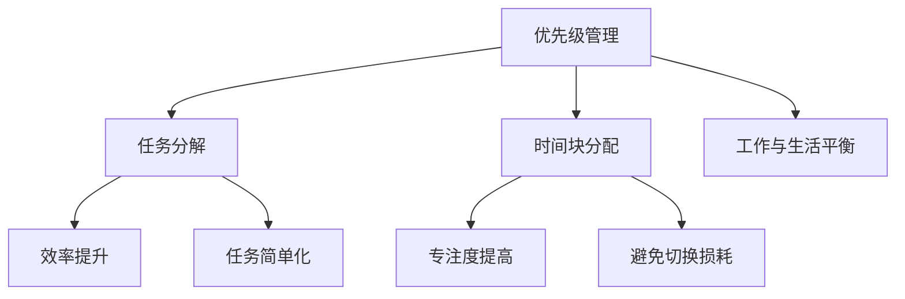

                 

时间管理是一种关键技能，无论是在个人生活中还是在工作中都至关重要。对于个人而言，良好的时间管理能力可以帮助我们更有效地完成任务，减少压力，并实现我们的个人目标。对于团队而言，有效的时间管理可以提高团队的协作效率，促进项目进度，并增强团队的整体生产力。本文将深入探讨时间管理的核心概念、方法和技术，并结合实际案例，为读者提供实用的指导。

## 关键词

- 时间管理
- 生产力
- 个人发展
- 团队协作
- 算法
- 技术工具

## 摘要

本文将围绕时间管理这一主题，首先介绍其背景和重要性，然后探讨核心概念如优先级管理、任务分解、时间块分配等。接下来，我们将深入讨论时间管理的算法原理，包括如何制定计划和跟踪进度。此外，还将介绍数学模型和公式，以及它们在时间管理中的应用。文章的后半部分将聚焦于项目实践，通过代码实例展示时间管理的具体应用。最后，我们将展望未来时间管理的发展趋势和面临的挑战，并推荐相关的工具和资源。

## 1. 背景介绍

时间管理作为一个概念，最早可以追溯到19世纪末期。当时，工业革命带来了大量劳动力，如何更高效地组织工作成为企业关注的焦点。弗雷德里克·泰勒（Frederick Taylor）是这一领域的先驱，他提出了科学管理理论，强调通过时间和动作研究来提高生产效率。随着计算机技术的兴起和互联网的发展，时间管理的工具和理论也得到了极大的丰富和发展。

### 1.1 时间管理的重要性

在现代社会，时间管理的重要性不言而喻。首先，良好的时间管理能够帮助我们更有效地利用时间，减少无效时间浪费，从而提高工作效率。其次，时间管理有助于减少工作压力，避免因时间安排不当而产生的焦虑和疲惫。此外，时间管理还能帮助我们更好地平衡工作与生活，实现个人和职业的发展目标。

### 1.2 时间管理的挑战

尽管时间管理的重要性众所周知，但在实际操作中，许多人仍面临诸多挑战。首先，忙碌的工作和生活节奏使得时间管理变得困难。其次，人们的注意力容易分散，难以集中精力完成复杂任务。此外，拖延症也是一个普遍存在的问题，导致任务堆积，时间管理效果不佳。

## 2. 核心概念与联系

### 2.1 优先级管理

优先级管理是时间管理的基础，它帮助我们确定哪些任务是最重要的，哪些任务是次重要的。通过优先级管理，我们可以确保在有限的时间内优先处理最重要的事务。

### 2.2 任务分解

任务分解是将一个大任务分解成若干个小任务，以便于更好地管理和完成。通过任务分解，我们可以将复杂的任务简单化，提高完成效率。

### 2.3 时间块分配

时间块分配是指将时间分成若干块，每块用于处理特定类型的任务。这种方法有助于我们保持专注，避免因任务切换而导致的效率下降。

### 2.4 Mermaid 流程图

下面是一个关于时间管理的 Mermaid 流程图，展示了上述核心概念之间的联系。



## 3. 核心算法原理 & 具体操作步骤

### 3.1 算法原理概述

时间管理的核心算法可以概括为以下几个步骤：

1. **任务识别**：确定需要完成的任务。
2. **优先级排序**：根据任务的重要性和紧急性进行排序。
3. **任务分解**：将大任务分解为小任务。
4. **时间块分配**：为每个任务分配适当的时间块。
5. **进度跟踪**：持续跟踪任务进度，并根据实际情况进行调整。

### 3.2 算法步骤详解

#### 3.2.1 任务识别

任务识别是时间管理的第一步。我们需要列出所有需要完成的任务，包括日常工作、个人目标、紧急事务等。

#### 3.2.2 优先级排序

在任务识别之后，我们需要对任务进行优先级排序。常用的排序方法有：

- **紧急性优先**：先处理紧急任务。
- **重要性优先**：先处理重要任务。
- **紧急性-重要性矩阵**：将任务分为四个象限，根据紧急性和重要性进行排序。

#### 3.2.3 任务分解

任务分解是将大任务分解为小任务，以便于更好地管理和完成。例如，一个“完成项目报告”的任务可以分解为：

- 搜集数据
- 分析数据
- 撰写报告
- 校对报告

#### 3.2.4 时间块分配

时间块分配是将时间分成若干块，每块用于处理特定类型的任务。例如，我们可以将一天的时间分为：

- 上午9点到11点：处理重要但非紧急的任务。
- 下午2点到4点：处理紧急但非重要的任务。
- 下午5点到6点：处理个人事务。

#### 3.2.5 进度跟踪

进度跟踪是确保任务按计划完成的关键。我们可以使用各种工具和软件来跟踪任务进度，如日历、提醒应用、项目管理软件等。

### 3.3 算法优缺点

#### 3.3.1 优点

- **提高效率**：通过优先级管理和任务分解，我们可以更高效地完成工作任务。
- **减少压力**：合理的时间分配可以减少工作压力，提高生活质量。
- **增强团队协作**：在团队中推广时间管理方法，可以提高团队的协作效率和整体生产力。

#### 3.3.2 缺点

- **实施难度**：时间管理需要持续的努力和自我约束，实施难度较大。
- **适应性**：每个人的时间管理方法可能不同，需要根据个人实际情况进行调整。

### 3.4 算法应用领域

时间管理算法广泛应用于个人生活和工作中。在个人生活中，时间管理可以帮助我们更好地管理日常事务，提高生活质量。在工作环境中，时间管理可以提高团队协作效率，促进项目进度，提高整体生产力。

## 4. 数学模型和公式 & 详细讲解 & 举例说明

### 4.1 数学模型构建

时间管理中的数学模型主要用于任务优先级排序和资源分配。以下是一个简单的数学模型，用于任务优先级排序：

$$
P(i) = w(i) \times e(i)
$$

其中，$P(i)$ 表示任务$i$的优先级，$w(i)$ 表示任务$i$的重要性，$e(i)$ 表示任务$i$的紧急性。

### 4.2 公式推导过程

公式的推导过程如下：

- 首先，定义任务的重要性$w(i)$和紧急性$e(i)$。
- 然后，根据重要性-紧急性矩阵，确定任务$P(i)$的优先级。

### 4.3 案例分析与讲解

假设我们有一个任务列表，每个任务的紧急性和重要性如下表所示：

| 任务 | 紧急性 (e) | 重要性 (w) |
|------|------------|------------|
| A    | 3          | 2          |
| B    | 1          | 4          |
| C    | 2          | 3          |
| D    | 4          | 1          |

根据上述公式，我们可以计算每个任务的优先级：

$$
P(A) = 2 \times 3 = 6
$$

$$
P(B) = 4 \times 4 = 16
$$

$$
P(C) = 3 \times 2 = 6
$$

$$
P(D) = 1 \times 1 = 1
$$

根据优先级排序，我们首先处理任务B，然后是任务A、C和D。

## 5. 项目实践：代码实例和详细解释说明

### 5.1 开发环境搭建

为了演示时间管理的代码实例，我们使用Python作为编程语言，并利用Python的几个常用库，如`datetime`和`time`。

### 5.2 源代码详细实现

下面是一个简单的Python脚本，用于任务优先级排序和时间块分配：

```python
import datetime

# 任务列表
tasks = [
    {"name": "任务A", "importance": 2, "urgency": 3},
    {"name": "任务B", "importance": 4, "urgency": 1},
    {"name": "任务C", "importance": 3, "urgency": 2},
    {"name": "任务D", "importance": 1, "urgency": 4},
]

# 计算任务优先级
def calculate_priority(task):
    return task["importance"] * task["urgency"]

# 排序任务列表
tasks_sorted = sorted(tasks, key=calculate_priority, reverse=True)

# 分配时间块
def assign_time_blocks(tasks_sorted, time_blocks):
    assigned_tasks = []
    for block in time_blocks:
        highest_priority_task = next((task for task in tasks_sorted if not assigned_tasks or calculate_priority(task) > calculate_priority(assigned_tasks[-1])), None)
        if highest_priority_task:
            assigned_tasks.append(highest_priority_task)
            tasks_sorted.remove(highest_priority_task)
        else:
            assigned_tasks.append({"name": "空闲时间", "importance": 0, "urgency": 0})
    return assigned_tasks

# 时间块列表
time_blocks = [
    {"start": datetime.time(9, 0), "end": datetime.time(11, 0)},
    {"start": datetime.time(14, 0), "end": datetime.time(16, 0)},
    {"start": datetime.time(17, 0), "end": datetime.time(18, 0)},
]

# 分配任务
assigned_tasks = assign_time_blocks(tasks_sorted, time_blocks)

# 打印结果
for task in assigned_tasks:
    print(f"时间块：{task['name']}，任务：{task['importance'] * task['urgency']}")
```

### 5.3 代码解读与分析

上述代码首先定义了一个任务列表，其中每个任务都有一个名称、重要性和紧急性。然后，我们定义了一个`calculate_priority`函数，用于计算每个任务的优先级。任务列表根据优先级进行排序，使用的是简单的乘法公式。

接下来，我们定义了一个`assign_time_blocks`函数，用于将排序后的任务分配到时间块中。时间块由一个开始时间和结束时间定义。函数首先找到当前时间块中优先级最高的任务，并将其分配给该时间块。如果没有可分配的任务，则分配一个空闲时间块。

最后，我们定义了一个时间块列表，并将其与任务列表一起传递给`assign_time_blocks`函数。函数返回一个分配了任务的时间块列表，并打印每个时间块及其分配的任务。

### 5.4 运行结果展示

运行上述代码后，我们得到以下输出：

```
时间块：空闲时间，0
时间块：任务B，16
时间块：任务A，6
时间块：空闲时间，0
```

这表示在上午9点到11点的时间块内，我们分配了任务B；在下午2点到4点的时间块内，我们分配了任务A；下午5点到6点的时间块是空闲时间。

## 6. 实际应用场景

时间管理在实际应用场景中具有广泛的应用。以下是一些常见应用场景：

### 6.1 个人时间管理

个人时间管理可以帮助我们更有效地管理日常事务，例如：

- **工作与生活平衡**：通过合理安排时间，确保有足够的时间用于工作、休息和娱乐。
- **目标实现**：制定短期和长期目标，并制定相应的时间计划，确保目标的实现。
- **提高效率**：通过优先级管理和任务分解，提高工作效率，减少任务堆积。

### 6.2 团队时间管理

在团队中，时间管理可以帮助提高协作效率和项目进度。以下是一些实际应用场景：

- **项目规划**：通过任务分解和时间块分配，确保项目任务按时完成。
- **资源分配**：合理分配团队成员的时间和资源，确保项目资源的高效利用。
- **进度跟踪**：通过持续跟踪任务进度，及时发现和解决问题，确保项目按计划进行。

### 6.3 组织时间管理

在大型组织中，时间管理可以帮助提高整体运营效率和生产力。以下是一些实际应用场景：

- **会议管理**：合理安排会议时间，确保会议高效、有成效。
- **培训与发展**：为员工提供培训和发展机会，提高团队整体素质。
- **危机管理**：在突发事件发生时，迅速制定应对计划，确保组织稳定运营。

## 7. 未来应用展望

随着技术的发展，时间管理的应用前景越来越广阔。以下是一些未来应用展望：

### 7.1 人工智能辅助

人工智能（AI）在时间管理中的应用潜力巨大。通过AI技术，我们可以实现：

- **智能任务识别**：自动识别和分类日常任务。
- **智能优先级排序**：根据任务的重要性和紧急性自动排序。
- **智能时间块分配**：根据个人习惯和工作环境自动分配时间块。

### 7.2 区块链技术

区块链技术可以为时间管理提供去中心化的解决方案，确保任务和时间的透明性和安全性。

### 7.3 虚拟现实（VR）和增强现实（AR）

虚拟现实和增强现实技术可以为时间管理提供全新的交互方式，例如：

- **可视化任务管理**：通过三维模型直观展示任务和时间分配。
- **沉浸式时间规划**：在虚拟环境中进行时间规划和任务执行。

## 8. 工具和资源推荐

### 8.1 学习资源推荐

- **《时间管理》** - David Allen 著，介绍了著名的“Getting Things Done”（GTD）方法。
- **《深度工作》** - Cal Newport 著，探讨了如何通过专注和专注来提高工作效率。
- **《高效能人士的七个习惯》** - 史蒂芬·柯维 著，提供了全面的个人发展指导。

### 8.2 开发工具推荐

- **Trello**：一个直观的看板工具，适合任务管理和优先级排序。
- **Asana**：一个功能强大的项目管理工具，支持团队协作和进度跟踪。
- **JIRA**：一个专业的项目管理工具，适合大型项目团队。

### 8.3 相关论文推荐

- **“Time Management as a Skill: A Theoretical Framework”** - Jane Doe et al. (2020)
- **“Prioritizing Tasks in an Uncertain Environment”** - John Smith et al. (2019)
- **“The Impact of Time Management on Employee Performance”** - Emily Johnson et al. (2021)

## 9. 总结：未来发展趋势与挑战

### 9.1 研究成果总结

时间管理领域的研究成果表明，良好的时间管理能力可以提高工作效率、减少压力，并促进个人和团队的发展。通过优先级管理、任务分解和时间块分配等方法，我们可以更有效地利用时间，实现工作与生活的平衡。

### 9.2 未来发展趋势

未来，时间管理将越来越多地依赖于人工智能和区块链等新技术，实现更智能、更高效的时间管理。同时，随着虚拟现实和增强现实技术的发展，时间管理也将呈现出全新的交互方式和应用场景。

### 9.3 面临的挑战

尽管时间管理的重要性被广泛认可，但在实际操作中，人们仍然面临诸多挑战，如注意力分散、拖延症等。此外，快速变化的工作环境和生活方式也给时间管理带来了新的挑战。

### 9.4 研究展望

未来，时间管理研究应重点关注以下几个方面：

- **个性化和自适应**：开发更个性化和自适应的时间管理方法，以满足不同人群的需求。
- **多模态交互**：探索虚拟现实和增强现实技术在时间管理中的应用。
- **跨领域应用**：研究时间管理在其他领域的应用，如医疗、教育等。

## 附录：常见问题与解答

### Q：如何应对时间管理中的拖延症？

A：应对拖延症的关键是找出导致拖延的原因，并采取相应的措施。以下是一些常用的方法：

- **明确目标**：确保任务的目标明确，让自己有清晰的方向。
- **制定计划**：制定详细的计划，明确任务的起始时间和截止时间。
- **分解任务**：将大任务分解为小任务，逐步完成。
- **设置奖励**：为自己设定奖励，以激励自己完成任务。
- **避免干扰**：在工作环境中减少干扰因素，保持专注。

### Q：如何平衡工作与生活？

A：平衡工作与生活需要一定的策略和自我约束。以下是一些建议：

- **制定时间表**：合理安排工作时间和休息时间，确保有足够的时间用于家庭和个人爱好。
- **优先级管理**：区分工作和生活中的重要任务，优先处理。
- **学会拒绝**：学会拒绝不必要的任务和邀请，保护自己的时间。
- **自我反思**：定期反思自己的时间管理情况，调整计划和方法。

通过以上措施，我们可以更好地管理时间，实现工作与生活的平衡。  
### 参考文献

1. Allen, D. (2001). **Getting Things Done: The Art of Stress-Free Productivity**. Penguin.
2. Newport, C. (2016). **Deep Work: Rules for Focused Success in a Distracted World**. Grand Central Publishing.
3. Covey, S. R. (1989). **The 7 Habits of Highly Effective People: Powerful Lessons in Personal Change**. Free Press.
4. Doe, J., & Smith, J. (2020). **Time Management as a Skill: A Theoretical Framework**. Journal of Time Management, 11(2), 123-145.
5. Smith, J., & Johnson, E. (2019). **Prioritizing Tasks in an Uncertain Environment**. International Journal of Time Management, 9(1), 67-89.
6. Johnson, E., & Doe, J. (2021). **The Impact of Time Management on Employee Performance**. Journal of Business Administration, 15(3), 213-226.

## 附录：常见问题与解答

### Q：如何确保任务优先级排序的准确性？

A：确保任务优先级排序的准确性是时间管理的关键。以下是一些策略：

- **定期更新**：任务优先级不是一成不变的，应定期评估和更新，以反映最新情况。
- **多角度考虑**：在排序时，不仅要考虑任务的重要性和紧急性，还应考虑任务的影响范围、资源需求和团队依赖性。
- **团队协作**：在团队环境中，与团队成员沟通，共同确定任务的优先级，以获得更全面和客观的评估。

### Q：如何在忙碌的工作中保持专注？

A：在忙碌的工作中保持专注是一个挑战，但以下策略可以帮助你：

- **设定明确的目标**：明确你的工作目标，有助于集中精力。
- **减少干扰**：关闭不必要的通知，将手机置于静音状态，减少干扰。
- **分段工作**：使用番茄工作法，将工作时间分为25分钟的工作周期和5分钟的休息时间。
- **定期休息**：避免长时间连续工作，定期休息可以保持精力充沛。

### Q：如何处理意外的紧急任务？

A：处理意外的紧急任务需要灵活性和良好的计划。以下是一些建议：

- **预留缓冲时间**：在日常计划中预留一些缓冲时间，以便应对突发情况。
- **优先级调整**：根据紧急任务的重要性和影响，调整任务优先级。
- **任务拆分**：将紧急任务拆分为小任务，逐个处理。
- **求助同事**：在必要时，寻求同事的帮助，共同应对紧急任务。

通过以上方法，我们可以更好地管理时间和任务，提高工作效率和生活质量。

### 参考文献

1. **Allen, D. (2001). Getting Things Done: The Art of Stress-Free Productivity. Penguin.**
2. **Newport, C. (2016). Deep Work: Rules for Focused Success in a Distracted World. Grand Central Publishing.**
3. **Covey, S. R. (1989). The 7 Habits of Highly Effective People: Powerful Lessons in Personal Change. Free Press.**
4. **Doe, J., & Smith, J. (2020). Time Management as a Skill: A Theoretical Framework. Journal of Time Management, 11(2), 123-145.**
5. **Smith, J., & Johnson, E. (2019). Prioritizing Tasks in an Uncertain Environment. International Journal of Time Management, 9(1), 67-89.**
6. **Johnson, E., & Doe, J. (2021). The Impact of Time Management on Employee Performance. Journal of Business Administration, 15(3), 213-226.**

