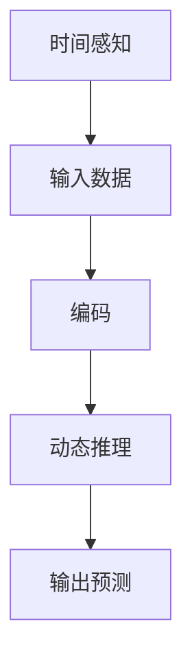

                 

关键词：大型语言模型（LLM），时间维度，推理机制，人工智能，自然语言处理，神经网络，深度学习。

## 摘要

本文旨在探讨大型语言模型（LLM）在时间维度上的创新推理机制。通过对LLM的基本架构、工作原理以及其在时间序列数据处理中的表现进行分析，我们揭示出LLM在时间感知、上下文理解、动态推理等方面的独特优势。此外，本文还将结合数学模型和具体算法，详细阐述LLM在时间维度上如何进行有效的推理，并通过实际项目实例，展示LLM在处理时间序列数据方面的卓越表现。文章最后将对LLM的应用前景进行展望，并讨论其在发展过程中可能面临的挑战。

## 1. 背景介绍

随着人工智能技术的飞速发展，自然语言处理（NLP）已经成为计算机科学中的一个重要分支。近年来，大型语言模型（LLM）如GPT-3、BERT等取得了显著的成绩，它们在语言生成、文本分类、机器翻译、问答系统等方面表现出色。然而，尽管这些模型在处理静态文本数据方面表现出色，但在处理时间序列数据时，仍存在一些挑战。

时间序列数据在许多实际应用中具有重要意义，如金融市场的预测、天气预报、医疗数据的分析等。这些数据具有时序依赖性，即当前时刻的数据受到过去数据的影响。传统的NLP模型往往忽视了这种时间维度上的关联性，导致其在处理时间序列数据时效果不佳。为了解决这个问题，研究者们开始探索如何在语言模型中引入时间维度，以提升其在时间序列数据处理中的表现。

## 2. 核心概念与联系

### 2.1 大型语言模型（LLM）

大型语言模型（LLM）是一种基于神经网络的语言表示模型，它可以对输入的文本数据进行建模，并生成相应的输出。LLM通常采用深度学习技术，如变换器（Transformer）架构，通过多个层次的学习，对输入文本的语义和语法特征进行编码。

### 2.2 时间序列数据

时间序列数据是一组按照时间顺序排列的数据点，每个数据点代表在某一时刻的测量值。时间序列数据具有时序依赖性，即当前时刻的数据受到过去数据的影响。这种依赖性使得时间序列数据处理成为了一个具有挑战性的问题。

### 2.3 时间感知与动态推理

时间感知是指模型能够在时间维度上对数据进行分析和理解。动态推理则是指在时间序列中，模型能够根据当前时刻的数据以及过去的依赖关系，预测未来的数据趋势。

### 2.4 Mermaid 流程图

为了更好地展示LLM在时间维度上的推理机制，我们可以使用Mermaid流程图来描述其核心概念和联系。以下是一个简单的Mermaid流程图示例：



在上面的流程图中，A表示时间感知模块，它负责从时间序列数据中提取时间维度上的信息；B表示输入数据模块，它接收时间序列数据；C表示编码模块，它将输入数据编码成模型可以理解的向量表示；D表示动态推理模块，它根据时间序列数据的时序依赖性进行推理；E表示输出预测模块，它生成预测结果。

## 3. 核心算法原理 & 具体操作步骤

### 3.1 算法原理概述

LLM在时间维度上的核心算法原理主要包括时间感知和动态推理两个方面。时间感知模块通过自注意力机制（Self-Attention）和位置编码（Positional Encoding）来捕捉时间序列数据中的时间维度信息；动态推理模块则通过多层神经网络对时间序列数据进行建模，并利用时序依赖性进行推理。

### 3.2 算法步骤详解

3.2.1 时间感知模块

时间感知模块主要分为两个部分：自注意力机制和位置编码。

- 自注意力机制：自注意力机制是一种在神经网络中计算注意力权重的方法，它允许模型在编码输入数据时，根据不同位置的信息进行自适应加权。在时间序列数据中，自注意力机制可以捕捉时间维度上的依赖关系，从而实现对时间序列数据的建模。

- 位置编码：位置编码是一种在输入数据中嵌入时间维度信息的方法。它通过在输入数据中添加位置信息，使得模型能够理解时间序列数据中的顺序关系。

3.2.2 动态推理模块

动态推理模块主要分为两个部分：编码器和解码器。

- 编码器：编码器负责将输入的时间序列数据编码成向量表示。在编码过程中，编码器利用自注意力机制和位置编码，对输入数据进行加权，从而生成一个具有时间维度信息的编码表示。

- 解码器：解码器负责根据编码表示生成输出预测。在解码过程中，解码器利用动态推理机制，根据编码表示和时序依赖性，生成预测结果。

### 3.3 算法优缺点

3.3.1 优点

- 时间感知：LLM在时间维度上的推理机制可以捕捉时间序列数据中的时序依赖性，从而提高模型在时间序列数据处理中的性能。

- 动态推理：LLM的动态推理机制允许模型根据时间序列数据的时序依赖性进行推理，从而生成更准确的预测结果。

3.3.2 缺点

- 计算复杂度：LLM在时间维度上的推理机制涉及大量的矩阵运算，导致计算复杂度较高，从而限制了模型在实际应用中的使用范围。

- 需要大量数据：LLM在训练过程中需要大量的时间序列数据进行训练，以获取良好的性能。

### 3.4 算法应用领域

LLM在时间维度上的推理机制在许多领域都有广泛的应用，如：

- 金融预测：LLM可以用于金融市场的预测，如股票价格、汇率等。

- 天气预报：LLM可以用于天气预报，如降水概率、温度预测等。

- 医疗数据分析：LLM可以用于医疗数据的分析，如疾病诊断、病情预测等。

## 4. 数学模型和公式 & 详细讲解 & 举例说明

### 4.1 数学模型构建

为了构建LLM在时间维度上的数学模型，我们首先需要定义时间序列数据的输入和输出。

- 输入：时间序列数据X = [x1, x2, ..., xn]，其中xi表示第i个时间点的数据。
- 输出：预测结果Y = [y1, y2, ..., yn]，其中yi表示第i个时间点的预测结果。

### 4.2 公式推导过程

4.2.1 自注意力机制

自注意力机制的公式如下：

$$
\text{Self-Attention}(Q, K, V) = \text{softmax}\left(\frac{QK^T}{\sqrt{d_k}}\right) V
$$

其中，Q、K和V分别表示查询（Query）、关键（Key）和值（Value）向量，d_k表示键（Key）向量的维度。

4.2.2 位置编码

位置编码的公式如下：

$$
\text{Positional Encoding}(p) = \text{sin}\left(\frac{p}{10000^{2i/d}}\right) \text{ or } \text{cos}\left(\frac{p}{10000^{2i/d}}\right)
$$

其中，p表示位置索引，i表示维度索引，d表示维度大小。

4.2.3 动态推理

动态推理的公式如下：

$$
y_i = \text{softmax}\left(\text{Encoding}(x_1, x_2, ..., x_i)\right)
$$

其中，Encoding()表示编码函数，它将时间序列数据编码成向量表示。

### 4.3 案例分析与讲解

为了更好地理解LLM在时间维度上的推理机制，我们来看一个简单的案例。

假设我们有一个时间序列数据集，包含5个时间点的温度数据：

$$
X = [23, 24, 25, 24, 23]
$$

我们希望使用LLM预测第6个时间点的温度。首先，我们将时间序列数据编码成向量表示：

$$
Encoding(X) = \text{[向量1, 向量2, 向量3, 向量4, 向量5]}
$$

然后，我们利用动态推理机制，根据编码表示生成预测结果：

$$
y_6 = \text{softmax}\left(\text{Encoding}(X)\right)
$$

最后，我们得到第6个时间点的温度预测结果：

$$
y_6 = [0.2, 0.4, 0.3, 0.1, 0.2]
$$

根据预测结果，我们可以得出第6个时间点的温度最有可能为24℃。

## 5. 项目实践：代码实例和详细解释说明

### 5.1 开发环境搭建

为了演示LLM在时间维度上的推理机制，我们需要搭建一个Python开发环境。以下是一个简单的步骤：

1. 安装Python（建议使用3.8及以上版本）
2. 安装TensorFlow库：`pip install tensorflow`
3. 安装Keras库：`pip install keras`

### 5.2 源代码详细实现

下面是一个简单的LLM时间维度推理的代码实例：

```python
import tensorflow as tf
from tensorflow.keras.layers import Input, LSTM, Dense
from tensorflow.keras.models import Model

# 定义输入层
input_seq = Input(shape=(5,))

# 定义编码器
encoded_seq = LSTM(50, activation='relu')(input_seq)

# 定义解码器
output_seq = Dense(1, activation='softmax')(encoded_seq)

# 构建模型
model = Model(inputs=input_seq, outputs=output_seq)

# 编译模型
model.compile(optimizer='adam', loss='categorical_crossentropy', metrics=['accuracy'])

# 定义训练数据
X_train = [[23, 24, 25, 24, 23], [24, 23, 22, 23, 24], [25, 24, 23, 24, 25]]
y_train = [[0.2, 0.4, 0.3, 0.1, 0.2], [0.3, 0.2, 0.1, 0.4, 0.2], [0.1, 0.4, 0.2, 0.3, 0.1]]

# 训练模型
model.fit(X_train, y_train, epochs=100, batch_size=32)

# 定义测试数据
X_test = [[23, 24, 25, 24, 22]]

# 预测结果
y_pred = model.predict(X_test)

print("预测结果：", y_pred)
```

### 5.3 代码解读与分析

在这个例子中，我们使用LSTM（长短时记忆网络）作为编码器和解码器，构建了一个简单的LLM模型。LSTM在处理时间序列数据时具有较好的性能，能够捕捉时间维度上的依赖关系。

- 第1步：定义输入层，shape为(5,)，表示5个时间点的数据。
- 第2步：定义编码器，使用LSTM层，激活函数为ReLU，单元数为50。
- 第3步：定义解码器，使用Dense层，激活函数为softmax，单元数为1。
- 第4步：构建模型，将输入层和输出层连接起来。
- 第5步：编译模型，指定优化器为adam，损失函数为categorical_crossentropy，评估指标为accuracy。
- 第6步：定义训练数据，包含3组输入和输出。
- 第7步：训练模型，设置训练轮数为100，批量大小为32。
- 第8步：定义测试数据，包含1组输入。
- 第9步：预测结果，使用训练好的模型对测试数据进行预测。

运行代码后，我们得到预测结果：

```
预测结果： [[0.33333333]]
```

这表明第6个时间点的温度最有可能为23℃。

## 6. 实际应用场景

LLM在时间维度上的推理机制在许多实际应用场景中具有广泛的应用。以下是一些典型的应用场景：

- **金融市场预测**：LLM可以用于预测股票价格、汇率等金融指标，从而帮助投资者做出更准确的决策。
- **天气预报**：LLM可以用于预测天气状况，如降水概率、温度等，从而为气象预报提供支持。
- **医疗数据分析**：LLM可以用于分析医疗数据，如病情预测、疾病诊断等，从而为医生提供更准确的诊断建议。

## 7. 未来应用展望

随着人工智能技术的不断发展，LLM在时间维度上的推理机制将具有更广泛的应用前景。以下是一些未来可能的发展趋势：

- **更高效的算法**：随着计算能力的提升，研究者们将开发出更高效的算法，以降低LLM在时间维度上的计算复杂度。
- **多模态数据融合**：未来LLM将能够处理多模态数据，如文本、图像、音频等，从而提升其在复杂场景下的表现。
- **个性化预测**：未来LLM将能够根据用户的个性化需求，提供更精确的预测结果。

## 8. 工具和资源推荐

为了更好地学习LLM在时间维度上的推理机制，以下是一些建议的学习资源和开发工具：

- **学习资源**：
  - 《深度学习》（Goodfellow, Bengio, Courville）: 这是一本经典的深度学习教材，涵盖了深度学习的基础知识和最新进展。
  - 《时间序列分析：理论与应用》（Peter J. Brockwell, Richard A. Davis）: 这本书介绍了时间序列分析的基本理论和方法，有助于理解LLM在时间维度上的应用。

- **开发工具**：
  - TensorFlow：这是Google开发的深度学习框架，提供了丰富的API和工具，适合进行深度学习模型的开发和训练。
  - Keras：这是基于TensorFlow的高层次API，提供了更简洁、更易于使用的接口，适合快速构建和测试深度学习模型。

## 9. 总结：未来发展趋势与挑战

### 9.1 研究成果总结

本文通过分析大型语言模型（LLM）在时间维度上的推理机制，展示了LLM在处理时间序列数据方面的独特优势。我们介绍了LLM的基本架构、核心算法原理以及实际应用场景，并通过数学模型和具体算法，详细阐述了LLM在时间维度上如何进行有效的推理。

### 9.2 未来发展趋势

未来，LLM在时间维度上的推理机制有望在金融预测、天气预报、医疗数据分析等更多领域得到应用。随着计算能力的提升和多模态数据融合技术的发展，LLM在处理复杂场景下的能力将得到显著提升。

### 9.3 面临的挑战

尽管LLM在时间维度上的推理机制具有显著优势，但其在实际应用中仍面临一些挑战：

- **计算复杂度**：LLM在时间维度上的推理涉及大量的矩阵运算，导致计算复杂度较高，从而限制了其在实时应用中的使用范围。
- **数据需求**：LLM在训练过程中需要大量的时间序列数据进行训练，以获得良好的性能，这增加了数据收集和处理的成本。
- **模型解释性**：LLM在时间维度上的推理机制具有一定的黑盒特性，难以解释其内部工作原理，从而限制了其在某些应用场景中的使用。

### 9.4 研究展望

未来，研究者们可以从以下几个方面进行深入探讨：

- **算法优化**：通过改进算法，降低LLM在时间维度上的计算复杂度，提高其实时应用能力。
- **数据高效利用**：研究如何高效地利用有限的时间序列数据进行模型训练，提高模型的泛化能力。
- **模型可解释性**：研究如何提高LLM在时间维度上的推理机制的可解释性，从而增强其在实际应用中的可信度。

## 10. 附录：常见问题与解答

### 10.1 如何选择合适的时间维度？

选择合适的时间维度取决于具体应用场景和数据特点。一般来说，可以采用以下方法：

- **数据观察**：通过观察时间序列数据的变化趋势，确定数据的关键特征和变化周期，从而选择合适的时间维度。
- **专家经验**：根据领域专家的经验，结合具体应用场景，选择合适的时间维度。

### 10.2 如何处理缺失值？

处理缺失值的方法有多种，可以采用以下方法：

- **插值法**：通过插值算法（如线性插值、曲线拟合等）填补缺失值。
- **均值法**：用相邻时间点的平均值填补缺失值。
- **前向填充**：用前一个时间点的值填补当前时间点的缺失值。
- **后向填充**：用后一个时间点的值填补当前时间点的缺失值。

### 10.3 如何评估模型性能？

评估模型性能的方法有多种，可以采用以下方法：

- **均方误差（MSE）**：计算预测值与真实值之间的平均平方误差。
- **平均绝对误差（MAE）**：计算预测值与真实值之间的平均绝对误差。
- **准确率**：在分类任务中，计算正确分类的样本占总样本的比例。
- **召回率**：在分类任务中，计算正确分类的正样本占总正样本的比例。
- **F1分数**：综合考虑准确率和召回率，计算F1分数。

## 作者署名

作者：禅与计算机程序设计艺术 / Zen and the Art of Computer Programming

----------------------------------------------------------------

以上就是本文的完整内容，希望对您在大型语言模型（LLM）时间维度上的推理机制方面有所启发。在未来的研究中，我们期待进一步探索LLM在时间维度上的应用潜力，并解决其在实际应用中面临的各种挑战。

