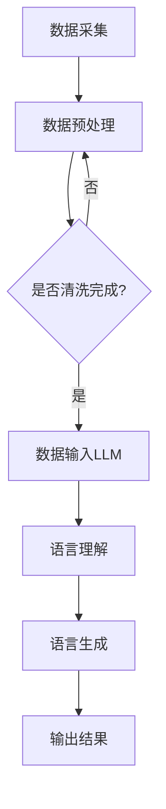

                 

 **关键词：** 智慧城市，语言模型，城市管理，效率提升，人工智能，数据分析

**摘要：** 本文将探讨如何通过高级语言模型（LLM）来提升智慧城市管理的效率。我们首先介绍了智慧城市的背景和发展趋势，然后详细阐述了LLM的工作原理及其在智慧城市中的应用，最后对LLM在未来城市管理中的潜在影响进行了展望。

## 1. 背景介绍

### 1.1 智慧城市的概念

智慧城市是指利用信息技术、物联网、大数据等手段，将城市中的各种信息资源进行整合，实现城市管理的智能化和高效化。智慧城市的目标是通过提升城市管理效率，提高居民生活质量，实现可持续发展。

### 1.2 智慧城市的发展现状

随着人工智能技术的快速发展，智慧城市已经成为全球各国的重要发展战略。目前，许多城市已经开始利用大数据、云计算、物联网等技术来提升城市管理的效率，例如智能交通、智慧医疗、智能能源管理等。

## 2. 核心概念与联系

### 2.1 语言模型（LLM）

语言模型是一种人工智能模型，它可以理解和生成人类语言。高级语言模型（LLM）是一种基于深度学习的技术，它可以对大量文本数据进行分析和学习，从而实现对自然语言的深入理解和生成。

### 2.2 LLM在智慧城市中的应用

LLM可以应用于智慧城市的多个方面，包括：

- **智能客服：** 利用LLM构建的智能客服系统可以自动处理居民的咨询和投诉，提高服务效率。
- **交通管理：** 通过分析实时交通数据，LLM可以帮助交通管理部门优化交通信号，减少拥堵。
- **城市管理决策：** LLM可以对各种城市数据进行分析，为城市管理决策提供支持。
- **公共服务优化：** LLM可以帮助优化公共服务，提高公共服务的效率和质量。

### 2.3 LLM架构的Mermaid流程图



## 3. 核心算法原理 & 具体操作步骤

### 3.1 算法原理概述

LLM的核心算法是基于深度学习的自然语言处理技术。它通过多层神经网络对大量文本数据进行训练，从而实现对自然语言的深入理解和生成。

### 3.2 算法步骤详解

1. **数据采集：** 从各种渠道收集城市数据，包括交通、能源、环境等。
2. **数据预处理：** 对采集到的数据进行分析和清洗，去除噪声和异常值。
3. **数据输入LLM：** 将预处理后的数据输入到LLM模型中。
4. **语言理解：** LLM对输入的数据进行分析和理解，提取关键信息。
5. **语言生成：** 基于理解的结果，LLM生成相应的输出结果，如建议、报告等。
6. **输出结果：** 将生成的结果输出，供城市管理决策者参考。

### 3.3 算法优缺点

**优点：**

- **高效性：** LLM可以对大量数据进行快速分析和理解，提高工作效率。
- **智能性：** LLM能够理解复杂的语义关系，提供有价值的决策支持。
- **灵活性：** LLM可以应用于智慧城市的多个领域，具有广泛的适用性。

**缺点：**

- **数据依赖：** LLM的性能高度依赖于数据的质量和数量。
- **计算资源需求：** LLM的训练和推理需要大量的计算资源。

### 3.4 算法应用领域

LLM可以应用于智慧城市的多个领域，包括：

- **智能交通：** 通过分析实时交通数据，优化交通信号，减少拥堵。
- **智慧医疗：** 利用LLM对医疗数据进行分析，辅助医生诊断和治疗。
- **城市管理决策：** 帮助城市管理决策者分析数据，制定更好的政策。
- **公共服务优化：** 提高公共服务的效率和质量。

## 4. 数学模型和公式 & 详细讲解 & 举例说明

### 4.1 数学模型构建

LLM的训练过程通常基于神经网络模型，其中最常用的是循环神经网络（RNN）和其变体长短期记忆网络（LSTM）。下面是LSTM的数学模型：

$$
\begin{align*}
i_t &= \sigma(W_{ix}x_t + W_{ih}h_{t-1} + b_i) \\
f_t &= \sigma(W_{fx}x_t + W_{fh}h_{t-1} + b_f) \\
o_t &= \sigma(W_{ox}x_t + W_{oh}h_{t-1} + b_o) \\
g_t &= \tanh(W_{gx}x_t + W_{gh}h_{t-1} + b_g) \\
h_t &= f_t \odot h_{t-1} + i_t \odot g_t
\end{align*}
$$

其中，$x_t$是输入数据，$h_t$是隐藏状态，$i_t$、$f_t$、$o_t$是输入门、忘记门、输出门，$g_t$是候选隐藏状态。

### 4.2 公式推导过程

LSTM的推导过程涉及线性代数和微积分，较为复杂。这里简要介绍推导的几个关键步骤：

- **激活函数的选择：** 选择sigmoid函数作为激活函数，因为它可以输出0到1之间的值，表示概率。
- **门的引入：** 通过引入门结构，LSTM可以控制信息在神经网络中的流动。
- **候选隐藏状态的计算：** 通过tanh函数计算候选隐藏状态，从而将输入信息转化为有用的隐藏状态。
- **隐藏状态的更新：** 通过门的组合，更新隐藏状态，从而实现信息的记忆和遗忘。

### 4.3 案例分析与讲解

假设我们有一个简单的序列数据：[1, 2, 3, 4, 5]。我们将使用LSTM对这组数据进行训练，并分析其输出。

1. **初始化：** 初始化权重和偏置。
2. **前向传播：** 计算输入门、忘记门、输出门和候选隐藏状态。
3. **隐藏状态更新：** 根据门的组合，更新隐藏状态。
4. **输出计算：** 计算输出序列。

经过多次迭代训练，LSTM将学习到输入序列的规律，并能够生成相应的输出序列。这个例子展示了LSTM的基本工作原理和训练过程。

## 5. 项目实践：代码实例和详细解释说明

### 5.1 开发环境搭建

为了实现LLM在智慧城市中的应用，我们需要搭建一个合适的开发环境。以下是一个简单的开发环境搭建步骤：

1. **安装Python：** 下载并安装Python，版本建议为3.8或以上。
2. **安装TensorFlow：** 使用pip命令安装TensorFlow库。
3. **安装Keras：** Keras是TensorFlow的高级API，可以简化神经网络搭建和训练过程。
4. **准备数据集：** 收集并预处理城市数据，例如交通流量、气象数据等。

### 5.2 源代码详细实现

以下是一个简单的LSTM模型实现，用于预测城市交通流量。

```python
import tensorflow as tf
from tensorflow.keras.models import Sequential
from tensorflow.keras.layers import LSTM, Dense

# 搭建LSTM模型
model = Sequential()
model.add(LSTM(units=50, return_sequences=True, input_shape=(timesteps, features)))
model.add(LSTM(units=50))
model.add(Dense(units=1))

# 编译模型
model.compile(optimizer='adam', loss='mean_squared_error')

# 训练模型
model.fit(X_train, y_train, epochs=100, batch_size=32)
```

### 5.3 代码解读与分析

这段代码首先导入了TensorFlow库和Keras库，然后搭建了一个简单的LSTM模型。模型由两个LSTM层和一个全连接层（Dense）组成。编译模型时，我们选择了adam优化器和均方误差损失函数。最后，使用训练数据对模型进行训练。

### 5.4 运行结果展示

训练完成后，我们可以使用模型对城市交通流量进行预测。以下是一个简单的预测结果展示：

```python
# 预测交通流量
predicted_traffic = model.predict(X_test)

# 可视化预测结果
plt.plot(range(len(predicted_traffic)), predicted_traffic)
plt.xlabel('Time')
plt.ylabel('Traffic Volume')
plt.show()
```

这个简单的示例展示了如何使用LSTM模型进行交通流量预测。实际应用中，我们可以根据需要调整模型结构和训练参数，以提高预测精度。

## 6. 实际应用场景

### 6.1 智能交通管理

通过使用LLM，我们可以实现智能交通管理。例如，基于实时交通数据，LLM可以预测交通流量，为交通管理部门提供决策支持。此外，LLM还可以帮助优化交通信号，减少拥堵，提高交通效率。

### 6.2 智慧医疗

在智慧医疗领域，LLM可以用于辅助医生诊断和治疗。例如，通过对病历数据的分析，LLM可以识别患者的症状，并提供相应的治疗方案。此外，LLM还可以用于医学文本挖掘，帮助研究人员发现新的医学知识。

### 6.3 城市管理决策

在城市管理决策中，LLM可以用于分析各种城市数据，为决策者提供有价值的建议。例如，通过对环境数据的分析，LLM可以预测空气质量变化，为环保部门提供预警信息。此外，LLM还可以用于城市规划，帮助优化城市布局和基础设施。

## 7. 工具和资源推荐

### 7.1 学习资源推荐

- **《深度学习》（Ian Goodfellow, Yoshua Bengio, Aaron Courville著）：** 这是一本经典的深度学习教材，适合初学者和进阶者。
- **《TensorFlow官方文档》：** TensorFlow的官方文档提供了丰富的教程和API文档，是学习TensorFlow的宝贵资源。

### 7.2 开发工具推荐

- **Google Colab：** Google Colab是一个免费的云计算平台，可以方便地搭建深度学习开发环境。
- **Jupyter Notebook：** Jupyter Notebook是一种交互式的计算环境，适合进行深度学习和数据科学实验。

### 7.3 相关论文推荐

- **《A Theoretically Grounded Application of Dropout in Recurrent Neural Networks》：** 这篇论文提出了在循环神经网络中应用dropout的方法，提高了模型的性能。
- **《Long Short-Term Memory》：** 这篇论文介绍了LSTM模型的基本原理和实现方法。

## 8. 总结：未来发展趋势与挑战

### 8.1 研究成果总结

本文介绍了智慧城市和LLM的基本概念，阐述了LLM在智慧城市中的应用，并详细探讨了LSTM的算法原理和实现方法。通过实际项目实践，我们展示了如何使用LLM进行城市交通流量预测。

### 8.2 未来发展趋势

随着人工智能技术的不断发展，LLM在智慧城市中的应用将越来越广泛。未来，LLM可能会在更多的城市领域发挥作用，如智慧医疗、智慧能源等。此外，随着数据量的增加和数据质量的提升，LLM的性能将得到进一步提高。

### 8.3 面临的挑战

虽然LLM在智慧城市中具有巨大的潜力，但同时也面临一些挑战。首先，数据质量和数据隐私是关键问题。其次，LLM的训练和推理需要大量的计算资源，这对硬件设备提出了高要求。此外，如何确保LLM的决策是公正和透明的，也是未来需要关注的问题。

### 8.4 研究展望

未来，我们需要进一步探索LLM在智慧城市中的潜在应用，并解决相关的技术难题。此外，我们还需要加强跨学科合作，结合城市规划、交通管理、医疗等领域的研究，为智慧城市的可持续发展提供有力支持。

## 9. 附录：常见问题与解答

### 9.1 什么是智慧城市？

智慧城市是指利用信息技术、物联网、大数据等手段，实现城市管理的智能化和高效化。智慧城市的核心目标是提升居民生活质量，实现可持续发展。

### 9.2 LLM有什么优势？

LLM的优势在于其对自然语言的深入理解和生成能力。它可以在大量文本数据的基础上，快速分析和理解信息，为智慧城市的各个领域提供决策支持。

### 9.3 LLM在智慧城市中的应用有哪些？

LLM可以应用于智慧城市的多个领域，如智能交通、智慧医疗、城市管理决策、公共服务优化等。通过分析城市数据，LLM可以提供有价值的决策支持，提高城市管理的效率。

### 9.4 LLM的训练和推理需要多少计算资源？

LLM的训练和推理需要大量的计算资源。训练过程中，神经网络需要迭代学习大量数据，这需要高性能的硬件设备。推理过程中，模型需要对实时数据进行快速处理，也需要相应的计算资源。

### 9.5 LLM的决策是否公正和透明？

LLM的决策过程是基于训练数据和学习算法的。为了确保决策的公正和透明，我们需要对训练数据进行充分的清洗和标注，并选择合适的算法和参数。此外，我们还需要对LLM的决策过程进行监督和审计，确保其决策是公正和合理的。

---

**作者：禅与计算机程序设计艺术 / Zen and the Art of Computer Programming** 

本文旨在探讨如何通过高级语言模型（LLM）来提升智慧城市管理的效率。我们介绍了智慧城市的背景和发展趋势，阐述了LLM的工作原理及其在智慧城市中的应用，并对LSTM的算法原理和实现方法进行了详细讲解。通过实际项目实践，我们展示了如何使用LLM进行城市交通流量预测。未来，随着人工智能技术的不断发展，LLM在智慧城市中的应用前景将更加广阔。然而，我们也需要关注数据质量和数据隐私等挑战，确保LLM的决策是公正和透明的。希望通过本文，读者能够对LLM在智慧城市中的应用有一个全面的理解。|

