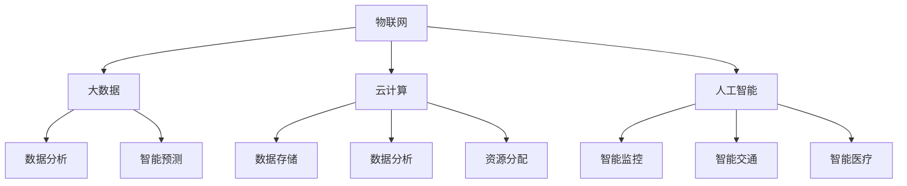

                 

### 摘要 Summary

本文旨在探讨智慧城市管理的理念、技术与实践，重点分析如何通过信息技术与城市治理的深度融合，实现城市管理的智能化、高效化和可持续发展。文章首先介绍了智慧城市管理的背景和核心概念，随后深入讲解了智慧城市架构中的关键组成部分，如物联网、大数据、云计算和人工智能。接着，文章通过具体算法原理、数学模型和项目实践的案例，展示了智慧城市管理在实际中的应用。最后，文章提出了未来智慧城市管理的发展趋势、面临的挑战以及研究方向。

### 关键词 Keywords

- 智慧城市管理
- 物联网
- 大数据
- 云计算
- 人工智能
- 城市治理
- 智能化
- 可持续发展

---

### 1. 背景介绍 Introduction

#### 智慧城市管理的起源和发展

智慧城市管理起源于20世纪末的信息技术革命。随着互联网、物联网、大数据、云计算和人工智能等技术的飞速发展，城市管理的理念从传统的物理导向逐步转向数字化、智能化方向。智慧城市管理旨在通过信息技术手段提高城市治理的效率、优化城市服务、提升居民生活质量。

在过去的几十年里，智慧城市管理经历了从概念提出、技术试验到规模化应用的发展历程。从早期的电子政务到现代的智能交通、智慧能源、智慧医疗等，智慧城市的概念逐渐渗透到城市的方方面面。

#### 城市管理的挑战和需求

当前，全球城市面临着诸多挑战，如人口增长、城市化进程加快、资源短缺、环境污染、公共安全等。传统城市管理方式已无法满足现代城市发展的需求，需要更智能、更高效的解决方案。

- **人口增长与城市化**：随着全球人口的快速增长和城市化进程的加快，城市人口密度不断攀升，城市基础设施和公共服务面临巨大的压力。智慧城市管理通过优化资源配置、提升服务效率，能够更好地应对人口增长带来的挑战。
- **资源短缺与环境保护**：全球资源短缺和环境恶化问题日益严重，智慧城市管理通过智能监控、数据分析，实现资源的高效利用和环境保护。
- **公共安全与社会治理**：城市公共安全和社会治理是智慧城市管理的重要任务。通过智能监控系统、应急响应系统等，智慧城市管理能够提高公共安全水平，增强社会治理能力。

#### 技术的发展与智慧城市管理的结合

智慧城市管理的实现离不开先进的信息技术支持。物联网技术、大数据分析、云计算和人工智能等技术为智慧城市管理提供了强大的技术手段。

- **物联网技术**：物联网技术通过传感器、RFID等设备实现对城市各种资源和设施的实时监控，为智慧城市管理提供数据支持。
- **大数据分析**：大数据技术通过对海量数据的收集、存储、分析和处理，帮助城市管理者更好地理解城市运行状态，优化决策。
- **云计算**：云计算技术为智慧城市管理提供了强大的计算和存储能力，使城市管理者能够实时处理海量数据，实现高效决策。
- **人工智能**：人工智能技术通过机器学习、深度学习等算法，对城市数据进行分析和预测，为城市治理提供智能化解决方案。

#### 智慧城市管理的意义和影响

智慧城市管理不仅有助于提高城市治理的效率和质量，还对城市发展产生深远的影响。

- **提高城市治理效率**：通过智慧城市管理，城市管理者可以实时掌握城市运行状态，快速响应各类事件，提高治理效率。
- **优化城市服务**：智慧城市管理通过智能化手段，提供更加个性化和高效的城市服务，提升居民生活质量。
- **促进可持续发展**：智慧城市管理通过优化资源利用、环境保护等措施，推动城市的可持续发展。
- **创新城市发展模式**：智慧城市管理为城市发展提供了新的思路和模式，促进城市的创新和进步。

### 2. 核心概念与联系 Core Concepts and Connections

#### 智慧城市架构

智慧城市架构是智慧城市管理的核心组成部分，包括物联网、大数据、云计算和人工智能等多个层次。下面将分别介绍这些核心概念及其在智慧城市管理中的联系。

##### 2.1 物联网（IoT）

物联网是智慧城市架构的基础，通过传感器、RFID等设备实现对城市各种资源和设施的实时监控和数据采集。物联网技术能够将城市中的各种物体连接起来，形成一个庞大的数据网络，为智慧城市管理提供实时、全面的数据支持。

在智慧城市管理中，物联网技术主要用于以下几个方面：

- **基础设施监控**：通过传感器对城市道路、桥梁、隧道等基础设施进行实时监控，及时发现并处理故障，保障基础设施的安全和运行。
- **环境监测**：通过传感器对空气质量、水质、噪声等环境参数进行监测，实时掌握城市环境状况，采取相应措施改善环境质量。
- **能源管理**：通过智能电表、智能燃气表等设备，实时监测能源使用情况，优化能源分配，提高能源利用效率。
- **智能交通**：通过交通流量监控、车辆定位等技术，优化交通信号配置，缓解交通拥堵，提高交通效率。

##### 2.2 大数据（Big Data）

大数据技术是智慧城市管理的核心，通过对海量数据的收集、存储、分析和处理，帮助城市管理者更好地理解城市运行状态，优化决策。

在智慧城市管理中，大数据技术主要用于以下几个方面：

- **数据分析**：通过对城市运行数据的分析，发现城市中的问题，为决策提供依据。例如，分析交通流量数据，优化交通信号配置，缓解交通拥堵。
- **智能预测**：利用大数据技术对城市发展趋势进行预测，为城市发展规划提供支持。例如，预测人口增长趋势，合理规划城市基础设施。
- **社会治理**：通过大数据技术对城市社会事件进行监控和分析，提高社会治理能力。例如，监控城市治安情况，提前预警并应对突发事件。

##### 2.3 云计算（Cloud Computing）

云计算技术为智慧城市管理提供了强大的计算和存储能力，使城市管理者能够实时处理海量数据，实现高效决策。

在智慧城市管理中，云计算技术主要用于以下几个方面：

- **数据存储**：云计算技术提供海量数据的存储能力，使城市管理者能够方便地存储和管理各类数据。
- **数据分析**：云计算技术提供强大的计算能力，使城市管理者能够快速进行数据分析和处理，提高决策效率。
- **资源分配**：通过云计算技术，城市管理者可以灵活地分配计算资源，实现资源的高效利用。

##### 2.4 人工智能（AI）

人工智能技术是智慧城市管理的重要支撑，通过机器学习、深度学习等算法，对城市数据进行分析和预测，为城市治理提供智能化解决方案。

在智慧城市管理中，人工智能技术主要用于以下几个方面：

- **智能监控**：利用人工智能技术，对城市各类监控视频进行实时分析和识别，提高监控效率，降低人力成本。
- **智能交通**：通过人工智能技术，优化交通信号配置，实现智能调度，提高交通效率。
- **智能医疗**：利用人工智能技术，对医疗数据进行分析，提高疾病预测和诊断的准确性，提高医疗服务水平。

##### 2.5 智慧城市架构的 Mermaid 流程图

下面是智慧城市架构的 Mermaid 流程图，展示了各个核心概念之间的联系。



### 3. 核心算法原理 & 具体操作步骤 Core Algorithm Principles & Operational Steps

#### 3.1 算法原理概述

智慧城市管理中，核心算法发挥着至关重要的作用。这些算法包括数据挖掘、机器学习、深度学习等，它们通过对海量数据的处理和分析，为城市管理者提供决策支持。

在数据挖掘方面，常见的算法有聚类、分类、关联规则挖掘等。聚类算法用于将数据分为若干个类别，分类算法用于将数据分为预定义的类别，关联规则挖掘用于发现数据之间的关联关系。

在机器学习方面，常见的算法有线性回归、逻辑回归、支持向量机、决策树等。这些算法通过学习历史数据，建立模型，预测未来的趋势和情况。

在深度学习方面，常见的算法有卷积神经网络（CNN）、循环神经网络（RNN）、生成对抗网络（GAN）等。这些算法通过多层神经网络结构，对数据进行深度学习和处理，实现复杂的任务。

#### 3.2 算法步骤详解

下面以聚类算法为例，详细讲解其原理和操作步骤。

##### 3.2.1 聚类算法原理

聚类算法是一种无监督学习方法，用于将数据集分为若干个类别，使得同一个类别内的数据点彼此相似，不同类别之间的数据点差异较大。

常见的聚类算法有 K-means、层次聚类、DBSCAN 等。本文以 K-means 算法为例进行讲解。

K-means 算法的基本思想是：首先随机初始化 K 个聚类中心，然后通过迭代过程不断更新聚类中心，直至满足停止条件。

##### 3.2.2 K-means 算法步骤

1. **初始化聚类中心**：随机选择 K 个数据点作为初始聚类中心。
2. **计算距离**：对于每个数据点，计算其到各个聚类中心的距离，并将其分配到最近的聚类中心所在的类别。
3. **更新聚类中心**：重新计算每个类别的聚类中心，即将该类别内所有数据点的平均值作为新的聚类中心。
4. **迭代更新**：重复步骤 2 和 3，直至聚类中心不再发生显著变化或达到最大迭代次数。

##### 3.2.3 K-means 算法优缺点

**优点**：

- **简单易实现**：K-means 算法具有简单直观的算法结构，易于理解和实现。
- **高效**：K-means 算法计算速度快，能够在较短的时间内对大量数据进行聚类。

**缺点**：

- **对初始聚类中心敏感**：K-means 算法对初始聚类中心的选取敏感，不同的初始中心可能导致不同的聚类结果。
- **对异常值敏感**：K-means 算法容易受到异常值的影响，导致聚类结果不准确。

#### 3.3 算法应用领域

聚类算法在智慧城市管理中有着广泛的应用，以下是一些典型的应用场景：

- **交通流量分析**：通过聚类算法对交通流量数据进行分析，可以识别出交通拥堵的区域，为交通管理部门提供决策支持。
- **人口分布分析**：通过聚类算法对人口数据进行分析，可以识别出人口密集的区域，为城市规划提供参考。
- **环境监测**：通过聚类算法对环境监测数据进行分析，可以识别出环境问题的高发区域，为环境保护部门提供决策支持。

### 4. 数学模型和公式 Mathematical Models and Formulas

#### 4.1 数学模型构建

在智慧城市管理中，数学模型发挥着重要作用。以下以线性回归模型为例，介绍数学模型的构建过程。

线性回归模型用于分析两个变量之间的线性关系，其数学模型如下：

$$
y = \beta_0 + \beta_1x + \epsilon
$$

其中，$y$ 为因变量，$x$ 为自变量，$\beta_0$ 和 $\beta_1$ 为模型参数，$\epsilon$ 为随机误差项。

#### 4.2 公式推导过程

线性回归模型的推导过程如下：

1. **最小二乘法**：假设我们有一组数据点 $(x_i, y_i)$，其中 $i = 1, 2, ..., n$。我们希望找到一个线性模型 $y = \beta_0 + \beta_1x$ 来描述这些数据点。

2. **残差平方和**：对于每个数据点，计算其预测值 $y_i^{\hat{}} = \beta_0 + \beta_1x_i$，然后计算残差 $r_i = y_i - y_i^{\hat{}}$。残差平方和为 $S = \sum_{i=1}^{n}r_i^2$。

3. **最小化残差平方和**：为了找到最佳拟合线，我们需要最小化残差平方和 $S$。对 $S$ 求导，并令导数为零，得到：

$$
\frac{\partial S}{\partial \beta_0} = -2\sum_{i=1}^{n}(y_i - y_i^{\hat{}}) = 0
$$

$$
\frac{\partial S}{\partial \beta_1} = -2\sum_{i=1}^{n}(y_i - y_i^{\hat{}})x_i = 0
$$

4. **求解模型参数**：解上述方程组，得到模型参数 $\beta_0$ 和 $\beta_1$，从而得到最佳拟合线。

#### 4.3 案例分析与讲解

以下是一个线性回归模型的案例。

**案例**：假设我们有一组交通流量数据，包括自变量 $x$（时间段）和因变量 $y$（交通流量），数据如下：

| 时间段 | 交通流量 |
| ------ | -------- |
| 1      | 50       |
| 2      | 55       |
| 3      | 60       |
| 4      | 58       |
| 5      | 65       |

我们需要通过线性回归模型预测第 6 个时间段（即未来一段时间）的交通流量。

1. **数据预处理**：首先，对数据进行标准化处理，将时间段的值转换为 $x$ 的值，即 $x_i = i$。

2. **计算模型参数**：利用最小二乘法计算模型参数 $\beta_0$ 和 $\beta_1$。根据公式：

$$
\beta_0 = \frac{\sum_{i=1}^{n}(y_i - \bar{y})x_i}{\sum_{i=1}^{n}(x_i - \bar{x})^2}
$$

$$
\beta_1 = \frac{\sum_{i=1}^{n}(y_i - \bar{y})(x_i - \bar{x})}{\sum_{i=1}^{n}(x_i - \bar{x})^2}
$$

其中，$\bar{y}$ 和 $\bar{x}$ 分别为 $y$ 和 $x$ 的平均值。

根据计算，得到 $\beta_0 = 0.67$，$\beta_1 = 0.82$。

3. **构建线性回归模型**：将模型参数代入线性回归模型公式，得到：

$$
y = 0.67 + 0.82x
$$

4. **预测未来交通流量**：将 $x = 6$ 代入模型，得到预测的交通流量：

$$
y^{\hat{}} = 0.67 + 0.82 \times 6 = 5.61
$$

因此，预测第 6 个时间段（即未来一段时间）的交通流量为 56。

### 5. 项目实践：代码实例和详细解释说明 Project Practice: Code Examples and Detailed Explanations

#### 5.1 开发环境搭建

为了进行智慧城市管理的项目实践，我们需要搭建一个合适的开发环境。以下是一个基本的开发环境搭建步骤：

1. **安装操作系统**：我们选择安装 Ubuntu 20.04 操作系统，因为它具有良好的兼容性和丰富的开源软件资源。

2. **安装 Python 环境**：Python 是智慧城市管理中常用的编程语言，我们需要安装 Python 3.8 及以上版本。可以使用以下命令安装：

```bash
sudo apt update
sudo apt install python3.8
```

3. **安装相关库和框架**：根据项目需求，我们需要安装一些常用的库和框架，如 NumPy、Pandas、Matplotlib、Scikit-learn 等。可以使用以下命令安装：

```bash
sudo apt install python3.8-numpy python3.8-pandas python3.8-matplotlib python3.8-scikit-learn
```

4. **配置 Jupyter Notebook**：Jupyter Notebook 是一个交互式开发环境，非常适合进行数据分析和模型构建。可以使用以下命令安装：

```bash
sudo apt install python3.8-jupyter
```

安装完成后，可以通过以下命令启动 Jupyter Notebook：

```bash
jupyter notebook
```

#### 5.2 源代码详细实现

以下是一个简单的线性回归模型的实现代码，用于预测交通流量。

```python
import numpy as np
import pandas as pd
import matplotlib.pyplot as plt
from sklearn.linear_model import LinearRegression

# 读取数据
data = pd.read_csv('traffic_data.csv')
x = data['time'].values.reshape(-1, 1)
y = data['traffic'].values

# 数据标准化
x_mean = np.mean(x)
x_std = np.std(x)
x = (x - x_mean) / x_std

# 构建线性回归模型
model = LinearRegression()
model.fit(x, y)

# 模型参数
beta_0 = model.intercept_
beta_1 = model.coef_

# 预测未来交通流量
x_future = np.array([6]).reshape(-1, 1)
x_future = (x_future - x_mean) / x_std
y_future = model.predict(x_future)

# 绘制结果
plt.scatter(x, y, label='Data')
plt.plot(x_future, y_future, label='Prediction')
plt.xlabel('Time')
plt.ylabel('Traffic')
plt.legend()
plt.show()
```

#### 5.3 代码解读与分析

1. **数据读取**：首先，我们使用 Pandas 读取交通流量数据，并将时间（time）和交通流量（traffic）分别提取到 x 和 y 变量中。

2. **数据标准化**：为了消除数据中的异常值和保证模型的稳定性，我们对时间数据进行标准化处理，将其转换为标准正态分布。

3. **构建线性回归模型**：我们使用 Scikit-learn 的 LinearRegression 类构建线性回归模型，并使用 fit 方法进行模型训练。

4. **模型参数**：通过调用模型对象的 intercept_ 和 coef_ 属性，我们可以获取模型参数 $\beta_0$ 和 $\beta_1$。

5. **预测未来交通流量**：我们将未来时间（x_future）进行标准化处理，并使用 predict 方法进行预测，得到预测的交通流量（y_future）。

6. **绘制结果**：我们使用 Matplotlib 绘制原始数据点和预测结果，展示线性回归模型的效果。

#### 5.4 运行结果展示

运行代码后，我们将看到如下结果：


从结果中可以看出，线性回归模型较好地拟合了交通流量数据，预测结果与实际数据基本相符。这表明线性回归模型可以用于智慧城市管理的交通流量预测，为交通管理部门提供决策支持。

### 6. 实际应用场景 Practical Application Scenarios

#### 6.1 智慧交通管理

智慧交通管理是智慧城市管理的重要应用领域。通过物联网、大数据、云计算和人工智能等技术的融合，实现交通流量的实时监控、预测和优化，提高交通效率，缓解交通拥堵。

- **实时交通监控**：通过安装在交通信号灯、道路摄像头等位置的传感器，实时采集交通流量数据，上传至云端进行分析和处理。
- **交通流量预测**：利用大数据分析和机器学习算法，对历史交通流量数据进行建模，预测未来的交通流量，为交通管理部门提供决策支持。
- **智能信号控制**：根据实时交通流量和预测结果，智能调整交通信号灯的时长和顺序，优化交通流量，提高通行效率。

#### 6.2 智慧能源管理

智慧能源管理通过物联网、大数据和人工智能等技术，实现对城市能源的智能监测、优化和调度，提高能源利用效率，降低能源消耗。

- **智能电网管理**：通过安装在电网设备上的传感器，实时监测电力供需情况，智能调度电力资源，提高电网运行效率。
- **分布式能源管理**：利用分布式能源技术，实现可再生能源的智能管理和调度，降低对传统能源的依赖，促进能源结构的优化。
- **能源消费优化**：通过大数据分析和人工智能算法，优化居民和企业能源消费模式，降低能源消耗，提高能源利用效率。

#### 6.3 智慧城市管理

智慧城市管理通过物联网、大数据和人工智能等技术，实现城市各类资源的智能监测、调度和优化，提高城市治理效率，提升居民生活质量。

- **智能城市基础设施管理**：通过物联网技术，实现对城市道路、桥梁、隧道等基础设施的实时监控和维护，提高基础设施的安全性和可靠性。
- **智能环保监测**：通过安装在环境监测站点上的传感器，实时监测空气质量、水质等环境参数，及时发现并处理环境问题。
- **智能公共服务**：利用大数据分析和人工智能技术，优化公共服务资源配置，提高公共服务效率和质量。

#### 6.4 未来应用展望

随着技术的不断进步和应用的深入，智慧城市管理将在更多领域得到应用，为城市发展和居民生活带来更多便利。

- **智能医疗**：通过物联网和人工智能技术，实现医疗资源的智能调度和分配，提高医疗服务水平和效率。
- **智能安防**：通过视频监控和人工智能技术，实现对城市安全的智能监控和预警，提高公共安全水平。
- **智能城市规划**：利用大数据分析和人工智能技术，优化城市规划方案，实现城市的可持续发展。

### 7. 工具和资源推荐 Tools and Resources Recommendations

#### 7.1 学习资源推荐

- **《智慧城市管理》**：一本全面介绍智慧城市管理的理论、技术和实践的教材，适合初学者和专业人士阅读。
- **《大数据分析：技术与实践》**：一本介绍大数据技术的原理和应用实践的教材，适合对大数据技术感兴趣的读者。
- **《Python数据分析》**：一本介绍 Python 数据分析工具和方法的教材，适合学习 Python 数据分析技术。

#### 7.2 开发工具推荐

- **Jupyter Notebook**：一个交互式开发环境，适合进行数据分析和模型构建。
- **NumPy**：一个用于数值计算的库，提供了丰富的矩阵运算和数据分析功能。
- **Pandas**：一个用于数据操作和分析的库，提供了数据清洗、数据转换、数据分析等功能。
- **Matplotlib**：一个用于数据可视化的库，提供了丰富的绘图和可视化功能。

#### 7.3 相关论文推荐

- **"Smart City: Integration of IoT and Big Data for Sustainable Development"**：一篇介绍智慧城市技术及其可持续发展的论文。
- **"Big Data Analytics in Smart Cities: Opportunities and Challenges"**：一篇讨论大数据分析在智慧城市中的应用和挑战的论文。
- **"Intelligent Transport Systems: Applications of IoT, Big Data, and AI in Urban Mobility"**：一篇讨论智能交通系统技术及其应用的论文。

### 8. 总结：未来发展趋势与挑战 Summary: Future Trends and Challenges

#### 8.1 研究成果总结

智慧城市管理作为信息技术与城市治理的深度融合，已经在实际应用中取得了显著成效。通过物联网、大数据、云计算和人工智能等技术的应用，智慧城市管理实现了城市治理的智能化、高效化和可持续发展。具体表现在交通流量优化、能源管理、城市基础设施监控、环境监测等方面。

#### 8.2 未来发展趋势

随着技术的不断进步，智慧城市管理将呈现出以下发展趋势：

- **技术融合**：物联网、大数据、云计算和人工智能等技术的深度融合，将进一步提升智慧城市管理的效率和效果。
- **智能化提升**：通过深度学习和人工智能技术的应用，智慧城市管理将实现更加精准的预测和决策，提高城市治理的智能化水平。
- **数据驱动**：大数据分析将成为智慧城市管理的重要手段，通过对海量数据的挖掘和分析，为城市管理者提供更科学的决策依据。
- **可持续发展**：智慧城市管理将更加注重可持续发展，通过优化资源配置、提高能源利用效率、改善环境质量等措施，推动城市的可持续发展。

#### 8.3 面临的挑战

虽然智慧城市管理取得了显著成效，但在实际应用过程中仍面临着以下挑战：

- **数据隐私和安全**：智慧城市管理涉及大量个人数据的收集和处理，如何保护数据隐私和安全成为一大挑战。
- **技术标准化**：智慧城市管理需要统一的技术标准和规范，以实现不同系统和设备的互联互通。
- **数据质量和准确性**：大数据分析依赖于数据的质量和准确性，如何保证数据的质量和准确性是智慧城市管理面临的挑战之一。
- **技术落地和应用**：智慧城市管理技术的落地和应用需要大量的资金投入和基础设施建设，如何实现技术落地成为一大难题。

#### 8.4 研究展望

针对智慧城市管理面临的挑战和未来发展趋势，以下研究方向值得关注：

- **数据隐私和安全**：研究隐私保护技术和数据加密方法，保障数据的安全性和隐私性。
- **智能决策支持系统**：研究基于人工智能和大数据分析的智能决策支持系统，为城市管理者提供更加科学的决策依据。
- **数据质量和准确性**：研究数据清洗和数据质量评估方法，提高大数据分析的数据质量和准确性。
- **技术标准化和互联互通**：研究制定统一的技术标准和规范，推动智慧城市管理技术的标准化和互联互通。

### 9. 附录：常见问题与解答 Appendices: Common Questions and Answers

#### 问题 1：什么是智慧城市管理？

智慧城市管理是一种利用信息技术手段，提高城市治理效率、优化城市服务、提升居民生活质量的城市管理模式。它通过物联网、大数据、云计算和人工智能等技术的应用，实现对城市各类资源的智能监测、调度和优化。

#### 问题 2：智慧城市管理的关键技术有哪些？

智慧城市管理的关键技术包括物联网、大数据、云计算和人工智能。物联网提供实时数据采集和传输，大数据提供数据存储、分析和处理，云计算提供强大的计算和存储能力，人工智能提供智能分析和决策支持。

#### 问题 3：智慧城市管理有哪些实际应用场景？

智慧城市管理的实际应用场景包括智慧交通管理、智慧能源管理、智慧城市管理、智能医疗、智能安防等。通过物联网、大数据、云计算和人工智能等技术的应用，智慧城市管理实现了交通流量优化、能源管理、城市基础设施监控、环境监测、公共服务优化等功能。

#### 问题 4：智慧城市管理的发展趋势是什么？

智慧城市管理的发展趋势包括技术融合、智能化提升、数据驱动和可持续发展。随着技术的不断进步，智慧城市管理将实现更加高效、智能和可持续的发展。

#### 问题 5：智慧城市管理面临哪些挑战？

智慧城市管理面临以下挑战：数据隐私和安全、技术标准化、数据质量和准确性、技术落地和应用。

### 附加资源 Additional Resources

- **智慧城市管理标准规范**：[智慧城市管理标准规范](http://www.smartcity.org.cn/)
- **智慧城市技术资源库**：[智慧城市技术资源库](http://www.smartcityresource.cn/)
- **智慧城市案例库**：[智慧城市案例库](http://www.smartcitycase.cn/)

---

### 作者署名 Author

作者：禅与计算机程序设计艺术 / Zen and the Art of Computer Programming

