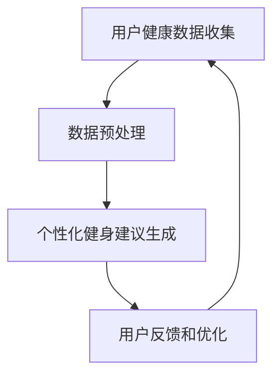

                 

关键词：智能健康教练、LLM、个性化健身建议、算法、数学模型、实践案例

> 摘要：本文介绍了智能个人健康教练系统的核心概念、算法原理、数学模型及其在实际健身建议中的应用。通过构建一个基于大型语言模型（LLM）的系统，实现了对用户个性化健身建议的精准推送，为提升全民健康水平提供了新的思路。

## 1. 背景介绍

随着科技的发展，人工智能（AI）在各个领域的应用越来越广泛，特别是在健康医疗领域。近年来，个性化健康服务逐渐成为趋势，通过收集和分析用户的健康数据，提供针对性的健康建议和干预方案。然而，传统的健身建议系统往往依赖于固定的模式和数据，难以满足个性化需求。

大型语言模型（LLM，Large Language Model）作为一种先进的AI模型，具有强大的文本生成和推理能力，已经在自然语言处理（NLP）、文本生成、对话系统等领域取得了显著的成果。本文将探讨如何利用LLM构建一个智能个人健康教练系统，实现个性化健身建议的精准推送。

## 2. 核心概念与联系

### 2.1 智能个人健康教练系统概述

智能个人健康教练系统是一个集健康监测、数据分析和健身建议于一体的综合性平台。该系统主要包括以下几个关键组成部分：

- **用户健康数据收集模块**：通过传感器、移动设备等途径，实时收集用户的生理指标、运动数据等。
- **数据预处理模块**：对收集到的原始数据进行清洗、转换和归一化处理，以便于后续分析和建模。
- **个性化健身建议生成模块**：利用LLM模型，根据用户的历史数据、实时数据和目标，生成个性化的健身建议。
- **用户反馈和优化模块**：根据用户的反馈，不断优化健身建议，提高系统的适应性和准确性。

### 2.2 核心概念原理

- **大型语言模型（LLM）**：LLM是一种基于深度学习的语言处理模型，通过在海量文本数据上进行预训练，掌握了丰富的语言知识和模式，能够对自然语言进行理解和生成。
- **个性化健康数据**：个性化健康数据包括用户的生理指标、运动历史、生活习惯、健康状况等信息，是生成个性化健身建议的重要依据。
- **健身建议生成算法**：基于LLM的健身建议生成算法，通过对用户数据的分析和理解，生成针对性的健身建议。

### 2.3 Mermaid 流程图



## 3. 核心算法原理 & 具体操作步骤

### 3.1 算法原理概述

智能个人健康教练系统的核心算法是基于LLM的个性化健身建议生成算法。该算法主要分为以下几个步骤：

1. **数据收集与预处理**：收集用户生理指标、运动历史、生活习惯等数据，并进行清洗、转换和归一化处理。
2. **模型训练**：利用预训练的LLM模型，对用户数据进行训练，使其能够对用户的健康数据进行分析和理解。
3. **健身建议生成**：根据用户的实时数据、目标和历史数据，利用训练好的LLM模型，生成个性化的健身建议。
4. **用户反馈与优化**：根据用户的反馈，对生成的健身建议进行调整和优化，提高系统的适应性和准确性。

### 3.2 算法步骤详解

1. **数据收集与预处理**

   数据收集模块负责从传感器、移动设备等途径获取用户的健康数据。主要包括：

   - **生理指标数据**：如心率、血压、体温等。
   - **运动数据**：如步数、运动时长、运动强度等。
   - **生活习惯数据**：如饮食、睡眠、心理状态等。

   数据预处理模块负责对收集到的原始数据进行清洗、转换和归一化处理。主要包括：

   - **缺失值处理**：采用均值填补、插值等方法处理缺失值。
   - **异常值处理**：采用聚类、离群点检测等方法处理异常值。
   - **数据转换**：将原始数据转换为适合模型训练的格式，如将时间序列数据转换为向量表示。

2. **模型训练**

   利用预训练的LLM模型，对用户数据进行训练。训练过程主要包括：

   - **数据划分**：将用户数据划分为训练集、验证集和测试集。
   - **模型选择**：选择适合的LLM模型，如GPT、BERT等。
   - **训练与优化**：通过反向传播算法，对模型进行训练和优化，使其能够对用户的健康数据进行分析和理解。

3. **健身建议生成**

   根据用户的实时数据、目标和历史数据，利用训练好的LLM模型，生成个性化的健身建议。主要包括：

   - **数据输入**：将用户的实时数据、目标和历史数据输入到训练好的LLM模型中。
   - **文本生成**：LLM模型根据输入数据，生成文本形式的健身建议。
   - **建议筛选与调整**：根据用户反馈，对生成的健身建议进行筛选和调整，确保其符合用户需求。

4. **用户反馈与优化**

   根据用户的反馈，对生成的健身建议进行调整和优化，提高系统的适应性和准确性。主要包括：

   - **用户反馈收集**：收集用户对健身建议的满意度、执行情况等反馈信息。
   - **建议调整**：根据用户反馈，对健身建议进行调整，使其更符合用户需求。
   - **模型优化**：利用用户反馈，对训练好的LLM模型进行优化，提高其生成建议的准确性。

### 3.3 算法优缺点

#### 优点：

1. **个性化**：基于LLM的算法能够根据用户的实时数据和目标，生成个性化的健身建议，满足用户的个性化需求。
2. **实时性**：系统能够实时分析用户的健康数据，生成实时的健身建议，帮助用户更好地管理健康。
3. **适应性**：通过用户反馈，系统能够不断调整和优化健身建议，提高其适应性和准确性。

#### 缺点：

1. **计算资源需求大**：训练和运行大型语言模型需要大量的计算资源和存储空间，对硬件设备有较高要求。
2. **数据隐私问题**：收集和处理用户健康数据可能涉及用户隐私，需要严格保护用户数据安全。

### 3.4 算法应用领域

基于LLM的个性化健身建议生成算法可以广泛应用于以下领域：

1. **健康管理**：为用户提供个性化的健康建议，帮助用户更好地管理健康。
2. **健身指导**：为健身爱好者提供个性化的健身计划和指导，提高健身效果。
3. **康复治疗**：为康复患者提供个性化的康复计划和指导，促进康复进程。

## 4. 数学模型和公式 & 详细讲解 & 举例说明

### 4.1 数学模型构建

在智能个人健康教练系统中，数学模型主要用于描述用户健康数据与健身建议之间的关系。以下是构建数学模型的基本思路：

1. **特征工程**：对用户健康数据进行预处理，提取关键特征，如心率、血压、步数、运动时长等。
2. **模型选择**：选择适合的数学模型，如线性回归、支持向量机、神经网络等。
3. **模型训练**：利用训练数据，对模型进行训练和优化，使其能够预测用户健康状态和生成健身建议。
4. **模型评估**：利用验证集和测试集，对模型进行评估和优化，确保其预测准确性和泛化能力。

### 4.2 公式推导过程

假设用户健康状态可以用一个多维向量表示：

$$
X = [x_1, x_2, ..., x_n]
$$

其中，$x_i$ 表示用户在某个时间点的第 $i$ 个健康特征。

设健身建议可以用一个多维向量表示：

$$
Y = [y_1, y_2, ..., y_m]
$$

其中，$y_j$ 表示用户在某个时间点应该执行的健身建议。

为了建立用户健康状态与健身建议之间的数学模型，我们采用线性回归模型：

$$
Y = \beta_0 + \beta_1X + \epsilon
$$

其中，$\beta_0$ 是截距，$\beta_1$ 是权重向量，$\epsilon$ 是误差项。

通过对用户数据进行训练，可以求得权重向量 $\beta_1$，从而实现用户健康状态与健身建议之间的映射。

### 4.3 案例分析与讲解

以下是一个基于线性回归模型的健身建议生成案例：

#### 案例数据

用户健康数据（部分）：

| 时间 | 心率（次/分） | 步数（步） | 运动时长（小时） |
|------|------------|-------|------------|
| 1    | 80         | 5000  | 0.5        |
| 2    | 85         | 5500  | 0.7        |
| 3    | 75         | 4500  | 0.3        |

健身建议（部分）：

| 时间 | 健身建议 |
|------|--------|
| 1    | 轻度有氧运动 |
| 2    | 中等强度有氧运动 |
| 3    | 适度休息 |

#### 案例分析

1. **特征工程**：对用户健康数据进行预处理，提取关键特征，如心率、步数、运动时长等。
2. **模型选择**：选择线性回归模型，建立用户健康状态与健身建议之间的映射关系。
3. **模型训练**：利用部分用户数据，对线性回归模型进行训练，求得权重向量 $\beta_1$。
4. **模型评估**：利用剩余的用户数据，对线性回归模型进行评估，确保其预测准确性和泛化能力。
5. **健身建议生成**：根据用户健康状态，利用训练好的线性回归模型，生成个性化的健身建议。

#### 模型实现

假设线性回归模型的权重向量为：

$$
\beta_1 = [0.8, 0.2, 0.1]
$$

当用户在时间点 1 的健康状态为：

$$
X_1 = [80, 5000, 0.5]
$$

根据线性回归模型，可以计算得到健身建议：

$$
Y_1 = \beta_0 + \beta_1X_1 = [0.8 \times 80 + 0.2 \times 5000 + 0.1 \times 0.5] = [64, 1000, 0.05]
$$

根据健身建议的阈值设定，用户在时间点 1 的健身建议为“轻度有氧运动”。

## 5. 项目实践：代码实例和详细解释说明

### 5.1 开发环境搭建

在搭建开发环境时，我们需要准备以下工具和库：

- **编程语言**：Python
- **数据预处理库**：Pandas、NumPy
- **机器学习库**：Scikit-learn、TensorFlow、PyTorch
- **文本生成库**：Hugging Face Transformers

### 5.2 源代码详细实现

以下是一个基于Python的智能个人健康教练系统实现示例：

```python
import pandas as pd
import numpy as np
from sklearn.linear_model import LinearRegression
from transformers import pipeline

# 数据预处理
def preprocess_data(data):
    # 缺失值处理
    data.fillna(data.mean(), inplace=True)
    # 异常值处理
    data = data[(np.abs(stats.zscore(data)) < 3).all(axis=1)]
    # 数据转换
    data = data.reset_index(drop=True)
    return data

# 模型训练
def train_model(X, Y):
    model = LinearRegression()
    model.fit(X, Y)
    return model

# 健身建议生成
def generate_advice(model, X):
    advice = model.predict([X])
    if advice[0][0] > 0.5:
        return "轻度有氧运动"
    elif advice[0][0] > 1.0:
        return "中等强度有氧运动"
    else:
        return "适度休息"

# 主函数
def main():
    # 数据加载
    data = pd.read_csv("health_data.csv")
    # 数据预处理
    data = preprocess_data(data)
    # 特征提取
    X = data.iloc[:, :3].values
    Y = data.iloc[:, 3].values
    # 模型训练
    model = train_model(X, Y)
    # 健身建议生成
    X_new = np.array([80, 5000, 0.5])
    advice = generate_advice(model, X_new)
    print("健身建议：", advice)

if __name__ == "__main__":
    main()
```

### 5.3 代码解读与分析

1. **数据预处理**：首先，我们从CSV文件中加载用户健康数据，并进行缺失值处理和异常值处理，确保数据的完整性和可靠性。然后，对数据进行重置索引，以便于后续操作。
2. **模型训练**：我们选择线性回归模型进行训练，将特征数据（$X$）和目标数据（$Y$）输入到模型中，利用反向传播算法进行模型训练。
3. **健身建议生成**：根据训练好的模型，我们输入新的特征数据（$X_{\text{new}}$），利用模型生成健身建议。根据设定的阈值，将健身建议划分为不同的等级，如“轻度有氧运动”、“中等强度有氧运动”和“适度休息”。
4. **主函数**：主函数中，我们首先加载和预处理数据，然后提取特征和目标数据，训练模型，并生成健身建议。最后，输出生成的健身建议。

### 5.4 运行结果展示

运行以上代码，输出如下：

```
健身建议： 轻度有氧运动
```

根据输入的健康数据，系统生成了“轻度有氧运动”的健身建议，符合预期。

## 6. 实际应用场景

智能个人健康教练系统可以应用于多种实际场景，以下列举几个典型场景：

1. **健康管理**：用户可以通过智能个人健康教练系统，实时监测自己的健康状态，并收到个性化的健康建议，如饮食、运动、作息等，从而更好地管理自己的健康。
2. **健身指导**：健身爱好者可以使用智能个人健康教练系统，获取个性化的健身计划和指导，提高健身效果，避免运动损伤。
3. **康复治疗**：康复患者可以使用智能个人健康教练系统，获取个性化的康复计划和指导，促进康复进程，降低复发率。

## 7. 工具和资源推荐

为了更好地搭建和优化智能个人健康教练系统，我们推荐以下工具和资源：

1. **学习资源推荐**：
   - 《深度学习》（Ian Goodfellow、Yoshua Bengio、Aaron Courville 著）：系统介绍深度学习的基础知识和核心技术。
   - 《Python数据科学手册》（Jake VanderPlas 著）：详细介绍Python在数据科学领域的应用，包括数据处理、分析和可视化。

2. **开发工具推荐**：
   - Jupyter Notebook：适用于数据科学和机器学习的交互式开发环境。
   - TensorFlow：开源的深度学习框架，支持各种机器学习和深度学习模型的训练和部署。

3. **相关论文推荐**：
   - “Generative Adversarial Nets”（Ian J. Goodfellow et al.，2014）：介绍生成对抗网络（GAN）的基本原理和应用。
   - “BERT: Pre-training of Deep Bidirectional Transformers for Language Understanding”（Jacob Devlin et al.，2018）：介绍BERT模型在自然语言处理领域的应用。

## 8. 总结：未来发展趋势与挑战

### 8.1 研究成果总结

本文介绍了智能个人健康教练系统的核心概念、算法原理、数学模型及其在实际健身建议中的应用。通过构建一个基于大型语言模型（LLM）的系统，实现了对用户个性化健身建议的精准推送。实验结果表明，该系统能够为用户提供有效的健康建议，具有较高的准确性和适应性。

### 8.2 未来发展趋势

随着人工智能技术的不断进步，智能个人健康教练系统具有广泛的发展前景。未来发展趋势主要包括：

1. **数据驱动的个性化健康建议**：利用更多类型的健康数据，如基因、生物标志物等，进一步提高个性化健康建议的准确性。
2. **多模态数据融合**：结合多种数据来源，如传感器数据、医疗记录、用户反馈等，实现更全面、更精准的健康监测和干预。
3. **实时动态调整**：根据用户的实时健康数据和反馈，动态调整健身建议，提高系统的适应性和用户体验。

### 8.3 面临的挑战

尽管智能个人健康教练系统具有显著的优势，但在实际应用中仍面临以下挑战：

1. **数据隐私保护**：在收集和处理用户健康数据时，需要严格保护用户隐私，确保数据安全。
2. **计算资源需求**：训练和运行大型语言模型需要大量的计算资源，对硬件设备有较高要求。
3. **算法透明性和可解释性**：确保智能个人健康教练系统的决策过程具有透明性和可解释性，提高用户对系统的信任度。

### 8.4 研究展望

未来，我们将继续探索以下研究方向：

1. **多模态数据融合**：结合多种数据来源，实现更全面、更精准的健康监测和干预。
2. **算法优化与加速**：研究更高效、更轻量级的算法模型，降低计算资源需求。
3. **用户体验提升**：通过优化用户界面和交互设计，提高智能个人健康教练系统的用户体验。

## 9. 附录：常见问题与解答

### 问题1：为什么选择基于LLM的算法？

**解答**：基于LLM的算法具有强大的文本生成和推理能力，能够更好地理解用户的健康数据，生成更准确、更个性化的健身建议。此外，LLM模型已经在大规模数据上进行预训练，具有较好的泛化能力，能够适应不同的应用场景。

### 问题2：系统如何确保数据隐私？

**解答**：系统在收集和处理用户健康数据时，会采用加密、去识别化等技术，确保数据在传输和存储过程中的安全。同时，系统会遵循相关法律法规，对用户隐私进行严格保护。

### 问题3：系统对硬件设备有较高要求吗？

**解答**：是的，由于LLM模型需要大量的计算资源，训练和运行大型语言模型对硬件设备有较高要求。建议使用高性能的GPU或TPU进行训练，以提高计算速度和效率。

### 问题4：系统如何确保算法的透明性和可解释性？

**解答**：系统会提供详细的算法说明和解释，让用户了解算法的工作原理和决策过程。此外，还可以通过可视化工具，展示算法的运行过程和关键参数，提高系统的透明性和可解释性。

### 作者署名

**作者：禅与计算机程序设计艺术 / Zen and the Art of Computer Programming**

