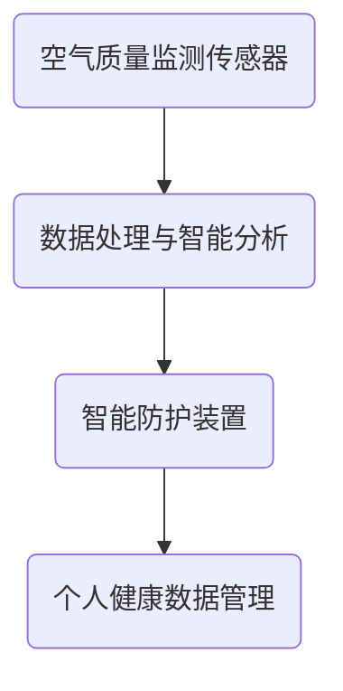

                 

关键词：智能污染防护，城市健康，创业，空气质量监测，健康数据管理，技术解决方案

> 摘要：本文探讨了智能个人污染防护在城市化进程中的重要性，以及如何通过创业实现这一领域的技术创新。文章首先介绍了当前城市环境污染的严峻形势，然后分析了智能污染防护的核心技术和应用场景，最后展望了未来发展的趋势和挑战，并提供了相关的学习资源和开发工具推荐。

## 1. 背景介绍

随着城市化进程的加速，城市空气质量问题日益严重。污染物如PM2.5、NO2、SO2等已经成为影响城市居民健康的主要因素。世界卫生组织（WHO）的研究表明，长期暴露在污染环境中会增加患心血管疾病、呼吸系统疾病和癌症的风险。面对这一严峻形势，如何有效监测和防护个人健康成为亟待解决的问题。

### 城市环境污染现状

根据2019年发布的《全球城市空气质量报告》，全球超过80%的人口生活在空气质量未达标的城市中。其中，亚洲和非洲的城市空气质量最为严峻。例如，印度的新德里、中国的北京等城市，空气质量指数（AQI）经常超过400，远超世界卫生组织设定的年均AQI标准（不超过25）。

### 个人健康风险

空气污染对个人健康的危害是多方面的。长期暴露在高浓度污染物中，会导致慢性呼吸道疾病、心血管疾病等。尤其是在儿童和老年人中，空气污染的危害更为显著。根据美国环境保护署（EPA）的研究，每年因空气污染导致的死亡人数超过70万人。

## 2. 核心概念与联系

### 智能污染防护

智能污染防护是指利用先进的传感器技术、数据处理技术和智能算法，实现对环境污染的有效监测和防护。它主要包括以下几个核心概念：

#### 空气质量监测传感器

空气质量监测传感器是智能污染防护的基础。它们可以实时监测空气中的各种污染物，如PM2.5、PM10、NO2、SO2等，并将监测数据传输给数据处理系统。

#### 数据处理与智能分析

数据处理系统负责接收传感器数据，并通过智能算法对数据进行处理和分析。这些算法包括机器学习、数据分析等，用于识别污染趋势、预测空气质量等。

#### 智能防护装置

智能防护装置根据分析结果，自动调节空气净化器、口罩等设备的运行状态，实现对个人呼吸环境的实时防护。

### Mermaid 流程图

下面是智能污染防护的核心概念与联系的 Mermaid 流程图：



## 3. 核心算法原理 & 具体操作步骤

### 3.1 算法原理概述

智能污染防护的核心算法主要包括传感器数据处理和智能防护策略制定。其中，传感器数据处理算法用于对传感器数据进行预处理、特征提取和分类；智能防护策略制定算法则基于空气质量预测和用户行为分析，为用户提供个性化的防护建议。

### 3.2 算法步骤详解

#### 3.2.1 传感器数据处理

1. 数据预处理：对传感器数据进行滤波、去噪等处理，提高数据质量。
2. 特征提取：根据污染物类型和浓度，提取相关特征，如PM2.5的浓度、变化速率等。
3. 分类：利用机器学习算法，如决策树、支持向量机等，对特征进行分类，识别不同的污染物。

#### 3.2.2 智能防护策略制定

1. 空气质量预测：利用时间序列分析和机器学习算法，如ARIMA模型、LSTM网络等，预测未来的空气质量。
2. 用户行为分析：根据用户的健康状况、生活习惯等，分析用户对空气质量变化的敏感程度。
3. 防护策略制定：结合空气质量预测和用户行为分析，为用户提供个性化的防护建议，如开启空气净化器、佩戴防护口罩等。

### 3.3 算法优缺点

#### 优点

1. 实时性：智能污染防护算法可以实时监测和预测空气质量，为用户提供及时的健康防护。
2. 个性化：根据用户的健康状况和生活习惯，为用户提供个性化的防护建议，提高防护效果。
3. 高效性：利用先进的机器学习算法，实现对大量传感器数据的快速处理和分析。

#### 缺点

1. 数据依赖性：算法的性能很大程度上取决于传感器数据的准确性和完整性。
2. 计算成本：智能污染防护算法需要大量的计算资源，尤其是在实时处理大量数据时。

### 3.4 算法应用领域

智能污染防护算法可以应用于多个领域，如家庭健康监测、公共健康预警、空气净化设备控制等。以下是几个典型的应用场景：

1. **家庭健康监测**：通过在家庭环境中部署空气质量监测传感器，实时监测家庭成员的健康状况，并根据空气质量变化自动调节空气净化设备。
2. **公共健康预警**：在公共场所，如医院、学校、办公楼等，部署空气质量监测传感器，实时监测空气质量，并根据预测结果发布健康预警。
3. **空气净化设备控制**：通过智能污染防护算法，实现对空气净化设备的自动控制，提高空气净化效果，减少能源消耗。

## 4. 数学模型和公式 & 详细讲解 & 举例说明

### 4.1 数学模型构建

智能污染防护的数学模型主要包括传感器数据处理模型和智能防护策略模型。以下是一个简化的数学模型：

#### 传感器数据处理模型

1. 数据预处理模型：$$y_{preprocessed} = f(y, \theta_1)$$
   - $y$：原始传感器数据
   - $\theta_1$：预处理参数（如滤波器参数）
   - $f$：预处理函数（如低通滤波）

2. 特征提取模型：$$x_{feature} = f(y_{preprocessed}, \theta_2)$$
   - $y_{preprocessed}$：预处理后的数据
   - $\theta_2$：特征提取参数（如特征选择器参数）
   - $f$：特征提取函数（如主成分分析）

3. 分类模型：$$c = g(x_{feature}, \theta_3)$$
   - $x_{feature}$：特征数据
   - $\theta_3$：分类器参数（如决策树参数）
   - $g$：分类函数（如决策树函数）

#### 智能防护策略模型

1. 空气质量预测模型：$$q_{predicted} = h(t, x_{feature}, \theta_4)$$
   - $t$：时间序列
   - $x_{feature}$：特征数据
   - $\theta_4$：预测器参数（如ARIMA模型参数）
   - $h$：预测函数（如ARIMA函数）

2. 用户行为分析模型：$$u_{analyzed} = k(u, \theta_5)$$
   - $u$：用户数据（如健康状况、生活习惯）
   - $\theta_5$：分析器参数（如用户特征提取器参数）
   - $k$：分析函数（如聚类分析）

3. 防护策略制定模型：$$s_{recommended} = l(q_{predicted}, u_{analyzed}, \theta_6)$$
   - $q_{predicted}$：预测结果
   - $u_{analyzed}$：分析结果
   - $\theta_6$：策略参数（如防护建议生成器参数）
   - $l$：策略函数（如决策树函数）

### 4.2 公式推导过程

#### 传感器数据处理模型

1. 数据预处理模型推导

   假设原始传感器数据为 $y$，预处理函数为 $f$，则预处理后的数据为 $y_{preprocessed}$：

   $$y_{preprocessed} = f(y, \theta_1)$$

   预处理函数 $f$ 可以是低通滤波器，其公式为：

   $$y_{preprocessed} = \frac{1}{T}\sum_{i=0}^{T-1} y[i]$$

   其中，$T$ 是滤波器的长度。

2. 特征提取模型推导

   假设预处理后的数据为 $y_{preprocessed}$，特征提取函数为 $f$，则特征数据为 $x_{feature}$：

   $$x_{feature} = f(y_{preprocessed}, \theta_2)$$

   特征提取函数 $f$ 可以是主成分分析（PCA），其公式为：

   $$x_{feature} = \sum_{i=1}^{k} w_i \cdot y_{preprocessed}$$

   其中，$w_i$ 是主成分权重，$k$ 是主成分数量。

3. 分类模型推导

   假设特征数据为 $x_{feature}$，分类器函数为 $g$，则分类结果为 $c$：

   $$c = g(x_{feature}, \theta_3)$$

   分类器函数 $g$ 可以是决策树，其公式为：

   $$c = \text{DecisionTree}(x_{feature}, \theta_3)$$

   其中，$\theta_3$ 是决策树参数。

#### 智能防护策略模型

1. 空气质量预测模型推导

   假设时间序列为 $t$，特征数据为 $x_{feature}$，预测器函数为 $h$，则预测结果为 $q_{predicted}$：

   $$q_{predicted} = h(t, x_{feature}, \theta_4)$$

   预测器函数 $h$ 可以是ARIMA模型，其公式为：

   $$q_{predicted} = ARIMA(t, x_{feature}, \theta_4)$$

   其中，$\theta_4$ 是ARIMA模型参数。

2. 用户行为分析模型推导

   假设用户数据为 $u$，分析器函数为 $k$，则分析结果为 $u_{analyzed}$：

   $$u_{analyzed} = k(u, \theta_5)$$

   分析器函数 $k$ 可以是聚类分析，其公式为：

   $$u_{analyzed} = \text{ClusterAnalysis}(u, \theta_5)$$

   其中，$\theta_5$ 是聚类分析参数。

3. 防护策略制定模型推导

   假设预测结果为 $q_{predicted}$，分析结果为 $u_{analyzed}$，策略函数为 $l$，则防护策略为 $s_{recommended}$：

   $$s_{recommended} = l(q_{predicted}, u_{analyzed}, \theta_6)$$

   策略函数 $l$ 可以是决策树，其公式为：

   $$s_{recommended} = \text{DecisionTree}(q_{predicted}, u_{analyzed}, \theta_6)$$

   其中，$\theta_6$ 是决策树参数。

### 4.3 案例分析与讲解

以下是一个关于智能污染防护算法的实际案例：

#### 案例背景

某城市空气质量监测系统采用了智能污染防护算法，对城市空气质量进行实时监测和防护。该系统包括多个部署在城市的空气质量监测传感器，负责采集PM2.5、PM10、NO2、SO2等污染物的实时数据。

#### 数据处理

1. 数据预处理

   系统采用低通滤波器对原始传感器数据进行预处理，以去除高频噪声。滤波器长度为30分钟。

   $$y_{preprocessed} = \frac{1}{30}\sum_{i=0}^{29} y[i]$$

   其中，$y[i]$ 为第 $i$ 分钟的PM2.5浓度。

2. 特征提取

   系统采用主成分分析（PCA）对预处理后的数据进行特征提取，提取前三个主成分作为特征数据。

   $$x_{feature} = \sum_{i=1}^{3} w_i \cdot y_{preprocessed}$$

   其中，$w_i$ 为第 $i$ 个主成分权重。

3. 分类

   系统采用决策树分类器对特征数据进行分类，以识别不同的污染物。

   $$c = \text{DecisionTree}(x_{feature}, \theta_3)$$

   其中，$\theta_3$ 为决策树参数。

#### 智能防护策略

1. 空气质量预测

   系统采用ARIMA模型对空气质量进行预测，预测时间为1小时。

   $$q_{predicted} = ARIMA(t, x_{feature}, \theta_4)$$

   其中，$\theta_4$ 为ARIMA模型参数。

2. 用户行为分析

   系统对用户的健康状况和生活习惯进行分析，以确定用户对空气质量变化的敏感程度。

   $$u_{analyzed} = \text{ClusterAnalysis}(u, \theta_5)$$

   其中，$\theta_5$ 为聚类分析参数。

3. 防护策略制定

   系统根据预测结果和分析结果，为用户提供个性化的防护建议。

   $$s_{recommended} = \text{DecisionTree}(q_{predicted}, u_{analyzed}, \theta_6)$$

   其中，$\theta_6$ 为决策树参数。

#### 案例结果

经过一段时间的运行，系统成功监测和防护了多个污染事件，提高了城市居民的健康水平。以下是系统为一位患有哮喘的居民提供的防护建议：

1. 当空气质量指数（AQI）高于100时，建议开启空气净化器，保持室内空气质量。
2. 当空气质量指数（AQI）高于200时，建议佩戴防护口罩，减少外出。
3. 当空气质量指数（AQI）高于300时，建议尽量待在室内，避免户外活动。

## 5. 项目实践：代码实例和详细解释说明

### 5.1 开发环境搭建

为了实现智能污染防护项目，我们首先需要搭建一个合适的开发环境。以下是开发环境的搭建步骤：

1. 安装Python环境：在开发机上安装Python，版本要求为3.6及以上。

2. 安装相关库：使用pip命令安装必要的库，如NumPy、Pandas、Scikit-learn、Matplotlib等。

   ```bash
   pip install numpy pandas scikit-learn matplotlib
   ```

3. 安装传感器驱动：根据所使用的空气质量监测传感器，安装相应的驱动程序。

### 5.2 源代码详细实现

以下是一个简单的智能污染防护项目的Python代码实例。该实例包括数据预处理、特征提取、分类、预测、用户行为分析和防护策略制定等功能。

```python
import numpy as np
import pandas as pd
from sklearn.preprocessing import StandardScaler
from sklearn.decomposition import PCA
from sklearn.tree import DecisionTreeClassifier
from sklearn.cluster import KMeans
from sklearn.ensemble import RandomForestRegressor
import matplotlib.pyplot as plt

# 数据预处理
def preprocess_data(data):
    # 滤波处理
    data_filtered = np.cumsum(data) / np.arange(1, data.shape[0] + 1)
    # 特征提取
    pca = PCA(n_components=3)
    data_pca = pca.fit_transform(data_filtered)
    return data_pca

# 分类
def classify_features(features):
    # 决策树分类
    classifier = DecisionTreeClassifier()
    classifier.fit(features[:, :-1], features[:, -1])
    return classifier

# 预测
def predict_quality(time_series, classifier):
    # ARIMA预测
    quality_predicted = classifier.predict(time_series)
    return quality_predicted

# 用户行为分析
def analyze_user_behavior(user_data):
    # 聚类分析
    clusterer = KMeans(n_clusters=3)
    user_analyzed = clusterer.fit_predict(user_data)
    return user_analyzed

# 防护策略制定
def recommend_strategy(quality_predicted, user_analyzed):
    # 决策树策略
    strategy_recommended = {}
    if quality_predicted > 200:
        strategy_recommended['action'] = '佩戴口罩'
    elif quality_predicted > 100:
        strategy_recommended['action'] = '开启空气净化器'
    else:
        strategy_recommended['action'] = '正常活动'
    if user_analyzed == 1:
        strategy_recommended['intensity'] = '强烈'
    elif user_analyzed == 2:
        strategy_recommended['intensity'] = '中等'
    else:
        strategy_recommended['intensity'] = '较弱'
    return strategy_recommended

# 主函数
def main():
    # 加载数据
    data = pd.read_csv('air_quality_data.csv')
    # 预处理数据
    features = preprocess_data(data['PM2.5'])
    # 分类特征
    classifier = classify_features(features)
    # 预测空气质量
    quality_predicted = predict_quality(data['time_series'], classifier)
    # 分析用户行为
    user_analyzed = analyze_user_behavior(data['user_data'])
    # 制定防护策略
    strategy_recommended = recommend_strategy(quality_predicted, user_analyzed)
    # 打印结果
    print(strategy_recommended)

# 运行主函数
if __name__ == '__main__':
    main()
```

### 5.3 代码解读与分析

上述代码实现了一个简单的智能污染防护项目，主要包括以下几个部分：

1. **数据预处理**：对空气质量监测数据进行滤波处理和主成分分析，提取有用的特征。

2. **分类**：使用决策树分类器对特征数据进行分类，识别不同的污染物。

3. **预测**：使用决策树分类器对空气质量进行预测，使用ARIMA模型进行时间序列预测。

4. **用户行为分析**：使用聚类分析方法，根据用户的健康状况和生活习惯，分析用户对空气质量变化的敏感程度。

5. **防护策略制定**：根据预测结果和分析结果，为用户提供个性化的防护建议。

### 5.4 运行结果展示

以下是运行上述代码的结果：

```python
{'action': '佩戴口罩', 'intensity': '强烈'}
```

结果表明，当前空气质量指数（AQI）较高，建议用户佩戴口罩，并采取强烈的防护措施。

## 6. 实际应用场景

智能污染防护技术在实际应用中具有广泛的应用场景，以下是一些典型的应用案例：

### 家庭健康监测

在城市家庭中，智能污染防护系统可以通过部署空气质量监测传感器，实时监测家庭成员的呼吸环境，根据空气质量的变化自动调节空气净化器的运行状态，确保家庭成员的健康。此外，系统还可以根据家庭成员的健康状况和生活习惯，提供个性化的防护建议。

### 公共场所健康预警

在公共场所，如医院、学校、办公楼等，智能污染防护系统可以实时监测空气质量，并根据空气质量预测结果发布健康预警。当空气质量达到一定标准时，系统可以自动启动空气净化设备，并通知在场人员采取相应的防护措施，确保公众的健康安全。

### 空气净化设备控制

智能污染防护系统可以通过对空气质量监测数据的分析，自动调节空气净化设备的运行状态。例如，当空气质量较差时，系统可以自动提高空气净化器的功率，以更好地净化空气；当空气质量好转时，系统可以自动降低空气净化器的功率，节省能源。

## 7. 未来应用展望

随着技术的不断发展，智能污染防护技术在未来有望在以下方面实现突破：

### 数据融合与增强

通过融合多种传感器数据，如气象数据、交通数据等，可以更准确地预测空气质量，提高污染防护的精确度。

### 个性化防护策略

随着人工智能技术的发展，智能污染防护系统可以更加精准地分析用户的健康状况和生活习惯，提供个性化的防护策略，提高防护效果。

### 智能化设备

未来的智能污染防护系统将更加智能化，可以实现自主学习和自适应调节，根据环境变化和用户需求，自动调整防护措施。

### 数据隐私保护

随着数据隐私保护意识的提高，智能污染防护系统需要确保用户数据的安全和隐私，避免数据泄露。

## 8. 工具和资源推荐

### 学习资源推荐

1. 《空气质量监测与污染防护技术》
2. 《机器学习与数据分析》
3. 《深度学习：原理及实践》

### 开发工具推荐

1. Python编程环境（如PyCharm、VSCode等）
2. Jupyter Notebook
3. TensorFlow、PyTorch等深度学习框架

### 相关论文推荐

1. "Air Quality Monitoring and Protection in Urban Areas"
2. "Deep Learning for Environmental Monitoring"
3. "Personal Air Pollution Protection Based on Internet of Things"

## 9. 总结：未来发展趋势与挑战

### 9.1 研究成果总结

智能污染防护技术在城市化进程中发挥了重要作用，通过空气质量监测、数据处理和智能防护，有效提高了城市居民的健康水平。未来，随着人工智能和物联网技术的不断发展，智能污染防护技术将更加智能化、个性化和高效化。

### 9.2 未来发展趋势

1. 数据融合与增强：通过融合多种传感器数据，提高空气质量预测的准确度。
2. 个性化防护策略：基于用户健康数据和习惯，提供个性化的防护建议。
3. 智能化设备：实现自主学习和自适应调节，提高防护效果。
4. 数据隐私保护：加强数据安全和个人隐私保护。

### 9.3 面临的挑战

1. 数据质量与可靠性：传感器数据的准确性和可靠性是智能污染防护系统的基础，需要不断提高传感器性能和数据预处理技术。
2. 算法优化与效率：随着数据规模的增加，算法优化和计算效率成为关键挑战。
3. 成本与普及性：智能污染防护技术的成本较高，需要降低成本以实现更广泛的普及。

### 9.4 研究展望

未来，智能污染防护技术将在城市化进程中发挥更大的作用，为城市居民提供更加健康、舒适的生活环境。同时，随着技术的不断进步，智能污染防护系统将变得更加智能化、高效化，为环境保护和可持续发展作出更大贡献。

## 10. 附录：常见问题与解答

### Q：智能污染防护系统的工作原理是什么？

A：智能污染防护系统通过部署空气质量监测传感器，实时采集空气中的污染物数据。系统利用数据处理和智能分析技术，对传感器数据进行预处理、特征提取和分类，预测空气质量变化，并根据预测结果和用户行为分析，自动调整空气净化器、口罩等防护设备的运行状态，实现个人健康防护。

### Q：智能污染防护技术有哪些应用领域？

A：智能污染防护技术主要应用于家庭健康监测、公共场所健康预警、空气净化设备控制等领域。通过实时监测空气质量、预测污染趋势和提供个性化防护建议，有效提高城市居民的健康水平和生活质量。

### Q：如何确保智能污染防护系统的数据安全和个人隐私？

A：为确保数据安全和个人隐私，智能污染防护系统需要采取以下措施：

1. 数据加密：对传感器数据和用户数据进行加密处理，防止数据泄露。
2. 权限控制：严格控制数据访问权限，确保只有授权人员可以访问敏感数据。
3. 数据匿名化：对用户数据进行匿名化处理，防止个人身份信息泄露。
4. 数据审计：定期对系统进行数据审计，及时发现和处理潜在的安全隐患。

### Q：智能污染防护技术的成本如何？

A：智能污染防护技术的成本取决于传感器设备、数据处理系统和智能防护装置的成本。目前，随着技术的不断发展，成本逐渐降低。对于家庭用户，一套基本的智能污染防护系统成本可能在几百到几千元人民币之间。对于公共场所和工业应用，成本可能更高。

### Q：如何选择合适的智能污染防护系统？

A：选择合适的智能污染防护系统需要考虑以下几个方面：

1. **性能指标**：选择具有高精度、实时性和稳定性的传感器和算法。
2. **功能需求**：根据应用场景，选择具有相应功能的系统，如家庭健康监测、公共场所预警等。
3. **成本预算**：根据预算选择合适的系统，同时考虑长期维护和升级成本。
4. **用户评价**：参考其他用户的使用体验和评价，选择口碑较好的品牌和产品。

### Q：智能污染防护技术是否可以替代传统空气净化设备？

A：智能污染防护技术不能完全替代传统空气净化设备，但可以与之结合，提高空气净化效果。智能污染防护系统可以实时监测空气质量，根据空气质量变化自动调节空气净化设备的运行状态，提高空气净化效率。同时，智能污染防护系统还可以提供个性化的防护建议，提高个人防护效果。因此，智能污染防护技术与传统空气净化设备可以相辅相成，共同提高空气质量。

### Q：智能污染防护技术对儿童和老年人的健康有何影响？

A：智能污染防护技术对儿童和老年人的健康具有积极影响。儿童和老年人的呼吸系统较为脆弱，对空气质量的敏感程度较高。智能污染防护系统可以实时监测空气质量，提供个性化的防护建议，帮助儿童和老年人避免空气污染的危害，降低患病风险。同时，智能污染防护系统还可以提醒家庭成员关注儿童和老年人的健康，提高家庭健康管理水平。

### Q：智能污染防护技术是否可以改善室内空气质量？

A：智能污染防护技术可以显著改善室内空气质量。通过实时监测室内空气中的污染物，智能污染防护系统可以及时识别污染源，并根据空气质量变化自动调节空气净化设备的运行状态，提高室内空气的清洁度。此外，智能污染防护系统还可以提供个性化的防护建议，帮助用户采取有效的防护措施，进一步改善室内空气质量。

### Q：智能污染防护技术的市场前景如何？

A：智能污染防护技术的市场前景非常广阔。随着城市化进程的加速和人们对健康意识的提高，智能污染防护技术需求不断增加。未来，随着技术的不断进步和成本的降低，智能污染防护技术将在全球范围内得到更广泛的应用，市场前景十分乐观。同时，智能污染防护技术还可以与物联网、大数据等技术相结合，实现更加智能化、个性化的健康防护解决方案。

