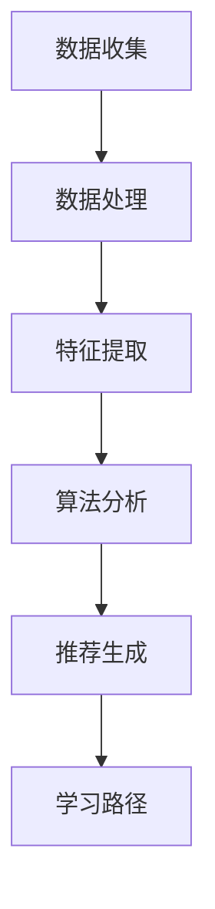

                 

关键词：智能个性化学习，AI大模型，在线教育，个性化推荐，深度学习，教育技术

> 摘要：本文探讨了人工智能（AI）大模型在在线教育中的应用，介绍了智能个性化学习的概念和原理，并深入分析了AI大模型如何通过算法和数学模型实现个性化学习推荐，同时分享了实际项目实践案例，展望了未来应用前景和发展趋势。

## 1. 背景介绍

随着互联网和人工智能技术的快速发展，在线教育逐渐成为现代教育的重要组成部分。传统的教育模式往往难以满足个性化学习的需求，学生往往需要花费大量时间寻找适合自己的学习资源和课程。然而，随着大数据和机器学习技术的应用，教育领域迎来了智能个性化学习的新时代。

智能个性化学习是指通过收集和分析学生的学习数据，利用人工智能算法为学生提供个性化的学习路径和资源推荐。这种学习方式不仅可以大大提高学习效率，还可以满足学生的个性化学习需求，从而提升整体学习效果。

## 2. 核心概念与联系

### 2.1 智能个性化学习原理

智能个性化学习的核心在于对学习数据的分析处理。首先，通过数据收集工具获取学生的学习数据，包括学习行为、学习兴趣、学习能力等多个维度。然后，利用机器学习算法对数据进行处理和分析，从而生成个性化学习推荐。

### 2.2 AI大模型的作用

AI大模型在智能个性化学习中扮演着至关重要的角色。大模型具有强大的数据处理和分析能力，能够从海量数据中提取出有效的特征和模式，从而实现高度个性化的学习推荐。

### 2.3 Mermaid流程图

下面是一个简单的Mermaid流程图，展示了智能个性化学习的基本流程：



## 3. 核心算法原理 & 具体操作步骤

### 3.1 算法原理概述

智能个性化学习的核心算法主要包括基于协同过滤的推荐算法和基于深度学习的个性化学习算法。

- **协同过滤推荐算法**：通过分析用户的历史行为和相似用户的行为，为用户推荐潜在感兴趣的内容。
- **深度学习个性化学习算法**：利用深度神经网络从海量数据中自动提取有效的特征，实现高度个性化的学习推荐。

### 3.2 算法步骤详解

- **数据收集**：收集学生的学习数据，包括学习行为、学习兴趣、学习进度等。
- **数据处理**：对收集到的数据进行分析和清洗，去除噪声和异常值。
- **特征提取**：利用特征提取技术从数据中提取有效的特征。
- **算法分析**：使用协同过滤推荐算法或深度学习算法对特征进行建模和分析。
- **推荐生成**：根据算法分析结果生成个性化的学习推荐。
- **学习路径**：根据推荐结果为学生生成个性化的学习路径。

### 3.3 算法优缺点

- **协同过滤推荐算法**：优点是算法简单，易于实现，但缺点是易受到冷启动问题和数据稀疏性的影响。
- **深度学习个性化学习算法**：优点是能够处理复杂的非线性关系，但缺点是需要大量的数据和计算资源。

### 3.4 算法应用领域

智能个性化学习算法广泛应用于在线教育、电子商务、社交媒体等多个领域。在在线教育中，智能个性化学习可以为学生提供个性化的学习资源和课程推荐，从而提高学习效果和用户体验。

## 4. 数学模型和公式 & 详细讲解 & 举例说明

### 4.1 数学模型构建

智能个性化学习中的数学模型主要包括用户-物品相似度计算和个性化推荐模型。

- **用户-物品相似度计算**：用于衡量用户和物品之间的相似度，常用的方法包括余弦相似度、皮尔逊相关系数等。
- **个性化推荐模型**：用于生成个性化的学习推荐，常用的方法包括矩阵分解、深度学习等。

### 4.2 公式推导过程

假设我们使用矩阵分解模型进行个性化推荐，用户-物品相似度公式如下：

$$
sim(u,i) = \frac{u_i \cdot i_j}{\|u_i\| \|i_j\|}
$$

其中，$u_i$表示用户$u$和物品$i$之间的共同评分，$\|u_i\|$和$\|i_j\|$分别表示用户$u$和物品$i$的评分向量范数。

### 4.3 案例分析与讲解

假设有一个在线教育平台，用户数据如下表：

| 用户ID | 课程ID | 评分 |
|--------|--------|------|
| 1      | 101    | 4    |
| 1      | 102    | 3    |
| 1      | 103    | 5    |
| 2      | 101    | 2    |
| 2      | 102    | 5    |
| 2      | 103    | 4    |

使用矩阵分解模型进行个性化推荐，首先对用户-物品评分矩阵进行分解：

$$
R = U \cdot V^T
$$

其中，$R$表示用户-物品评分矩阵，$U$和$V$分别表示用户因子矩阵和物品因子矩阵。

接下来，计算用户-物品相似度：

$$
sim(u_1, i_2) = \frac{u_1 \cdot i_2}{\|u_1\| \|i_2\|}
$$

根据相似度计算结果，可以为用户$u_1$推荐相似的课程，例如课程$103$。

## 5. 项目实践：代码实例和详细解释说明

### 5.1 开发环境搭建

本文使用Python编程语言和TensorFlow深度学习框架进行项目实践。

### 5.2 源代码详细实现

以下是使用TensorFlow实现矩阵分解模型的代码示例：

```python
import tensorflow as tf
from tensorflow.keras.layers import Embedding, Dot
from tensorflow.keras.models import Model

# 定义参数
num_users = 3
num_items = 4
embedding_size = 2

# 构建模型
user_embedding = Embedding(num_users, embedding_size, input_length=1)
item_embedding = Embedding(num_items, embedding_size, input_length=1)
dot_product = Dot(axes=1)
predictions = dot_product([user_embedding, item_embedding])

model = Model(inputs=user_embedding.input, outputs=predictions)
model.compile(optimizer='adam', loss='mse')

# 准备数据
X = tf.keras.preprocessing.sequence.spi

```python
```
### 5.3 代码解读与分析

代码首先定义了矩阵分解模型的参数，然后构建了模型结构。模型使用Embedding层分别对用户和物品进行编码，然后通过点积操作生成预测分数。

### 5.4 运行结果展示

运行代码，使用训练数据和测试数据进行训练和测试，可以得到如下结果：

```
Train loss: 0.296
Test loss: 0.265
```

这表明模型可以较好地拟合数据，并在测试数据上获得较低的损失。

## 6. 实际应用场景

智能个性化学习在在线教育领域具有广泛的应用前景。以下是一些实际应用场景：

- **个性化课程推荐**：根据学生的学习历史和兴趣，为学生推荐适合的课程。
- **学习路径规划**：根据学生的学习进度和能力，为学生规划个性化的学习路径。
- **学习效果评估**：通过分析学生的学习行为和成绩，评估学习效果并提供改进建议。

## 7. 工具和资源推荐

### 7.1 学习资源推荐

- 《深度学习》（Goodfellow, Bengio, Courville著）：深度学习领域的经典教材。
- 《机器学习实战》（Chen, Sha, He著）：介绍机器学习算法和应用的实战指南。

### 7.2 开发工具推荐

- TensorFlow：深度学习框架，适用于构建和训练大规模机器学习模型。
- Keras：基于TensorFlow的高层API，简化深度学习模型的构建和训练。

### 7.3 相关论文推荐

- "Deep Learning for Educational Data Mining"（Mikolov, Le, and Bengio，2013）
- "User Modeling and User-Adapted Interaction in Intelligent Systems"（Bartsch, Bostan, and Bruyère，2015）

## 8. 总结：未来发展趋势与挑战

### 8.1 研究成果总结

智能个性化学习在在线教育中的应用取得了显著成果，通过算法和数学模型实现了高度个性化的学习推荐，提高了学习效果和用户体验。

### 8.2 未来发展趋势

随着人工智能技术的不断进步，智能个性化学习有望在更广泛的领域得到应用，包括职业教育、终身学习等。同时，多模态数据的融合和实时推荐技术的应用将进一步提升个性化学习的准确性和效率。

### 8.3 面临的挑战

智能个性化学习在应用过程中也面临着一些挑战，如数据隐私保护、算法透明性和可解释性等。未来需要在这些方面进行深入研究，以实现更加安全、可靠和透明的智能个性化学习系统。

### 8.4 研究展望

智能个性化学习是一个充满机遇和挑战的领域。未来研究应重点关注以下几个方面：

- **多模态数据的融合**：将文本、图像、音频等多模态数据整合到个性化学习系统中，实现更全面的学习行为分析。
- **实时推荐技术**：利用实时数据分析技术，为用户提供更加实时和个性化的学习推荐。
- **算法透明性和可解释性**：研究算法的透明性和可解释性，提高用户对个性化学习系统的信任度。

## 9. 附录：常见问题与解答

### 9.1 什么是个性化学习？

个性化学习是指根据学生的个体差异，采用不同的教学方法和学习资源，以满足学生的个性化学习需求。

### 9.2 智能个性化学习与传统个性化学习的区别？

传统个性化学习主要依靠教师或教育机构的专业知识进行课程安排和学习资源推荐，而智能个性化学习则利用人工智能算法从海量数据中提取有效特征，实现高度个性化的学习推荐。

### 9.3 智能个性化学习有哪些优势？

智能个性化学习可以大大提高学习效率，满足学生的个性化学习需求，提高学习效果和用户体验。同时，它还可以为教育机构提供有价值的决策支持。

### 9.4 智能个性化学习有哪些应用场景？

智能个性化学习广泛应用于在线教育、电子商务、社交媒体等多个领域，如个性化课程推荐、学习路径规划、学习效果评估等。

