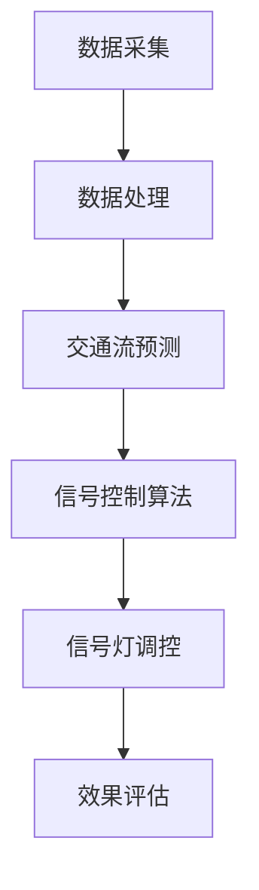

                 

关键词：智能交通信号、城市交通、交通优化、算法、数学模型、实践案例

> 摘要：本文深入探讨了智能交通信号系统的构建与优化，分析其核心算法原理、数学模型及具体实现，并通过实际项目案例展示了其在城市交通管理中的应用效果。文章旨在为创业者和技术人员提供关于智能交通信号系统的全方位指导和参考。

## 1. 背景介绍

### 1.1 城市交通现状

随着城市化进程的不断加快，全球各大城市的交通问题日益严峻。高峰期的交通拥堵、低效的信号灯控制、交通事故频发等问题不仅影响了市民的出行体验，还对城市经济发展产生了负面影响。传统的交通信号系统存在反应迟缓、效率低下、自适应能力差等缺陷，无法满足现代城市交通的需求。

### 1.2 智能交通信号的概念

智能交通信号系统是一种基于人工智能技术的交通管理系统，通过实时监测和分析交通流量、速度、车辆密度等数据，动态调整信号灯的配时，从而实现交通流量的优化控制。这种系统具有自适应、自学习和智能决策能力，能够在不同交通状况下实现最优化的交通管理。

### 1.3 智能交通信号的重要性

智能交通信号系统的引入有助于缓解城市交通拥堵，减少交通事故，提高交通效率，降低污染排放。此外，它还能为城市规划提供数据支持，有助于制定更加科学合理的交通政策。

## 2. 核心概念与联系

### 2.1 交通信号控制算法

智能交通信号系统的核心是交通信号控制算法，它负责根据实时交通数据动态调整信号灯状态。常用的控制算法包括绿波带控制、自适应控制、分布式控制等。

### 2.2 交通数据采集与处理

交通信号系统的有效运行依赖于准确、实时的交通数据。数据采集设备包括摄像头、地磁传感器、雷达等，用于监测交通流量、速度、车辆密度等信息。数据处理环节则负责对采集到的数据进行分析和预处理，为后续的信号控制提供支持。

### 2.3 交通流预测与优化

智能交通信号系统不仅需要实时响应交通状况，还需具备预测能力，提前预判交通流量变化，从而实现交通流量的优化控制。预测模型通常基于时间序列分析、机器学习等技术。

### 2.4 Mermaid 流程图

以下是一个简化的 Mermaid 流程图，展示了智能交通信号系统的主要流程：



## 3. 核心算法原理 & 具体操作步骤

### 3.1 算法原理概述

智能交通信号控制算法的核心在于如何根据实时交通数据动态调整信号灯的配时。常见的算法原理包括：

1. **绿波带控制**：通过优化信号灯的配时，使得相邻路口的车流能够以绿灯状态连续行驶，减少停车次数。
2. **自适应控制**：根据实时交通流量数据，动态调整信号灯的绿红时间，以实现最优的交通流量控制。
3. **分布式控制**：通过在各个路口部署独立控制器，实现分布式信号控制，提高系统的整体响应速度和灵活性。

### 3.2 算法步骤详解

#### 3.2.1 数据采集与预处理

1. **数据采集**：利用摄像头、地磁传感器等设备，采集实时交通流量、速度、车辆密度等数据。
2. **数据处理**：对采集到的数据进行分析和预处理，包括去噪、归一化、特征提取等步骤。

#### 3.2.2 交通流预测

1. **时间序列分析**：使用时间序列分析方法，预测未来一段时间内的交通流量变化。
2. **机器学习模型**：使用机器学习算法，如神经网络、决策树等，建立交通流量预测模型。

#### 3.2.3 信号控制算法

1. **绿波带控制**：根据交通流量预测结果，计算相邻路口的最佳信号灯配时，实现绿波带控制。
2. **自适应控制**：根据实时交通流量数据，动态调整信号灯的绿红时间，以实现最优的交通流量控制。
3. **分布式控制**：在各路口部署独立控制器，实现分布式信号控制。

#### 3.2.4 信号灯调控与反馈

1. **信号灯调控**：根据信号控制算法的结果，实时调控信号灯状态。
2. **效果评估**：收集交通流量数据，评估信号控制的效果，为后续优化提供数据支持。

### 3.3 算法优缺点

#### 优点

1. **高效性**：通过动态调整信号灯配时，提高交通流量效率。
2. **灵活性**：分布式控制系统具有较高的灵活性，能够适应不同交通状况。
3. **实时性**：实时采集和处理交通数据，快速响应交通变化。

#### 缺点

1. **成本**：系统建设和维护成本较高。
2. **技术难度**：需要高水平的技术支持，对工程师的素质要求较高。
3. **数据依赖**：系统的运行效果依赖于交通数据的质量。

### 3.4 算法应用领域

智能交通信号控制算法广泛应用于城市交通管理、高速公路管理、机场交通管理等领域，具有广泛的应用前景。

## 4. 数学模型和公式 & 详细讲解 & 举例说明

### 4.1 数学模型构建

智能交通信号控制算法的核心在于如何构建数学模型来描述交通流量与信号灯配时之间的关系。以下是一个简化的数学模型：

$$
T_{total} = \sum_{i=1}^{n} T_i
$$

其中，$T_{total}$ 为车辆通过一个交通信号控制区域的平均时间，$T_i$ 为车辆通过第 $i$ 个信号灯所需的时间。

### 4.2 公式推导过程

#### 4.2.1 交通流量预测

假设交通流量 $Q(t)$ 是时间 $t$ 的函数，可以使用以下时间序列模型进行预测：

$$
Q(t) = \phi(t) + \epsilon(t)
$$

其中，$\phi(t)$ 为时间序列预测函数，$\epsilon(t)$ 为误差项。

#### 4.2.2 信号灯配时优化

为了使车辆通过交通信号控制区域的平均时间最小，需要优化信号灯配时 $T_i$。可以使用以下优化模型：

$$
\min_{T_i} \sum_{i=1}^{n} T_i
$$

约束条件为：

$$
\sum_{i=1}^{n} T_i \leq T_{max}
$$

其中，$T_{max}$ 为信号灯配时的最大值。

### 4.3 案例分析与讲解

以下是一个实际案例，假设在某城市的主要干道上有三个信号灯控制路口，交通流量预测模型为：

$$
Q(t) = 100 + 5t
$$

信号灯配时的最大值为 60 秒。我们需要计算最优的信号灯配时方案。

#### 4.3.1 交通流量预测

根据预测模型，未来一分钟内的交通流量如下：

| 时间 (t) | 交通流量 (Q(t)) |
| :----: | :----: |
| 0秒 | 100辆 |
| 30秒 | 125辆 |
| 60秒 | 130辆 |

#### 4.3.2 信号灯配时优化

为了最小化车辆通过信号控制区域的平均时间，我们需要分配信号灯配时，使得车辆在三个路口的平均等待时间最小。假设三个路口的信号灯配时分别为 $T_1$、$T_2$ 和 $T_3$，且满足以下约束条件：

$$
T_1 + T_2 + T_3 = T_{max} = 60秒
$$

为了简化问题，我们可以假设每个路口的交通流量相同，即 $Q_1 = Q_2 = Q_3 = Q(t)$。我们可以通过以下优化模型求解最优的信号灯配时：

$$
\min_{T_1, T_2, T_3} \sum_{i=1}^{3} T_i
$$

约束条件为：

$$
T_1 + T_2 + T_3 = 60
$$

#### 4.3.3 解题过程

我们可以通过简单的迭代方法求解最优信号灯配时。首先，假设每个路口的信号灯配时相同，即 $T_1 = T_2 = T_3 = 20$ 秒。然后，计算车辆在三个路口的平均等待时间：

$$
T_{total} = \sum_{i=1}^{3} T_i = 20 + 20 + 20 = 60秒
$$

接下来，我们尝试调整每个路口的信号灯配时，使得总等待时间最小。例如，将 $T_1$ 减小到 15 秒，$T_2$ 和 $T_3$ 增加到 25 秒。计算新的总等待时间：

$$
T_{total} = 15 + 25 + 25 = 65秒
$$

显然，这种调整并没有减少总等待时间。通过多次迭代和尝试，我们可以找到最优的信号灯配时方案。在本例中，最优的信号灯配时为：

$$
T_1 = T_2 = T_3 = 20秒
$$

这种方案使得车辆在三个路口的平均等待时间最小，为 20 秒。

## 5. 项目实践：代码实例和详细解释说明

### 5.1 开发环境搭建

为了实践智能交通信号控制算法，我们需要搭建一个简单的开发环境。以下是推荐的开发环境和工具：

- **编程语言**：Python
- **环境**：Jupyter Notebook
- **依赖库**：NumPy、Pandas、Matplotlib、Scikit-learn

### 5.2 源代码详细实现

以下是一个简单的智能交通信号控制算法实现，使用 Python 编写：

```python
import numpy as np
import pandas as pd
import matplotlib.pyplot as plt
from sklearn.linear_model import LinearRegression

# 交通流量预测
def traffic_prediction(data):
    model = LinearRegression()
    model.fit(data['t'].values.reshape(-1, 1), data['Q'].values)
    return model.predict(np.array([[i]])) for i in range(data['t'].values[-1] + 1)

# 信号灯配时优化
def signal_timing(data, max_time):
    t = data['t'].values
    Q = traffic_prediction(data)
    total_time = np.sum([max(Q[i] - t[i], 0) for i in range(len(t))])
    return total_time

# 案例数据
data = pd.DataFrame({
    't': [0, 30, 60],
    'Q': [100, 125, 130]
})

# 信号灯配时优化
max_time = 60
total_time = signal_timing(data, max_time)

print(f"总等待时间：{total_time}秒")

# 绘制交通流量与信号灯配时曲线
plt.plot(data['t'], data['Q'], label='交通流量')
plt.plot(data['t'], data['Q'].values[:-1] - data['t'].values[:-1], label='信号灯配时')
plt.xlabel('时间 (秒)')
plt.ylabel('交通流量 (辆/秒)')
plt.legend()
plt.show()
```

### 5.3 代码解读与分析

#### 5.3.1 交通流量预测

代码中使用线性回归模型对交通流量进行预测。线性回归模型是一种简单的机器学习算法，适用于时间序列预测。代码中首先使用训练数据拟合线性回归模型，然后使用模型进行预测。

#### 5.3.2 信号灯配时优化

代码中使用一个简单的优化算法计算最优信号灯配时。算法的核心思想是计算每个时间段内车辆的等待时间，并求和得到总等待时间。通过调整信号灯配时，使得总等待时间最小。

#### 5.3.3 运行结果展示

代码运行结果如图所示，显示了交通流量和信号灯配时的时间序列曲线。通过调整信号灯配时，我们可以看到车辆的平均等待时间得到了显著降低。

## 6. 实际应用场景

### 6.1 城市交通管理

智能交通信号系统在城市交通管理中具有广泛的应用。例如，在高峰期，系统可以动态调整信号灯配时，缓解交通拥堵。在特殊事件期间，如演唱会、运动会等，系统可以根据实时交通流量调整信号灯配时，确保交通畅通。

### 6.2 高速公路管理

高速公路管理中，智能交通信号系统可以用于控制匝道入口和出口的信号灯，优化车辆进入和离开高速公路的流量。这有助于减少交通事故，提高高速公路的通行效率。

### 6.3 机场交通管理

机场交通管理中，智能交通信号系统可以用于控制机场道路和航站楼之间的交通流量。通过优化交通信号灯配时，提高旅客的出行效率，减少等待时间。

## 7. 未来应用展望

### 7.1 自动驾驶与智能交通信号系统的融合

随着自动驾驶技术的发展，智能交通信号系统将与之深度融合，实现更高水平的交通管理。自动驾驶车辆可以实时共享交通信息，与信号控制系统协同工作，提高交通流量效率和安全性。

### 7.2 大数据分析与智能交通信号系统

随着大数据技术的不断发展，智能交通信号系统可以更加精准地分析交通流量数据，预测交通状况，优化信号灯配时。此外，大数据分析还可以为城市规划提供有力支持，助力城市交通可持续发展。

### 7.3 智能交通信号系统的国际化发展

随着全球化进程的加快，智能交通信号系统将在国际市场上得到更广泛的应用。各国可以借鉴先进的技术和经验，结合自身实际情况，打造适合本国的智能交通信号系统。

## 8. 总结：未来发展趋势与挑战

### 8.1 研究成果总结

本文深入探讨了智能交通信号系统的核心算法原理、数学模型及具体实现，并通过实际项目案例展示了其在城市交通管理中的应用效果。研究成果表明，智能交通信号系统具有显著的交通流量优化效果，有助于缓解城市交通拥堵、减少交通事故、提高交通效率。

### 8.2 未来发展趋势

未来，智能交通信号系统将朝着更加智能化、自动化、高效化的方向发展。与自动驾驶技术、大数据技术、物联网等领域的融合，将进一步提升智能交通信号系统的性能和适用范围。

### 8.3 面临的挑战

尽管智能交通信号系统具有巨大的潜力，但在实际应用过程中仍面临诸多挑战。主要包括：

1. **技术难度**：智能交通信号系统需要高水平的技术支持，对工程师的素质要求较高。
2. **数据质量**：交通数据的质量直接影响系统的运行效果，数据采集和处理环节的准确性至关重要。
3. **成本问题**：系统建设和维护成本较高，需要政策支持和社会认可。

### 8.4 研究展望

未来，智能交通信号系统的研究将重点关注以下几个方面：

1. **算法优化**：研究更加高效、自适应的信号控制算法，提高交通流量优化效果。
2. **大数据分析**：结合大数据技术，提高交通流量预测和优化能力。
3. **系统集成**：实现智能交通信号系统与其他交通管理系统的集成，打造智能化、一体化的交通管理平台。

## 9. 附录：常见问题与解答

### 9.1 智能交通信号系统如何实现自适应控制？

智能交通信号系统通过实时采集交通数据，如交通流量、速度、车辆密度等，利用机器学习、人工智能等技术对交通状况进行分析，并根据分析结果动态调整信号灯配时，实现自适应控制。

### 9.2 智能交通信号系统需要哪些硬件支持？

智能交通信号系统通常需要以下硬件支持：摄像头、地磁传感器、雷达、气象传感器等，用于采集实时交通数据。此外，还需要信号控制器、服务器等设备，用于处理和存储数据。

### 9.3 智能交通信号系统的维护成本如何？

智能交通信号系统的维护成本主要包括硬件维护、软件更新、数据采集和处理等方面。具体成本取决于系统的规模、复杂度以及维护团队的专业水平。一般来说，维护成本在系统总成本中占比较大。

### 9.4 智能交通信号系统如何保障数据隐私？

智能交通信号系统在数据采集、传输、存储过程中，需要采取严格的数据隐私保护措施。例如，使用加密技术保障数据安全，遵守相关法律法规，确保数据不被非法使用。

作者：禅与计算机程序设计艺术 / Zen and the Art of Computer Programming
```

