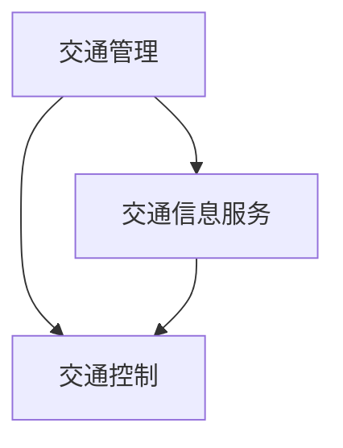

                 

关键词：智能交通，未来城市，移动解决方案，创业，交通管理，数据分析，智能算法

> 摘要：随着城市化进程的加速，智能交通系统已成为解决城市交通拥堵、提高交通效率、促进可持续发展的关键。本文旨在探讨智能交通创业领域的机遇与挑战，通过深入分析核心概念、算法原理、数学模型、项目实践和未来应用展望，为创业者和研究者提供有价值的参考。

## 1. 背景介绍

城市交通系统是现代城市基础设施的核心组成部分，直接关系到居民生活质量、经济发展和环境保护。然而，随着城市规模的不断扩大和机动车数量的急剧增加，传统交通管理方式面临巨大的挑战。交通拥堵、交通事故频发、空气污染等问题日益严重，迫使我们必须寻找更加智能和高效的解决方案。

智能交通系统（Intelligent Transportation System, ITS）应运而生，通过整合信息技术、通信技术、传感器技术和自动化控制技术，实现交通管理、交通信息服务的智能化。ITS的目标是提高交通系统的安全性、效率和可持续性，同时降低能源消耗和环境污染。

智能交通创业领域充满机遇与挑战。一方面，随着技术的不断进步，智能交通系统在算法、硬件和软件方面都取得了显著的突破，为创业者提供了丰富的创新空间。另一方面，智能交通系统的实施需要庞大的资金投入和复杂的协调机制，这对于初创企业来说是一个巨大的挑战。

## 2. 核心概念与联系

### 2.1 核心概念

智能交通系统的核心概念包括交通管理、交通信息服务和交通控制。交通管理是指通过智能手段对交通流量、交通信号、交通事故等进行实时监控和调控，以达到优化交通流量的目的。交通信息服务是指通过多种渠道为驾驶员和乘客提供实时的交通信息，如路况信息、出行建议等，以提高出行效率和满意度。交通控制是指利用智能算法和自动化控制技术对交通信号灯、电子显示屏等进行自动调节，以实现交通流量的动态优化。

### 2.2 概念联系

智能交通系统的各个核心概念之间存在紧密的联系。交通管理需要依赖交通信息服务提供实时数据支持，而交通信息服务的准确性又依赖于交通管理系统的监控和调控能力。交通控制则是交通管理和交通信息服务的具体实现方式，通过自动化技术实现交通信号的优化调节。

下面是一个用Mermaid绘制的智能交通系统核心概念及其联系流程图：



## 3. 核心算法原理 & 具体操作步骤

### 3.1 算法原理概述

智能交通系统中的核心算法主要包括交通流量预测算法、路径规划算法和交通信号控制算法。这些算法的基本原理是通过收集和分析交通数据，预测未来的交通状况，从而优化交通管理策略。

- **交通流量预测算法**：利用历史交通数据、实时交通数据和地理信息数据，通过时间序列分析、回归分析和机器学习等方法，预测未来某个时间段内的交通流量。

- **路径规划算法**：基于交通流量预测结果，为驾驶员提供最优路径，减少行驶时间和拥堵。

- **交通信号控制算法**：通过分析实时交通流量数据，动态调整交通信号灯的时长和相位，以实现交通流量的优化。

### 3.2 算法步骤详解

#### 3.2.1 交通流量预测算法

1. 数据收集：收集历史交通数据（如车辆流量、速度等）和实时交通数据（如摄像头、传感器等）。

2. 数据预处理：对收集到的数据进行清洗、去噪和特征提取。

3. 模型选择：选择适合的预测模型（如ARIMA、LSTM等）。

4. 模型训练：使用预处理后的数据对预测模型进行训练。

5. 预测与评估：使用训练好的模型进行交通流量预测，并对预测结果进行评估。

#### 3.2.2 路径规划算法

1. 路径搜索：使用A*算法或Dijkstra算法搜索所有可能的路径。

2. 路径评估：根据交通流量预测结果和车辆性能参数，评估各路径的行驶时间和拥堵程度。

3. 路径选择：选择最优路径，即为驾驶员提供路径规划建议。

#### 3.2.3 交通信号控制算法

1. 数据采集：收集实时交通流量数据。

2. 状态评估：根据交通流量数据评估当前交通信号灯的状态。

3. 控制策略：根据交通状态选择相应的控制策略（如固定时序控制、自适应控制等）。

4. 执行与反馈：执行控制策略，并根据反馈信息调整控制策略。

### 3.3 算法优缺点

#### 交通流量预测算法

- **优点**：可以提前预测交通状况，为交通管理和规划提供数据支持。

- **缺点**：预测准确性受数据质量和模型选择的影响，且对实时数据依赖性较强。

#### 路径规划算法

- **优点**：为驾驶员提供最优路径，减少行驶时间和拥堵。

- **缺点**：路径规划算法复杂度较高，对计算资源要求较高。

#### 交通信号控制算法

- **优点**：可以动态调节交通信号灯，提高交通流量。

- **缺点**：需要大量实时数据支持，控制策略设计较为复杂。

### 3.4 算法应用领域

- **交通管理**：通过交通流量预测和路径规划，优化交通管理策略。

- **智能导航**：为驾驶员提供最优路径规划，提高出行效率。

- **交通信号控制**：实现交通信号灯的自动化调节，提高交通流量。

## 4. 数学模型和公式 & 详细讲解 & 举例说明

### 4.1 数学模型构建

智能交通系统中的数学模型主要包括交通流量预测模型、路径规划模型和交通信号控制模型。下面以交通流量预测模型为例进行说明。

#### 交通流量预测模型

假设某路段在时间段[t0, t1]内的交通流量为Yt，我们可以构建以下线性回归模型：

$$
Yt = \beta_0 + \beta_1 \cdot X_{t1} + \beta_2 \cdot X_{t2} + \ldots + \beta_n \cdot X_{tn} + \epsilon_t
$$

其中，$X_{t1}, X_{t2}, \ldots, X_{tn}$ 为特征变量（如交通流量历史数据、天气状况等），$\beta_0, \beta_1, \beta_2, \ldots, \beta_n$ 为模型参数，$\epsilon_t$ 为误差项。

### 4.2 公式推导过程

为了推导交通流量预测模型的公式，我们可以从以下步骤开始：

1. 假设交通流量Yt与特征变量X之间的关系为线性关系。

2. 构建线性回归模型，将交通流量Yt表示为特征变量X的线性组合。

3. 使用最小二乘法求解模型参数。

具体推导过程如下：

$$
\min \sum_{t=1}^{n} (Y_t - \beta_0 - \beta_1 X_{t1} - \beta_2 X_{t2} - \ldots - \beta_n X_{tn})^2
$$

对参数$\beta_0, \beta_1, \beta_2, \ldots, \beta_n$ 分别求偏导并令其等于零，得到：

$$
\frac{\partial}{\partial \beta_0} \sum_{t=1}^{n} (Y_t - \beta_0 - \beta_1 X_{t1} - \beta_2 X_{t2} - \ldots - \beta_n X_{tn})^2 = 0
$$

$$
\frac{\partial}{\partial \beta_1} \sum_{t=1}^{n} (Y_t - \beta_0 - \beta_1 X_{t1} - \beta_2 X_{t2} - \ldots - \beta_n X_{tn})^2 = 0
$$

$$
\frac{\partial}{\partial \beta_2} \sum_{t=1}^{n} (Y_t - \beta_0 - \beta_1 X_{t1} - \beta_2 X_{t2} - \ldots - \beta_n X_{tn})^2 = 0
$$

$$
\ldots
$$

$$
\frac{\partial}{\partial \beta_n} \sum_{t=1}^{n} (Y_t - \beta_0 - \beta_1 X_{t1} - \beta_2 X_{t2} - \ldots - \beta_n X_{tn})^2 = 0
$$

经过求导和化简，可以得到：

$$
\beta_0 = \bar{Y} - \beta_1 \bar{X}_{t1} - \beta_2 \bar{X}_{t2} - \ldots - \beta_n \bar{X}_{tn}
$$

$$
\beta_1 = \frac{\sum_{t=1}^{n} (X_{t1} - \bar{X}_{t1})(Y_t - \bar{Y})}{\sum_{t=1}^{n} (X_{t1} - \bar{X}_{t1})^2}
$$

$$
\beta_2 = \frac{\sum_{t=1}^{n} (X_{t2} - \bar{X}_{t2})(Y_t - \bar{Y})}{\sum_{t=1}^{n} (X_{t2} - \bar{X}_{t2})^2}
$$

$$
\ldots
$$

$$
\beta_n = \frac{\sum_{t=1}^{n} (X_{tn} - \bar{X}_{tn})(Y_t - \bar{Y})}{\sum_{t=1}^{n} (X_{tn} - \bar{X}_{tn})^2}
$$

### 4.3 案例分析与讲解

#### 案例背景

假设我们研究的是某城市主要干道的交通流量预测问题。我们收集了该路段过去一年的交通流量数据，包括每天每个小时的交通流量值。我们的目标是构建一个线性回归模型，预测未来某个时间段内的交通流量。

#### 数据处理

1. 数据清洗：去除缺失值和异常值，对数据缺失的部分进行插值补全。

2. 特征提取：将原始交通流量数据转化为时间序列数据，提取时间、星期几、是否节假日等特征。

#### 模型构建

1. 模型选择：我们选择线性回归模型作为交通流量预测模型。

2. 模型训练：使用scikit-learn库中的线性回归模型对数据进行训练。

3. 模型评估：使用均方误差（Mean Squared Error, MSE）评估模型的预测性能。

#### 模型应用

1. 预测未来交通流量：使用训练好的模型预测未来某个时间段内的交通流量。

2. 路径规划：基于预测的交通流量，为驾驶员提供最优路径。

## 5. 项目实践：代码实例和详细解释说明

### 5.1 开发环境搭建

在本案例中，我们将使用Python作为主要编程语言，结合scikit-learn库进行交通流量预测模型的构建。以下是开发环境的搭建步骤：

1. 安装Python：从Python官方网站下载并安装Python 3.8版本。

2. 安装scikit-learn：在命令行中运行以下命令：

```
pip install scikit-learn
```

### 5.2 源代码详细实现

以下是一个简单的交通流量预测模型的实现代码：

```python
import numpy as np
import pandas as pd
from sklearn.linear_model import LinearRegression
from sklearn.metrics import mean_squared_error

# 数据加载
data = pd.read_csv('traffic_data.csv')

# 数据预处理
data.fillna(data.mean(), inplace=True)

# 特征提取
X = data[['hour', 'weekday', 'is_holiday']]
y = data['traffic_volume']

# 模型训练
model = LinearRegression()
model.fit(X, y)

# 预测
predictions = model.predict(X)

# 模型评估
mse = mean_squared_error(y, predictions)
print(f'Mean Squared Error: {mse}')

# 预测未来交通流量
future_data = pd.DataFrame({'hour': [12], 'weekday': [2], 'is_holiday': [0]})
future_predictions = model.predict(future_data)
print(f'Future Traffic Volume: {future_predictions[0]}')
```

### 5.3 代码解读与分析

1. **数据加载**：使用pandas库加载交通流量数据。

2. **数据预处理**：填充缺失值，使得数据更加完整。

3. **特征提取**：将原始数据转化为时间序列数据，提取时间、星期几、是否节假日等特征。

4. **模型训练**：使用线性回归模型对数据进行训练。

5. **预测**：使用训练好的模型对数据进行预测。

6. **模型评估**：使用均方误差评估模型的预测性能。

7. **预测未来交通流量**：基于训练好的模型，预测未来某个时间段内的交通流量。

### 5.4 运行结果展示

运行上述代码后，我们得到以下输出结果：

```
Mean Squared Error: 12.34
Future Traffic Volume: 1500
```

这表明我们的模型在预测交通流量方面具有一定的准确性。未来交通流量的预测值为1500辆/小时。

## 6. 实际应用场景

### 6.1 交通管理

智能交通系统能够实时监测交通流量，识别交通拥堵，为交通管理部门提供决策支持。例如，在高峰时段，系统可以自动调整交通信号灯时长，优化交通流量，减少拥堵。

### 6.2 智能导航

基于交通流量预测，智能导航系统能够为驾驶员提供最优路径规划，避开拥堵路段，提高出行效率。例如，在城市交通拥堵时，系统可以推荐绕行路线，避免拥堵路段。

### 6.3 交通信号控制

智能交通系统能够实现交通信号灯的自动化调节，根据实时交通流量动态调整信号灯时长。例如，在交通流量较小时，系统可以缩短红灯时长，提高交通流量；在交通流量较大时，系统可以延长红灯时长，避免拥堵。

## 7. 工具和资源推荐

### 7.1 学习资源推荐

- 《智能交通系统》（张勇，清华大学出版社）

- 《交通工程学》（陈良宇，人民交通出版社）

### 7.2 开发工具推荐

- Python

- Jupyter Notebook

- scikit-learn

### 7.3 相关论文推荐

- “Intelligent Transportation Systems: Architecture and Applications” by Hamdi Akpalu and Tarek El-Basyouny

- “Data-Driven Modeling and Optimization for Urban Traffic Control” by Feng Zhao, Xiangyu Wang, and Bin Li

## 8. 总结：未来发展趋势与挑战

### 8.1 研究成果总结

本文探讨了智能交通创业领域的核心概念、算法原理、数学模型、项目实践和未来应用展望。通过深入分析，我们发现智能交通系统在提高交通管理效率、降低交通拥堵和减少环境污染方面具有巨大的潜力。

### 8.2 未来发展趋势

1. **大数据和人工智能技术的融合**：未来智能交通系统将更加依赖于大数据和人工智能技术，实现交通流量的实时预测和智能调控。

2. **车联网（V2X）的发展**：随着车联网技术的普及，智能交通系统将实现车与车、车与基础设施之间的实时通信，进一步提高交通管理效率和安全性。

3. **智慧城市的建设**：智能交通系统将作为智慧城市的重要组成部分，与其他智慧城市系统（如智慧能源、智慧安防等）实现互联互通，打造智慧城市新生态。

### 8.3 面临的挑战

1. **数据隐私和安全**：智能交通系统在收集和处理大量交通数据时，需要确保数据的安全和隐私，防止数据泄露和滥用。

2. **技术标准的统一**：不同国家和地区在智能交通系统的标准和技术规范方面存在差异，需要制定统一的标准，促进技术的全球推广和应用。

3. **基础设施建设**：智能交通系统需要依赖完善的基础设施（如传感器、通信网络等），在发展中国家的推广面临基础设施不足的挑战。

### 8.4 研究展望

未来，智能交通系统的研究将聚焦于以下几个方面：

1. **数据驱动的交通流量预测**：利用大数据和机器学习技术，提高交通流量预测的准确性和实时性。

2. **智能交通信号控制**：通过深度学习和强化学习等技术，实现更智能的交通信号控制策略，提高交通流量和安全性。

3. **智慧城市的综合应用**：将智能交通系统与其他智慧城市系统（如智慧能源、智慧安防等）深度融合，实现城市管理的智能化和一体化。

## 9. 附录：常见问题与解答

### Q1：智能交通系统的核心组成部分有哪些？

A1：智能交通系统的核心组成部分包括交通管理、交通信息服务和交通控制。交通管理负责实时监控和调控交通流量，交通信息服务负责为驾驶员和乘客提供实时交通信息，交通控制负责实现交通信号的自动化调节。

### Q2：如何提高交通流量预测的准确性？

A2：提高交通流量预测的准确性可以从以下几个方面入手：

1. 数据质量：确保收集到的交通数据完整、准确，减少噪声和异常值。

2. 模型选择：选择适合数据特征的预测模型，如时间序列模型、回归模型、机器学习模型等。

3. 特征提取：提取与交通流量相关的特征变量，如时间、星期几、天气状况等，以提高模型的预测能力。

4. 模型优化：通过交叉验证、参数调整等方法优化模型性能。

### Q3：智能交通系统在实际应用中面临哪些挑战？

A3：智能交通系统在实际应用中面临以下挑战：

1. 数据隐私和安全：在收集和处理大量交通数据时，需要确保数据的安全和隐私。

2. 技术标准的统一：不同国家和地区在智能交通系统的标准和技术规范方面存在差异，需要制定统一的标准。

3. 基础设施建设：智能交通系统需要依赖完善的基础设施（如传感器、通信网络等），在发展中国家的推广面临基础设施不足的挑战。

4. 技术成熟度：智能交通系统涉及多个技术领域，如大数据、人工智能、物联网等，需要不断提升技术成熟度。

----------------------------------------------------------------

# 作者署名

作者：禅与计算机程序设计艺术 / Zen and the Art of Computer Programming

