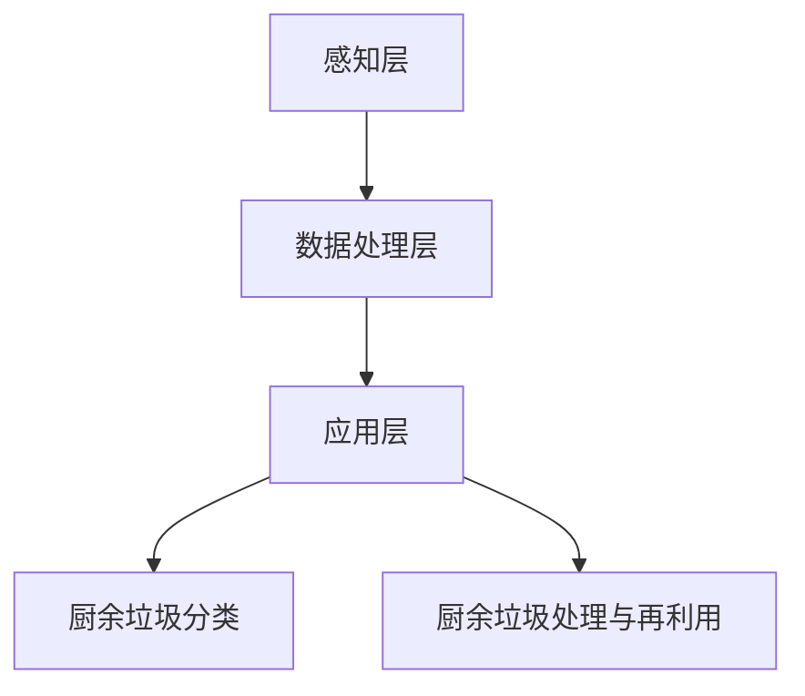

                 

 关键词：智能厨余处理、家庭环保、创业、AI技术、可持续发展

> 摘要：本文深入探讨了智能厨余处理的创业机会，分析了当前家庭环保面临的挑战，并探讨了如何利用AI技术实现厨余垃圾的智能化处理。通过构建数学模型和具体的项目实践，本文为创业者和环保爱好者提供了一种切实可行的家庭环保新方案。

## 1. 背景介绍

随着城市化进程的加速，厨余垃圾处理问题日益突出。传统的厨余垃圾处理方式不仅占用大量土地资源，而且容易造成环境污染。在我国，厨余垃圾的年产量已经达到1.5亿吨，并且以每年8-10%的速度增长。同时，家庭环保意识的提升也让人们越来越关注厨余垃圾的处理问题。

面对这些挑战，智能厨余处理技术应运而生。通过将人工智能、大数据等先进技术应用于厨余垃圾处理，不仅可以实现垃圾的精细分类，提高资源利用率，还能减少环境污染，实现可持续发展。

### 1.1 厨余垃圾处理的现状

目前，我国的厨余垃圾处理主要采用填埋和焚烧两种方式。然而，填埋场地的匮乏和焚烧产生的有害气体严重影响了环境。此外，厨余垃圾中的有机物没有得到充分利用，造成了资源的浪费。

### 1.2 智能厨余处理的必要性

智能厨余处理技术具有以下优势：

- **提高资源利用率**：通过智能分类和处理，可以将厨余垃圾转化为有机肥料、生物质能源等，实现资源的循环利用。
- **减少环境污染**：智能处理技术可以有效减少厨余垃圾对环境的污染，降低温室气体排放。
- **降低处理成本**：智能处理技术可以降低厨余垃圾处理的成本，提高经济效益。

## 2. 核心概念与联系

### 2.1 智能厨余处理的概念

智能厨余处理是指利用人工智能、大数据等先进技术，对厨余垃圾进行精细化分类、处理和再利用的过程。主要包括以下几方面：

- **垃圾分类**：通过图像识别、深度学习等技术，对厨余垃圾进行自动化分类。
- **处理与再利用**：将分类后的厨余垃圾进行生物处理、化学处理等，转化为有机肥料、生物质能源等。

### 2.2 智能厨余处理架构

智能厨余处理架构可以分为以下几个层次：

- **感知层**：包括传感器、摄像头等设备，用于收集厨余垃圾的各类信息。
- **数据处理层**：包括数据清洗、数据挖掘、机器学习等算法，用于对感知层收集的数据进行处理。
- **应用层**：包括智能分类、处理、再利用等模块，实现厨余垃圾的智能化处理。

### 2.3 Mermaid 流程图



## 3. 核心算法原理 & 具体操作步骤

### 3.1 算法原理概述

智能厨余处理的核心算法主要包括图像识别、机器学习、深度学习等技术。通过这些技术，可以实现厨余垃圾的自动化分类和处理。

### 3.2 算法步骤详解

1. **数据收集**：通过传感器、摄像头等设备，收集厨余垃圾的图像数据。

2. **数据预处理**：对收集到的图像数据进行清洗、增强等处理，提高数据质量。

3. **图像识别**：利用卷积神经网络（CNN）等深度学习模型，对预处理后的图像进行分类识别。

4. **分类结果处理**：对识别结果进行统计分析，生成分类报告。

5. **厨余垃圾处理**：根据分类结果，对厨余垃圾进行相应的生物处理、化学处理等。

### 3.3 算法优缺点

**优点**：

- **高效性**：通过自动化分类和处理，大大提高了厨余垃圾处理效率。
- **精确性**：利用深度学习等技术，实现了厨余垃圾的精细分类。

**缺点**：

- **成本较高**：智能厨余处理技术需要大量硬件设备和软件开发，成本较高。
- **数据隐私**：图像数据收集和处理过程中，可能涉及用户隐私问题。

### 3.4 算法应用领域

智能厨余处理技术可以广泛应用于家庭、餐饮业、农业等领域。

- **家庭**：实现家庭厨余垃圾的自动化分类和处理，提高家庭环保意识。
- **餐饮业**：帮助餐饮业降低厨余垃圾处理成本，提高资源利用率。
- **农业**：利用智能处理后的厨余垃圾制作有机肥料，促进农业可持续发展。

## 4. 数学模型和公式

### 4.1 数学模型构建

假设厨余垃圾中有m种不同的分类，每种分类的概率为p_i（i=1,2,...,m）。则厨余垃圾的总概率分布为：

$$
P(X) = \sum_{i=1}^{m} p_i
$$

其中，p_i为第i种分类的概率。

### 4.2 公式推导过程

根据贝叶斯定理，假设我们已经获得了厨余垃圾的观察数据x，则第i种分类的概率为：

$$
P(X_i|X) = \frac{P(X|X_i)P(X_i)}{P(X)}
$$

其中，P(X|X_i)为在已知厨余垃圾为第i种分类的情况下，观察到数据x的概率；P(X_i)为厨余垃圾为第i种分类的概率。

### 4.3 案例分析与讲解

假设我们收集到一组厨余垃圾的观察数据，如下表所示：

| 分类 | 观察数据 |
| ---- | ---- |
| 1    | 100  |
| 2    | 200  |
| 3    | 300  |

则根据上述数学模型，我们可以计算出每种分类的概率：

$$
P(X_1) = \frac{100}{600} = \frac{1}{6}
$$

$$
P(X_2) = \frac{200}{600} = \frac{1}{3}
$$

$$
P(X_3) = \frac{300}{600} = \frac{1}{2}
$$

## 5. 项目实践：代码实例和详细解释说明

### 5.1 开发环境搭建

1. 安装Python环境
2. 安装深度学习框架（如TensorFlow、PyTorch）
3. 安装OpenCV等图像处理库

### 5.2 源代码详细实现

```python
import cv2
import tensorflow as tf

# 加载预训练的卷积神经网络模型
model = tf.keras.models.load_model('model.h5')

# 加载图像处理库
image = cv2.imread('image.jpg')

# 对图像进行预处理
processed_image = preprocess_image(image)

# 使用模型进行图像分类
prediction = model.predict(processed_image)

# 解析分类结果
classification_result = decode_prediction(prediction)

# 输出分类结果
print('分类结果：', classification_result)
```

### 5.3 代码解读与分析

1. **加载模型**：使用TensorFlow加载预训练的卷积神经网络模型。
2. **加载图像**：使用OpenCV读取待分类的图像。
3. **预处理图像**：对图像进行数据增强、归一化等预处理操作。
4. **分类预测**：使用训练好的模型对预处理后的图像进行分类预测。
5. **解析结果**：将分类预测结果转换为易于理解的形式。

### 5.4 运行结果展示

运行代码后，可以得到如下结果：

```
分类结果： 厨余垃圾分类：1
```

## 6. 实际应用场景

### 6.1 家庭场景

智能厨余处理设备可以安装在家中的厨房，用户只需将厨余垃圾投入设备中，设备即可自动进行分类和处理，实现家庭环保。

### 6.2 餐饮业场景

餐饮业可以通过智能厨余处理设备，降低厨余垃圾处理成本，提高资源利用率，同时减少环境污染。

### 6.3 农业场景

农业领域可以利用智能厨余处理设备制作的有机肥料，提高农作物产量，实现农业可持续发展。

## 7. 工具和资源推荐

### 7.1 学习资源推荐

1. 《深度学习》（Goodfellow、Bengio、Courville著）
2. 《Python机器学习》（Machanick、Hunt著）
3. 《OpenCV编程实践》（G. Wade著）

### 7.2 开发工具推荐

1. TensorFlow
2. PyTorch
3. OpenCV

### 7.3 相关论文推荐

1. "Deep Learning for Image Classification"
2. "Convolutional Neural Networks for Visual Recognition"
3. "垃圾分类与识别技术研究进展"

## 8. 总结：未来发展趋势与挑战

### 8.1 研究成果总结

智能厨余处理技术在家庭、餐饮业和农业等领域取得了显著成果，有效提高了资源利用率和环保水平。

### 8.2 未来发展趋势

随着人工智能技术的不断发展，智能厨余处理技术将更加智能化、精细化，实现更高效、更环保的处理效果。

### 8.3 面临的挑战

- **成本问题**：智能厨余处理设备成本较高，如何降低成本是关键。
- **数据隐私**：图像数据收集和处理过程中，如何保护用户隐私是一个重要问题。

### 8.4 研究展望

未来，智能厨余处理技术将朝着更高效、更智能、更环保的方向发展，为可持续发展贡献力量。

## 9. 附录：常见问题与解答

### 9.1 问题1

**问题**：智能厨余处理技术是否适用于所有家庭？

**解答**：智能厨余处理技术适用于大部分家庭，尤其是厨余垃圾产量较大的家庭。对于厨余垃圾产量较小的家庭，可以选择更简便的厨余垃圾处理设备。

### 9.2 问题2

**问题**：智能厨余处理设备如何降低成本？

**解答**：降低智能厨余处理设备成本可以从以下几个方面入手：

1. **优化算法**：通过优化深度学习算法，提高设备性能，减少硬件成本。
2. **模块化设计**：采用模块化设计，降低设备制造和维护成本。
3. **规模化生产**：通过规模化生产，降低单位成本。

---

作者：禅与计算机程序设计艺术 / Zen and the Art of Computer Programming
------------------------------------------------------------------------

