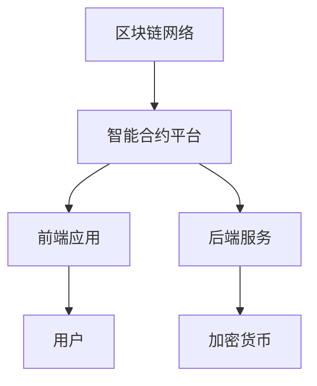

                 

关键词：智能合约、区块链、自动化交易、去中心化、加密货币、智能合约开发、项目实践、未来趋势

摘要：本文将深入探讨智能合约在创业领域中的应用，探讨其在自动化交易、去中心化金融和加密货币市场中的潜力。我们将详细解析智能合约的核心概念、技术架构、算法原理、数学模型，并通过实际项目实例展示其实现过程。此外，还将讨论智能合约的实际应用场景、未来发展趋势以及面临的挑战。

## 1. 背景介绍

随着区块链技术的不断发展和普及，智能合约作为一种自动化执行的协议，正逐渐成为创业者和开发者关注的焦点。智能合约是运行在区块链网络上的自执行合约，其通过代码的形式定义了交易条款和执行逻辑。一旦触发条件，智能合约会自动执行预定的操作，无需人工干预。

智能合约的出现，彻底改变了传统交易模式。在传统交易中，中介机构起到了至关重要的作用，而智能合约则通过去中心化的方式实现了交易自动化，降低了交易成本，提高了交易效率。此外，智能合约的可信度和安全性也大幅提升，因为区块链技术本身具有不可篡改和去信任的特点。

随着加密货币市场的快速发展，智能合约的应用场景越来越广泛。从去中心化金融（DeFi）到非同质化代币（NFT），智能合约正成为构建新型数字经济的重要工具。本文将围绕智能合约的核心概念、技术架构、算法原理和实际应用，探讨其在创业领域的无限潜力。

## 2. 核心概念与联系

### 2.1 核心概念

- **智能合约**：运行在区块链上的自执行合约，通过代码定义交易条款和执行逻辑。
- **区块链**：分布式账本技术，记录智能合约的执行过程和数据状态。
- **加密货币**：基于区块链技术的数字货币，具有去中心化、匿名性和安全性。
- **去中心化金融（DeFi）**：基于区块链的金融应用，通过智能合约实现金融交易、借贷和投资。

### 2.2 技术架构

智能合约的技术架构通常包括以下关键组件：

1. **区块链网络**：包括多个节点，共同维护区块链账本的一致性和安全性。
2. **智能合约平台**：提供智能合约编写、部署和执行的环境，如以太坊、EOS、波卡等。
3. **前端应用**：与用户交互的界面，用于发起交易请求和查询智能合约状态。
4. **后端服务**：提供数据存储、处理和访问的接口，支持智能合约的执行。

### 2.3 关系与联系

智能合约与区块链、加密货币和去中心化金融之间的联系如下：

- **智能合约与区块链**：智能合约是运行在区块链上的，依赖于区块链提供的数据存储和执行环境。
- **智能合约与加密货币**：加密货币可以作为智能合约的执行媒介和价值载体，实现自动化交易和价值转移。
- **智能合约与去中心化金融**：智能合约是去中心化金融应用的核心组件，通过智能合约实现金融交易和服务的去中心化。

### 2.4 Mermaid 流程图



## 3. 核心算法原理 & 具体操作步骤

### 3.1 算法原理概述

智能合约的核心算法原理主要包括以下两个方面：

1. **事件触发**：智能合约通过事件触发机制，当满足预设条件时自动执行。
2. **状态机**：智能合约基于状态机模型，通过状态转换实现复杂的业务逻辑。

### 3.2 算法步骤详解

智能合约的算法步骤可以分为以下几个阶段：

1. **编写智能合约代码**：定义交易条款和执行逻辑，通常使用Solidity语言编写。
2. **编译智能合约代码**：将Solidity代码编译为以太坊虚拟机（EVM）可执行的字节码。
3. **部署智能合约**：将编译后的字节码部署到区块链上，生成合约地址。
4. **调用智能合约**：通过区块链网络发起交易请求，调用智能合约执行预定的操作。
5. **状态验证**：区块链网络验证智能合约的执行结果，更新数据状态。

### 3.3 算法优缺点

智能合约算法的优点包括：

- **去中心化**：智能合约运行在去中心化的区块链网络，无需依赖中心化机构。
- **透明性**：智能合约的代码公开可查，执行过程透明。
- **安全性**：智能合约代码经过编译和部署，具有高安全性和可靠性。

然而，智能合约算法也存在一些缺点：

- **安全性风险**：智能合约代码存在漏洞，可能导致资金损失。
- **法律监管**：智能合约的法律地位和监管制度尚未明确，存在法律风险。
- **性能瓶颈**：智能合约的执行依赖于区块链网络，存在性能瓶颈。

### 3.4 算法应用领域

智能合约的应用领域非常广泛，包括但不限于以下方面：

- **去中心化金融（DeFi）**：智能合约在DeFi领域广泛应用，实现借贷、交易、投资等金融服务。
- **供应链管理**：智能合约用于确保供应链中的交易真实性和合规性。
- **数字身份认证**：智能合约用于创建和管理数字身份，实现身份验证和权限控制。
- **版权保护**：智能合约用于确保版权所有者的权益，实现数字内容的授权和分发。

## 4. 数学模型和公式 & 详细讲解 & 举例说明

### 4.1 数学模型构建

智能合约的数学模型主要涉及以下几个方面：

1. **状态机模型**：智能合约的状态和状态转换关系。
2. **加密算法**：智能合约中的加密和数字签名算法。
3. **概率分布**：智能合约中涉及的概率分布和随机数生成。

### 4.2 公式推导过程

智能合约中的数学公式推导过程主要包括以下步骤：

1. **定义变量和参数**：明确智能合约中涉及的变量和参数。
2. **建立状态机模型**：根据业务逻辑建立状态机模型。
3. **推导状态转换公式**：根据状态机模型推导状态转换的数学公式。
4. **分析加密算法**：分析智能合约中使用的加密算法，推导相关数学公式。

### 4.3 案例分析与讲解

以下是一个简单的智能合约数学模型案例：

**案例：智能合约中的余额查询**

假设有一个智能合约，用于存储用户的余额，并提供余额查询功能。智能合约的数学模型如下：

- **状态变量**：余额（Balance）
- **事件**：存款（Deposit）和取款（Withdraw）

状态机模型：

```
初始状态：余额 = 0
事件：存款（Deposit），余额 = 余额 + 存款金额
事件：取款（Withdraw），余额 = 余额 - 取款金额
```

状态转换公式：

$$
Balance_{\text{next}} = \begin{cases}
Balance + Deposit, & \text{如果发生存款事件} \\
Balance - Withdraw, & \text{如果发生取款事件} \\
Balance, & \text{否则}
\end{cases}
$$

举例说明：

假设当前余额为100元，用户发起存款事件，存款金额为50元。根据状态转换公式，余额更新为：

$$
Balance_{\text{next}} = 100 + 50 = 150
$$

## 5. 项目实践：代码实例和详细解释说明

### 5.1 开发环境搭建

在进行智能合约项目开发之前，我们需要搭建一个合适的开发环境。以下是一个基于以太坊的开发环境搭建步骤：

1. 安装Node.js：前往Node.js官网下载并安装最新版本的Node.js。
2. 安装Truffle框架：在命令行中执行以下命令安装Truffle框架。

   ```
   npm install -g truffle
   ```

3. 创建项目目录：在命令行中执行以下命令创建一个新项目目录。

   ```
   truffle init
   ```

4. 配置开发环境：在项目目录下创建一个名为`truffle-config.js`的配置文件，配置以太坊网络和合约编译选项。

   ```javascript
   module.exports = {
     networks: {
       development: {
         host: "127.0.0.1",
         port: 8545,
         network_id: "*"
       }
     },
     compilers: {
       solc: {
         version: "0.8.0"
       }
     }
   };
   ```

5. 启动开发环境：在命令行中执行以下命令启动开发环境。

   ```
   truffle develop
   ```

### 5.2 源代码详细实现

以下是一个简单的智能合约示例，用于存储和查询用户的余额。

```solidity
// SPDX-License-Identifier: MIT
pragma solidity ^0.8.0;

contract Balance {
    mapping(address => uint256) public balances;

    function deposit() external payable {
        balances[msg.sender] += msg.value;
    }

    function withdraw(uint256 amount) external {
        require(amount <= balances[msg.sender], "Insufficient balance");
        balances[msg.sender] -= amount;
        payable(msg.sender).transfer(amount);
    }

    function getBalance() external view returns (uint256) {
        return balances[msg.sender];
    }
}
```

### 5.3 代码解读与分析

**1. 合约结构**

- `pragma solidity ^0.8.0`：指定合约使用的Solidity版本。
- `contract Balance`：定义一个名为`Balance`的智能合约。
- `mapping(address => uint256) public balances`：创建一个公有的映射表，用于存储用户的余额。
- `function deposit()`：定义一个存款函数，接受以太币并发送至合约地址。
- `function withdraw(uint256 amount)`：定义一个取款函数，从用户的余额中扣除指定金额并返还至用户地址。
- `function getBalance()`：定义一个查询余额的函数，返回用户当前余额。

**2. 存款功能**

- `deposit()`函数使用`external`修饰符，表示可以通过外部调用执行。
- `payable`关键字用于接收以太币。
- `balances[msg.sender] += msg.value`：将接收到的以太币金额添加到调用者的余额。

**3. 取款功能**

- `withdraw()`函数使用`external`修饰符和`payable`关键字。
- `require(amount <= balances[msg.sender], "Insufficient balance")`：检查余额是否足够，不足则抛出错误。
- `balances[msg.sender] -= amount`：从调用者的余额中扣除指定金额。
- `payable(msg.sender).transfer(amount)`：将扣除的金额返还至调用者地址。

**4. 余额查询**

- `getBalance()`函数使用`external`和`view`修饰符，表示可以通过外部调用执行并仅查询不修改状态。
- `balances[msg.sender]`：返回调用者的当前余额。

### 5.4 运行结果展示

以下是一个简单的测试场景，演示如何使用Truffle开发环境进行智能合约部署和调用：

1. 编译合约：

   ```
   truffle compile
   ```

2. 部署合约：

   ```
   truffle migrate --network development
   ```

3. 查看合约地址：

   ```
   truffle console
   > web3.eth.getCode("0x...") // 输出合约地址
   ```

4. 调用合约函数：

   ```
   > contractBalance = Balance.at("0x...");
   > contractBalance.deposit({value: web3.utils.toWei("1", "ether")});
   > contractBalance.getBalance();
   > contractBalance.withdraw(web3.utils.toWei("0.5", "ether"));
   > contractBalance.getBalance();
   ```

## 6. 实际应用场景

智能合约在各个领域有着广泛的应用，以下是一些实际应用场景：

### 6.1 去中心化金融（DeFi）

去中心化金融（DeFi）是智能合约应用最广泛的领域之一。通过智能合约，用户可以无需依赖中心化机构，直接在区块链上进行借贷、交易、投资等金融活动。DeFi平台如Aave、Uniswap等，通过智能合约实现了点对点的金融交易，降低了交易成本，提高了交易效率。

### 6.2 供应链管理

智能合约可以用于确保供应链中的交易真实性和合规性。通过智能合约，可以自动验证供应链中的各种交易记录，确保数据的完整性和一致性。例如，供应商可以在智能合约中记录交付的货物信息，买家可以验证货物的真实性，从而减少供应链中的欺诈和纠纷。

### 6.3 数字身份认证

智能合约可以用于创建和管理数字身份，实现身份验证和权限控制。通过智能合约，用户可以拥有一个去中心化的数字身份，用于在各种数字平台和应用程序中进行身份验证和授权。例如，数字身份认证平台如uPort，通过智能合约实现了用户身份的验证和授权。

### 6.4 版权保护

智能合约可以用于确保版权所有者的权益，实现数字内容的授权和分发。通过智能合约，版权所有者可以设置数字内容的版权信息，并定义授权规则。用户在购买或授权使用数字内容时，可以通过智能合约进行交易和验证，确保版权所有者的权益得到保护。

## 7. 未来应用展望

智能合约的应用前景非常广阔，未来有望在更多领域实现颠覆性变革。以下是一些未来应用展望：

### 7.1 跨境支付

智能合约可以用于实现跨境支付，降低交易成本，提高交易效率。通过智能合约，跨境支付可以实现自动化处理，减少中间环节和人工干预，缩短交易时间。

### 7.2 智能合约保险

智能合约可以用于实现智能合约保险，提供更加高效和透明的保险服务。通过智能合约，用户可以自动触发保险理赔，减少人工操作和欺诈风险。

### 7.3 智能合约游戏

智能合约可以用于构建去中心化的游戏平台，提供公平、透明和可信任的游戏体验。玩家可以通过智能合约参与游戏，并获得真实的游戏收益。

### 7.4 智能合约供应链

智能合约可以用于构建智能合约供应链，实现供应链的自动化和优化。通过智能合约，可以自动跟踪和验证供应链中的各种交易记录，提高供应链的效率和透明度。

## 8. 工具和资源推荐

为了更好地掌握智能合约开发，以下是一些推荐的工具和资源：

### 8.1 学习资源推荐

- **《智能合约设计与开发》**：一本全面的智能合约开发教程，涵盖智能合约的核心概念和技术。
- **Ethereum Developer Guide**：以太坊官方的开发者指南，提供详细的智能合约开发教程和示例。
- **智能合约安全**：智能合约安全是开发过程中不可忽视的一环，本书详细介绍了智能合约常见漏洞和防范措施。

### 8.2 开发工具推荐

- **Truffle**：一个流行的智能合约开发框架，提供合约编写、部署和测试的功能。
- **Remix**：一个在线的智能合约开发环境，支持Solidity代码编写和调试。
- **Web3.js**：一个JavaScript库，用于与以太坊区块链进行交互，实现合约部署和调用。

### 8.3 相关论文推荐

- **"Decentralized Applications": Building Blockchains from Scratch**：一篇关于去中心化应用（DApps）和区块链构建的基础论文。
- **"Smart Contracts: A Framework for Decentralized Applications"**：一篇关于智能合约框架的论文，详细介绍了智能合约的设计和实现。
- **"DeFi Security Analysis"**：一篇关于去中心化金融（DeFi）安全分析的论文，探讨DeFi平台的潜在风险和解决方案。

## 9. 总结：未来发展趋势与挑战

智能合约作为区块链技术的核心应用，正逐步改变着传统金融、供应链管理、数字身份认证等多个领域。随着技术的不断成熟和应用的深入，智能合约在未来有望在更多领域实现颠覆性变革。然而，智能合约的发展也面临一些挑战：

### 9.1 研究成果总结

- 智能合约在去中心化金融、供应链管理、数字身份认证等领域具有广泛的应用前景。
- 智能合约技术的不断成熟，为新型数字经济和去中心化应用提供了坚实基础。
- 智能合约的安全性和性能问题需要进一步研究和优化。

### 9.2 未来发展趋势

- 智能合约技术的普及和推广，将进一步推动区块链技术的发展和应用。
- 智能合约将在更多领域实现商业化应用，成为数字经济的重要组成部分。
- 智能合约的安全性、性能和可扩展性将得到重点关注和优化。

### 9.3 面临的挑战

- 智能合约的安全性问题仍然存在，需要进一步加强安全检测和防护措施。
- 智能合约的性能瓶颈和可扩展性问题需要解决，以满足大规模应用的需求。
- 智能合约的法律地位和监管制度尚不明确，需要进一步完善和规范。

### 9.4 研究展望

- 未来智能合约的研究将聚焦于安全性、性能和可扩展性的提升。
- 智能合约与其他区块链技术的融合，如跨链技术和状态通道，将推动智能合约技术的进一步发展。
- 智能合约在新型数字经济中的应用，将不断拓展其应用场景和商业价值。

## 附录：常见问题与解答

### 1. 智能合约是什么？

智能合约是运行在区块链上的自执行合约，通过代码形式定义交易条款和执行逻辑。一旦满足预设条件，智能合约会自动执行预定的操作。

### 2. 智能合约的优势是什么？

智能合约的优势包括去中心化、透明性、安全性和自动化。去中心化消除了中介机构的依赖，透明性使得合约执行过程公开可查，安全性得益于区块链技术本身，自动化降低了交易成本和时间。

### 3. 智能合约有哪些应用场景？

智能合约的应用场景广泛，包括去中心化金融（DeFi）、供应链管理、数字身份认证、版权保护、智能合约游戏等。

### 4. 智能合约安全吗？

智能合约本身是安全的，但由于代码漏洞和外部攻击，可能存在安全风险。为了确保智能合约的安全性，需要严格审查代码，采用安全防护措施，并进行安全审计。

### 5. 智能合约如何部署？

智能合约的部署通常需要使用智能合约平台，如Truffle、Remix等。部署过程包括编写智能合约代码、编译、部署到区块链网络，生成合约地址。

### 6. 智能合约与区块链的关系是什么？

智能合约是运行在区块链上的，依赖于区块链提供的数据存储和执行环境。智能合约的执行过程和状态更新都记录在区块链上，确保数据的不可篡改性和透明性。

### 7. 智能合约能否替代传统金融？

智能合约可以部分替代传统金融，特别是在去中心化金融（DeFi）领域。然而，智能合约在合规性、法律地位等方面仍需进一步完善，无法完全替代传统金融体系。

### 8. 智能合约的开发难度如何？

智能合约的开发难度相对较高，需要掌握区块链技术和智能合约编程语言，如Solidity。此外，智能合约的安全性至关重要，需要严格审查代码，进行安全测试和审计。

### 9. 智能合约的性能如何？

智能合约的性能取决于区块链网络的性能和智能合约的设计。以太坊等主流智能合约平台的性能逐渐提升，但仍存在一定的性能瓶颈。未来，随着技术进步和优化，智能合约的性能有望得到进一步提升。

### 10. 智能合约的发展前景如何？

智能合约的发展前景非常广阔，随着区块链技术的普及和应用的深入，智能合约将在更多领域实现颠覆性变革。未来，智能合约的技术、应用场景和商业价值将不断拓展和提升。

