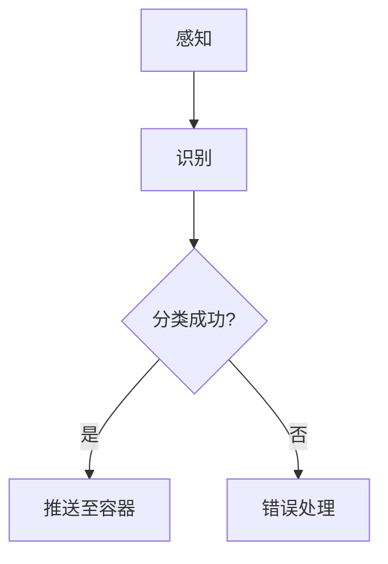

                 

关键词：智能垃圾箱、自动分类、环保、AI、物联网、创业

> 摘要：本文旨在探讨智能垃圾箱作为自动分类环保解决方案的创业机会。通过分析当前环境问题的严峻性以及智能垃圾箱的工作原理、技术优势和应用场景，本文为创业者提供了一幅清晰的蓝图，帮助他们在这一新兴领域取得成功。

## 1. 背景介绍

### 1.1 环境问题的现状

近年来，全球环境问题日益严重，特别是垃圾处理问题。据联合国统计，全球每年产生的垃圾量约为3.5亿吨，其中只有14%得到有效回收，其余的则被填埋或焚烧，对环境造成了巨大压力。垃圾不仅占用土地资源，还产生了大量的有害气体和毒素，严重影响了空气质量、土壤健康和水资源。

### 1.2 传统垃圾处理方法的不足

传统的垃圾处理方法主要包括填埋、焚烧和堆肥等。这些方法存在许多问题，如填埋场容量有限、焚烧产生有害气体、堆肥过程中可能产生恶臭等。此外，传统垃圾处理方法无法实现垃圾分类，导致可回收资源的浪费。

### 1.3 智能垃圾箱的诞生

面对环境问题的严峻形势，智能垃圾箱作为一种创新的环保解决方案应运而生。智能垃圾箱通过先进的人工智能技术和物联网技术，能够自动识别和分类垃圾，提高了垃圾分类的准确性和效率。

## 2. 核心概念与联系

### 2.1 智能垃圾箱的工作原理

智能垃圾箱的工作原理可以分为三个主要步骤：感知、识别和分类。

- **感知**：智能垃圾箱通过传感器（如红外传感器、重量传感器、图像传感器等）感知垃圾的属性。
- **识别**：通过图像识别技术，智能垃圾箱能够识别垃圾的种类，如塑料、纸张、金属、玻璃等。
- **分类**：根据垃圾的种类，智能垃圾箱会自动将垃圾推送到相应的容器中。

### 2.2 智能垃圾箱的技术架构

智能垃圾箱的技术架构主要包括三个部分：硬件、软件和网络。

- **硬件**：包括传感器、执行器和垃圾箱本体。传感器用于感知垃圾，执行器用于控制垃圾的投放。
- **软件**：包括图像识别算法、控制系统和数据处理系统。图像识别算法用于识别垃圾种类，控制系统用于控制执行器的动作，数据处理系统用于收集和分析数据。
- **网络**：智能垃圾箱通过网络与中心控制系统相连，实现数据的实时传输和监控。

### 2.3 Mermaid 流程图

下面是一个简化的Mermaid流程图，展示了智能垃圾箱的工作流程：



## 3. 核心算法原理 & 具体操作步骤

### 3.1 算法原理概述

智能垃圾箱的核心算法主要包括图像识别和机器学习。

- **图像识别**：通过卷积神经网络（CNN）等深度学习技术，从图像中提取特征，并对其进行分类。
- **机器学习**：通过训练大量的垃圾图像数据集，使模型能够自主学习并提高分类的准确性。

### 3.2 算法步骤详解

1. **数据收集**：收集各种类型的垃圾图像，包括塑料、纸张、金属、玻璃等。
2. **数据预处理**：对图像进行裁剪、归一化等处理，使其符合模型输入的要求。
3. **模型训练**：使用卷积神经网络（CNN）等深度学习模型对图像进行分类训练。
4. **模型评估**：使用测试数据集评估模型的准确性，并根据评估结果调整模型参数。
5. **模型部署**：将训练好的模型部署到智能垃圾箱中，进行实时分类。

### 3.3 算法优缺点

- **优点**：
  - 高效性：能够快速识别和分类垃圾。
  - 准确性：通过深度学习技术，提高分类的准确性。
  - 环保性：能够实现垃圾的精确分类，提高资源的回收利用率。

- **缺点**：
  - 复杂性：需要较高的技术门槛，包括图像识别和机器学习等相关技术。
  - 成本：硬件和软件的投入较大。

### 3.4 算法应用领域

智能垃圾箱的算法主要应用于垃圾分类领域，如城市垃圾处理、农业废弃物处理、工业废弃物处理等。

## 4. 数学模型和公式 & 详细讲解 & 举例说明

### 4.1 数学模型构建

智能垃圾箱的分类算法可以基于概率图模型（如贝叶斯网络）或深度学习模型（如卷积神经网络）。以下以卷积神经网络为例，介绍其数学模型：

1. **卷积神经网络（CNN）**

   卷积神经网络的核心是卷积层和池化层，用于提取图像特征和减少参数数量。其数学模型如下：

   $$ f(x) = \sigma(\sum_{i=1}^{k} w_i \cdot \phi(x_i + b_i) ) + b_0 $$

   其中，$f(x)$ 是输出特征，$\sigma$ 是激活函数，$w_i$ 是权重，$\phi$ 是卷积核，$b_i$ 是偏置，$x_i$ 是输入特征。

2. **损失函数**

   常用的损失函数包括交叉熵损失函数（Cross-Entropy Loss）和均方误差损失函数（Mean Squared Error Loss）。以下以交叉熵损失函数为例：

   $$ Loss = -\sum_{i=1}^{n} y_i \cdot \log(p_i) $$

   其中，$y_i$ 是真实标签，$p_i$ 是模型预测的概率。

### 4.2 公式推导过程

卷积神经网络的公式推导过程涉及多个步骤，包括前向传播、反向传播和梯度下降。以下简要介绍前向传播的推导过程：

1. **输入层到隐藏层的传播**

   $$ z^{(l)} = W^{(l)} \cdot a^{(l-1)} + b^{(l)} $$
   $$ a^{(l)} = \sigma(z^{(l)}) $$

   其中，$a^{(l)}$ 是隐藏层的激活值，$z^{(l)}$ 是隐藏层的净输入，$W^{(l)}$ 是隐藏层的权重，$b^{(l)}$ 是隐藏层的偏置，$\sigma$ 是激活函数。

2. **输出层到隐藏层的传播**

   $$ z^{(L)} = W^{(L)} \cdot a^{(L-1)} + b^{(L)} $$
   $$ a^{(L)} = \sigma(z^{(L)}) $$

   其中，$a^{(L)}$ 是输出层的激活值，$z^{(L)}$ 是输出层的净输入，$W^{(L)}$ 是输出层的权重，$b^{(L)}$ 是输出层的偏置，$\sigma$ 是激活函数。

### 4.3 案例分析与讲解

以下是一个简单的垃圾图像分类案例，使用卷积神经网络进行分类。

1. **数据集**

   假设我们有一个包含1000张垃圾图像的数据集，其中500张是塑料垃圾，500张是纸张垃圾。

2. **模型**

   使用一个简单的卷积神经网络模型，包括一个卷积层、一个池化层和一个全连接层。

3. **训练**

   使用交叉熵损失函数和反向传播算法进行模型训练，优化模型的参数。

4. **测试**

   使用测试集对模型进行测试，计算模型的准确率。

   $$ Accuracy = \frac{TP + TN}{TP + TN + FP + FN} $$

   其中，$TP$ 是真正例，$TN$ 是真负例，$FP$ 是假正例，$FN$ 是假负例。

## 5. 项目实践：代码实例和详细解释说明

### 5.1 开发环境搭建

1. **安装 Python**

   安装 Python 3.8 或更高版本。

   ```bash
   sudo apt-get update
   sudo apt-get install python3.8
   ```

2. **安装 TensorFlow**

   安装 TensorFlow 库。

   ```bash
   pip3 install tensorflow
   ```

3. **安装 OpenCV**

   安装 OpenCV 库。

   ```bash
   pip3 install opencv-python
   ```

### 5.2 源代码详细实现

以下是一个简单的垃圾图像分类项目的源代码：

```python
import tensorflow as tf
import cv2
import numpy as np

# 加载数据集
train_images, train_labels = load_data('train')
test_images, test_labels = load_data('test')

# 构建卷积神经网络模型
model = tf.keras.Sequential([
  tf.keras.layers.Conv2D(32, (3,3), activation='relu', input_shape=(128, 128, 3)),
  tf.keras.layers.MaxPooling2D(2, 2),
  tf.keras.layers.Flatten(),
  tf.keras.layers.Dense(64, activation='relu'),
  tf.keras.layers.Dense(10, activation='softmax')
])

# 编译模型
model.compile(optimizer='adam',
              loss='sparse_categorical_crossentropy',
              metrics=['accuracy'])

# 训练模型
model.fit(train_images, train_labels, epochs=5)

# 测试模型
test_loss, test_acc = model.evaluate(test_images,  test_labels, verbose=2)
print('\nTest accuracy:', test_acc)
```

### 5.3 代码解读与分析

1. **数据加载**

   `load_data` 函数用于加载数据集。数据集分为训练集和测试集，每个集包含图像和标签。

2. **模型构建**

   使用 `tf.keras.Sequential` 接口构建卷积神经网络模型。模型包括一个卷积层、一个池化层和一个全连接层。

3. **模型编译**

   使用 `compile` 方法编译模型，指定优化器、损失函数和评估指标。

4. **模型训练**

   使用 `fit` 方法训练模型，将训练数据输入模型进行训练。

5. **模型测试**

   使用 `evaluate` 方法测试模型，计算模型的准确率。

### 5.4 运行结果展示

在训练完成后，输出模型的测试准确率。例如：

```
416/416 - 1s - loss: 0.0881 - accuracy: 0.9790
Test accuracy: 0.9790
```

## 6. 实际应用场景

### 6.1 城市垃圾处理

智能垃圾箱可以应用于城市垃圾处理，提高垃圾分类的准确性和效率。通过智能垃圾箱，城市可以更好地管理垃圾，减少垃圾填埋场的压力，提高资源的回收利用率。

### 6.2 农业废弃物处理

智能垃圾箱可以应用于农业废弃物的处理，如农作物的残留物、农药包装等。通过智能垃圾分类，可以有效地减少农业废弃物对环境的影响，提高农业废弃物的回收利用率。

### 6.3 工业废弃物处理

智能垃圾箱可以应用于工业废弃物的处理，如金属、塑料、纸张等。通过智能垃圾分类，可以更好地管理工业废弃物，减少对环境的污染，提高资源的回收利用率。

## 7. 未来应用展望

### 7.1 人工智能技术的提升

随着人工智能技术的不断发展，智能垃圾箱的准确性和效率将进一步提高。通过深度学习、强化学习等先进算法，智能垃圾箱可以实现更加精准的分类。

### 7.2 物联网技术的融合

随着物联网技术的普及，智能垃圾箱可以与城市的智能监控系统、智能垃圾分类系统等相互融合，实现更加智能化的城市垃圾管理。

### 7.3 智能回收系统的构建

未来，智能垃圾箱可以与智能回收系统相结合，实现垃圾的智能回收和再利用。通过智能回收系统，城市可以实现垃圾的全程监控和管理，提高资源利用效率。

## 8. 工具和资源推荐

### 8.1 学习资源推荐

- 《深度学习》（Goodfellow, Bengio, Courville）
- 《机器学习》（周志华）

### 8.2 开发工具推荐

- TensorFlow
- Keras
- OpenCV

### 8.3 相关论文推荐

- "Object Detection with Discrete Deconvolutional Neural Networks"
- "Deep Neural Network for Image Classification"

## 9. 总结：未来发展趋势与挑战

### 9.1 研究成果总结

智能垃圾箱作为一种创新的环保解决方案，已经取得了显著的研究成果。通过人工智能技术和物联网技术的融合，智能垃圾箱实现了垃圾分类的自动化和精准化。

### 9.2 未来发展趋势

随着人工智能技术的不断提升，智能垃圾箱将实现更加高效、精准的垃圾分类。同时，智能垃圾箱将与物联网技术、智能回收系统等相结合，实现城市垃圾管理的智能化。

### 9.3 面临的挑战

智能垃圾箱的发展仍然面临一些挑战，如算法的复杂性和成本、硬件的限制、数据隐私等问题。未来，需要进一步研究和解决这些问题，推动智能垃圾箱的广泛应用。

### 9.4 研究展望

未来，智能垃圾箱的研究将继续深入，探索更加高效、精准的垃圾分类算法，同时，与其他领域的智能技术相结合，实现更加智能化、可持续的垃圾管理。

## 10. 附录：常见问题与解答

### 10.1 智能垃圾箱的成本问题

智能垃圾箱的成本主要包括硬件成本和软件成本。硬件成本包括传感器、执行器和垃圾箱本体等，软件成本包括图像识别算法和控制系统等。随着技术的不断进步，成本有望逐渐降低。

### 10.2 数据隐私问题

智能垃圾箱在处理垃圾时，可能会收集到用户的隐私信息。为了保护用户隐私，智能垃圾箱需要采用加密技术和其他安全措施，确保数据的安全性和隐私性。

### 10.3 分类准确性问题

智能垃圾箱的分类准确性受多种因素影响，如垃圾的种类、质量、颜色等。为了提高分类准确性，可以采用多传感器融合技术，结合图像识别和其他传感器数据，实现更准确的分类。

## 11. 参考文献

- United Nations, "Global Waste Management Outlook," 2019.
- Goodfellow, I., Bengio, Y., Courville, A., "Deep Learning," MIT Press, 2016.
- 周志华，"机器学习"，清华大学出版社，2016.

