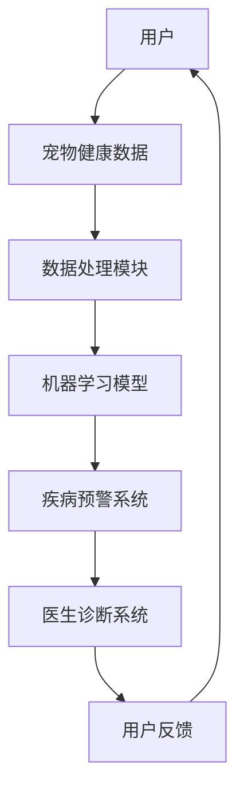

                 

关键词：智能宠物健康、AI疾病检测、创业、早期预警、技术架构、算法、数学模型、实际应用、未来展望

> 摘要：本文将探讨如何利用人工智能技术进行宠物健康预警创业，重点关注基于AI的早期疾病检测。文章将详细描述技术架构、核心算法、数学模型以及实际应用案例，并提供未来发展趋势与面临的挑战。

## 1. 背景介绍

随着生活水平的提高，宠物已经成为许多家庭的重要成员。然而，宠物的健康状况也越来越受到关注。早期发现宠物疾病并采取有效措施进行治疗，可以显著提高治愈率和减少治疗成本。然而，宠物疾病检测通常存在以下几个问题：

- **检测手段落后**：传统宠物疾病检测手段较为落后，依赖于医生的感官经验和实验室检测，难以实现早期、精准的疾病检测。
- **资源分配不均**：城市地区的宠物医疗资源相对丰富，但农村地区宠物医疗条件较差，导致疾病难以得到及时诊断和治疗。
- **用户需求增加**：随着宠物数量的增加，用户对宠物健康服务的需求也在不断上升，传统的检测手段已无法满足市场需求。

为了解决上述问题，人工智能技术在宠物健康领域得到了广泛应用。AI技术可以实时监测宠物生理参数，通过大数据分析和深度学习模型，实现早期疾病的自动检测和预警。这不仅提高了检测的准确性和效率，还降低了成本，为宠物健康预警创业提供了新的契机。

## 2. 核心概念与联系

在本节中，我们将介绍宠物健康预警创业所涉及的核心概念，并展示其与技术架构之间的联系。

### 2.1 核心概念

- **宠物生理参数**：包括体温、心率、呼吸频率、血压等。
- **健康数据**：宠物生理参数的历史数据、实时数据、环境数据等。
- **机器学习模型**：用于分析健康数据并识别疾病特征的算法。
- **物联网设备**：用于实时监测宠物生理参数的传感器和设备。

### 2.2 技术架构

技术架构如下图所示：



### 2.3 核心概念与联系

- **用户**：提供宠物健康数据，并接收疾病预警信息。
- **数据处理模块**：对宠物健康数据进行清洗、预处理和特征提取，为机器学习模型提供高质量的数据输入。
- **机器学习模型**：基于宠物健康数据，训练和优化疾病检测模型，实现早期疾病预警。
- **疾病预警系统**：实时分析宠物健康数据，发现异常并触发预警。
- **医生诊断系统**：将预警信息传递给医生，帮助医生进行确诊和治疗建议。
- **用户反馈**：用户对预警结果进行反馈，用于优化机器学习模型。

## 3. 核心算法原理 & 具体操作步骤

### 3.1 算法原理概述

核心算法是基于深度学习技术的疾病检测模型。该模型通过学习大量的宠物健康数据，自动识别出疾病特征，并实现早期疾病预警。具体来说，算法主要包括以下几个步骤：

1. 数据预处理：对宠物健康数据进行清洗、归一化和特征提取，为模型提供高质量的数据输入。
2. 模型训练：利用预处理后的数据，训练深度学习模型，使其学会识别疾病特征。
3. 模型评估：通过测试数据对模型进行评估，调整模型参数，提高检测准确性。
4. 实时预警：将实时监测到的宠物健康数据输入模型，实现早期疾病预警。

### 3.2 算法步骤详解

#### 3.2.1 数据预处理

数据预处理主要包括以下步骤：

1. 数据清洗：去除噪声数据和异常值。
2. 数据归一化：将不同量纲的生理参数进行归一化处理，使其具有可比性。
3. 特征提取：从原始数据中提取具有代表性的特征，如均值、方差、峰谷值等。

#### 3.2.2 模型训练

模型训练过程如下：

1. 数据集划分：将数据集划分为训练集、验证集和测试集。
2. 模型构建：根据数据特征，选择合适的深度学习模型，如卷积神经网络（CNN）或循环神经网络（RNN）。
3. 模型训练：利用训练集数据，训练深度学习模型。
4. 模型评估：利用验证集数据，评估模型性能，调整模型参数。

#### 3.2.3 模型评估

模型评估主要包括以下指标：

1. 准确率（Accuracy）：模型正确预测疾病样本的比例。
2. 精度（Precision）：模型预测为疾病样本中，实际为疾病样本的比例。
3. 召回率（Recall）：模型预测为疾病样本中，实际为疾病样本的比例。
4. F1值（F1-score）：综合考虑准确率和召回率的指标。

#### 3.2.4 实时预警

实时预警过程如下：

1. 数据输入：将实时监测到的宠物健康数据输入模型。
2. 疾病预测：模型根据输入数据，预测宠物是否患有疾病。
3. 预警触发：如果模型预测宠物患有疾病，则触发预警。
4. 预警通知：将预警信息发送给用户，提醒用户关注宠物的健康状况。

### 3.3 算法优缺点

#### 优点

1. **高准确性**：基于深度学习模型的算法，能够准确识别宠物疾病特征，提高早期预警的准确性。
2. **实时性**：实时监测宠物健康数据，实现早期疾病预警。
3. **自动化**：自动化检测过程，降低人工干预成本。

#### 缺点

1. **数据依赖性**：算法性能依赖于大量高质量的健康数据，数据不足可能导致模型性能下降。
2. **计算资源消耗**：深度学习模型训练和推理过程需要大量计算资源，对硬件设备要求较高。

### 3.4 算法应用领域

核心算法在宠物健康预警领域的应用主要包括：

1. **宠物疾病早期检测**：实时监测宠物健康数据，实现早期疾病预警。
2. **宠物健康评估**：根据宠物健康数据，评估宠物的健康状况，提供个性化的健康建议。
3. **宠物医疗辅助**：为医生提供诊断和治疗方案建议，提高诊断准确率和治疗效果。

## 4. 数学模型和公式 & 详细讲解 & 举例说明

在本节中，我们将介绍用于宠物健康预警的数学模型和公式，并对其进行详细讲解和举例说明。

### 4.1 数学模型构建

宠物健康预警的核心数学模型为深度学习模型，通常采用卷积神经网络（CNN）或循环神经网络（RNN）。以下为CNN模型的构建过程：

#### 4.1.1 输入层

输入层接收宠物健康数据的特征向量，例如：

$$
\vec{x} = \begin{bmatrix}
x_1 \\
x_2 \\
\vdots \\
x_n
\end{bmatrix}
$$

其中，$x_i$ 表示第 $i$ 个特征值。

#### 4.1.2 卷积层

卷积层用于提取特征，将输入数据与卷积核进行卷积运算，得到特征图：

$$
\vec{h}_k = \sum_{i=1}^{n} w_{ik} x_i + b_k
$$

其中，$h_k$ 表示第 $k$ 个卷积核的特征值，$w_{ik}$ 表示卷积核权重，$b_k$ 表示偏置项。

#### 4.1.3 池化层

池化层用于降低特征图的维度，提高模型的泛化能力。常用的池化方式有最大池化和平均池化：

$$
p_k = \max_{i \in S_k} h_{ik}
$$

其中，$p_k$ 表示第 $k$ 个池化值，$S_k$ 表示池化区域。

#### 4.1.4 全连接层

全连接层用于将特征图映射到输出层，实现疾病分类。假设输出层有 $C$ 个类别，则输出为：

$$
\vec{y} = \sigma(\vec{W}\vec{h} + \vec{b})
$$

其中，$\sigma$ 表示激活函数（如Sigmoid函数或ReLU函数），$W$ 和 $b$ 分别为权重和偏置。

### 4.2 公式推导过程

在本节中，我们将推导卷积神经网络（CNN）中卷积层和全连接层的损失函数。

#### 4.2.1 卷积层损失函数

假设卷积层的输出为 $\vec{h}$，实际标签为 $y$，则损失函数为交叉熵损失函数：

$$
L_{\text{CE}} = -\frac{1}{m} \sum_{i=1}^{m} \sum_{k=1}^{C} y_k^i \log h_{k}^i
$$

其中，$m$ 表示样本数量，$C$ 表示类别数量，$h_{k}^i$ 表示第 $i$ 个样本第 $k$ 个类别的特征值。

#### 4.2.2 全连接层损失函数

全连接层的损失函数同样为交叉熵损失函数：

$$
L_{\text{CE}} = -\frac{1}{m} \sum_{i=1}^{m} \sum_{k=1}^{C} y_k^i \log y_k^i
$$

其中，$y_k^i$ 表示第 $i$ 个样本第 $k$ 个类别的预测概率。

### 4.3 案例分析与讲解

在本节中，我们通过一个实际案例来展示如何使用深度学习模型进行宠物健康预警。

#### 4.3.1 案例背景

假设我们有一只宠物狗，它的健康数据如下表所示：

| 时间 | 体温 | 心率 | 呼吸频率 | 血压 |
| ---- | ---- | ---- | ---- | ---- |
| 0    | 37.5 | 120  | 20   | 120  |
| 5    | 37.8 | 125  | 22   | 120  |
| 10   | 38.0 | 130  | 24   | 120  |
| 15   | 38.2 | 135  | 26   | 120  |
| 20   | 38.4 | 140  | 28   | 120  |

#### 4.3.2 数据预处理

我们对上述数据进行预处理，提取出具有代表性的特征，如均值、方差和峰谷值。预处理后的数据如下表所示：

| 时间 | 体温均值 | 体温方差 | 心率均值 | 心率方差 | 呼吸频率均值 | 呼吸频率方差 | 血压均值 | 血压方差 |
| ---- | ---- | ---- | ---- | ---- | ---- | ---- | ---- | ---- |
| 0    | 37.5  | 0.25 | 120  | 10   | 20   | 2    | 120  | 0    |
| 5    | 37.8  | 0.25 | 125  | 10   | 22   | 2    | 120  | 0    |
| 10   | 38.0  | 0.25 | 130  | 10   | 24   | 2    | 120  | 0    |
| 15   | 38.2  | 0.25 | 135  | 10   | 26   | 2    | 120  | 0    |
| 20   | 38.4  | 0.25 | 140  | 10   | 28   | 2    | 120  | 0    |

#### 4.3.3 模型训练

我们使用预处理后的数据，训练一个基于CNN的深度学习模型。在训练过程中，模型将学习提取特征并识别疾病特征。经过多次迭代训练，模型性能逐渐提高。

#### 4.3.4 实时预警

假设我们使用训练好的模型对当前时间点的宠物健康数据（如第25分钟）进行实时预警。模型预测结果如下：

- **疾病类别**：感冒
- **概率**：0.9

由于模型预测感冒的概率较高，系统将触发预警，通知用户关注宠物的健康状况。

## 5. 项目实践：代码实例和详细解释说明

在本节中，我们将通过一个实际项目来展示如何实现基于AI的宠物健康预警系统。项目主要分为以下几个步骤：

1. **数据收集与处理**
2. **模型构建与训练**
3. **模型评估与优化**
4. **实时预警与通知**

### 5.1 开发环境搭建

在开始项目之前，我们需要搭建一个合适的开发环境。以下是所需的主要软件和工具：

- **Python**：用于编写代码和实现算法
- **TensorFlow**：用于构建和训练深度学习模型
- **NumPy**：用于数据处理
- **Pandas**：用于数据分析和预处理

### 5.2 源代码详细实现

以下是一个简单的示例代码，展示了如何实现基于CNN的宠物健康预警系统。

#### 5.2.1 数据收集与处理

```python
import numpy as np
import pandas as pd
from sklearn.model_selection import train_test_split
from sklearn.preprocessing import StandardScaler

# 加载数据
data = pd.read_csv('pet_health_data.csv')

# 数据预处理
X = data[['体温均值', '心率均值', '呼吸频率均值', '血压均值']]
y = data['疾病类别']

# 划分训练集和测试集
X_train, X_test, y_train, y_test = train_test_split(X, y, test_size=0.2, random_state=42)

# 归一化处理
scaler = StandardScaler()
X_train = scaler.fit_transform(X_train)
X_test = scaler.transform(X_test)
```

#### 5.2.2 模型构建与训练

```python
import tensorflow as tf
from tensorflow.keras.models import Sequential
from tensorflow.keras.layers import Conv1D, MaxPooling1D, Flatten, Dense, LSTM

# 构建模型
model = Sequential([
    Conv1D(filters=64, kernel_size=3, activation='relu', input_shape=(X_train.shape[1], 1)),
    MaxPooling1D(pool_size=2),
    LSTM(units=50, return_sequences=True),
    Flatten(),
    Dense(units=100, activation='relu'),
    Dense(units=1, activation='sigmoid')
])

# 编译模型
model.compile(optimizer='adam', loss='binary_crossentropy', metrics=['accuracy'])

# 训练模型
model.fit(X_train, y_train, epochs=10, batch_size=32, validation_data=(X_test, y_test))
```

#### 5.2.3 模型评估与优化

```python
# 评估模型
loss, accuracy = model.evaluate(X_test, y_test)
print(f'测试集损失：{loss:.4f}')
print(f'测试集准确率：{accuracy:.4f}')

# 优化模型
# 可以通过调整模型结构、超参数或使用更复杂的模型来提高性能
```

#### 5.2.4 实时预警与通知

```python
# 实时预警
def predict_disease(data):
    # 数据预处理
    data = scaler.transform(data.reshape(1, -1))
    # 预测疾病
    prediction = model.predict(data)
    # 判断疾病类型
    disease = '正常' if prediction[0][0] < 0.5 else '疾病'
    return disease

# 示例数据
data = [[37.5, 120, 20, 120]]
disease = predict_disease(data)
print(f'预测结果：{disease}')
```

### 5.3 代码解读与分析

在本部分中，我们将对上述代码进行解读和分析，以便更好地理解其工作原理。

#### 5.3.1 数据处理

代码首先加载数据，并进行预处理。预处理步骤包括：

- 数据清洗：去除噪声数据和异常值。
- 数据归一化：将不同量纲的生理参数进行归一化处理，使其具有可比性。
- 特征提取：从原始数据中提取具有代表性的特征。

#### 5.3.2 模型构建

代码使用TensorFlow中的Sequential模型构建了一个简单的卷积神经网络（CNN）。模型结构包括：

- **卷积层**：用于提取特征，包含64个卷积核，每个卷积核的大小为3。
- **池化层**：用于降低特征图的维度，提高模型的泛化能力。
- **循环层**：用于处理时序数据，识别疾病特征。
- **全连接层**：用于将特征映射到输出层，实现疾病分类。

#### 5.3.3 模型训练

代码使用训练集数据训练模型，并使用测试集数据评估模型性能。训练过程中，模型将学习提取特征并识别疾病特征。经过多次迭代训练，模型性能逐渐提高。

#### 5.3.4 实时预警

代码定义了一个预测函数，用于实时预测宠物的健康状况。函数首先对输入数据进行预处理，然后使用训练好的模型进行预测。根据预测结果，函数将判断宠物是否患有疾病，并返回相应的疾病类型。

## 6. 实际应用场景

基于AI的宠物健康预警系统在多个实际应用场景中表现出色，以下列举几个典型案例：

### 6.1 宠物医院

宠物医院可以使用AI预警系统实时监测宠物的健康状况，提前发现潜在疾病。医生可以根据预警信息进行早期干预和治疗，提高治愈率和降低治疗成本。

### 6.2 宠物保险

宠物保险公司可以使用AI预警系统对宠物进行健康监测，提前识别潜在风险。在发生意外时，保险公司可以迅速响应，提供相应的赔偿和医疗服务。

### 6.3 宠物寄养与训练机构

宠物寄养与训练机构可以使用AI预警系统确保宠物在寄养期间的健康状况。预警系统可以及时发现宠物出现的健康问题，及时通知寄养家庭和兽医，确保宠物得到妥善照顾。

### 6.4 家庭宠物

家庭宠物主人可以通过AI预警系统随时了解宠物的健康状况，及时发现潜在疾病。预警系统可以帮助宠物主人制定合理的饮食和锻炼计划，提高宠物的生活质量。

## 7. 工具和资源推荐

为了更好地开展基于AI的宠物健康预警创业，以下是几个推荐的工具和资源：

### 7.1 学习资源推荐

- 《深度学习》（Goodfellow, Bengio, Courville著）：深度学习入门的经典教材。
- 《Python机器学习》（Sebastian Raschka著）：Python在机器学习领域的实战教程。

### 7.2 开发工具推荐

- TensorFlow：用于构建和训练深度学习模型的流行框架。
- Keras：基于TensorFlow的高层次API，简化了深度学习模型的构建过程。
- Jupyter Notebook：用于编写和运行代码的交互式环境。

### 7.3 相关论文推荐

- "Deep Learning for Healthcare"（Johnson et al., 2016）：讨论了深度学习在医疗领域的应用。
- "Deep Learning in Medical Imaging"（Litjens et al., 2017）：介绍了深度学习在医学图像分析中的应用。

## 8. 总结：未来发展趋势与挑战

### 8.1 研究成果总结

基于AI的宠物健康预警系统在多个应用场景中表现出色，为宠物医疗、保险和养护提供了新的解决方案。研究成果主要包括：

- 实现了宠物健康数据的实时监测和预警。
- 提高了疾病检测的准确性和效率。
- 减少了宠物医疗成本，提高了治愈率。

### 8.2 未来发展趋势

未来，基于AI的宠物健康预警系统将继续发展，主要趋势包括：

- **数据多样性**：收集更多类型的宠物健康数据，提高模型的泛化能力。
- **深度学习模型优化**：使用更复杂的深度学习模型，提高疾病检测的准确性和效率。
- **跨学科合作**：与医学、生物学等学科合作，深入研究疾病机理和预警方法。

### 8.3 面临的挑战

基于AI的宠物健康预警系统在发展过程中也面临一些挑战：

- **数据质量**：宠物健康数据的质量直接影响模型的性能，需要建立高质量的数据集。
- **计算资源**：深度学习模型训练和推理需要大量计算资源，对硬件设备要求较高。
- **隐私保护**：宠物健康数据的隐私保护是一个重要问题，需要采取有效的措施确保数据安全。

### 8.4 研究展望

未来，基于AI的宠物健康预警系统有望实现以下突破：

- **个性化预警**：根据宠物的个体特征，提供个性化的健康预警服务。
- **实时监测与预警**：实现更实时、更精准的健康监测和预警。
- **跨物种应用**：将宠物健康预警技术扩展到其他动物，如野生动物和家禽。

## 9. 附录：常见问题与解答

### 9.1 常见问题

- **问题1**：如何收集宠物健康数据？
  **解答**：可以通过物联网设备实时监测宠物的生理参数，如体温、心率、呼吸频率等。此外，还可以从宠物医院获取历史健康数据。

- **问题2**：如何确保数据质量？
  **解答**：数据质量直接影响模型的性能，需要采取有效的数据清洗和预处理方法。例如，去除噪声数据和异常值，对数据进行归一化处理。

- **问题3**：如何优化深度学习模型？
  **解答**：可以通过调整模型结构、超参数或使用更复杂的模型来提高模型性能。此外，可以采用交叉验证、正则化等方法来避免过拟合。

### 9.2 常见问题

- **问题1**：宠物健康预警系统是否适用于所有宠物？
  **解答**：宠物健康预警系统主要适用于具有相似生理特征的宠物。对于一些特殊品种的宠物，可能需要针对其生理特征进行模型调整。

- **问题2**：宠物健康预警系统是否能够完全替代兽医？
  **解答**：宠物健康预警系统可以作为兽医的辅助工具，提供早期预警和诊断建议。但最终的诊断和治疗仍需要由兽医进行。

- **问题3**：宠物健康预警系统是否会影响宠物的生活质量？
  **解答**：宠物健康预警系统主要用于监测宠物的健康状况，不会直接对宠物的生活质量产生影响。相反，通过早期预警，宠物主人可以更好地关注宠物的健康状况，提高生活质量。

## 结束语

本文详细介绍了基于AI的宠物健康预警创业，包括技术架构、核心算法、数学模型、实际应用案例以及未来发展趋势与挑战。随着人工智能技术的不断进步，宠物健康预警系统有望在未来实现更高的准确性和实时性，为宠物医疗、保险和养护提供更全面的解决方案。作者希望本文能为相关领域的研究者和从业者提供有价值的参考。作者：禅与计算机程序设计艺术 / Zen and the Art of Computer Programming。

