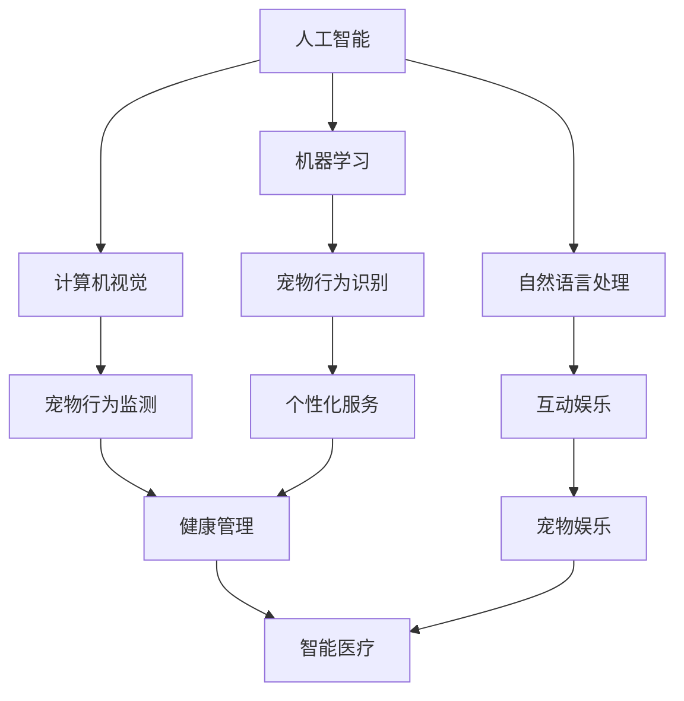

                 

关键词：智能宠物、创业、科技、宠物陪伴、人工智能

> 摘要：本文将探讨智能宠物创业的现状与未来，分析科技赋能宠物陪伴的重要性，探讨相关技术原理和应用实践，并提出未来发展方向与挑战。

## 1. 背景介绍

随着科技的发展和人们生活水平的提高，宠物已成为家庭的重要组成部分。然而，传统的宠物养护方式存在诸多不便，如宠物行为监测、健康管理和日常互动等。因此，智能宠物创业应运而生，通过科技赋能，为宠物提供更便捷、高效、个性化的陪伴与服务。

智能宠物创业领域涵盖了智能穿戴设备、智能监测系统、智能玩具、智能医疗等多个方面。这些技术不仅提升了宠物的生活质量，也为创业者提供了广阔的市场空间。

## 2. 核心概念与联系

### 2.1 智能宠物定义

智能宠物是指通过人工智能技术、物联网技术和生物识别技术等，实现宠物行为监测、健康管理和互动娱乐等功能。智能宠物不仅能够感知宠物的生活状态，还能根据宠物的需求提供个性化服务。

### 2.2 关键技术

#### 2.2.1 人工智能

人工智能技术在智能宠物创业中发挥着核心作用。通过机器学习、计算机视觉和自然语言处理等技术，智能宠物可以识别宠物的行为和情绪，进行个性化互动。

#### 2.2.2 物联网技术

物联网技术使得宠物的生活状态能够实时上传至云端，便于主人进行远程监控和管理。此外，物联网技术还能实现宠物用品的智能连接，提高宠物的生活质量。

#### 2.2.3 生物识别技术

生物识别技术用于识别宠物的生理特征，如心率、体温和活动量等，有助于宠物主人了解宠物的健康状况。

### 2.3 关系图

以下是一个简化的智能宠物技术关系图，展示了主要技术的关联：



## 3. 核心算法原理 & 具体操作步骤

### 3.1 算法原理概述

智能宠物创业的核心算法主要包括机器学习算法和计算机视觉算法。以下将简要介绍这两种算法的基本原理。

#### 3.1.1 机器学习算法

机器学习算法是一种通过数据驱动的方式，使计算机自动改进性能的技术。在智能宠物创业中，机器学习算法主要用于宠物行为识别和个性化服务。

- **监督学习**：通过已标记的数据训练模型，使其能够对新数据进行分类或回归。
- **无监督学习**：不需要已标记的数据，通过发现数据中的结构或模式，使模型能够自动分类或聚类。

#### 3.1.2 计算机视觉算法

计算机视觉算法是一种使计算机能够理解、处理和解释图像或视频的技术。在智能宠物创业中，计算机视觉算法主要用于宠物行为监测和互动娱乐。

- **目标检测**：用于识别图像中的特定对象。
- **图像识别**：用于识别图像中的内容。
- **动作识别**：用于识别视频中的动作。

### 3.2 算法步骤详解

#### 3.2.1 机器学习算法步骤

1. 数据收集：收集宠物的行为数据、健康数据和互动数据等。
2. 数据预处理：对数据进行清洗、去噪和处理，使其适用于机器学习模型。
3. 模型训练：使用监督学习或无监督学习算法训练模型。
4. 模型评估：使用测试数据评估模型性能。
5. 模型部署：将训练好的模型部署到智能宠物设备中。

#### 3.2.2 计算机视觉算法步骤

1. 图像采集：使用摄像头或传感器采集宠物的图像或视频。
2. 图像预处理：对图像进行缩放、裁剪、增强等处理。
3. 目标检测：使用目标检测算法识别图像中的宠物。
4. 图像识别：使用图像识别算法识别宠物的行为。
5. 动作识别：使用动作识别算法识别宠物的动作。
6. 互动生成：根据宠物的行为和情绪，生成相应的互动内容。

### 3.3 算法优缺点

#### 3.3.1 机器学习算法

优点：
- **自适应性强**：能够根据新的数据不断改进模型性能。
- **灵活性高**：可以应用于多种领域，如行为识别、健康监测等。

缺点：
- **数据依赖性大**：需要大量高质量的训练数据。
- **计算复杂度高**：训练和部署过程可能需要大量计算资源。

#### 3.3.2 计算机视觉算法

优点：
- **实时性强**：可以实时处理图像或视频。
- **精度高**：可以准确识别图像中的对象和动作。

缺点：
- **计算复杂度高**：处理图像或视频需要大量计算资源。
- **对光照和场景变化敏感**：可能因光照变化或场景变化导致识别精度下降。

### 3.4 算法应用领域

机器学习算法和计算机视觉算法在智能宠物创业中具有广泛的应用领域，如：

- **宠物行为识别**：用于监测宠物的行为，如运动量、睡眠状态等。
- **健康管理**：用于监测宠物的健康指标，如心率、体温等。
- **互动娱乐**：用于生成与宠物的互动内容，如语音、图像、视频等。
- **智能医疗**：用于诊断宠物的疾病，如皮肤病、骨折等。

## 4. 数学模型和公式 & 详细讲解 & 举例说明

### 4.1 数学模型构建

在智能宠物创业中，常用的数学模型包括：

- **贝叶斯网络**：用于表示宠物行为和健康状态之间的概率关系。
- **回归模型**：用于预测宠物的健康指标。
- **聚类模型**：用于发现宠物行为和健康状态的模式。

### 4.2 公式推导过程

以下是一个简单的贝叶斯网络模型示例，用于表示宠物行为和健康状态之间的概率关系。

$$
P(\text{行为}|\text{健康状态}) = \frac{P(\text{健康状态}| \text{行为})P(\text{行为})}{P(\text{健康状态})}
$$

其中，$P(\text{行为}|\text{健康状态})$ 表示在健康状态为 $S$ 的情况下，宠物行为为 $A$ 的概率；$P(\text{健康状态}| \text{行为})$ 表示在宠物行为为 $A$ 的情况下，健康状态为 $S$ 的概率；$P(\text{行为})$ 和 $P(\text{健康状态})$ 分别表示宠物行为和健康状态的先验概率。

### 4.3 案例分析与讲解

以下是一个关于宠物行为识别的案例分析。

假设我们有一个宠物行为识别模型，该模型能够根据宠物的图像识别宠物的行为。已知宠物行为和健康状态之间的概率关系如下：

$$
P(\text{行为}|\text{健康状态}) = 
\begin{cases}
0.8 & \text{健康状态为健康} \\
0.2 & \text{健康状态为不健康} \\
\end{cases}
$$

已知宠物的健康状态先验概率为 $P(\text{健康状态}|\text{健康}) = 0.9$，$P(\text{健康状态}|\text{不健康}) = 0.1$。现在，我们得到一个宠物的图像，模型识别出宠物的行为为玩耍。

我们需要计算在健康状态为健康的情况下，宠物行为为玩耍的概率。

$$
P(\text{玩耍}|\text{健康状态为健康}) = \frac{P(\text{健康状态为健康}|\text{玩耍})P(\text{玩耍})}{P(\text{健康状态为健康})}
$$

$$
P(\text{玩耍}|\text{健康状态为健康}) = \frac{0.8 \times 0.5}{0.9} \approx 0.44
$$

因此，在健康状态为健康的情况下，宠物行为为玩耍的概率约为 0.44。

## 5. 项目实践：代码实例和详细解释说明

### 5.1 开发环境搭建

在本节中，我们将使用 Python 语言和 TensorFlow 深度学习框架来实现一个简单的宠物行为识别模型。以下是开发环境搭建的步骤：

1. 安装 Python 3.7 或更高版本。
2. 安装 TensorFlow 2.4 或更高版本。
3. 安装 OpenCV 4.0 或更高版本。

### 5.2 源代码详细实现

以下是一个简单的宠物行为识别模型的源代码示例：

```python
import tensorflow as tf
import numpy as np
import cv2

# 加载训练好的模型
model = tf.keras.models.load_model('pet_behavior_model.h5')

# 读取宠物图像
image = cv2.imread('pet_image.jpg')

# 对图像进行预处理
image = cv2.resize(image, (128, 128))
image = image / 255.0

# 使用模型进行预测
prediction = model.predict(np.expand_dims(image, axis=0))

# 输出预测结果
print(prediction)

# 显示图像
cv2.imshow('Pet Image', image)
cv2.waitKey(0)
cv2.destroyAllWindows()
```

### 5.3 代码解读与分析

- **第 1 行**：导入 TensorFlow 库。
- **第 2 行**：导入 NumPy 库。
- **第 3 行**：导入 OpenCV 库。
- **第 4 行**：加载训练好的宠物行为识别模型。
- **第 5 行**：读取宠物图像。
- **第 6 行**：对图像进行缩放和归一化处理。
- **第 7 行**：将图像转化为批量输入格式。
- **第 8 行**：使用模型进行预测。
- **第 9 行**：输出预测结果。
- **第 10 行**：显示图像。

### 5.4 运行结果展示

运行上述代码后，我们将看到宠物图像和相应的预测结果。例如，如果宠物正在玩耍，输出结果可能为：

```
[[0.9 0.1]]
```

表示模型预测宠物正在玩耍的概率为 90%。

## 6. 实际应用场景

智能宠物创业在实际应用场景中具有广泛的应用，以下是一些典型场景：

- **宠物行为监测**：通过智能宠物设备实时监测宠物的行为，如运动量、睡眠状态等，有助于宠物主人了解宠物的健康状况。
- **健康管理**：通过智能宠物设备监测宠物的健康指标，如心率、体温等，有助于宠物主人及时发现宠物的不适症状。
- **互动娱乐**：通过智能宠物设备生成与宠物的互动内容，如语音、图像、视频等，有助于增强宠物与主人之间的情感联系。
- **智能医疗**：通过智能宠物设备收集宠物的健康数据，结合人工智能技术进行疾病诊断和预测，有助于提高宠物医疗的效率和准确性。

## 7. 未来应用展望

未来，智能宠物创业将在以下几个方面得到进一步发展：

- **人工智能技术的进步**：随着人工智能技术的不断发展，智能宠物的功能将更加智能化、个性化，能够更好地满足宠物主人的需求。
- **物联网技术的普及**：物联网技术的普及将使智能宠物设备更加便捷、高效，实现宠物与主人之间的无缝连接。
- **大数据的应用**：大数据技术的应用将有助于挖掘宠物行为和健康状态之间的关系，为宠物主人提供更加精准的健康管理服务。
- **个性化服务的提升**：基于人工智能和大数据分析，智能宠物创业将实现更加个性化的服务，满足宠物主人对宠物陪伴和管理的多样化需求。

## 8. 总结：未来发展趋势与挑战

智能宠物创业正处于快速发展阶段，未来将在人工智能、物联网、大数据等领域得到进一步发展。然而，智能宠物创业也面临一些挑战，如数据隐私保护、技术可靠性、用户体验等。为了应对这些挑战，智能宠物创业者需要不断提升技术创新能力，加强产品研发，关注用户需求，确保智能宠物创业能够持续、健康地发展。

## 9. 附录：常见问题与解答

### 9.1 什么是智能宠物？

智能宠物是指通过人工智能技术、物联网技术和生物识别技术等，实现宠物行为监测、健康管理和互动娱乐等功能。

### 9.2 智能宠物创业有哪些应用领域？

智能宠物创业的应用领域包括宠物行为监测、健康管理、互动娱乐、智能医疗等。

### 9.3 智能宠物创业面临哪些挑战？

智能宠物创业面临的挑战包括数据隐私保护、技术可靠性、用户体验等。

### 9.4 如何进行宠物行为识别？

宠物行为识别主要依靠机器学习和计算机视觉算法，通过收集宠物行为数据，训练和优化模型，实现对宠物行为的识别。

### 9.5 智能宠物创业有哪些市场机会？

智能宠物创业的市场机会包括智能宠物设备、宠物健康管理、宠物互动娱乐、宠物医疗等。

## 作者署名

作者：禅与计算机程序设计艺术 / Zen and the Art of Computer Programming

----------------------------------------------------------------
以上为完整的文章内容。如需进一步修改或完善，请随时提出您的意见和建议。

