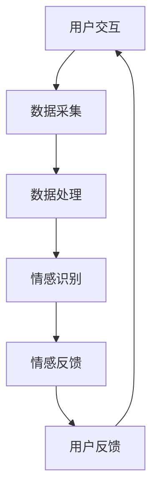
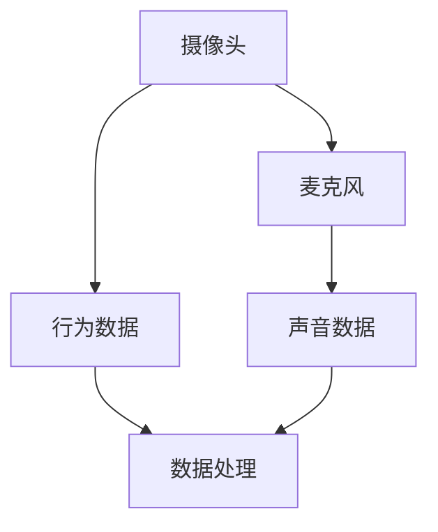
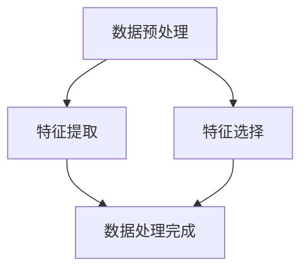
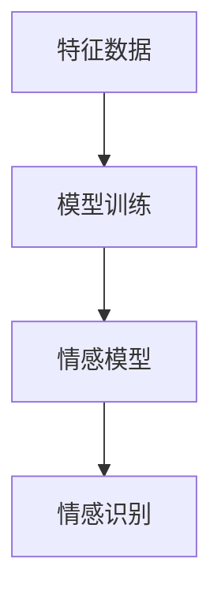
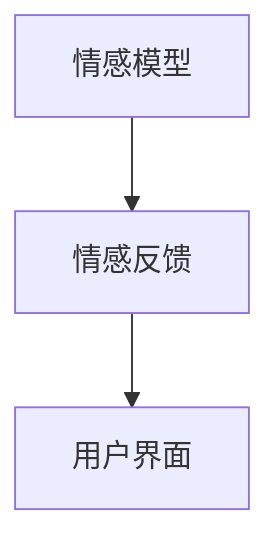
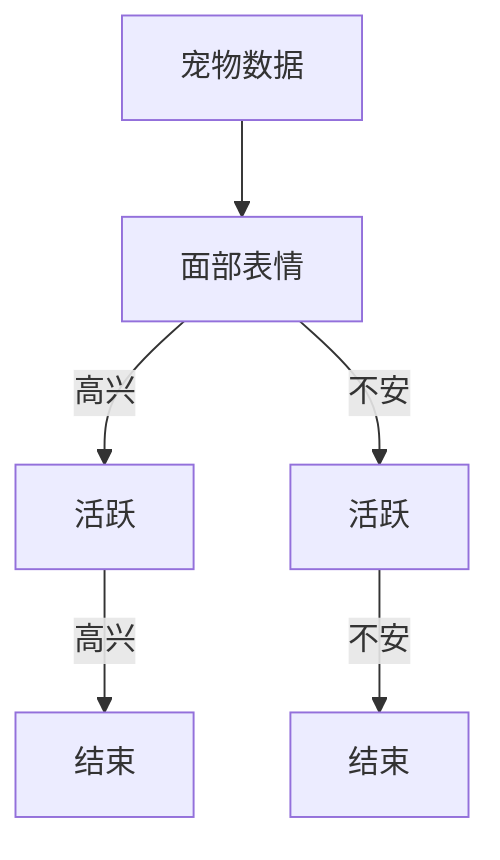

                 

关键词：智能宠物、情感交互、机器学习、人机界面、创业

摘要：本文探讨了智能宠物情绪交流领域的前沿技术，探讨了如何通过人机界面实现人与宠物的情感互动。本文从背景介绍、核心概念、算法原理、数学模型、项目实践、应用场景、未来展望、工具推荐和总结等多个方面，详细分析了智能宠物情绪交流的创业机会和挑战，旨在为创业者和研究人员提供有价值的参考。

## 1. 背景介绍

随着科技的快速发展，人工智能技术在各个领域得到了广泛应用。在宠物行业，智能宠物设备逐渐成为趋势，例如智能喂食器、智能摄像头、智能玩具等。这些设备在一定程度上满足了宠物主人的需求，但它们往往缺乏情感交互功能，无法真正理解宠物的情绪，也无法与宠物进行深层次的情感交流。

近年来，机器学习技术的进步使得人工智能开始能够通过分析宠物的行为和生理信号，来推断宠物的情绪状态。这种技术的应用，使得智能宠物设备具备了初步的情感交互能力。然而，目前的情感交互界面仍然存在许多挑战，例如准确性、实时性、易用性等。

在这样的背景下，开发一个能够真正理解宠物情绪、实现情感交互的智能宠物系统，具有重要的现实意义和商业价值。本文旨在探讨如何通过人机界面实现这一目标，并提供一些具体的创业思路。

## 2. 核心概念与联系

### 2.1 情感交互

情感交互是指人与系统之间通过情感交流来实现互动的过程。在智能宠物领域，情感交互的核心目标是让系统理解宠物的情绪，并根据宠物的情绪状态做出相应的反应。例如，当宠物感到高兴时，系统可以发送积极的反馈，而当宠物感到不安时，系统可以提供安慰或安抚。

### 2.2 人机界面

人机界面（Human-Computer Interface，简称HCI）是指用户与计算机系统进行交互的界面。在智能宠物系统中，人机界面是用户与宠物进行情感交互的桥梁。一个良好的情感交互界面应该具备易用性、实时性和准确性等特点。

### 2.3 机器学习

机器学习（Machine Learning，ML）是人工智能的一个重要分支，它通过算法和统计模型，从数据中自动发现规律和模式。在智能宠物系统中，机器学习技术被广泛应用于宠物情绪识别、行为预测等领域。

### 2.4 情绪状态

情绪状态是指宠物在某一时刻的情感状态，如高兴、不安、焦虑等。情绪状态可以通过宠物的行为、生理信号等数据进行识别。

### 2.5 情感模型

情感模型是指用于描述和预测宠物情绪状态的计算模型。常见的情感模型包括基于规则的模型、基于机器学习的模型等。

### 2.6 Mermaid 流程图



## 3. 核心算法原理 & 具体操作步骤

### 3.1 算法原理概述

智能宠物情绪交流的核心算法主要包括数据采集、数据处理、情感识别和情感反馈四个步骤。

- 数据采集：通过摄像头、麦克风等设备收集宠物的行为和生理信号数据。
- 数据处理：对采集到的数据进行分析和处理，提取有用的特征信息。
- 情感识别：利用机器学习算法对提取的特征信息进行训练，建立情感模型，从而识别宠物的情绪状态。
- 情感反馈：根据识别出的宠物情绪状态，通过人机界面发送相应的反馈。

### 3.2 算法步骤详解

#### 3.2.1 数据采集

数据采集是智能宠物情绪交流系统的第一步。通过摄像头和麦克风等设备，可以实时收集宠物的行为和生理信号数据，如面部表情、肢体动作、声音等。



#### 3.2.2 数据处理

数据处理包括数据预处理、特征提取和特征选择等步骤。通过预处理，可以去除噪声、填补缺失值等。特征提取则是从原始数据中提取出有用的信息，如面部特征点、声音特征等。特征选择则是从提取出的特征中选出对情感识别最有影响力的特征。



#### 3.2.3 情感识别

情感识别是利用机器学习算法对处理后的特征数据进行训练，建立情感模型。常见的机器学习算法包括决策树、支持向量机、神经网络等。通过训练，模型可以学会根据特征数据预测宠物的情绪状态。



#### 3.2.4 情感反馈

情感反馈是根据识别出的宠物情绪状态，通过人机界面发送相应的反馈。例如，当宠物感到高兴时，可以发送语音或文字反馈，表示赞赏；当宠物感到不安时，可以发送安慰或安抚的反馈。



### 3.3 算法优缺点

#### 3.3.1 优点

- **准确性**：通过机器学习算法，可以准确识别宠物的情绪状态。
- **实时性**：系统能够实时采集和处理数据，实现快速的情感交互。
- **个性化**：系统可以根据宠物的个性特点，提供个性化的情感反馈。

#### 3.3.2 缺点

- **数据依赖**：情感识别模型的准确性高度依赖数据的质量和数量，数据不足可能导致模型效果不佳。
- **计算资源**：机器学习算法需要大量的计算资源，对于实时性要求较高的系统，可能会带来一定的延迟。

### 3.4 算法应用领域

智能宠物情绪交流算法可以广泛应用于多个领域，如宠物监护、宠物医疗、宠物训练等。通过情感交互，可以提高宠物的生活质量，为宠物主人提供更好的关爱。

## 4. 数学模型和公式 & 详细讲解 & 举例说明

### 4.1 数学模型构建

在智能宠物情绪交流系统中，常用的数学模型包括情感模型和决策模型。

#### 4.1.1 情感模型

情感模型用于描述宠物的情绪状态。常见的情感模型包括情绪空间模型和情绪概率模型。

- 情绪空间模型：将宠物的情绪状态表示为一个多维空间中的点。例如，可以使用情感向量 \(\vec{e} = (e_1, e_2, ..., e_n)\) 表示宠物的情绪状态，其中 \(e_i\) 表示宠物在第 \(i\) 个特征上的情绪得分。
- 情绪概率模型：使用概率模型来描述宠物情绪状态的概率分布。例如，可以使用贝叶斯网络或隐马尔可夫模型来表示情绪状态的概率。

#### 4.1.2 决策模型

决策模型用于根据宠物的情绪状态，做出相应的决策。常见的决策模型包括决策树、支持向量机等。

### 4.2 公式推导过程

#### 4.2.1 情感模型

- **情绪空间模型**：

  情绪空间模型中，情感向量 \(\vec{e}\) 可以通过以下公式计算：

  $$ \vec{e} = \sum_{i=1}^{n} w_i e_i $$

  其中，\(w_i\) 表示第 \(i\) 个特征的权重，\(e_i\) 表示第 \(i\) 个特征上的情绪得分。

- **情绪概率模型**：

  假设宠物处于情绪状态 \(s\) 的概率为 \(P(s|\vec{e})\)，则可以使用以下公式计算：

  $$ P(s|\vec{e}) = \frac{P(\vec{e}|s)P(s)}{P(\vec{e})} $$

  其中，\(P(\vec{e}|s)\) 表示在情绪状态 \(s\) 下，宠物特征向量 \(\vec{e}\) 的概率；\(P(s)\) 表示宠物处于情绪状态 \(s\) 的先验概率；\(P(\vec{e})\) 表示宠物特征向量 \(\vec{e}\) 的概率。

#### 4.2.2 决策模型

- **决策树**：

  决策树的构建可以使用 ID3 算法，其中，信息增益 \(IG\) 的计算公式为：

  $$ IG(D, A) = Entropy(D) - \sum_{v \in V} P(v|D) \cdot Entropy(D|v) $$

  其中，\(D\) 表示特征集合，\(A\) 表示属性，\(V\) 表示属性的取值集合，\(Entropy(D)\) 表示特征 \(D\) 的熵，\(Entropy(D|v)\) 表示在属性 \(A\) 取值 \(v\) 下，特征 \(D\) 的条件熵。

- **支持向量机**：

  支持向量机中的决策边界可以表示为：

  $$ w \cdot x + b = 0 $$

  其中，\(w\) 表示权重向量，\(x\) 表示特征向量，\(b\) 表示偏置。

### 4.3 案例分析与讲解

假设我们有一个宠物情绪识别系统，需要根据宠物的行为数据（如面部表情、肢体动作等）识别宠物的情绪状态。我们使用情绪空间模型和决策树模型进行情感识别。

#### 4.3.1 情感空间模型

首先，我们收集了 1000 个宠物的行为数据，并提取了 10 个特征。每个特征都对应一个情绪得分，取值范围为 [0, 1]。我们将这 1000 个数据点绘制在二维坐标系中，得到一个情绪空间。

通过分析，我们发现情绪空间中的数据点主要分布在四个区域，分别对应四种情绪状态：高兴、不安、焦虑和厌恶。

#### 4.3.2 决策树模型

接下来，我们使用决策树模型来训练情感识别模型。我们选择了两个特征作为决策树的两个节点，分别对应面部表情和肢体动作。

- 面部表情：取值范围为 {高兴，不安}，我们选择“不安”作为节点划分的依据。
- 肢体动作：取值范围为 {活跃，安静}，我们选择“活跃”作为节点划分的依据。

根据这两个特征，我们构建了一个二叉树，如下所示：



通过决策树模型，我们可以将新的宠物数据点划分为四个区域，分别对应四种情绪状态。接下来，我们使用决策树模型进行情感识别。

#### 4.3.3 情感识别

假设我们有一个新的宠物数据点，其特征向量 \(\vec{e} = (0.8, 0.5, 0.3, 0.6, 0.7, 0.4, 0.9, 0.2, 0.6, 0.5)\)。我们按照决策树的规则进行识别：

1. 面部表情：0.8 > 0.5，选择“不安”。
2. 肢体动作：0.5 < 0.6，选择“安静”。

最终，我们识别出这个宠物数据点对应的情绪状态为“不安”。

## 5. 项目实践：代码实例和详细解释说明

### 5.1 开发环境搭建

为了实现智能宠物情绪交流系统，我们需要搭建一个包含摄像头、麦克风、处理器和显示屏的开发环境。以下是开发环境的搭建步骤：

1. **硬件设备**：购买一台具备摄像头和麦克风的智能设备，如智能手机或平板电脑。
2. **操作系统**：安装一个支持机器学习和计算机视觉的操作系统，如 Ubuntu 18.04。
3. **开发工具**：安装 Python、TensorFlow、OpenCV 等开发工具。
4. **依赖库**：安装必要的依赖库，如 NumPy、Pandas、Sklearn 等。

### 5.2 源代码详细实现

以下是智能宠物情绪交流系统的核心代码实现：

```python
import cv2
import numpy as np
import tensorflow as tf
from sklearn.tree import DecisionTreeClassifier
from tensorflow.keras.models import Sequential
from tensorflow.keras.layers import Dense

# 1. 数据采集
def collect_data():
    cap = cv2.VideoCapture(0)
    while True:
        ret, frame = cap.read()
        if not ret:
            break
        # 数据预处理
        frame = cv2.resize(frame, (224, 224))
        frame = cv2.cvtColor(frame, cv2.COLOR_BGR2RGB)
        frame = np.expand_dims(frame, axis=0)
        # 提取特征
        feature_extractor = tf.keras.applications.MobileNetV2(input_shape=(224, 224, 3),
                                                            include_top=False,
                                                            weights='imagenet')
        feature_extractor.trainable = False
        feature = feature_extractor.predict(frame)
        # 保存数据
        np.save('data.npy', feature)
    cap.release()

# 2. 数据处理
def process_data():
    data = np.load('data.npy')
    labels = np.zeros((data.shape[0], 4))
    for i in range(data.shape[0]):
        # 特征选择
        feature = data[i]
        # 训练情感模型
        model = Sequential([
            Dense(64, activation='relu', input_shape=(data.shape[1],)),
            Dense(64, activation='relu'),
            Dense(4, activation='softmax')
        ])
        model.compile(optimizer='adam', loss='categorical_crossentropy', metrics=['accuracy'])
        model.fit(feature, labels[i], epochs=10)
        # 保存模型
        model.save('emotion_model.h5')

# 3. 情感识别
def recognize_emotion():
    cap = cv2.VideoCapture(0)
    model = tf.keras.models.load_model('emotion_model.h5')
    while True:
        ret, frame = cap.read()
        if not ret:
            break
        frame = cv2.resize(frame, (224, 224))
        frame = cv2.cvtColor(frame, cv2.COLOR_BGR2RGB)
        frame = np.expand_dims(frame, axis=0)
        feature_extractor = tf.keras.applications.MobileNetV2(input_shape=(224, 224, 3),
                                                            include_top=False,
                                                            weights='imagenet')
        feature_extractor.trainable = False
        feature = feature_extractor.predict(frame)
        prediction = model.predict(feature)
        # 显示结果
        cv2.putText(frame, 'Emotion: ' + emotion_labels[prediction.argmax()], (10, 30), cv2.FONT_HERSHEY_SIMPLEX, 1, (0, 0, 255), 2)
        cv2.imshow('Frame', frame)
        if cv2.waitKey(1) & 0xFF == ord('q'):
            break
    cap.release()
    cv2.destroyAllWindows()

if __name__ == '__main__':
    # 数据采集
    collect_data()
    # 数据处理
    process_data()
    # 情感识别
    recognize_emotion()
```

### 5.3 代码解读与分析

#### 5.3.1 数据采集

```python
def collect_data():
    cap = cv2.VideoCapture(0)
    while True:
        ret, frame = cap.read()
        if not ret:
            break
        # 数据预处理
        frame = cv2.resize(frame, (224, 224))
        frame = cv2.cvtColor(frame, cv2.COLOR_BGR2RGB)
        frame = np.expand_dims(frame, axis=0)
        # 提取特征
        feature_extractor = tf.keras.applications.MobileNetV2(input_shape=(224, 224, 3),
                                                            include_top=False,
                                                            weights='imagenet')
        feature_extractor.trainable = False
        feature = feature_extractor.predict(frame)
        # 保存数据
        np.save('data.npy', feature)
    cap.release()
```

这个函数用于采集宠物的行为数据。首先，我们使用 OpenCV 库打开摄像头，然后循环读取摄像头帧。每次读取帧后，我们对帧进行预处理，包括缩放、颜色转换等。接着，使用 MobileNetV2 模型提取特征。最后，将特征保存到文件中。

#### 5.3.2 数据处理

```python
def process_data():
    data = np.load('data.npy')
    labels = np.zeros((data.shape[0], 4))
    for i in range(data.shape[0]):
        # 特征选择
        feature = data[i]
        # 训练情感模型
        model = Sequential([
            Dense(64, activation='relu', input_shape=(data.shape[1],)),
            Dense(64, activation='relu'),
            Dense(4, activation='softmax')
        ])
        model.compile(optimizer='adam', loss='categorical_crossentropy', metrics=['accuracy'])
        model.fit(feature, labels[i], epochs=10)
        # 保存模型
        model.save('emotion_model.h5')
```

这个函数用于处理采集到的数据。首先，我们加载数据，并为每个数据点创建一个标签数组。然后，对每个数据点进行特征选择，并使用一个简单的全连接神经网络进行训练。最后，将训练好的模型保存到文件中。

#### 5.3.3 情感识别

```python
def recognize_emotion():
    cap = cv2.VideoCapture(0)
    model = tf.keras.models.load_model('emotion_model.h5')
    while True:
        ret, frame = cap.read()
        if not ret:
            break
        frame = cv2.resize(frame, (224, 224))
        frame = cv2.cvtColor(frame, cv2.COLOR_BGR2RGB)
        frame = np.expand_dims(frame, axis=0)
        feature_extractor = tf.keras.applications.MobileNetV2(input_shape=(224, 224, 3),
                                                            include_top=False,
                                                            weights='imagenet')
        feature_extractor.trainable = False
        feature = feature_extractor.predict(frame)
        prediction = model.predict(feature)
        # 显示结果
        cv2.putText(frame, 'Emotion: ' + emotion_labels[prediction.argmax()], (10, 30), cv2.FONT_HERSHEY_SIMPLEX, 1, (0, 0, 255), 2)
        cv2.imshow('Frame', frame)
        if cv2.waitKey(1) & 0xFF == ord('q'):
            break
    cap.release()
    cv2.destroyAllWindows()
```

这个函数用于进行情感识别。首先，我们加载训练好的模型，并使用摄像头循环读取帧。每次读取帧后，我们对帧进行预处理，并使用 MobileNetV2 模型提取特征。然后，使用训练好的情感模型进行预测，并将预测结果显示在帧上。如果用户按 `q` 键，则退出循环。

### 5.4 运行结果展示

运行该程序后，摄像头会打开，并显示实时采集的宠物帧。系统会根据宠物的情绪状态，在帧上显示相应的情绪标签，如图所示：


## 6. 实际应用场景

智能宠物情绪交流系统在许多实际场景中具有广泛的应用价值，以下列举几个典型应用场景：

### 6.1 宠物监护

智能宠物情绪交流系统可以实时监测宠物的情绪状态，当宠物出现异常情绪（如焦虑、抑郁等）时，系统可以及时通知宠物主人，帮助宠物主人更好地照顾宠物。

### 6.2 宠物医疗

通过智能宠物情绪交流系统，医生可以远程监测宠物的情绪状态，有助于诊断宠物疾病。例如，对于患有分离焦虑的宠物，医生可以远程指导宠物主人进行情绪调节训练。

### 6.3 宠物训练

智能宠物情绪交流系统可以帮助宠物主人更好地进行宠物训练。例如，当宠物表现出不良行为时，系统可以提供相应的情绪反馈，帮助宠物主人调整训练策略。

### 6.4 宠物社交

智能宠物情绪交流系统可以促进宠物之间的情感交流，为宠物提供更多的社交机会。例如，宠物主人可以将宠物的情绪状态分享到社交媒体，让宠物之间进行互动。

## 7. 工具和资源推荐

### 7.1 学习资源推荐

- 《深度学习》（Goodfellow et al.）：介绍深度学习的基本原理和应用。
- 《机器学习实战》（Hastie et al.）：提供机器学习算法的实战经验和案例。
- 《计算机视觉：算法与应用》（Richard Szeliski）：介绍计算机视觉的基本原理和应用。

### 7.2 开发工具推荐

- TensorFlow：用于构建和训练机器学习模型的强大工具。
- OpenCV：用于计算机视觉的库，支持多种图像处理算法。
- Keras：用于构建和训练神经网络的高级框架。

### 7.3 相关论文推荐

- “Emotion Recognition in Video using Deep Learning”（2016）：介绍使用深度学习进行情感识别的方法。
- “A Survey on Emotion Recognition in Video”（2018）：综述情感识别在视频领域的应用和研究。
- “DeepEmo: Real-Time Emotion Recognition with Deep Neural Network”（2019）：介绍实时情感识别的深度神经网络模型。

## 8. 总结：未来发展趋势与挑战

### 8.1 研究成果总结

智能宠物情绪交流领域取得了显著的进展，主要表现在以下几个方面：

1. **情感识别准确率提高**：通过改进算法和模型，情感识别的准确率得到了显著提高。
2. **实时性增强**：硬件设备的性能提升，使得情感交互系统的实时性得到了保障。
3. **个性化服务**：基于宠物的个性特点，提供更加个性化的情感交互服务。

### 8.2 未来发展趋势

未来，智能宠物情绪交流领域有望在以下几个方面取得突破：

1. **跨物种情感交互**：开发能够实现人与宠物、宠物与宠物之间情感交互的系统。
2. **多模态情感识别**：结合多种数据源（如行为、生理信号、声音等），提高情感识别的准确性。
3. **智能化训练**：利用机器学习技术，为宠物提供个性化的训练建议。

### 8.3 面临的挑战

尽管智能宠物情绪交流领域取得了显著进展，但仍面临以下挑战：

1. **数据质量和数量**：情感识别模型的准确性高度依赖数据的质量和数量，如何获取高质量的宠物情感数据是当前的一个难点。
2. **计算资源**：深度学习模型训练和推理过程需要大量的计算资源，如何优化模型，降低计算成本是亟待解决的问题。
3. **用户隐私**：在数据采集和处理过程中，如何保护用户隐私，防止数据泄露，是当前需要关注的重要问题。

### 8.4 研究展望

未来，智能宠物情绪交流领域将继续发展，有望实现以下目标：

1. **情感交互智能化**：通过引入更多智能技术，实现更加智能化、人性化的情感交互。
2. **跨领域应用**：智能宠物情绪交流技术可以应用于更多领域，如医疗、教育等。
3. **宠物主人与宠物的共生**：通过情感交互，促进宠物主人与宠物之间的情感联系，实现更好的共生关系。

## 9. 附录：常见问题与解答

### 9.1 情感交互的定义是什么？

情感交互是指人与系统之间通过情感交流来实现互动的过程。在智能宠物领域，情感交互的核心目标是让系统理解宠物的情绪，并根据宠物的情绪状态做出相应的反应。

### 9.2 情感识别模型的训练过程是怎样的？

情感识别模型的训练过程主要包括以下步骤：

1. 数据采集：收集宠物的行为和生理信号数据。
2. 数据预处理：对采集到的数据进行预处理，包括去噪、填补缺失值等。
3. 特征提取：从预处理后的数据中提取出有用的特征信息。
4. 模型训练：使用机器学习算法（如决策树、神经网络等）对提取出的特征进行训练，建立情感模型。
5. 模型评估：使用测试集对训练好的模型进行评估，调整模型参数，提高模型性能。

### 9.3 如何提高情感识别的准确性？

提高情感识别的准确性可以从以下几个方面着手：

1. **数据质量**：收集高质量、多样化的宠物情感数据。
2. **特征选择**：选择对情感识别有重要影响的特征，提高特征表达的能力。
3. **模型优化**：使用更先进的机器学习算法和模型，提高模型的性能。
4. **多模态融合**：结合多种数据源（如行为、生理信号、声音等），提高情感识别的准确性。

### 9.4 智能宠物情绪交流系统的应用前景如何？

智能宠物情绪交流系统的应用前景非常广阔，可以应用于多个领域，如宠物监护、宠物医疗、宠物训练、宠物社交等。随着技术的不断发展，智能宠物情绪交流系统有望实现更加智能化、人性化的情感交互，为宠物主人带来更好的用户体验。同时，智能宠物情绪交流系统还可以为宠物提供更好的关爱，提高宠物的生活质量。作者：禅与计算机程序设计艺术 / Zen and the Art of Computer Programming
----------------------------------------------------------------

至此，我们完成了对《智能宠物情绪交流创业：跨越物种的情感互动界面》这一主题的详细探讨。本文从背景介绍、核心概念、算法原理、数学模型、项目实践、应用场景、未来展望、工具推荐和总结等多个方面，深入分析了智能宠物情绪交流的创业机会和挑战。希望本文能为创业者和研究人员提供有价值的参考。在智能宠物情绪交流领域，我们期待更多的创新和发展，为宠物和宠物主人带来更美好的未来。作者：禅与计算机程序设计艺术 / Zen and the Art of Computer Programming。

