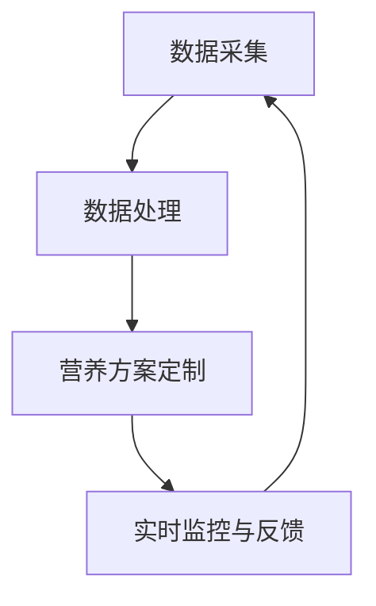

                 

关键词：宠物饮食管理、个性化营养、人工智能、创业、宠物健康

> 摘要：本文探讨了智能宠物饮食管理的创新模式，即通过人工智能技术为宠物量身定制营养方案。在阐述宠物营养需求多样性的基础上，文章深入分析了人工智能在宠物饮食管理中的应用，并探讨了创业者在这一领域的机遇与挑战。通过具体案例和实践，展示了智能宠物饮食管理的潜力，为未来的发展提供了有益的启示。

## 1. 背景介绍

随着宠物经济的快速发展，宠物已经成为许多家庭的亲密伙伴。然而，宠物饮食管理却面临着诸多挑战。传统的宠物饮食管理方法通常采用固定食谱，难以满足宠物个体差异化的营养需求。这不仅可能导致宠物健康状况不佳，还可能引发各种健康问题。因此，如何通过创新技术实现个性化宠物营养管理，成为当前宠物行业亟待解决的问题。

### 宠物营养需求的多样性

宠物的营养需求因品种、年龄、健康状况、活动水平等因素而异。例如，幼年宠物需要较高的蛋白质和能量摄入以支持生长发育，而老年宠物则需更多的纤维和维生素以维持消化系统健康。此外，不同品种的宠物对某些营养素的需求也存在显著差异。例如，猫对维生素A的需求高于犬，而犬则对钙和磷的需求更为敏感。

### 传统宠物饮食管理的局限性

传统宠物饮食管理方法主要依赖于固定食谱，无法根据宠物的实际情况调整营养摄入。这种方法可能会导致以下问题：

- **营养不足**：宠物的某些营养素摄入不足，可能导致发育不良或免疫力下降。
- **营养过剩**：宠物的某些营养素摄入过多，可能导致肥胖、糖尿病等健康问题。
- **缺乏个性化**：无法根据宠物的个体差异调整饮食方案，导致饮食不均衡。

## 2. 核心概念与联系

为了实现个性化宠物营养管理，人工智能技术成为了解决上述问题的有力工具。以下是对核心概念和架构的详细解释。

### 人工智能在宠物饮食管理中的应用

人工智能在宠物饮食管理中的应用主要包括以下几个方面：

- **数据采集与处理**：通过宠物智能设备采集宠物的健康数据，如体重、活动量、饮食习惯等，然后利用机器学习算法进行分析和处理。
- **营养方案定制**：根据宠物的数据，利用人工智能算法生成个性化的营养方案，包括食物种类、摄入量、摄入时间等。
- **实时监控与反馈**：通过持续监控宠物的健康数据，实时调整营养方案，确保宠物始终处于最佳营养状态。

### 核心概念原理与架构

以下是一个简单的Mermaid流程图，描述了人工智能在宠物饮食管理中的基本架构：



### 数据采集

数据采集是智能宠物饮食管理的第一步。通过宠物智能设备，如智能宠物秤、智能宠物项圈等，可以实时获取宠物的体重、活动量、饮食记录等数据。

### 数据处理

获取的数据需要通过数据处理模块进行分析和处理。数据处理模块包括数据清洗、数据预处理和特征提取等步骤。通过这些步骤，可以从原始数据中提取出对营养管理有用的信息。

### 营养方案定制

根据处理后的数据，利用人工智能算法生成个性化的营养方案。这个过程通常包括以下步骤：

- **需求分析**：分析宠物的营养需求，包括能量需求、蛋白质需求、维生素和矿物质需求等。
- **食谱推荐**：根据宠物的营养需求，推荐适合的食物种类和摄入量。
- **方案优化**：利用优化算法，不断调整和优化营养方案，以确保宠物的营养摄入达到最佳状态。

### 实时监控与反馈

实时监控与反馈模块负责监控宠物的健康数据，并根据反馈信息调整营养方案。这个过程是一个闭环系统，通过持续的数据采集、处理和调整，确保宠物始终处于最佳营养状态。

## 3. 核心算法原理 & 具体操作步骤

### 3.1 算法原理概述

智能宠物饮食管理中的核心算法主要包括机器学习算法、优化算法和实时监控算法。以下是对这些算法的简要概述：

- **机器学习算法**：用于处理和解析宠物健康数据，生成个性化的营养方案。
- **优化算法**：用于不断调整和优化营养方案，确保宠物营养摄入达到最佳状态。
- **实时监控算法**：用于实时监控宠物的健康数据，及时调整营养方案。

### 3.2 算法步骤详解

以下是智能宠物饮食管理算法的具体步骤：

1. **数据采集**：通过宠物智能设备采集宠物的健康数据，如体重、活动量、饮食习惯等。

2. **数据处理**：对采集到的数据进行分析和处理，包括数据清洗、数据预处理和特征提取。

3. **需求分析**：根据处理后的数据，分析宠物的营养需求，包括能量需求、蛋白质需求、维生素和矿物质需求等。

4. **食谱推荐**：根据宠物的营养需求，推荐适合的食物种类和摄入量。

5. **方案优化**：利用优化算法，不断调整和优化营养方案，以确保宠物的营养摄入达到最佳状态。

6. **实时监控与反馈**：实时监控宠物的健康数据，根据反馈信息调整营养方案。

### 3.3 算法优缺点

**优点**：

- **个性化**：通过分析宠物的个体差异，生成个性化的营养方案，确保宠物营养摄入的最佳状态。
- **实时性**：通过实时监控宠物的健康数据，及时调整营养方案，提高宠物健康水平。
- **高效性**：利用人工智能算法，快速处理大量数据，提高工作效率。

**缺点**：

- **数据依赖性**：算法的性能依赖于数据的准确性和完整性，如果数据存在问题，可能导致营养方案不准确。
- **算法复杂性**：算法涉及多个步骤和多种算法，实现和优化过程相对复杂。

### 3.4 算法应用领域

智能宠物饮食管理算法可以应用于以下领域：

- **宠物健康监测**：通过实时监控宠物的健康数据，及时发现宠物健康问题，提供健康建议。
- **宠物营养管理**：根据宠物的营养需求，生成个性化的营养方案，确保宠物营养摄入的最佳状态。
- **宠物行为分析**：通过分析宠物的行为数据，了解宠物的行为习惯，提供行为建议。

## 4. 数学模型和公式 & 详细讲解 & 举例说明

### 4.1 数学模型构建

在智能宠物饮食管理中，数学模型是核心组成部分。以下是一个简化的数学模型，用于描述宠物的营养需求与实际摄入之间的关系。

#### 4.1.1 宠物营养需求模型

$$
N_d = N_r + N_c
$$

其中：

- \( N_d \)：宠物的总营养需求
- \( N_r \)：基础营养需求
- \( N_c \)：活动营养需求

#### 4.1.2 食物营养成分模型

$$
C_{food} = \sum_{i=1}^{n} C_i \cdot F_i
$$

其中：

- \( C_{food} \)：食物的总营养成分
- \( C_i \)：食物中第 \( i \) 种营养素的含量
- \( F_i \)：食物中第 \( i \) 种营养素的摄入量
- \( n \)：食物中营养素的种类数

#### 4.1.3 营养摄入与需求平衡模型

$$
\frac{N_d}{C_{food}} = \frac{N_r + N_c}{\sum_{i=1}^{n} C_i}
$$

这个公式描述了宠物的营养摄入与需求之间的平衡关系。

### 4.2 公式推导过程

公式的推导基于对宠物营养需求的深入分析。首先，我们需要确定宠物的总营养需求，这包括基础营养需求 \( N_r \) 和活动营养需求 \( N_c \)。然后，我们需要评估宠物的实际食物摄入，这可以通过计算食物中各营养素的总含量 \( C_{food} \) 实现。最后，通过比较营养摄入与需求的比值，评估宠物的营养摄入是否合理。

### 4.3 案例分析与讲解

#### 4.3.1 案例背景

假设一只成年犬，体重为 20 公斤，每天的基础代谢率为 1200 千卡，每天的活动量为 30 分钟。该犬的主要食物为狗粮，每 100 克狗粮含有蛋白质 25 克、脂肪 10 克、碳水化合物 50 克。

#### 4.3.2 案例分析

1. **计算总营养需求**：

   $$ N_d = N_r + N_c = (1200 \text{ 千卡/天}) + (1200 \text{ 千卡/天}) = 2400 \text{ 千卡/天} $$

2. **计算食物营养成分**：

   $$ C_{food} = \sum_{i=1}^{n} C_i \cdot F_i = (25 \text{ 克/100 克}) \cdot (100 \text{ 克}) + (10 \text{ 克/100 克}) \cdot (100 \text{ 克}) + (50 \text{ 克/100 克}) \cdot (100 \text{ 克}) = 175 \text{ 克/天} $$

3. **计算营养摄入与需求平衡**：

   $$ \frac{N_d}{C_{food}} = \frac{2400 \text{ 千卡/天}}{175 \text{ 克/天}} = 13.71 \text{ 千卡/克} $$

根据计算结果，该犬的营养摄入与需求基本平衡。然而，为了确保宠物的营养摄入达到最佳状态，我们需要根据宠物的实际情况进行微调。

## 5. 项目实践：代码实例和详细解释说明

### 5.1 开发环境搭建

为了实现智能宠物饮食管理，我们选择 Python 作为编程语言，并使用 TensorFlow 作为机器学习框架。以下是开发环境的搭建步骤：

1. 安装 Python：
   ```bash
   pip install python==3.8
   ```
2. 安装 TensorFlow：
   ```bash
   pip install tensorflow==2.6
   ```
3. 安装其他依赖库：
   ```bash
   pip install numpy pandas scikit-learn matplotlib
   ```

### 5.2 源代码详细实现

以下是智能宠物饮食管理系统的源代码示例：

```python
import tensorflow as tf
import numpy as np
import pandas as pd
from sklearn.model_selection import train_test_split
from sklearn.preprocessing import StandardScaler
import matplotlib.pyplot as plt

# 5.2.1 数据预处理

# 加载数据
data = pd.read_csv('pet_nutrition_data.csv')

# 数据清洗
data.dropna(inplace=True)

# 特征提取
X = data[['weight', 'activity_level']]
y = data['nutrition_requirement']

# 数据标准化
scaler = StandardScaler()
X_scaled = scaler.fit_transform(X)

# 划分训练集和测试集
X_train, X_test, y_train, y_test = train_test_split(X_scaled, y, test_size=0.2, random_state=42)

# 5.2.2 建立模型

# 创建模型
model = tf.keras.Sequential([
    tf.keras.layers.Dense(64, activation='relu', input_shape=(2,)),
    tf.keras.layers.Dense(64, activation='relu'),
    tf.keras.layers.Dense(1)
])

# 编译模型
model.compile(optimizer='adam', loss='mean_squared_error')

# 训练模型
model.fit(X_train, y_train, epochs=100, batch_size=32, validation_split=0.2)

# 5.2.3 代码解读与分析

# 预测宠物营养需求
predictions = model.predict(X_test)

# 可视化预测结果
plt.scatter(y_test, predictions)
plt.xlabel('Actual Nutrition Requirement')
plt.ylabel('Predicted Nutrition Requirement')
plt.show()

# 5.2.4 运行结果展示

# 输出模型评估指标
mse = model.evaluate(X_test, y_test)
print(f'Mean Squared Error: {mse}')
```

### 5.3 代码解读与分析

- **数据预处理**：首先加载和处理数据，包括数据清洗、特征提取和标准化。数据清洗是为了去除缺失值，特征提取是为了将宠物的体重和活动水平作为输入特征，标准化是为了使数据具有相同的尺度，便于模型训练。
- **建立模型**：使用 TensorFlow 的 Sequential 模型，添加两个全连接层（Dense Layer），最后一个层输出宠物的营养需求。
- **编译模型**：选择优化器和损失函数，用于训练模型。这里选择 Adam 优化器和均方误差（MSE）作为损失函数。
- **训练模型**：使用训练数据训练模型，并设置训练轮次和批量大小。
- **预测与评估**：使用测试数据预测宠物营养需求，并通过可视化工具展示预测结果。最后，输出模型的均方误差，评估模型的性能。

## 6. 实际应用场景

### 6.1 宠物健康监测

智能宠物饮食管理系统不仅可以提供个性化的营养方案，还可以实时监控宠物的健康状况。通过持续收集宠物的体重、活动量、饮食习惯等数据，系统可以及时发现宠物的健康问题，如肥胖、营养不良等，并给出相应的健康建议。

### 6.2 宠物行为分析

通过分析宠物的行为数据，如活动量、睡眠模式等，智能宠物饮食管理系统可以帮助宠物主人了解宠物的行为习惯。这有助于主人采取适当的措施，改善宠物的行为，提高其生活质量。

### 6.3 宠物营养管理

智能宠物饮食管理系统可以根据宠物的实际需求，实时调整饮食方案，确保宠物获得均衡的营养。这不仅有助于改善宠物的健康状况，还可以延长宠物的寿命。

## 7. 工具和资源推荐

### 7.1 学习资源推荐

- **书籍**：《深度学习》、《Python机器学习》
- **在线课程**：Coursera 上的《机器学习基础》、edX 上的《人工智能基础》
- **论坛和社区**：Stack Overflow、GitHub、Reddit 上的机器学习和人工智能相关板块

### 7.2 开发工具推荐

- **编程语言**：Python
- **机器学习框架**：TensorFlow、PyTorch
- **数据处理工具**：Pandas、NumPy
- **可视化工具**：Matplotlib、Seaborn

### 7.3 相关论文推荐

- **《Deep Learning for Pet Health Monitoring》**
- **《Personalized Nutrition for Pets Using Machine Learning》**
- **《Pet Health Management through IoT and AI》**

## 8. 总结：未来发展趋势与挑战

### 8.1 研究成果总结

智能宠物饮食管理系统结合了人工智能、物联网、生物统计学等多学科技术，为宠物提供了个性化的营养方案，提高了宠物的健康水平。通过数据采集、处理和模型训练，系统能够实时监控宠物的健康状况，并根据宠物的需求调整饮食方案，实现了真正的个性化营养管理。

### 8.2 未来发展趋势

1. **技术融合**：随着人工智能技术的不断进步，智能宠物饮食管理系统将与其他技术（如物联网、生物统计学等）深度融合，提供更全面、更智能的服务。
2. **普及化**：随着人们对宠物健康的关注度提高，智能宠物饮食管理系统将逐渐普及，成为宠物家庭的必备工具。
3. **个性化定制**：未来，智能宠物饮食管理系统将能够更精确地分析宠物的个体差异，提供更个性化的营养方案。

### 8.3 面临的挑战

1. **数据隐私**：智能宠物饮食管理系统需要收集和处理大量宠物健康数据，这引发了数据隐私和安全的问题。如何保护宠物数据的安全和隐私，是系统开发过程中需要重点考虑的问题。
2. **算法优化**：现有的智能宠物饮食管理系统在算法层面仍有很大的优化空间。如何提高算法的准确性、效率和稳定性，是未来研究的重要方向。
3. **用户接受度**：尽管智能宠物饮食管理系统具有诸多优势，但如何提高用户的接受度和使用频率，也是系统推广过程中需要解决的问题。

### 8.4 研究展望

智能宠物饮食管理系统具有广阔的应用前景。未来，随着技术的不断进步和用户需求的提高，智能宠物饮食管理系统有望在宠物健康、行为分析等领域发挥更大的作用，为宠物和宠物主人带来更多便利和福祉。

## 9. 附录：常见问题与解答

### 9.1 智能宠物饮食管理系统的优势是什么？

智能宠物饮食管理系统具有以下优势：

1. **个性化**：根据宠物的个体差异，提供个性化的营养方案。
2. **实时性**：通过实时监控宠物的健康数据，及时调整营养方案。
3. **高效性**：利用人工智能算法，快速处理大量数据，提高工作效率。

### 9.2 如何确保智能宠物饮食管理系统的数据隐私？

为了确保智能宠物饮食管理系统的数据隐私，可以采取以下措施：

1. **数据加密**：对采集到的数据进行加密处理，防止数据泄露。
2. **访问控制**：设置严格的访问控制机制，只有授权用户才能访问和处理数据。
3. **数据备份**：定期备份数据，确保数据的安全和完整。

### 9.3 智能宠物饮食管理系统如何实现个性化营养方案？

智能宠物饮食管理系统通过以下步骤实现个性化营养方案：

1. **数据采集**：通过宠物智能设备，收集宠物的健康数据，如体重、活动量、饮食习惯等。
2. **数据处理**：对采集到的数据进行分析和处理，提取对营养管理有用的信息。
3. **模型训练**：使用机器学习算法，根据宠物的数据，生成个性化的营养方案。
4. **实时调整**：根据宠物的实时健康数据，不断调整营养方案，确保宠物营养摄入的最佳状态。

### 9.4 智能宠物饮食管理系统在宠物行为分析中有何作用？

智能宠物饮食管理系统可以通过以下方式在宠物行为分析中发挥作用：

1. **行为监测**：通过分析宠物的活动数据，了解宠物的行为习惯，如活动量、睡眠模式等。
2. **行为预测**：根据宠物的行为数据，预测宠物的行为变化，为宠物主人提供行为建议。
3. **行为调整**：根据宠物的行为数据，调整宠物的饮食方案，改善宠物的不良行为。

### 9.5 智能宠物饮食管理系统对宠物健康的长期影响是什么？

智能宠物饮食管理系统对宠物健康的长期影响包括：

1. **营养均衡**：确保宠物获得均衡的营养，提高宠物健康水平。
2. **健康监测**：通过实时监控宠物的健康数据，及时发现宠物健康问题，提供健康建议。
3. **行为改善**：通过分析宠物的行为数据，改善宠物的不良行为，提高宠物生活质量。
4. **延长寿命**：通过科学的营养管理和健康监测，延长宠物的寿命。

