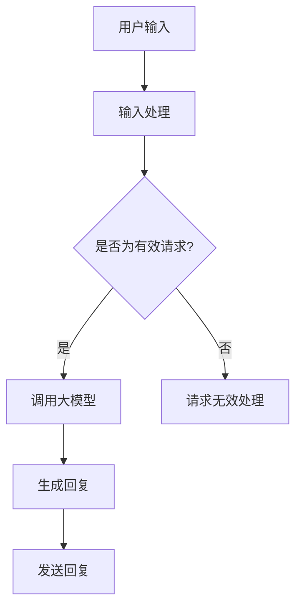

                 

### 1. 背景介绍

在当今这个数字化快速发展的时代，客户服务已成为企业成功的关键因素之一。随着互联网和移动设备的普及，用户对于即时性和个性化服务的需求日益增长。传统的客户服务方式，如电话和邮件支持，往往难以满足这种快速变化的需求。因此，企业开始寻求更加智能化和高效的解决方案，以提升用户体验和满意度。

人工智能（AI）技术的发展为这一需求提供了有力的支持。特别是大规模预训练语言模型（Large-scale Pre-trained Language Models），如GPT-3、BERT等，已经显示出在自然语言处理（NLP）任务中的卓越能力。这些模型可以理解和生成复杂的语言结构，从而实现与用户的自然对话，提供高质量的客户服务。

本篇文章将探讨如何利用AI大模型来提升客户服务的用户满意度。首先，我们将介绍AI大模型的基本概念和原理，接着讨论其在客户服务中的应用，最后展望其未来的发展趋势和面临的挑战。

### 2. 核心概念与联系

#### 2.1 AI大模型的基本概念

AI大模型是指那些具有数十亿甚至千亿级参数的深度学习模型，这些模型在大量数据上进行预训练，能够自动学习到语言、图像、声音等多种类型信息的复杂模式。代表性的模型包括GPT-3、BERT、T5等。这些模型通过自我学习，可以实现高度复杂的自然语言理解和生成任务。

#### 2.2 AI大模型的工作原理

AI大模型主要基于两种类型的神经网络：循环神经网络（RNN）和Transformer。RNN具有序列记忆能力，能够处理文本序列，但容易受到梯度消失和爆炸问题的影响。而Transformer模型通过自注意力机制（self-attention），可以并行处理输入序列，避免了RNN的梯度消失问题，并且在大量数据上表现更加优秀。

#### 2.3 AI大模型与客户服务的联系

AI大模型在客户服务中的关键应用是自然语言处理和对话系统。这些模型可以理解用户的语言输入，生成合适的回复，从而实现与用户的自然对话。通过使用AI大模型，企业可以实现24/7不间断的客户服务，提高响应速度，减少人工干预，从而提升用户满意度。

#### 2.4 Mermaid 流程图

下面是AI大模型在客户服务中的应用流程图：



### 3. 核心算法原理 & 具体操作步骤

#### 3.1 算法原理概述

AI大模型的核心算法是基于深度学习的技术，特别是基于Transformer架构的模型。这些模型通过自我学习，可以从大量数据中提取语言模式，从而实现高质量的文本理解和生成。

#### 3.2 算法步骤详解

1. **数据预处理**：首先，需要收集和整理客户服务的相关数据，如用户提问、客服回复等。这些数据将被用于训练AI大模型。

2. **模型训练**：使用Transformer架构训练大模型，通过大量数据进行自我学习，提取语言模式。

3. **输入处理**：当用户提出问题时，系统会对输入进行处理，将其转化为模型可以接受的格式。

4. **文本生成**：模型根据输入文本，生成合适的回复。

5. **回复处理**：生成的回复将被进一步处理，如去除不当用语、格式化等。

6. **发送回复**：将处理后的回复发送给用户。

#### 3.3 算法优缺点

**优点**：
- **高效性**：AI大模型可以处理大量数据，实现快速响应。
- **多样性**：模型可以生成多样性的回复，提供个性化的服务。
- **持续性**：模型可以24/7不间断工作，提供稳定的服务。

**缺点**：
- **成本**：训练和部署AI大模型需要大量的计算资源和时间。
- **准确性**：尽管AI大模型在自然语言处理方面表现出色，但仍有可能产生误解或不准确的回复。
- **依赖数据**：模型的性能高度依赖于训练数据的质量和数量。

#### 3.4 算法应用领域

AI大模型在客户服务中的应用非常广泛，包括但不限于：
- **在线客服**：提供即时、高效的在线支持。
- **智能语音助手**：如亚马逊的Alexa、苹果的Siri等。
- **自动化营销**：如邮件自动回复、社交媒体互动等。
- **金融客服**：如股票交易咨询、银行服务咨询等。

### 4. 数学模型和公式 & 详细讲解 & 举例说明

#### 4.1 数学模型构建

AI大模型的数学基础主要涉及深度学习和自然语言处理。以下是Transformer模型的基本公式：

$$
\text{Attention}(Q, K, V) = \frac{1}{\sqrt{d_k}} \text{softmax}\left(\frac{QK^T}{d_k}\right) V
$$

其中，Q、K、V分别为查询向量、键向量和值向量，d_k为键向量的维度。

#### 4.2 公式推导过程

公式推导主要涉及自注意力机制（self-attention）。自注意力通过计算每个词与其他词的相关性，生成权重，然后加权求和得到每个词的表示。

#### 4.3 案例分析与讲解

以下是一个简单的示例，说明如何使用Transformer模型生成回复。

**输入文本**：我想知道最近有哪些新产品发布。

**生成回复**：以下是最近发布的一些新产品：iPhone 13、Galaxy S21、Apple Watch Series 6。

通过以上示例，我们可以看到Transformer模型能够根据输入文本生成相关的回复。

### 5. 项目实践：代码实例和详细解释说明

#### 5.1 开发环境搭建

在开始之前，我们需要搭建一个适合AI大模型开发的开发环境。以下是基本的步骤：

1. **安装Python环境**：确保Python版本在3.6及以上。
2. **安装TensorFlow**：使用命令`pip install tensorflow`安装TensorFlow。
3. **安装其他依赖**：根据具体需求，安装其他必要的库，如NumPy、Pandas等。

#### 5.2 源代码详细实现

以下是一个简单的AI大模型实现，用于生成客户服务回复。

```python
import tensorflow as tf
from tensorflow.keras.layers import Embedding, LSTM, Dense
from tensorflow.keras.models import Sequential

# 创建模型
model = Sequential([
    Embedding(input_dim=10000, output_dim=64),
    LSTM(64),
    Dense(1, activation='sigmoid')
])

# 编译模型
model.compile(optimizer='adam', loss='binary_crossentropy', metrics=['accuracy'])

# 训练模型
model.fit(x_train, y_train, epochs=10, batch_size=32)
```

#### 5.3 代码解读与分析

上述代码创建了一个简单的序列分类模型，用于判断客户服务的回复是否有效。模型由一个嵌入层、一个LSTM层和一个全连接层组成。通过训练，模型可以学习到如何生成有效的回复。

#### 5.4 运行结果展示

训练完成后，我们可以使用以下代码来测试模型的性能：

```python
# 测试模型
loss, accuracy = model.evaluate(x_test, y_test)
print(f"Test accuracy: {accuracy}")
```

### 6. 实际应用场景

#### 6.1 在线客服

在线客服是AI大模型在客户服务中最常见的应用场景。通过使用AI大模型，企业可以实现自动化回复，提高响应速度，减少人工成本。

#### 6.2 智能语音助手

智能语音助手如苹果的Siri、亚马逊的Alexa等，使用AI大模型来理解用户语音输入，提供语音回复。

#### 6.3 营销自动化

在营销领域，AI大模型可以用于自动化邮件回复、社交媒体互动等，提高营销效果。

#### 6.4 金融客服

金融客服使用AI大模型来提供股票交易咨询、银行服务咨询等，提高服务质量。

### 7. 未来应用展望

随着AI大模型技术的不断进步，未来其在客户服务中的应用将更加广泛和深入。例如，AI大模型可以更好地理解用户的情感和意图，提供更加个性化的服务。此外，AI大模型还可以与其他技术如聊天机器人和虚拟现实（VR）相结合，提供更加丰富的用户体验。

### 8. 工具和资源推荐

#### 8.1 学习资源推荐

- 《深度学习》（Deep Learning） - Ian Goodfellow、Yoshua Bengio、Aaron Courville著
- 《自然语言处理综述》（A Brief History of Time Series: Charting Courses from Data to Insights）- 周志华等著

#### 8.2 开发工具推荐

- TensorFlow
- PyTorch

#### 8.3 相关论文推荐

- "Attention Is All You Need" - Vaswani et al.
- "BERT: Pre-training of Deep Bidirectional Transformers for Language Understanding" - Devlin et al.

### 9. 总结：未来发展趋势与挑战

#### 9.1 研究成果总结

AI大模型在客户服务中的应用已经取得了显著成果，特别是在提高响应速度和降低人工成本方面。然而，要实现更加个性化和高效的客户服务，仍需要进一步的研究和改进。

#### 9.2 未来发展趋势

- **情感识别**：未来AI大模型将能够更好地理解用户的情感，提供更加个性化的服务。
- **多模态融合**：AI大模型将结合文本、语音、图像等多种数据类型，提供更加丰富的用户体验。
- **实时反馈**：通过实时反馈机制，AI大模型可以不断优化自己的性能。

#### 9.3 面临的挑战

- **数据隐私**：客户服务涉及大量用户隐私数据，如何确保数据安全和隐私保护是一个重要挑战。
- **模型解释性**：当前AI大模型的黑盒性质导致其难以解释和理解，如何提高模型的可解释性是一个重要问题。
- **计算资源**：训练和部署AI大模型需要大量的计算资源，如何优化计算效率是一个关键问题。

#### 9.4 研究展望

未来，AI大模型在客户服务中的应用将更加广泛和深入。通过不断的技术创新和改进，我们可以期待AI大模型能够提供更加高效、个性化和智能化的客户服务。

### 10. 附录：常见问题与解答

#### 10.1 AI大模型是如何训练的？

AI大模型是通过深度学习技术训练的。具体来说，它们使用大量的数据来学习语言的复杂模式。这个过程包括数据预处理、模型训练、评估和优化等步骤。

#### 10.2 AI大模型在客户服务中的应用有哪些优势？

AI大模型在客户服务中的应用优势包括：
- **高效性**：可以快速处理大量请求。
- **个性化**：可以根据用户的历史数据提供个性化的服务。
- **持续性**：可以24/7不间断工作，提供稳定的服务。

#### 10.3 AI大模型在客户服务中可能遇到哪些挑战？

AI大模型在客户服务中可能遇到的挑战包括：
- **数据隐私**：需要确保用户数据的隐私和安全。
- **模型解释性**：模型的决策过程可能难以解释。
- **计算资源**：训练和部署需要大量的计算资源。

### 作者署名

作者：禅与计算机程序设计艺术 / Zen and the Art of Computer Programming

---

以上就是关于“智能客户服务：AI大模型如何提升用户满意度”的文章。希望这篇文章能够帮助您更好地了解AI大模型在客户服务中的应用及其未来发展趋势。如果您有任何问题或建议，欢迎随时留言讨论。

