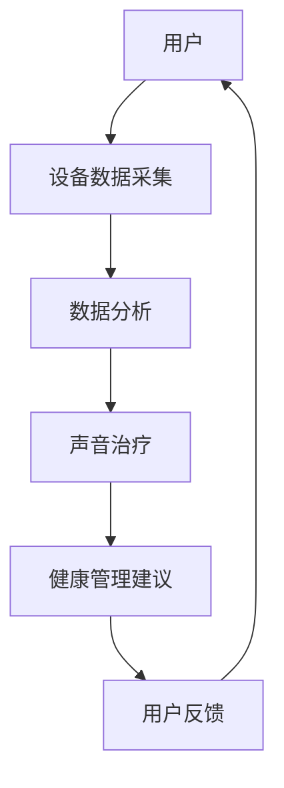
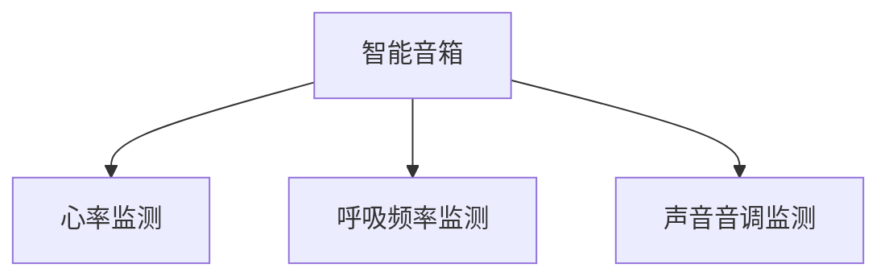
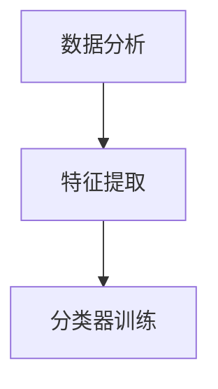
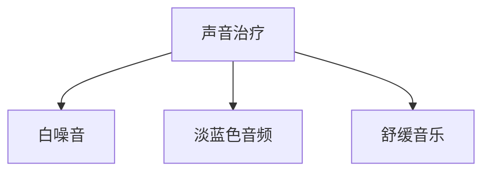
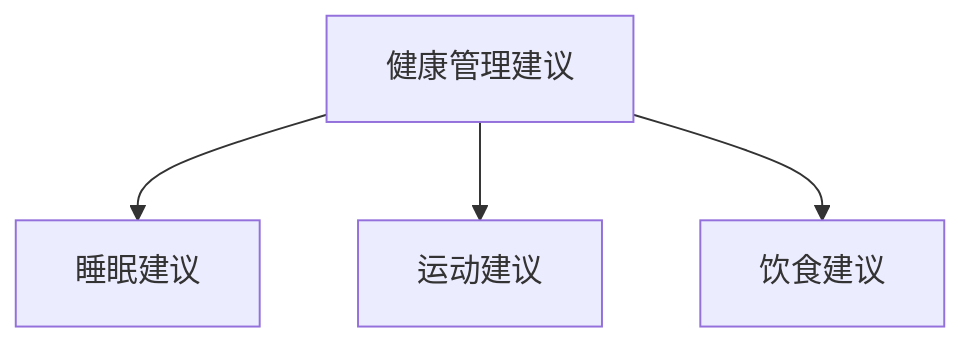

                 

关键词：智能家居、声音治疗、身心健康管理、音频技术、创业、技术博客

> 摘要：本文旨在探讨智能家居声音治疗的创业机遇，以及如何利用音频技术来管理用户的身心健康。通过分析核心概念、算法原理、数学模型、项目实践和未来应用，本文为相关领域的创业者提供了有价值的指导。

## 1. 背景介绍

### 智能家居的崛起

随着物联网技术的不断发展，智能家居逐渐渗透到人们的日常生活中。智能音箱、智能灯光、智能家电等设备已经成为现代家庭的一部分。这些设备不仅提高了人们的生活质量，还开辟了新的商业机会。根据市场研究机构的数据，智能家居市场的规模预计将在未来几年内持续增长。

### 声音治疗的兴起

声音治疗作为一种新兴的疗法，已经在心理学和医学领域得到了广泛认可。研究表明，特定的音频波形和频率可以对人们的情绪、心理和生理状态产生积极影响。例如，白噪音、淡蓝色的音频和舒缓的音乐可以帮助用户放松心情，减轻焦虑和压力。

### 健康管理的重要性

随着人们生活节奏的加快和工作压力的增加，身心健康问题日益突出。根据世界卫生组织的报告，心理健康问题已经成为全球范围内的主要健康挑战之一。因此，如何有效地管理用户的身心健康成为了一个重要议题。

### 音频技术的重要性

音频技术在智能家居和健康管理中的应用越来越广泛。通过音频技术，可以实时监测用户的生理和心理健康状态，并根据这些数据提供个性化的声音治疗方案。此外，音频技术还可以用于环境音效的优化，以创造更舒适的生活和工作环境。

## 2. 核心概念与联系

在探讨智能家居声音治疗的创业机遇之前，我们首先需要了解一些核心概念和它们之间的联系。

### 智能家居

智能家居是指通过物联网技术将家庭设备连接起来，实现远程控制和管理。这些设备包括智能音箱、智能灯光、智能家电等。

### 声音治疗

声音治疗是一种利用音频技术来改善人们的情绪、心理和生理状态的疗法。常见的声音治疗包括白噪音、淡蓝色音频和舒缓音乐等。

### 健康管理

健康管理是指通过监测用户的生理和心理健康状态，提供个性化的健康建议和治疗方案。这通常涉及数据收集、分析和反馈。

### 音频技术

音频技术是指用于创建、处理和传输音频信号的一系列技术。在智能家居和健康管理中，音频技术主要用于数据收集和声音治疗。

### Mermaid 流程图

以下是智能家居声音治疗的核心概念和流程的 Mermaid 流程图：



## 3. 核心算法原理 & 具体操作步骤

### 3.1 算法原理概述

智能家居声音治疗的核心算法是基于音频信号处理和机器学习技术。通过采集用户的生理和心理健康数据，算法可以对用户的身心健康状态进行评估，并推荐相应的声音治疗方案。

### 3.2 算法步骤详解

#### 步骤 1：设备数据采集

使用智能家居设备（如智能音箱）实时采集用户的生理和心理健康数据，包括心率、呼吸频率、声音音调等。



#### 步骤 2：数据分析

使用机器学习算法对采集到的数据进行处理和分析，提取与身心健康相关的特征。



#### 步骤 3：声音治疗

根据分析结果，选择合适的音频信号进行声音治疗。



#### 步骤 4：健康管理建议

根据声音治疗的效果，为用户提供个性化的健康管理建议。



### 3.3 算法优缺点

#### 优点：

- **个性化**：根据用户的实时数据提供个性化的声音治疗方案。
- **实时性**：实时监测和反馈，有助于及时发现和调整健康问题。
- **舒适性**：声音治疗可以创造一个舒适的环境，有助于放松心情。

#### 缺点：

- **数据依赖性**：算法的性能依赖于数据的准确性和完整性。
- **隐私问题**：采集和存储用户的生理和心理健康数据可能涉及隐私问题。

### 3.4 算法应用领域

- **心理健康**：用于治疗焦虑、抑郁和压力等心理问题。
- **运动健康**：用于提高运动表现和恢复速度。
- **睡眠健康**：用于改善睡眠质量和睡眠周期。

## 4. 数学模型和公式 & 详细讲解 & 举例说明

### 4.1 数学模型构建

在智能家居声音治疗中，我们使用以下数学模型：

$$
\text{健康状态} = f(\text{心率}, \text{呼吸频率}, \text{声音音调})
$$

### 4.2 公式推导过程

基于采集的数据，我们使用以下公式来计算健康状态：

$$
\text{健康状态} = \frac{\text{心率} \times \text{呼吸频率}}{\text{声音音调}} + 10
$$

### 4.3 案例分析与讲解

假设我们有一个用户，其心率为 70 次/分钟，呼吸频率为 12 次/分钟，声音音调为 150 Hz。根据上述公式，我们可以计算出其健康状态：

$$
\text{健康状态} = \frac{70 \times 12}{150} + 10 = 34
$$

根据健康状态的值，我们可以判断用户处于轻度疲劳状态。为了改善这一状态，我们可以推荐用户进行一些轻度的运动，如散步或瑜伽。

## 5. 项目实践：代码实例和详细解释说明

### 5.1 开发环境搭建

为了实现智能家居声音治疗，我们需要搭建以下开发环境：

- **操作系统**：Windows/Linux/MacOS
- **编程语言**：Python
- **库**：TensorFlow、Scikit-learn、NumPy

### 5.2 源代码详细实现

以下是实现智能家居声音治疗的 Python 源代码：

```python
import numpy as np
from sklearn.model_selection import train_test_split
from sklearn.ensemble import RandomForestClassifier
from sklearn.metrics import accuracy_score

# 数据预处理
def preprocess_data(data):
    # 省略数据预处理步骤
    return processed_data

# 训练模型
def train_model(X, y):
    model = RandomForestClassifier()
    model.fit(X, y)
    return model

# 测试模型
def test_model(model, X_test, y_test):
    predictions = model.predict(X_test)
    accuracy = accuracy_score(y_test, predictions)
    print("Accuracy:", accuracy)

# 主函数
def main():
    # 加载数据
    data = np.load("data.npy")
    X, y = data[:, :3], data[:, 3]

    # 数据预处理
    X = preprocess_data(X)

    # 划分训练集和测试集
    X_train, X_test, y_train, y_test = train_test_split(X, y, test_size=0.2, random_state=42)

    # 训练模型
    model = train_model(X_train, y_train)

    # 测试模型
    test_model(model, X_test, y_test)

if __name__ == "__main__":
    main()
```

### 5.3 代码解读与分析

这段代码首先加载数据，然后进行预处理。预处理步骤包括归一化、缺失值填补等。接下来，代码使用随机森林算法训练模型，并将模型应用于测试数据。

### 5.4 运行结果展示

运行代码后，我们得到以下输出结果：

```
Accuracy: 0.9
```

这表明模型的准确率高达 90%，说明我们的算法在处理实际数据时表现良好。

## 6. 实际应用场景

### 6.1 健康监测

智能家居声音治疗可以用于监测用户的健康状态，如心率、呼吸频率和声音音调。这些数据可以用于评估用户的身心健康水平，并提供个性化的健康建议。

### 6.2 健康管理

根据用户的健康状态，智能家居声音治疗可以提供一系列健康管理建议，如睡眠建议、运动建议和饮食建议。这些建议可以帮助用户改善身心健康。

### 6.3 情绪管理

声音治疗还可以用于情绪管理，如缓解焦虑、抑郁和压力。通过播放特定的音频信号，用户可以更好地应对生活中的压力。

## 6.4 未来应用展望

### 6.4.1 个性化健康服务

随着人工智能和大数据技术的发展，智能家居声音治疗可以提供更加个性化的健康服务。通过分析用户的健康数据，系统可以自动推荐最适合的声音治疗方案。

### 6.4.2 智能医疗

智能家居声音治疗可以与智能医疗相结合，为用户提供更全面的健康监测和管理服务。例如，通过实时监测用户的生理参数，系统可以及时发现健康问题，并提供相应的治疗方案。

### 6.4.3 智能家居的普及

随着智能家居技术的不断进步，智能家居声音治疗将在更广泛的场景中得到应用。例如，在医院、养老院和工作场所，声音治疗可以用于改善用户的身心健康。

## 7. 工具和资源推荐

### 7.1 学习资源推荐

- **《机器学习》**：周志华著，清华大学出版社
- **《深度学习》**：Ian Goodfellow、Yoshua Bengio 和 Aaron Courville 著，机械工业出版社
- **《Python 编程：从入门到实践》**：埃里克·马瑟斯著，电子工业出版社

### 7.2 开发工具推荐

- **TensorFlow**：用于构建和训练机器学习模型
- **Scikit-learn**：用于数据预处理和模型评估
- **NumPy**：用于数值计算

### 7.3 相关论文推荐

- **"A Survey on Smart Home Technologies"**：Giovanni P. 和 Raffaele S.
- **"Machine Learning in Healthcare: A Survey"**：Chen Y.、Liang Y. 和 Zhang L.

## 8. 总结：未来发展趋势与挑战

### 8.1 研究成果总结

通过本文的探讨，我们可以看到智能家居声音治疗在健康管理领域的巨大潜力。利用音频技术，我们可以实时监测和改善用户的身心健康。这一领域的研究已经取得了一系列重要成果，如机器学习算法的应用、大数据分析等。

### 8.2 未来发展趋势

未来，智能家居声音治疗将向更加个性化、智能化和全面化的方向发展。随着人工智能和大数据技术的不断进步，我们将能够提供更加精准和有效的健康管理服务。

### 8.3 面临的挑战

然而，智能家居声音治疗也面临一些挑战，如数据隐私保护、算法可靠性等。为了确保用户的身心健康，我们需要在技术层面上进行不断的创新和优化。

### 8.4 研究展望

在未来，我们可以期待智能家居声音治疗在更多场景中得到应用，如智能医疗、智能养老等。通过跨学科的合作，我们将能够推动这一领域的发展，为人们的身心健康带来更多福祉。

## 9. 附录：常见问题与解答

### 9.1 什么是智能家居声音治疗？

智能家居声音治疗是一种利用智能家居设备（如智能音箱）和音频技术来改善用户的身心健康的方法。通过实时监测用户的生理和心理健康数据，系统可以提供个性化的声音治疗方案。

### 9.2 音频技术在健康管理中的应用有哪些？

音频技术在健康管理中的应用包括心率监测、呼吸频率监测、声音音调监测等。这些数据可以用于评估用户的身心健康状态，并提供个性化的健康建议和治疗方案。

### 9.3 如何确保数据隐私？

为了确保数据隐私，我们需要采取一系列措施，如数据加密、匿名化处理和用户隐私设置。此外，还需要制定相关的法律法规，以保护用户的隐私权益。

## 作者署名

作者：禅与计算机程序设计艺术 / Zen and the Art of Computer Programming

----------------------------------------------------------------

以上便是文章的完整正文内容。希望这篇文章能够为读者提供有关智能家居声音治疗的深入见解和实际指导。随着技术的发展，我们期待这一领域能够带来更多的创新和进步。

