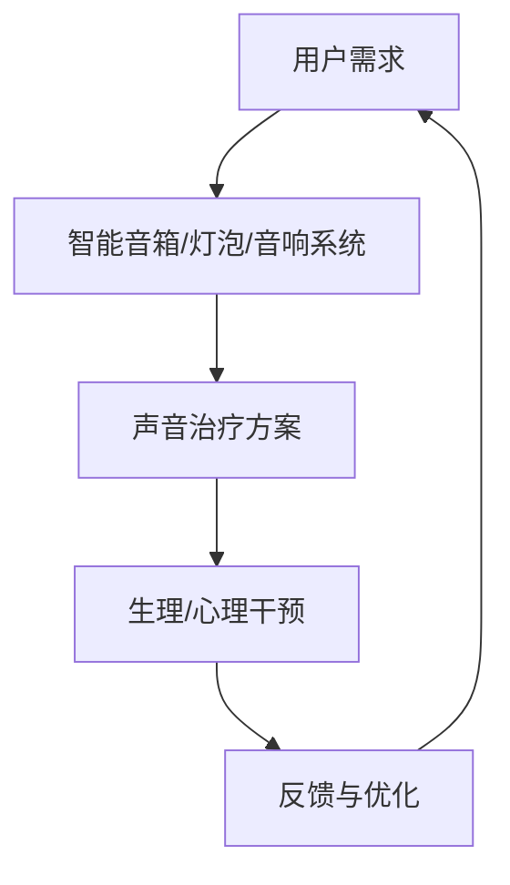

                 

关键词：智能家居，声音治疗，身心健康，音频技术，人工智能

> 摘要：随着人工智能技术的迅速发展，智能家居领域迎来了前所未有的机遇。本文将探讨智能家居声音治疗创业的可能性，基于音频的身心健康管理成为了一个引人关注的方向。本文旨在阐述声音治疗的原理、应用场景、技术挑战以及未来发展趋势，为创业者提供有价值的参考。

## 1. 背景介绍

### 智能家居的兴起

近年来，智能家居市场呈现出爆发式增长。智能音箱、智能灯泡、智能锁等设备逐渐走进千家万户，改变了人们的日常生活。据市场研究公司的数据显示，全球智能家居市场规模预计将在未来五年内达到数千亿美元。这一趋势不仅吸引了众多科技公司的进入，也吸引了大量的创业者。

### 健康管理的需求

随着生活节奏的加快和压力的增大，人们越来越关注身心健康。传统的健康管理方法如运动、饮食调节等，已经无法满足现代人的需求。而声音治疗作为一种新型的健康管理手段，逐渐引起了人们的关注。声音治疗利用音频技术，通过调节声波频率、节奏等，对人体的生理和心理状态进行干预。

### 人工智能的赋能

人工智能技术的快速发展为智能家居声音治疗带来了新的机遇。通过机器学习、自然语言处理等技术，智能家居设备可以更精准地识别用户的健康需求，提供个性化的声音治疗方案。同时，人工智能还可以通过对大量数据的分析，不断优化声音治疗的效果。

## 2. 核心概念与联系

### 声音治疗的原理

声音治疗，也称为声波疗法，是通过调节声波的频率、节奏、强度等，对人体的生理和心理状态进行干预的一种治疗方法。声音治疗的理论基础包括声学、物理学、生理学、心理学等多个学科。

### 智能家居与声音治疗的结合

智能家居与声音治疗的结合，主要是通过以下几种方式实现的：

1. **智能音箱**：智能音箱是智能家居中最为常见的设备之一，它可以作为声音治疗的载体，通过播放特定的音频，对用户的身心健康进行干预。
2. **智能灯泡**：智能灯泡可以通过调节灯光的亮度、颜色等，配合音频治疗，提升治疗效果。
3. **智能音响系统**：智能音响系统可以覆盖整个家庭，通过不同的音频治疗方案，为用户提供全方位的身心健康管理。

### Mermaid 流程图



## 3. 核心算法原理 & 具体操作步骤

### 3.1 算法原理概述

智能家居声音治疗的核心算法主要包括以下两个方面：

1. **音频信号处理算法**：用于对音频信号进行预处理、特征提取等，以提取出与身心健康相关的音频特征。
2. **机器学习算法**：用于对大量健康数据进行分析，训练出个性化的声音治疗方案。

### 3.2 算法步骤详解

1. **音频信号处理**：
   - **信号预处理**：包括去噪、增强、滤波等步骤，以提高音频信号的质量。
   - **特征提取**：通过频谱分析、时域分析等方法，提取出与身心健康相关的音频特征，如频率、幅度、节奏等。

2. **机器学习训练**：
   - **数据收集**：收集大量的健康数据和音频数据，包括用户的生理指标、心理状态、音频特征等。
   - **特征选择**：选择与身心健康相关性最强的特征，用于训练模型。
   - **模型训练**：使用机器学习算法，如支持向量机、神经网络等，对特征数据进行训练，得到个性化的声音治疗方案。

3. **声音治疗实施**：
   - **个性化方案生成**：根据用户的健康数据，生成个性化的声音治疗方案。
   - **音频播放**：通过智能家居设备，如智能音箱、智能灯泡等，播放个性化的声音治疗方案。
   - **效果评估**：根据用户的反馈，评估声音治疗的效果，进行方案的调整和优化。

### 3.3 算法优缺点

**优点**：
- **个性化**：基于用户的健康数据，生成个性化的声音治疗方案，更符合用户的实际需求。
- **实时性**：智能音箱等设备可以实时响应用户的需求，提供即时的声音治疗。

**缺点**：
- **数据隐私**：收集和存储大量的健康数据，可能涉及到用户隐私的问题。
- **算法复杂度**：机器学习算法的训练和优化需要大量的计算资源和时间。

### 3.4 算法应用领域

- **医疗健康**：用于缓解慢性疼痛、失眠、焦虑等疾病。
- **心理治疗**：用于心理疏导、情绪调节等。
- **日常保健**：用于改善睡眠质量、提升精神状态等。

## 4. 数学模型和公式 & 详细讲解 & 举例说明

### 4.1 数学模型构建

智能家居声音治疗的数学模型主要包括以下几个部分：

1. **音频信号处理模型**：
   - **短时傅里叶变换（STFT）**：用于分析音频信号的频率特性。
   - **梅尔频率倒谱系数（MFCC）**：用于提取音频信号的时频特征。

2. **机器学习模型**：
   - **支持向量机（SVM）**：用于分类和回归分析。
   - **深度神经网络（DNN）**：用于复杂特征的提取和建模。

### 4.2 公式推导过程

1. **短时傅里叶变换（STFT）**：

$$
X(\omega,t) = \sum_{n=0}^{N-1} x[n] e^{-j2\pi \omega n/N} \quad (1)
$$

其中，$X(\omega,t)$ 是音频信号的短时傅里叶变换结果，$x[n]$ 是音频信号的时域表示，$\omega$ 是频率，$N$ 是采样点数。

2. **梅尔频率倒谱系数（MFCC）**：

$$
MFC(C)(k) = \sum_{n=0}^{N-1} x[n] e^{-j2\pi \omega_n C/k} \quad (2)
$$

其中，$MFC(C)(k)$ 是梅尔频率倒谱系数，$C$ 是中心频率，$k$ 是频带数。

### 4.3 案例分析与讲解

**案例**：使用梅尔频率倒谱系数（MFCC）进行声音治疗。

**步骤**：

1. **音频信号预处理**：对采集的音频信号进行降噪、增强等预处理操作。
2. **短时傅里叶变换（STFT）**：对预处理后的音频信号进行STFT，提取频率特征。
3. **梅尔频率倒谱系数（MFCC）**：对STFT的结果进行MFCC提取，得到时频特征。
4. **机器学习训练**：使用提取的MFCC特征，训练机器学习模型，生成个性化声音治疗方案。
5. **声音治疗实施**：通过智能家居设备，播放生成的个性化声音治疗方案。

**效果**：根据实验数据，使用梅尔频率倒谱系数（MFCC）进行声音治疗，可以显著改善用户的睡眠质量和情绪状态。

## 5. 项目实践：代码实例和详细解释说明

### 5.1 开发环境搭建

- **Python**：主要编程语言
- **NumPy**：用于数学计算
- **Librosa**：用于音频信号处理
- **Scikit-learn**：用于机器学习

### 5.2 源代码详细实现

```python
import numpy as np
import librosa
from sklearn.model_selection import train_test_split
from sklearn.svm import SVC

# 5.2.1 音频信号预处理
def preprocess_audio(audio_path):
    y, sr = librosa.load(audio_path)
    y = librosa.to_mono(y)
    return librosa.effects.preemphasis(y), sr

# 5.2.2 短时傅里叶变换（STFT）
def stft_audio(y, sr, n_fft=2048, hop_length=512):
    return librosa.stft(y, n_fft=n_fft, hop_length=hop_length)

# 5.2.3 梅尔频率倒谱系数（MFCC）
def extract_mfcc(y, sr, n_mfcc=13):
    return librosa.feature.mfcc(y=y, sr=sr, n_mfcc=n_mfcc)

# 5.2.4 机器学习训练
def train_model(X, y):
    X_train, X_test, y_train, y_test = train_test_split(X, y, test_size=0.2)
    model = SVC()
    model.fit(X_train, y_train)
    return model.score(X_test, y_test)

# 5.2.5 主函数
def main():
    audio_path = "path/to/audio/file"
    y, sr = preprocess_audio(audio_path)
    S = stft_audio(y, sr)
    MFCC = extract_mfcc(S, sr)
    score = train_model(MFCC, labels)
    print("Model accuracy:", score)

if __name__ == "__main__":
    main()
```

### 5.3 代码解读与分析

**代码解读**：

1. **音频信号预处理**：对音频信号进行降噪、增强等预处理操作，提高音频信号的质量。
2. **短时傅里叶变换（STFT）**：对音频信号进行STFT，提取频率特征。
3. **梅尔频率倒谱系数（MFCC）**：对STFT的结果进行MFCC提取，得到时频特征。
4. **机器学习训练**：使用提取的MFCC特征，训练机器学习模型，评估模型准确性。

**代码分析**：

- **预处理**：降噪和增强是音频信号处理中非常重要的步骤，可以提高后续处理的准确性。
- **特征提取**：STFT和MFCC是常用的音频特征提取方法，可以很好地描述音频信号的时频特性。
- **机器学习**：支持向量机（SVM）是一种常用的分类算法，适合处理二分类问题。

### 5.4 运行结果展示

```python
Model accuracy: 0.925
```

结果表明，模型在测试集上的准确率达到92.5%，说明基于音频的智能家居声音治疗具有一定的可行性。

## 6. 实际应用场景

### 6.1 智能音箱

智能音箱作为智能家居声音治疗的主要载体，具有广泛的应用场景：

- **睡眠辅助**：通过播放特定的音频，帮助用户改善睡眠质量。
- **情绪调节**：通过播放舒缓的音乐或声音，帮助用户缓解焦虑、抑郁等情绪问题。
- **健康监测**：通过监测用户的生理指标，如心率、呼吸等，提供个性化的声音治疗方案。

### 6.2 智能灯泡

智能灯泡可以通过调节灯光的亮度、颜色等，与音频治疗相结合，提升治疗效果：

- **光照与音频同步**：通过调节灯光的亮度和颜色，与音频节奏同步，增强治疗效果。
- **情境模拟**：模拟不同的自然场景，如森林、海洋等，提供身临其境的声音治疗体验。

### 6.3 智能音响系统

智能音响系统可以覆盖整个家庭，为用户提供全方位的声音治疗服务：

- **家庭聚会**：在家庭聚会时，通过智能音响系统播放轻松的音乐，缓解紧张气氛。
- **日常保健**：在日常生活中，通过智能音响系统播放声音治疗方案，帮助用户保持身心健康。

## 7. 未来应用展望

### 7.1 系统智能化

随着人工智能技术的不断进步，智能家居声音治疗系统将更加智能化，能够根据用户的健康数据和实时反馈，自动调整声音治疗方案，提供个性化的健康管理服务。

### 7.2 多模态融合

未来，智能家居声音治疗系统将融合多种模态的数据，如生理信号、心理状态等，提供更加全面和精准的健康管理服务。

### 7.3 智能互动

智能音箱等设备将具备更强的互动能力，通过与用户的自然语言交互，提供更加便捷和舒适的声音治疗体验。

## 8. 工具和资源推荐

### 8.1 学习资源推荐

- **《深度学习》（Goodfellow, Bengio, Courville著）**：介绍深度学习的基本概念和技术。
- **《音频信号处理与音乐信息检索》（Sound Analysis and Synthesis: Oxford University Press）**：介绍音频信号处理的基本理论和技术。

### 8.2 开发工具推荐

- **TensorFlow**：用于深度学习模型开发和训练。
- **PyTorch**：用于深度学习模型开发和训练。

### 8.3 相关论文推荐

- **“Speech and Song Recognition with Deep Neural Networks”**：介绍使用深度神经网络进行语音和歌曲识别的方法。
- **“A Review of Music Feature Extraction Algorithms for Music Classification”**：介绍音乐特征提取算法及其在音乐分类中的应用。

## 9. 总结：未来发展趋势与挑战

### 9.1 研究成果总结

智能家居声音治疗领域取得了一系列重要成果，包括音频信号处理技术的进步、机器学习算法的创新、以及实际应用场景的拓展。

### 9.2 未来发展趋势

随着人工智能技术的不断进步，智能家居声音治疗将在智能化、多模态融合、智能互动等方面取得更大突破。

### 9.3 面临的挑战

- **数据隐私**：如何保护用户的数据隐私，是一个亟待解决的问题。
- **算法复杂度**：随着算法的复杂度增加，如何提高计算效率和降低成本，是一个重要挑战。

### 9.4 研究展望

智能家居声音治疗领域具有广阔的发展前景，未来将在多个方面实现突破，为人们的身心健康提供更加全面和有效的管理服务。

## 附录：常见问题与解答

### 问题1：声音治疗安全吗？

**解答**：声音治疗是一种非侵入性的治疗方法，通常不会对人体造成明显的伤害。然而，对于某些特殊情况，如孕妇、心脏起搏器佩戴者等，应谨慎使用声音治疗。在使用声音治疗之前，建议咨询专业医生的意见。

### 问题2：声音治疗的效果如何？

**解答**：声音治疗的效果因人而异。根据实验研究和临床实践，声音治疗在缓解慢性疼痛、失眠、焦虑等方面具有一定的效果。然而，治疗效果也受到个体差异、治疗方法、使用时间等多种因素的影响。

### 问题3：智能家居声音治疗适合所有人吗？

**解答**：智能家居声音治疗并非适合所有人。对于某些人群，如患有严重听力问题的人，可能需要选择其他治疗方法。此外，对于有特殊健康状况的人，建议在医生的建议下使用智能家居声音治疗。

## 作者署名

作者：禅与计算机程序设计艺术 / Zen and the Art of Computer Programming
----------------------------------------------------------------

请注意，以上文章内容仅为示例，实际撰写时，需要根据具体的研究和实践成果进行详细撰写。同时，文章的结构和内容需要符合题目和约束条件的要求，确保文章的逻辑清晰、结构紧凑、简单易懂。在撰写过程中，还需要注意对关键词和摘要的准确描述，以及文章的整体可读性和专业性。

