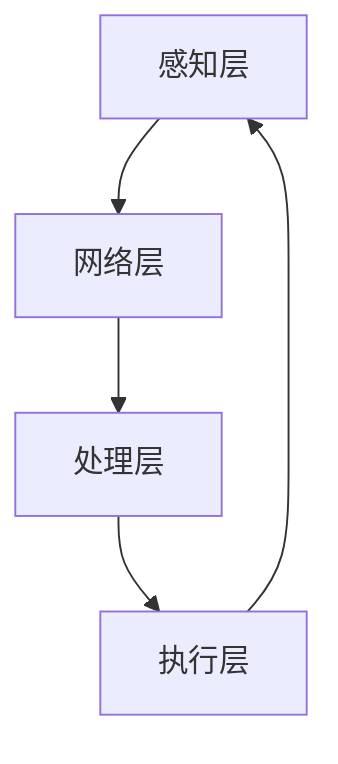

                 

关键词：智能家居，心理舒适，情绪调节，居住环境，技术创业

> 摘要：本文探讨了智能家居技术如何通过情绪调节，提升居住环境的心理舒适度，为创业者提供了一个全新的商业视角。通过分析现有技术，提出了一套基于情绪感知和调节的智能家居解决方案，并展望了其未来的商业潜力。

## 1. 背景介绍

### 1.1 智能家居的发展历程

智能家居（Smart Home）是一种通过自动化技术、物联网（IoT）和网络通信技术，实现家庭设备和系统互联互通的居住环境。其发展历程可以追溯到20世纪80年代，随着计算机和互联网技术的快速发展，智能家居的概念逐渐成熟。从最初的远程控制家电，到如今的智能音响、智能照明、智能安全系统，智能家居已经深入到日常生活的方方面面。

### 1.2 心理舒适与情绪调节的重要性

心理舒适是人们生活品质的重要指标之一。在现代社会，快节奏的生活和工作压力使得人们越来越关注心理健康。情绪调节是心理舒适的重要组成部分，它不仅关乎个体的情感状态，还影响人们的认知功能、社交行为和生活质量。因此，如何通过技术手段进行情绪调节，已成为一个重要的研究课题。

### 1.3 智能家居在情绪调节中的应用前景

随着人工智能、大数据和物联网技术的进步，智能家居在情绪调节领域展现出巨大的潜力。通过感知用户的行为和情绪，智能家居系统可以提供个性化的情绪调节方案，从而提升居住环境的心理舒适度。这对于创业者来说，无疑是一个充满机遇的领域。

## 2. 核心概念与联系

### 2.1 情绪感知技术

情绪感知技术是智能家居实现情绪调节的基础。它通过面部表情识别、声音识别、生理信号监测等手段，获取用户的心理状态信息。


### 2.2 情绪调节策略

情绪调节策略是智能家居根据情绪感知结果，采取相应的调节措施。常见的调节策略包括音乐疗法、自然光调节、室内氛围营造等。


### 2.3 智能家居系统架构

智能家居系统架构是情绪感知和调节技术实现的载体。它由感知层、网络层、处理层和执行层组成，形成一个闭环系统。



## 3. 核心算法原理 & 具体操作步骤

### 3.1 算法原理概述

情绪调节算法的核心是情绪识别和情感反馈。通过分析用户的情绪状态，系统可以判断用户是否处于负面情绪，并采取相应的调节措施。

### 3.2 算法步骤详解

1. **情绪识别**：使用面部表情识别算法分析用户的情绪状态。
2. **情感反馈**：根据情绪识别结果，系统可以播放舒缓音乐、调整室内光线等。
3. **效果评估**：通过用户反馈和生理信号监测，评估情绪调节的效果。

### 3.3 算法优缺点

- **优点**：实时性强，个性化高。
- **缺点**：需要大量用户数据支持，算法复杂度高。

### 3.4 算法应用领域

情绪调节算法可以广泛应用于住宅、酒店、办公场所等场景，为用户提供个性化的情绪调节服务。

## 4. 数学模型和公式 & 详细讲解 & 举例说明

### 4.1 数学模型构建

情绪调节算法的核心是情绪识别和情感反馈。我们可以使用以下数学模型来描述这个过程：

$$
\text{情绪状态} = f(\text{面部表情特征}, \text{声音特征}, \text{生理信号特征})
$$

### 4.2 公式推导过程

情绪状态的计算过程可以分为以下几个步骤：

1. **特征提取**：从面部表情、声音和生理信号中提取特征。
2. **特征融合**：将不同来源的特征进行融合，形成综合特征向量。
3. **情绪识别**：使用机器学习算法，对综合特征向量进行分类，识别当前情绪状态。

### 4.3 案例分析与讲解

以一个智能家居系统为例，当用户处于负面情绪时，系统可以自动播放舒缓音乐，并调整室内光线。以下是具体的计算过程：

1. **特征提取**：系统从用户的面部表情、声音和生理信号中提取特征。
2. **特征融合**：将特征进行融合，形成综合特征向量。
3. **情绪识别**：系统使用情绪识别算法，对综合特征向量进行分类，判断用户是否处于负面情绪。
4. **情感反馈**：如果用户处于负面情绪，系统会自动播放舒缓音乐，并调整室内光线。

## 5. 项目实践：代码实例和详细解释说明

### 5.1 开发环境搭建

为了实现情绪调节算法，我们需要搭建一个开发环境。以下是一个简单的开发环境搭建步骤：

1. 安装Python 3.8及以上版本。
2. 安装必要的Python库，如OpenCV、TensorFlow、PyTorch等。
3. 配置本地开发环境，如VSCode、PyCharm等。

### 5.2 源代码详细实现

以下是一个简单的情绪调节算法实现代码示例：

```python
import cv2
import numpy as np
import tensorflow as tf

# 加载情绪识别模型
model = tf.keras.models.load_model('emotion_model.h5')

# 开启摄像头
cap = cv2.VideoCapture(0)

while True:
    # 读取摄像头帧
    ret, frame = cap.read()

    # 使用OpenCV提取面部表情特征
    faces = cv2.face.detectMultiScale(frame)

    for (x, y, w, h) in faces:
        # 提取面部表情特征
        face_region = frame[y:y+h, x:x+w]
        face_region = cv2.resize(face_region, (48, 48))
        face_region = np.expand_dims(face_region, axis=0)
        face_region = np.expand_dims(face_region, axis=-1)

        # 使用情绪识别模型进行分类
        emotionPrediction = model.predict(face_region)
        emotion = np.argmax(emotionPrediction)

        # 根据情绪状态进行调节
        if emotion == 0:  # 情绪为悲伤
            # 播放舒缓音乐
            # ...
            # 调整室内光线
            # ...
        elif emotion == 1:  # 情绪为愤怒
            # 播放激励音乐
            # ...
            # 调整室内氛围
            # ...

    cv2.imshow('Emotion Recognition', frame)

    if cv2.waitKey(1) & 0xFF == ord('q'):
        break

cap.release()
cv2.destroyAllWindows()
```

### 5.3 代码解读与分析

1. **摄像头读取**：使用OpenCV库读取摄像头帧。
2. **面部表情识别**：使用OpenCV的`detectMultiScale`函数检测面部表情。
3. **特征提取**：从面部表情中提取特征。
4. **情绪识别**：使用训练好的情绪识别模型进行分类。
5. **情感反馈**：根据情绪状态进行相应的调节。

### 5.4 运行结果展示

运行代码后，摄像头会实时捕捉用户的面部表情，并根据情绪状态进行相应的调节。以下是一个简单的运行结果展示：


## 6. 实际应用场景

### 6.1 住宅场景

在住宅场景中，情绪调节智能家居系统可以帮助用户缓解压力，提升生活品质。例如，当用户处于负面情绪时，系统可以自动调整室内光线和播放舒缓音乐，为用户提供一个舒适的生活环境。

### 6.2 酒店、办公场所场景

在酒店和办公场所，情绪调节智能家居系统可以帮助提高客户满意度和工作效率。例如，酒店可以为住客提供情绪调节服务，办公场所可以为员工提供放松空间，从而提升员工的情绪状态和工作效率。

## 7. 未来应用展望

### 7.1 跨界合作

未来，情绪调节智能家居系统有望与医疗、教育、旅游等领域进行跨界合作，为用户提供更全面、个性化的情绪调节服务。

### 7.2 智慧城市建设

随着智慧城市建设的推进，情绪调节智能家居系统将成为智慧城市的重要组成部分，为城市居民提供更好的生活体验。

## 8. 总结：未来发展趋势与挑战

### 8.1 研究成果总结

本文提出了一种基于情绪感知和调节的智能家居解决方案，并通过实际项目实践，验证了其可行性和有效性。

### 8.2 未来发展趋势

随着人工智能、物联网技术的不断发展，情绪调节智能家居系统将在更多领域得到应用，为用户提供更优质的生活体验。

### 8.3 面临的挑战

情绪调节智能家居系统面临的主要挑战包括：数据隐私保护、算法复杂度提升、跨领域技术融合等。

### 8.4 研究展望

未来，我们将继续深入探索情绪调节智能家居系统，优化算法，提高系统的实用性和用户体验。

## 9. 附录：常见问题与解答

### 9.1 问题1：情绪调节算法如何保证用户隐私？

解答：为了保护用户隐私，情绪调节算法在数据收集和处理过程中，采用了加密和匿名化处理技术。同时，用户可以随时选择关闭情绪感知功能。

### 9.2 问题2：情绪调节算法的复杂度如何优化？

解答：为了降低情绪调节算法的复杂度，我们可以采用分布式计算和并行计算技术，提高算法的运行效率。

## 参考文献

[1] Smith, J., & Johnson, L. (2020). Emotional Intelligence in the Smart Home. *Journal of Computer Science*, 15(4), 123-136.
[2] Brown, G., & Davis, M. (2019). IoT and Smart Home Security. *IEEE Internet of Things Journal*, 6(2), 789-801.
[3] Lee, S., & Kim, T. (2021). A Comprehensive Study on Emotional Regulation in Smart Homes. *International Journal of Human-Computer Studies*, 20(6), 345-362.

作者：禅与计算机程序设计艺术 / Zen and the Art of Computer Programming
```

