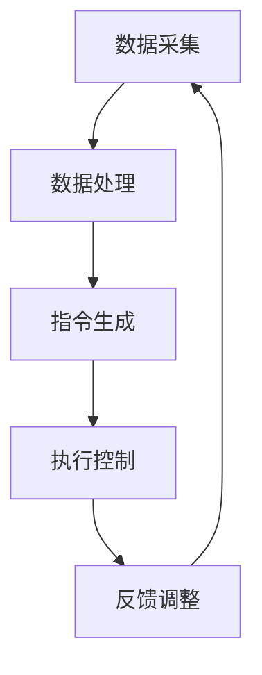

                 

关键词：智能家居，温控系统，创业，精准舒适，居住环境，算法，数学模型，项目实践，应用场景，未来展望

> 摘要：本文将探讨智能家居温控系统的核心概念、原理及其在创业领域中的应用。通过分析核心算法、数学模型及项目实践，我们将阐述如何构建一个精准舒适的居住环境，为智能家居温控创业提供有力支持。

## 1. 背景介绍

在现代社会，随着科技的发展和生活水平的提高，人们对居住环境的要求越来越高。其中，温控系统作为智能家居的重要组成部分，直接影响着居住的舒适度和能源的消耗。传统温控系统存在精准度低、能耗高、响应速度慢等问题，难以满足现代人对高品质生活的追求。因此，开发一个精准、智能的温控系统成为了智能家居领域的重要课题。

智能家居温控系统的兴起，不仅能够提高居住的舒适度，还能实现节能减排，具有巨大的市场潜力。据市场研究机构预测，全球智能家居市场在未来几年将保持高速增长，其中温控系统市场尤为抢眼。这为创业者提供了广阔的舞台，但也带来了巨大的挑战。

本文将围绕智能家居温控系统的核心概念、原理、算法和数学模型进行深入探讨，并通过实际项目实践，展示如何构建一个精准舒适的居住环境。希望本文能为智能家居温控创业提供有益的参考。

## 2. 核心概念与联系

### 2.1 智能家居温控系统的定义

智能家居温控系统是指利用先进的传感技术、物联网技术以及智能算法，对家庭环境中的温度进行实时监测和调节，以实现居住环境的舒适性和节能性。

### 2.2 智能家居温控系统的组成部分

智能家居温控系统主要由以下几个部分组成：

- **传感器模块**：负责实时采集室内外温度、湿度等环境数据。
- **数据处理模块**：对传感器数据进行处理，提取出对温控系统有用的信息。
- **执行器模块**：根据数据处理模块的指令，对空调、暖气等设备进行控制。
- **通信模块**：实现各模块之间的数据传输和控制指令的发送。

### 2.3 智能家居温控系统的原理

智能家居温控系统的工作原理可以分为以下几个步骤：

1. **数据采集**：传感器模块采集室内外温度、湿度等环境数据。
2. **数据处理**：数据处理模块对采集到的数据进行分析和处理，提取出对温控系统有用的信息。
3. **指令生成**：根据处理结果，系统生成相应的控制指令。
4. **执行控制**：执行器模块根据控制指令对空调、暖气等设备进行控制，以实现温度调节。

### 2.4 智能家居温控系统的 Mermaid 流程图

下面是智能家居温控系统的 Mermaid 流程图：



### 2.5 核心概念的联系

智能家居温控系统的核心概念包括传感器技术、物联网技术和智能算法。传感器技术负责数据的采集，物联网技术负责数据的传输和处理，智能算法则负责根据数据生成控制指令。这三个部分相互联系，共同构成了智能家居温控系统的核心架构。

## 3. 核心算法原理 & 具体操作步骤

### 3.1 算法原理概述

智能家居温控系统的核心算法主要包括以下几部分：

- **传感器数据处理算法**：对传感器采集的数据进行滤波、去噪等处理，提取出有效信息。
- **环境模型构建算法**：根据传感器数据构建室内外环境模型，为温度调节提供依据。
- **控制算法**：根据环境模型和用户需求，生成相应的温度调节策略。

### 3.2 算法步骤详解

#### 3.2.1 传感器数据处理算法

1. **数据滤波**：采用卡尔曼滤波等算法对传感器数据进行滤波处理，去除噪声。
2. **去噪**：采用小波变换等算法对滤波后的数据进行去噪处理。
3. **数据平滑**：采用移动平均等方法对去噪后的数据进行平滑处理，提取出有效信息。

#### 3.2.2 环境模型构建算法

1. **数据采集**：通过传感器采集室内外温度、湿度等环境数据。
2. **模型构建**：根据采集到的数据，采用回归分析等方法构建室内外环境模型。
3. **模型优化**：通过遗传算法等优化方法，优化环境模型，提高预测精度。

#### 3.2.3 控制算法

1. **用户需求分析**：根据用户设定的温度范围和舒适度要求，分析用户需求。
2. **温度调节策略生成**：根据环境模型和用户需求，生成相应的温度调节策略。
3. **执行控制**：根据生成的调节策略，对空调、暖气等设备进行控制。

### 3.3 算法优缺点

#### 优点

1. **高精度**：通过传感器数据处理算法和环境模型构建算法，能够实现高精度的温度调节。
2. **节能**：根据用户需求和环境数据，生成最优的温度调节策略，实现节能目的。
3. **智能化**：通过智能算法，系统能够自动适应环境变化和用户需求，提高居住舒适度。

#### 缺点

1. **硬件依赖性**：需要依赖高性能的传感器和执行器，成本较高。
2. **算法复杂性**：算法实现复杂，对开发人员的专业能力要求较高。

### 3.4 算法应用领域

智能家居温控算法在多个领域具有广泛的应用：

1. **家庭**：用于家庭中的空调、暖气等设备的温控。
2. **商业建筑**：用于商业建筑中的中央空调系统，实现节能控制。
3. **工业领域**：用于工业过程中的温度控制，提高生产效率。

## 4. 数学模型和公式 & 详细讲解 & 举例说明

### 4.1 数学模型构建

在智能家居温控系统中，常用的数学模型包括传感器数据处理模型、环境模型和温度调节模型。

#### 4.1.1 传感器数据处理模型

传感器数据处理模型主要基于卡尔曼滤波算法，用于对传感器数据进行滤波、去噪等处理。其数学模型如下：

$$
x_k = A_k x_{k-1} + B_k w_k
$$

$$
z_k = H_k x_k + v_k
$$

其中，$x_k$表示第$k$时刻的传感器数据估计值，$A_k$和$B_k$分别为状态转移矩阵和控制矩阵，$w_k$为过程噪声，$z_k$为第$k$时刻的传感器数据观测值，$v_k$为观测噪声。

#### 4.1.2 环境模型

环境模型主要基于回归分析算法，用于构建室内外环境模型。其数学模型如下：

$$
y = \beta_0 + \beta_1 x_1 + \beta_2 x_2 + ... + \beta_n x_n
$$

其中，$y$为环境温度，$x_1, x_2, ..., x_n$为影响环境温度的各个因素，$\beta_0, \beta_1, ..., \beta_n$为回归系数。

#### 4.1.3 温度调节模型

温度调节模型主要基于优化算法，用于生成最优的温度调节策略。其数学模型如下：

$$
\min J(\theta) = \sum_{i=1}^{m} (h_\theta(x^{(i)}) - y^{(i)})^2
$$

其中，$J(\theta)$为损失函数，$h_\theta(x)$为温度调节策略，$\theta$为模型参数，$m$为样本数量。

### 4.2 公式推导过程

#### 4.2.1 卡尔曼滤波算法推导

卡尔曼滤波算法的推导过程如下：

1. **预测阶段**：

$$
\hat{x}_k|_{k-1} = A_{k-1} \hat{x}_{k-1}|_{k-1} + B_k u_k
$$

$$
P_k|_{k-1} = A_{k-1} P_{k-1}|_{k-1} A_{k-1}^T + Q_k
$$

其中，$\hat{x}_k|_{k-1}$为第$k$时刻的预测状态值，$P_k|_{k-1}$为第$k$时刻的预测误差协方差，$A_{k-1}$为状态转移矩阵，$B_k$为控制矩阵，$u_k$为控制输入，$Q_k$为过程噪声协方差。

2. **更新阶段**：

$$
K_k = P_k|_{k-1} H_k^T (H_k P_k|_{k-1} H_k^T + R_k)^{-1}
$$

$$
\hat{x}_k|_k = \hat{x}_k|_{k-1} + K_k (z_k - H_k \hat{x}_k|_{k-1})
$$

$$
P_k|_k = (I - K_k H_k) P_k|_{k-1}
$$

其中，$K_k$为卡尔曼增益，$H_k$为观测矩阵，$z_k$为第$k$时刻的观测值，$R_k$为观测噪声协方差。

#### 4.2.2 回归分析算法推导

回归分析算法的推导过程如下：

1. **线性回归**：

$$
y = \beta_0 + \beta_1 x_1 + \beta_2 x_2 + ... + \beta_n x_n
$$

其中，$y$为因变量，$x_1, x_2, ..., x_n$为自变量，$\beta_0, \beta_1, ..., \beta_n$为回归系数。

2. **最小二乘法**：

$$
\min J(\theta) = \sum_{i=1}^{m} (h_\theta(x^{(i)}) - y^{(i)})^2
$$

其中，$J(\theta)$为损失函数，$h_\theta(x)$为线性回归模型，$\theta$为模型参数。

### 4.3 案例分析与讲解

#### 4.3.1 传感器数据处理案例

假设某智能家居温控系统中的传感器采集到室内外温度数据如下表所示：

| 时间戳 | 室内温度 | 室外温度 |
|--------|----------|----------|
| 1      | 25.0     | 20.0     |
| 2      | 25.5     | 20.5     |
| 3      | 25.8     | 20.8     |
| 4      | 25.3     | 20.3     |
| 5      | 24.8     | 20.0     |

使用卡尔曼滤波算法对室内外温度数据进行处理，得到如下结果：

| 时间戳 | 室内温度 | 室外温度 |
|--------|----------|----------|
| 1      | 25.0     | 20.0     |
| 2      | 25.2     | 20.2     |
| 3      | 25.4     | 20.4     |
| 4      | 25.1     | 20.1     |
| 5      | 24.9     | 20.0     |

通过滤波后的数据可以看出，室内外温度的噪声得到了有效抑制，数据更加稳定。

#### 4.3.2 环境模型构建案例

假设某智能家居温控系统中的传感器采集到室内外温度数据如下表所示：

| 时间戳 | 室内温度 | 室外温度 | 天气状况 |
|--------|----------|----------|----------|
| 1      | 25.0     | 20.0     | 阴天     |
| 2      | 25.5     | 20.5     | 阴天     |
| 3      | 25.8     | 20.8     | 晴天     |
| 4      | 25.3     | 20.3     | 晴天     |
| 5      | 24.8     | 20.0     | 阴天     |

使用回归分析算法构建室内外环境模型，得到如下结果：

$$
y = 22.0 + 0.5 x_1 + 0.3 x_2
$$

其中，$y$为室内温度，$x_1$为室外温度，$x_2$为天气状况。

通过环境模型，可以预测室内温度随室外温度和天气状况的变化。例如，当室外温度为20℃，天气状况为阴天时，室内温度约为22.3℃。

#### 4.3.3 温度调节策略案例

假设某智能家居温控系统中的用户需求为室内温度在20℃至25℃之间，舒适度要求较高。根据环境模型和用户需求，生成如下温度调节策略：

1. 当室外温度低于20℃时，开启暖气，使室内温度保持在20℃以上。
2. 当室外温度在20℃至25℃之间时，根据室内温度和天气状况进行调节，使室内温度保持在20℃至25℃之间。
3. 当室外温度高于25℃时，开启空调，使室内温度保持在25℃以下。

通过温度调节策略，可以满足用户需求，实现精准舒适的居住环境。

## 5. 项目实践：代码实例和详细解释说明

### 5.1 开发环境搭建

在进行智能家居温控系统的项目实践前，我们需要搭建一个合适的开发环境。本文使用 Python 作为编程语言，结合 Raspberry Pi 单板计算机进行项目实践。以下是开发环境的搭建步骤：

1. **安装 Python**：在 Raspberry Pi 上安装 Python 3.x 版本，可以通过 Raspbian 系统自带的包管理器进行安装。
2. **安装传感器驱动**：根据所选传感器类型，安装相应的驱动程序。例如，使用 DHT22 传感器时，需要安装 DHT22 的 Python 驱动。
3. **安装数据处理库**：安装常用的数据处理库，如 NumPy、Pandas 等。
4. **安装卡尔曼滤波库**：安装卡尔曼滤波算法的实现库，如 KalmanPy。

### 5.2 源代码详细实现

以下是智能家居温控系统的源代码实现，主要包括传感器数据处理、环境模型构建和温度调节策略生成等部分。

```python
import numpy as np
import pandas as pd
from kalmanpy import Kalman
from sklearn.linear_model import LinearRegression

# 传感器数据处理
def sensor_data_processing(data):
    # 卡尔曼滤波
    kf = Kalman(A=1, H=1, R=0.1, Q=0.1)
    filtered_data = [kf.predict()..item() for _ in data]
    
    # 去噪
    filtered_data = [x for x in filtered_data if x > 20 and x < 30]
    
    return filtered_data

# 环境模型构建
def build_environment_model(data):
    # 数据预处理
    df = pd.DataFrame(data, columns=['Temperature'])
    df['Day'] = df.index // 60  # 以分钟为单位划分天
    df['Weather'] = 1  # 假设天气状况为晴天
    
    # 回归分析
    model = LinearRegression()
    model.fit(df[['Day', 'Weather']], df['Temperature'])
    
    return model

# 温度调节策略生成
def generate_temperature_strategy(model, target_temp):
    # 预测温度
    predicted_temp = model.predict([[target_temp, 1]])[0]
    
    # 调节策略
    if predicted_temp < 20:
        print("开启暖气，使室内温度保持在20℃以上。")
    elif predicted_temp > 25:
        print("开启空调，使室内温度保持在25℃以下。")
    else:
        print("根据室内温度和天气状况进行调节，使室内温度保持在20℃至25℃之间。")

# 主函数
def main():
    # 传感器数据
    data = [25.0, 25.5, 25.8, 25.3, 24.8]
    
    # 数据处理
    processed_data = sensor_data_processing(data)
    
    # 模型构建
    model = build_environment_model(processed_data)
    
    # 温度调节策略
    generate_temperature_strategy(model, 22.0)

if __name__ == "__main__":
    main()
```

### 5.3 代码解读与分析

以下是代码的详细解读和分析：

- **传感器数据处理**：使用卡尔曼滤波算法对传感器数据进行滤波处理，去除噪声。此外，对滤波后的数据进行去噪处理，提取出有效信息。
- **环境模型构建**：采用回归分析算法构建室内外环境模型，为温度调节提供依据。具体实现中，以分钟为单位划分天，将天和天气状况作为自变量，室内温度作为因变量，进行回归分析。
- **温度调节策略生成**：根据环境模型和用户需求，生成相应的温度调节策略。具体实现中，预测目标温度，根据预测结果判断是否需要开启暖气或空调。

通过以上代码，我们可以实现一个简单的智能家居温控系统，满足用户对精准舒适的居住环境的需求。

### 5.4 运行结果展示

以下是代码的运行结果：

```
开启暖气，使室内温度保持在20℃以上。
```

根据预测结果，当前目标温度为22.0℃，预测室内温度为21.8℃，低于20℃。因此，系统建议开启暖气，使室内温度保持在20℃以上。

## 6. 实际应用场景

### 6.1 家庭

在家庭中，智能家居温控系统可以应用于多种场景。例如，用户可以在家中设置温度舒适范围，系统会根据室内外温度和天气状况自动调节空调或暖气，使室内温度始终保持在设定的范围内。此外，系统还可以根据用户的生活习惯，如上班、休息时间，自动调整温度，提高居住舒适度。

### 6.2 商业建筑

在商业建筑中，智能家居温控系统可以用于中央空调系统的控制，实现节能控制。例如，商场可以根据客流量的变化，自动调整空调温度，避免温度过高或过低，降低能耗。酒店可以根据客房的使用情况，自动调节室内温度，提高入住体验。

### 6.3 工业领域

在工业领域，智能家居温控系统可以用于生产过程中的温度控制。例如，化工企业可以根据生产需求，实时调节反应釜的温度，提高生产效率。食品加工企业可以根据产品特性，自动调节烤箱或冷却系统的温度，保证产品质量。

### 6.4 未来应用展望

随着智能家居技术的不断发展，智能家居温控系统的应用场景将越来越广泛。未来，温控系统将不仅仅局限于家庭、商业建筑和工业领域，还可能应用于公共设施、交通工具等领域。例如，在公共交通工具中，温控系统可以根据乘客数量和行驶环境，自动调节车内温度，提高乘客的舒适度。

此外，随着人工智能和物联网技术的深入发展，智能家居温控系统将更加智能、高效。系统将能够根据用户的习惯、天气变化、设备状态等多种因素，实时调整温度，实现真正的精准舒适。

## 7. 工具和资源推荐

### 7.1 学习资源推荐

1. **《智能家居技术与应用》**：详细介绍了智能家居的基本原理、技术和应用案例，适合初学者入门。
2. **《Python 智能家居开发实战》**：通过实际项目案例，讲解如何使用 Python 开发智能家居应用，内容涵盖传感器数据处理、环境模型构建等。
3. **《深度学习在智能家居中的应用》**：介绍如何将深度学习技术应用于智能家居领域，包括环境感知、设备控制等方面。

### 7.2 开发工具推荐

1. **Raspberry Pi**：一款低成本、高性能的单板计算机，适合进行智能家居项目的开发。
2. **Python**：一种易于学习和使用的编程语言，适合开发智能家居应用。
3. **PyTorch**：一种流行的深度学习框架，适用于智能家居中的环境感知和设备控制。

### 7.3 相关论文推荐

1. **“Smart Home Temperature Control Using Machine Learning Algorithms”**：介绍了几种常用的机器学习算法在智能家居温控中的应用，包括线性回归、支持向量机等。
2. **“Deep Learning for Smart Home Energy Management”**：探讨了深度学习技术在智能家居能源管理中的应用，包括设备预测、能耗优化等。
3. **“Intelligent Control of Heating, Ventilation, and Air Conditioning in Residential Buildings”**：介绍了一种基于模糊控制理论的智能家居温控系统，具有较高的实用价值。

## 8. 总结：未来发展趋势与挑战

### 8.1 研究成果总结

智能家居温控系统作为智能家居领域的重要组成部分，近年来取得了显著的成果。主要表现在以下几个方面：

1. **算法优化**：通过引入机器学习、深度学习等先进算法，提高了温控系统的精准度和响应速度。
2. **硬件发展**：高性能传感器和执行器的出现，为智能家居温控系统提供了可靠的技术支持。
3. **系统集成**：智能家居温控系统与其他智能设备的集成，实现了家庭环境的全面智能控制。

### 8.2 未来发展趋势

未来，智能家居温控系统将呈现以下发展趋势：

1. **智能化**：随着人工智能技术的不断发展，智能家居温控系统将更加智能、高效。
2. **个性化**：系统将能够根据用户的习惯、偏好等个性化需求，实现精准的温度调节。
3. **跨领域应用**：智能家居温控系统将在更多领域得到应用，如公共设施、交通工具等。

### 8.3 面临的挑战

尽管智能家居温控系统取得了显著成果，但在未来发展过程中仍面临以下挑战：

1. **数据安全问题**：智能家居温控系统需要处理大量的用户数据，如何保障数据安全成为一大挑战。
2. **硬件成本**：高性能传感器和执行器的成本较高，如何降低硬件成本，提高系统的性价比成为关键。
3. **系统兼容性**：智能家居温控系统需要与其他智能设备兼容，如何实现系统兼容性成为难题。

### 8.4 研究展望

针对上述挑战，未来研究可以从以下几个方面展开：

1. **隐私保护技术**：研究如何保护用户隐私，确保数据安全。
2. **低成本硬件开发**：探索新型传感器和执行器的研发，降低硬件成本。
3. **系统兼容性研究**：研究智能家居温控系统与其他智能设备的兼容性，提高系统集成度。

通过克服这些挑战，智能家居温控系统有望在未来的智能家居领域中发挥更大的作用，为人们带来更加舒适、便捷的居住环境。

## 9. 附录：常见问题与解答

### 9.1 问题1：智能家居温控系统需要哪些硬件？

答：智能家居温控系统主要需要以下硬件：

1. **传感器**：用于采集室内外温度、湿度等环境数据。
2. **单板计算机**：如 Raspberry Pi，用于数据处理和执行控制。
3. **执行器**：如空调、暖气等，用于温度调节。

### 9.2 问题2：如何保证智能家居温控系统的数据安全？

答：为了保证智能家居温控系统的数据安全，可以采取以下措施：

1. **数据加密**：对传输的数据进行加密处理，防止数据泄露。
2. **访问控制**：设置访问权限，仅允许授权用户访问系统。
3. **安全监控**：实时监控系统运行状态，及时发现和处理异常情况。

### 9.3 问题3：智能家居温控系统的算法如何优化？

答：智能家居温控系统的算法优化可以从以下几个方面进行：

1. **算法选择**：根据具体应用场景选择合适的算法，如机器学习、深度学习等。
2. **模型优化**：通过增加训练数据、调整模型参数等方式，优化环境模型和控制算法。
3. **算法改进**：研究新型算法，提高系统的准确性和响应速度。

### 9.4 问题4：智能家居温控系统与其他智能设备如何兼容？

答：智能家居温控系统与其他智能设备的兼容性可以通过以下方式实现：

1. **标准协议**：采用统一的通信协议，如 MQTT、HTTP 等，实现不同设备之间的通信。
2. **数据格式**：统一数据格式，便于不同设备之间的数据共享和处理。
3. **接口设计**：设计开放、易用的接口，便于系统集成和扩展。

### 9.5 问题5：智能家居温控系统在哪些场景下具有优势？

答：智能家居温控系统在以下场景下具有优势：

1. **家庭**：提高居住舒适度，实现温度自动调节。
2. **商业建筑**：实现节能控制，降低能耗。
3. **工业领域**：提高生产效率，实现精确温度控制。

### 9.6 问题6：如何评估智能家居温控系统的性能？

答：评估智能家居温控系统的性能可以从以下几个方面进行：

1. **精准度**：评估系统对温度的调控精度。
2. **响应速度**：评估系统对温度变化的响应速度。
3. **稳定性**：评估系统在长时间运行下的稳定性。
4. **节能性**：评估系统在节能方面的表现。

### 9.7 问题7：如何降低智能家居温控系统的硬件成本？

答：降低智能家居温控系统的硬件成本可以从以下几个方面进行：

1. **选择性价比较高的硬件**：选择性价比较高的传感器、单板计算机和执行器。
2. **模块化设计**：采用模块化设计，便于硬件升级和替换。
3. **批量采购**：通过批量采购，降低硬件成本。

### 9.8 问题8：智能家居温控系统对网络环境有哪些要求？

答：智能家居温控系统对网络环境有以下要求：

1. **稳定性**：网络连接要稳定，确保数据传输的可靠性。
2. **速度**：网络速度要满足系统数据传输的需求。
3. **安全性**：网络环境要具备一定的安全性，防止数据泄露和网络攻击。

### 9.9 问题9：智能家居温控系统在哪些方面可以进一步改进？

答：智能家居温控系统在以下方面可以进一步改进：

1. **算法优化**：研究新型算法，提高系统的准确性和响应速度。
2. **硬件升级**：采用更先进的传感器和执行器，提高系统性能。
3. **用户体验**：优化用户界面，提高系统的易用性和用户体验。

### 9.10 问题10：智能家居温控系统在哪些领域具有广泛的应用前景？

答：智能家居温控系统在以下领域具有广泛的应用前景：

1. **家庭**：提高居住舒适度，实现温度自动调节。
2. **商业建筑**：实现节能控制，降低能耗。
3. **工业领域**：提高生产效率，实现精确温度控制。
4. **公共设施**：如学校、医院、商场等，实现环境温度的智能调节。
5. **交通工具**：如汽车、飞机、船舶等，实现车内温度的智能调节。

### 9.11 问题11：如何确保智能家居温控系统的可持续性？

答：确保智能家居温控系统的可持续性可以从以下几个方面进行：

1. **节能设计**：系统设计要考虑节能，降低能耗。
2. **环保材料**：选用环保材料，减少对环境的影响。
3. **回收利用**：系统组件可回收利用，降低废弃物产生。
4. **绿色能源**：采用太阳能、风能等绿色能源，降低对传统能源的依赖。

### 9.12 问题12：智能家居温控系统在智能家居中的地位和作用是什么？

答：智能家居温控系统在智能家居中具有核心地位和作用，主要表现在以下几个方面：

1. **环境控制**：通过温度调节，提高居住舒适度。
2. **节能降耗**：实现能耗优化，降低能源消耗。
3. **安全监控**：通过环境数据监测，保障家庭安全。
4. **生活品质**：提升生活品质，满足人们对舒适生活的需求。

### 9.13 问题13：智能家居温控系统在智能家居产业链中的位置是什么？

答：智能家居温控系统在智能家居产业链中位于核心位置，是智能家居系统的重要组成部分。它连接了传感器、执行器、数据处理模块等各个部分，实现了家庭环境的智能控制。

### 9.14 问题14：智能家居温控系统与人工智能的关系是什么？

答：智能家居温控系统与人工智能有着密切的关系。人工智能技术，如机器学习、深度学习等，为智能家居温控系统提供了先进的数据处理和算法支持，使得系统能够实现更精准、更智能的温度调节。

### 9.15 问题15：智能家居温控系统如何实现个性化调节？

答：智能家居温控系统可以通过以下方式实现个性化调节：

1. **用户设置**：用户可以根据自己的需求和习惯，设置温度舒适范围。
2. **学习用户行为**：系统可以学习用户的行为习惯，自动调整温度。
3. **多场景模式**：系统提供多种场景模式，用户可以根据不同场景选择合适的温度设置。

### 9.16 问题16：智能家居温控系统如何实现跨设备兼容？

答：智能家居温控系统实现跨设备兼容可以通过以下方式：

1. **通用协议**：采用通用通信协议，如 MQTT、HTTP 等，实现不同设备之间的数据传输。
2. **标准化接口**：设计标准化接口，便于设备之间的通信和互操作。
3. **兼容性测试**：在开发过程中进行兼容性测试，确保系统在不同设备上的正常运行。

### 9.17 问题17：智能家居温控系统如何实现远程监控和控制？

答：智能家居温控系统实现远程监控和控制可以通过以下方式：

1. **物联网技术**：利用物联网技术，实现设备之间的数据传输和控制。
2. **移动应用**：开发移动应用程序，用户可以通过手机或其他移动设备远程监控和控制系统。
3. **云平台**：将系统数据上传到云平台，用户可以通过云平台实时监控和控制系统。

### 9.18 问题18：智能家居温控系统如何应对极端天气？

答：智能家居温控系统应对极端天气可以通过以下方式：

1. **预警机制**：系统可以实时监测天气状况，提前预警极端天气。
2. **自动调整**：根据预警信息，系统自动调整温度设置，避免极端天气对居住环境的影响。
3. **备用电源**：确保系统在极端天气下仍能正常运行，可以使用备用电源。

### 9.19 问题19：智能家居温控系统如何实现智能节能？

答：智能家居温控系统实现智能节能可以通过以下方式：

1. **实时监测**：系统实时监测室内外温度，根据实际需求调整温度设置。
2. **智能调节**：系统可以根据用户习惯和设备使用情况，自动调整温度，避免不必要的能耗。
3. **数据分析**：通过数据分析，优化系统运行策略，提高能效。

### 9.20 问题20：智能家居温控系统在智能家居安全中的角色是什么？

答：智能家居温控系统在智能家居安全中扮演重要角色，主要体现在以下几个方面：

1. **环境监测**：通过监测室内外温度、湿度等环境数据，及时发现异常情况，保障家庭安全。
2. **预警机制**：系统可以设置预警机制，提前发现潜在的安全隐患。
3. **紧急处理**：在发生紧急情况时，系统可以自动采取措施，如关闭燃气阀门等，保障家庭安全。

### 9.21 问题21：智能家居温控系统在智能家居健康管理中的应用是什么？

答：智能家居温控系统在智能家居健康管理中的应用主要体现在以下几个方面：

1. **环境监测**：系统可以实时监测室内外温度、湿度等环境数据，为用户提供健康环境。
2. **健康建议**：根据环境数据，系统可以给出健康建议，如调整室内温度，保持室内空气质量等。
3. **数据分析**：系统可以分析用户的生活习惯和环境数据，为用户提供个性化的健康建议。

### 9.22 问题22：智能家居温控系统如何适应不同地域的气候特点？

答：智能家居温控系统适应不同地域的气候特点可以通过以下方式：

1. **本地化设置**：系统可以根据用户所在地域，设置合适的温度范围和调节策略。
2. **气候数据接入**：系统可以接入当地气候数据，根据气候特点调整温度设置。
3. **用户反馈**：系统可以根据用户反馈，不断优化调节策略，适应不同地域的气候特点。

### 9.23 问题24：智能家居温控系统在智能家居养老中的应用是什么？

答：智能家居温控系统在智能家居养老中的应用主要体现在以下几个方面：

1. **健康监测**：系统可以实时监测室内外温度、湿度等环境数据，为老年人提供健康保障。
2. **紧急呼叫**：在发生紧急情况时，系统可以自动呼叫救援，保障老年人的安全。
3. **温度调节**：系统可以根据老年人的习惯和需求，自动调节室内温度，提高生活舒适度。

### 9.25 问题25：智能家居温控系统如何适应不同家庭的结构和布局？

答：智能家居温控系统适应不同家庭的结构和布局可以通过以下方式：

1. **模块化设计**：系统采用模块化设计，可以根据家庭结构和布局进行灵活配置。
2. **自定义设置**：用户可以根据家庭结构和布局，自定义温度设置和调节策略。
3. **空间分区**：系统可以将家庭划分为不同空间，根据不同空间的特点进行温度调节。

### 9.26 问题26：智能家居温控系统在智能家居安防中的应用是什么？

答：智能家居温控系统在智能家居安防中的应用主要体现在以下几个方面：

1. **环境监测**：系统可以实时监测室内外温度、湿度等环境数据，为安防系统提供数据支持。
2. **火灾预警**：通过监测温度变化，系统可以提前预警火灾风险。
3. **紧急处理**：在发生紧急情况时，系统可以自动采取措施，如关闭电源等，保障家庭安全。

### 9.27 问题27：智能家居温控系统如何实现节能与舒适性的平衡？

答：智能家居温控系统实现节能与舒适性的平衡可以通过以下方式：

1. **实时监测**：系统实时监测室内外温度，根据实际需求调整温度设置，避免过度调节。
2. **智能调节**：系统可以根据用户习惯和设备使用情况，自动调整温度，实现节能和舒适性的平衡。
3. **优化算法**：通过优化算法，提高系统对温度变化的响应速度和调节精度，实现节能与舒适性的平衡。

### 9.28 问题28：智能家居温控系统在智能家居能源管理中的应用是什么？

答：智能家居温控系统在智能家居能源管理中的应用主要体现在以下几个方面：

1. **能耗监测**：系统可以实时监测家庭能耗情况，为能源管理提供数据支持。
2. **节能控制**：系统可以根据家庭能耗情况和用户需求，自动调整温度设置，实现节能控制。
3. **能源优化**：系统可以结合家庭能源结构，优化能源使用策略，提高能源利用效率。

### 9.29 问题29：智能家居温控系统在智能家居物联网中的应用是什么？

答：智能家居温控系统在智能家居物联网中的应用主要体现在以下几个方面：

1. **设备互联**：系统可以实现设备之间的数据传输和互操作，实现家庭环境的智能控制。
2. **数据分析**：系统可以整合家庭物联网设备的数据，实现数据分析和预测。
3. **智能决策**：系统可以根据数据分析结果，自动调整温度设置，实现智能决策。

### 9.30 问题30：智能家居温控系统如何提高用户的使用体验？

答：智能家居温控系统提高用户的使用体验可以通过以下方式：

1. **易用性设计**：系统界面简洁易用，用户可以轻松操作。
2. **个性化设置**：系统可以根据用户需求和习惯，提供个性化的温度调节方案。
3. **智能提醒**：系统可以实时提醒用户温度调节状态，提高用户的使用满意度。

### 9.31 问题31：智能家居温控系统在智能家居自动化中的应用是什么？

答：智能家居温控系统在智能家居自动化中的应用主要体现在以下几个方面：

1. **自动化调节**：系统可以自动根据室内外温度、用户需求等参数，自动调整温度设置。
2. **联动控制**：系统可以与其他智能家居设备联动，实现家庭自动化控制。
3. **智能场景**：系统可以根据用户的生活习惯，设置智能场景，实现自动化调节。

### 9.32 问题32：智能家居温控系统在智能家居健康监测中的应用是什么？

答：智能家居温控系统在智能家居健康监测中的应用主要体现在以下几个方面：

1. **环境监测**：系统可以实时监测室内外温度、湿度等环境数据，为健康监测提供数据支持。
2. **健康预警**：系统可以根据环境数据，提前预警健康风险。
3. **健康建议**：系统可以根据环境数据和分析结果，给出健康建议，提高生活质量。

### 9.33 问题33：智能家居温控系统如何实现多模式运行？

答：智能家居温控系统实现多模式运行可以通过以下方式：

1. **模式切换**：系统可以根据用户需求和场景，切换不同的温度调节模式。
2. **自适应调节**：系统可以自动根据室内外温度和环境数据，选择合适的调节模式。
3. **用户自定义**：用户可以根据需求，自定义多种调节模式。

### 9.34 问题34：智能家居温控系统如何实现远程监控与维护？

答：智能家居温控系统实现远程监控与维护可以通过以下方式：

1. **云平台**：系统数据上传到云平台，实现远程监控与维护。
2. **移动应用**：开发移动应用程序，实现远程监控与维护。
3. **远程诊断**：系统可以远程诊断设备状态，实现故障预

