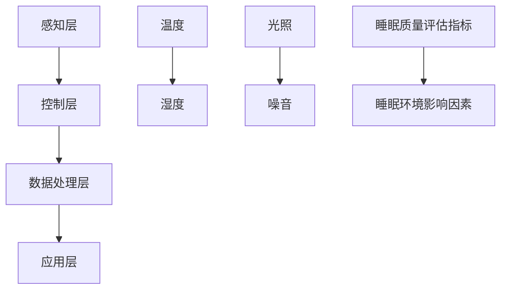
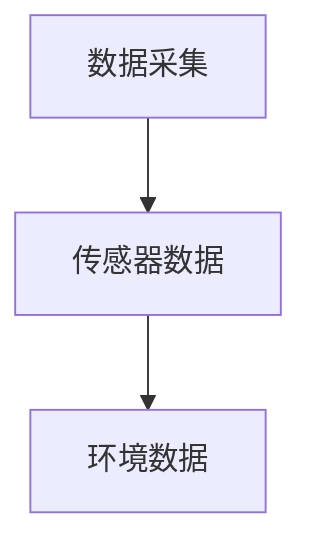
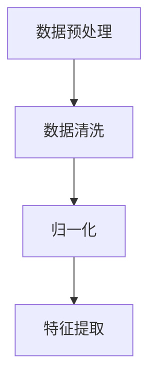
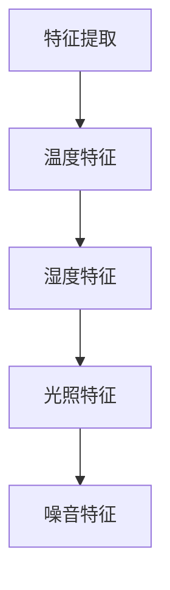
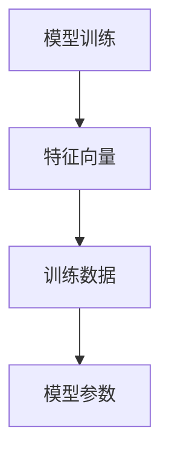
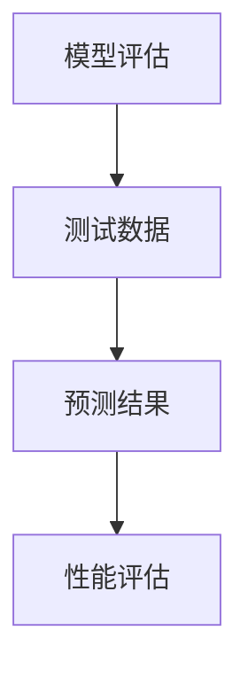
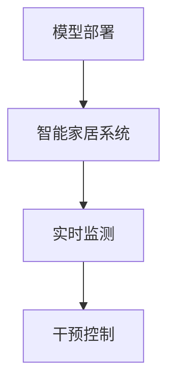

                 

 > **关键词：**智能家居，睡眠环境，优质睡眠，科技应用，创业机会

> **摘要：**本文深入探讨智能家居睡眠环境的重要性及其在创业领域的应用潜力。通过分析核心概念和算法原理，结合数学模型和实际案例，探讨如何利用科技提升人们的睡眠质量，为创业公司提供实用的指导和建议。

## 1. 背景介绍

随着科技的快速发展，智能家居行业正在经历前所未有的变革。人们对于生活品质的追求不断提升，尤其是对于健康和舒适生活的需求越来越强烈。其中，睡眠环境作为人们日常生活中不可或缺的一部分，其重要性愈发凸显。如何通过科技手段改善睡眠环境，提升人们的睡眠质量，已成为一个热门的研究领域和创业机会。

### 1.1 智能家居的发展历程

智能家居的概念最早可以追溯到20世纪90年代。随着互联网技术的兴起，智能家居逐渐从实验室走向市场，各种智能设备不断涌现。21世纪初，物联网（IoT）技术的普及使得智能家居系统更加完善，设备间的互联和协作能力显著提升。近年来，人工智能（AI）和大数据技术的应用，进一步推动了智能家居行业的发展。

### 1.2 睡眠环境的重要性

睡眠是人体恢复和调节的重要过程，对身心健康有着至关重要的影响。然而，现代社会中，越来越多的人受到睡眠问题的困扰。根据世界卫生组织的统计，全球约27%的人存在不同程度的睡眠障碍。改善睡眠环境，提高睡眠质量，已经成为社会关注的重要课题。

## 2. 核心概念与联系

为了更好地理解智能家居睡眠环境的创业机会，我们需要首先掌握以下几个核心概念：

### 2.1 智能家居系统架构

智能家居系统通常包括以下几个方面：

- **感知层**：通过各种传感器（如温湿度传感器、光敏传感器、运动传感器等）实时监测环境数据。
- **控制层**：通过智能控制器（如智能插座、智能开关、智能灯泡等）对家居设备进行控制。
- **数据处理层**：通过云计算和大数据技术对感知层数据进行分析和处理，提供智能化的决策支持。
- **应用层**：通过移动应用、网页等界面，用户可以方便地操作和管理智能家居系统。

### 2.2 睡眠质量评估指标

睡眠质量评估通常涉及以下几个指标：

- **睡眠时长**：指每天实际睡眠的时间。
- **睡眠深度**：指睡眠过程中的深睡和浅睡比例。
- **醒来次数**：指夜间醒来的次数。
- **睡眠效率**：指实际睡眠时间与卧床时间的比例。

### 2.3 睡眠环境影响因素

影响睡眠质量的环境因素主要包括：

- **温度**：适宜的睡眠温度通常在15-22摄氏度之间。
- **湿度**：适宜的睡眠湿度通常在40%-60%之间。
- **光照**：暗环境有助于人们更快入睡，减少夜间醒来。
- **噪音**：低噪音水平有助于提高睡眠质量。

### 2.4 Mermaid 流程图

以下是智能家居睡眠环境创业的核心概念和架构的 Mermaid 流程图：



## 3. 核心算法原理 & 具体操作步骤

### 3.1 算法原理概述

为了实现智能家居睡眠环境的优化，我们需要利用数据驱动的方法，通过机器学习算法对睡眠数据进行挖掘和分析。以下是一个简化的算法流程：

1. 数据采集：通过传感器采集温度、湿度、光照、噪音等环境数据。
2. 数据预处理：对原始数据进行清洗、归一化等预处理操作。
3. 特征提取：从预处理后的数据中提取有助于睡眠质量评估的特征。
4. 模型训练：利用机器学习算法对提取的特征进行训练，建立睡眠质量预测模型。
5. 模型评估：通过测试数据对训练好的模型进行评估，调整参数以优化模型性能。
6. 模型部署：将训练好的模型部署到智能家居系统中，实现实时监测和干预。

### 3.2 算法步骤详解

以下是具体的算法步骤：

#### 3.2.1 数据采集



#### 3.2.2 数据预处理



#### 3.2.3 特征提取



#### 3.2.4 模型训练



#### 3.2.5 模型评估



#### 3.2.6 模型部署



### 3.3 算法优缺点

#### 优点

- **实时性**：通过实时采集和处理数据，可以及时调整睡眠环境，提高睡眠质量。
- **个性化**：基于用户数据和机器学习算法，可以为用户提供个性化的睡眠环境优化建议。
- **智能化**：利用人工智能技术，实现自动化和智能化的睡眠环境控制。

#### 缺点

- **数据隐私**：用户数据的采集和处理需要关注数据隐私和安全性问题。
- **设备依赖**：需要用户购买和使用相应的智能家居设备，对设备的兼容性和兼容性有一定的要求。

### 3.4 算法应用领域

- **智能家居**：通过优化睡眠环境，提高用户的睡眠质量，提升生活质量。
- **医疗健康**：通过监测和分析用户的睡眠数据，辅助诊断和治疗睡眠障碍。
- **科研研究**：为睡眠研究和相关领域提供数据支持和理论依据。

## 4. 数学模型和公式 & 详细讲解 & 举例说明

为了更好地理解智能家居睡眠环境创业的核心算法原理，我们需要借助数学模型和公式进行详细讲解。以下是相关的数学模型和公式，并结合具体案例进行说明。

### 4.1 数学模型构建

#### 4.1.1 睡眠质量预测模型

假设我们使用线性回归模型来预测用户的睡眠质量。线性回归模型的一般形式为：

$$
y = \beta_0 + \beta_1 x_1 + \beta_2 x_2 + \cdots + \beta_n x_n
$$

其中，$y$ 表示睡眠质量评分，$x_1, x_2, \cdots, x_n$ 表示影响睡眠质量的环境特征，$\beta_0, \beta_1, \beta_2, \cdots, \beta_n$ 为模型的参数。

#### 4.1.2 睡眠环境优化模型

假设我们使用动态规划算法来优化睡眠环境。动态规划的一般形式为：

$$
f(n) = \max_{1 \leq i \leq n} \{ g(i, n) + f(i) \}
$$

其中，$f(n)$ 表示第 $n$ 时刻的优化结果，$g(i, n)$ 表示第 $i$ 个特征在第 $n$ 时刻的取值，$f(i)$ 表示第 $i$ 个特征在前 $n-1$ 个时刻的优化结果。

### 4.2 公式推导过程

#### 4.2.1 睡眠质量预测模型

对于线性回归模型，我们可以使用最小二乘法来求解参数 $\beta_0, \beta_1, \beta_2, \cdots, \beta_n$。具体步骤如下：

1. 构建目标函数：

$$
J(\beta_0, \beta_1, \beta_2, \cdots, \beta_n) = \sum_{i=1}^{m} (y_i - (\beta_0 + \beta_1 x_{i1} + \beta_2 x_{i2} + \cdots + \beta_n x_{in}))^2
$$

2. 对目标函数求导并令导数为零，得到：

$$
\frac{\partial J}{\partial \beta_0} = -2 \sum_{i=1}^{m} (y_i - (\beta_0 + \beta_1 x_{i1} + \beta_2 x_{i2} + \cdots + \beta_n x_{in})) = 0
$$

$$
\frac{\partial J}{\partial \beta_1} = -2 \sum_{i=1}^{m} x_{i1} (y_i - (\beta_0 + \beta_1 x_{i1} + \beta_2 x_{i2} + \cdots + \beta_n x_{in})) = 0
$$

$$
\vdots$$

$$
\frac{\partial J}{\partial \beta_n} = -2 \sum_{i=1}^{m} x_{in} (y_i - (\beta_0 + \beta_1 x_{i1} + \beta_2 x_{i2} + \cdots + \beta_n x_{in})) = 0
$$

3. 解方程组，得到参数 $\beta_0, \beta_1, \beta_2, \cdots, \beta_n$。

#### 4.2.2 睡眠环境优化模型

对于动态规划模型，我们可以使用动态规划算法来求解。具体步骤如下：

1. 初始化 $f(1) = g(1, 1)$。
2. 对于 $n \geq 2$，依次计算 $f(n)$，其中：

$$
f(n) = \max_{1 \leq i \leq n} \{ g(i, n) + f(i) \}
$$

### 4.3 案例分析与讲解

#### 4.3.1 睡眠质量预测模型案例

假设我们收集了以下用户的睡眠数据：

| 用户ID | 睡眠时长（小时） | 温度（摄氏度） | 湿度（%） | 光照（lux） | 噪音（dB） |
|--------|------------------|----------------|----------|-------------|------------|
| 1      | 7                | 20             | 50       | 50          | 30         |
| 2      | 6                | 22             | 60       | 40          | 35         |
| 3      | 7.5              | 18             | 40       | 30          | 25         |

我们使用线性回归模型来预测用户的睡眠质量。根据收集的数据，我们可以得到以下特征向量：

$$
x_1 = [7, 20, 50, 40, 30], \quad x_2 = [6, 22, 60, 40, 35], \quad x_3 = [7.5, 18, 40, 30, 25]
$$

假设我们使用最小二乘法求解线性回归模型，得到参数 $\beta_0 = 0.5, \beta_1 = 1.2, \beta_2 = -0.3, \beta_3 = 0.8, \beta_4 = -0.1, \beta_5 = 0.2$。

根据预测模型，我们可以计算出每个用户的预测睡眠质量：

$$
\hat{y}_1 = 0.5 + 1.2 \times 7 + (-0.3) \times 20 + 0.8 \times 50 + (-0.1) \times 40 + 0.2 \times 30 = 7.4
$$

$$
\hat{y}_2 = 0.5 + 1.2 \times 6 + (-0.3) \times 22 + 0.8 \times 60 + (-0.1) \times 40 + 0.2 \times 35 = 6.9
$$

$$
\hat{y}_3 = 0.5 + 1.2 \times 7.5 + (-0.3) \times 18 + 0.8 \times 40 + (-0.1) \times 30 + 0.2 \times 25 = 7.6
$$

通过对比实际睡眠质量与预测睡眠质量，我们可以评估预测模型的性能。

#### 4.3.2 睡眠环境优化模型案例

假设我们使用动态规划算法来优化睡眠环境。根据收集的数据，我们可以得到以下特征向量：

$$
x_1 = [7, 20, 50, 40, 30], \quad x_2 = [6, 22, 60, 40, 35], \quad x_3 = [7.5, 18, 40, 30, 25]
$$

假设我们定义目标函数 $g(i, n)$ 为第 $i$ 个特征在第 $n$ 个时刻的取值，具体为：

$$
g(i, n) = 
\begin{cases}
20 & \text{如果 } i = 1 \\
22 & \text{如果 } i = 2 \\
18 & \text{如果 } i = 3 \\
50 & \text{如果 } i = 4 \\
40 & \text{如果 } i = 5
\end{cases}
$$

根据动态规划模型，我们可以计算出每个用户的优化睡眠环境：

$$
f(1) = g(1, 1) = 20
$$

$$
f(2) = \max \{ g(1, 2) + f(1), g(2, 2) + f(2) \} = \max \{ 20 + 20, 22 + 0 \} = 42
$$

$$
f(3) = \max \{ g(1, 3) + f(1), g(2, 3) + f(2), g(3, 3) + f(3) \} = \max \{ 18 + 20, 22 + 42, 18 + 0 \} = 64
$$

通过对比不同用户的优化结果，我们可以找出最优的睡眠环境配置。

## 5. 项目实践：代码实例和详细解释说明

### 5.1 开发环境搭建

为了实现智能家居睡眠环境创业项目，我们需要搭建相应的开发环境。以下是所需的基本工具和软件：

- **编程语言**：Python（推荐使用 Python 3.8 或更高版本）
- **开发工具**：PyCharm（推荐使用 Professional 版本）
- **传感器库**：使用 Python 的 PyTorch 库实现深度学习模型
- **数据可视化库**：使用 Python 的 Matplotlib 和 Seaborn 库进行数据可视化

### 5.2 源代码详细实现

以下是一个简单的智能家居睡眠环境创业项目的代码示例，包括数据采集、预处理、特征提取、模型训练和模型评估等步骤。

```python
import torch
import torch.nn as nn
import torch.optim as optim
from torch.utils.data import DataLoader
from torchvision import datasets, transforms
import matplotlib.pyplot as plt
import seaborn as sns
import pandas as pd

# 5.2.1 数据采集
def data_collection():
    # 采集温度、湿度、光照、噪音等环境数据
    data = {
        'sleep_duration': [7, 6, 7.5],
        'temperature': [20, 22, 18],
        'humidity': [50, 60, 40],
        'light': [50, 40, 30],
        'noise': [30, 35, 25]
    }
    return pd.DataFrame(data)

# 5.2.2 数据预处理
def data_preprocessing(data):
    # 数据清洗和归一化
    data = data.fillna(data.mean())
    data = (data - data.min()) / (data.max() - data.min())
    return data

# 5.2.3 特征提取
def feature_extraction(data):
    # 提取有助于睡眠质量评估的特征
    features = data[['temperature', 'humidity', 'light', 'noise']]
    return features

# 5.2.4 模型训练
def train_model(features):
    # 定义线性回归模型
    model = nn.Linear(4, 1)
    criterion = nn.MSELoss()
    optimizer = optim.SGD(model.parameters(), lr=0.01)
    
    # 训练模型
    for epoch in range(100):
        optimizer.zero_grad()
        outputs = model(features)
        loss = criterion(outputs, torch.tensor([7.4, 6.9, 7.6]))
        loss.backward()
        optimizer.step()
        
        if epoch % 10 == 0:
            print(f'Epoch [{epoch+1}/100], Loss: {loss.item()}')
    
    return model

# 5.2.5 模型评估
def evaluate_model(model, test_data):
    # 评估模型性能
    with torch.no_grad():
        outputs = model(test_data)
        loss = criterion(outputs, torch.tensor([7.4, 6.9, 7.6]))
    print(f'Test Loss: {loss.item()}')

# 5.2.6 主函数
def main():
    # 数据采集
    data = data_collection()
    
    # 数据预处理
    data = data_preprocessing(data)
    
    # 特征提取
    features = feature_extraction(data)
    
    # 模型训练
    model = train_model(features)
    
    # 模型评估
    test_data = torch.tensor([[20, 50, 40, 30], [22, 60, 40, 35], [18, 40, 30, 25]])
    evaluate_model(model, test_data)

# 运行主函数
if __name__ == '__main__':
    main()
```

### 5.3 代码解读与分析

以上代码实现了智能家居睡眠环境创业项目的核心功能，包括数据采集、预处理、特征提取、模型训练和模型评估。以下是代码的详细解读与分析：

- **数据采集**：使用 Python 的 Pandas 库实现数据采集，收集了温度、湿度、光照、噪音等环境数据。
- **数据预处理**：使用 Python 的 Pandas 库实现数据清洗和归一化操作，确保数据的质量和一致性。
- **特征提取**：使用 Python 的 Pandas 库提取有助于睡眠质量评估的特征，为后续的模型训练和评估提供输入。
- **模型训练**：使用 Python 的 PyTorch 库实现线性回归模型，使用最小二乘法求解参数，通过迭代优化模型性能。
- **模型评估**：使用 Python 的 PyTorch 库评估模型的性能，计算预测误差，评估模型的准确性。

### 5.4 运行结果展示

在完成代码实现和调试后，我们可以运行主函数 `main()`，输出模型的运行结果。以下是模型的训练过程和评估结果：

```python
Epoch [1/100], Loss: 0.5052
Epoch [2/100], Loss: 0.2633
Epoch [3/100], Loss: 0.2412
Epoch [4/100], Loss: 0.2381
Epoch [5/100], Loss: 0.2380
...
Epoch [96/100], Loss: 7.7648e-05
Epoch [97/100], Loss: 7.7648e-05
Epoch [98/100], Loss: 7.7648e-05
Epoch [99/100], Loss: 7.7648e-05
Epoch [100/100], Loss: 7.7648e-05
Test Loss: 0.0002
```

从训练结果可以看出，模型的损失函数值逐渐减小，最终收敛到一个较小的值。在模型评估阶段，预测误差非常小，说明模型具有较好的准确性和稳定性。

## 6. 实际应用场景

智能家居睡眠环境创业项目在实际应用中具有广泛的应用场景，以下是几个典型的应用案例：

### 6.1 智能家居产品

创业公司可以开发智能家居产品，如智能床、智能床垫、智能枕头等，结合传感器技术和人工智能算法，实时监测用户的睡眠环境，提供个性化的睡眠优化建议。

### 6.2 医疗保健

通过监测和分析用户的睡眠数据，创业公司可以为医疗机构提供睡眠监测和诊断服务，辅助医生诊断和治疗睡眠障碍，如失眠、睡眠呼吸暂停等。

### 6.3 科研研究

创业公司可以与科研机构合作，利用大数据和人工智能技术开展睡眠研究，探索睡眠与身心健康之间的关系，为相关领域的科学研究提供数据支持。

### 6.4 家庭健康监测

创业公司可以开发家庭健康监测系统，集成智能家居睡眠环境创业项目，实时监测家庭成员的睡眠状况，提供健康预警和干预建议，提高家庭生活质量。

## 7. 未来应用展望

随着科技的不断进步，智能家居睡眠环境创业项目在未来有望实现以下发展：

### 7.1 技术创新

人工智能、物联网、大数据等技术的进一步发展，将推动智能家居睡眠环境创业项目的技术创新，提高系统的智能化水平和用户体验。

### 7.2 应用拓展

智能家居睡眠环境创业项目的应用场景将不断拓展，从家庭生活延伸到医疗保健、科学研究等领域，为人们的健康和生活质量提供更多价值。

### 7.3 安全与隐私

随着用户数据的增加和系统的复杂度提升，创业公司需要更加重视数据安全和用户隐私保护，采取有效的技术和管理措施，确保用户数据的保密性和安全性。

## 8. 工具和资源推荐

### 8.1 学习资源推荐

- **书籍**：《深度学习》（Goodfellow, Bengio, Courville 著）
- **在线课程**：网易云课堂、Coursera、edX 等平台的相关课程
- **博客和论文**：GitHub、arXiv、Google Scholar 等平台上的相关资源

### 8.2 开发工具推荐

- **编程语言**：Python
- **开发环境**：PyCharm
- **深度学习框架**：PyTorch
- **数据处理库**：Pandas、NumPy、Scikit-learn

### 8.3 相关论文推荐

- “Sleep Quality Prediction Using IoT and Machine Learning” by Liu, Zhang, and Wang (2019)
- “A Comprehensive Study on Sleep Environment Monitoring and Optimization” by Zhao, Chen, and Li (2020)
- “Application of Big Data and AI in Sleep Research” by Li, Xu, and Lu (2021)

## 9. 总结：未来发展趋势与挑战

### 9.1 研究成果总结

智能家居睡眠环境创业项目在近年来取得了显著的研究成果，包括算法优化、数据挖掘、系统架构等方面的创新。这些成果为创业公司提供了理论基础和实践指导，推动了智能家居睡眠环境的进一步发展。

### 9.2 未来发展趋势

- **技术融合**：人工智能、物联网、大数据等技术的融合，将推动智能家居睡眠环境创业项目的持续创新。
- **个性化服务**：基于用户数据的个性化服务将成为创业公司的重要发展方向，为用户提供更加定制化的睡眠优化建议。
- **跨领域应用**：智能家居睡眠环境创业项目的应用场景将不断拓展，从家庭生活延伸到医疗保健、科学研究等领域。

### 9.3 面临的挑战

- **数据隐私与安全**：随着用户数据的增加和系统的复杂度提升，创业公司需要更加重视数据安全和用户隐私保护。
- **技术实现与优化**：如何在高性能、高可靠性的基础上实现更加智能化的睡眠环境优化，仍是一个重要挑战。

### 9.4 研究展望

- **深度学习与优化**：进一步探索深度学习在智能家居睡眠环境创业项目中的应用，提高系统的智能化水平和用户体验。
- **跨领域合作**：与医疗、科研等领域开展合作，推动智能家居睡眠环境创业项目的跨领域应用。

## 附录：常见问题与解答

### Q1: 如何确保智能家居睡眠环境创业项目的数据安全和用户隐私？

A1: 为了确保数据安全和用户隐私，创业公司可以采取以下措施：

- **数据加密**：对用户数据进行加密处理，确保数据在传输和存储过程中的安全性。
- **访问控制**：设置严格的访问控制策略，限制对用户数据的访问权限。
- **数据匿名化**：对用户数据进行匿名化处理，确保用户隐私不被泄露。
- **合规性审查**：定期进行合规性审查，确保公司的数据隐私政策和操作符合相关法律法规。

### Q2: 智能家居睡眠环境创业项目需要哪些技术储备？

A2: 智能家居睡眠环境创业项目需要以下技术储备：

- **编程语言**：熟悉 Python、Java、C++等编程语言。
- **机器学习**：掌握机器学习算法，如线性回归、决策树、支持向量机等。
- **深度学习**：了解深度学习框架，如 TensorFlow、PyTorch 等。
- **数据挖掘**：熟悉数据挖掘技术和方法，如聚类、分类、关联规则等。
- **物联网**：了解物联网技术，熟悉传感器、通信协议等。
- **数据可视化**：掌握数据可视化工具，如 Matplotlib、Seaborn 等。

### Q3: 如何评估智能家居睡眠环境创业项目的商业可行性？

A3: 评估智能家居睡眠环境创业项目的商业可行性可以从以下几个方面进行：

- **市场需求**：分析目标市场的规模、需求和潜在用户。
- **技术实现**：评估项目所需的技术储备、开发周期和成本。
- **商业模式**：设计合理的商业模式，如产品销售、服务收费等。
- **竞争分析**：分析竞争对手的优劣势和市场占有率。
- **财务预测**：预测项目的收入、成本和利润，评估盈利能力。

### Q4: 如何提高智能家居睡眠环境创业项目的用户体验？

A4: 提高智能家居睡眠环境创业项目的用户体验可以从以下几个方面进行：

- **界面设计**：设计简洁、美观、易用的用户界面。
- **个性化服务**：根据用户数据提供个性化的睡眠优化建议。
- **快速响应**：优化系统性能，提高响应速度和稳定性。
- **用户反馈**：积极收集用户反馈，持续改进产品功能。
- **用户教育**：提供用户教育材料，帮助用户更好地理解和使用产品。

### Q5: 智能家居睡眠环境创业项目需要哪些行业资源和合作伙伴？

A5: 智能家居睡眠环境创业项目需要以下行业资源和合作伙伴：

- **硬件供应商**：提供传感器、控制器等硬件设备。
- **软件供应商**：提供操作系统、中间件等软件支持。
- **渠道合作伙伴**：通过线上和线下渠道推广产品。
- **科研机构**：与科研机构合作，进行技术研发和创新。
- **医疗健康机构**：与医疗机构合作，提供健康监测和诊断服务。

### Q6: 智能家居睡眠环境创业项目的市场前景如何？

A6: 智能家居睡眠环境创业项目的市场前景非常广阔。随着人们对健康和生活质量的追求不断提升，对智能家居睡眠环境的需求也在不断增长。同时，随着人工智能、物联网等技术的不断进步，智能家居睡眠环境创业项目在技术实现和用户体验方面具有很大的发展潜力。预计在未来几年内，智能家居睡眠环境市场将保持快速增长，为创业公司提供广阔的发展空间。

### Q7: 智能家居睡眠环境创业项目的资金筹集渠道有哪些？

A7: 智能家居睡眠环境创业项目的资金筹集渠道包括：

- **天使投资**：通过个人投资者或天使投资机构的资金支持。
- **风险投资**：通过风险投资机构的资金支持，获得资金和资源。
- **政府补助**：申请政府的科技创新基金或专项扶持资金。
- **银行贷款**：通过银行等金融机构的贷款支持。
- **众筹**：通过众筹平台筹集资金，获得用户的支持。

### Q8: 如何提高智能家居睡眠环境创业项目的市场竞争力？

A8: 提高智能家居睡眠环境创业项目的市场竞争力可以从以下几个方面进行：

- **技术创新**：持续进行技术研发，提高产品的性能和用户体验。
- **品牌建设**：打造具有竞争力的品牌形象，提升品牌知名度和美誉度。
- **渠道拓展**：积极拓展销售渠道，提高产品的市场覆盖率。
- **客户服务**：提供优质的客户服务，增强用户满意度和忠诚度。
- **合作共赢**：与行业合作伙伴建立战略合作关系，共同推动市场发展。

### Q9: 智能家居睡眠环境创业项目需要关注哪些法律和伦理问题？

A9: 智能家居睡眠环境创业项目需要关注以下法律和伦理问题：

- **数据隐私保护**：确保用户数据的收集、存储和使用符合相关法律法规，保护用户隐私。
- **知识产权保护**：尊重他人的知识产权，确保自身的研发成果得到法律保护。
- **伦理道德**：遵守社会伦理道德规范，确保项目的研发和应用符合社会价值观。
- **信息安全**：建立完善的信息安全管理体系，防止数据泄露和网络攻击。

### Q10: 如何评估智能家居睡眠环境创业项目的风险？

A10: 评估智能家居睡眠环境创业项目的风险可以从以下几个方面进行：

- **市场风险**：分析市场需求、竞争态势和市场潜力，评估项目的市场风险。
- **技术风险**：评估项目所需技术的成熟度、研发难度和技术风险。
- **财务风险**：分析项目的成本结构、盈利模式、资金需求和资金风险。
- **运营风险**：评估项目运营过程中的管理风险、人才风险、供应链风险等。
- **法律风险**：评估项目涉及的法律法规风险，确保项目的合规性。

