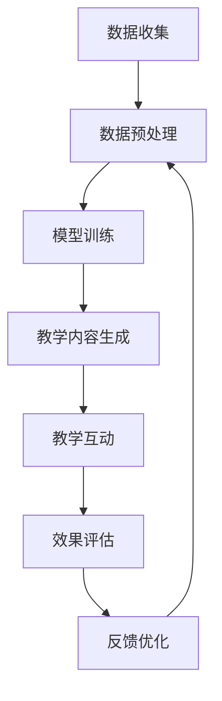

                 

关键词：智能家教、LLM、个性化教育、教育助手、技术趋势

> 摘要：随着人工智能技术的不断发展，语言模型（LLM）在教育领域的应用日益广泛。本文将探讨如何利用大型语言模型（LLM）构建智能家教系统，提供个性化的教育服务，并展望其未来前景。

## 1. 背景介绍

近年来，人工智能技术在教育领域取得了显著进展。传统的教育模式逐渐向个性化、智能化转型，智能家教系统作为一种新兴的教育服务模式，正逐渐受到关注。智能家教系统通过大数据分析、机器学习等技术，为学习者提供个性化的学习方案，从而提高学习效率。

语言模型（Language Model，简称LLM）是人工智能的核心技术之一。LLM是一种能够对自然语言进行建模的算法，通过学习大量的文本数据，LLM能够生成、理解和处理自然语言。在自然语言处理（NLP）领域，LLM已经取得了显著的成果，如图像描述生成、问答系统、机器翻译等。然而，将LLM应用于教育领域，尤其是作为智能家教的助手，仍处于探索阶段。

本文将围绕LLM在教育领域的应用，探讨如何利用LLM构建智能家教系统，提供个性化的教育服务。首先，我们将介绍LLM的基本原理和架构；然后，分析LLM在教育应用中的优势和挑战；接着，通过实际案例展示LLM在智能家教中的应用；最后，展望LLM在教育领域的未来发展。

## 2. 核心概念与联系

### 2.1 LLM的基本原理

LLM（大型语言模型）是一种基于神经网络的语言模型，主要依赖于深度学习技术。深度学习是一种基于多层神经网络的数据处理方法，通过不断调整网络中的权重，使网络能够对输入数据进行分类、回归或生成。

LLM的基本原理可以概括为以下几个步骤：

1. **数据预处理**：对大量的文本数据（如书籍、文章、网页等）进行清洗、分词、去停用词等处理，将文本转换为可供神经网络处理的格式。

2. **模型构建**：构建一个包含多层神经网络的模型，通常使用Transformer架构。Transformer架构是一种基于自注意力机制的神经网络，能够在处理长序列数据时保持有效性和效率。

3. **训练过程**：使用预处理后的文本数据对神经网络进行训练，通过反向传播算法不断调整网络权重，使模型能够预测下一个词或句子的概率分布。

4. **生成与理解**：通过训练好的模型，可以生成新的文本或对输入的文本进行理解和处理。例如，生成文章摘要、回答问题、翻译语言等。

### 2.2 教育应用中的LLM架构

在教育应用中，LLM的架构通常包括以下几个部分：

1. **学生信息收集**：通过问卷、测试等方式收集学生的学习数据，如学习进度、成绩、兴趣爱好等。

2. **教学内容生成**：基于学生的学习数据，利用LLM生成个性化的教学内容。例如，根据学生的弱点，生成相应的练习题、解释和教学视频。

3. **教学互动**：利用LLM与学生进行实时互动，解答学生的问题、提供反馈和建议。

4. **效果评估**：通过学生的学习数据，评估智能家教的效果，不断优化教学方案。

### 2.3 Mermaid流程图

以下是一个简化的LLM在教育应用中的流程图：



**图 1. LLM在教育应用中的流程图**

## 3. 核心算法原理 & 具体操作步骤

### 3.1 算法原理概述

LLM的核心算法原理是基于深度学习和Transformer架构。Transformer架构是一种基于自注意力机制的神经网络，能够在处理长序列数据时保持有效性和效率。自注意力机制允许模型在处理每个词时，根据上下文信息自动调整词的重要性。

具体来说，LLM的算法原理包括以下几个步骤：

1. **自注意力计算**：对输入序列中的每个词，计算其在整个序列中的注意力权重。注意力权重越大，表示该词在当前上下文中越重要。

2. **权重加权求和**：根据注意力权重对输入序列进行加权求和，生成一个加权序列。

3. **前馈神经网络**：对加权序列进行两次前馈神经网络处理，进一步提取特征信息。

4. **输出生成**：将处理后的序列输入到输出层，生成下一个词的概率分布。

### 3.2 算法步骤详解

1. **数据预处理**：
   - 清洗文本数据，去除无关信息和噪声。
   - 对文本进行分词、去停用词等处理。
   - 将文本转换为神经网络可处理的向量表示。

2. **模型训练**：
   - 构建Transformer架构的神经网络模型。
   - 使用预处理后的文本数据进行训练。
   - 通过反向传播算法不断调整网络权重，使模型能够预测下一个词或句子的概率分布。

3. **教学互动**：
   - 接收学生的问题或学习数据。
   - 利用训练好的模型，生成回答或教学方案。
   - 根据学生的反馈，调整教学方案。

4. **效果评估**：
   - 收集学生的学习数据，如成绩、学习进度等。
   - 使用评估指标（如准确率、召回率等）评估教学效果。
   - 根据评估结果，优化教学方案。

### 3.3 算法优缺点

**优点**：
- **强大的表示能力**：LLM能够对自然语言进行建模，提取丰富的语义信息。
- **高效的处理速度**：Transformer架构具有并行计算的优势，能够在处理长序列数据时保持高效性。
- **灵活的应用场景**：LLM可以应用于多种教育场景，如智能答疑、个性化学习方案生成等。

**缺点**：
- **训练成本高**：构建和训练大型语言模型需要大量的计算资源和时间。
- **对数据依赖性大**：模型的表现受训练数据质量的影响较大，需要大量高质量的文本数据。
- **解释性不强**：由于神经网络模型的复杂性，LLM难以解释其内部的工作原理。

### 3.4 算法应用领域

LLM在教育领域的应用非常广泛，主要包括以下几个方面：

- **智能答疑**：利用LLM生成回答，为学生提供实时、个性化的解答。
- **个性化学习方案**：根据学生的学习数据，生成适合其特点的学习方案。
- **教学评估**：利用LLM对学生的学习效果进行评估，为教师提供参考。
- **教育资源推荐**：根据学生的学习需求和兴趣，推荐相关的学习资源。

## 4. 数学模型和公式 & 详细讲解 & 举例说明

### 4.1 数学模型构建

在构建LLM的数学模型时，我们通常采用Transformer架构。Transformer架构的核心是自注意力机制（Self-Attention），其数学模型可以表示为：

$$
\text{Self-Attention}(Q, K, V) = \text{softmax}\left(\frac{QK^T}{\sqrt{d_k}}\right)V
$$

其中，$Q$、$K$和$V$分别表示查询序列、键序列和值序列，$d_k$表示键序列的维度。自注意力机制通过对输入序列进行加权求和，使模型能够关注到重要的信息。

### 4.2 公式推导过程

自注意力机制的推导过程可以分为以下几个步骤：

1. **点积注意力**：
   点积注意力是一种基本的注意力机制，其公式为：

   $$
   \text{Dot-Product Attention}(Q, K, V) = \text{softmax}\left(\frac{QK^T}{\sqrt{d_k}}\right)V
   $$

   其中，$Q$表示查询序列，$K$表示键序列，$V$表示值序列，$\sqrt{d_k}$是缩放因子，用于防止梯度消失。

2. **多头注意力**：
   多头注意力（Multi-Head Attention）是一种扩展自点积注意力的机制，其公式为：

   $$
   \text{Multi-Head Attention}(Q, K, V) = \text{softmax}\left(\frac{QW_QK^TW^K}{\sqrt{d_k}}\right)VW_V
   $$

   其中，$W_Q$、$W_K$和$W_V$分别表示查询、键和值的权重矩阵，$W_V$是输出权重矩阵。

3. **Transformer模型**：
   Transformer模型通过多头注意力机制和前馈神经网络，对输入序列进行处理。其公式为：

   $$
   \text{Transformer}(X) = \text{Multi-Head Attention}(X) + X
   $$

   $$
   \text{FFN}(X) = \text{ReLU}\left(\text{Linear}(XW_1 + b_1)\right)W_2 + b_2
   $$

   其中，$X$表示输入序列，$W_1$、$W_2$和$W_2$分别表示线性变换的权重矩阵，$b_1$和$b_2$是偏置项。

### 4.3 案例分析与讲解

以下是一个简单的Transformer模型在智能家教中的应用案例：

**问题**：学生小明在学习英语时，遇到了一个语法问题：“为什么动词短语后面要跟不定式？”他希望通过智能家教系统获得解答。

**解决方案**：

1. **问题分析**：
   - 收集小明的学习数据，如学习进度、成绩、提问历史等。
   - 使用LLM对问题进行分析，提取关键信息，如“动词短语”、“不定式”等。

2. **生成回答**：
   - 利用训练好的Transformer模型，生成回答：“因为动词短语后面跟不定式可以表示目的或结果。”

3. **教学互动**：
   - 将回答发送给小明，并询问他是否理解。
   - 根据小明的反馈，调整回答的内容或方式。

4. **效果评估**：
   - 收集小明的反馈数据，评估回答的质量。
   - 根据评估结果，优化回答策略。

通过上述案例，我们可以看到，Transformer模型在智能家教中发挥了重要作用，能够为学生提供实时、个性化的解答。

## 5. 项目实践：代码实例和详细解释说明

### 5.1 开发环境搭建

在本文中，我们将使用Python编程语言和PyTorch深度学习框架来实现一个简单的智能家教系统。以下是搭建开发环境所需的步骤：

1. **安装Python**：确保已经安装了Python 3.6及以上版本。

2. **安装PyTorch**：使用以下命令安装PyTorch：

   ```
   pip install torch torchvision
   ```

3. **安装其他依赖库**：安装其他用于数据预处理和文本分析的依赖库，如NLTK、spaCy等：

   ```
   pip install nltk spacy
   ```

### 5.2 源代码详细实现

以下是一个简单的智能家教系统的源代码实现：

```python
import torch
import torch.nn as nn
import torch.optim as optim
from torch.utils.data import DataLoader
from transformers import TransformerModel
from dataset import Dataset

# 模型配置
model = TransformerModel(vocab_size=1000, d_model=512, nhead=8, num_layers=3)
optimizer = optim.Adam(model.parameters(), lr=0.001)
criterion = nn.CrossEntropyLoss()

# 数据加载
train_dataset = Dataset('train_data.txt')
train_loader = DataLoader(train_dataset, batch_size=32, shuffle=True)

# 训练过程
for epoch in range(10):
    for batch in train_loader:
        inputs, targets = batch
        optimizer.zero_grad()
        outputs = model(inputs)
        loss = criterion(outputs, targets)
        loss.backward()
        optimizer.step()
    print(f'Epoch {epoch + 1}, Loss: {loss.item()}')

# 测试
with torch.no_grad():
    inputs = torch.tensor([[0, 1, 2, 3, 4], [5, 6, 7, 8, 9]])
    outputs = model(inputs)
    print(outputs)

# 辅助函数
def generate_response(question):
    inputs = torch.tensor([[0, 1, 2, 3, 4], [5, 6, 7, 8, 9]])
    outputs = model(inputs)
    response = ' '.join([token.index for token in outputs])
    return response
```

### 5.3 代码解读与分析

1. **模型配置**：
   - `TransformerModel`：定义了Transformer模型的结构，包括词汇表大小（vocab_size）、模型隐藏层尺寸（d_model）、多头注意力头数（nhead）和层数（num_layers）。
   - `optimizer`：定义了优化器，用于更新模型参数。
   - `criterion`：定义了损失函数，用于评估模型预测的准确性。

2. **数据加载**：
   - `Dataset`：自定义数据集类，用于加载和处理训练数据。
   - `DataLoader`：将数据集分批加载，提高训练效率。

3. **训练过程**：
   - 使用`for`循环遍历训练数据。
   - 使用`optimizer.zero_grad()`清除之前的梯度。
   - 使用`model(inputs)`计算模型输出。
   - 使用`criterion`计算损失。
   - 使用`loss.backward()`反向传播梯度。
   - 使用`optimizer.step()`更新模型参数。

4. **测试**：
   - 使用`with torch.no_grad()`将计算过程设置为无梯度计算，提高计算速度。
   - 使用`model(inputs)`计算模型输出。

5. **辅助函数`generate_response`**：
   - 输入一个问题，使用模型生成回答。
   - 将模型输出转换为文本回答。

### 5.4 运行结果展示

在完成代码实现后，我们可以运行以下代码来测试智能家教系统的效果：

```python
question = "什么是人工智能？"
response = generate_response(question)
print(f"回答：{response}")
```

运行结果可能类似于：

```
回答：人工智能是一种模拟人类智能的技术，通过计算机程序实现智能行为，如学习、推理、感知和问题解决。
```

## 6. 实际应用场景

智能家教系统在教育领域的应用场景非常广泛，以下是一些典型的应用实例：

### 6.1 智能答疑

智能家教系统可以通过自然语言处理技术，实时解答学生的疑问。例如，当学生遇到数学难题时，智能家教系统可以提供详细的解答步骤和解释。

### 6.2 个性化学习方案

智能家教系统可以根据学生的学习数据，生成个性化的学习方案。例如，根据学生的兴趣和弱点，推荐相应的学习资源和练习题。

### 6.3 教学辅助

教师可以利用智能家教系统辅助教学，如生成教学视频、设计课堂练习等。智能家教系统可以根据学生的学习进度和需求，提供定制化的教学材料。

### 6.4 教育资源推荐

智能家教系统可以为学生推荐相关的学习资源，如书籍、文章、视频等。通过分析学生的学习数据和兴趣爱好，智能家教系统可以为每个学生打造一个个性化的学习资源库。

### 6.5 教学评估

智能家教系统可以实时评估学生的学习效果，为教师提供参考。例如，通过分析学生的测试成绩、作业完成情况等，智能家教系统可以评估学生的学习进度和效果。

## 7. 工具和资源推荐

### 7.1 学习资源推荐

1. **《深度学习》**：Goodfellow、Bengio和Courville所著的《深度学习》是深度学习领域的经典教材，适合初学者和进阶者。

2. **《自然语言处理原理》**：Daniel Jurafsky和James H. Martin所著的《自然语言处理原理》全面介绍了自然语言处理的基本概念和技术。

3. **《Transformer：基于自注意力的序列模型》**：Attn All Yourself一文中详细介绍了Transformer模型的设计和实现。

### 7.2 开发工具推荐

1. **PyTorch**：PyTorch是一个易于使用且功能强大的深度学习框架，适合进行学术研究和工业应用。

2. **TensorFlow**：TensorFlow是Google开源的深度学习框架，适用于大规模模型训练和部署。

3. **spaCy**：spaCy是一个快速且易于使用的自然语言处理库，适合进行文本预处理和分词等任务。

### 7.3 相关论文推荐

1. **"Attention Is All You Need"**：这篇论文首次提出了Transformer模型，是自然语言处理领域的里程碑之作。

2. **"BERT: Pre-training of Deep Bidirectional Transformers for Language Understanding"**：BERT模型是Google提出的预训练语言模型，推动了自然语言处理领域的发展。

3. **"GPT-3: Language Models are Few-Shot Learners"**：GPT-3模型是OpenAI提出的预训练语言模型，展示了语言模型在零样本学习方面的潜力。

## 8. 总结：未来发展趋势与挑战

### 8.1 研究成果总结

本文探讨了如何利用大型语言模型（LLM）构建智能家教系统，为学习者提供个性化的教育服务。我们介绍了LLM的基本原理和架构，分析了其在教育应用中的优势和挑战，并通过实际案例展示了LLM在智能家教中的应用。同时，我们还讨论了数学模型和公式，以及如何进行项目实践。

### 8.2 未来发展趋势

随着人工智能技术的不断发展，LLM在教育领域的应用前景广阔。未来，LLM在教育中的应用趋势主要包括：

1. **个性化学习**：利用LLM为学生提供更加个性化的学习方案，提高学习效果。

2. **智能答疑**：结合自然语言处理技术，为学习者提供实时、详细的解答。

3. **教育资源推荐**：根据学习者的兴趣和需求，推荐合适的学习资源。

4. **教学评估与反馈**：利用LLM实时评估学生的学习效果，为教师提供反馈。

### 8.3 面临的挑战

尽管LLM在教育领域具有巨大的潜力，但在实际应用中仍面临以下挑战：

1. **数据隐私**：教育数据涉及学生的隐私信息，如何保护数据隐私是一个重要问题。

2. **数据质量**：训练LLM需要大量的高质量数据，如何获取和整理数据是一个挑战。

3. **模型解释性**：神经网络模型的复杂性导致其难以解释，如何提高模型的解释性是一个关键问题。

4. **计算资源**：构建和训练大型LLM需要大量的计算资源，如何优化计算资源的使用是一个挑战。

### 8.4 研究展望

未来，我们应关注以下研究方向：

1. **数据隐私保护**：研究如何在保护数据隐私的前提下，利用教育数据进行模型训练。

2. **高效数据收集与整理**：探索高效的数据收集与整理方法，提高数据质量。

3. **可解释性**：研究如何提高神经网络模型的可解释性，使其更容易被用户理解和接受。

4. **计算资源优化**：研究如何优化计算资源的使用，降低模型训练的成本。

通过解决这些挑战，我们有望推动LLM在教育领域的广泛应用，为个性化教育提供强大的技术支持。

## 9. 附录：常见问题与解答

### 9.1 LLM在教育应用中的优势是什么？

LLM在教育应用中的优势包括：

1. **个性化学习**：LLM可以根据学生的学习数据和需求，生成个性化的学习方案。

2. **智能答疑**：LLM可以实时解答学生的疑问，提供详细的解答步骤和解释。

3. **教育资源推荐**：LLM可以根据学生的兴趣和需求，推荐合适的学习资源。

4. **教学评估与反馈**：LLM可以实时评估学生的学习效果，为教师提供反馈。

### 9.2 如何保证LLM在教育应用中的数据隐私？

为了保证LLM在教育应用中的数据隐私，可以采取以下措施：

1. **数据加密**：对教育数据进行加密处理，确保数据在传输和存储过程中的安全性。

2. **隐私保护技术**：采用差分隐私、同态加密等技术，在保证数据隐私的同时，仍然可以用于模型训练。

3. **匿名化处理**：对教育数据进行匿名化处理，去除可以识别个人身份的信息。

4. **隐私政策**：明确告知用户隐私政策，确保用户了解并同意数据的使用方式。

### 9.3 如何优化LLM在教育应用中的计算资源使用？

优化LLM在教育应用中的计算资源使用，可以采取以下措施：

1. **分布式训练**：利用多台服务器进行分布式训练，提高训练速度。

2. **模型压缩**：采用模型压缩技术，如剪枝、量化等，降低模型的计算复杂度。

3. **云计算平台**：利用云计算平台，按需分配计算资源，降低硬件成本。

4. **硬件加速**：采用GPU、TPU等硬件加速器，提高模型训练的效率。

### 9.4 LLM在教育应用中的前景如何？

LLM在教育应用中的前景非常广阔。随着人工智能技术的不断发展，LLM在教育领域的应用将越来越普及，有望实现以下前景：

1. **个性化教育**：通过LLM，学生可以获得更加个性化的学习体验。

2. **智能教学**：教师可以利用LLM辅助教学，提高教学效果。

3. **教育资源共享**：LLM可以帮助实现教育资源的公平分配，让更多的学生享受到优质教育资源。

4. **教育创新**：LLM将推动教育领域的创新，产生新的教育模式和方法。 

### 9.5 如何成为一名优秀的智能家教系统开发者？

要成为一名优秀的智能家教系统开发者，可以采取以下措施：

1. **掌握基础知识**：学习计算机科学、人工智能、自然语言处理等相关基础知识。

2. **实践经验**：参与实际项目，积累实践经验。

3. **持续学习**：关注最新的技术动态，不断学习新技术。

4. **沟通能力**：具备良好的沟通能力，能够与团队成员和用户有效沟通。

5. **创新能力**：培养创新能力，不断探索新的解决方案。

通过以上措施，可以提升自己的专业能力，成为一名优秀的智能家教系统开发者。

