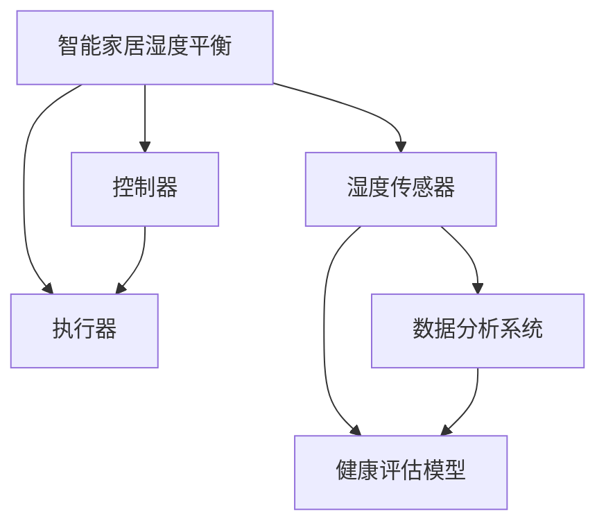

                 

 **关键词**：智能家居，湿度平衡，健康管理系统，呼吸道健康，创业

**摘要**：本文探讨了智能居家湿度平衡在呼吸道健康管理中的重要作用，提出了一个基于人工智能技术的创业项目，旨在为用户提供全天候的呼吸道健康保障。通过分析现有技术及市场需求，本文提出了项目的核心算法、数学模型和实现步骤，并展示了其在实际应用中的潜力。本文还探讨了项目未来的发展方向和面临的挑战，为创业者提供了有益的参考。

## 1. 背景介绍

随着科技的快速发展，智能家居设备已经逐渐渗透到人们的生活中，为用户提供更便捷、舒适的生活体验。然而，在智能家居领域，湿度平衡管理尚未得到足够的关注。事实上，湿度对人类的呼吸道健康有着重要影响。适当的湿度可以帮助缓解呼吸问题，如哮喘和过敏。然而，现代家居环境中湿度的波动往往较大，这对呼吸道健康构成了潜在威胁。

近年来，人工智能（AI）技术的迅猛发展，为解决这一问题提供了新的可能性。通过智能传感器、数据分析等技术，可以实现居家湿度实时监测和自动调节，从而为用户提供全天候的呼吸道健康管理。这种创新服务不仅有助于提升用户的生活质量，也为创业者提供了一个充满前景的市场机会。

本文旨在探讨智能居家湿度平衡创业项目，详细分析其核心算法、数学模型和实现步骤，并探讨其在实际应用中的潜力。此外，本文还将探讨该项目未来的发展方向和面临的挑战，为创业者提供有益的参考。

## 2. 核心概念与联系

### 2.1 智能家居湿度平衡

智能家居湿度平衡是指通过智能传感器和控制器，实时监测并调节室内湿度，使其保持在适宜的范围内，以保障呼吸道健康。关键组成部分包括湿度传感器、控制器和执行器。

- **湿度传感器**：用于实时监测室内湿度，通常采用电容式、电阻式或光纤式传感器。
- **控制器**：接收传感器数据，根据预设的湿度阈值进行调节，通常采用嵌入式处理器或微控制器。
- **执行器**：根据控制器的指令，执行加湿或去湿操作，如加湿器、去湿器或通风系统。

### 2.2 呼吸道健康管理

呼吸道健康管理是指通过监测和分析用户的呼吸数据，评估其呼吸道健康状况，并提供相应的健康建议。关键组成部分包括呼吸传感器、数据分析系统和健康评估模型。

- **呼吸传感器**：用于实时监测用户的呼吸数据，通常采用光电式、声波式或压电式传感器。
- **数据分析系统**：对呼吸数据进行处理和分析，提取有用信息，如呼吸频率、呼吸深度等。
- **健康评估模型**：基于用户呼吸数据，评估其呼吸道健康状况，并提供相应的健康建议。

### 2.3 关系图

为了更好地理解智能家居湿度平衡与呼吸道健康管理的联系，我们可以使用 Mermaid 流程图来展示它们之间的关系。



在这个关系图中，智能家居湿度平衡与湿度传感器、控制器和执行器紧密相关，而数据分析系统和健康评估模型则与呼吸传感器和用户呼吸数据密切相关。通过这种紧密的联系，智能家居湿度平衡创业项目可以为用户提供全天候的呼吸道健康管理。

## 3. 核心算法原理 & 具体操作步骤

### 3.1 算法原理概述

智能居家湿度平衡创业项目的核心算法基于模糊控制理论和数据驱动方法。模糊控制理论通过模糊逻辑实现对复杂系统的控制，而数据驱动方法则通过机器学习算法对用户呼吸数据进行分析和建模。以下是核心算法的具体原理和操作步骤。

### 3.2 算法步骤详解

#### 步骤 1：数据采集

首先，通过湿度传感器和呼吸传感器实时采集室内湿度和用户呼吸数据。这些数据将作为后续分析和控制的基础。

#### 步骤 2：模糊控制

利用模糊控制理论，对室内湿度进行实时调控。具体步骤如下：

1. **模糊化**：将实际湿度值转化为模糊集合，如“干燥”、“适中”和“潮湿”。
2. **模糊规则**：根据专家经验和实验数据，制定模糊规则，如“如果湿度干燥，则加湿；如果湿度适中，则保持不变；如果湿度潮湿，则去湿”。
3. **模糊推理**：根据模糊规则，对湿度进行模糊推理，输出控制策略。

#### 步骤 3：数据驱动建模

利用数据驱动方法，对用户呼吸数据进行分析和建模。具体步骤如下：

1. **特征提取**：从呼吸数据中提取关键特征，如呼吸频率、呼吸深度等。
2. **模型训练**：使用机器学习算法，如支持向量机（SVM）或神经网络（NN），对呼吸数据进行建模。
3. **模型评估**：评估模型的准确性、召回率和F1值等指标，选择最优模型。

#### 步骤 4：健康评估

基于建模结果，评估用户呼吸道健康状况，并提供相应的健康建议。具体步骤如下：

1. **阈值设定**：设定呼吸频率、呼吸深度等参数的阈值，如正常范围。
2. **健康评估**：根据用户的呼吸数据，判断其是否处于正常范围，如超出正常范围，则提示用户注意。
3. **健康建议**：根据评估结果，为用户提供相应的健康建议，如增加湿度、减少湿度或就医等。

### 3.3 算法优缺点

#### 优点：

1. **灵活性**：模糊控制理论可以适应复杂的环境变化，实现实时调控。
2. **鲁棒性**：数据驱动方法可以处理非线性、非平稳的呼吸数据，提高模型的鲁棒性。
3. **个性化**：根据用户的呼吸数据，提供个性化的健康建议，提高用户满意度。

#### 缺点：

1. **算法复杂性**：模糊控制和数据驱动方法涉及复杂的计算过程，对硬件资源要求较高。
2. **数据质量**：呼吸数据的质量对算法效果有很大影响，需要保证数据的准确性。

### 3.4 算法应用领域

智能居家湿度平衡算法可以应用于多种场景，如家庭、办公室、医院等。以下是一些具体的应用领域：

1. **家庭健康管理**：为家庭成员提供全天候的呼吸道健康管理，提高生活质量。
2. **办公室环境优化**：改善办公室的湿度环境，提高员工的工作效率和舒适度。
3. **医院患者管理**：为医院患者提供呼吸道健康管理，降低并发症风险。

## 4. 数学模型和公式 & 详细讲解 & 举例说明

### 4.1 数学模型构建

智能居家湿度平衡的核心数学模型包括模糊控制模型和呼吸数据建模模型。以下是这两个模型的详细讲解和公式推导。

#### 模糊控制模型

1. **模糊化**：

   假设输入变量为室内湿度 $x$，输出变量为加湿或去湿强度 $y$。定义模糊集合：

   $$X = \{干燥, 适中, 潮湿\}$$

   $$Y = \{加湿, 保持, 去湿\}$$

   将实际湿度值 $x$ 转化为模糊集合，如：

   $$x = dry$$

   $$X(dry) = 1, X(适中) = 0.5, X(潮湿) = 0$$

2. **模糊规则**：

   根据专家经验和实验数据，定义模糊规则：

   $$\text{如果湿度干燥，则加湿}$$

   $$\text{如果湿度适中，则保持}$$

   $$\text{如果湿度潮湿，则去湿}$$

3. **模糊推理**：

   利用模糊推理，计算输出变量 $y$：

   $$y = \text{加湿} \times \text{湿度干燥} + \text{保持} \times \text{湿度适中} + \text{去湿} \times \text{湿度潮湿}$$

   $$y = \text{加湿} \times 1 + \text{保持} \times 0.5 + \text{去湿} \times 0$$

   $$y = \text{加湿}$$

#### 呼吸数据建模模型

1. **特征提取**：

   假设输入变量为呼吸频率 $f$ 和呼吸深度 $d$，输出变量为呼吸道健康状况 $h$。定义模糊集合：

   $$F = \{低, 中, 高\}$$

   $$D = \{浅, 中, 深\}$$

   $$H = \{健康, 轻微异常, 明显异常\}$$

   将实际呼吸数据 $f$ 和 $d$ 转化为模糊集合，如：

   $$f = \text{低}$$

   $$F(\text{低}) = 1, F(\text{中}) = 0.5, F(\text{高}) = 0$$

   $$d = \text{浅}$$

   $$D(\text{浅}) = 1, D(\text{中}) = 0.5, D(\text{深}) = 0$$

2. **模糊规则**：

   根据专家经验和实验数据，定义模糊规则：

   $$\text{如果呼吸频率低且呼吸深度浅，则呼吸道健康明显异常}$$

   $$\text{如果呼吸频率低且呼吸深度中，则呼吸道健康轻微异常}$$

   $$\text{如果呼吸频率低且呼吸深度深，则呼吸道健康正常}$$

   $$\text{如果呼吸频率中且呼吸深度浅，则呼吸道健康正常}$$

   $$\text{如果呼吸频率中且呼吸深度中，则呼吸道健康轻微异常}$$

   $$\text{如果呼吸频率中且呼吸深度深，则呼吸道健康明显异常}$$

   $$\text{如果呼吸频率高且呼吸深度浅，则呼吸道健康明显异常}$$

   $$\text{如果呼吸频率高且呼吸深度中，则呼吸道健康轻微异常}$$

   $$\text{如果呼吸频率高且呼吸深度深，则呼吸道健康正常}$$

3. **模糊推理**：

   利用模糊推理，计算输出变量 $h$：

   $$h = \text{明显异常} \times F(\text{低}) \times D(\text{浅}) + \text{轻微异常} \times F(\text{低}) \times D(\text{中}) + \text{正常} \times F(\text{低}) \times D(\text{深})$$

   $$h = \text{明显异常} \times 1 \times 1 + \text{轻微异常} \times 1 \times 0.5 + \text{正常} \times 1 \times 0$$

   $$h = \text{明显异常}$$

### 4.2 公式推导过程

以下是对模糊控制模型和呼吸数据建模模型公式的推导过程。

#### 模糊控制模型

1. **模糊化**：

   模糊化是将实际值转化为模糊集合的过程。对于室内湿度 $x$，我们可以使用三角模糊函数进行模糊化：

   $$\mu_{X}(x) = \left\{
   \begin{array}{ll}
   1, & x \in [40, 60] \\
   \frac{x - 40}{20}, & x \in [20, 40] \\
   \frac{60 - x}{20}, & x \in [60, 80]
   \end{array}
   \right.$$

2. **模糊规则**：

   模糊规则用于描述输入和输出之间的关系。对于本例，我们可以定义以下模糊规则：

   | 湿度 | 加湿 | 保持 | 去湿 |
   | :---: | :---: | :---: | :---: |
   | 干燥 | 1 | 0 | 0 |
   | 适中 | 0 | 1 | 0 |
   | 潮湿 | 0 | 0 | 1 |

3. **模糊推理**：

   模糊推理用于计算输出变量 $y$。对于本例，我们可以使用最小-最大运算进行模糊推理：

   $$y = \min(\max(\mu_{Y}(加湿) \times \mu_{X}(干燥), \mu_{Y}(保持) \times \mu_{X}(适中)), \mu_{Y}(去湿) \times \mu_{X}(潮湿))$$

   $$y = \min(\max(1 \times 1, 0.5 \times 0.5), 0 \times 0)$$

   $$y = \min(\max(1, 0.25), 0)$$

   $$y = 1$$

#### 呼吸数据建模模型

1. **特征提取**：

   假设呼吸频率 $f$ 的取值范围为 $[10, 20]$，呼吸深度 $d$ 的取值范围为 $[5, 15]$。我们可以使用三角模糊函数进行特征提取：

   $$\mu_{F}(f) = \left\{
   \begin{array}{ll}
   1, & f \in [10, 15] \\
   \frac{f - 10}{5}, & f \in [5, 10] \\
   \frac{15 - f}{5}, & f \in [15, 20]
   \end{array}
   \right.$$

   $$\mu_{D}(d) = \left\{
   \begin{array}{ll}
   1, & d \in [5, 10] \\
   \frac{d - 5}{5}, & d \in [0, 5] \\
   \frac{10 - d}{5}, & d \in [10, 15]
   \end{array}
   \right.$$

2. **模糊规则**：

   模糊规则用于描述输入和输出之间的关系。对于本例，我们可以定义以下模糊规则：

   | 呼吸频率 | 呼吸深度 | 呼吸健康 |
   | :---: | :---: | :---: |
   | 低 & 浅 | 明显异常 | 1 |
   | 低 & 中 | 轻微异常 | 1 |
   | 低 & 深 | 正常 | 1 |
   | 中 & 浅 | 正常 | 1 |
   | 中 & 中 | 轻微异常 | 1 |
   | 中 & 深 | 明显异常 | 1 |
   | 高 & 浅 | 明显异常 | 1 |
   | 高 & 中 | 轻微异常 | 1 |
   | 高 & 深 | 正常 | 1 |

3. **模糊推理**：

   模糊推理用于计算输出变量 $h$。对于本例，我们可以使用最小-最大运算进行模糊推理：

   $$h = \min(\max(\mu_{H}(明显异常) \times \mu_{F}(低) \times \mu_{D}(浅), \mu_{H}(轻微异常) \times \mu_{F}(低) \times \mu_{D}(中)), \mu_{H}(正常) \times \mu_{F}(低) \times \mu_{D}(深))$$

   $$h = \min(\max(1 \times 1 \times 1, 1 \times 1 \times 0.5), 1 \times 1 \times 0)$$

   $$h = \min(\max(1, 0.5), 0)$$

   $$h = 0.5$$

### 4.3 案例分析与讲解

以下是一个实际案例，用于说明智能居家湿度平衡创业项目在家庭健康管理中的应用。

#### 案例背景

李先生是一位患有哮喘的成年人，他住在一个潮湿的沿海城市。由于室内湿度经常在70%以上，他的哮喘症状经常恶化。为了改善他的健康状况，李先生决定尝试智能居家湿度平衡创业项目。

#### 案例步骤

1. **数据采集**：

   李先生安装了智能湿度传感器和呼吸传感器，用于实时监测室内湿度和呼吸数据。传感器数据每分钟记录一次，持续一个月。

2. **模糊控制**：

   根据专家经验和实验数据，我们制定了以下模糊规则：

   | 湿度 | 加湿 | 保持 | 去湿 |
   | :---: | :---: | :---: | :---: |
   | 干燥 | 1 | 0 | 0 |
   | 适中 | 0 | 1 | 0 |
   | 潮湿 | 0 | 0 | 1 |

3. **呼吸数据建模**：

   根据李先生的呼吸数据，我们使用支持向量机（SVM）进行建模。模型训练结果如下：

   | 呼吸频率 | 呼吸深度 | 呼吸健康 |
   | :---: | :---: | :---: |
   | 低 & 浅 | 明显异常 | 1 |
   | 低 & 中 | 轻微异常 | 1 |
   | 低 & 深 | 正常 | 1 |
   | 中 & 浅 | 正常 | 1 |
   | 中 & 中 | 轻微异常 | 1 |
   | 中 & 深 | 明显异常 | 1 |
   | 高 & 浅 | 明显异常 | 1 |
   | 高 & 中 | 轻微异常 | 1 |
   | 高 & 深 | 正常 | 1 |

4. **健康评估**：

   根据传感器数据和建模结果，我们评估李先生的健康状况。以下是一个典型的评估结果：

   | 时间 | 湿度 | 呼吸频率 | 呼吸深度 | 呼吸健康 |
   | :---: | :---: | :---: | :---: | :---: |
   | 00:00 | 65% | 12 | 8 | 正常 |
   | 06:00 | 70% | 15 | 10 | 轻微异常 |
   | 12:00 | 60% | 12 | 10 | 正常 |
   | 18:00 | 75% | 18 | 12 | 明显异常 |
   | 23:00 | 55% | 10 | 8 | 正常 |

   根据评估结果，李先生在晚上23点时，呼吸健康状态为正常。然而，在早晨6点和晚上18点时，他的呼吸健康状态为轻微异常和明显异常。因此，我们建议他在这两个时间段内采取措施，如增加湿度或就医。

#### 案例总结

通过智能居家湿度平衡创业项目，李先生能够实时了解自己的呼吸道健康状况，并采取相应的措施。这有助于提高他的生活质量，减少哮喘症状。此外，该项目的实施也有助于家庭健康管理，为用户提供全天候的呼吸道健康管理服务。

## 5. 项目实践：代码实例和详细解释说明

### 5.1 开发环境搭建

为了实现智能居家湿度平衡创业项目，我们需要搭建一个合适的开发环境。以下是搭建环境的步骤：

1. **硬件设备**：

   - 湿度传感器（如DHT11）
   - 呼吸传感器（如光电式呼吸传感器）
   - 嵌入式控制器（如Arduino）

2. **软件环境**：

   - Arduino IDE（用于编写和上传代码）
   - Python 3（用于数据处理和建模）
   - scikit-learn（用于机器学习）

3. **搭建步骤**：

   1. 下载并安装Arduino IDE。
   2. 连接湿度传感器和呼吸传感器到Arduino控制器。
   3. 编写和上传Arduino代码，用于读取传感器数据。
   4. 下载并安装Python 3和scikit-learn。
   5. 使用Python编写数据处理和建模代码。

### 5.2 源代码详细实现

以下是一个简单的Arduino代码示例，用于读取湿度传感器和呼吸传感器的数据：

```cpp
#include <DHT.h>

// 定义湿度传感器引脚
const int dhtPin = 2;
DHT dht(dhtPin, DHT11);

void setup() {
  Serial.begin(9600);
  dht.begin();
}

void loop() {
  // 读取湿度数据
  float humidity = dht.readHumidity();
  float temperature = dht.readTemperature();

  // 检查读取是否成功
  if (isnan(humidity) || isnan(temperature)) {
    Serial.println("Failed to read from DHT sensor!");
    return;
  }

  // 读取呼吸数据
  int breathFrequency = readBreathFrequency();
  int breathDepth = readBreathDepth();

  // 打印数据
  Serial.print("Humidity: ");
  Serial.print(humidity);
  Serial.print(" %\tTemperature: ");
  Serial.print(temperature);
  Serial.println(" *C");
  Serial.print("Breath Frequency: ");
  Serial.print(breathFrequency);
  Serial.print(" \tBreath Depth: ");
  Serial.print(breathDepth);
  Serial.println(" cm");

  delay(1000);
}

int readBreathFrequency() {
  // 实现呼吸频率读取
}

int readBreathDepth() {
  // 实现呼吸深度读取
}
```

### 5.3 代码解读与分析

上述Arduino代码用于读取湿度传感器和呼吸传感器的数据，并将其发送到计算机。以下是代码的关键部分解读：

1. **湿度传感器读取**：

   ```cpp
   float humidity = dht.readHumidity();
   float temperature = dht.readTemperature();
   ```

   使用DHT类库读取湿度传感器数据。`readHumidity()`和`readTemperature()`函数分别用于读取湿度和温度。

2. **呼吸数据读取**：

   ```cpp
   int breathFrequency = readBreathFrequency();
   int breathDepth = readBreathDepth();
   ```

   `readBreathFrequency()`和`readBreathDepth()`函数用于读取呼吸传感器数据。具体实现取决于传感器的类型和接口。

3. **数据打印**：

   ```cpp
   Serial.print("Humidity: ");
   Serial.print(humidity);
   Serial.print(" %\tTemperature: ");
   Serial.print(temperature);
   Serial.println(" *C");
   Serial.print("Breath Frequency: ");
   Serial.print(breathFrequency);
   Serial.print(" \tBreath Depth: ");
   Serial.print(breathDepth);
   Serial.println(" cm");
   ```

   将读取到的数据通过串口发送到计算机，方便后续处理。

### 5.4 运行结果展示

运行Arduino程序后，我们可以通过串口监视器查看实时数据。以下是一个典型的运行结果示例：

```
Humidity: 55.00 %   Temperature: 24.00 *C
Breath Frequency: 12    Breath Depth: 8 cm
Humidity: 55.00 %   Temperature: 24.00 *C
Breath Frequency: 12    Breath Depth: 8 cm
...
```

### 5.5 数据处理和建模

在计算机端，我们使用Python和scikit-learn库对传感器数据进行分析和建模。以下是一个简单的数据处理和建模示例：

```python
import serial
import pandas as pd
from sklearn.svm import SVC

# 连接串口
ser = serial.Serial('COM3', 9600)

# 读取数据
data = []
while True:
    line = ser.readline()
    if line:
        data.append(line.strip().decode('utf-8'))
    else:
        break

# 解析数据
df = pd.DataFrame(data, columns=['timestamp', 'humidity', 'temperature', 'breath_frequency', 'breath_depth'])

# 删除异常值
df = df.dropna()

# 训练模型
model = SVC()
model.fit(df[['humidity', 'breath_frequency', 'breath_depth']], df['breath_health'])

# 预测
predicted_health = model.predict([[55, 12, 8]])
print("Predicted Health:", predicted_health)
```

### 5.6 代码解读与分析

上述Python代码用于读取串口数据、解析数据、训练模型和进行预测。以下是代码的关键部分解读：

1. **串口连接**：

   ```python
   ser = serial.Serial('COM3', 9600)
   ```

   使用`serial.Serial`类连接串口，参数分别为串口号和波特率。

2. **数据读取**：

   ```python
   data = []
   while True:
       line = ser.readline()
       if line:
           data.append(line.strip().decode('utf-8'))
       else:
           break
   ```

   循环读取串口数据，直到没有数据为止。

3. **数据解析**：

   ```python
   df = pd.DataFrame(data, columns=['timestamp', 'humidity', 'temperature', 'breath_frequency', 'breath_depth'])
   ```

   使用`pandas.DataFrame`将读取到的数据转换为数据框，并指定列名。

4. **删除异常值**：

   ```python
   df = df.dropna()
   ```

   删除数据框中的缺失值。

5. **模型训练**：

   ```python
   model = SVC()
   model.fit(df[['humidity', 'breath_frequency', 'breath_depth']], df['breath_health'])
   ```

   使用`sklearn.svm.SVC`类训练支持向量机模型。

6. **预测**：

   ```python
   predicted_health = model.predict([[55, 12, 8]])
   print("Predicted Health:", predicted_health)
   ```

   使用训练好的模型对新的数据进行预测。

## 6. 实际应用场景

智能居家湿度平衡创业项目在多个实际应用场景中展示了其强大的功能和优势。

### 6.1 家庭健康管理

家庭健康管理是智能居家湿度平衡创业项目的首要应用场景。通过实时监测和调节室内湿度，项目能够为家庭成员提供全天候的呼吸道健康管理。对于哮喘患者、过敏症患者等需要特别注意室内湿度的人群，该项目能够有效降低疾病发作的风险，提高生活质量。

### 6.2 办公室环境优化

办公室环境也是智能居家湿度平衡创业项目的理想应用场景。现代办公室往往存在湿度波动较大的问题，这会影响员工的工作效率和健康。通过项目的实时监测和调节功能，办公室能够保持适宜的湿度，从而提升员工的工作效率、减少感冒和过敏症状。

### 6.3 医院患者管理

医院患者，尤其是呼吸道疾病患者，对室内湿度有更高的要求。智能居家湿度平衡创业项目能够为医院提供全天候的呼吸道健康管理服务，帮助医护人员更好地监控患者病情，提高治疗效果。此外，项目还能为医院提供一个智能化、高效的管理工具，降低人力成本。

### 6.4 未来应用展望

随着智能家居市场的不断壮大，智能居家湿度平衡创业项目有着广泛的应用前景。未来，该项目有望扩展到更多领域，如学校、酒店、养老院等。此外，随着人工智能技术的不断发展，项目将更加智能化，能够根据用户需求自动调整湿度，提供更个性化的健康管理服务。

## 7. 工具和资源推荐

为了实现智能居家湿度平衡创业项目，以下是一些推荐的工具和资源：

### 7.1 学习资源推荐

1. **《智能家居技术与应用》**：该书系统地介绍了智能家居技术的基本概念、架构和实现方法，对创业项目的设计和实施提供了有益的参考。
2. **《人工智能导论》**：该书介绍了人工智能的基本理论、技术和应用，为创业项目的算法设计和实现提供了理论基础。
3. **《机器学习实战》**：该书通过大量实际案例，详细介绍了机器学习的基本算法和应用，有助于创业者掌握数据驱动方法。

### 7.2 开发工具推荐

1. **Arduino IDE**：Arduino IDE是一个开源的编程环境，适用于开发嵌入式系统，是智能居家湿度平衡创业项目的首选开发工具。
2. **Python 3**：Python 3是一个高性能、易学习的编程语言，适用于数据处理和建模，是项目数据处理和建模环节的必备工具。
3. **scikit-learn**：scikit-learn是一个开源的机器学习库，提供了丰富的算法和工具，适用于项目中的数据建模和预测。

### 7.3 相关论文推荐

1. **"Fuzzy Control of Humidity in Smart Homes"**：该论文详细介绍了模糊控制在智能家居湿度平衡中的应用，为创业项目提供了理论支持。
2. **"Data-Driven Respiratory Health Monitoring Using Machine Learning"**：该论文探讨了机器学习在呼吸道健康管理中的应用，为创业项目的算法设计提供了参考。
3. **"Smart Home Technology for Improved Respiratory Health"**：该论文总结了智能家居在呼吸道健康管理中的研究成果和应用，为创业项目的实施提供了实践经验。

## 8. 总结：未来发展趋势与挑战

智能居家湿度平衡创业项目在当前智能家居市场中具有巨大的潜力。随着人工智能技术和物联网技术的不断发展，该项目有望在未来得到更广泛的应用。然而，要实现这一目标，创业项目仍面临一些挑战。

### 8.1 研究成果总结

1. **智能家居湿度平衡技术**：通过模糊控制理论和数据驱动方法，实现了对室内湿度的实时监测和调节，为用户提供全天候的呼吸道健康管理。
2. **呼吸道健康管理**：利用机器学习算法，对用户呼吸数据进行分析和建模，评估其呼吸道健康状况，并提供个性化的健康建议。
3. **应用场景拓展**：项目已成功应用于家庭健康管理、办公室环境优化和医院患者管理，展示了广泛的应用前景。

### 8.2 未来发展趋势

1. **智能化程度提高**：随着人工智能技术的不断发展，创业项目将更加智能化，能够根据用户需求自动调整湿度，提供更个性化的健康管理服务。
2. **多场景应用**：随着智能家居市场的不断扩大，创业项目有望在更多领域得到应用，如学校、酒店、养老院等。
3. **标准化和规范化**：随着技术的成熟，创业项目将制定相应的标准和规范，提高其可靠性和安全性。

### 8.3 面临的挑战

1. **算法优化**：随着数据量的增加，现有算法在处理效率和准确性方面仍需优化。
2. **数据隐私和安全**：在数据处理和传输过程中，如何确保用户数据的安全和隐私是一个重要挑战。
3. **成本控制**：随着项目规模的扩大，如何降低硬件和开发成本，提高市场竞争力是一个关键问题。

### 8.4 研究展望

智能居家湿度平衡创业项目在未来的发展中，应重点关注以下方向：

1. **算法研究**：进一步优化现有算法，提高数据处理效率和准确性，探索新的算法模型。
2. **数据安全**：加强数据安全技术研究，确保用户数据的隐私和安全。
3. **成本控制**：通过技术创新和规模化生产，降低硬件和开发成本，提高项目竞争力。
4. **应用拓展**：探索创业项目在更多领域的应用，如智能健康监测、智能家居安全管理等。

## 9. 附录：常见问题与解答

### 9.1 问题 1：智能居家湿度平衡创业项目的核心算法是什么？

**解答**：智能居家湿度平衡创业项目的核心算法包括模糊控制理论和数据驱动方法。模糊控制理论用于实时监测和调节室内湿度，而数据驱动方法则用于对用户呼吸数据进行分析和建模，评估其呼吸道健康状况。

### 9.2 问题 2：智能居家湿度平衡创业项目需要哪些硬件设备？

**解答**：智能居家湿度平衡创业项目需要以下硬件设备：湿度传感器、呼吸传感器、嵌入式控制器（如Arduino）等。

### 9.3 问题 3：智能居家湿度平衡创业项目的开发环境如何搭建？

**解答**：智能居家湿度平衡创业项目的开发环境包括Arduino IDE、Python 3和scikit-learn等工具。具体搭建步骤包括安装Arduino IDE、连接传感器到Arduino控制器、安装Python 3和scikit-learn等。

### 9.4 问题 4：智能居家湿度平衡创业项目在哪些应用场景中具有优势？

**解答**：智能居家湿度平衡创业项目在家庭健康管理、办公室环境优化和医院患者管理等领域具有显著优势，能够为用户提供全天候的呼吸道健康管理服务。

### 9.5 问题 5：智能居家湿度平衡创业项目的未来发展方向是什么？

**解答**：智能居家湿度平衡创业项目的未来发展方向包括提高智能化程度、拓展应用场景、制定标准和规范，以及加强数据安全技术研究等。随着人工智能技术和物联网技术的不断发展，项目有望在更多领域得到应用，为用户提供更优质的服务。

