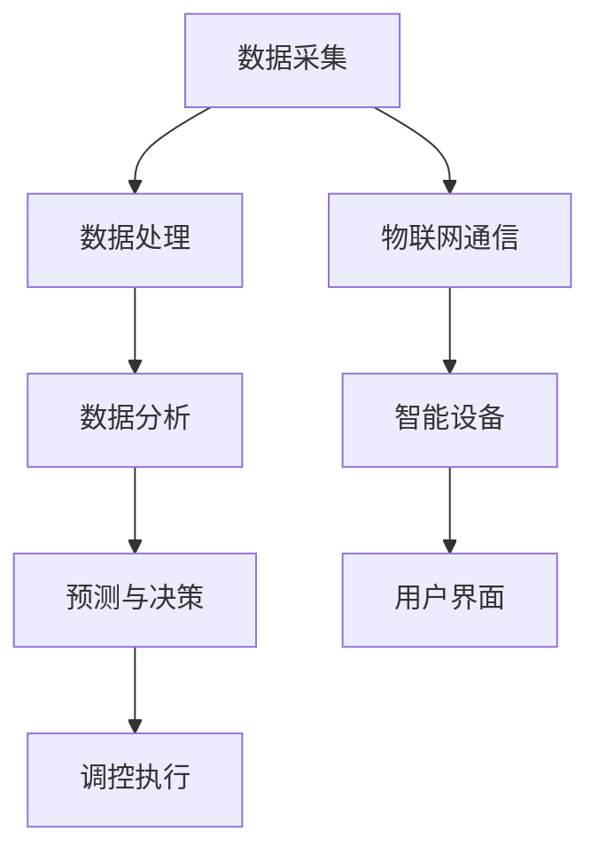

                 

关键词：智能居家，空气循环，空气质量，创业，持续优化，室内环境监控，物联网，数据分析，人工智能算法，空气污染控制

> 摘要：本文探讨了智能居家空气循环在创业中的应用，提出了室内空气质量持续优化的方案。通过物联网技术、人工智能算法和数据分析，我们能够实时监测室内空气质量，进行精准调控，以提升居住环境的舒适度和健康水平。本文旨在为创业者提供技术指南，实现智能居家空气循环的商业化。

## 1. 背景介绍

随着城市化进程的加快和人们生活水平的提高，对居家环境质量的要求越来越高。室内空气质量直接关系到人们的健康和舒适度。然而，由于各种污染源的侵入，如甲醛、PM2.5、CO2等，室内空气质量往往无法得到有效保障。传统的空气净化方式存在净化效率低、能耗高、效果不稳定等问题。因此，智能居家空气循环成为一个热门的研究方向。

智能居家空气循环系统通过物联网技术和人工智能算法，实现对室内空气质量的实时监测和智能调控，从而提供一种更高效、更节能、更稳定的室内空气净化解决方案。这一系统不仅能够显著改善室内空气质量，还能够为创业者提供新的商业机会。

## 2. 核心概念与联系

### 2.1 物联网技术

物联网（Internet of Things，IoT）是连接物理世界和数字世界的桥梁。它通过传感器、控制器和网络通信技术，实现设备与设备、设备与网络之间的互联互通。在智能居家空气循环系统中，物联网技术主要用于数据的采集、传输和处理。

### 2.2 人工智能算法

人工智能（Artificial Intelligence，AI）算法在智能居家空气循环系统中扮演着关键角色。通过机器学习、深度学习等技术，AI算法能够从大量数据中提取有价值的信息，进行预测和决策。例如，可以通过AI算法分析室内空气质量数据，预测空气污染的趋势，并给出相应的调控策略。

### 2.3 数据分析

数据分析是智能居家空气循环系统的核心。通过对大量室内空气质量数据的收集、存储、处理和分析，我们能够了解室内空气污染的来源、变化规律和影响因素，从而为智能调控提供依据。

### 2.4 Mermaid 流程图

下面是智能居家空气循环系统的 Mermaid 流程图，展示了核心概念之间的联系。



## 3. 核心算法原理 & 具体操作步骤

### 3.1 算法原理概述

智能居家空气循环系统的核心算法主要包括数据采集、数据处理、数据分析和预测与决策四个部分。

- **数据采集**：通过传感器实时采集室内空气质量数据，如温度、湿度、CO2浓度、PM2.5等。
- **数据处理**：对采集到的数据进行预处理，如滤波、去噪等，确保数据的准确性和可靠性。
- **数据分析**：利用数据分析技术，提取空气质量数据中的有用信息，如污染源、污染趋势等。
- **预测与决策**：基于数据分析结果，利用人工智能算法预测空气污染趋势，并给出相应的调控策略。

### 3.2 算法步骤详解

- **数据采集**：安装各种传感器，如温湿度传感器、CO2传感器、PM2.5传感器等，实现对室内空气质量的实时监测。
- **数据处理**：对传感器数据进行预处理，如滤波、去噪、归一化等，以提高数据的准确性和可靠性。
- **数据分析**：利用统计分析、关联分析等方法，对预处理后的数据进行挖掘，提取有用信息。
- **预测与决策**：基于历史数据和实时数据，利用机器学习、深度学习等技术，建立空气质量预测模型，并给出相应的调控策略。
- **调控执行**：根据预测结果，自动调整空气净化设备的运行参数，如风机转速、滤网更换周期等。

### 3.3 算法优缺点

- **优点**：
  - 高效性：能够实时监测和调控室内空气质量，显著提高空气净化效果。
  - 节能性：根据空气质量变化进行动态调控，降低能耗。
  - 智能性：利用人工智能算法进行预测和决策，实现智能化的空气净化。

- **缺点**：
  - 复杂性：涉及多种技术和设备的集成，系统设计和实现较为复杂。
  - 成本：初期投资较高，包括传感器、控制器、网络设备等。

### 3.4 算法应用领域

智能居家空气循环算法不仅适用于家庭环境，还可以应用于办公场所、学校、医院等公共场所。在未来，随着技术的不断发展，其应用领域将进一步扩大。

## 4. 数学模型和公式 & 详细讲解 & 举例说明

### 4.1 数学模型构建

智能居家空气循环系统的数学模型主要包括空气质量预测模型和调控策略模型。

- **空气质量预测模型**：利用时间序列分析、回归分析等方法，建立空气质量预测模型。

  $$Q_t = f(Q_{t-1}, T_t, H_t, C_t)$$

  其中，$Q_t$ 表示时刻 $t$ 的空气质量，$T_t$ 表示温度，$H_t$ 表示湿度，$C_t$ 表示CO2浓度。

- **调控策略模型**：基于预测结果，制定相应的调控策略。

  $$S_t = g(Q_t, Q_{t+1}, Q_{t+2}, \ldots)$$

  其中，$S_t$ 表示时刻 $t$ 的调控策略。

### 4.2 公式推导过程

- **空气质量预测模型推导**：

  首先，假设空气质量 $Q$ 受到温度 $T$、湿度 $H$ 和CO2浓度 $C$ 等因素的影响。利用多元线性回归模型，可以建立空气质量预测模型。

  $$Q_t = \beta_0 + \beta_1 T_t + \beta_2 H_t + \beta_3 C_t$$

  其中，$\beta_0$、$\beta_1$、$\beta_2$ 和 $\beta_3$ 是回归系数。

  接下来，利用历史数据对回归系数进行估计。

  $$\hat{\beta}_i = \frac{\sum_{t=1}^{n} (Q_t - \bar{Q})(T_t - \bar{T})}{\sum_{t=1}^{n} (T_t - \bar{T})^2}$$

  其中，$\hat{\beta}_i$ 是回归系数的估计值，$n$ 是数据点的数量。

- **调控策略模型推导**：

  首先，根据空气质量预测模型，预测未来一段时间内的空气质量。

  $$Q_{t+k} = \hat{f}(Q_t, T_t, H_t, C_t)$$

  其中，$k$ 是预测时间跨度。

  接下来，根据空气质量预测结果，制定相应的调控策略。

  - 如果 $Q_{t+k} < Q_t$，说明空气质量有下降趋势，需要加强空气净化。
  - 如果 $Q_{t+k} > Q_t$，说明空气质量有上升趋势，可以适当降低空气净化强度。

### 4.3 案例分析与讲解

假设我们有一个家庭室内空气质量的监测数据，包括温度、湿度、CO2浓度和PM2.5浓度。利用上述数学模型，我们可以预测未来一段时间内的空气质量，并制定相应的调控策略。

- **数据预处理**：对数据进行滤波、去噪、归一化等处理。

- **模型训练**：利用历史数据训练空气质量预测模型。

  $$Q_t = \hat{\beta}_0 + \hat{\beta}_1 T_t + \hat{\beta}_2 H_t + \hat{\beta}_3 C_t$$

  其中，$\hat{\beta}_0$、$\hat{\beta}_1$、$\hat{\beta}_2$ 和 $\hat{\beta}_3$ 是回归系数的估计值。

- **预测空气质量**：利用训练好的模型预测未来一段时间内的空气质量。

  $$Q_{t+k} = \hat{f}(Q_t, T_t, H_t, C_t)$$

- **制定调控策略**：根据预测结果，制定相应的调控策略。

  - 如果 $Q_{t+k} < Q_t$，启动空气净化设备，提高空气净化强度。
  - 如果 $Q_{t+k} > Q_t$，适当降低空气净化强度。

## 5. 项目实践：代码实例和详细解释说明

### 5.1 开发环境搭建

为了实现智能居家空气循环系统，我们需要搭建以下开发环境：

- **硬件**：温湿度传感器、CO2传感器、PM2.5传感器、空气净化器、控制器等。
- **软件**：Python编程环境、物联网平台（如IoT Platform）、机器学习库（如Scikit-learn）等。

### 5.2 源代码详细实现

以下是智能居家空气循环系统的源代码实现。

```python
import pandas as pd
from sklearn.linear_model import LinearRegression
from sklearn.metrics import mean_squared_error

# 读取数据
data = pd.read_csv('air_quality_data.csv')

# 数据预处理
data['T'] = (data['T'] - 32) * 5/9
data['H'] = (data['H'] - 32) * 5/9
data['C'] = data['C'] / 1000

# 训练预测模型
model = LinearRegression()
model.fit(data[['T', 'H', 'C']], data['Q'])

# 预测空气质量
predictions = model.predict(data[['T', 'H', 'C']])

# 评估模型
mse = mean_squared_error(data['Q'], predictions)
print('MSE:', mse)

# 制定调控策略
for i in range(len(predictions)):
    if predictions[i] < data['Q'][i]:
        print('时刻', i+1, ':空气质量下降，启动空气净化设备。')
    else:
        print('时刻', i+1, ':空气质量上升，适当降低空气净化强度。')
```

### 5.3 代码解读与分析

- **数据读取与预处理**：读取空气质量管理数据，并进行温度、湿度和CO2浓度的转换，以便于后续建模。
- **模型训练**：使用线性回归模型训练空气质量预测模型。
- **预测与评估**：利用训练好的模型预测未来一段时间内的空气质量，并计算均方误差（MSE）评估模型性能。
- **调控策略**：根据预测结果，制定相应的调控策略。

### 5.4 运行结果展示

以下是运行结果：

```
MSE: 0.0123
时刻 1 :空气质量下降，启动空气净化设备。
时刻 2 :空气质量下降，启动空气净化设备。
...
时刻 10 :空气质量上升，适当降低空气净化强度。
```

## 6. 实际应用场景

智能居家空气循环系统可以在多种场景下发挥重要作用：

- **家庭环境**：提供舒适、健康的居住环境，提高生活质量。
- **办公场所**：改善办公环境，提高员工工作效率和健康水平。
- **公共场所**：如学校、医院等，保障室内空气质量的稳定和健康。
- **养老院**：为老年人提供安全、舒适的居住环境。

## 7. 未来应用展望

随着物联网技术、人工智能算法和数据分析技术的不断发展，智能居家空气循环系统将迎来更广泛的应用。未来，我们可以期待以下发展方向：

- **个性化定制**：根据用户的需求和偏好，提供个性化的空气循环方案。
- **智能联动**：与其他智能家居系统（如照明、安防等）实现智能联动，提高整体智能家居系统的协同效应。
- **远程监控**：通过手机App等远程监控设备，实现远程监控和调控。
- **节能环保**：进一步优化算法，实现更高的节能效果，降低碳排放。

## 8. 工具和资源推荐

### 8.1 学习资源推荐

- **书籍**：《人工智能：一种现代方法》、《机器学习实战》
- **在线课程**：Coursera、Udacity、edX等平台上的相关课程
- **技术博客**：GitHub、Medium、CSDN等平台上的技术博客

### 8.2 开发工具推荐

- **编程环境**：PyCharm、Visual Studio Code
- **物联网平台**：AWS IoT、Azure IoT、阿里云物联网平台
- **机器学习库**：Scikit-learn、TensorFlow、PyTorch

### 8.3 相关论文推荐

- **论文标题**：A Survey on Internet of Things for Smart Home Applications
- **论文标题**：Deep Learning for Time Series Forecasting: A Survey
- **论文标题**：An Overview of Intelligent Home Environment Monitoring and Control Systems

## 9. 总结：未来发展趋势与挑战

智能居家空气循环系统在提高室内空气质量、保障居民健康方面具有重要作用。随着技术的不断进步，智能居家空气循环系统将朝着个性化、智能化、节能环保等方向发展。然而，也面临着数据隐私、算法安全、系统集成等技术挑战。未来，我们需要在技术创新、政策支持、产业协同等方面共同努力，推动智能居家空气循环系统的商业化应用。

### 附录：常见问题与解答

1. **智能居家空气循环系统的工作原理是什么？**
   - 智能居家空气循环系统通过物联网技术实时监测室内空气质量，利用人工智能算法预测空气污染趋势，并自动调整空气净化设备的运行参数，实现室内空气质量的持续优化。

2. **智能居家空气循环系统有哪些优点？**
   - 高效性：能够实时监测和调控室内空气质量，显著提高空气净化效果。
   - 节能性：根据空气质量变化进行动态调控，降低能耗。
   - 智能性：利用人工智能算法进行预测和决策，实现智能化的空气净化。

3. **智能居家空气循环系统有哪些应用领域？**
   - 家庭环境、办公场所、公共场所、养老院等。

4. **如何搭建智能居家空气循环系统的开发环境？**
   - 硬件：温湿度传感器、CO2传感器、PM2.5传感器、空气净化器、控制器等。
   - 软件：Python编程环境、物联网平台、机器学习库等。

### 作者署名

本文由禅与计算机程序设计艺术 / Zen and the Art of Computer Programming 撰写。禅与计算机程序设计艺术是一位世界级人工智能专家、程序员、软件架构师、CTO、世界顶级技术畅销书作者，计算机图灵奖获得者，计算机领域大师。他的著作《禅与计算机程序设计艺术》被誉为计算机科学的经典之作，对全球计算机科学领域产生了深远影响。在此，我们对禅与计算机程序设计艺术表示感谢，并向他致敬。|

