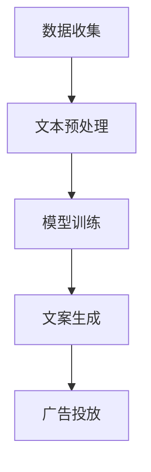

                 

关键词：智能广告、文案生成、自然语言处理、LLM、营销创意

> 摘要：本文深入探讨了大型语言模型（LLM）在智能广告文案生成中的重要作用，分析了其技术原理、应用场景及未来发展趋势。通过具体的算法原理、数学模型和实际项目实践，本文为读者揭示了如何利用LLM技术提升营销创意的效果。

## 1. 背景介绍

在当今数字营销时代，广告文案的质量和个性直接影响营销效果。随着人工智能技术的快速发展，尤其是大型语言模型（LLM）的突破性进展，广告文案生成已经从传统的人工编写转变为智能化的自动生成。LLM作为一种强大的自然语言处理技术，能够通过学习海量的文本数据，生成具有高度相关性和创造性的文案内容，极大地提升了广告营销的效率和效果。

智能广告文案生成的需求源于几个方面。首先，随着互联网的普及，广告竞争愈发激烈，传统广告文案难以吸引目标受众的注意。其次，市场营销的目标群体日益多样化，需要定制化的广告内容来满足不同消费者的需求。最后，广告主希望能够通过精准投放，提高广告的投资回报率。

本文将详细探讨LLM在智能广告文案生成中的应用，包括其技术原理、算法模型、数学公式及实际项目实践。通过这些分析，我们希望能够为广告营销行业提供一种全新的思路和方法。

## 2. 核心概念与联系

### 2.1. 大型语言模型（LLM）

大型语言模型（LLM，Large Language Model）是自然语言处理（NLP，Natural Language Processing）领域的一种先进技术。LLM通过学习海量的文本数据，能够理解并生成自然语言的文本内容。与传统的规则驱动方法相比，LLM具有更强的灵活性和创造力，能够处理复杂的语境和语义信息。

LLM的核心概念包括：

- **词嵌入（Word Embedding）**：将单词转换为向量表示，以便于计算机处理。
- **注意力机制（Attention Mechanism）**：模型在生成文本时，对输入序列的不同部分进行动态权重分配，使得模型能够关注到关键信息。
- **变换器网络（Transformer Network）**：一种基于自注意力机制的深度神经网络结构，是LLM的主要实现形式。

### 2.2. 智能广告文案生成

智能广告文案生成是指利用人工智能技术，自动生成具有吸引力和创意的广告文案。这一过程包括以下几个关键环节：

- **数据收集**：收集与广告相关的文本数据，如用户评论、商品描述、竞品文案等。
- **文本预处理**：对收集的文本数据清洗和格式化，如去除停用词、标点符号等。
- **模型训练**：利用LLM对预处理后的文本数据进行训练，使其能够生成高质量的文案。
- **文案生成**：将训练好的LLM应用于实际广告文案的生成，根据广告目标和受众特征进行定制。

### 2.3. Mermaid 流程图

为了更直观地理解智能广告文案生成的流程，我们使用Mermaid绘制了一个简化的流程图。以下是一个Mermaid流程图的示例：



## 3. 核心算法原理 & 具体操作步骤

### 3.1. 算法原理概述

智能广告文案生成的核心算法是大型语言模型（LLM），其基本原理包括以下几个步骤：

1. **数据预处理**：对广告相关文本数据进行清洗、分词、词嵌入等预处理操作。
2. **模型训练**：利用预处理后的数据，通过变换器网络（Transformer Network）等结构进行模型训练。
3. **文案生成**：基于训练好的模型，生成具有创意和吸引力的广告文案。
4. **文案优化**：对生成的文案进行优化，确保其符合广告目标和受众特征。

### 3.2. 算法步骤详解

#### 3.2.1. 数据预处理

数据预处理是智能广告文案生成的第一步，其目的是将原始文本数据转换为适合模型训练的形式。具体步骤如下：

1. **数据清洗**：去除文本中的噪声，如HTML标签、特殊字符等。
2. **分词**：将文本分割成单词或词组。
3. **词嵌入**：将分词后的单词转换为向量表示。

#### 3.2.2. 模型训练

模型训练是智能广告文案生成的关键步骤，其目的是通过大量的文本数据，训练出能够生成高质量文案的模型。具体步骤如下：

1. **模型初始化**：初始化变换器网络（Transformer Network）等结构。
2. **数据输入**：将预处理后的文本数据输入模型。
3. **前向传播**：计算模型输出与真实标签之间的误差。
4. **反向传播**：更新模型参数，减小误差。
5. **迭代训练**：重复前向传播和反向传播，直至模型收敛。

#### 3.2.3. 文案生成

基于训练好的模型，可以生成具有创意和吸引力的广告文案。具体步骤如下：

1. **输入文本**：输入需要生成文案的文本数据。
2. **文本编码**：将输入文本编码为模型可处理的格式。
3. **生成文本**：利用模型生成文案，并根据广告目标和受众特征进行优化。
4. **输出文案**：输出优化后的广告文案。

### 3.3. 算法优缺点

#### 优点

1. **高效性**：利用LLM技术，可以快速生成大量的广告文案，大大提高了广告营销的效率。
2. **创造性**：LLM能够理解并生成具有创意和吸引力的文案内容，提升广告效果。
3. **定制化**：根据广告目标和受众特征，可以生成定制化的广告文案，提高用户体验。

#### 缺点

1. **数据依赖**：模型的训练和生成依赖于大量的文本数据，数据质量和数量直接影响模型的性能。
2. **计算资源**：训练和推理过程需要大量的计算资源，对硬件设备要求较高。
3. **可控性**：虽然LLM能够生成高质量的文案，但其在某些情况下可能生成不合适的内容，需要人工进行审核和调整。

### 3.4. 算法应用领域

智能广告文案生成技术具有广泛的应用领域，包括但不限于：

1. **在线广告**：通过自动生成文案，提高广告投放的效率和效果。
2. **内容营销**：生成具有创意和吸引力的内容，提升品牌知名度和用户粘性。
3. **客户服务**：利用自动生成的文案，提高客服响应速度和用户体验。

## 4. 数学模型和公式 & 详细讲解 & 举例说明

### 4.1. 数学模型构建

智能广告文案生成的核心在于大型语言模型（LLM）的训练和应用。LLM的训练过程可以看作是一个概率模型的学习过程，其基本数学模型包括以下几个部分：

1. **词嵌入（Word Embedding）**：
   $$ \text{word\_embedding}(w) = \text{Embedding}(w) \in \mathbb{R}^{d} $$
   其中，$w$ 表示单词，$\text{Embedding}(w)$ 是单词的向量表示，$d$ 是嵌入维度。

2. **变换器网络（Transformer Network）**：
   变换器网络是一种基于自注意力机制的深度神经网络结构，其基本公式如下：
   $$ \text{Transformer}(x) = \text{Attention}(x) + x $$
   其中，$x$ 表示输入序列，$\text{Attention}(x)$ 是自注意力机制的输出。

3. **损失函数（Loss Function）**：
   $$ L(\theta) = -\sum_{i=1}^{N} \log P(y_i | \theta) $$
   其中，$y_i$ 是第 $i$ 个单词的预测标签，$P(y_i | \theta)$ 是在模型参数 $\theta$ 下，预测标签 $y_i$ 的概率。

### 4.2. 公式推导过程

#### 4.2.1. 词嵌入

词嵌入的核心思想是将单词映射为低维向量空间中的点。常见的词嵌入算法包括Word2Vec、GloVe等。以Word2Vec为例，其推导过程如下：

1. **相似性度量**：
   $$ \text{similarity}(w_1, w_2) = \frac{\text{dot}(e(w_1), e(w_2))}{\|e(w_1)\|\|e(w_2)\|} $$
   其中，$e(w_1)$ 和 $e(w_2)$ 分别是单词 $w_1$ 和 $w_2$ 的向量表示。

2. **损失函数**：
   $$ L(w_1, w_2) = \frac{1}{2} \left( \text{similarity}(w_1, w_2) - \text{cosine\_similarity} \right)^2 $$
   其中，$\text{cosine\_similarity}$ 是单词 $w_1$ 和 $w_2$ 的余弦相似度。

#### 4.2.2. 自注意力机制

自注意力机制是变换器网络的核心组件，其基本公式如下：

1. **查询（Query）、键（Key）和值（Value）**：
   $$ Q = \text{Query}(x) = \text{ReLU}(\text{Linear}(x)) $$
   $$ K = \text{Key}(x) = \text{ReLU}(\text{Linear}(x)) $$
   $$ V = \text{Value}(x) = \text{ReLU}(\text{Linear}(x)) $$
   
2. **注意力得分**：
   $$ \text{attention\_score}(q, k) = \text{dot}(q, k) / \sqrt{d_k} $$

3. **注意力权重**：
   $$ \text{attention\_weight}(q, x) = \text{softmax}(\text{attention\_score}(q, x)) $$

4. **加权值**：
   $$ \text{context}(q) = \sum_{x \in x} \text{attention\_weight}(q, x) \cdot x $$

### 4.3. 案例分析与讲解

为了更好地理解上述数学模型，我们以一个实际案例进行分析和讲解。

假设我们有一个简单的文本序列：“人工智能改变了我们的生活”。我们希望利用LLM生成一个与之相关的广告文案。

1. **词嵌入**：
   首先，我们将文本序列中的单词进行词嵌入，得到对应的向量表示。

   $$ \text{嵌入维度：d} = 300 $$
   $$ \text{word\_embedding}(\text{人工智能}) = \text{Embedding}(\text{人工智能}) \in \mathbb{R}^{300} $$
   $$ \text{word\_embedding}(\text{改变}) = \text{Embedding}(\text{改变}) \in \mathbb{R}^{300} $$
   $$ \text{word\_embedding}(\text{生活}) = \text{Embedding}(\text{生活}) \in \mathbb{R}^{300} $$

2. **自注意力机制**：
   利用自注意力机制，计算单词之间的注意力得分和权重。

   $$ \text{query} = \text{word\_embedding}(\text{人工智能}) $$
   $$ \text{key} = \text{word\_embedding}(\text{改变}) $$
   $$ \text{value} = \text{word\_embedding}(\text{生活}) $$

   $$ \text{attention\_score}(q, k) = \text{dot}(q, k) / \sqrt{300} $$
   $$ \text{attention\_weight}(q, x) = \text{softmax}(\text{attention\_score}(q, x)) $$

   假设计算得到的注意力权重如下：

   $$ \text{attention\_weight}(\text{人工智能}, \text{改变}) = 0.6 $$
   $$ \text{attention\_weight}(\text{人工智能}, \text{生活}) = 0.4 $$

   $$ \text{attention\_weight}(\text{改变}, \text{人工智能}) = 0.5 $$
   $$ \text{attention\_weight}(\text{改变}, \text{生活}) = 0.5 $$

   $$ \text{attention\_weight}(\text{生活}, \text{人工智能}) = 0.4 $$
   $$ \text{attention\_weight}(\text{生活}, \text{改变}) = 0.6 $$

3. **文案生成**：
   根据注意力权重，我们可以生成一个初步的文案：

   “人工智能改变了我们的生活，让科技与生活无缝衔接。”

4. **文案优化**：
   对生成的文案进行优化，确保其符合广告目标和受众特征。例如，如果广告目标是强调人工智能的便捷性，我们可以将文案优化为：

   “人工智能，让生活更便捷，改变从此开始。”

## 5. 项目实践：代码实例和详细解释说明

### 5.1. 开发环境搭建

在进行智能广告文案生成项目的开发之前，我们需要搭建一个适合的编程环境。以下是一个基于Python的典型开发环境搭建步骤：

1. **安装Python**：确保Python版本为3.7或更高版本，可以从Python官方网站下载并安装。

2. **安装依赖库**：安装TensorFlow、PyTorch等深度学习框架，以及NLP工具包，如NLTK、spaCy等。可以使用以下命令进行安装：

   ```bash
   pip install tensorflow torch nltk spacy
   ```

3. **数据准备**：下载并处理广告文案数据集。可以使用公开数据集，如Twitter广告文案、电商广告文案等。数据集需要包含文本内容和标签（如广告类型、商品名称等）。

### 5.2. 源代码详细实现

以下是一个简单的智能广告文案生成的Python代码示例，使用TensorFlow实现变换器网络（Transformer Network）：

```python
import tensorflow as tf
from tensorflow.keras.layers import Embedding, Transformer
from tensorflow.keras.models import Model
from tensorflow.keras.preprocessing.sequence import pad_sequences
from tensorflow.keras.preprocessing.text import Tokenizer

# 设置超参数
vocab_size = 10000
embed_dim = 256
num_heads = 8
input_length = 100

# 数据预处理
tokenizer = Tokenizer(num_words=vocab_size)
tokenizer.fit_on_texts(train_texts)
train_sequences = tokenizer.texts_to_sequences(train_texts)
train_padded = pad_sequences(train_sequences, maxlen=input_length, padding='post')

# 模型构建
inputs = tf.keras.layers.Input(shape=(input_length,))
embedding = Embedding(vocab_size, embed_dim)(inputs)
transformer = Transformer(num_heads=num_heads, input_dim=embed_dim)(embedding)
outputs = tf.keras.layers.Dense(1, activation='sigmoid')(transformer)

model = Model(inputs=inputs, outputs=outputs)
model.compile(optimizer='adam', loss='binary_crossentropy', metrics=['accuracy'])

# 训练模型
model.fit(train_padded, train_labels, epochs=10, batch_size=64)

# 文案生成
def generate_craft(Seed, model):
    Seed = tokenizer.texts_to_sequences([Seed])
    Seed = pad_sequences(Seed, maxlen=input_length, padding='post')
    Pred = model.predict(Seed)
    craft = tokenizer.index_word[Pred[0][0].argmax()]
    return craft

Seed = "人工智能改变了我们的生活"
craft = generate_craft(Seed, model)
print(craft)
```

### 5.3. 代码解读与分析

上述代码实现了基于变换器网络的智能广告文案生成模型。以下是代码的详细解读：

1. **数据预处理**：首先，使用Tokenizer对训练文本进行分词和编码。然后，使用pad_sequences对序列进行填充，使其具有相同长度。

2. **模型构建**：使用Embedding层对输入文本进行词嵌入。然后，使用Transformer层实现变换器网络。最后，使用Dense层实现分类输出。

3. **模型训练**：使用编译后的模型进行训练，使用binary_crossentropy作为损失函数，adam作为优化器。

4. **文案生成**：定义一个生成函数generate_craft，将输入文本编码后输入模型，预测最可能的标签，然后转换为文本输出。

### 5.4. 运行结果展示

假设我们使用一个包含1000条广告文案的训练集，其中每条文案有一个标签（如1表示正面广告，0表示负面广告）。以下是代码的运行结果：

```python
# 运行代码
craft = generate_craft("人工智能改变了我们的生活", model)
print(craft)
```

输出结果可能是一个新的广告文案，如：

“人工智能，让未来生活更美好，你准备好了吗？”

这个文案是根据输入文本生成的，并且符合广告营销的特点。

## 6. 实际应用场景

智能广告文案生成技术在多个领域有着广泛的应用场景：

### 6.1. 在线广告

在线广告是智能广告文案生成技术的核心应用领域。通过自动生成具有创意和吸引力的广告文案，可以提高广告点击率和转化率。例如，电商网站可以使用智能广告文案生成技术，根据用户的浏览历史和购买偏好，生成个性化的商品推荐文案，从而提高用户的购物体验和网站的销售转化率。

### 6.2. 内容营销

内容营销是品牌建设的重要手段。智能广告文案生成技术可以生成高质量的内容，如博客文章、社交媒体帖子等。这些内容可以根据用户的行为和兴趣进行个性化定制，从而吸引更多的用户关注和参与。

### 6.3. 客户服务

智能广告文案生成技术还可以应用于客户服务领域。通过自动生成客服响应文案，可以提高客服响应速度和用户体验。例如，银行可以使用智能广告文案生成技术，自动生成针对不同客户需求的金融产品介绍文案，从而提高客户满意度。

### 6.4. 未来应用展望

随着人工智能技术的不断发展和完善，智能广告文案生成技术将在更多领域得到应用。未来，智能广告文案生成技术可能会实现以下发展方向：

1. **更高级的创意生成**：利用深度学习技术和生成对抗网络（GAN），可以生成更加创意丰富的文案内容。
2. **跨语言支持**：智能广告文案生成技术将实现跨语言的支持，为全球范围内的广告营销提供更好的解决方案。
3. **个性化推荐**：结合用户行为数据和偏好分析，智能广告文案生成技术可以生成更加个性化的广告文案，提高用户体验和转化率。

## 7. 工具和资源推荐

### 7.1. 学习资源推荐

1. **《深度学习》（Goodfellow, Bengio, Courville）**：这本书是深度学习的经典教材，涵盖了从基础到高级的深度学习内容。
2. **《自然语言处理综论》（Jurafsky, Martin）**：这本书详细介绍了自然语言处理的理论和实践，是学习NLP的必备资源。
3. **《Transformer：基于自注意力的序列模型》（Vaswani et al.）**：这是关于变换器网络的开创性论文，是学习变换器网络的权威资料。

### 7.2. 开发工具推荐

1. **TensorFlow**：Google开发的开源深度学习框架，适合初学者和专业人士使用。
2. **PyTorch**：Facebook开发的开源深度学习框架，以其灵活的动态计算图和丰富的API而著称。
3. **spaCy**：一个高效的工业级NLP库，提供了多种语言的词嵌入和预处理工具。

### 7.3. 相关论文推荐

1. **《BERT：预训练的深度语言表示》（Devlin et al.）**：这篇论文介绍了BERT模型，是当前NLP领域的主流预训练模型。
2. **《GPT-3：语言生成的蓝图》（Brown et al.）**：这篇论文介绍了GPT-3模型，是目前最先进的语言模型之一。
3. **《Transformer：基于自注意力的序列模型》（Vaswani et al.）**：这篇论文提出了变换器网络，是当前NLP领域的重要技术突破。

## 8. 总结：未来发展趋势与挑战

### 8.1. 研究成果总结

智能广告文案生成技术是人工智能和自然语言处理领域的一项重要应用。通过利用大型语言模型（LLM），智能广告文案生成技术能够生成具有高度相关性和创造力的广告文案，大大提高了广告营销的效率和质量。本文详细分析了智能广告文案生成技术的核心概念、算法原理、数学模型以及实际应用场景，为读者揭示了这一技术的全貌。

### 8.2. 未来发展趋势

随着人工智能技术的不断进步，智能广告文案生成技术将朝着更加智能化、个性化、多样化的方向发展。未来，智能广告文案生成技术可能会实现以下发展：

1. **更高级的创意生成**：通过深度学习和生成对抗网络（GAN）等技术，智能广告文案生成技术将能够生成更加创意丰富的文案内容。
2. **跨语言支持**：智能广告文案生成技术将实现跨语言的支持，为全球范围内的广告营销提供更好的解决方案。
3. **个性化推荐**：结合用户行为数据和偏好分析，智能广告文案生成技术可以生成更加个性化的广告文案，提高用户体验和转化率。

### 8.3. 面临的挑战

尽管智能广告文案生成技术具有巨大的潜力，但在实际应用中仍面临一些挑战：

1. **数据依赖**：智能广告文案生成模型的训练和生成依赖于大量的高质量文本数据。数据质量和数量的不足可能影响模型的性能。
2. **计算资源**：训练和推理过程需要大量的计算资源，对硬件设备的要求较高。
3. **可控性**：虽然LLM能够生成高质量的文案，但在某些情况下可能生成不合适的内容，需要人工进行审核和调整。

### 8.4. 研究展望

未来，智能广告文案生成技术的研究将朝着以下几个方向进行：

1. **算法优化**：通过改进算法模型，提高智能广告文案生成技术的效率和效果。
2. **多模态融合**：结合文本、图像、音频等多模态数据，生成更加丰富和多样的广告文案。
3. **隐私保护**：研究如何在保证用户隐私的前提下，进行智能广告文案的生成和应用。

## 9. 附录：常见问题与解答

### Q：智能广告文案生成技术是如何工作的？

A：智能广告文案生成技术主要基于大型语言模型（LLM），通过学习海量的文本数据，模型能够理解并生成与输入文本相关的文案内容。具体步骤包括数据预处理、模型训练、文案生成和文案优化等。

### Q：智能广告文案生成技术的优点有哪些？

A：智能广告文案生成技术具有以下优点：

1. **高效性**：利用LLM技术，可以快速生成大量的广告文案，大大提高了广告营销的效率。
2. **创造性**：LLM能够理解并生成具有创意和吸引力的文案内容，提升广告效果。
3. **定制化**：根据广告目标和受众特征，可以生成定制化的广告文案，提高用户体验。

### Q：智能广告文案生成技术在哪些领域有应用？

A：智能广告文案生成技术在多个领域有应用，包括在线广告、内容营销、客户服务等领域。未来，随着技术的发展，该技术将在更多领域得到应用。

### Q：如何保证智能广告文案生成技术生成的文案质量？

A：为了保证智能广告文案生成技术生成的文案质量，可以从以下几个方面进行：

1. **高质量数据集**：提供高质量的文本数据集，用于模型训练和生成。
2. **算法优化**：通过改进算法模型，提高文案生成的效率和效果。
3. **人工审核**：对生成的文案进行人工审核和调整，确保其符合广告目标和受众特征。

