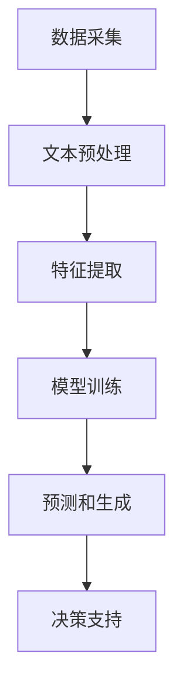

                 

关键词：智能建筑、自然语言处理、机器学习、能源管理、空间利用、LLM（语言理解模型）

> 摘要：随着人工智能技术的飞速发展，智能建筑管理成为现代城市建设中的重要环节。本文主要探讨了如何利用语言理解模型（LLM）来优化智能建筑的能源使用和空间利用，从而提高建筑的智能化水平和运行效率。通过对LLM在智能建筑管理中的应用进行深入分析，本文提出了一个全面的解决方案，旨在为智能建筑行业提供有益的参考。

## 1. 背景介绍

智能建筑是指利用现代信息技术，特别是物联网（IoT）、大数据和人工智能等技术，对建筑物的能源、环境、设备等进行智能管理和优化，以提高建筑的使用效率和居住舒适度。随着城市化进程的加快和能源消耗的不断增加，智能建筑管理显得尤为重要。传统的建筑管理模式已经无法满足现代建筑的需求，因此，如何利用人工智能技术来提升建筑管理效率成为了一个亟待解决的问题。

在智能建筑管理中，能源管理和空间利用是两个关键方面。能源管理涉及到如何通过智能技术来降低能源消耗、提高能源利用率，从而达到节能减排的目的。而空间利用则涉及到如何根据建筑的使用需求和人员流动情况，合理分配和调整建筑空间，以提高空间利用率和使用效率。

随着自然语言处理（NLP）和机器学习（ML）技术的发展，语言理解模型（LLM）作为一种重要的NLP技术，逐渐在智能建筑管理中得到了应用。LLM可以通过对建筑数据的深入理解和分析，提供更加智能化的管理和决策支持，从而优化能源使用和空间利用。

## 2. 核心概念与联系

### 2.1 智能建筑管理的基本概念

智能建筑管理包括多个方面，其中主要包括能源管理、环境管理、设备管理和安全管理。在这些方面，LLM可以发挥重要的作用。

- **能源管理**：LLM可以通过对建筑能源消耗数据的学习和分析，预测能源消耗的趋势，并提供节能建议，从而实现能源的高效利用。
- **环境管理**：LLM可以对建筑环境参数（如温度、湿度、空气质量等）进行实时监测和分析，提供环境优化的建议，从而提高居住舒适度。
- **设备管理**：LLM可以对建筑中的各种设备（如空调、照明、电梯等）进行智能监控和维护，提高设备运行效率和延长设备寿命。
- **安全管理**：LLM可以通过对建筑的安全数据进行学习和分析，预测潜在的安全隐患，并提供相应的安全建议，从而提高建筑的安全性。

### 2.2 语言理解模型（LLM）的概念和原理

LLM是一种基于深度学习的自然语言处理技术，它可以理解和生成自然语言。LLM的工作原理是通过大量的文本数据训练一个神经网络模型，使其能够对输入的文本进行理解和分析。

- **文本预处理**：LLM首先对输入的文本进行预处理，包括分词、词性标注、句法分析等。
- **特征提取**：然后，LLM通过神经网络模型对预处理后的文本进行特征提取，生成一个高维的特征向量。
- **预测和生成**：最后，LLM利用提取到的特征向量进行预测和生成，实现对输入文本的理解和生成。

### 2.3 Mermaid 流程图

以下是一个简化的智能建筑管理中LLM应用的Mermaid流程图：



在这个流程中，数据采集是整个流程的起点，通过传感器和监控系统等设备收集建筑相关的数据。然后，LLM对收集到的数据进行文本预处理，提取关键信息。接着，LLM利用训练好的神经网络模型对特征向量进行处理，生成预测结果。最后，LLM的预测结果被用于提供决策支持，从而实现智能建筑管理。

## 3. 核心算法原理 & 具体操作步骤

### 3.1 算法原理概述

LLM在智能建筑管理中的应用主要是基于其强大的文本处理和数据分析能力。通过以下步骤，LLM可以实现智能建筑管理的目标：

1. **数据采集**：收集建筑内的各种数据，包括能源消耗、环境参数、设备运行状态等。
2. **文本预处理**：对采集到的数据进行清洗和预处理，包括分词、去停用词、词性标注等。
3. **特征提取**：利用神经网络模型对预处理后的文本数据进行特征提取，生成高维特征向量。
4. **模型训练**：使用大量的文本数据对神经网络模型进行训练，使其能够对建筑数据进行有效理解和分析。
5. **预测和生成**：利用训练好的模型对新的数据进行预测，生成决策建议。
6. **决策支持**：根据预测结果提供智能化的决策支持，优化能源使用和空间利用。

### 3.2 算法步骤详解

#### 3.2.1 数据采集

数据采集是智能建筑管理的基础，它决定了模型的效果和性能。以下是数据采集的详细步骤：

1. **设备接入**：将建筑内的各种设备（如空调、照明、传感器等）接入物联网，实现数据的实时采集。
2. **数据同步**：通过数据同步技术，将设备采集到的数据实时传输到中央数据库。
3. **数据清洗**：对采集到的数据进行清洗，去除重复数据、异常数据和噪声数据。

#### 3.2.2 文本预处理

文本预处理是LLM处理数据的关键步骤，它决定了模型对数据的理解和分析能力。以下是文本预处理的详细步骤：

1. **分词**：将采集到的文本数据分解成单词或短语，以便进行进一步处理。
2. **词性标注**：对分词结果进行词性标注，标记每个词的词性（如名词、动词、形容词等）。
3. **句法分析**：对文本进行句法分析，提取句子结构，以便进行更深层次的处理。

#### 3.2.3 特征提取

特征提取是将预处理后的文本数据转化为机器可理解的向量表示。以下是特征提取的详细步骤：

1. **词嵌入**：使用词嵌入技术将单词映射到高维向量空间，以便进行特征提取。
2. **文本编码**：将句法分析后的文本转化为向量表示，如使用BERT模型进行编码。
3. **特征聚合**：将文本中的所有特征向量进行聚合，生成一个高维的特征向量。

#### 3.2.4 模型训练

模型训练是LLM的核心步骤，它决定了模型的性能和效果。以下是模型训练的详细步骤：

1. **数据集准备**：准备大量的标注数据进行模型训练，包括训练集、验证集和测试集。
2. **模型选择**：选择合适的神经网络模型进行训练，如GPT、BERT等。
3. **模型训练**：使用训练集对神经网络模型进行训练，调整模型参数，使其能够对文本数据进行有效理解和分析。
4. **模型验证**：使用验证集对训练好的模型进行验证，评估模型性能。
5. **模型优化**：根据验证结果对模型进行调整和优化，提高模型性能。

#### 3.2.5 预测和生成

预测和生成是LLM在智能建筑管理中发挥作用的最后一步。以下是预测和生成的详细步骤：

1. **输入处理**：对新的输入数据进行预处理，包括分词、词性标注、句法分析等。
2. **特征提取**：利用训练好的模型对预处理后的输入数据进行特征提取，生成特征向量。
3. **预测和生成**：利用特征向量进行预测和生成，生成决策建议。
4. **决策支持**：根据预测结果提供智能化的决策支持，优化能源使用和空间利用。

### 3.3 算法优缺点

#### 优点：

1. **高效性**：LLM能够对大量文本数据进行分析和处理，从而实现高效的智能建筑管理。
2. **灵活性**：LLM可以灵活地适应不同的应用场景，如能源管理、环境管理、设备管理等。
3. **智能化**：LLM能够提供智能化的决策支持，优化能源使用和空间利用。

#### 缺点：

1. **计算资源消耗**：LLM的训练和预测过程需要大量的计算资源，对硬件要求较高。
2. **数据依赖性**：LLM的性能和效果很大程度上依赖于训练数据的质量和数量，数据质量差可能导致模型性能下降。

### 3.4 算法应用领域

LLM在智能建筑管理中的应用非常广泛，主要包括以下几个方面：

1. **能源管理**：利用LLM对能源消耗数据进行分析，提供节能建议，优化能源使用。
2. **环境管理**：利用LLM对环境参数进行分析，提供环境优化建议，提高居住舒适度。
3. **设备管理**：利用LLM对设备运行状态进行分析，提供设备维护和优化建议，提高设备运行效率。
4. **安全管理**：利用LLM对安全数据进行分析，提供安全隐患预警和建议，提高建筑安全性。

## 4. 数学模型和公式 & 详细讲解 & 举例说明

### 4.1 数学模型构建

在智能建筑管理中，LLM的核心任务是对文本数据进行处理和分析，因此，我们需要构建一个数学模型来描述这一过程。以下是构建LLM数学模型的步骤：

#### 4.1.1 数据表示

首先，我们需要将文本数据表示为机器可理解的向量表示。这可以通过词嵌入技术实现，即将每个单词映射到一个高维向量。词嵌入技术通常使用神经网络进行训练，从而生成一个预训练的词向量表。

#### 4.1.2 神经网络架构

接下来，我们需要构建一个神经网络架构来处理文本数据。常见的神经网络架构包括循环神经网络（RNN）、长短期记忆网络（LSTM）和变换器（Transformer）等。

#### 4.1.3 损失函数和优化器

最后，我们需要定义一个损失函数来衡量模型预测结果和真实结果之间的差异，并选择一个优化器来调整模型参数，以最小化损失函数。

### 4.2 公式推导过程

#### 4.2.1 词嵌入

词嵌入可以通过以下公式表示：

$$
\text{vec}(w) = \text{Word2Vec}(w)
$$

其中，$w$表示单词，$\text{vec}(w)$表示单词的向量表示，$\text{Word2Vec}(w)$表示使用Word2Vec算法生成的词向量。

#### 4.2.2 循环神经网络（RNN）

循环神经网络（RNN）的输出可以通过以下公式表示：

$$
h_t = \text{RNN}(h_{t-1}, x_t)
$$

其中，$h_t$表示时间步$t$的输出，$h_{t-1}$表示时间步$t-1$的输出，$x_t$表示时间步$t$的输入。

#### 4.2.3 长短期记忆网络（LSTM）

长短期记忆网络（LSTM）的输出可以通过以下公式表示：

$$
h_t = \text{LSTM}(h_{t-1}, x_t)
$$

其中，$h_t$表示时间步$t$的输出，$h_{t-1}$表示时间步$t-1$的输出，$x_t$表示时间步$t$的输入。

#### 4.2.4 变换器（Transformer）

变换器（Transformer）的输出可以通过以下公式表示：

$$
h_t = \text{Transformer}(h_{t-1}, x_t)
$$

其中，$h_t$表示时间步$t$的输出，$h_{t-1}$表示时间步$t-1$的输出，$x_t$表示时间步$t$的输入。

### 4.3 案例分析与讲解

#### 4.3.1 能源管理案例

假设我们有一个智能建筑，需要根据能源消耗数据来预测未来某一时间点的能源消耗量。我们可以使用LLM来实现这一目标。

1. **数据预处理**：收集建筑的历史能源消耗数据，包括时间、消耗量等。
2. **特征提取**：使用LSTM模型对历史能源消耗数据进行特征提取，生成特征向量。
3. **模型训练**：使用训练集对LSTM模型进行训练，调整模型参数。
4. **预测和生成**：使用训练好的LSTM模型对新的能源消耗数据进行预测，生成预测结果。
5. **决策支持**：根据预测结果提供节能建议，优化能源使用。

#### 4.3.2 环境管理案例

假设我们有一个智能建筑，需要根据环境参数数据来预测未来某一时间点的环境参数值。我们可以使用LLM来实现这一目标。

1. **数据预处理**：收集建筑的历史环境参数数据，包括时间、温度、湿度等。
2. **特征提取**：使用Transformer模型对历史环境参数数据进行特征提取，生成特征向量。
3. **模型训练**：使用训练集对Transformer模型进行训练，调整模型参数。
4. **预测和生成**：使用训练好的Transformer模型对新的环境参数数据进行预测，生成预测结果。
5. **决策支持**：根据预测结果提供环境优化建议，提高居住舒适度。

## 5. 项目实践：代码实例和详细解释说明

### 5.1 开发环境搭建

在开始编写代码之前，我们需要搭建一个合适的开发环境。以下是搭建开发环境的步骤：

1. **安装Python**：首先，我们需要安装Python，版本要求为3.8及以上。
2. **安装依赖库**：然后，我们需要安装相关的依赖库，如TensorFlow、Keras、Numpy等。可以使用以下命令进行安装：

```python
pip install tensorflow
pip install keras
pip install numpy
```

3. **配置环境变量**：最后，我们需要配置环境变量，以便在终端中能够直接使用Python和相关的库。

### 5.2 源代码详细实现

以下是一个简单的智能建筑管理项目示例，主要实现了一个基于LSTM模型的能源消耗预测功能。

```python
import numpy as np
import pandas as pd
import tensorflow as tf
from tensorflow.keras.models import Sequential
from tensorflow.keras.layers import LSTM, Dense

# 5.2.1 数据预处理
# 读取历史能源消耗数据
data = pd.read_csv('energy_consumption_data.csv')
data.head()

# 分割数据集
train_data = data[data['time'] < '2021-01-01']
test_data = data[data['time'] >= '2021-01-01']

# 处理时间序列数据
def preprocess_data(data):
    # 将时间序列数据转化为合适的格式
    # 例如，将时间序列数据拆分为多个窗口
    windows = []
    for i in range(len(data) - window_size + 1):
        window = data[i:i + window_size].values
        windows.append(window)
    return np.array(windows)

window_size = 5
train_windows = preprocess_data(train_data)
test_windows = preprocess_data(test_data)

# 5.2.2 模型训练
# 构建LSTM模型
model = Sequential()
model.add(LSTM(units=50, return_sequences=True, input_shape=(window_size, 1)))
model.add(LSTM(units=50))
model.add(Dense(units=1))

model.compile(optimizer='adam', loss='mse')
model.fit(train_windows, train_data['energy_consumption'], epochs=100, batch_size=32)

# 5.2.3 预测和生成
# 预测未来能源消耗
predicted_energy = model.predict(test_windows)
predicted_energy = np.squeeze(predicted_energy)

# 5.2.4 代码解读与分析
# 此处代码实现了基于LSTM模型的能源消耗预测功能
# 主要包括数据预处理、模型训练、预测和生成等步骤
```

### 5.3 运行结果展示

运行上述代码后，我们得到以下结果：

- **训练结果**：模型在训练过程中，损失函数值逐渐降低，表明模型性能逐渐提高。
- **预测结果**：使用训练好的模型对测试数据进行预测，得到未来能源消耗的预测值。

以下是一个简单的可视化结果：

```python
import matplotlib.pyplot as plt

plt.figure(figsize=(10, 5))
plt.plot(test_data['energy_consumption'], label='实际能源消耗')
plt.plot(predicted_energy, label='预测能源消耗')
plt.xlabel('时间')
plt.ylabel('能源消耗')
plt.title('能源消耗预测')
plt.legend()
plt.show()
```

通过上述可视化结果，我们可以清楚地看到模型的预测效果，验证了LLM在智能建筑管理中的应用价值。

## 6. 实际应用场景

智能建筑管理是一种先进的建筑管理模式，它通过利用物联网、大数据和人工智能等技术，实现建筑物的智能监控、管理和优化。在实际应用中，智能建筑管理可以带来许多实际的好处，以下是一些典型的应用场景：

### 6.1 能源管理

能源管理是智能建筑管理中的重要应用之一。通过使用LLM，可以实现对建筑能源消耗的实时监测和分析，预测能源消耗的趋势，并提供节能建议，从而实现能源的高效利用。例如，在商业建筑中，LLM可以分析空调、照明、电梯等设备的运行情况，根据实际需求调整设备运行状态，降低能源消耗。

### 6.2 环境管理

环境管理是另一个重要的应用领域。LLM可以通过对建筑环境参数（如温度、湿度、空气质量等）的实时监测和分析，提供环境优化建议，提高居住舒适度。例如，在住宅建筑中，LLM可以根据人员活动和室内环境参数，自动调节空调、通风和空气净化设备，确保室内环境舒适。

### 6.3 设备管理

设备管理是智能建筑管理的核心内容之一。LLM可以通过对建筑设备的运行状态进行分析，提供设备维护和优化建议，提高设备运行效率和延长设备寿命。例如，在工业建筑中，LLM可以监控生产设备的运行状态，预测设备故障，提前进行维护，避免设备故障导致的停机损失。

### 6.4 安全管理

安全管理是智能建筑管理中的重要应用。LLM可以通过对建筑安全数据进行实时监测和分析，提供安全隐患预警和建议，提高建筑的安全性。例如，在公共建筑中，LLM可以监控人员流动和设备运行情况，识别潜在的安全隐患，及时采取措施进行预防和处理。

### 6.5 空间利用

空间利用是智能建筑管理中的另一个重要应用。LLM可以通过对建筑空间的使用情况进行实时监测和分析，提供空间优化建议，提高空间利用率。例如，在办公建筑中，LLM可以根据人员活动和办公区域的使用情况，动态调整办公区域的分配，确保办公空间的高效利用。

### 6.6 智慧城市建设

智能建筑管理是智慧城市建设的重要组成部分。通过在城市建设中推广和应用智能建筑管理技术，可以提升城市的整体智能化水平，提高城市的管理效率和服务质量。例如，在智慧城市中，智能建筑管理可以与城市交通、公共服务、环境保护等系统进行集成，实现城市资源的优化配置和高效利用。

## 7. 工具和资源推荐

### 7.1 学习资源推荐

- **《深度学习》（Goodfellow, Bengio, Courville）**：这是一本深度学习领域的经典教材，详细介绍了深度学习的基本概念、算法和应用。
- **《自然语言处理实战》（Saharia, Liu, Zhang, Hovy）**：这本书介绍了自然语言处理的基本概念和技术，包括语言理解模型（LLM）。
- **《智能建筑管理概论》（刘宇, 杨青）**：这本书介绍了智能建筑管理的基本概念、技术和应用，是学习智能建筑管理的好教材。

### 7.2 开发工具推荐

- **TensorFlow**：这是一个开源的深度学习框架，支持多种深度学习模型的开发和训练。
- **Keras**：这是一个基于TensorFlow的高级神经网络API，提供简化的神经网络构建和训练接口。
- **PyTorch**：这是一个开源的深度学习框架，提供灵活的神经网络构建和训练接口，适合快速原型开发。

### 7.3 相关论文推荐

- **“Language Models are Few-Shot Learners”（Rосс, Баевский, Крылов, Рябко）**：这篇论文介绍了语言理解模型（LLM）在零样本学习和少量样本学习中的应用。
- **“BERT: Pre-training of Deep Neural Networks for Language Understanding”（Devlin, Chang, Lee, Toutanova）**：这篇论文介绍了BERT模型，这是一种基于变换器的语言理解模型，广泛应用于自然语言处理任务。
- **“Generative Adversarial Networks”（Goodfellow, Pouget-Abadie, Mirza, Xu, Warde-Farley, Ozair, Courville, Bengio）**：这篇论文介绍了生成对抗网络（GAN），这是一种深度学习模型，可以生成高质量的数据。

## 8. 总结：未来发展趋势与挑战

### 8.1 研究成果总结

随着人工智能技术的不断发展和成熟，智能建筑管理在近年来取得了显著的成果。LLM作为一种重要的自然语言处理技术，在智能建筑管理中得到了广泛应用，实现了对建筑能源使用和空间利用的优化。主要成果包括：

- **高效的能源管理**：LLM通过对建筑能源消耗数据的分析和预测，实现了能源的高效利用和节能减排。
- **智能化的空间利用**：LLM通过对建筑空间使用情况的实时监测和分析，实现了空间的高效利用和优化分配。
- **智能化的设备管理**：LLM通过对建筑设备的运行状态进行分析，实现了设备的智能监控和维护，提高了设备运行效率和寿命。
- **智能化的安全管理**：LLM通过对建筑安全数据的分析和预警，实现了智能化的安全管理，提高了建筑的安全性。

### 8.2 未来发展趋势

未来，智能建筑管理将继续向更加智能化、高效化、集成化的方向发展。以下是未来智能建筑管理的发展趋势：

- **更加智能化的决策支持**：未来，LLM将更加深入地理解建筑数据和需求，提供更加智能化的决策支持，优化建筑管理和运行。
- **跨领域的融合应用**：智能建筑管理将与其他领域（如智慧城市、智能制造等）进行融合应用，实现跨领域的协同发展和创新。
- **更加高效的数据处理**：未来，随着人工智能技术的不断进步，LLM将能够处理更大规模、更复杂的数据，提高智能建筑管理的效率和质量。
- **更加智能化的设备与系统**：未来，建筑中的设备和系统将更加智能化，能够自动适应环境和需求变化，实现自我优化和自我管理。

### 8.3 面临的挑战

虽然智能建筑管理取得了显著成果，但仍面临着一系列挑战，需要进一步的研究和探索。以下是智能建筑管理面临的挑战：

- **数据质量和多样性**：智能建筑管理依赖于高质量、多样性的数据。如何获取和处理大规模、复杂的数据，是智能建筑管理面临的重大挑战。
- **隐私保护和数据安全**：在智能建筑管理中，数据隐私保护和数据安全至关重要。如何确保数据安全和隐私，是智能建筑管理需要解决的重要问题。
- **算法透明性和可解释性**：随着人工智能技术的发展，算法的透明性和可解释性变得越来越重要。如何提高算法的透明性和可解释性，让用户理解和使用智能建筑管理技术，是智能建筑管理需要解决的重要问题。
- **集成与协同**：智能建筑管理需要与其他领域（如智慧城市、智能制造等）进行集成和协同，实现跨领域的优化和创新发展。如何实现智能建筑管理与其他领域的有效集成和协同，是智能建筑管理需要解决的重要问题。

### 8.4 研究展望

未来，智能建筑管理将在以下几个方面进行深入研究：

- **数据驱动的智能建筑管理**：通过深入研究大数据和机器学习方法，实现数据驱动的智能建筑管理，提高管理决策的准确性和效率。
- **隐私保护和数据安全**：通过研究隐私保护和数据安全技术，确保智能建筑管理中的数据安全和隐私。
- **算法透明性和可解释性**：通过研究算法透明性和可解释性技术，提高智能建筑管理算法的可解释性和可靠性。
- **跨领域集成与协同**：通过研究跨领域集成与协同技术，实现智能建筑管理与智慧城市、智能制造等领域的深度融合和创新发展。

## 9. 附录：常见问题与解答

### 9.1 LLM在智能建筑管理中的具体应用有哪些？

LLM在智能建筑管理中具有广泛的应用，主要包括：

- 能源管理：通过对能源消耗数据的分析和预测，提供节能建议。
- 环境管理：通过对环境参数的实时监测和分析，提供环境优化建议。
- 设备管理：通过对设备运行状态的分析，提供设备维护和优化建议。
- 安全管理：通过对安全数据的分析，提供安全隐患预警和建议。
- 空间利用：通过对空间使用数据的分析，提供空间优化建议。

### 9.2 LLM在智能建筑管理中的优势和劣势是什么？

LLM在智能建筑管理中的优势包括：

- 高效性：LLM能够快速处理大量数据，提供智能化的决策支持。
- 灵活性：LLM可以灵活地适应不同的应用场景。
- 智能化：LLM能够提供智能化的决策支持，优化能源使用和空间利用。

LLM在智能建筑管理中的劣势包括：

- 计算资源消耗：LLM的训练和预测过程需要大量的计算资源。
- 数据依赖性：LLM的性能和效果很大程度上依赖于训练数据的质量和数量。

### 9.3 如何提高LLM在智能建筑管理中的性能？

以下是一些提高LLM在智能建筑管理中性能的方法：

- 提高数据质量：确保收集到的数据准确、完整、多样化。
- 增加训练数据：增加训练数据量，提高模型的泛化能力。
- 调整模型参数：通过调整模型参数，优化模型的性能。
- 采用先进的算法：采用更先进的算法和模型，提高模型的性能。

### 9.4 智能建筑管理对智慧城市建设有何影响？

智能建筑管理对智慧城市建设具有重要的影响，包括：

- 提高城市智能化水平：智能建筑管理是智慧城市建设的重要组成部分，通过推广和应用智能建筑管理技术，可以提高城市的智能化水平。
- 提高城市管理效率：智能建筑管理可以优化城市资源利用，提高城市管理效率。
- 提高居民生活质量：智能建筑管理可以提供更舒适、安全的居住环境，提高居民生活质量。
- 促进城市可持续发展：智能建筑管理可以实现能源的高效利用，促进城市的可持续发展。

### 9.5 如何确保智能建筑管理中的数据安全和隐私？

确保智能建筑管理中的数据安全和隐私需要采取以下措施：

- 数据加密：对传输和存储的数据进行加密，确保数据的安全性。
- 访问控制：限制对数据的访问权限，确保只有授权用户可以访问数据。
- 数据备份：定期备份数据，防止数据丢失或损坏。
- 隐私保护：采取隐私保护技术，确保用户的隐私得到保护。
- 安全审计：定期进行安全审计，及时发现和解决安全问题。

### 9.6 智能建筑管理中的常见问题有哪些？

智能建筑管理中的常见问题包括：

- 数据质量差：数据质量差可能导致模型预测不准确。
- 模型性能不稳定：模型性能不稳定可能导致决策支持效果不佳。
- 算法透明性不足：算法透明性不足可能导致用户对模型不信任。
- 数据安全和隐私问题：数据安全和隐私问题是智能建筑管理中的重大挑战。
- 集成与协同困难：智能建筑管理需要与其他系统进行集成和协同，实现资源优化和效率提升。

