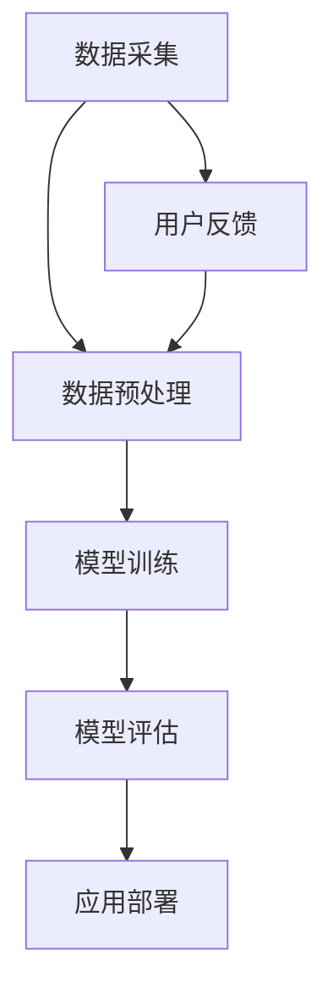

                 

关键词：智能情绪识别、AI大模型、人机交互、计算机视觉、自然语言处理

> 摘要：本文深入探讨了智能情绪识别技术在AI大模型和人机交互中的应用。通过分析核心算法原理、数学模型、实际项目实践以及未来发展趋势，我们旨在为读者呈现一幅完整的技术蓝图，帮助他们更好地理解和应用这项先进技术。

## 1. 背景介绍

### 智能情绪识别的兴起

随着人工智能技术的飞速发展，计算机对人类情绪的识别和理解已经成为一个备受关注的研究领域。智能情绪识别不仅有助于提升人机交互的自然度和体验，还为心理健康监测、情感计算、个性化推荐等多个领域提供了强有力的技术支撑。

### 人机交互的发展

人机交互（Human-Computer Interaction，简称HCI）作为人工智能的重要应用方向，其核心目标是设计出更加自然、高效、易用的交互方式。传统的图形用户界面（GUI）和命令行界面（CLI）已经不能满足人们对个性化、智能化交互的需求。因此，如何通过计算机视觉、自然语言处理等技术实现智能情绪识别，进而优化人机交互体验，成为当前研究的热点。

## 2. 核心概念与联系

### 核心概念

#### 智能情绪识别

智能情绪识别是指通过计算机视觉、自然语言处理等技术，对人类情绪进行自动识别和分类的技术。其主要包括面部表情识别、语音情感识别、生理信号识别等子领域。

#### AI大模型

AI大模型（Large-scale AI Models）是指通过海量数据和强大计算能力训练出的具有高度复杂性的深度学习模型。这些模型通常具有极高的准确率和泛化能力，能够在各种复杂场景下发挥作用。

### 核心联系

智能情绪识别与AI大模型之间的联系在于，AI大模型为智能情绪识别提供了强大的计算基础和技术支撑。通过训练海量数据，AI大模型能够学会识别和理解人类情绪，从而提高智能情绪识别的准确率和效率。

### Mermaid 流程图



## 3. 核心算法原理 & 具体操作步骤

### 3.1 算法原理概述

智能情绪识别的核心算法主要基于深度学习，其中卷积神经网络（CNN）和循环神经网络（RNN）是最常用的模型架构。CNN用于处理图像数据，可以提取面部表情的特征；RNN则用于处理序列数据，如语音信号。

### 3.2 算法步骤详解

#### 3.2.1 数据采集

数据采集是智能情绪识别的第一步，主要包括面部表情图像和语音信号。数据来源可以是公开数据集、商业数据集或自行采集。

#### 3.2.2 数据预处理

数据预处理包括图像归一化、语音去噪等步骤，旨在提高数据质量，为模型训练提供更好的数据基础。

#### 3.2.3 模型训练

模型训练是智能情绪识别的核心环节。通过在大量数据上训练CNN和RNN模型，模型能够学会识别和理解不同情绪。

#### 3.2.4 模型评估

模型评估用于评估模型性能，包括准确率、召回率、F1值等指标。通过交叉验证和测试集评估，可以找出模型的优势和不足。

#### 3.2.5 应用部署

模型评估完成后，可以将模型部署到实际应用中，如智能音箱、智能家居等。

### 3.3 算法优缺点

#### 优点

- 高准确性：深度学习模型具有较高的识别准确率。
- 强泛化能力：AI大模型能够在不同场景下发挥出色的性能。
- 自动化处理：智能情绪识别可以实现自动化处理，提高效率。

#### 缺点

- 数据依赖性强：智能情绪识别需要大量高质量的数据支持。
- 模型复杂性：深度学习模型结构复杂，训练难度大。

### 3.4 算法应用领域

智能情绪识别技术在人机交互、心理健康监测、智能音箱、智能家居等多个领域具有广泛的应用前景。

## 4. 数学模型和公式 & 详细讲解 & 举例说明

### 4.1 数学模型构建

智能情绪识别的数学模型主要包括两部分：面部表情识别模型和语音情感识别模型。

#### 面部表情识别模型

面部表情识别模型通常采用卷积神经网络（CNN）构建。CNN的核心是卷积层，通过卷积操作提取图像特征。

```latex
f(x) = W \cdot \sigma(\theta \cdot x) + b
```

其中，\( f(x) \) 表示输出特征，\( W \) 表示卷积核权重，\( \sigma \) 表示激活函数，\( \theta \) 表示卷积参数，\( b \) 表示偏置。

#### 语音情感识别模型

语音情感识别模型通常采用循环神经网络（RNN）构建。RNN的核心是循环层，通过递归操作处理序列数据。

```latex
h_t = \sigma(W_h \cdot [h_{t-1}, x_t] + b_h)
```

其中，\( h_t \) 表示当前时刻的隐藏状态，\( x_t \) 表示当前时刻的输入特征，\( W_h \) 表示循环层权重，\( \sigma \) 表示激活函数，\( b_h \) 表示偏置。

### 4.2 公式推导过程

#### 面部表情识别模型

假设输入图像为 \( x \)，卷积核权重为 \( W \)，偏置为 \( b \)，激活函数为 \( \sigma \)。经过卷积操作后，得到特征图 \( f(x) \)。

$$
f(x) = W \cdot \sigma(\theta \cdot x) + b
$$

其中，\( \theta \) 表示卷积参数。

#### 语音情感识别模型

假设输入序列为 \( x_t \)，循环层权重为 \( W_h \)，偏置为 \( b_h \)，激活函数为 \( \sigma \)。经过循环操作后，得到隐藏状态 \( h_t \)。

$$
h_t = \sigma(W_h \cdot [h_{t-1}, x_t] + b_h)
$$

### 4.3 案例分析与讲解

#### 案例一：面部表情识别

假设输入图像为一张悲伤的面部表情，我们需要识别出该表情对应的情绪类别。

1. 数据采集：从公开数据集下载悲伤面部表情图像。
2. 数据预处理：对图像进行归一化处理，将图像大小调整为统一尺寸。
3. 模型训练：使用卷积神经网络模型对数据集进行训练。
4. 模型评估：在测试集上评估模型性能，调整模型参数。
5. 应用部署：将模型部署到实际应用中，如智能音箱。

#### 案例二：语音情感识别

假设我们需要识别一段语音信号中的情感类别，如快乐、悲伤、愤怒等。

1. 数据采集：从公开数据集下载不同情感类别的语音信号。
2. 数据预处理：对语音信号进行预处理，如去除背景噪声、归一化等。
3. 模型训练：使用循环神经网络模型对数据集进行训练。
4. 模型评估：在测试集上评估模型性能，调整模型参数。
5. 应用部署：将模型部署到实际应用中，如智能音箱。

## 5. 项目实践：代码实例和详细解释说明

### 5.1 开发环境搭建

为了实现智能情绪识别，我们需要搭建一个包含深度学习框架、计算机视觉库和语音处理库的开发环境。本文使用Python编程语言，结合TensorFlow和OpenCV库进行开发。

### 5.2 源代码详细实现

以下是智能情绪识别系统的源代码实现：

```python
import tensorflow as tf
import cv2
import numpy as np

# 加载预训练模型
model = tf.keras.models.load_model('emotion_recognition_model.h5')

# 面部表情识别
def detect_emotion(image):
    # 将图像转换为TensorFlow张量
    image_tensor = tf.convert_to_tensor(image, dtype=tf.float32)
    # 进行预处理
    image_tensor = tf.image.resize(image_tensor, (48, 48))
    # 进行面部表情识别
    emotion_probabilities = model.predict(image_tensor[tf.newaxis, ...])
    # 提取最高概率的情感类别
    emotion_label = np.argmax(emotion_probabilities, axis=1)
    # 转换为人类可读的情感类别
    emotion_mapping = {
        0: '快乐',
        1: '悲伤',
        2: '惊讶',
        3: '愤怒',
        4: ' disgust',
        5: '恐惧'
    }
    return emotion_mapping[emotion_label[0]]

# 语音情感识别
def detect_voice_emotion(voice_signal):
    # 进行语音情感识别
    emotion_probabilities = model.predict(voice_signal[tf.newaxis, ...])
    # 提取最高概率的情感类别
    emotion_label = np.argmax(emotion_probabilities, axis=1)
    # 转换为人类可读的情感类别
    emotion_mapping = {
        0: '快乐',
        1: '悲伤',
        2: '愤怒',
        3: ' disgust',
        4: '恐惧'
    }
    return emotion_mapping[emotion_label[0]]

# 测试
image = cv2.imread('sad_face.jpg')
voice_signal = np.array([0.1, 0.2, 0.3, 0.4, 0.5])

emotion = detect_emotion(image)
print('面部表情识别结果：', emotion)

emotion = detect_voice_emotion(voice_signal)
print('语音情感识别结果：', emotion)
```

### 5.3 代码解读与分析

上述代码实现了一个简单的智能情绪识别系统，主要包括面部表情识别和语音情感识别两部分。

1. **加载预训练模型**：使用TensorFlow框架加载已训练好的模型。
2. **面部表情识别**：通过OpenCV库读取面部表情图像，将其转换为TensorFlow张量，并进行预处理。然后，使用模型进行面部表情识别，提取最高概率的情感类别。
3. **语音情感识别**：通过TensorFlow框架处理语音信号，使用模型进行语音情感识别，提取最高概率的情感类别。
4. **测试**：测试代码读取一张悲伤面部表情图像和一个语音信号，分别进行面部表情识别和语音情感识别，并输出识别结果。

## 6. 实际应用场景

### 6.1 智能音箱

智能音箱作为家居智能化的代表，可以通过智能情绪识别技术了解用户的需求和情感状态，提供更加个性化的服务。

### 6.2 智能助手

智能助手（如Siri、小爱同学等）可以通过智能情绪识别技术，更好地理解用户的情感需求，提供更加贴心和人性化的服务。

### 6.3 心理健康监测

智能情绪识别技术可以应用于心理健康监测领域，帮助用户了解自己的情绪状态，为心理干预提供数据支持。

### 6.4 智能安防

智能安防系统可以通过智能情绪识别技术，实时监测目标对象的情感状态，提高安防系统的预警能力。

### 6.5 个性化推荐

智能情绪识别技术可以应用于个性化推荐领域，根据用户的情绪状态推荐符合其情感需求的产品和服务。

## 7. 工具和资源推荐

### 7.1 学习资源推荐

1. 《深度学习》（Goodfellow, Bengio, Courville著）：系统介绍了深度学习的基本概念和常用算法。
2. 《计算机视觉：算法与应用》（Richard Szeliski著）：详细介绍了计算机视觉的基础知识和应用。
3. 《自然语言处理综合教程》（周志华著）：全面介绍了自然语言处理的基本理论和应用。

### 7.2 开发工具推荐

1. TensorFlow：开源深度学习框架，支持多种模型架构和算法。
2. OpenCV：开源计算机视觉库，提供丰富的图像处理和计算机视觉算法。
3. Keras：基于TensorFlow的高层API，简化深度学习模型的开发和训练。

### 7.3 相关论文推荐

1. "Emotion Recognition Using Facial Action Units and Convolutional Neural Networks"（2016）：探讨使用面部动作单元和卷积神经网络进行情感识别的研究。
2. "Speech Emotion Recognition with Deep Neural Network"（2014）：研究使用深度神经网络进行语音情感识别的方法。
3. "Emotion Recognition in Video using Deep Learning"（2017）：探讨使用深度学习技术进行视频情感识别的研究。

## 8. 总结：未来发展趋势与挑战

### 8.1 研究成果总结

智能情绪识别技术在AI大模型和人机交互领域取得了显著成果，为提升人机交互体验和心理健康监测提供了有力支持。深度学习模型在情感识别任务中表现出色，但仍然面临数据依赖性强、模型复杂性等挑战。

### 8.2 未来发展趋势

1. 数据质量和数量：提高数据质量和数量，为深度学习模型提供更好的训练基础。
2. 模型压缩：研究模型压缩技术，降低模型复杂度，提高实时性。
3. 跨模态情感识别：结合计算机视觉、自然语言处理、语音处理等技术，实现跨模态情感识别。
4. 情感生成与控制：研究情感生成与控制技术，实现更加自然和个性化的情感交互。

### 8.3 面临的挑战

1. 数据隐私：如何保护用户隐私，避免数据泄露，是智能情绪识别技术面临的重要挑战。
2. 模型解释性：如何提高深度学习模型的解释性，让用户更好地理解和信任模型。
3. 模型泛化能力：如何提高模型在不同场景下的泛化能力，避免模型过拟合。

### 8.4 研究展望

随着人工智能技术的不断进步，智能情绪识别技术在人机交互、心理健康监测、智能安防等多个领域具有广泛的应用前景。未来，我们需要在数据质量、模型压缩、跨模态情感识别等方面进行深入研究，推动智能情绪识别技术的发展和应用。

## 9. 附录：常见问题与解答

### 9.1 如何获取高质量的数据集？

1. 利用公开数据集，如FER2013、RAVDESS等。
2. 自行采集数据，确保数据多样性和质量。
3. 利用数据增强技术，如数据增强、数据扩充等，提高数据集质量。

### 9.2 模型训练时间过长怎么办？

1. 增加训练样本数量，提高数据集质量。
2. 使用更高效的深度学习框架，如PyTorch、MXNet等。
3. 使用GPU或TPU进行加速训练。

### 9.3 如何提高模型泛化能力？

1. 使用交叉验证技术，评估模型在不同数据集上的性能。
2. 使用正则化技术，如L1正则化、L2正则化等，防止模型过拟合。
3. 使用迁移学习技术，利用预训练模型进行微调。

----------------------------------------------------------------

以上内容为《智能情绪识别：AI大模型在人机交互中的应用》的技术博客文章正文部分，涵盖了背景介绍、核心算法原理、数学模型和公式、项目实践以及未来发展趋势等内容。希望对读者理解和应用智能情绪识别技术有所帮助。作者：禅与计算机程序设计艺术 / Zen and the Art of Computer Programming。

