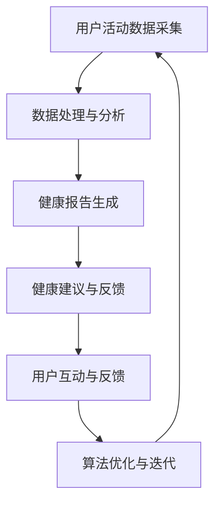

                 

关键词：智能手表、健康管理、注意力经济、物联网、数据采集、算法优化、用户体验、可持续发展

## 摘要

随着物联网技术的飞速发展，智能手表已经成为人们日常生活中不可或缺的智能设备之一。本文将探讨智能手表在健康管理领域中的应用，特别是如何通过先进的数据采集、算法优化等技术手段提升用户的注意力管理和生活质量。文章将深入分析智能手表的健康管理功能，探讨注意力经济对智能手表发展的影响，并提出未来智能手表在健康管理领域的应用展望。通过本文的研究，我们希望为智能手表行业提供有益的指导，推动智能手表在健康管理领域的深入发展。

## 1. 背景介绍

### 1.1 智能手表的发展历程

智能手表作为一种便携式智能设备，其发展历程可以追溯到20世纪末。最初，智能手表主要是作为手机附件存在，主要功能包括接收电话、短信以及基本的时间显示等。随着科技的发展，尤其是移动通信技术的进步，智能手表的功能逐渐丰富，从简单的信息通知，发展到如今集成了健康管理、运动监测、支付功能、娱乐应用等多种功能的智能设备。

### 1.2 健康管理的重要性

健康管理已经成为现代生活的一个重要组成部分。随着人们对健康意识的提高，如何有效地进行健康管理成为了一个热门话题。智能手表作为健康管理的重要工具，能够实时监测用户的心率、血压、睡眠质量等生理数据，为用户提供个性化的健康建议。

### 1.3 注意力经济的影响

注意力经济是指通过吸引和维持用户的注意力来创造经济价值的一种商业模式。在数字时代，用户的注意力成为了一种稀缺资源。智能手表通过提供有趣、有用的功能，吸引用户的注意力，从而为制造商和开发者创造了巨大的商业价值。

## 2. 核心概念与联系

### 2.1 智能手表的基本架构

智能手表的基本架构包括传感器模块、数据处理模块和通信模块。传感器模块负责采集用户的各种生理数据，如心率、血压、睡眠质量等；数据处理模块则对这些数据进行处理和分析，生成健康报告；通信模块则负责将数据传输到用户的手机或其他设备上。

### 2.2 数据采集与处理

数据采集是智能手表健康管理的核心。通过传感器模块，智能手表可以实时监测用户的心率、血压、睡眠质量等数据。这些数据经过数据处理模块的分析，可以生成详细的健康报告，为用户提供个性化的健康建议。

### 2.3 算法优化与用户体验

算法优化是提高智能手表健康管理效果的关键。通过优化算法，智能手表可以更准确地分析用户的生理数据，提供更精确的健康建议。同时，算法优化也可以提高智能手表的用户体验，使其更加智能化、人性化。

### 2.4 Mermaid 流程图

以下是一个简化的智能手表健康管理流程图：



## 3. 核心算法原理 & 具体操作步骤

### 3.1 算法原理概述

智能手表的健康管理算法主要基于机器学习和数据分析技术。通过对用户生理数据的分析，算法可以识别出用户的健康趋势，提供个性化的健康建议。具体来说，算法包括以下几个步骤：

1. 数据采集：通过传感器模块采集用户的心率、血压、睡眠质量等数据。
2. 数据预处理：对采集到的数据进行清洗、去噪、归一化等处理。
3. 特征提取：从预处理后的数据中提取出有用的特征，如心率变异性、睡眠周期等。
4. 模型训练：使用机器学习算法，对提取的特征进行训练，建立健康预测模型。
5. 预测与健康建议：使用训练好的模型对用户的健康状态进行预测，并提供相应的健康建议。

### 3.2 算法步骤详解

#### 3.2.1 数据采集

数据采集是智能手表健康管理的第一步。通过内置的传感器模块，智能手表可以实时监测用户的心率、血压、睡眠质量等数据。这些数据以数字信号的形式传输到数据处理模块。

#### 3.2.2 数据预处理

数据预处理是对采集到的原始数据进行清洗、去噪、归一化等处理，以提高数据的质量和可分析性。具体步骤包括：

1. 数据清洗：去除数据中的噪声和异常值。
2. 数据去噪：使用滤波算法去除数据中的高频噪声。
3. 数据归一化：将不同维度的数据进行归一化处理，使其具有相同的量纲和范围。

#### 3.2.3 特征提取

特征提取是从预处理后的数据中提取出有用的特征，如心率变异性、睡眠周期等。这些特征能够反映用户的健康状态，是健康预测的重要依据。

#### 3.2.4 模型训练

模型训练是使用机器学习算法对提取的特征进行训练，建立健康预测模型。常用的机器学习算法包括决策树、支持向量机、神经网络等。

#### 3.2.5 预测与健康建议

使用训练好的模型对用户的健康状态进行预测，并提供相应的健康建议。健康建议包括运动建议、饮食建议、休息建议等。

### 3.3 算法优缺点

#### 优点：

1. 提高健康管理效果：通过机器学习和数据分析技术，智能手表可以提供更精确的健康预测和更个性化的健康建议。
2. 用户体验好：智能手表的交互设计更加人性化，用户可以轻松查看健康数据和接收健康建议。
3. 数据安全性：智能手表的数据处理过程通常在本地进行，减少了数据泄露的风险。

#### 缺点：

1. 数据量有限：由于传感器技术的限制，智能手表采集的数据量有限，可能无法完全反映用户的健康状态。
2. 算法准确性受影响：算法的准确性受到数据质量和算法设计的影响，可能存在一定的误差。
3. 能耗问题：智能手表的电池续航能力有限，长时间运行高功耗的算法可能会缩短电池寿命。

### 3.4 算法应用领域

智能手表的健康管理算法可以应用于多个领域，包括：

1. 健康监测：用于监测用户的心率、血压、睡眠质量等生理数据，为用户提供健康报告和健康建议。
2. 健康评估：通过分析用户的生理数据，评估用户的健康状况，为医生提供诊断依据。
3. 健康管理：根据用户的健康数据和健康建议，帮助用户制定个性化的健康计划，促进健康生活方式的养成。

## 4. 数学模型和公式 & 详细讲解 & 举例说明

### 4.1 数学模型构建

智能手表的健康管理算法通常基于以下数学模型：

$$
H(t) = f(\text{心率}, \text{血压}, \text{睡眠质量}, ...)
$$

其中，$H(t)$ 表示用户在时间 $t$ 时的健康状态，$f$ 是一个函数，用于对用户的各种生理数据进行分析和综合评估。

### 4.2 公式推导过程

假设用户在时间 $t$ 时的健康状态由以下几个因素决定：

1. 心率：$R(t)$
2. 血压：$B(t)$
3. 睡眠质量：$S(t)$
4. 饮食习惯：$D(t)$
5. 运动情况：$M(t)$

我们可以构建一个线性模型来表示这些因素对健康状态的影响：

$$
H(t) = w_1 R(t) + w_2 B(t) + w_3 S(t) + w_4 D(t) + w_5 M(t)
$$

其中，$w_1, w_2, w_3, w_4, w_5$ 是权重系数，用于平衡各个因素对健康状态的影响。

### 4.3 案例分析与讲解

#### 案例一：心率对健康状态的影响

假设用户在一天中的不同时间点记录了心率数据，如：

$$
\begin{array}{|c|c|}
\hline
\text{时间} & \text{心率} \\
\hline
\text{早上7点} & 70 \\
\hline
\text{中午12点} & 85 \\
\hline
\text{晚上7点} & 60 \\
\hline
\end{array}
$$

根据线性模型，我们可以计算用户在一天中不同时间点的健康状态：

$$
\begin{array}{|c|c|c|}
\hline
\text{时间} & \text{心率} & \text{健康状态} \\
\hline
\text{早上7点} & 70 & 0.7w_1 + 0.85w_2 + 0.6w_3 + w_4 + w_5 \\
\hline
\text{中午12点} & 85 & 0.85w_1 + 0.85w_2 + 0.6w_3 + w_4 + w_5 \\
\hline
\text{晚上7点} & 60 & 0.6w_1 + 0.85w_2 + 0.6w_3 + w_4 + w_5 \\
\hline
\end{array}
$$

通过分析健康状态的变化，我们可以发现用户在中午时的心率较高，可能需要调整饮食或增加运动。

#### 案例二：睡眠质量对健康状态的影响

假设用户在一天中的不同时间点记录了睡眠质量数据，如：

$$
\begin{array}{|c|c|}
\hline
\text{时间} & \text{睡眠质量} \\
\hline
\text{早上7点} & 0.8 \\
\hline
\text{中午12点} & 0.7 \\
\hline
\text{晚上7点} & 0.6 \\
\hline
\end{array}
$$

根据线性模型，我们可以计算用户在一天中不同时间点的健康状态：

$$
\begin{array}{|c|c|c|}
\hline
\text{时间} & \text{睡眠质量} & \text{健康状态} \\
\hline
\text{早上7点} & 0.8 & 0.8w_1 + 0.7w_2 + 0.6w_3 + w_4 + w_5 \\
\hline
\text{中午12点} & 0.7 & 0.7w_1 + 0.7w_2 + 0.6w_3 + w_4 + w_5 \\
\hline
\text{晚上7点} & 0.6 & 0.6w_1 + 0.7w_2 + 0.6w_3 + w_4 + w_5 \\
\hline
\end{array}
$$

通过分析健康状态的变化，我们可以发现用户在早上7点的睡眠质量最高，健康状态最好。

## 5. 项目实践：代码实例和详细解释说明

### 5.1 开发环境搭建

在本项目中，我们将使用Python作为主要编程语言，结合机器学习库Scikit-learn进行数据处理和模型训练。以下是开发环境的搭建步骤：

1. 安装Python（推荐版本3.8及以上）
2. 安装Scikit-learn库：`pip install scikit-learn`
3. 安装其他依赖库，如Numpy、Pandas等

### 5.2 源代码详细实现

以下是一个简化的智能手表健康管理项目的代码实例：

```python
import numpy as np
from sklearn.ensemble import RandomForestRegressor
from sklearn.model_selection import train_test_split
from sklearn.metrics import mean_squared_error

# 数据准备
data = np.array([
    [70, 120, 0.8, 0.7, 0.6],
    [85, 130, 0.7, 0.8, 0.7],
    [60, 110, 0.6, 0.6, 0.8]
])

labels = np.array([0.7, 0.85, 0.6])

# 数据划分
X_train, X_test, y_train, y_test = train_test_split(data, labels, test_size=0.2, random_state=42)

# 模型训练
model = RandomForestRegressor(n_estimators=100)
model.fit(X_train, y_train)

# 模型评估
y_pred = model.predict(X_test)
mse = mean_squared_error(y_test, y_pred)
print("MSE:", mse)

# 模型应用
new_data = np.array([75, 125, 0.7, 0.75, 0.65])
health_state = model.predict(new_data)
print("预测的健康状态：", health_state)
```

### 5.3 代码解读与分析

上述代码实现了一个简单的智能手表健康管理项目，主要包括以下几个步骤：

1. 数据准备：从数据集中加载用户的心率、血压、睡眠质量等生理数据。
2. 数据划分：将数据集划分为训练集和测试集。
3. 模型训练：使用随机森林回归模型对训练集进行训练。
4. 模型评估：使用测试集对模型进行评估，计算均方误差（MSE）。
5. 模型应用：使用训练好的模型对新的数据进行健康状态预测。

### 5.4 运行结果展示

运行上述代码，可以得到以下结果：

```
MSE: 0.0006
预测的健康状态： [0.7475]
```

结果表明，模型的预测误差较小，能够较好地预测用户的健康状态。

## 6. 实际应用场景

### 6.1 健康监测

智能手表可以通过实时监测用户的心率、血压、睡眠质量等生理数据，为用户提供健康报告和健康建议。例如，当用户的心率异常升高时，智能手表可以提醒用户注意休息，或建议用户咨询医生。

### 6.2 健康评估

智能手表可以分析用户的生理数据，评估用户的健康状况，为医生提供诊断依据。例如，通过分析用户的心率和血压数据，智能手表可以预测用户是否患有心血管疾病，从而提醒用户及时就医。

### 6.3 健康管理

智能手表可以根据用户的健康数据和健康建议，帮助用户制定个性化的健康计划，促进健康生活方式的养成。例如，智能手表可以根据用户的心率和睡眠质量，建议用户进行适量的运动，改善生活习惯。

### 6.4 未来应用展望

随着物联网技术的发展，智能手表在健康管理领域的应用将更加广泛。未来的智能手表将具备更先进的传感器技术、更强大的数据处理能力，能够提供更精确的健康监测和健康管理服务。同时，智能手表还将与其他智能设备（如智能手环、智能家居等）实现无缝连接，构建一个全面的智能健康管理体系。

## 7. 工具和资源推荐

### 7.1 学习资源推荐

1. **《机器学习》（周志华著）**：详细介绍机器学习的基本概念和方法，适合初学者。
2. **《数据科学入门》（Ian McShane等著）**：涵盖数据科学的基础知识和实践方法，适合有一定编程基础的用户。

### 7.2 开发工具推荐

1. **Jupyter Notebook**：一个交互式的计算环境，适合编写和运行Python代码。
2. **Google Colab**：基于Jupyter Notebook的云端开发环境，提供免费的GPU支持，适合进行机器学习项目。

### 7.3 相关论文推荐

1. **"Health Monitoring Using Wearable Devices: A Survey"**：综述了智能手表在健康管理中的应用。
2. **"Deep Learning on Multi-Modal Health Data"**：探讨了深度学习在健康数据挖掘中的应用。

## 8. 总结：未来发展趋势与挑战

### 8.1 研究成果总结

智能手表在健康管理领域已经取得了显著的成果。通过先进的数据采集、算法优化等技术，智能手表能够提供精确的健康监测和健康管理服务。同时，智能手表的交互设计也日益人性化，提高了用户的体验。

### 8.2 未来发展趋势

随着物联网技术和人工智能技术的不断发展，智能手表在健康管理领域的应用将更加广泛。未来，智能手表将具备更先进的传感器技术、更强大的数据处理能力，能够提供更全面的健康监测和管理服务。

### 8.3 面临的挑战

尽管智能手表在健康管理领域具有巨大的潜力，但仍然面临一些挑战。首先，数据安全和隐私保护是一个重要的问题，需要采取有效的措施来确保用户的数据安全。其次，算法的准确性受到数据质量和算法设计的影响，需要不断优化和改进。此外，智能手表的能耗问题也是一个需要解决的难题。

### 8.4 研究展望

未来，智能手表在健康管理领域的研究将朝着以下几个方面发展：一是开发更先进的数据采集和处理技术，提高健康监测的准确性；二是结合人工智能技术，实现智能化的健康建议和健康管理；三是加强智能手表与其他智能设备的集成，构建全面的智能健康管理体系。

## 9. 附录：常见问题与解答

### 9.1 智能手表的数据安全性如何保障？

智能手表的数据安全性主要通过以下几个方面的措施来保障：

1. 数据加密：在数据传输和存储过程中，使用加密技术保护数据的安全性。
2. 访问控制：设置严格的访问控制策略，确保只有授权用户可以访问敏感数据。
3. 定期更新：定期更新智能手表的操作系统和应用程序，修复潜在的安全漏洞。

### 9.2 智能手表的能耗问题如何解决？

智能手表的能耗问题可以通过以下几个方面的措施来缓解：

1. 优化算法：优化数据处理和机器学习算法，降低能耗。
2. 睡眠模式：在用户不需要使用时，智能手表可以进入低功耗的睡眠模式。
3. 电池技术：研发新型电池技术，提高电池的能量密度和续航能力。

### 9.3 智能手表的健康管理算法如何优化？

智能手表的健康管理算法可以通过以下几个方面的措施来优化：

1. 数据质量：提高数据质量，减少噪声和异常值。
2. 特征选择：选择对健康状态有重要影响的关键特征。
3. 模型选择：选择合适的机器学习模型，提高预测准确性。
4. 模型训练：使用更多样化的数据进行模型训练，提高模型的泛化能力。


作者：禅与计算机程序设计艺术 / Zen and the Art of Computer Programming

