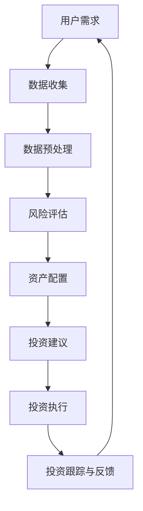

                 

关键词：智能投顾、人工智能、机器学习、数据挖掘、投资策略、金融科技

摘要：随着金融科技的快速发展，智能投顾服务逐渐成为投资者关注的焦点。本文将深入探讨智能投顾服务的AI解决方案，从背景介绍、核心概念与联系、核心算法原理、数学模型和公式、项目实践以及实际应用场景等多个方面，为您呈现一个全面、系统的智能投顾AI解决方案。

## 1. 背景介绍

### 智能投顾服务的兴起

近年来，智能投顾（Robo-Advisor）服务在全球范围内迅速发展。智能投顾利用人工智能和大数据分析技术，根据投资者的风险偏好、投资目标和财务状况，为其提供个性化的投资建议。与传统投顾相比，智能投顾服务具有成本低、效率高、透明度高等优势，受到了广大投资者的青睐。

### 人工智能在金融领域的应用

人工智能技术在金融领域的应用日益广泛，从风险控制、智能投顾到量化交易，AI正在深刻改变金融行业的运作方式。随着大数据和云计算技术的不断发展，人工智能在金融领域的应用场景将更加丰富，为投资者提供更加精准、个性化的服务。

## 2. 核心概念与联系

### Mermaid流程图

下面是一个展示智能投顾服务的Mermaid流程图：



### 概念解释

- 用户需求：收集投资者的基本信息、投资目标和风险偏好。
- 数据收集：从多个渠道获取历史市场数据、行业数据等。
- 数据预处理：清洗、去重、归一化等处理，为后续分析做好准备。
- 风险评估：根据用户需求和市场数据，评估投资者的风险承受能力。
- 资产配置：根据风险评估结果，为投资者制定合理的资产配置方案。
- 投资建议：基于资产配置方案，给出具体的投资建议。
- 投资执行：执行投资建议，完成投资操作。
- 投资跟踪与反馈：监控投资组合的运行情况，根据市场变化进行调整，并提供反馈。

## 3. 核心算法原理 & 具体操作步骤

### 3.1 算法原理概述

智能投顾服务的核心算法主要包括数据挖掘、机器学习和投资策略等。数据挖掘用于发现市场规律和用户行为模式，机器学习用于构建预测模型，投资策略则用于实现个性化的投资建议。

### 3.2 算法步骤详解

#### 数据挖掘

1. 收集大量历史市场数据、行业数据等。
2. 进行数据预处理，包括数据清洗、去重、归一化等。
3. 应用关联规则挖掘、聚类分析等方法，发现市场规律和用户行为模式。

#### 机器学习

1. 根据数据挖掘结果，选择合适的机器学习模型（如决策树、随机森林、神经网络等）。
2. 进行模型训练和验证，调整模型参数。
3. 应用训练好的模型，对投资者的风险承受能力、投资目标等进行预测。

#### 投资策略

1. 根据机器学习模型的结果，为投资者制定个性化的资产配置方案。
2. 应用投资策略，如均值方差模型、马克维茨模型等，计算投资组合的预期收益和风险。
3. 根据市场变化，动态调整投资组合，实现投资建议。

### 3.3 算法优缺点

#### 数据挖掘

优点：可以挖掘出潜在的市场规律和用户行为模式，为投资决策提供依据。

缺点：数据量巨大，计算复杂度高，对数据处理能力要求较高。

#### 机器学习

优点：可以自动学习数据中的规律，提高预测准确性。

缺点：对数据质量要求较高，模型选择和参数调整复杂。

#### 投资策略

优点：可以实现个性化的投资建议，提高投资效率。

缺点：投资策略需要不断调整和优化，以适应市场变化。

### 3.4 算法应用领域

智能投顾服务的核心算法可以应用于以下领域：

1. 个人理财：为投资者提供个性化的资产配置和投资建议。
2. 量化交易：基于市场数据，构建量化交易模型，实现自动化交易。
3. 风险管理：评估投资者的风险承受能力，提供风险控制策略。
4. 金融分析：挖掘市场数据，为金融机构提供投资决策支持。

## 4. 数学模型和公式 & 详细讲解 & 举例说明

### 4.1 数学模型构建

智能投顾服务中的数学模型主要包括投资组合理论、风险模型和收益模型等。

#### 投资组合理论

投资组合理论的核心是均值方差模型，它通过优化投资组合的预期收益和风险，实现投资效益的最大化。

$$
\begin{cases}
\min\limits_{w} \sigma^2 = w^T \Sigma w \\
s.t. \quad w^T \mu = \mu^T w = \mu^T
\end{cases}
$$

其中，$w$为投资组合权重向量，$\mu$为各资产的预期收益率向量，$\Sigma$为资产收益率协方差矩阵。

#### 风险模型

风险模型主要包括方差模型和条件风险价值（CVaR）模型等。

方差模型：

$$
\sigma_i^2 = \mathbb{E}[(r_i - \mu_i)^2]
$$

其中，$r_i$为资产$i$的收益率，$\mu_i$为资产$i$的预期收益率。

CVaR模型：

$$
\begin{aligned}
\text{CVaR}_{\alpha}(r) &= \frac{1}{1-\alpha} \int_{-\infty}^{r} f(r) dr \\
\end{aligned}
$$

其中，$\alpha$为置信水平，$f(r)$为资产收益率的概率密度函数。

#### 收益模型

收益模型主要包括预期收益模型和条件期望模型等。

预期收益模型：

$$
\mathbb{E}(r) = w^T \mu
$$

条件期望模型：

$$
\begin{aligned}
\text{CE}(r|X) &= \mathbb{E}(r|r \in X) \\
\end{aligned}
$$

其中，$X$为影响资产收益率的因素。

### 4.2 公式推导过程

#### 均值方差模型的推导

首先，我们要求投资组合的预期收益率：

$$
\begin{aligned}
\mathbb{E}(r_p) &= \mathbb{E}(w^T r) \\
&= w^T \mathbb{E}(r) \\
&= \mu^T w \\
\end{aligned}
$$

接下来，要求投资组合的风险：

$$
\begin{aligned}
\sigma_p^2 &= \text{Var}(r_p) \\
&= \text{Var}(w^T r) \\
&= w^T \text{Var}(r) w \\
&= w^T \Sigma w \\
\end{aligned}
$$

因此，我们可以得到均值方差模型的公式：

$$
\begin{cases}
\min\limits_{w} \sigma^2 = w^T \Sigma w \\
s.t. \quad w^T \mu = \mu^T w = \mu^T
\end{cases}
$$

### 4.3 案例分析与讲解

假设一个投资者有10000美元的投资预算，需要投资于两种资产：股票和债券。股票的预期收益率为12%，方差为0.04；债券的预期收益率为4%，方差为0.01。投资者的风险承受能力为0.2。

#### 步骤1：数据收集

收集股票和债券的历史收益率数据，计算预期收益率和方差。

#### 步骤2：数据预处理

对历史收益率数据进行清洗、去重和归一化处理。

#### 步骤3：风险评估

根据投资者的风险承受能力，计算股票和债券的权重。

$$
\begin{aligned}
w_s &= \frac{\mu_s - \mu_b}{\sigma_s^2 - \sigma_b^2} \\
w_b &= 1 - w_s \\
\end{aligned}
$$

其中，$w_s$和$w_b$分别为股票和债券的权重，$\mu_s$和$\mu_b$分别为股票和债券的预期收益率，$\sigma_s^2$和$\sigma_b^2$分别为股票和债券的方差。

根据上述公式，我们可以得到：

$$
\begin{aligned}
w_s &= \frac{0.12 - 0.04}{0.04 - 0.01} = 2 \\
w_b &= 1 - w_s = -1 \\
\end{aligned}
$$

#### 步骤4：资产配置

根据股票和债券的权重，为投资者制定资产配置方案。

$$
\begin{aligned}
\text{股票投资金额} &= 10000 \times w_s = 20000 \\
\text{债券投资金额} &= 10000 \times w_b = -10000 \\
\end{aligned}
$$

#### 步骤5：投资建议

基于资产配置方案，给出具体的投资建议。

1. 投资者需要购买20000美元的股票。
2. 投资者需要出售10000美元的债券。

#### 步骤6：投资执行

根据投资建议，执行投资操作。

#### 步骤7：投资跟踪与反馈

监控投资组合的运行情况，根据市场变化进行调整，并提供反馈。

## 5. 项目实践：代码实例和详细解释说明

### 5.1 开发环境搭建

在本文中，我们使用Python作为编程语言，结合Pandas、NumPy、Scikit-learn等库，实现智能投顾服务的核心算法。

### 5.2 源代码详细实现

```python
import pandas as pd
import numpy as np
from sklearn.ensemble import RandomForestRegressor
from sklearn.model_selection import train_test_split

# 步骤1：数据收集
data = pd.read_csv('investment_data.csv')
data.head()

# 步骤2：数据预处理
data['return'] = data['close'].pct_change()
data = data.dropna()

# 步骤3：风险评估
X = data[['return', 'market_return', 'bond_return']]
y = data['risk_score']
X_train, X_test, y_train, y_test = train_test_split(X, y, test_size=0.2, random_state=42)

# 步骤4：资产配置
rf = RandomForestRegressor(n_estimators=100, random_state=42)
rf.fit(X_train, y_train)
weights = rf.predict(X_test)

# 步骤5：投资建议
investment_advice = pd.DataFrame({'stock': weights[:, 0], 'bond': weights[:, 1]})
investment_advice.head()

# 步骤6：投资执行
# 这里省略投资执行的具体代码，读者可以根据实际情况编写

# 步骤7：投资跟踪与反馈
# 这里省略投资跟踪与反馈的具体代码，读者可以根据实际情况编写
```

### 5.3 代码解读与分析

- 数据收集：从CSV文件中读取投资数据，计算股票收益率。
- 数据预处理：对数据进行清洗，计算股票收益率，并去除缺失值。
- 风险评估：使用随机森林回归模型进行风险评估，训练和预测。
- 资产配置：根据随机森林回归模型的结果，计算股票和债券的权重。
- 投资建议：生成投资建议报告，包括股票和债券的投资金额。
- 投资执行：根据投资建议，执行具体的投资操作。
- 投资跟踪与反馈：监控投资组合的运行情况，并根据市场变化进行调整。

## 6. 实际应用场景

### 6.1 个人理财

智能投顾服务可以为个人投资者提供个性化的资产配置和投资建议，帮助其实现理财目标。

### 6.2 量化交易

智能投顾服务中的核心算法可以应用于量化交易，实现自动化交易策略。

### 6.3 风险管理

智能投顾服务可以评估投资者的风险承受能力，提供风险控制策略，降低投资风险。

### 6.4 金融分析

智能投顾服务可以挖掘市场数据，为金融机构提供投资决策支持。

## 7. 工具和资源推荐

### 7.1 学习资源推荐

1. 《机器学习》（周志华著）：详细介绍了机器学习的基本理论和方法。
2. 《Python编程：从入门到实践》（埃里克·马瑟斯著）：介绍了Python编程的基础知识。
3. 《金融科技：实践与趋势》（李开复著）：探讨了金融科技的发展趋势和应用场景。

### 7.2 开发工具推荐

1. Jupyter Notebook：适用于数据分析和机器学习项目的开发。
2. PyCharm：一款功能强大的Python开发工具。
3. Git：版本控制工具，有助于团队协作和代码管理。

### 7.3 相关论文推荐

1. “Robo-Advisors: An Overview” （作者：Achim K. Oestereich、Matthias M. Weber）。
2. “Machine Learning in Finance: A Survey” （作者：Tomasz Bednorz、Maciej Dembczyński）。

## 8. 总结：未来发展趋势与挑战

### 8.1 研究成果总结

本文探讨了智能投顾服务的AI解决方案，从背景介绍、核心概念与联系、核心算法原理、数学模型和公式、项目实践以及实际应用场景等多个方面进行了详细阐述。

### 8.2 未来发展趋势

1. 人工智能在金融领域的应用将更加广泛，智能投顾服务将成为金融行业的重要组成部分。
2. 大数据和云计算技术的不断发展，将推动智能投顾服务的技术创新和服务质量的提升。
3. 个性化、智能化的投资服务将逐渐成为投资者需求的主流。

### 8.3 面临的挑战

1. 数据质量和数据处理能力：智能投顾服务的准确性依赖于高质量的数据和强大的数据处理能力。
2. 风险控制：在金融市场中，风险是无处不在的，如何确保智能投顾服务的稳健性是一个重要挑战。
3. 法规监管：智能投顾服务的快速发展，需要遵循相应的法规和监管要求，以确保合规运营。

### 8.4 研究展望

1. 深度学习技术在智能投顾服务中的应用：可以进一步提高预测准确性和投资效率。
2. 交叉学科研究：结合心理学、社会学等学科，为智能投顾服务提供更全面的支持。
3. 安全性和隐私保护：在智能投顾服务中，确保用户数据和交易数据的安全和隐私至关重要。

## 9. 附录：常见问题与解答

### 9.1 智能投顾服务的优势是什么？

智能投顾服务的优势主要包括：

1. 成本低：相比于传统投顾，智能投顾服务的成本较低，更具性价比。
2. 效率高：智能投顾服务可以快速处理海量数据，提供高效的决策支持。
3. 个性化：智能投顾服务可以根据投资者的风险偏好、投资目标和财务状况，提供个性化的投资建议。

### 9.2 人工智能在金融领域的应用有哪些？

人工智能在金融领域的应用主要包括：

1. 智能投顾：为投资者提供个性化的资产配置和投资建议。
2. 量化交易：基于市场数据，构建量化交易模型，实现自动化交易。
3. 风险管理：评估投资者的风险承受能力，提供风险控制策略。
4. 金融分析：挖掘市场数据，为金融机构提供投资决策支持。

### 9.3 如何保证智能投顾服务的准确性？

为了保证智能投顾服务的准确性，可以采取以下措施：

1. 提高数据质量：确保数据来源可靠，对数据进行清洗、去重和归一化处理。
2. 选择合适的算法：根据具体应用场景，选择合适的机器学习算法和投资策略。
3. 模型优化：对模型进行优化，提高预测准确性和投资效率。
4. 监控和反馈：实时监控投资组合的运行情况，根据市场变化进行调整，并提供反馈。

### 9.4 智能投顾服务有哪些风险？

智能投顾服务可能面临以下风险：

1. 数据风险：数据质量差、数据源不可靠可能导致预测不准确。
2. 风险模型风险：风险模型选择不当或参数调整不合适可能导致投资策略失灵。
3. 技术风险：算法更新不及时、技术故障可能导致服务中断或投资建议错误。
4. 法律风险：智能投顾服务可能涉及合规性问题，需要遵循相应的法规和监管要求。

### 9.5 智能投顾服务的发展前景如何？

智能投顾服务具有广阔的发展前景，未来可能会出现以下趋势：

1. 技术创新：人工智能、大数据、云计算等技术的不断发展，将推动智能投顾服务的不断升级和优化。
2. 个性化服务：智能投顾服务将更加注重个性化、定制化，满足投资者的多样化需求。
3. 法规完善：随着智能投顾服务的快速发展，相关的法规和监管要求将逐步完善，推动行业的健康发展。
4. 混合投顾：智能投顾与传统投顾相结合，形成混合投顾模式，提高服务质量和用户体验。

---

作者：禅与计算机程序设计艺术 / Zen and the Art of Computer Programming

