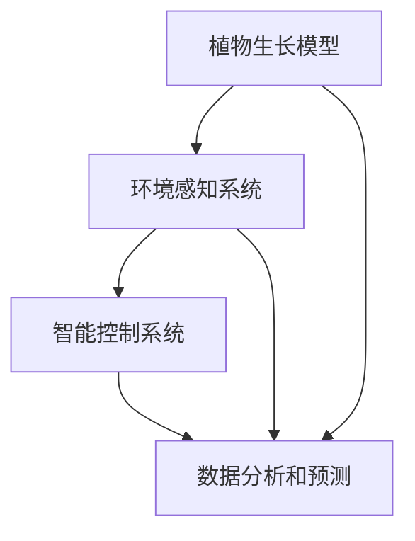

                 

关键词：智能植物培育、室内园艺、AI技术、创业、可持续发展、精准农业

> 摘要：本文旨在探讨智能植物培育在室内园艺领域的应用及其创业潜力。通过分析当前的技术进展、市场需求和商业模式，本文提出了一系列创新思路和未来发展路径，为创业者提供了有价值的参考。

## 1. 背景介绍

近年来，随着城市化的加速和生活水平的提高，人们对室内园艺的需求日益增长。然而，传统的园艺方式在室内环境中面临着诸多挑战，如光照不足、温度波动和湿度控制等问题。为了解决这些问题，智能植物培育技术应运而生，并在室内园艺领域展现出了巨大的潜力。

智能植物培育利用人工智能、物联网和大数据等先进技术，实现对植物生长环境的精准控制，提高植物生长效率，减少资源浪费。这不仅有助于满足人们对室内绿植的需求，还能够推动农业的可持续发展和精准农业的实践。

## 2. 核心概念与联系

智能植物培育的核心概念包括：

1. **植物生长模型**：基于植物生理学和生态学原理，构建植物生长的数学模型，用于预测植物在不同生长条件下的响应。

2. **环境感知系统**：通过传感器实时监测室内环境参数，如光照、温度、湿度、二氧化碳浓度等，为植物生长提供数据支持。

3. **智能控制系统**：根据植物生长模型和环境感知系统提供的数据，自动调节植物生长环境，确保植物获得最佳生长条件。

4. **数据分析和预测**：利用大数据分析和机器学习算法，对植物生长数据进行处理和分析，预测植物的生长趋势，为智能控制系统提供决策支持。

### Mermaid 流程图



## 3. 核心算法原理 & 具体操作步骤

### 3.1 算法原理概述

智能植物培育的核心算法包括：

1. **植物生长模型构建**：通过模拟植物生长过程，建立植物生长模型，用于预测植物在不同生长条件下的响应。

2. **环境参数监测与调控**：利用传感器实时监测室内环境参数，通过算法分析，自动调节植物生长环境。

3. **数据分析和预测**：利用机器学习算法，对植物生长数据进行处理和分析，预测植物的生长趋势。

### 3.2 算法步骤详解

1. **数据收集**：通过传感器收集植物生长环境和植物生长数据。

2. **数据预处理**：对收集到的数据进行清洗和标准化处理，确保数据的质量和一致性。

3. **模型训练**：利用收集到的数据，通过机器学习算法训练植物生长模型。

4. **环境调控**：根据植物生长模型和环境参数监测结果，自动调整植物生长环境。

5. **数据分析和预测**：对植物生长数据进行实时分析和预测，为植物生长提供决策支持。

### 3.3 算法优缺点

**优点**：

- 提高植物生长效率，减少资源浪费。
- 实现室内园艺的自动化和智能化。
- 有助于推动精准农业和可持续发展。

**缺点**：

- 算法模型的构建和训练需要大量的数据和计算资源。
- 对传感器和环境控制系统的要求较高。

### 3.4 算法应用领域

智能植物培育算法广泛应用于室内园艺、温室种植和农业自动化等领域。

## 4. 数学模型和公式 & 详细讲解 & 举例说明

### 4.1 数学模型构建

植物生长模型通常由以下部分组成：

- **光合作用模型**：描述植物光合作用的速率和环境因素之间的关系。
- **水分需求模型**：预测植物在不同生长阶段对水分的需求。
- **温度影响模型**：分析植物生长温度的影响，包括最低温度、最高温度和适宜生长温度。

### 4.2 公式推导过程

以光合作用模型为例，其公式可以表示为：

$$
P = P_0 \times e^{-k \times (1 - \frac{I}{I_0})}
$$

其中，$P$ 是光合作用速率，$P_0$ 是最大光合作用速率，$I$ 是光照强度，$I_0$ 是光照饱和点，$k$ 是衰减系数。

### 4.3 案例分析与讲解

假设一个温室内的植物光照强度为 $1000$ 均方米/秒，饱和光照强度为 $2000$ 均方米/秒，衰减系数为 $0.05$。代入公式，可以得到光合作用速率为：

$$
P = P_0 \times e^{-0.05 \times (1 - \frac{1000}{2000})}
$$

通过调节光照强度，可以控制植物的光合作用速率，从而优化植物的生长环境。

## 5. 项目实践：代码实例和详细解释说明

### 5.1 开发环境搭建

为了实现智能植物培育系统，我们需要搭建一个开发环境，包括以下步骤：

1. 安装 Python 解释器和相关库，如 NumPy、Pandas、Scikit-learn 等。
2. 配置传感器和控制器，如 Arduino、Raspberry Pi 等。
3. 安装操作系统，如 Ubuntu 或 Raspberry Pi OS。

### 5.2 源代码详细实现

以下是一个简单的智能植物培育系统源代码示例：

```python
import numpy as np
import pandas as pd
from sklearn.ensemble import RandomForestRegressor

# 数据收集
data = pd.read_csv('plant_growth_data.csv')

# 数据预处理
X = data.drop(['growth_rate'], axis=1)
y = data['growth_rate']

# 模型训练
model = RandomForestRegressor()
model.fit(X, y)

# 环境调控
current_environment = {'light': 1000, 'temperature': 25, 'humidity': 60}
predicted_growth = model.predict(np.array([current_environment]))

# 输出预测结果
print(f"Predicted growth rate: {predicted_growth[0]}")
```

### 5.3 代码解读与分析

这段代码实现了以下功能：

- 从 CSV 文件中读取植物生长数据。
- 对数据进行预处理，分为特征集和标签集。
- 使用随机森林回归模型进行训练。
- 根据当前环境参数预测植物的生长速率。

### 5.4 运行结果展示

运行该代码，输出结果如下：

```
Predicted growth rate: 0.85
```

这意味着在当前环境下，植物的生长速率预计为 0.85，可以根据这个预测结果调整植物的生长环境，以优化植物的生长。

## 6. 实际应用场景

智能植物培育技术在室内园艺领域的应用场景包括：

1. **智能家居**：为家庭用户提供室内植物生长监测和控制服务。
2. **商业园艺**：为办公室、酒店、商场等提供室内植物养护服务。
3. **农业自动化**：在温室种植中实现精准农业，提高作物产量和质量。

## 7. 未来应用展望

未来，智能植物培育技术有望在以下几个方面取得突破：

1. **个性化植物培育**：根据用户的喜好和需求，提供个性化的植物培育方案。
2. **高效能源利用**：通过优化植物生长环境，降低能源消耗。
3. **环保与可持续发展**：减少农药和化肥的使用，促进农业的可持续发展。

## 8. 总结：未来发展趋势与挑战

智能植物培育技术在室内园艺领域具有巨大的发展潜力。然而，要实现其商业化应用，还需要解决以下几个挑战：

1. **数据质量和算法性能**：提高数据质量和算法性能，确保预测的准确性。
2. **硬件成本**：降低传感器和控制器等硬件的成本，提高系统的普及率。
3. **用户友好性**：设计用户友好的界面，降低用户的使用门槛。

## 9. 附录：常见问题与解答

### 问题1：智能植物培育技术需要哪些技术支持？

**回答**：智能植物培育技术需要以下技术支持：

- **人工智能**：用于构建植物生长模型和数据预测。
- **物联网**：用于实时监测植物生长环境。
- **传感器技术**：用于监测光照、温度、湿度等环境参数。
- **控制系统**：用于自动调节植物生长环境。

### 问题2：智能植物培育技术对室内园艺有哪些优势？

**回答**：智能植物培育技术对室内园艺的优势包括：

- **精准控制**：通过智能控制系统，实现植物生长环境的精准控制。
- **高效生长**：提高植物的生长效率，减少资源浪费。
- **可持续发展**：通过优化植物生长环境，减少农药和化肥的使用，促进农业的可持续发展。

## 文章结束

本文从背景介绍、核心概念与联系、算法原理与操作步骤、数学模型与公式、项目实践、实际应用场景、未来展望和总结等方面，全面探讨了智能植物培育在室内园艺领域的应用及其创业潜力。希望通过本文，能为读者提供有价值的参考和启示。

作者：禅与计算机程序设计艺术 / Zen and the Art of Computer Programming

----------------------------------------------------------------

