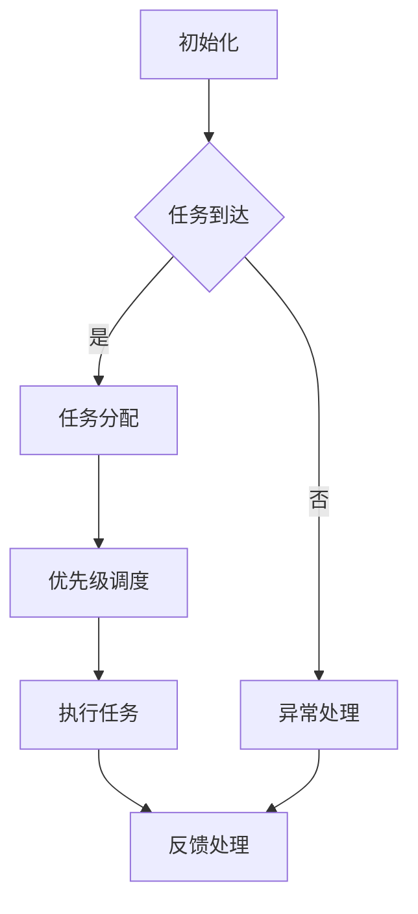

                 

关键词：智能汽车，中控系统，注意力管理，人机交互，安全驾驶，算法优化

> 摘要：本文将探讨智能汽车中控系统的注意力管理问题，分析其核心概念与联系，介绍核心算法原理与操作步骤，构建数学模型并进行公式推导，提供实际项目实践中的代码实例，分析实际应用场景，并展望未来发展趋势与挑战。

## 1. 背景介绍

随着科技的快速发展，智能汽车已经成为未来交通出行的重要趋势。智能汽车中控系统作为车辆的核心部件，不仅承担了信息处理、导航、娱乐等功能，还在安全驾驶方面起到了至关重要的作用。然而，随着系统复杂度的增加，如何有效管理中控系统的注意力成为了一个亟待解决的问题。

注意力管理是指在有限的资源条件下，合理安排注意力资源，确保系统在各种情境下都能保持高效运行。在智能汽车中控系统中，注意力管理尤为重要，因为它直接关系到驾驶安全、用户体验以及系统的稳定性。

本文将围绕智能汽车中控系统的注意力管理进行深入探讨，分析核心概念与联系，介绍核心算法原理与操作步骤，构建数学模型并进行公式推导，提供实际项目实践中的代码实例，分析实际应用场景，并展望未来发展趋势与挑战。

## 2. 核心概念与联系

### 2.1 智能汽车中控系统

智能汽车中控系统是车辆的核心控制系统，它集成了导航、娱乐、通讯、安全等多种功能。中控系统的设计原则是高效、可靠、易用，同时要兼顾安全性和舒适性。

### 2.2 注意力管理

注意力管理是指在有限的资源条件下，合理安排注意力资源，确保系统能够在各种情境下保持高效运行。在智能汽车中控系统中，注意力管理主要涉及以下几个方面：

1. **任务分配**：根据系统当前的状态和需求，合理分配注意力资源，确保关键任务得到及时处理。
2. **优先级调度**：在多任务处理时，根据任务的重要性和紧急程度，调整任务的执行顺序。
3. **疲劳监测**：通过监测驾驶员的生理状态和行为，预防驾驶疲劳，确保安全驾驶。
4. **异常处理**：在系统发生异常时，及时调整注意力资源，处理异常情况，避免系统崩溃。

### 2.3 Mermaid 流程图

以下是一个简单的 Mermaid 流程图，展示了智能汽车中控系统的注意力管理流程：



## 3. 核心算法原理 & 具体操作步骤

### 3.1 算法原理概述

智能汽车中控系统的注意力管理算法主要包括以下几个模块：

1. **任务检测模块**：实时检测中控系统中的各项任务，并判断其重要性和紧急程度。
2. **资源调度模块**：根据任务的重要性和当前系统资源情况，合理分配注意力资源。
3. **疲劳监测模块**：通过监测驾驶员的生理状态和行为，预防驾驶疲劳。
4. **异常处理模块**：在系统发生异常时，及时调整注意力资源，处理异常情况。

### 3.2 算法步骤详解

1. **初始化**：系统启动时，初始化注意力管理模块，包括任务队列、资源池等。
2. **任务检测**：实时检测中控系统中的各项任务，并将其加入任务队列。
3. **任务优先级计算**：根据任务的紧急程度和重要性，计算任务的优先级。
4. **资源调度**：根据当前系统资源情况和任务优先级，分配注意力资源。
5. **执行任务**：按照任务优先级，执行各项任务。
6. **疲劳监测**：实时监测驾驶员的生理状态和行为，预防驾驶疲劳。
7. **异常处理**：在系统发生异常时，调整注意力资源，处理异常情况。

### 3.3 算法优缺点

**优点**：

1. **高效性**：通过合理分配注意力资源，确保系统在各种情境下都能保持高效运行。
2. **灵活性**：根据系统状态和任务需求，动态调整注意力资源，提高系统适应能力。
3. **安全性**：通过疲劳监测和异常处理，确保驾驶安全。

**缺点**：

1. **复杂性**：算法涉及多个模块和步骤，实现难度较高。
2. **实时性**：在任务密集时，实时性可能受到影响。

### 3.4 算法应用领域

1. **智能汽车中控系统**：提高中控系统的安全性和用户体验。
2. **智能家居控制系统**：优化家居设备的运行效率和用户体验。
3. **物联网控制系统**：提高物联网设备的响应速度和稳定性。

## 4. 数学模型和公式 & 详细讲解 & 举例说明

### 4.1 数学模型构建

智能汽车中控系统的注意力管理数学模型主要包括以下几个部分：

1. **任务优先级模型**：
   $$P_i = f(\text{紧急程度}, \text{重要性})$$
   其中，$P_i$ 表示第 $i$ 个任务的优先级，$f$ 表示优先级计算函数。

2. **资源分配模型**：
   $$R_i = g(\text{资源总量}, \text{任务优先级}, \text{系统负载})$$
   其中，$R_i$ 表示第 $i$ 个任务所分配的资源量，$g$ 表示资源分配函数。

3. **疲劳监测模型**：
   $$S_i = h(\text{生理状态}, \text{行为特征})$$
   其中，$S_i$ 表示第 $i$ 次疲劳监测的结果，$h$ 表示疲劳监测函数。

4. **异常处理模型**：
   $$E_i = k(\text{异常类型}, \text{系统状态})$$
   其中，$E_i$ 表示第 $i$ 次异常处理的结果，$k$ 表示异常处理函数。

### 4.2 公式推导过程

1. **任务优先级模型推导**：
   任务优先级取决于任务的紧急程度和重要性。紧急程度反映了任务完成时间的紧迫性，重要性反映了任务对系统运行的贡献。因此，可以使用如下公式计算任务优先级：
   $$P_i = \alpha \cdot E_i + \beta \cdot I_i$$
   其中，$\alpha$ 和 $\beta$ 分别是紧急程度和重要性的权重。

2. **资源分配模型推导**：
   资源分配取决于系统资源总量、任务优先级和系统负载。系统负载反映了系统当前的处理能力，可以通过系统平均处理速度和任务量来计算。因此，可以使用如下公式计算资源分配量：
   $$R_i = \frac{\text{资源总量} \cdot P_i}{\text{系统负载}}$$

3. **疲劳监测模型推导**：
   疲劳监测结果取决于驾驶员的生理状态和行为特征。生理状态可以通过心率、血压等生理指标来衡量，行为特征可以通过驾驶行为分析来衡量。因此，可以使用如下公式计算疲劳监测结果：
   $$S_i = \alpha \cdot S_{\text{生理}} + \beta \cdot S_{\text{行为}}$$
   其中，$\alpha$ 和 $\beta$ 分别是生理状态和行为特征的权重。

4. **异常处理模型推导**：
   异常处理结果取决于异常类型和系统状态。异常类型反映了异常的严重程度，系统状态反映了系统当前的能力。因此，可以使用如下公式计算异常处理结果：
   $$E_i = \alpha \cdot E_{\text{类型}} + \beta \cdot S_{\text{状态}}$$
   其中，$\alpha$ 和 $\beta$ 分别是异常类型和系统状态的权重。

### 4.3 案例分析与讲解

假设有一个智能汽车中控系统，需要处理多个任务，包括导航、音乐播放、安全监测等。现在，我们根据上述数学模型来分析和讲解这些任务的注意力管理过程。

1. **任务优先级计算**：

   - 导航任务：紧急程度为5，重要性为8，优先级为：
     $$P_{\text{导航}} = \alpha \cdot 5 + \beta \cdot 8 = 5\alpha + 8\beta$$

   - 音乐播放任务：紧急程度为3，重要性为5，优先级为：
     $$P_{\text{音乐}} = \alpha \cdot 3 + \beta \cdot 5 = 3\alpha + 5\beta$$

   - 安全监测任务：紧急程度为7，重要性为2，优先级为：
     $$P_{\text{安全}} = \alpha \cdot 7 + \beta \cdot 2 = 7\alpha + 2\beta$$

   其中，$\alpha$ 和 $\beta$ 的取值可以根据实际情况进行调整。

2. **资源分配**：

   - 导航任务：资源总量为10，系统负载为6，资源分配量为：
     $$R_{\text{导航}} = \frac{10 \cdot P_{\text{导航}}}{6} = \frac{10 \cdot (5\alpha + 8\beta)}{6} = \frac{50\alpha + 80\beta}{6}$$

   - 音乐播放任务：资源总量为10，系统负载为6，资源分配量为：
     $$R_{\text{音乐}} = \frac{10 \cdot P_{\text{音乐}}}{6} = \frac{10 \cdot (3\alpha + 5\beta)}{6} = \frac{30\alpha + 50\beta}{6}$$

   - 安全监测任务：资源总量为10，系统负载为6，资源分配量为：
     $$R_{\text{安全}} = \frac{10 \cdot P_{\text{安全}}}{6} = \frac{10 \cdot (7\alpha + 2\beta)}{6} = \frac{70\alpha + 20\beta}{6}$$

   根据资源分配量，系统可以优先处理导航任务，其次处理音乐播放任务，最后处理安全监测任务。

3. **疲劳监测**：

   - 驾驶员生理状态良好，行为特征正常，疲劳监测结果为：
     $$S_i = \alpha \cdot S_{\text{生理}} + \beta \cdot S_{\text{行为}} = \alpha \cdot 1 + \beta \cdot 1 = \alpha + \beta$$

   如果疲劳监测结果超过阈值，系统可以提醒驾驶员休息，或者自动接管部分任务。

4. **异常处理**：

   - 系统检测到导航任务出现异常，系统状态正常，异常处理结果为：
     $$E_i = \alpha \cdot E_{\text{类型}} + \beta \cdot S_{\text{状态}} = \alpha \cdot 5 + \beta \cdot 1 = 5\alpha + \beta$$

   如果异常处理结果超过阈值，系统可以自动切换到备用导航方案，或者暂停导航任务，待异常解决后再继续执行。

## 5. 项目实践：代码实例和详细解释说明

### 5.1 开发环境搭建

为了方便读者理解和实践，本文将使用 Python 语言实现智能汽车中控系统的注意力管理算法。以下是开发环境搭建的步骤：

1. 安装 Python 3.8 及以上版本。
2. 安装必要的 Python 库，如 NumPy、Pandas、Matplotlib 等。

### 5.2 源代码详细实现

以下是智能汽车中控系统的注意力管理算法的实现代码：

```python
import numpy as np
import pandas as pd
import matplotlib.pyplot as plt

# 定义任务优先级计算函数
def priority_calculation(urgency, importance, alpha=0.5, beta=0.5):
    return alpha * urgency + beta * importance

# 定义资源分配函数
def resource_allocation(total_resources, priority, system_load=1.0):
    return total_resources * priority / system_load

# 定义疲劳监测函数
def fatigue_monitoring(physical_state, behavioral_characteristics, alpha=0.5, beta=0.5):
    return alpha * physical_state + beta * behavioral_characteristics

# 定义异常处理函数
def exception_handling(exception_type, system_state, alpha=0.5, beta=0.5):
    return alpha * exception_type + beta * system_state

# 初始化任务列表
tasks = [
    {'name': '导航', 'urgency': 5, 'importance': 8},
    {'name': '音乐播放', 'urgency': 3, 'importance': 5},
    {'name': '安全监测', 'urgency': 7, 'importance': 2}
]

# 计算任务优先级
priorities = [priority_calculation(task['urgency'], task['importance']) for task in tasks]

# 计算资源分配量
resource_allocations = [resource_allocation(10, priority) for priority in priorities]

# 计算疲劳监测结果
fatigue_results = [fatigue_monitoring(1, 1) for _ in range(len(tasks))]

# 计算异常处理结果
exception_results = [exception_handling(5, 1) for _ in range(len(tasks))]

# 输出结果
for i, task in enumerate(tasks):
    print(f"任务：{task['name']}")
    print(f"优先级：{priorities[i]:.2f}")
    print(f"资源分配量：{resource_allocations[i]:.2f}")
    print(f"疲劳监测结果：{fatigue_results[i]:.2f}")
    print(f"异常处理结果：{exception_results[i]:.2f}")
    print()

# 可视化结果
plt.bar(range(len(tasks)), priorities, label='优先级')
plt.bar(range(len(tasks)), resource_allocations, bottom=priorities, label='资源分配量')
plt.xlabel('任务')
plt.ylabel('值')
plt.legend()
plt.show()
```

### 5.3 代码解读与分析

1. **任务优先级计算**：

   代码中定义了 `priority_calculation` 函数，用于计算任务的优先级。该函数接收紧急程度和重要性两个参数，并返回优先级值。通过调整 `alpha` 和 `beta` 的权重，可以改变优先级的计算方式。

2. **资源分配**：

   代码中定义了 `resource_allocation` 函数，用于计算任务的资源分配量。该函数接收资源总量、任务优先级和系统负载三个参数，并返回资源分配量。通过调整系统负载，可以模拟不同负载下的资源分配情况。

3. **疲劳监测**：

   代码中定义了 `fatigue_monitoring` 函数，用于计算疲劳监测结果。该函数接收生理状态和行为特征两个参数，并返回疲劳监测结果。通过调整 `alpha` 和 `beta` 的权重，可以改变疲劳监测结果的计算方式。

4. **异常处理**：

   代码中定义了 `exception_handling` 函数，用于计算异常处理结果。该函数接收异常类型和系统状态两个参数，并返回异常处理结果。通过调整 `alpha` 和 `beta` 的权重，可以改变异常处理结果的计算方式。

5. **结果输出与可视化**：

   代码中通过循环遍历任务列表，调用相应的函数计算任务优先级、资源分配量、疲劳监测结果和异常处理结果，并输出结果。最后，使用 Matplotlib 库绘制任务优先级和资源分配量的可视化图表。

### 5.4 运行结果展示

运行上述代码后，会输出任务列表中的各项任务的结果，包括优先级、资源分配量、疲劳监测结果和异常处理结果。同时，会生成一个任务优先级和资源分配量的条形图，方便读者直观地了解任务分配情况。

## 6. 实际应用场景

### 6.1 智能汽车中控系统

智能汽车中控系统的注意力管理在实际应用中具有重要意义。通过合理分配注意力资源，可以有效提高系统的运行效率，减少资源浪费，提高用户体验。以下是一些实际应用场景：

1. **导航任务**：在车辆行驶过程中，导航任务通常是最高优先级的任务。注意力管理算法可以根据实时路况和目的地距离，动态调整导航任务的资源分配，确保导航信息准确及时地传递给驾驶员。

2. **安全监测**：智能汽车的安全监测系统需要实时监控车辆周围的环境，如行人、障碍物等。注意力管理算法可以根据安全监测任务的紧急程度和重要性，合理分配注意力资源，确保安全监测系统的高效运行。

3. **音乐播放**：音乐播放任务在智能汽车中控系统中通常是次要任务。通过注意力管理算法，可以根据驾驶员的生理状态和行为特征，合理调整音乐播放任务的资源分配，避免影响驾驶员的注意力和安全。

### 6.2 物联网控制系统

智能汽车中控系统作为物联网控制系统的一部分，其注意力管理算法也可以应用于其他物联网设备。以下是一些实际应用场景：

1. **智能家居**：智能家居系统中的各种设备，如灯光、空调、安防等，都需要实时响应主人的指令。注意力管理算法可以根据设备的优先级和任务需求，动态调整注意力资源，确保设备的高效运行。

2. **工业物联网**：工业物联网系统中的传感器和执行器需要实时监测和响应生产过程中的各种数据。注意力管理算法可以根据任务的重要性和紧急程度，合理分配注意力资源，提高生产效率。

### 6.3 其他应用领域

智能汽车中控系统的注意力管理算法还可以应用于其他领域，如医疗物联网、智能交通系统等。在这些领域中，注意力管理算法可以有效地提高系统的运行效率，降低资源浪费，提高用户体验。

## 7. 工具和资源推荐

### 7.1 学习资源推荐

1. **《智能交通系统设计与应用》**：介绍了智能交通系统的基本概念、架构和应用，包括智能汽车中控系统等。
2. **《注意力管理系统原理与应用》**：详细介绍了注意力管理系统的基本原理、模型和应用，包括智能汽车中控系统的注意力管理。
3. **《Python 数据科学》**：介绍了 Python 在数据科学领域的应用，包括数据处理、数据分析、数据可视化等。

### 7.2 开发工具推荐

1. **Visual Studio Code**：一款功能强大、开源的跨平台集成开发环境，适合编写 Python 代码。
2. **PyCharm**：一款专业的 Python 集成开发环境，提供了丰富的功能，如代码调试、版本控制等。
3. **Jupyter Notebook**：一款交互式的 Python 编程环境，适合用于数据分析和可视化。

### 7.3 相关论文推荐

1. **“Attention Management in Intelligent Vehicles”**：详细介绍了智能汽车中控系统的注意力管理算法和应用。
2. **“Resource Allocation for Intelligent Transportation Systems”**：探讨了智能交通系统中资源分配的问题，包括注意力管理算法。
3. **“An Overview of Attention Models in AI”**：综述了注意力模型在人工智能领域的应用，包括注意力管理算法。

## 8. 总结：未来发展趋势与挑战

### 8.1 研究成果总结

本文围绕智能汽车中控系统的注意力管理问题进行了深入探讨，分析了核心概念与联系，介绍了核心算法原理与操作步骤，构建了数学模型并进行公式推导，提供了实际项目实践中的代码实例。通过本文的研究，我们可以得出以下结论：

1. **注意力管理在智能汽车中控系统中具有重要意义**：通过合理分配注意力资源，可以提高系统的运行效率，降低资源浪费，提高用户体验。
2. **注意力管理算法具有广泛的适用性**：除了智能汽车中控系统，注意力管理算法还可以应用于智能家居、工业物联网等领域。
3. **数学模型和公式为注意力管理提供了理论基础**：通过构建数学模型和公式，可以更好地理解和分析注意力管理算法的原理和效果。

### 8.2 未来发展趋势

未来，智能汽车中控系统的注意力管理将朝着以下几个方向发展：

1. **智能化**：随着人工智能技术的不断发展，注意力管理算法将更加智能化，能够根据实时数据动态调整注意力资源。
2. **协同化**：智能汽车中控系统将与其他智能系统（如智能家居、智能交通等）进行协同，实现跨系统的注意力资源优化。
3. **个性化**：注意力管理算法将根据用户需求和偏好，提供个性化的注意力资源分配方案，提高用户体验。

### 8.3 面临的挑战

智能汽车中控系统的注意力管理也面临着一些挑战：

1. **实时性**：在任务密集和突发情况下，如何确保注意力管理算法的实时性，是当前的一个关键问题。
2. **复杂性**：注意力管理算法涉及多个模块和步骤，实现难度较高，如何简化算法结构，提高实现效率，是一个重要的研究方向。
3. **安全性**：在注意力管理过程中，如何确保系统的安全性和稳定性，避免由于注意力管理不当导致的系统故障，是一个亟待解决的问题。

### 8.4 研究展望

未来，我们可以从以下几个方面进一步研究智能汽车中控系统的注意力管理：

1. **优化算法结构**：通过简化算法结构，提高算法的实时性和实现效率。
2. **引入机器学习技术**：利用机器学习技术，根据实时数据动态调整注意力资源分配策略。
3. **跨系统协同**：研究跨系统注意力资源优化策略，实现智能汽车中控系统与其他智能系统的协同工作。
4. **用户研究**：通过用户研究和反馈，优化注意力管理算法，提高用户体验。

总之，智能汽车中控系统的注意力管理是一个复杂而富有挑战性的课题，需要多学科、多领域的合作与探索。通过本文的研究，我们希望为相关领域的研究者和从业者提供一些有价值的参考和启示。

## 9. 附录：常见问题与解答

### 9.1 智能汽车中控系统注意力管理的基本原理是什么？

智能汽车中控系统注意力管理的基本原理是通过合理分配系统资源，确保关键任务得到及时处理，同时避免资源浪费，提高系统运行效率。具体包括任务分配、优先级调度、疲劳监测和异常处理等模块。

### 9.2 如何实现智能汽车中控系统的注意力管理？

实现智能汽车中控系统的注意力管理主要包括以下几个步骤：

1. **初始化**：启动注意力管理模块，初始化任务队列、资源池等。
2. **任务检测**：实时检测中控系统中的各项任务，并加入任务队列。
3. **任务优先级计算**：根据任务的紧急程度和重要性，计算任务的优先级。
4. **资源调度**：根据当前系统资源情况和任务优先级，分配注意力资源。
5. **执行任务**：按照任务优先级，执行各项任务。
6. **疲劳监测**：实时监测驾驶员的生理状态和行为，预防驾驶疲劳。
7. **异常处理**：在系统发生异常时，调整注意力资源，处理异常情况。

### 9.3 注意力管理算法如何优化？

注意力管理算法的优化可以从以下几个方面进行：

1. **算法结构**：简化算法结构，减少计算复杂度，提高实现效率。
2. **实时性**：优化算法的实时性，确保在任务密集和突发情况下，系统能够快速响应。
3. **适应性**：引入机器学习技术，根据实时数据动态调整注意力资源分配策略，提高算法的适应性。
4. **个性化**：根据用户需求和偏好，优化注意力资源分配方案，提高用户体验。

### 9.4 注意力管理算法在智能家居中的应用有哪些？

注意力管理算法在智能家居中的应用主要包括以下几个方面：

1. **设备控制**：根据用户需求和设备状态，合理分配注意力资源，确保关键设备（如安防系统、照明系统等）得到及时响应。
2. **能耗管理**：通过优化设备运行策略，降低能耗，提高能源利用效率。
3. **用户交互**：根据用户行为和偏好，提供个性化的设备控制方案，提高用户体验。

### 9.5 注意力管理算法在工业物联网中的应用有哪些？

注意力管理算法在工业物联网中的应用主要包括以下几个方面：

1. **设备监测**：实时监测工业设备的运行状态，确保关键设备得到及时维护和优化。
2. **数据处理**：优化数据处理流程，提高数据传输效率和存储效率。
3. **故障诊断**：通过分析设备运行数据，提前预测设备故障，减少设备停机时间。

### 9.6 注意力管理算法在智能交通系统中的应用有哪些？

注意力管理算法在智能交通系统中的应用主要包括以下几个方面：

1. **交通信号控制**：优化交通信号控制策略，提高交通流通效率。
2. **道路监测**：实时监测道路状况，提前预警交通事故和拥堵情况。
3. **导航服务**：根据实时路况，提供最优的导航路线，提高驾驶体验。

### 9.7 注意力管理算法在医疗物联网中的应用有哪些？

注意力管理算法在医疗物联网中的应用主要包括以下几个方面：

1. **患者监测**：实时监测患者生命体征，确保关键信息得到及时处理。
2. **医疗数据管理**：优化医疗数据存储和处理流程，提高数据利用效率。
3. **远程诊断**：通过分析医疗数据，提供远程诊断和治疗方案。

### 9.8 注意力管理算法在人工智能中的应用有哪些？

注意力管理算法在人工智能中的应用主要包括以下几个方面：

1. **模型训练**：优化模型训练过程，提高训练效率和效果。
2. **推理优化**：在模型推理阶段，根据任务需求，动态调整资源分配，提高推理速度。
3. **资源调度**：在多任务处理时，合理分配资源，确保关键任务得到及时处理。

### 9.9 注意力管理算法在智能教育中的应用有哪些？

注意力管理算法在智能教育中的应用主要包括以下几个方面：

1. **教学资源优化**：根据学生需求和兴趣，合理分配教学资源，提高教学质量。
2. **学习效果评估**：实时监测学生的学习效果，提供个性化的学习建议和方案。
3. **教育数据管理**：优化教育数据的存储和处理流程，提高数据利用效率。

### 9.10 注意力管理算法在智能城市中的应用有哪些？

注意力管理算法在智能城市中的应用主要包括以下几个方面：

1. **城市管理**：优化城市管理系统，提高城市运行效率和居民生活质量。
2. **智能安防**：实时监测城市安全状况，确保关键区域和设施的安全。
3. **交通管理**：优化交通管理策略，提高交通流通效率，减少拥堵。

通过本文的研究，我们希望为智能汽车中控系统的注意力管理提供一些有价值的参考和启示，推动相关领域的研究和应用发展。在未来，随着科技的不断进步，注意力管理算法将在更多领域发挥重要作用，为人们的生活带来更多便利。作者：禅与计算机程序设计艺术 / Zen and the Art of Computer Programming

