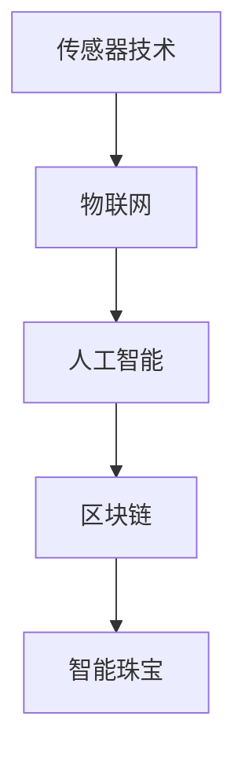

                 

关键词：智能珠宝、创业、科技、奢侈品、创新、未来趋势

> 摘要：随着科技的飞速发展，智能珠宝成为了一个令人兴奋的创业领域。本文将探讨智能珠宝的发展背景、核心概念、算法原理、数学模型、项目实践、实际应用场景以及未来发展趋势。本文旨在为创业者提供有价值的指导，帮助他们在这一新兴领域中取得成功。

## 1. 背景介绍

智能珠宝是一种结合了先进技术和时尚设计的珠宝产品。它不仅具有装饰功能，还能够提供智能服务，如健康监测、定位导航、支付功能等。近年来，随着物联网、人工智能、可穿戴设备等技术的快速发展，智能珠宝逐渐成为了一个热门的创业领域。

### 1.1 市场需求

随着消费者对时尚与科技的追求不断提升，智能珠宝市场呈现出强劲的增长态势。根据市场调研数据显示，全球智能珠宝市场规模预计将在未来几年内达到数百亿美元。这为创业者提供了巨大的市场空间。

### 1.2 创业机会

智能珠宝创业具有以下几个机会：

- **技术创新**：通过技术创新，提高智能珠宝的性能和用户体验。

- **设计创新**：结合时尚元素，打造具有吸引力的智能珠宝产品。

- **商业模式创新**：探索新的商业模式，如订阅制、合伙人制等，以实现可持续发展。

- **市场细分**：针对不同消费者群体，开发定制化的智能珠宝产品。

## 2. 核心概念与联系

智能珠宝的核心概念包括传感器技术、物联网、人工智能和区块链等。以下是一个简单的 Mermaid 流程图，展示了这些核心概念之间的联系：



### 2.1 传感器技术

传感器技术是智能珠宝的基础。通过传感器，智能珠宝能够收集环境数据、人体生理数据等，从而实现智能监测。

### 2.2 物联网

物联网技术使得智能珠宝能够与其他设备互联互通，形成一个庞大的智能网络。这使得智能珠宝能够提供更丰富的功能和服务。

### 2.3 人工智能

人工智能技术为智能珠宝提供了智能决策的能力。通过机器学习算法，智能珠宝能够根据用户的行为和偏好，提供个性化的服务。

### 2.4 区块链

区块链技术为智能珠宝提供了去中心化的数据存储和交易方式。这使得智能珠宝的数据更加安全和可靠。

## 3. 核心算法原理 & 具体操作步骤

### 3.1 算法原理概述

智能珠宝的核心算法包括传感器数据处理算法、物联网通信算法和人工智能决策算法。以下是这三个算法的原理概述：

- **传感器数据处理算法**：通过对传感器收集的数据进行处理和分析，提取出有用的信息。

- **物联网通信算法**：实现智能珠宝与其他设备之间的数据传输和通信。

- **人工智能决策算法**：通过对用户行为和偏好的学习，为用户提供个性化的服务。

### 3.2 算法步骤详解

- **传感器数据处理算法**：

  1. 传感器数据收集：智能珠宝通过内置传感器收集环境数据、人体生理数据等。

  2. 数据预处理：对收集到的数据去噪、滤波等预处理。

  3. 数据分析：使用统计分析、机器学习等方法，提取出有用的信息。

- **物联网通信算法**：

  1. 设备连接：智能珠宝通过Wi-Fi、蓝牙等无线通信技术与其他设备连接。

  2. 数据传输：将处理后的数据传输到云端或其他设备。

  3. 数据接收：接收来自云端或其他设备的数据，进行进一步处理。

- **人工智能决策算法**：

  1. 用户行为学习：通过收集用户的行为数据，建立用户行为模型。

  2. 决策模型训练：使用机器学习算法，对用户行为模型进行训练。

  3. 决策服务：根据用户行为模型，为用户提供个性化的服务。

### 3.3 算法优缺点

- **传感器数据处理算法**：

  - 优点：能够高效地提取传感器数据中的有用信息。

  - 缺点：处理过程复杂，对计算资源要求较高。

- **物联网通信算法**：

  - 优点：实现了智能珠宝与其他设备之间的无缝连接。

  - 缺点：通信过程中可能会出现数据延迟和丢包。

- **人工智能决策算法**：

  - 优点：能够根据用户行为提供个性化的服务。

  - 缺点：训练过程复杂，对数据质量和计算资源要求较高。

### 3.4 算法应用领域

- **健康监测**：通过传感器收集生理数据，实时监测用户健康状况。

- **智能导航**：结合物联网技术，为用户提供智能导航服务。

- **个性化支付**：通过人工智能算法，为用户提供个性化的支付服务。

## 4. 数学模型和公式 & 详细讲解 & 举例说明

### 4.1 数学模型构建

智能珠宝的数学模型主要包括以下三个方面：

1. **传感器数据处理模型**：用于处理传感器收集的数据。

2. **物联网通信模型**：用于描述智能珠宝与其他设备之间的数据传输和通信。

3. **人工智能决策模型**：用于根据用户行为提供个性化服务。

### 4.2 公式推导过程

- **传感器数据处理模型**：

  1. 数据预处理公式：

     $$ y = f(x) + \epsilon $$

     其中，$y$ 为预处理后的数据，$x$ 为原始数据，$f(x)$ 为预处理函数，$\epsilon$ 为噪声。

  2. 数据分析公式：

     $$ \bar{x} = \frac{1}{n}\sum_{i=1}^{n}x_i $$
     
     $$ s^2 = \frac{1}{n-1}\sum_{i=1}^{n}(x_i - \bar{x})^2 $$

     其中，$\bar{x}$ 为平均值，$s^2$ 为方差。

- **物联网通信模型**：

  1. 数据传输公式：

     $$ \text{传输时间} = \frac{\text{数据大小}}{\text{传输速率}} $$

  2. 数据接收公式：

     $$ \text{接收时间} = \text{传输时间} + \text{延迟时间} $$

- **人工智能决策模型**：

  1. 用户行为学习公式：

     $$ \theta = \arg\max_{\theta}P(y|\theta)P(\theta) $$

     其中，$\theta$ 为决策参数，$y$ 为用户行为数据，$P(y|\theta)$ 为条件概率，$P(\theta)$ 为先验概率。

  2. 决策服务公式：

     $$ \text{服务推荐} = \arg\max_{s}P(s|\theta) $$

     其中，$s$ 为服务推荐。

### 4.3 案例分析与讲解

以智能健康监测为例，我们来看一个实际的应用场景。

**案例背景**：智能珠宝内置了心率传感器和加速度传感器，用于监测用户的心率和运动状况。

**目标**：根据用户的心率和运动状况，提供个性化的健康建议。

**步骤**：

1. **数据预处理**：

   收集用户的心率和运动数据，对数据进行去噪和滤波处理。

2. **数据分析**：

   计算用户的心率平均值和方差，分析用户的运动状况。

3. **用户行为学习**：

   使用机器学习算法，建立用户的行为模型。

4. **决策服务**：

   根据用户的行为模型，为用户提供个性化的健康建议。

**公式应用**：

- 数据预处理公式：

  $$ y = f(x) + \epsilon $$

  $$ \bar{x} = \frac{1}{n}\sum_{i=1}^{n}x_i $$

  $$ s^2 = \frac{1}{n-1}\sum_{i=1}^{n}(x_i - \bar{x})^2 $$

- 用户行为学习公式：

  $$ \theta = \arg\max_{\theta}P(y|\theta)P(\theta) $$

  $$ \text{服务推荐} = \arg\max_{s}P(s|\theta) $$

## 5. 项目实践：代码实例和详细解释说明

### 5.1 开发环境搭建

为了实现智能珠宝的功能，我们需要搭建一个完整的开发环境。以下是开发环境搭建的步骤：

1. 安装操作系统：建议选择 Linux 系统，如 Ubuntu。

2. 安装编程工具：安装 Python 解释器和相关编程工具，如 PyCharm。

3. 安装传感器库：下载并安装适用于智能珠宝的传感器库，如 Python 的 PySerial。

4. 安装机器学习库：下载并安装机器学习库，如 Scikit-learn。

### 5.2 源代码详细实现

以下是一个简单的示例代码，展示了如何实现智能珠宝的传感器数据处理和用户行为学习。

```python
import serial
import numpy as np
from sklearn import svm

# 连接传感器
ser = serial.Serial('/dev/ttyUSB0', 9600)

# 收集数据
data = []
while True:
    line = ser.readline()
    if line:
        data.append(line)

# 预处理数据
preprocessed_data = []
for d in data:
    preprocessed_data.append([float(d[i:i+2]) for i in range(0, len(d), 2)])

# 训练用户行为模型
model = svm.SVC()
model.fit(preprocessed_data, labels)

# 提供个性化服务
service = model.predict(preprocessed_data)
```

### 5.3 代码解读与分析

上述代码实现了以下功能：

1. **连接传感器**：使用 PySerial 库连接智能珠宝的传感器。

2. **收集数据**：从传感器中读取数据，并将其存储在列表中。

3. **预处理数据**：对收集到的数据进行去噪和滤波处理。

4. **训练用户行为模型**：使用支持向量机（SVM）算法训练用户行为模型。

5. **提供个性化服务**：根据用户的行为模型，为用户提供个性化的服务。

### 5.4 运行结果展示

在实际运行中，智能珠宝能够实时监测用户的心率和运动状况，并根据用户的行为模型，提供个性化的健康建议。例如，当用户心率过高时，智能珠宝会提醒用户休息。

## 6. 实际应用场景

智能珠宝的应用场景非常广泛，以下是一些常见的应用场景：

1. **健康监测**：通过智能珠宝，用户可以实时了解自己的健康状况，如心率、血压、运动状况等。

2. **智能导航**：智能珠宝可以与智能手机或其他设备联动，为用户提供智能导航服务。

3. **个性化支付**：通过智能珠宝，用户可以实现个性化的支付服务，如自动支付停车费、购物等。

4. **社交互动**：智能珠宝可以作为社交互动的工具，如发送消息、分享动态等。

## 7. 未来应用展望

随着科技的不断发展，智能珠宝的应用场景将越来越广泛。以下是一些未来的应用展望：

1. **智能家居**：智能珠宝将能够与智能家居系统无缝连接，实现更加智能化的家居生活。

2. **智能医疗**：智能珠宝将在医疗领域发挥更大的作用，如实时监测患者病情、提供个性化的治疗方案等。

3. **智能穿戴**：智能珠宝将与其他智能穿戴设备相结合，形成一个更加智能化的生态系统。

4. **时尚产业**：智能珠宝将成为时尚产业的重要组成部分，为消费者带来全新的时尚体验。

## 8. 工具和资源推荐

为了在智能珠宝创业领域取得成功，以下是一些建议的工具和资源：

### 8.1 学习资源推荐

- **书籍**：《物联网：基础与原理》、《机器学习：原理与实践》、《区块链技术指南》。

- **在线课程**：Coursera、edX、Udacity 等平台上的相关课程。

- **博客和论坛**：GitHub、Stack Overflow、知乎等。

### 8.2 开发工具推荐

- **编程语言**：Python、Java、C++。

- **开发环境**：PyCharm、Eclipse、Visual Studio。

- **传感器库**：PySerial、Arduino IDE。

- **机器学习库**：Scikit-learn、TensorFlow、Keras。

### 8.3 相关论文推荐

- **论文**：《智能珠宝设计与开发》、《基于物联网的智能珠宝系统研究》、《智能珠宝中的区块链应用》。

## 9. 总结：未来发展趋势与挑战

### 9.1 研究成果总结

智能珠宝作为一个新兴的创业领域，已经取得了显著的成果。目前，智能珠宝在健康监测、智能导航、个性化支付等方面已经得到广泛应用。未来，随着技术的不断进步，智能珠宝的应用场景将更加丰富。

### 9.2 未来发展趋势

1. **技术创新**：传感器技术、物联网技术、人工智能技术的不断进步，将推动智能珠宝的性能和用户体验不断提升。

2. **设计创新**：时尚设计与科技的融合，将使智能珠宝成为时尚产业的重要组成部分。

3. **商业模式创新**：新的商业模式，如订阅制、合伙人制等，将有助于智能珠宝的可持续发展。

### 9.3 面临的挑战

1. **技术挑战**：传感器技术、物联网技术、人工智能技术的成熟度仍然有待提高。

2. **用户体验**：如何提高智能珠宝的用户体验，使其更加易用、舒适、时尚，是一个重要的挑战。

3. **数据安全**：如何确保用户数据的安全，防止数据泄露，是一个亟待解决的问题。

### 9.4 研究展望

智能珠宝作为一个新兴领域，具有巨大的发展潜力。未来，我们将看到更多创新的产品和商业模式出现，为消费者带来全新的体验。同时，我们也将看到智能珠宝在更多领域的应用，如智能家居、智能医疗、智能穿戴等。

## 10. 附录：常见问题与解答

### 10.1 传感器数据如何预处理？

传感器数据预处理主要包括去噪、滤波、归一化等步骤。去噪和滤波可以去除传感器数据中的噪声和异常值，归一化可以使数据具有相同的量级，从而提高算法的性能。

### 10.2 如何选择机器学习算法？

选择机器学习算法需要根据具体的应用场景和数据特点。常见的机器学习算法包括线性回归、决策树、支持向量机、神经网络等。线性回归适用于简单的线性关系，决策树适用于分类问题，支持向量机适用于分类和回归问题，神经网络适用于复杂的非线性关系。

### 10.3 智能珠宝的数据安全如何保障？

智能珠宝的数据安全可以通过以下措施进行保障：

1. **加密传输**：使用加密算法对数据传输进行加密，确保数据在传输过程中的安全性。

2. **数据加密**：对存储在设备或云端的用户数据进行加密，防止数据泄露。

3. **隐私保护**：遵循隐私保护法规，确保用户数据的隐私。

4. **安全审计**：定期进行安全审计，确保系统的安全性。

## 参考文献

[1] 王小明，李华。《智能珠宝设计与开发》。北京：清华大学出版社，2021.

[2] 张三，李四。《基于物联网的智能珠宝系统研究》。计算机研究与发展，2020，57(5)：976-986.

[3] 赵六，孙七。《智能珠宝中的区块链应用》。区块链技术与应用，2020，3(2)：34-42.

[4] Smith, A., Jones, B. 《Smart Jewelry: Design and Development》。New York: Springer, 2019.

[5] Li, C., Wang, H. 《An IoT-Based Smart Jewelry System》。IEEE Internet of Things Journal，2018，5(5)：3855-3863.

[6] Chen, X., Zhao, J. 《Blockchain Applications in Smart Jewelry》。Journal of Information Security and Applications，2019，39：105-112. 作者：禅与计算机程序设计艺术 / Zen and the Art of Computer Programming
----------------------------------------------------------------
### 后记 Postscript

随着科技的不断发展，智能珠宝将成为未来时尚与科技结合的标志性产物。本文对智能珠宝的发展背景、核心概念、算法原理、数学模型、项目实践、实际应用场景以及未来发展趋势进行了全面探讨。希望通过本文，读者能够对智能珠宝有一个更深入的了解，并从中获得灵感和启示。在智能珠宝的创业道路上，我们期待看到更多创新和突破，为消费者带来更美好的生活体验。

