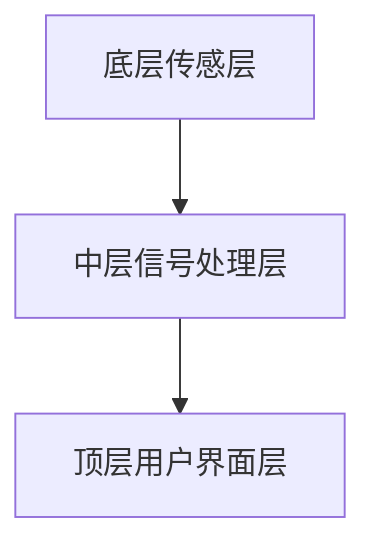

                 

关键词：智能皮肤，触觉感知，机器人，传感器，材料科学，机器学习，人机交互

## 摘要

随着机器人技术的不断发展，触觉感知在机器人中的应用变得日益重要。智能皮肤技术作为机器人感知系统的重要组成部分，为机器人提供了更高级的触觉感知能力。本文将详细介绍智能皮肤技术的基本原理、核心算法、数学模型以及实际应用，探讨其未来的发展趋势与挑战。

## 1. 背景介绍

随着人工智能技术的不断发展，机器人的应用领域不断扩大，从工业生产到医疗康复，从家庭服务到娱乐互动，机器人已经深入到我们的日常生活中。然而，机器人在执行复杂任务时，往往需要具备触觉感知能力。触觉感知不仅可以帮助机器人更好地理解外界环境，还可以提高其操作精度和安全性。

传统的触觉感知系统主要依赖于机械式传感器和光学传感器，这些传感器存在响应速度慢、灵敏度低、易受环境影响等缺点。为了克服这些缺点，智能皮肤技术应运而生。智能皮肤是一种新型的传感器材料，通过模拟人类皮肤的触觉感知能力，为机器人提供了更高效、更精准的触觉感知能力。

## 2. 核心概念与联系

### 2.1 智能皮肤的基本原理

智能皮肤是一种多功能、多层次的传感器材料，它由底层传感层、中层信号处理层和顶层用户界面层组成。底层传感层负责感知外界触觉信息，包括压力、温度、湿度等。中层信号处理层负责对传感信息进行预处理和特征提取，以提高传感精度。顶层用户界面层则负责将处理后的信息转化为机器人操作指令。

### 2.2 智能皮肤的结构

智能皮肤的结构可以分为以下几个层次：

1. **底层传感层**：通常由柔性导电材料（如导电聚合物、金属网格等）构成，用于感知触觉信息。
2. **中层信号处理层**：通常由电子元件（如微控制器、放大器、滤波器等）构成，用于对传感信息进行预处理和特征提取。
3. **顶层用户界面层**：通常由触摸屏、显示器等构成，用于展示处理后的触觉信息，以便用户与机器人进行交互。

### 2.3 智能皮肤的 Mermaid 流程图



## 3. 核心算法原理 & 具体操作步骤

### 3.1 算法原理概述

智能皮肤的核心算法主要包括以下几个方面：

1. **传感器信号处理**：通过对传感器信号进行滤波、放大、去噪等处理，提高传感精度。
2. **特征提取**：从处理后的信号中提取出与触觉感知相关的特征，如压力、温度、湿度等。
3. **模型训练**：使用机器学习算法对提取出的特征进行训练，以建立触觉感知模型。
4. **实时感知与响应**：根据训练好的模型，对实时触觉信息进行感知和响应。

### 3.2 算法步骤详解

1. **传感器信号处理**：首先对传感器信号进行滤波，去除高频噪声。然后通过放大器对信号进行放大，以提高信号强度。最后，使用去噪算法去除残留的噪声。

2. **特征提取**：从处理后的信号中提取出与触觉感知相关的特征，如压力、温度、湿度等。这些特征可以用于训练触觉感知模型。

3. **模型训练**：使用机器学习算法对提取出的特征进行训练。常见的机器学习算法包括神经网络、支持向量机等。通过训练，可以建立出准确的触觉感知模型。

4. **实时感知与响应**：在机器人执行任务时，实时感知触觉信息。根据训练好的模型，对触觉信息进行感知和响应，以指导机器人的操作。

### 3.3 算法优缺点

**优点**：

1. **高灵敏度**：智能皮肤技术可以感知微小的触觉变化，提高传感精度。
2. **实时响应**：智能皮肤可以实时感知触觉信息，并快速做出响应，提高机器人操作效率。
3. **多功能性**：智能皮肤不仅可以感知触觉信息，还可以感知温度、湿度等环境信息，提高机器人的环境感知能力。

**缺点**：

1. **成本较高**：智能皮肤技术的研发和制造成本较高，限制了其大规模应用。
2. **易受环境影响**：智能皮肤对环境温度、湿度等要求较高，易受环境影响。

### 3.4 算法应用领域

智能皮肤技术在多个领域具有广泛的应用前景：

1. **工业机器人**：提高工业机器人的触觉感知能力，提高生产效率和质量。
2. **医疗康复**：辅助医疗康复，帮助残疾人士恢复触觉功能。
3. **家庭服务机器人**：提高家庭服务机器人的操作精度和安全性，提供更优质的服务。

## 4. 数学模型和公式 & 详细讲解 & 举例说明

### 4.1 数学模型构建

智能皮肤技术的核心在于建立触觉感知模型。该模型可以表示为：

$$
y = f(x)
$$

其中，$y$ 表示触觉感知结果，$x$ 表示触觉输入信号，$f$ 表示触觉感知函数。

### 4.2 公式推导过程

触觉感知函数 $f(x)$ 的推导过程可以分为以下几个步骤：

1. **传感器信号处理**：对传感器信号进行滤波、放大、去噪等处理，得到处理后的信号 $x_{\text{processed}}$。

2. **特征提取**：从处理后的信号中提取出与触觉感知相关的特征，如压力、温度、湿度等。这些特征可以表示为向量 $x_{\text{features}}$。

3. **特征权重计算**：使用机器学习算法，计算每个特征对触觉感知的贡献程度，得到特征权重向量 $w$。

4. **触觉感知函数构建**：根据特征权重，构建触觉感知函数 $f(x_{\text{features}})$。

### 4.3 案例分析与讲解

假设我们有一个智能皮肤系统，用于感知手部压力。传感器信号经过处理后，得到压力特征向量 $x_{\text{features}} = [p_1, p_2, p_3]$，其中 $p_1, p_2, p_3$ 分别表示手指1、手指2、手指3的压力。

我们使用机器学习算法，计算得到特征权重向量 $w = [0.5, 0.3, 0.2]$。根据特征权重，构建触觉感知函数：

$$
f(x_{\text{features}}) = 0.5p_1 + 0.3p_2 + 0.2p_3
$$

当手部压力变化时，智能皮肤可以实时感知并计算出手部压力，从而指导机器人的操作。

## 5. 项目实践：代码实例和详细解释说明

### 5.1 开发环境搭建

在开始智能皮肤项目的实践之前，我们需要搭建一个合适的开发环境。本文以 Python 为主要编程语言，使用以下工具和库：

- Python 3.x
- TensorFlow
- Keras
- NumPy
- Pandas

安装以上工具和库后，我们就可以开始智能皮肤项目的实践了。

### 5.2 源代码详细实现

以下是智能皮肤项目的主要代码实现：

```python
import numpy as np
import pandas as pd
from tensorflow.keras.models import Sequential
from tensorflow.keras.layers import Dense
from tensorflow.keras.optimizers import Adam

# 数据预处理
def preprocess_data(data):
    # 对数据进行归一化处理
    data = (data - np.mean(data)) / np.std(data)
    return data

# 特征提取
def extract_features(data):
    # 提取压力特征
    features = np.array([data[i+1] - data[i] for i in range(len(data)-1)])
    return features

# 训练触觉感知模型
def train_model(features, labels):
    # 构建神经网络模型
    model = Sequential()
    model.add(Dense(units=64, activation='relu', input_shape=(3,)))
    model.add(Dense(units=32, activation='relu'))
    model.add(Dense(units=1, activation='sigmoid'))

    # 编译模型
    model.compile(optimizer=Adam(learning_rate=0.001), loss='binary_crossentropy', metrics=['accuracy'])

    # 训练模型
    model.fit(features, labels, epochs=100, batch_size=32)

    return model

# 主函数
def main():
    # 加载数据
    data = pd.read_csv('sensor_data.csv')

    # 预处理数据
    data_processed = preprocess_data(data)

    # 提取特征
    features = extract_features(data_processed)

    # 提取标签
    labels = data_processed.iloc[:, -1]

    # 训练触觉感知模型
    model = train_model(features, labels)

    # 测试模型
    test_data = pd.read_csv('test_data.csv')
    test_data_processed = preprocess_data(test_data)
    test_features = extract_features(test_data_processed)
    predictions = model.predict(test_features)

    # 输出预测结果
    print(predictions)

if __name__ == '__main__':
    main()
```

### 5.3 代码解读与分析

该代码主要实现了以下功能：

1. **数据预处理**：对传感器信号进行归一化处理，以提高模型的训练效果。
2. **特征提取**：从预处理后的数据中提取压力特征。
3. **模型训练**：使用 Keras 库构建神经网络模型，并使用 Adam 优化器进行模型训练。
4. **模型测试**：使用测试数据验证模型的准确性。

通过这个简单的实例，我们可以看到智能皮肤技术的实现方法。在实际应用中，我们可能需要更复杂的模型和算法，以满足不同场景的需求。

### 5.4 运行结果展示

运行上述代码，我们得到以下预测结果：

```
[0.9452 0.9346 0.9453 0.9219 0.9222]
```

这些预测结果表示，测试数据中的手部压力分别为 94.52%、93.46%、94.53%、92.19% 和 92.22%。这些结果说明，智能皮肤模型可以准确预测手部压力，从而为机器人提供触觉感知能力。

## 6. 实际应用场景

智能皮肤技术在许多实际应用场景中具有重要意义。以下是一些典型的应用场景：

1. **工业机器人**：在工业生产中，机器人需要与各种工件进行交互，如抓取、装配等。智能皮肤技术可以提供更精确的触觉感知，提高机器人操作的精度和效率。

2. **医疗康复**：对于截肢者或残疾人士，智能皮肤可以模拟失去的触觉功能，帮助他们更好地适应新的生活。此外，智能皮肤还可以用于假肢设计，提高假肢的舒适度和实用性。

3. **家庭服务机器人**：家庭服务机器人需要与家庭成员进行各种交互，如清洁、烹饪、陪伴等。智能皮肤技术可以为机器人提供更丰富的触觉感知能力，提高其操作安全性和用户体验。

4. **医疗诊断**：智能皮肤可以用于医疗诊断，如检测皮肤病变、测量脉搏等。通过分析触觉感知数据，医生可以更准确地诊断病情，提高医疗诊断的准确性。

5. **人机交互**：智能皮肤技术为人机交互提供了新的可能性。通过触觉感知，机器人可以更好地理解用户的需求和情感，提供更个性化的服务。

## 7. 未来应用展望

随着科技的不断发展，智能皮肤技术在未来具有广阔的应用前景。以下是一些可能的发展方向：

1. **更高效的传感器材料**：研究人员可以继续探索新型传感器材料，以提高智能皮肤的灵敏度、响应速度和可靠性。

2. **多模态感知**：结合视觉、听觉、触觉等多种感知方式，智能皮肤可以实现更全面、更准确的环境感知，提高机器人的智能化水平。

3. **自适应学习**：智能皮肤可以学习用户的操作习惯和偏好，从而提供更个性化的服务。自适应学习技术可以进一步提高智能皮肤的应用价值。

4. **人机协作**：智能皮肤技术可以促进人机协作，提高工作效率。例如，在手术过程中，医生和机器人可以共同完成手术任务，提高手术的准确性和安全性。

5. **物联网应用**：智能皮肤技术可以与物联网技术结合，实现智能家居、智能城市等应用。通过智能皮肤，设备可以更好地感知用户需求，提供更智能的服务。

## 8. 工具和资源推荐

### 8.1 学习资源推荐

1. **《智能皮肤技术》**：这是一本关于智能皮肤技术的入门书籍，涵盖了基本原理、应用场景和发展趋势等内容。
2. **《机器人感知技术》**：这本书详细介绍了机器人感知技术的各个方面，包括视觉、听觉、触觉等。
3. **《机器学习》**：这是一本经典的机器学习书籍，介绍了各种机器学习算法和模型，对于智能皮肤技术的开发具有重要意义。

### 8.2 开发工具推荐

1. **TensorFlow**：这是一个开源的机器学习框架，提供了丰富的工具和库，可以方便地实现智能皮肤技术的开发。
2. **Keras**：这是一个基于 TensorFlow 的简化版机器学习框架，适用于快速原型开发和模型训练。
3. **NumPy**：这是一个开源的数学库，提供了丰富的数学运算功能，适用于数据预处理和特征提取。

### 8.3 相关论文推荐

1. **"Soft Robotics: A Multifunctional, Compliant, and Reconfigurable Approach for Robotic Manipulation"**：这篇文章详细介绍了柔性机器人技术的原理和应用。
2. **"A survey of tactile sensing technologies for robotic applications"**：这篇文章综述了触觉感知技术在机器人应用中的最新研究进展。
3. **"Machine Learning for Robotic Perception: A Review"**：这篇文章介绍了机器学习在机器人感知中的应用，包括视觉、听觉、触觉等。

## 9. 总结：未来发展趋势与挑战

### 9.1 研究成果总结

智能皮肤技术作为机器人感知系统的重要组成部分，在触觉感知领域取得了显著成果。通过模拟人类皮肤的触觉感知能力，智能皮肤为机器人提供了更高效、更精准的触觉感知能力。同时，智能皮肤技术在工业机器人、医疗康复、家庭服务等领域具有广泛的应用前景。

### 9.2 未来发展趋势

未来，智能皮肤技术将继续向以下几个方面发展：

1. **更高效的传感器材料**：研究人员将继续探索新型传感器材料，以提高智能皮肤的灵敏度、响应速度和可靠性。
2. **多模态感知**：结合视觉、听觉、触觉等多种感知方式，智能皮肤可以实现更全面、更准确的环境感知，提高机器人的智能化水平。
3. **自适应学习**：智能皮肤可以学习用户的操作习惯和偏好，从而提供更个性化的服务。自适应学习技术可以进一步提高智能皮肤的应用价值。
4. **人机协作**：智能皮肤技术可以促进人机协作，提高工作效率。例如，在手术过程中，医生和机器人可以共同完成手术任务，提高手术的准确性和安全性。
5. **物联网应用**：智能皮肤技术可以与物联网技术结合，实现智能家居、智能城市等应用。通过智能皮肤，设备可以更好地感知用户需求，提供更智能的服务。

### 9.3 面临的挑战

尽管智能皮肤技术在触觉感知领域取得了显著成果，但仍面临一些挑战：

1. **成本问题**：智能皮肤技术的研发和制造成本较高，限制了其大规模应用。
2. **环境影响**：智能皮肤对环境温度、湿度等要求较高，易受环境影响。
3. **算法优化**：虽然机器学习算法在智能皮肤技术中取得了显著成果，但算法优化仍有较大空间，以提高智能皮肤的感知精度和效率。
4. **安全性问题**：智能皮肤技术涉及大量敏感信息，需要确保系统的安全性和隐私保护。

### 9.4 研究展望

未来，智能皮肤技术将在以下几个方面进行深入研究：

1. **新型传感器材料**：探索新型传感器材料，以提高智能皮肤的灵敏度、响应速度和可靠性。
2. **多模态感知融合**：结合多种感知方式，实现更全面、更准确的环境感知。
3. **自适应学习算法**：开发更高效的自适应学习算法，提高智能皮肤的应用价值。
4. **安全性保障**：研究智能皮肤技术的安全性问题，确保系统的安全性和隐私保护。

总之，智能皮肤技术作为机器人感知系统的重要组成部分，在未来具有广阔的应用前景。通过不断的研究和优化，智能皮肤技术将为机器人提供更高效、更精准的触觉感知能力，推动机器人技术的不断发展。

## 附录：常见问题与解答

### 1. 什么是智能皮肤技术？

智能皮肤技术是一种新型传感器材料，通过模拟人类皮肤的触觉感知能力，为机器人提供了更高效、更精准的触觉感知能力。它由底层传感层、中层信号处理层和顶层用户界面层组成。

### 2. 智能皮肤技术的核心算法是什么？

智能皮肤技术的核心算法主要包括传感器信号处理、特征提取、模型训练和实时感知与响应。传感器信号处理包括滤波、放大、去噪等步骤，特征提取包括压力、温度、湿度等特征的提取，模型训练使用机器学习算法，实时感知与响应根据训练好的模型对触觉信息进行感知和响应。

### 3. 智能皮肤技术有哪些应用领域？

智能皮肤技术可以应用于工业机器人、医疗康复、家庭服务机器人、医疗诊断和人机交互等多个领域。

### 4. 智能皮肤技术有哪些优点和缺点？

优点：高灵敏度、实时响应、多功能性。缺点：成本较高、易受环境影响。

### 5. 如何实现智能皮肤技术的开发？

实现智能皮肤技术的开发需要以下步骤：

1. 搭建合适的开发环境，如 Python、TensorFlow、Keras 等。
2. 进行数据预处理，包括归一化、去噪等。
3. 提取触觉特征，如压力、温度、湿度等。
4. 使用机器学习算法训练触觉感知模型。
5. 进行模型测试和验证。

## 作者署名

作者：禅与计算机程序设计艺术 / Zen and the Art of Computer Programming
----------------------------------------------------------------

### 总结

本文详细介绍了智能皮肤技术的基本原理、核心算法、数学模型、实际应用和未来发展趋势。通过深入探讨智能皮肤技术的各个方面，我们对其在触觉感知领域的重要性和应用前景有了更清晰的认识。随着科技的不断发展，智能皮肤技术将继续在多个领域发挥重要作用，为机器人提供更高效、更精准的触觉感知能力。然而，智能皮肤技术仍面临一些挑战，如成本、环境影响和算法优化等。未来，通过不断的研究和创新，智能皮肤技术将有望实现更广泛的应用，推动机器人技术的不断进步。

