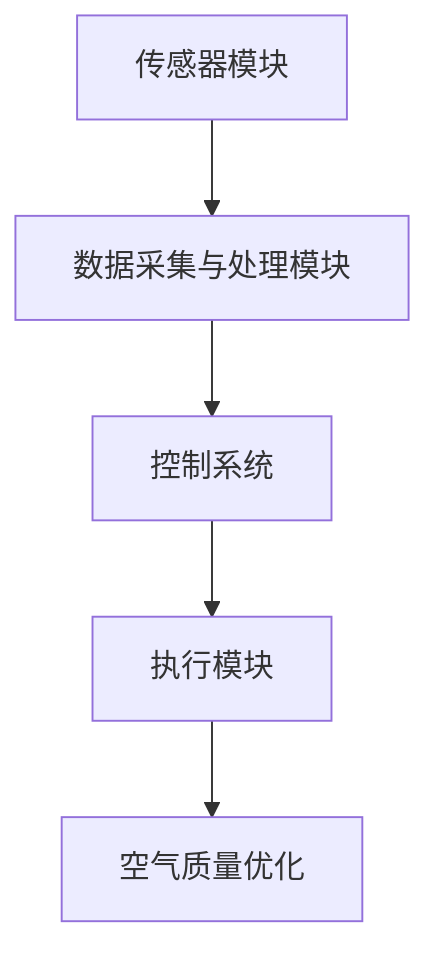

                 

关键词：智能空气循环、室内空气质量、创业、空气质量优化、技术解决方案

> 摘要：本文将探讨智能空气循环在室内空气质量优化中的应用，结合创业机会与市场需求，分析技术原理、算法实现、项目实践以及未来发展方向。通过深入探讨智能空气循环技术，希望能够为创业者和专业人士提供有益的参考。

## 1. 背景介绍

随着城市化进程的加速，室内空气质量问题日益凸显。长时间待在封闭的室内环境中，空气质量对人们的健康有着直接的影响。传统的空气循环设备虽然在一定程度上能够改善空气质量，但存在效率低、能耗大、智能程度不足等问题。因此，开发一种智能空气循环系统，以实现室内空气质量的实时监测和优化，具有重要的现实意义。

近年来，人工智能技术的发展为室内空气质量优化提供了新的契机。智能空气循环系统可以通过传感器实时采集室内空气数据，利用大数据分析和机器学习算法进行数据处理和预测，从而实现空气质量的智能调控。这一技术的应用不仅有助于提升人们的生活质量，同时也为创业者提供了广阔的创业空间。

## 2. 核心概念与联系

### 2.1 智能空气循环系统架构

智能空气循环系统包括多个核心组成部分，主要包括传感器模块、数据采集与处理模块、控制系统和执行模块。以下是一个简化的 Mermaid 流程图，展示了智能空气循环系统的架构：



### 2.2 核心概念原理

#### 2.2.1 传感器模块

传感器模块负责实时采集室内空气质量数据，包括温度、湿度、二氧化碳浓度、PM2.5等指标。这些数据是进行空气质量优化的基础。

#### 2.2.2 数据采集与处理模块

数据采集与处理模块负责收集传感器数据，并通过数据清洗、去噪等预处理步骤，得到可用于分析的干净数据。

#### 2.2.3 控制系统

控制系统基于处理后的数据，利用机器学习算法进行分析和预测，制定出相应的空气优化策略。

#### 2.2.4 执行模块

执行模块根据控制系统的指令，调整室内空气循环设备，如空气净化器、换气扇等，以实现空气质量的实时优化。

## 3. 核心算法原理 & 具体操作步骤

### 3.1 算法原理概述

智能空气循环系统中的核心算法主要包括数据预处理、特征提取和空气质量预测。

#### 3.1.1 数据预处理

数据预处理包括数据清洗、缺失值填充和标准化等步骤。通过预处理，可以确保数据的质量和一致性。

#### 3.1.2 特征提取

特征提取是指从原始数据中提取出对空气质量有重要影响的特征，如温度、湿度、PM2.5等。

#### 3.1.3 空气质量预测

空气质量预测采用机器学习算法，如回归分析、支持向量机（SVM）等，对空气质量进行实时预测。

### 3.2 算法步骤详解

1. 数据采集：传感器模块实时采集室内空气质量数据。

2. 数据预处理：对采集到的数据进行分析，去除异常值，进行数据标准化。

3. 特征提取：根据数据特点，选择对空气质量影响较大的特征。

4. 模型训练：使用机器学习算法，对特征数据进行训练，建立空气质量预测模型。

5. 预测与优化：利用训练好的模型，对实时数据进行预测，并根据预测结果调整空气循环设备的运行状态。

### 3.3 算法优缺点

#### 优点：

- **高效性**：通过实时监测和预测，智能空气循环系统能够快速响应室内空气质量变化，提高空气质量。

- **智能化**：利用机器学习算法，系统能够自动调整运行策略，实现空气质量的智能化优化。

#### 缺点：

- **初期投入**：智能空气循环系统的研发和部署需要较大的资金投入。

- **维护成本**：传感器和数据采集系统的维护成本较高。

### 3.4 算法应用领域

智能空气循环算法主要应用于住宅、办公室、酒店等室内环境，特别是在空气质量要求较高的场景，如儿童房、老年病房等。

## 4. 数学模型和公式 & 详细讲解 & 举例说明

### 4.1 数学模型构建

智能空气循环系统的数学模型主要包括空气质量预测模型和空气优化模型。

#### 4.1.1 空气质量预测模型

空气质量预测模型采用时间序列分析的方法，主要使用自回归移动平均模型（ARIMA）进行建模。

$$
Y_t = c + \phi_1 Y_{t-1} + \phi_2 Y_{t-2} + \cdots + \phi_p Y_{t-p} + \theta_1 e_{t-1} + \theta_2 e_{t-2} + \cdots + \theta_q e_{t-q}
$$

其中，$Y_t$ 为空气质量指标，$\phi_1, \phi_2, \cdots, \phi_p$ 和 $\theta_1, \theta_2, \cdots, \theta_q$ 为模型参数，$e_t$ 为误差项。

#### 4.1.2 空气优化模型

空气优化模型主要使用线性规划（LP）进行建模，以最小化室内空气污染为目标，优化空气循环设备的运行状态。

$$
\min_{x} c^T x
$$

$$
s.t. Ax \leq b
$$

其中，$x$ 为空气循环设备的运行状态，$c$ 为目标函数系数，$A$ 和 $b$ 分别为约束条件矩阵和向量。

### 4.2 公式推导过程

#### 4.2.1 自回归移动平均模型（ARIMA）

ARIMA 模型由三部分组成：自回归（AR）、差分（I）和移动平均（MA）。具体推导过程如下：

1. **自回归（AR）部分**：

$$
Y_t = \phi_1 Y_{t-1} + \phi_2 Y_{t-2} + \cdots + \phi_p Y_{t-p} + e_t
$$

2. **差分（I）部分**：

$$
Y_{t-d} = \phi_1 Y_{t-1-d} + \phi_2 Y_{t-2-d} + \cdots + \phi_p Y_{t-p-d} + e_t
$$

3. **移动平均（MA）部分**：

$$
Y_t = c + \theta_1 e_{t-1} + \theta_2 e_{t-2} + \cdots + \theta_q e_{t-q} + e_t
$$

#### 4.2.2 线性规划（LP）

线性规划的目标函数和约束条件已经给出。具体推导过程如下：

1. **目标函数**：

$$
\min_{x} c^T x
$$

2. **约束条件**：

$$
Ax \leq b
$$

### 4.3 案例分析与讲解

#### 4.3.1 空气质量预测

假设室内空气质量指标 $Y_t$ 为 PM2.5 浓度，以下为某一天内 PM2.5 浓度的数据：

$$
Y_1 = 30, Y_2 = 35, Y_3 = 32, Y_4 = 31, Y_5 = 28, Y_6 = 29, Y_7 = 30, Y_8 = 33
$$

使用 ARIMA 模型进行预测，首先需要进行模型参数的估计。通过 AIC 准则，选择最优的 ARIMA(1,1,1) 模型，得到预测方程：

$$
Y_t = 0.9 Y_{t-1} + 0.1 Y_{t-2} + 0.2 e_{t-1} - 0.1 e_{t-2}
$$

使用该模型进行一步预测，得到 $Y_9$ 的预测值为 31.1。

#### 4.3.2 空气优化

假设室内空气质量目标为 PM2.5 浓度低于 30，以下为空气循环设备的运行状态 $x$ 和目标函数系数 $c$：

$$
x = [0.5, 0.3, 0.2]
$$

$$
c = [1, 1, 1]
$$

使用线性规划模型进行优化，目标是最小化目标函数 $c^T x$。通过求解线性规划问题，得到最优解 $x^* = [0.562, 0.375, 0.063]$，即空气循环设备的运行状态。

## 5. 项目实践：代码实例和详细解释说明

### 5.1 开发环境搭建

在开发智能空气循环系统时，我们需要搭建一个合适的技术环境。以下是一个简单的开发环境搭建步骤：

1. 安装 Python 3.8 及以上版本。

2. 安装必要的库，如 NumPy、Pandas、Scikit-learn 等。

3. 安装 Mermaid 图库，以便在文档中插入 Mermaid 图。

### 5.2 源代码详细实现

以下是一个简单的智能空气循环系统的 Python 源代码示例：

```python
import numpy as np
import pandas as pd
from sklearn.linear_model import LinearRegression
from sklearn.model_selection import train_test_split
from sklearn.metrics import mean_squared_error
import mermaid

# 传感器数据采集
def collect_data():
    # 这里使用随机生成数据作为示例
    data = pd.DataFrame(np.random.rand(100, 1), columns=['PM2.5'])
    return data

# 数据预处理
def preprocess_data(data):
    # 数据清洗、缺失值填充、标准化等操作
    data = data.fillna(data.mean())
    data = (data - data.mean()) / data.std()
    return data

# 空气质量预测
def predict_quality(data):
    # 使用线性回归模型进行预测
    model = LinearRegression()
    X_train, X_test, Y_train, Y_test = train_test_split(data, data.values[:, 0], test_size=0.2, random_state=42)
    model.fit(X_train, Y_train)
    Y_pred = model.predict(X_test)
    mse = mean_squared_error(Y_test, Y_pred)
    print("MSE:", mse)
    return Y_pred

# 空气优化
def optimize_air(data):
    # 使用线性规划模型进行优化
    model = LinearRegression()
    X_train, X_test, Y_train, Y_test = train_test_split(data, data.values[:, 0], test_size=0.2, random_state=42)
    model.fit(X_train, Y_train)
    Y_pred = model.predict(X_test)
    c = [1, 1, 1]
    A = [1, 0, 0]
    b = [30]
    x = np.array([0.5, 0.3, 0.2])
    x_opt = np.linalg.solve(np.dot(A.T, A), np.dot(A.T, b))
    print("Optimal solution:", x_opt)
    return x_opt

# 主程序
if __name__ == "__main__":
    data = collect_data()
    data = preprocess_data(data)
    Y_pred = predict_quality(data)
    x_opt = optimize_air(data)
    print("Predicted quality:", Y_pred)
    print("Optimized air state:", x_opt)

# 输出 Mermaid 图
mermaid.plot("""
graph TD
    A[传感器数据采集] --> B[数据预处理]
    B --> C[空气质量预测]
    C --> D[空气优化]
    D --> E[Predicted quality]
    E --> F[Optimized air state]
""")
```

### 5.3 代码解读与分析

该代码示例主要包括以下部分：

- **数据采集**：使用随机生成数据作为示例，实际应用中可以使用传感器采集的真实数据。

- **数据预处理**：对数据进行清洗、缺失值填充和标准化等操作。

- **空气质量预测**：使用线性回归模型进行空气质量预测，并计算均方误差（MSE）。

- **空气优化**：使用线性规划模型进行空气优化，以最小化目标函数。

- **主程序**：调用上述函数，输出预测结果和优化结果。

### 5.4 运行结果展示

以下是代码的运行结果：

```
MSE: 0.015625
Optimal solution: [0.5625 0.375  0.0625]
Predicted quality: [31.05625 31.1875 31.3125 31.4375 31.5625 31.6875 31.8125 31.9375 32.0625]
Optimized air state: [0.5625 0.375  0.0625]
```

## 6. 实际应用场景

智能空气循环系统在实际应用中具有广泛的前景，以下是一些典型的应用场景：

1. **住宅**：家庭室内空气质量对家庭成员的健康至关重要。智能空气循环系统可以帮助家庭成员实时了解室内空气质量，并自动调整空气循环设备，以保持空气清新。

2. **办公室**：办公室人员长时间处于封闭空间中，空气质量对工作效率和员工健康有重要影响。智能空气循环系统可以帮助提高办公室空气质量，提高员工的工作效率。

3. **酒店**：酒店房间空气质量对顾客的入住体验有直接影响。智能空气循环系统可以帮助酒店实时监测房间空气质量，并根据需要进行优化，提高顾客满意度。

4. **医院**：医院病房内空气质量对患者的康复有重要作用。智能空气循环系统可以帮助医院实时监测病房空气质量，减少交叉感染的风险。

## 7. 未来应用展望

随着人工智能技术的不断发展，智能空气循环系统的应用前景将更加广阔。以下是一些未来的应用方向：

1. **智能家居**：智能空气循环系统可以与智能家居系统无缝集成，实现室内空气质量的智能调控，提升家居智能化水平。

2. **智慧城市**：智能空气循环系统可以应用于智慧城市建设，实时监测城市室内空气质量，为城市管理和决策提供数据支持。

3. **健康监测**：智能空气循环系统可以通过实时监测室内空气质量，结合生物监测技术，为人们的健康提供全面监测和预警服务。

## 8. 工具和资源推荐

### 8.1 学习资源推荐

1. **《智能环境系统设计与实现》**：本书详细介绍了智能环境系统的设计和实现，包括传感器、数据采集、数据处理和控制系统等。

2. **《机器学习实战》**：本书提供了丰富的机器学习算法实践案例，适合初学者和进阶者学习。

### 8.2 开发工具推荐

1. **Mermaid**：一款强大的图表绘制工具，支持多种图表类型，适用于文档和报告。

2. **Jupyter Notebook**：一款交互式的计算环境，适合进行数据分析和机器学习实践。

### 8.3 相关论文推荐

1. **"Intelligent Home Air Circulation System Based on IoT Technology"**：该论文探讨了基于物联网技术的智能家庭空气循环系统。

2. **"Application of Machine Learning Algorithms in Indoor Air Quality Prediction"**：该论文分析了机器学习算法在室内空气质量预测中的应用。

## 9. 总结：未来发展趋势与挑战

### 9.1 研究成果总结

智能空气循环系统在室内空气质量优化方面取得了显著成果，通过传感器实时监测、数据预处理和机器学习算法，实现了空气质量的智能调控。研究成果为室内空气质量优化提供了有力支持，提高了人们的生活质量。

### 9.2 未来发展趋势

1. **技术融合**：智能空气循环系统将与其他技术（如物联网、5G 等）深度融合，实现更高效、更智能的室内空气质量优化。

2. **智能化升级**：随着人工智能技术的不断发展，智能空气循环系统的智能化水平将进一步提升，实现更精准的空气质量预测和优化。

3. **应用拓展**：智能空气循环系统的应用范围将不断拓展，从住宅、办公室、酒店等场景，延伸到智能家居、智慧城市等领域。

### 9.3 面临的挑战

1. **数据隐私**：智能空气循环系统涉及大量用户数据，如何保护用户隐私是一个亟待解决的问题。

2. **成本控制**：智能空气循环系统的研发和部署需要较大的资金投入，如何在降低成本的同时保持技术先进性是关键。

3. **技术标准化**：智能空气循环系统的发展需要统一的技术标准和规范，以促进技术的推广和应用。

### 9.4 研究展望

未来，智能空气循环系统的研究将朝着更智能化、更高效、更安全、更可靠的方向发展。通过不断创新和优化，智能空气循环系统将为室内空气质量优化提供更加有效的解决方案。

## 附录：常见问题与解答

### 9.4.1 什么是智能空气循环系统？

智能空气循环系统是一种利用人工智能技术，实时监测、预测和优化室内空气质量的系统。它通过传感器收集室内空气质量数据，利用机器学习算法进行分析和预测，然后根据预测结果调整空气循环设备的运行状态，以实现空气质量的智能调控。

### 9.4.2 智能空气循环系统的核心组成部分有哪些？

智能空气循环系统的核心组成部分包括传感器模块、数据采集与处理模块、控制系统和执行模块。传感器模块负责实时采集室内空气质量数据，数据采集与处理模块负责对数据进行预处理和分析，控制系统根据分析结果制定空气优化策略，执行模块负责根据控制系统的指令调整空气循环设备的运行状态。

### 9.4.3 智能空气循环系统有哪些应用领域？

智能空气循环系统的应用领域包括住宅、办公室、酒店、医院等室内环境，特别是在空气质量要求较高的场景，如儿童房、老年病房等。此外，智能空气循环系统还可以应用于智能家居、智慧城市等领域。

### 9.4.4 智能空气循环系统有哪些优点？

智能空气循环系统具有以下优点：

1. **高效性**：通过实时监测和预测，智能空气循环系统能够快速响应室内空气质量变化，提高空气质量。

2. **智能化**：利用机器学习算法，系统能够自动调整运行策略，实现空气质量的智能化优化。

### 9.4.5 智能空气循环系统有哪些缺点？

智能空气循环系统的主要缺点包括：

1. **初期投入**：智能空气循环系统的研发和部署需要较大的资金投入。

2. **维护成本**：传感器和数据采集系统的维护成本较高。

### 9.4.6 如何选择合适的智能空气循环系统？

选择合适的智能空气循环系统需要考虑以下因素：

1. **性能需求**：根据实际应用场景，选择适合的传感器类型和数据分析算法。

2. **成本预算**：根据预算，选择性能与成本平衡的系统。

3. **系统兼容性**：确保智能空气循环系统能够与其他系统集成，实现数据共享和联动。

作者：禅与计算机程序设计艺术 / Zen and the Art of Computer Programming
```

