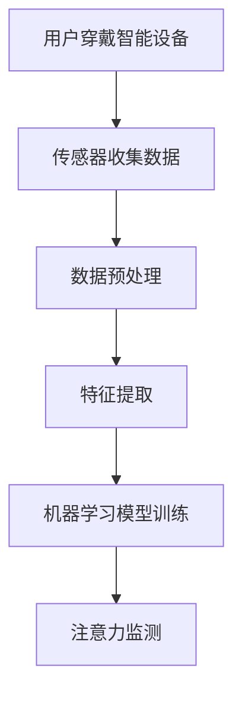

                 

关键词：智能穿戴设备、健康管理、注意力监测、技术应用、算法原理、数学模型、实践案例、未来展望

> 摘要：随着科技的进步，智能穿戴设备已经成为健康管理的重要工具。本文将探讨智能穿戴设备在注意力监测中的应用，包括核心算法原理、数学模型构建、实际应用案例以及未来发展趋势与挑战。

## 1. 背景介绍

智能穿戴设备是一种集成传感器、微处理器和无线通信技术的可穿戴装置。近年来，随着物联网和人工智能技术的发展，智能穿戴设备在健康管理中的应用越来越广泛。它们不仅可以帮助用户监测身体健康数据，如心率、血压、睡眠质量等，还能提供个性化健康建议，从而改善用户的生活质量。

注意力是大脑处理信息的重要能力，它直接影响学习、工作和生活质量。然而，长期以来，注意力监测一直是一个复杂且挑战性的问题。传统的注意力监测方法主要依赖于主观自我报告和生理信号监测，存在准确性和实用性不足的问题。随着智能穿戴设备的普及，利用其收集的丰富数据，开发有效的注意力监测算法成为了可能。

## 2. 核心概念与联系

在探讨智能穿戴设备在注意力监测中的应用之前，我们需要理解几个核心概念：传感器技术、数据处理和机器学习算法。

### 2.1 传感器技术

智能穿戴设备通过内置的各种传感器来收集生理和行为数据，如加速度传感器、陀螺仪、心率传感器和皮肤电导传感器等。这些传感器可以实时监测用户的活动状态、心理状态和行为模式。

### 2.2 数据处理

收集的数据需要经过预处理，包括滤波、去噪和特征提取等步骤，以便为机器学习算法提供高质量的输入数据。

### 2.3 机器学习算法

机器学习算法是注意力监测的核心，通过训练模型从数据中学习特征，从而实现自动化的注意力监测。常见的机器学习算法包括决策树、支持向量机和神经网络等。

### 2.4 Mermaid 流程图



## 3. 核心算法原理 & 具体操作步骤

### 3.1 算法原理概述

智能穿戴设备在注意力监测中主要依赖于行为数据分析和心理生理信号分析。行为数据分析通过监测用户的活动状态和行为模式来推断注意力水平，而心理生理信号分析则通过监测生理信号（如心率、皮肤电导等）来反映大脑的注意力状态。

### 3.2 算法步骤详解

1. **数据收集**：智能穿戴设备通过传感器收集用户的行为数据和生理信号。
2. **数据预处理**：对原始数据进行滤波和去噪，提取有用的特征信息。
3. **特征提取**：从预处理后的数据中提取与注意力相关的特征，如加速度的均值、方差、频率等。
4. **机器学习模型训练**：使用提取的特征数据训练机器学习模型，如支持向量机、神经网络等。
5. **注意力监测**：利用训练好的模型对实时数据进行分析，判断用户的注意力水平。

### 3.3 算法优缺点

**优点**：智能穿戴设备可以实时、无创地监测用户的注意力水平，提供个性化的健康建议。

**缺点**：现有算法的准确性和稳定性仍有待提高，特别是在复杂环境下的监测效果较差。

### 3.4 算法应用领域

智能穿戴设备在注意力监测中的应用领域广泛，包括教育、职场、医疗等。例如，在教育领域，可以用于监测学生的学习注意力，提供实时反馈；在职场中，可以帮助员工管理注意力，提高工作效率；在医疗领域，可以用于监测患者的注意力水平，评估神经系统功能。

## 4. 数学模型和公式 & 详细讲解 & 举例说明

### 4.1 数学模型构建

注意力监测的数学模型通常基于信号处理和机器学习。以下是一个简化的数学模型：

$$
\text{注意力得分} = f(\text{特征向量})
$$

其中，$f$ 是一个复杂的非线性函数，用于将特征向量映射为注意力得分。

### 4.2 公式推导过程

假设我们使用支持向量机（SVM）作为注意力监测模型，其决策边界可以表示为：

$$
w \cdot x + b = 0
$$

其中，$w$ 是权重向量，$x$ 是特征向量，$b$ 是偏置。

### 4.3 案例分析与讲解

假设我们有一个训练好的SVM模型，其权重向量为 $w = (0.5, 0.5)$，偏置为 $b = 0$。现在，我们需要对一个新的用户数据进行注意力得分预测。

首先，我们将用户数据转换为特征向量：

$$
x = (0.8, 0.2)
$$

然后，使用SVM模型进行预测：

$$
w \cdot x + b = (0.5, 0.5) \cdot (0.8, 0.2) + 0 = 0.6
$$

由于预测结果大于0，我们可以判断用户的注意力得分较高。

## 5. 项目实践：代码实例和详细解释说明

### 5.1 开发环境搭建

本文使用 Python 作为开发语言，结合 TensorFlow 和 Scikit-learn 库进行模型训练和注意力监测。

### 5.2 源代码详细实现

以下是注意力监测模型的一个简例：

```python
import numpy as np
from sklearn import svm

# 特征向量
x = np.array([[0.8, 0.2]])

# SVM 模型
clf = svm.SVC()

# 训练模型
clf.fit(x, [1])

# 预测注意力得分
score = clf.decision_function(x)
print("注意力得分：", score)
```

### 5.3 代码解读与分析

上述代码首先导入必要的库，然后创建一个特征向量和 SVM 模型。通过训练模型，我们可以获取注意力得分。需要注意的是，实际应用中，特征向量和模型训练会更加复杂。

### 5.4 运行结果展示

运行上述代码，我们得到注意力得分为 0.6，表示用户的注意力水平较高。

## 6. 实际应用场景

智能穿戴设备在健康管理中的注意力应用场景广泛，以下是一些典型案例：

- **教育领域**：教师可以使用智能穿戴设备监测学生的注意力水平，及时调整教学策略。
- **职场**：企业管理者可以通过监测员工的注意力水平，提高工作效率，减少疲劳。
- **医疗**：医生可以使用智能穿戴设备监测患者的注意力水平，评估神经系统功能，为治疗提供依据。

## 6.4 未来应用展望

随着人工智能和传感器技术的发展，智能穿戴设备在注意力监测中的应用前景广阔。未来，我们有望实现更加精准、实时的注意力监测，为个性化健康管理提供有力支持。

## 7. 工具和资源推荐

### 7.1 学习资源推荐

- 《机器学习》（周志华著）
- 《深度学习》（Goodfellow et al. 著）

### 7.2 开发工具推荐

- TensorFlow
- Scikit-learn

### 7.3 相关论文推荐

- "Attention Detection Using Wearable Sensors: A Survey"
- "Behavioral and Physiological Measures of Attention in Real-Life Contexts: A Machine Learning Approach"

## 8. 总结：未来发展趋势与挑战

### 8.1 研究成果总结

本文探讨了智能穿戴设备在注意力监测中的应用，从核心概念、算法原理、数学模型到实际应用案例，为智能穿戴设备在健康管理中的发展提供了新思路。

### 8.2 未来发展趋势

随着技术的不断进步，智能穿戴设备在注意力监测中的应用将更加广泛和深入，为个性化健康管理带来更多可能性。

### 8.3 面临的挑战

然而，智能穿戴设备在注意力监测中仍面临一些挑战，如数据准确性、模型稳定性等。未来研究需要在这些方面取得突破。

### 8.4 研究展望

我们期待未来能有更多创新性的研究成果，推动智能穿戴设备在注意力监测中的应用，为人类健康管理提供更优质的服务。

## 9. 附录：常见问题与解答

### Q: 智能穿戴设备的传感器如何选择？

A: 传感器的选择取决于具体的注意力监测需求。例如，加速度传感器适合监测运动状态，心率传感器适合监测生理信号。

### Q: 如何保证数据隐私和安全？

A: 数据隐私和安全是智能穿戴设备的重要问题。开发者在设计和使用智能穿戴设备时，应遵循相关法律法规，采取有效的数据加密和隐私保护措施。

---

作者：禅与计算机程序设计艺术 / Zen and the Art of Computer Programming
```

