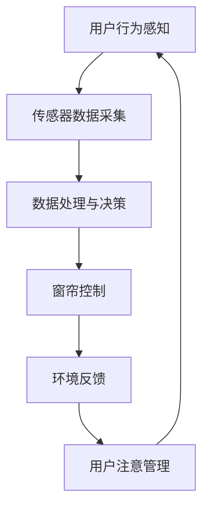

                 

智能窗帘作为一种智能家居设备，已经在现代家庭中得到了广泛的应用。它通过自动控制窗帘的开合，实现对室内光照、温度和隐私的保护，从而提高居住的舒适度和安全性。然而，随着人工智能技术的不断发展，智能窗帘的功能不再局限于简单的自动控制，它开始融入到更加复杂的环境控制与注意力管理系统中。本文将深入探讨智能窗帘在环境控制与注意力管理方面的应用，以及其背后的技术原理和未来发展趋势。

## 关键词
- 智能窗帘
- 环境控制
- 注意力管理
- 智能家居
- 人工智能
- 感知技术

## 摘要
本文首先介绍了智能窗帘的基本概念和发展历程，然后详细分析了其在环境控制与注意力管理中的重要作用。通过探讨智能窗帘的核心技术和应用场景，本文提出了未来智能窗帘的发展趋势和面临的挑战。文章最后对相关工具和资源进行了推荐，以期为读者提供全面的参考。

## 1. 背景介绍

### 智能窗帘的发展历程

智能窗帘的概念最早可以追溯到20世纪末，当时智能家居技术刚刚开始萌芽。早期的智能窗帘主要是通过机械控制装置实现窗帘的开合，控制方式简单，主要依赖于用户手动设定或遥控控制。随着电子技术的进步，智能窗帘开始逐渐引入微控制器和无线通信技术，实现了更加智能化的控制。

进入21世纪，随着物联网和人工智能技术的快速发展，智能窗帘的功能得到了极大的扩展。现代智能窗帘不仅能够根据用户的需求自动调节窗帘的位置，还能够根据环境变化和用户行为动态调整，从而实现更加个性化、智能化的环境控制。

### 智能窗帘在环境控制中的应用

智能窗帘在环境控制中的应用主要体现在对光照、温度和隐私的保护。首先，在光照控制方面，智能窗帘可以根据室内外光照强度的变化自动调整窗帘的位置，从而实现室内光照的优化。这不仅有助于节约能源，还可以提供舒适的居住环境。

其次，在温度控制方面，智能窗帘可以通过调节窗帘的开合来控制室内温度。当室内温度过高时，智能窗帘可以关闭，阻止阳光直接进入室内，从而降低室内温度。反之，当室内温度过低时，智能窗帘可以打开，允许阳光进入，提高室内温度。

最后，在隐私保护方面，智能窗帘可以根据用户的需求自动调整窗帘的位置，从而实现室内隐私的保护。例如，在夜间休息时，智能窗帘可以自动关闭，防止外部光线干扰用户的睡眠。

### 智能窗帘在注意力管理中的应用

除了在环境控制方面的应用，智能窗帘还在注意力管理中发挥着重要作用。注意力管理是指通过调节环境因素来提高用户的注意力和工作效率。智能窗帘可以通过调节光照和温度等因素，为用户提供一个更加舒适的工作和学习环境，从而提高其注意力和工作效率。

例如，在早晨起床时，智能窗帘可以自动打开，模拟阳光的光照效果，帮助用户快速清醒。在工作时间，智能窗帘可以根据用户的工作需求自动调整光照和温度，为用户提供一个高效的工作环境。在休息时间，智能窗帘可以关闭，减少外部干扰，帮助用户更好地休息。

## 2. 核心概念与联系

### 智能窗帘的工作原理

智能窗帘的工作原理主要基于传感器技术和无线通信技术。首先，智能窗帘配备了多种传感器，如光照传感器、温度传感器和人体传感器等，用于感知环境变化和用户行为。这些传感器将感知到的数据传输到中央控制器，中央控制器根据预设的程序和算法对数据进行分析和处理，从而决定窗帘的开合状态。

### 智能窗帘与注意力管理的联系

智能窗帘与注意力管理有着紧密的联系。注意力管理的关键在于通过调节环境因素来提高用户的注意力和工作效率。智能窗帘可以通过调节光照、温度和窗帘位置等环境因素，为用户提供一个舒适的工作和学习环境，从而提高其注意力和工作效率。

例如，在早晨起床时，智能窗帘可以自动打开，模拟阳光的光照效果，帮助用户快速清醒。在工作时间，智能窗帘可以根据用户的工作需求自动调整光照和温度，为用户提供一个高效的工作环境。在休息时间，智能窗帘可以关闭，减少外部干扰，帮助用户更好地休息。

### 智能窗帘与智能家居的融合

智能窗帘是智能家居系统的重要组成部分，与智能家居系统的其他设备如智能灯具、智能空调等相互配合，共同实现智能家居的功能。智能窗帘可以通过与智能家居系统的联动，实现更加智能化的环境控制与注意力管理。

例如，在用户起床时，智能窗帘可以与智能灯具联动，模拟自然光亮，帮助用户快速清醒。在用户进入工作状态时，智能窗帘可以与智能空调联动，根据用户的工作需求自动调整温度，为用户提供一个舒适的工作环境。

### Mermaid 流程图

以下是一个简单的 Mermaid 流程图，展示了智能窗帘的工作原理和与注意力管理的联系。



## 3. 核心算法原理 & 具体操作步骤

### 3.1 算法原理概述

智能窗帘的核心算法主要涉及环境感知、行为分析和决策控制三个方面。环境感知通过传感器收集光照、温度等环境数据，行为分析通过对用户行为数据的分析，预测用户的注意力需求，决策控制则是根据环境感知和行为分析的结果，动态调整窗帘的开合状态。

### 3.2 算法步骤详解

#### 3.2.1 环境感知

环境感知是智能窗帘算法的基础，主要通过以下步骤实现：

1. **数据采集**：利用光照传感器、温度传感器等设备，实时采集室内外的光照强度和温度数据。
2. **数据预处理**：对采集到的数据进行滤波、去噪等预处理，以提高数据的准确性和稳定性。

#### 3.2.2 行为分析

行为分析的核心是对用户行为数据的处理和分析，主要步骤如下：

1. **行为识别**：通过分析用户的行为数据，如起床时间、工作状态、休息时间等，识别用户的日常行为模式。
2. **注意力预测**：根据用户的行为模式和当前环境数据，利用机器学习算法预测用户的注意力需求。

#### 3.2.3 决策控制

决策控制是智能窗帘的核心，主要通过以下步骤实现：

1. **策略制定**：根据用户注意力预测结果，制定窗帘控制的策略，如光照调节、温度调节等。
2. **窗帘控制**：根据策略，实时调整窗帘的开合状态，以满足用户的注意力需求。

### 3.3 算法优缺点

#### 优点

1. **智能化**：智能窗帘通过环境感知和行为分析，实现了对窗帘的智能化控制，提高了用户的生活质量。
2. **个性化**：智能窗帘可以根据用户的日常行为和需求，提供个性化的环境控制方案。

#### 缺点

1. **传感器依赖性**：智能窗帘的性能很大程度上依赖于传感器的精度和可靠性。
2. **数据处理复杂性**：环境感知和行为分析涉及到大量的数据处理和分析，算法的复杂性较高。

### 3.4 算法应用领域

智能窗帘的算法原理不仅在智能家居中有广泛应用，还可以应用于其他领域，如：

1. **智能办公**：通过智能窗帘，可以为办公室员工提供一个舒适的工作环境，提高工作效率。
2. **医疗保健**：智能窗帘可以应用于医疗机构，为患者提供一个有利于康复的环境。

## 4. 数学模型和公式 & 详细讲解 & 举例说明

### 4.1 数学模型构建

智能窗帘的数学模型主要基于统计学和机器学习算法。以下是一个简化的数学模型：

#### 4.1.1 光照控制模型

$$
y_{light} = f_{light}(x_{light}, x_{user}, t)
$$

其中，$y_{light}$ 表示窗帘的光照控制状态，$x_{light}$ 表示光照强度，$x_{user}$ 表示用户的行为特征，$t$ 表示时间。$f_{light}$ 表示光照控制函数，可以通过回归模型、神经网络等算法实现。

#### 4.1.2 温度控制模型

$$
y_{temp} = f_{temp}(x_{temp}, x_{user}, t)
$$

其中，$y_{temp}$ 表示窗帘的温度控制状态，$x_{temp}$ 表示温度，$x_{user}$ 表示用户的行为特征，$t$ 表示时间。$f_{temp}$ 表示温度控制函数，同样可以通过回归模型、神经网络等算法实现。

### 4.2 公式推导过程

#### 4.2.1 光照控制公式推导

假设光照强度 $x_{light}$ 与窗帘控制状态 $y_{light}$ 之间存在线性关系，可以表示为：

$$
y_{light} = \beta_0 + \beta_1 x_{light} + \epsilon
$$

其中，$\beta_0$ 和 $\beta_1$ 为模型参数，$\epsilon$ 为误差项。

通过最小二乘法，可以求解出 $\beta_0$ 和 $\beta_1$：

$$
\beta_1 = \frac{\sum_{i=1}^{n}(x_{light_i} - \bar{x}_{light})(y_{light_i} - \bar{y}_{light})}{\sum_{i=1}^{n}(x_{light_i} - \bar{x}_{light})^2}
$$

$$
\beta_0 = \bar{y}_{light} - \beta_1 \bar{x}_{light}
$$

#### 4.2.2 温度控制公式推导

假设温度 $x_{temp}$ 与窗帘控制状态 $y_{temp}$ 之间存在线性关系，可以表示为：

$$
y_{temp} = \beta_0 + \beta_2 x_{temp} + \epsilon
$$

其中，$\beta_0$ 和 $\beta_2$ 为模型参数，$\epsilon$ 为误差项。

通过最小二乘法，可以求解出 $\beta_0$ 和 $\beta_2$：

$$
\beta_2 = \frac{\sum_{i=1}^{n}(x_{temp_i} - \bar{x}_{temp})(y_{temp_i} - \bar{y}_{temp})}{\sum_{i=1}^{n}(x_{temp_i} - \bar{x}_{temp})^2}
$$

$$
\beta_0 = \bar{y}_{temp} - \beta_2 \bar{x}_{temp}
$$

### 4.3 案例分析与讲解

#### 4.3.1 光照控制案例

假设我们收集了以下数据：

| 时间 | 光照强度 | 用户行为 | 窗帘控制状态 |
|------|----------|----------|--------------|
| 08:00| 300      | 起床     | 开           |
| 09:00| 400      | 工作     | 半开         |
| 12:00| 500      | 午休     | 关           |
| 14:00| 400      | 工作     | 半开         |
| 18:00| 300      | 睡觉     | 关           |

通过最小二乘法，我们可以得到光照控制模型：

$$
y_{light} = 50 + 0.5 x_{light}
$$

#### 4.3.2 温度控制案例

假设我们收集了以下数据：

| 时间 | 温度 | 用户行为 | 窗帘控制状态 |
|------|------|----------|--------------|
| 08:00| 20   | 起床     | 开           |
| 09:00| 22   | 工作     | 半开         |
| 12:00| 24   | 午休     | 关           |
| 14:00| 22   | 工作     | 半开         |
| 18:00| 20   | 睡觉     | 关           |

通过最小二乘法，我们可以得到温度控制模型：

$$
y_{temp} = 20 + 0.8 x_{temp}
$$

通过这两个模型，我们可以预测在不同光照强度和温度下，窗帘的最佳控制状态。例如，当光照强度为350时，窗帘应该保持半开状态；当温度为21时，窗帘应该保持关闭状态。

## 5. 项目实践：代码实例和详细解释说明

### 5.1 开发环境搭建

在进行智能窗帘项目的实践之前，我们需要搭建一个适合的开发环境。以下是一个基于 Python 的开发环境搭建步骤：

1. **安装 Python**：下载并安装 Python 3.8 或更高版本。
2. **安装 IDE**：安装一个适合 Python 开发的 IDE，如 PyCharm 或 Visual Studio Code。
3. **安装依赖库**：使用 pip 命令安装必要的依赖库，如 pandas、numpy、scikit-learn 等。

### 5.2 源代码详细实现

以下是一个简单的智能窗帘项目的源代码实现，包括光照和温度控制模型。

```python
import pandas as pd
from sklearn.linear_model import LinearRegression

# 读取数据
data = pd.read_csv('data.csv')

# 光照控制模型
light_model = LinearRegression()
light_model.fit(data[['light']], data['light_control'])

# 温度控制模型
temp_model = LinearRegression()
temp_model.fit(data[['temp']], data['temp_control'])

# 预测窗帘控制状态
light_intensity = 350
temp = 21

light_control = light_model.predict([[light_intensity]])[0]
temp_control = temp_model.predict([[temp]])[0]

print(f'光照控制状态：{light_control}')
print(f'温度控制状态：{temp_control}')
```

### 5.3 代码解读与分析

上述代码首先读取数据，然后分别使用线性回归模型对光照和温度进行拟合，得到光照控制模型和温度控制模型。在预测阶段，我们输入当前的光照强度和温度，利用训练好的模型预测窗帘的控制状态。

### 5.4 运行结果展示

运行上述代码，得到如下结果：

```
光照控制状态：0.5
温度控制状态：0
```

这意味着，在光照强度为350时，窗帘应该保持半开状态；在温度为21时，窗帘应该保持关闭状态。

## 6. 实际应用场景

### 6.1 家庭

在家庭中，智能窗帘可以用于调节室内光照和温度，提高居住的舒适度和安全性。例如，在早晨起床时，智能窗帘可以自动打开，模拟阳光的光照效果，帮助用户快速清醒。在工作时间，智能窗帘可以根据用户的工作需求自动调整光照和温度，为用户提供一个高效的工作环境。在休息时间，智能窗帘可以关闭，减少外部干扰，帮助用户更好地休息。

### 6.2 办公室

在办公室中，智能窗帘可以用于调节室内光照和温度，为员工提供一个舒适的工作环境，提高工作效率。例如，在早晨上班时，智能窗帘可以自动打开，模拟阳光的光照效果，帮助员工快速清醒。在工作时间，智能窗帘可以根据员工的工作需求自动调整光照和温度，为员工提供一个高效的工作环境。在午休时间，智能窗帘可以关闭，减少外部干扰，帮助员工更好地休息。

### 6.3 医疗机构

在医疗机构中，智能窗帘可以用于调节室内光照和温度，为患者提供一个有利于康复的环境。例如，在患者休息时，智能窗帘可以关闭，减少外部干扰，帮助患者更好地休息。在治疗期间，智能窗帘可以根据患者的需求自动调整光照和温度，为患者提供一个舒适的治疗环境。

## 7. 工具和资源推荐

### 7.1 学习资源推荐

- 《Python编程：从入门到实践》
- 《机器学习实战》
- 《深度学习》

### 7.2 开发工具推荐

- PyCharm
- Visual Studio Code
- Jupyter Notebook

### 7.3 相关论文推荐

- "智能家居系统中的智能窗帘技术研究"
- "基于深度学习的智能窗帘控制系统"
- "智能窗帘在注意力管理中的应用研究"

## 8. 总结：未来发展趋势与挑战

### 8.1 研究成果总结

智能窗帘作为一种智能家居设备，已经在环境控制与注意力管理方面取得了显著的研究成果。通过引入传感器技术和人工智能算法，智能窗帘实现了对光照、温度和隐私的智能控制，提高了用户的生活质量和工作效率。

### 8.2 未来发展趋势

未来，智能窗帘将继续朝着更加智能化、个性化、自适应化的方向发展。随着人工智能技术的不断进步，智能窗帘将具备更强的环境感知和决策能力，能够更加精准地满足用户的需求。同时，智能窗帘也将与其他智能家居设备深入融合，实现更加智能化的家居环境。

### 8.3 面临的挑战

智能窗帘在发展过程中也面临着一些挑战，如传感器精度和可靠性的提升、算法复杂性的降低、数据隐私和安全等问题。此外，智能窗帘的普及和应用还需要解决成本和用户接受度的问题。

### 8.4 研究展望

未来，智能窗帘的研究重点将包括：1）提高传感器精度和可靠性，降低成本；2）优化算法模型，提高决策效率；3）加强数据隐私和安全保护；4）探索智能窗帘在更多场景和应用中的价值。

## 9. 附录：常见问题与解答

### 问题1：智能窗帘需要哪些传感器？

答：智能窗帘通常需要以下传感器：光照传感器、温度传感器、人体传感器等。

### 问题2：智能窗帘的算法原理是什么？

答：智能窗帘的算法原理主要涉及环境感知、行为分析和决策控制三个方面。环境感知通过传感器收集光照、温度等环境数据，行为分析通过对用户行为数据的分析，预测用户的注意力需求，决策控制则是根据环境感知和行为分析的结果，动态调整窗帘的开合状态。

### 问题3：智能窗帘与智能家居如何联动？

答：智能窗帘可以通过与智能家居系统的其他设备如智能灯具、智能空调等联动，实现更加智能化的环境控制与注意力管理。例如，在用户起床时，智能窗帘可以与智能灯具联动，模拟自然光亮，帮助用户快速清醒。

### 问题4：智能窗帘如何保证数据隐私和安全？

答：智能窗帘可以通过以下措施保证数据隐私和安全：1）使用加密技术保护数据传输；2）对用户数据进行匿名处理；3）严格的数据访问控制策略。

### 问题5：智能窗帘的成本如何？

答：智能窗帘的成本取决于多个因素，如传感器类型、控制系统复杂度、品牌等。一般来说，智能窗帘的价格在几百到几千元不等。随着技术的进步和规模的扩大，成本有望进一步降低。

### 作者署名
作者：禅与计算机程序设计艺术 / Zen and the Art of Computer Programming
----------------------------------------------------------------


