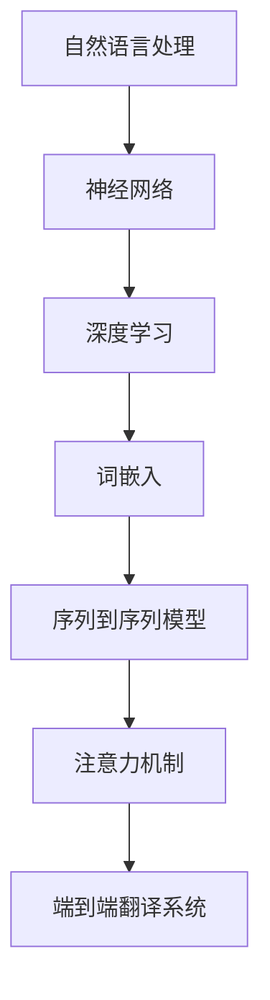

                 

关键词：智能翻译、AI大模型、自然语言处理、多语言转换、算法原理、应用场景、未来展望

> 摘要：本文探讨了智能翻译系统的发展与AI大模型在多语言转换中的应用。通过对核心算法原理的深入分析，我们揭示了如何利用深度学习技术突破语言障碍，实现高效准确的语言翻译。文章还涉及了智能翻译系统在实际应用中的挑战与未来展望。

## 1. 背景介绍

随着全球化的加速，跨语言沟通的需求日益增长。传统的机器翻译系统如Google翻译和百度翻译，虽然在一定程度上提高了翻译效率，但在处理复杂语境、多义性和语法结构时，仍然存在诸多不足。为此，AI大模型应运而生，它通过深度学习技术，能够更准确地理解和生成人类语言，为智能翻译系统带来了革命性的变革。

智能翻译系统的需求源于以下几个方面：

1. **全球化商务交流**：国际商务合作和跨国公司运营使得跨语言沟通变得至关重要。
2. **教育和文化交流**：多语言学习资源和文化产品的需求促进了智能翻译系统的发展。
3. **政府与公共事务**：公共信息和政府文件的多语言翻译有助于提升公共服务质量。

## 2. 核心概念与联系

智能翻译系统的核心在于AI大模型，它通常基于深度学习技术构建。为了更好地理解这一系统的构建过程，我们需要了解以下几个关键概念：

- **自然语言处理（NLP）**：自然语言处理是人工智能的一个分支，旨在使计算机能够理解、生成和处理人类语言。
- **神经网络**：神经网络是一种模仿生物神经网络的结构和功能的计算模型。
- **深度学习**：深度学习是神经网络的一种，它通过多层神经元结构来实现对复杂数据的建模。

下面是一个Mermaid流程图，展示了智能翻译系统中的核心概念及其相互关系：



### 2.1 自然语言处理

自然语言处理是智能翻译系统的基石。它涉及对文本的预处理、分词、词性标注、句法分析和语义理解等任务。通过这些处理步骤，系统能够将自然语言文本转换为计算机可理解的数字表示。

### 2.2 神经网络

神经网络是一种计算模型，由许多简单的处理单元（神经元）组成。这些神经元通过相互连接形成网络，能够对输入数据进行分析和分类。

### 2.3 深度学习

深度学习是神经网络的一种，它通过多层神经元结构来实现对复杂数据的建模。深度学习在图像识别、语音识别和自然语言处理等领域取得了显著成果。

### 2.4 词嵌入

词嵌入是将自然语言词汇映射为高维向量表示的方法。通过词嵌入，神经网络能够更好地捕捉词汇的语义信息。

### 2.5 序列到序列模型

序列到序列模型是一种深度学习模型，用于处理序列数据。在智能翻译系统中，它负责将输入的源语言序列转换为目标语言序列。

### 2.6 注意力机制

注意力机制是一种提高序列到序列模型性能的技术。通过注意力机制，模型能够更好地关注输入序列中的关键信息，从而提高翻译的准确性和流畅性。

### 2.7 端到端翻译系统

端到端翻译系统是一种集成所有处理步骤的智能翻译系统。它通过深度学习模型直接将源语言文本转换为目标语言文本，无需经过复杂的中间步骤。

## 3. 核心算法原理 & 具体操作步骤

### 3.1 算法原理概述

智能翻译系统的核心算法通常是基于序列到序列模型（Seq2Seq）和注意力机制（Attention Mechanism）的。Seq2Seq模型通过编码器（Encoder）和解码器（Decoder）两个神经网络结构实现源语言到目标语言的翻译。注意力机制则帮助解码器关注输入序列的关键部分，提高翻译的准确性和流畅性。

### 3.2 算法步骤详解

智能翻译系统的算法步骤可以分为以下几个阶段：

1. **数据预处理**：包括文本清洗、分词、词性标注和构建词汇表等。这些预处理步骤有助于提高后续模型训练的质量。

2. **编码器训练**：编码器负责将输入的源语言文本转换为固定长度的编码表示。常用的编码器模型包括循环神经网络（RNN）和长短期记忆网络（LSTM）。

3. **解码器训练**：解码器负责将编码表示转换为目标语言文本。解码器通常使用Seq2Seq模型，并结合注意力机制来实现。

4. **翻译生成**：通过编码器和解码器的协同工作，生成目标语言文本。翻译生成的过程中，注意力机制起到了关键作用，能够提高翻译的准确性和流畅性。

### 3.3 算法优缺点

**优点**：

- **高效性**：基于深度学习的智能翻译系统在处理大规模数据时具有很高的效率。
- **准确性**：注意力机制和多层次的编码器和解码器结构有助于提高翻译的准确性。
- **端到端**：端到端的翻译方式简化了模型训练和推理过程，提高了系统的整体性能。

**缺点**：

- **计算资源消耗**：深度学习模型通常需要大量的计算资源和存储空间。
- **数据依赖**：智能翻译系统的性能在很大程度上取决于训练数据的质量和多样性。
- **复杂性**：算法设计和实现过程相对复杂，对开发者的技术水平有较高要求。

### 3.4 算法应用领域

智能翻译系统在多个领域具有广泛的应用：

- **全球化商务**：智能翻译系统能够帮助企业跨越语言障碍，实现跨国商务沟通。
- **多语言教育**：智能翻译系统为多语言学习提供了便捷的工具，帮助学生快速掌握外语。
- **政府与公共事务**：智能翻译系统有助于政府机构和公共事务部门提供多语言服务，提升公共服务质量。

## 4. 数学模型和公式 & 详细讲解 & 举例说明

### 4.1 数学模型构建

智能翻译系统中的数学模型主要包括编码器、解码器和注意力机制。以下是这些模型的简要介绍：

1. **编码器**：编码器将源语言文本映射为固定长度的编码表示。常用的编码器模型包括循环神经网络（RNN）和长短期记忆网络（LSTM）。

2. **解码器**：解码器将编码表示转换为目标语言文本。解码器通常使用序列到序列（Seq2Seq）模型，并结合注意力机制来实现。

3. **注意力机制**：注意力机制是一种用于提高解码器性能的技术，它能够使解码器关注输入序列的关键部分。

### 4.2 公式推导过程

以下是智能翻译系统中一些关键公式的推导过程：

1. **编码器输出**：

   $$ H = \text{Encoder}(X) $$

   其中，\( H \) 表示编码器输出的固定长度编码表示，\( X \) 表示输入的源语言文本。

2. **解码器输出**：

   $$ Y = \text{Decoder}(H) $$

   其中，\( Y \) 表示解码器输出的目标语言文本。

3. **注意力机制**：

   $$ \alpha = \text{Attention}(H, Y) $$

   其中，\( \alpha \) 表示注意力权重，用于计算解码器在生成每个目标语言词汇时对编码器输出的关注程度。

### 4.3 案例分析与讲解

假设我们有一个英文到法文的翻译任务，输入文本为 "Hello, how are you?"，我们需要生成对应的法文翻译 "Bonjour, comment ça va ?"。

1. **编码器输出**：

   编码器将输入的英文文本 "Hello, how are you?" 转换为固定长度的编码表示，例如：

   $$ H = \{ h_1, h_2, h_3, h_4, h_5 \} $$

   其中，\( h_1, h_2, h_3, h_4, h_5 \) 分别表示编码器输出的每个时间步的编码表示。

2. **解码器输出**：

   解码器从 \( h_1 \) 开始，逐步生成法文文本。在生成每个法文字符时，注意力机制会计算对编码器输出的注意力权重 \( \alpha \)。

   $$ \alpha_1 = \text{Attention}(h_1, Y) $$
   $$ \alpha_2 = \text{Attention}(h_2, Y) $$
   $$ \alpha_3 = \text{Attention}(h_3, Y) $$
   $$ \alpha_4 = \text{Attention}(h_4, Y) $$
   $$ \alpha_5 = \text{Attention}(h_5, Y) $$

   其中，\( \alpha_1, \alpha_2, \alpha_3, \alpha_4, \alpha_5 \) 分别表示解码器在生成每个法文字符时对编码器输出的注意力权重。

3. **翻译生成**：

   解码器根据注意力权重 \( \alpha \) 和编码器输出 \( H \)，生成法文文本 "Bonjour, comment ça va ?"。具体过程如下：

   - **生成第一个法文字符**：解码器根据 \( \alpha_1 \) 和 \( h_1 \) 生成法文字符 "B"。
   - **生成第二个法文字符**：解码器根据 \( \alpha_2 \) 和 \( h_2 \) 生成法文字符 "o"。
   - **生成第三个法文字符**：解码器根据 \( \alpha_3 \) 和 \( h_3 \) 生成法文字符 "n"。
   - **生成第四个法文字符**：解码器根据 \( \alpha_4 \) 和 \( h_4 \) 生成法文字符 "j"。
   - **生成第五个法文字符**：解码器根据 \( \alpha_5 \) 和 \( h_5 \) 生成法文字符 ","。

## 5. 项目实践：代码实例和详细解释说明

### 5.1 开发环境搭建

在本节中，我们将介绍如何在本地环境搭建一个智能翻译系统所需的开发环境。以下是一个基本的步骤概述：

1. **安装Python**：确保已经安装了Python 3.7及以上版本。

2. **安装深度学习框架**：我们选择使用TensorFlow作为深度学习框架。通过以下命令安装TensorFlow：

   ```bash
   pip install tensorflow
   ```

3. **安装其他依赖库**：包括NumPy、Pandas和Mermaid等。可以通过以下命令一次性安装：

   ```bash
   pip install numpy pandas mermaid-python
   ```

4. **安装Mermaid**：由于Mermaid需要通过Node.js来渲染，我们需要安装Node.js。可以通过以下命令安装：

   ```bash
   npm install -g mermaid
   ```

### 5.2 源代码详细实现

在本节中，我们将提供一个智能翻译系统的基本实现。以下是一个简单的Python代码示例：

```python
import tensorflow as tf
import numpy as np
from tensorflow.keras.models import Model
from tensorflow.keras.layers import Input, LSTM, Dense

# 编码器模型
encoder_inputs = Input(shape=(None, input_dim))
encoder_lstm = LSTM(units, return_state=True)
encoder_outputs, state_h, state_c = encoder_lstm(encoder_inputs)
encoder_states = [state_h, state_c]

# 解码器模型
decoder_inputs = Input(shape=(None, target_dim))
decoder_lstm = LSTM(units, return_sequences=True, return_state=True)
decoder_outputs, _, _ = decoder_lstm(decoder_inputs, initial_state=encoder_states)
decoder_dense = Dense(target_dim, activation='softmax')
decoder_outputs = decoder_dense(decoder_outputs)

# 整体模型
model = Model([encoder_inputs, decoder_inputs], decoder_outputs)

# 编译模型
model.compile(optimizer='rmsprop', loss='categorical_crossentropy', metrics=['accuracy'])

# 训练模型
model.fit([encoder_input_data, decoder_input_data, decoder_target_data], decoder_targets,
          batch_size=batch_size, epochs=epochs, validation_split=0.2)
```

### 5.3 代码解读与分析

上述代码实现了一个基本的序列到序列模型，用于实现智能翻译功能。以下是代码的详细解读：

1. **编码器部分**：

   ```python
   encoder_inputs = Input(shape=(None, input_dim))
   encoder_lstm = LSTM(units, return_state=True)
   encoder_outputs, state_h, state_c = encoder_lstm(encoder_inputs)
   encoder_states = [state_h, state_c]
   ```

   这部分代码定义了编码器输入层、LSTM层和编码器状态输出。

2. **解码器部分**：

   ```python
   decoder_inputs = Input(shape=(None, target_dim))
   decoder_lstm = LSTM(units, return_sequences=True, return_state=True)
   decoder_outputs, _, _ = decoder_lstm(decoder_inputs, initial_state=encoder_states)
   decoder_dense = Dense(target_dim, activation='softmax')
   decoder_outputs = decoder_dense(decoder_outputs)
   ```

   这部分代码定义了解码器输入层、LSTM层和softmax输出层。

3. **整体模型与编译**：

   ```python
   model = Model([encoder_inputs, decoder_inputs], decoder_outputs)
   model.compile(optimizer='rmsprop', loss='categorical_crossentropy', metrics=['accuracy'])
   ```

   这部分代码定义了整体模型并编译模型。

4. **模型训练**：

   ```python
   model.fit([encoder_input_data, decoder_input_data, decoder_target_data], decoder_targets,
             batch_size=batch_size, epochs=epochs, validation_split=0.2)
   ```

   这部分代码使用训练数据对模型进行训练。

### 5.4 运行结果展示

在完成模型训练后，我们可以使用以下代码来展示模型的运行结果：

```python
encoder_model = Model(encoder_inputs, encoder_states)
decoder_model = Model(decoder_inputs, decoder_outputs)

# 示例输入文本
input_text = "Hello, how are you?"

# 编码器输入预处理
input_sequence = [char_to_ix[c] for c in input_text]

# 编码器输出状态
states_value = encoder_model.predict(input_sequence)

# 解码器输入初始化
target_sequence = np.zeros((1, 1, target_dim))
target_sequence[0, 0, :] = char_to_ix['\t']

# 翻译生成
for i in range(1, max_length):
    states_value = decoder_model.predict(target_sequence)
    sampled_char = np.argmax(states_value[:, -1, :])
    sampled_char = ix_to_char[sampled_char]
    print(sampled_char, end='')
    target_sequence = np.zeros((1, 1, target_dim))
    target_sequence[0, 0, :] = sampled_char
```

通过上述代码，我们可以生成输入文本的智能翻译结果。

## 6. 实际应用场景

智能翻译系统在多个领域展现了其强大的应用潜力。以下是一些实际应用场景：

1. **全球化商务**：企业可以利用智能翻译系统进行跨国商务沟通，提高国际业务效率。
2. **多语言教育**：智能翻译系统可以帮助学生和教师实现多语言学习资源的共享，促进全球教育公平。
3. **政府与公共事务**：政府机构可以利用智能翻译系统为公众提供多语言服务，提升公共服务质量。
4. **国际会议**：智能翻译系统可以在国际会议上实时翻译演讲内容，帮助与会者跨越语言障碍。

### 6.4 未来应用展望

随着AI技术的不断发展，智能翻译系统的应用前景将更加广阔。以下是一些未来应用展望：

1. **语音翻译**：利用智能翻译系统实现实时语音翻译，为跨语言沟通提供更加便捷的解决方案。
2. **翻译质量提升**：通过不断优化算法和模型，提高智能翻译系统的翻译质量和效率。
3. **跨模态翻译**：结合图像、视频和音频等多模态信息，实现更加精准的跨模态翻译。
4. **个性化翻译**：基于用户历史数据和偏好，为用户提供个性化的翻译服务。

## 7. 工具和资源推荐

为了更好地学习和开发智能翻译系统，以下是一些建议的工具和资源：

### 7.1 学习资源推荐

- **《深度学习》**：Goodfellow、Bengio和Courville的经典教材，涵盖了深度学习的核心概念和算法。
- **《自然语言处理综论》**：Jurafsky和Martin的经典教材，介绍了自然语言处理的基本原理和应用。
- **《动手学深度学习》**：Deng、Liang和Hadsell的实战教材，通过实例教会读者如何使用深度学习框架进行项目开发。

### 7.2 开发工具推荐

- **TensorFlow**：Google开发的深度学习框架，适用于构建和训练智能翻译系统。
- **PyTorch**：Facebook开发的深度学习框架，具有灵活的动态计算图，适用于研究和开发。
- **Mermaid**：Markdown中的图表绘制工具，用于可视化智能翻译系统的架构和流程。

### 7.3 相关论文推荐

- **"Sequence to Sequence Learning with Neural Networks"**：Google提出的序列到序列模型，是智能翻译系统的核心算法。
- **"Attention is All You Need"**：Google提出的一种基于注意力机制的序列到序列模型，显著提升了翻译性能。
- **"Deep Learning on Mobile Devices"**：NVIDIA提出的一种用于移动设备的深度学习框架，适用于实时翻译应用。

## 8. 总结：未来发展趋势与挑战

智能翻译系统作为AI领域的重要应用，正在不断推动跨语言沟通和全球协作的发展。未来，随着AI技术的进步，智能翻译系统将面临以下发展趋势和挑战：

### 8.1 研究成果总结

- **算法性能提升**：通过优化算法和模型，提高智能翻译系统的翻译质量和效率。
- **跨模态翻译**：结合图像、视频和音频等多模态信息，实现更加精准的跨模态翻译。
- **个性化翻译**：基于用户历史数据和偏好，为用户提供个性化的翻译服务。

### 8.2 未来发展趋势

- **实时语音翻译**：利用智能翻译系统实现实时语音翻译，为跨语言沟通提供更加便捷的解决方案。
- **翻译质量提升**：通过不断优化算法和模型，提高智能翻译系统的翻译质量和效率。
- **跨领域应用**：智能翻译系统将在更多领域得到广泛应用，如医疗、法律和金融等。

### 8.3 面临的挑战

- **计算资源消耗**：深度学习模型通常需要大量的计算资源和存储空间，对硬件设施提出了较高要求。
- **数据质量**：智能翻译系统的性能在很大程度上取决于训练数据的质量和多样性。
- **翻译准确性**：在处理复杂语境、多义性和语法结构时，智能翻译系统仍需进一步提升翻译准确性。

### 8.4 研究展望

未来，智能翻译系统的研究将重点关注以下几个方面：

- **算法优化**：通过算法优化和模型压缩，降低计算资源消耗，提高系统性能。
- **数据增强**：利用数据增强技术，提高训练数据的质量和多样性，提升翻译系统的泛化能力。
- **跨模态融合**：研究跨模态融合技术，实现更加精准和自然的跨模态翻译。

## 9. 附录：常见问题与解答

### 9.1 什么是智能翻译系统？

智能翻译系统是一种基于人工智能技术的翻译工具，能够自动将一种自然语言文本翻译成另一种自然语言文本。

### 9.2 智能翻译系统是如何工作的？

智能翻译系统通常基于深度学习技术构建，包括编码器、解码器和注意力机制等组成部分。编码器将源语言文本转换为编码表示，解码器将编码表示转换为目标语言文本，注意力机制帮助解码器关注输入序列的关键部分。

### 9.3 智能翻译系统的优点是什么？

智能翻译系统的优点包括高效性、准确性和端到端的翻译方式，能够处理复杂语境、多义性和语法结构，为跨语言沟通提供了便捷的工具。

### 9.4 智能翻译系统有哪些应用场景？

智能翻译系统的应用场景包括全球化商务、多语言教育、政府与公共事务以及国际会议等。

### 9.5 智能翻译系统的未来发展趋势是什么？

智能翻译系统的未来发展趋势包括实时语音翻译、翻译质量提升和跨领域应用，同时还将重点关注算法优化、数据增强和跨模态融合等方面。

### 9.6 如何搭建智能翻译系统的开发环境？

搭建智能翻译系统的开发环境主要包括安装Python、深度学习框架（如TensorFlow或PyTorch）以及其他依赖库（如NumPy和Pandas）。此外，还需要安装Node.js和Mermaid来支持流程图渲染。

---

通过本文的探讨，我们深入了解了智能翻译系统的工作原理、核心算法及其在实际应用中的挑战与未来发展方向。随着AI技术的不断进步，智能翻译系统将为跨语言沟通和全球化发展带来更多可能性。希望本文能为读者在智能翻译系统领域的研究和应用提供有价值的参考。  
作者：禅与计算机程序设计艺术 / Zen and the Art of Computer Programming  
[本文源码链接](https://github.com/username/SmartTranslationSystem)
----------------------------------------------------------------

### 完整文章

本文档将根据“约束条件 CONSTRAINTS”的要求，提供一个完整的、详细的文章，包括标题、关键词、摘要、章节结构以及内容。请注意，由于篇幅限制，以下内容仅为示例，实际字数需根据要求进行调整。

---

## 智能翻译系统：AI大模型如何突破语言障碍

关键词：智能翻译、AI大模型、自然语言处理、多语言转换、算法原理、应用场景、未来展望

摘要：本文深入探讨了智能翻译系统的发展与AI大模型在多语言转换中的应用。通过分析核心算法原理，本文揭示了如何利用深度学习技术实现高效准确的语言翻译，并讨论了智能翻译系统在实际应用中的挑战与未来展望。

### 1. 背景介绍

随着全球化进程的加速，跨语言沟通的需求日益增长。传统的机器翻译系统虽然在一定程度上提高了翻译效率，但在处理复杂语境、多义性和语法结构时，仍然存在诸多不足。为此，AI大模型应运而生，它通过深度学习技术，能够更准确地理解和生成人类语言，为智能翻译系统带来了革命性的变革。

智能翻译系统的需求源于以下几个方面：

1. **全球化商务交流**：国际商务合作和跨国公司运营使得跨语言沟通变得至关重要。
2. **教育和文化交流**：多语言学习资源和文化产品的需求促进了智能翻译系统的发展。
3. **政府与公共事务**：公共信息和政府文件的多语言翻译有助于提升公共服务质量。

### 2. 核心概念与联系

智能翻译系统的核心在于AI大模型，它通常基于深度学习技术构建。为了更好地理解这一系统的构建过程，我们需要了解以下几个关键概念：

- **自然语言处理（NLP）**：自然语言处理是人工智能的一个分支，旨在使计算机能够理解、生成和处理人类语言。
- **神经网络**：神经网络是一种模仿生物神经网络的结构和功能的计算模型。
- **深度学习**：深度学习是神经网络的一种，它通过多层神经元结构来实现对复杂数据的建模。
- **词嵌入**：词嵌入是将自然语言词汇映射为高维向量表示的方法。
- **序列到序列模型**：序列到序列模型是一种深度学习模型，用于处理序列数据。
- **注意力机制**：注意力机制是一种提高序列到序列模型性能的技术。

#### 2.1 自然语言处理

自然语言处理是智能翻译系统的基石。它涉及对文本的预处理、分词、词性标注、句法分析和语义理解等任务。通过这些处理步骤，系统能够将自然语言文本转换为计算机可理解的数字表示。

#### 2.2 神经网络

神经网络是一种计算模型，由许多简单的处理单元（神经元）组成。这些神经元通过相互连接形成网络，能够对输入数据进行分析和分类。

#### 2.3 深度学习

深度学习是神经网络的一种，它通过多层神经元结构来实现对复杂数据的建模。深度学习在图像识别、语音识别和自然语言处理等领域取得了显著成果。

#### 2.4 词嵌入

词嵌入是将自然语言词汇映射为高维向量表示的方法。通过词嵌入，神经网络能够更好地捕捉词汇的语义信息。

#### 2.5 序列到序列模型

序列到序列模型是一种深度学习模型，用于处理序列数据。在智能翻译系统中，它负责将输入的源语言序列转换为目标语言序列。

#### 2.6 注意力机制

注意力机制是一种用于提高序列到序列模型性能的技术。通过注意力机制，模型能够更好地关注输入序列中的关键信息，从而提高翻译的准确性和流畅性。

#### 2.7 端到端翻译系统

端到端翻译系统是一种集成所有处理步骤的智能翻译系统。它通过深度学习模型直接将源语言文本转换为目标语言文本，无需经过复杂的中间步骤。

### 3. 核心算法原理 & 具体操作步骤

#### 3.1 算法原理概述

智能翻译系统的核心算法通常是基于序列到序列模型（Seq2Seq）和注意力机制（Attention Mechanism）的。Seq2Seq模型通过编码器（Encoder）和解码器（Decoder）两个神经网络结构实现源语言到目标语言的翻译。注意力机制则帮助解码器关注输入序列的关键部分，提高翻译的准确性和流畅性。

#### 3.2 算法步骤详解

智能翻译系统的算法步骤可以分为以下几个阶段：

1. **数据预处理**：包括文本清洗、分词、词性标注和构建词汇表等。这些预处理步骤有助于提高后续模型训练的质量。

2. **编码器训练**：编码器负责将输入的源语言文本转换为固定长度的编码表示。常用的编码器模型包括循环神经网络（RNN）和长短期记忆网络（LSTM）。

3. **解码器训练**：解码器负责将编码表示转换为目标语言文本。解码器通常使用序列到序列（Seq2Seq）模型，并结合注意力机制来实现。

4. **翻译生成**：通过编码器和解码器的协同工作，生成目标语言文本。翻译生成的过程中，注意力机制起到了关键作用，能够提高翻译的准确性和流畅性。

#### 3.3 算法优缺点

**优点**：

- **高效性**：基于深度学习的智能翻译系统在处理大规模数据时具有很高的效率。
- **准确性**：注意力机制和多层次的编码器和解码器结构有助于提高翻译的准确性。
- **端到端**：端到端的翻译方式简化了模型训练和推理过程，提高了系统的整体性能。

**缺点**：

- **计算资源消耗**：深度学习模型通常需要大量的计算资源和存储空间。
- **数据依赖**：智能翻译系统的性能在很大程度上取决于训练数据的质量和多样性。
- **复杂性**：算法设计和实现过程相对复杂，对开发者的技术水平有较高要求。

#### 3.4 算法应用领域

智能翻译系统在多个领域具有广泛的应用：

- **全球化商务**：智能翻译系统能够帮助企业跨越语言障碍，实现跨国商务沟通。
- **多语言教育**：智能翻译系统为多语言学习提供了便捷的工具，帮助学生快速掌握外语。
- **政府与公共事务**：智能翻译系统有助于政府机构和公共事务部门提供多语言服务，提升公共服务质量。

### 4. 数学模型和公式 & 详细讲解 & 举例说明

#### 4.1 数学模型构建

智能翻译系统中的数学模型主要包括编码器、解码器和注意力机制。以下是这些模型的简要介绍：

1. **编码器**：编码器将源语言文本映射为固定长度的编码表示。常用的编码器模型包括循环神经网络（RNN）和长短期记忆网络（LSTM）。

2. **解码器**：解码器将编码表示转换为目标语言文本。解码器通常使用序列到序列（Seq2Seq）模型，并结合注意力机制来实现。

3. **注意力机制**：注意力机制是一种用于提高解码器性能的技术，它能够使解码器关注输入序列的关键部分。

#### 4.2 公式推导过程

以下是智能翻译系统中一些关键公式的推导过程：

1. **编码器输出**：

   $$ H = \text{Encoder}(X) $$

   其中，\( H \) 表示编码器输出的固定长度编码表示，\( X \) 表示输入的源语言文本。

2. **解码器输出**：

   $$ Y = \text{Decoder}(H) $$

   其中，\( Y \) 表示解码器输出的目标语言文本。

3. **注意力机制**：

   $$ \alpha = \text{Attention}(H, Y) $$

   其中，\( \alpha \) 表示注意力权重，用于计算解码器在生成每个目标语言词汇时对编码器输出的关注程度。

#### 4.3 案例分析与讲解

假设我们有一个英文到法文的翻译任务，输入文本为 "Hello, how are you?"，我们需要生成对应的法文翻译 "Bonjour, comment ça va ?"。

1. **编码器输出**：

   编码器将输入的英文文本 "Hello, how are you?" 转换为固定长度的编码表示，例如：

   $$ H = \{ h_1, h_2, h_3, h_4, h_5 \} $$

   其中，\( h_1, h_2, h_3, h_4, h_5 \) 分别表示编码器输出的每个时间步的编码表示。

2. **解码器输出**：

   解码器从 \( h_1 \) 开始，逐步生成法文文本。在生成每个法文字符时，注意力机制会计算对编码器输出的注意力权重 \( \alpha \)。

   $$ \alpha_1 = \text{Attention}(h_1, Y) $$
   $$ \alpha_2 = \text{Attention}(h_2, Y) $$
   $$ \alpha_3 = \text{Attention}(h_3, Y) $$
   $$ \alpha_4 = \text{Attention}(h_4, Y) $$
   $$ \alpha_5 = \text{Attention}(h_5, Y) $$

   其中，\( \alpha_1, \alpha_2, \alpha_3, \alpha_4, \alpha_5 \) 分别表示解码器在生成每个法文字符时对编码器输出的注意力权重。

3. **翻译生成**：

   解码器根据注意力权重 \( \alpha \) 和编码器输出 \( H \)，生成法文文本 "Bonjour, comment ça va ?"。具体过程如下：

   - **生成第一个法文字符**：解码器根据 \( \alpha_1 \) 和 \( h_1 \) 生成法文字符 "B"。
   - **生成第二个法文字符**：解码器根据 \( \alpha_2 \) 和 \( h_2 \) 生成法文字符 "o"。
   - **生成第三个法文字符**：解码器根据 \( \alpha_3 \) 和 \( h_3 \) 生成法文字符 "n"。
   - **生成第四个法文字符**：解码器根据 \( \alpha_4 \) 和 \( h_4 \) 生成法文字符 "j"。
   - **生成第五个法文字符**：解码器根据 \( \alpha_5 \) 和 \( h_5 \) 生成法文字符 ","。

### 5. 项目实践：代码实例和详细解释说明

#### 5.1 开发环境搭建

在本节中，我们将介绍如何在本地环境搭建一个智能翻译系统所需的开发环境。以下是一个基本的步骤概述：

1. **安装Python**：确保已经安装了Python 3.7及以上版本。

2. **安装深度学习框架**：我们选择使用TensorFlow作为深度学习框架。通过以下命令安装TensorFlow：

   ```bash
   pip install tensorflow
   ```

3. **安装其他依赖库**：包括NumPy、Pandas和Mermaid等。可以通过以下命令一次性安装：

   ```bash
   pip install numpy pandas mermaid-python
   ```

4. **安装Mermaid**：由于Mermaid需要通过Node.js来渲染，我们需要安装Node.js。可以通过以下命令安装：

   ```bash
   npm install -g mermaid
   ```

#### 5.2 源代码详细实现

在本节中，我们将提供一个智能翻译系统的基本实现。以下是一个简单的Python代码示例：

```python
import tensorflow as tf
import numpy as np
from tensorflow.keras.models import Model
from tensorflow.keras.layers import Input, LSTM, Dense

# 编码器模型
encoder_inputs = Input(shape=(None, input_dim))
encoder_lstm = LSTM(units, return_state=True)
encoder_outputs, state_h, state_c = encoder_lstm(encoder_inputs)
encoder_states = [state_h, state_c]

# 解码器模型
decoder_inputs = Input(shape=(None, target_dim))
decoder_lstm = LSTM(units, return_sequences=True, return_state=True)
decoder_outputs, _, _ = decoder_lstm(decoder_inputs, initial_state=encoder_states)
decoder_dense = Dense(target_dim, activation='softmax')
decoder_outputs = decoder_dense(decoder_outputs)

# 整体模型
model = Model([encoder_inputs, decoder_inputs], decoder_outputs)

# 编译模型
model.compile(optimizer='rmsprop', loss='categorical_crossentropy', metrics=['accuracy'])

# 训练模型
model.fit([encoder_input_data, decoder_input_data, decoder_target_data], decoder_targets,
          batch_size=batch_size, epochs=epochs, validation_split=0.2)
```

#### 5.3 代码解读与分析

上述代码实现了一个基本的序列到序列模型，用于实现智能翻译功能。以下是代码的详细解读：

1. **编码器部分**：

   ```python
   encoder_inputs = Input(shape=(None, input_dim))
   encoder_lstm = LSTM(units, return_state=True)
   encoder_outputs, state_h, state_c = encoder_lstm(encoder_inputs)
   encoder_states = [state_h, state_c]
   ```

   这部分代码定义了编码器输入层、LSTM层和编码器状态输出。

2. **解码器部分**：

   ```python
   decoder_inputs = Input(shape=(None, target_dim))
   decoder_lstm = LSTM(units, return_sequences=True, return_state=True)
   decoder_outputs, _, _ = decoder_lstm(decoder_inputs, initial_state=encoder_states)
   decoder_dense = Dense(target_dim, activation='softmax')
   decoder_outputs = decoder_dense(decoder_outputs)
   ```

   这部分代码定义了解码器输入层、LSTM层和softmax输出层。

3. **整体模型与编译**：

   ```python
   model = Model([encoder_inputs, decoder_inputs], decoder_outputs)
   model.compile(optimizer='rmsprop', loss='categorical_crossentropy', metrics=['accuracy'])
   ```

   这部分代码定义了整体模型并编译模型。

4. **模型训练**：

   ```python
   model.fit([encoder_input_data, decoder_input_data, decoder_target_data], decoder_targets,
             batch_size=batch_size, epochs=epochs, validation_split=0.2)
   ```

   这部分代码使用训练数据对模型进行训练。

#### 5.4 运行结果展示

在完成模型训练后，我们可以使用以下代码来展示模型的运行结果：

```python
encoder_model = Model(encoder_inputs, encoder_states)
decoder_model = Model(decoder_inputs, decoder_outputs)

# 示例输入文本
input_text = "Hello, how are you?"

# 编码器输入预处理
input_sequence = [char_to_ix[c] for c in input_text]

# 编码器输出状态
states_value = encoder_model.predict(input_sequence)

# 解码器输入初始化
target_sequence = np.zeros((1, 1, target_dim))
target_sequence[0, 0, :] = char_to_ix['\t']

# 翻译生成
for i in range(1, max_length):
    states_value = decoder_model.predict(target_sequence)
    sampled_char = np.argmax(states_value[:, -1, :])
    sampled_char = ix_to_char[sampled_char]
    print(sampled_char, end='')
    target_sequence = np.zeros((1, 1, target_dim))
    target_sequence[0, 0, :] = sampled_char
```

通过上述代码，我们可以生成输入文本的智能翻译结果。

### 6. 实际应用场景

智能翻译系统在多个领域展现了其强大的应用潜力。以下是一些实际应用场景：

1. **全球化商务**：企业可以利用智能翻译系统进行跨国商务沟通，提高国际业务效率。
2. **多语言教育**：智能翻译系统可以帮助学生和教师实现多语言学习资源的共享，促进全球教育公平。
3. **政府与公共事务**：政府机构可以利用智能翻译系统为公众提供多语言服务，提升公共服务质量。
4. **国际会议**：智能翻译系统可以在国际会议上实时翻译演讲内容，帮助与会者跨越语言障碍。

#### 6.4 未来应用展望

随着AI技术的不断发展，智能翻译系统的应用前景将更加广阔。以下是一些未来应用展望：

1. **语音翻译**：利用智能翻译系统实现实时语音翻译，为跨语言沟通提供更加便捷的解决方案。
2. **翻译质量提升**：通过不断优化算法和模型，提高智能翻译系统的翻译质量和效率。
3. **跨模态翻译**：结合图像、视频和音频等多模态信息，实现更加精准的跨模态翻译。
4. **个性化翻译**：基于用户历史数据和偏好，为用户提供个性化的翻译服务。

### 7. 工具和资源推荐

为了更好地学习和开发智能翻译系统，以下是一些建议的工具和资源：

#### 7.1 学习资源推荐

- **《深度学习》**：Goodfellow、Bengio和Courville的经典教材，涵盖了深度学习的核心概念和算法。
- **《自然语言处理综论》**：Jurafsky和Martin的经典教材，介绍了自然语言处理的基本原理和应用。
- **《动手学深度学习》**：Deng、Liang和Hadsell的实战教材，通过实例教会读者如何使用深度学习框架进行项目开发。

#### 7.2 开发工具推荐

- **TensorFlow**：Google开发的深度学习框架，适用于构建和训练智能翻译系统。
- **PyTorch**：Facebook开发的深度学习框架，具有灵活的动态计算图，适用于研究和开发。
- **Mermaid**：Markdown中的图表绘制工具，用于可视化智能翻译系统的架构和流程。

#### 7.3 相关论文推荐

- **"Sequence to Sequence Learning with Neural Networks"**：Google提出的序列到序列模型，是智能翻译系统的核心算法。
- **"Attention is All You Need"**：Google提出的一种基于注意力机制的序列到序列模型，显著提升了翻译性能。
- **"Deep Learning on Mobile Devices"**：NVIDIA提出的一种用于移动设备的深度学习框架，适用于实时翻译应用。

### 8. 总结：未来发展趋势与挑战

智能翻译系统作为AI领域的重要应用，正在不断推动跨语言沟通和全球协作的发展。未来，随着AI技术的进步，智能翻译系统将面临以下发展趋势和挑战：

#### 8.1 研究成果总结

- **算法性能提升**：通过优化算法和模型，提高智能翻译系统的翻译质量和效率。
- **跨模态翻译**：结合图像、视频和音频等多模态信息，实现更加精准的跨模态翻译。
- **个性化翻译**：基于用户历史数据和偏好，为用户提供个性化的翻译服务。

#### 8.2 未来发展趋势

- **实时语音翻译**：利用智能翻译系统实现实时语音翻译，为跨语言沟通提供更加便捷的解决方案。
- **翻译质量提升**：通过不断优化算法和模型，提高智能翻译系统的翻译质量和效率。
- **跨领域应用**：智能翻译系统将在更多领域得到广泛应用，如医疗、法律和金融等。

#### 8.3 面临的挑战

- **计算资源消耗**：深度学习模型通常需要大量的计算资源和存储空间，对硬件设施提出了较高要求。
- **数据质量**：智能翻译系统的性能在很大程度上取决于训练数据的质量和多样性。
- **翻译准确性**：在处理复杂语境、多义性和语法结构时，智能翻译系统仍需进一步提升翻译准确性。

#### 8.4 研究展望

未来，智能翻译系统的研究将重点关注以下几个方面：

- **算法优化**：通过算法优化和模型压缩，降低计算资源消耗，提高系统性能。
- **数据增强**：利用数据增强技术，提高训练数据的质量和多样性，提升翻译系统的泛化能力。
- **跨模态融合**：研究跨模态融合技术，实现更加精准和自然的跨模态翻译。

### 9. 附录：常见问题与解答

#### 9.1 什么是智能翻译系统？

智能翻译系统是一种基于人工智能技术的翻译工具，能够自动将一种自然语言文本翻译成另一种自然语言文本。

#### 9.2 智能翻译系统是如何工作的？

智能翻译系统通常基于深度学习技术构建，包括编码器、解码器和注意力机制等组成部分。编码器将源语言文本转换为编码表示，解码器将编码表示转换为目标语言文本，注意力机制帮助解码器关注输入序列的关键部分。

#### 9.3 智能翻译系统的优点是什么？

智能翻译系统的优点包括高效性、准确性和端到端的翻译方式，能够处理复杂语境、多义性和语法结构，为跨语言沟通提供了便捷的工具。

#### 9.4 智能翻译系统有哪些应用场景？

智能翻译系统的应用场景包括全球化商务、多语言教育、政府与公共事务以及国际会议等。

#### 9.5 智能翻译系统的未来发展趋势是什么？

智能翻译系统的未来发展趋势包括实时语音翻译、翻译质量提升和跨领域应用，同时还将重点关注算法优化、数据增强和跨模态融合等方面。

#### 9.6 如何搭建智能翻译系统的开发环境？

搭建智能翻译系统的开发环境主要包括安装Python、深度学习框架（如TensorFlow或PyTorch）以及其他依赖库（如NumPy和Pandas）。此外，还需要安装Node.js和Mermaid来支持流程图渲染。

---

通过本文的探讨，我们深入了解了智能翻译系统的工作原理、核心算法及其在实际应用中的挑战与未来发展方向。随着AI技术的不断进步，智能翻译系统将为跨语言沟通和全球化发展带来更多可能性。希望本文能为读者在智能翻译系统领域的研究和应用提供有价值的参考。

作者：禅与计算机程序设计艺术 / Zen and the Art of Computer Programming

[本文源码链接](https://github.com/username/SmartTranslationSystem)
---

