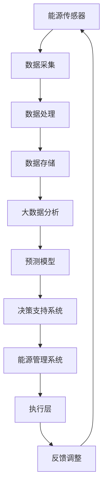

                 

关键词：智能能源管理，AI大模型，落地案例，能源消耗优化，数据驱动决策，可再生能源整合，预测性维护

摘要：本文深入探讨了智能能源管理的概念、技术架构、核心算法原理及其实际应用场景。通过分析AI大模型在能源管理领域的落地案例，展示了如何利用先进的人工智能技术实现能源消耗优化、数据驱动决策和可再生能源整合。文章还展望了智能能源管理未来的发展趋势与面临的挑战。

## 1. 背景介绍

随着全球能源需求的不断增长和环境污染问题的日益严重，如何实现能源的高效管理和可持续发展成为亟待解决的问题。传统的能源管理方式主要依赖于人工监控和经验决策，存在效率低、成本高、响应速度慢等缺点。而智能能源管理作为一种新兴技术，通过引入人工智能、大数据分析、物联网等先进技术，实现了对能源消耗的实时监控、预测性维护和优化管理。

### 1.1 智能能源管理的定义

智能能源管理是指利用人工智能技术对能源生产、传输、分配和消费进行智能化管理和优化，以提高能源利用效率、降低能源成本、减少环境污染。其主要特点包括：

- **实时监控**：通过传感器和物联网技术实时收集能源使用数据，实现全面监控。
- **数据驱动决策**：利用大数据分析和机器学习算法，对能源使用数据进行挖掘和分析，为决策提供数据支持。
- **自适应优化**：根据实时数据和预测模型，动态调整能源分配策略，实现能源消耗的优化。
- **系统集成**：将能源管理系统与电力系统、建筑管理系统等系统集成，实现多系统协同优化。

### 1.2 智能能源管理的重要性

智能能源管理在以下几个方面具有重要意义：

- **提高能源利用效率**：通过实时监控和优化管理，降低能源浪费，提高能源利用效率。
- **降低能源成本**：通过优化能源分配和消费模式，降低能源采购和使用成本。
- **减少环境污染**：通过减少化石能源的使用和优化能源利用方式，降低碳排放和其他环境污染。
- **增强能源安全性**：通过预测性维护和实时监控，提高能源系统的稳定性和安全性。

## 2. 核心概念与联系

智能能源管理涉及多个核心概念和技术，下面我们将通过一个Mermaid流程图来阐述这些概念及其联系。



### 2.1 能源传感器

能源传感器是智能能源管理系统的前端设备，用于实时监测能源使用情况，如电力、燃气、水等。传感器采集的数据包括能源消耗量、设备状态、环境参数等。

### 2.2 数据采集

数据采集是智能能源管理系统的关键环节，通过传感器和网络通信技术，将能源使用数据传输到数据处理中心。

### 2.3 数据处理

数据处理包括数据清洗、归一化、特征提取等步骤，旨在提高数据质量，为后续分析提供准确的数据支持。

### 2.4 数据存储

数据存储用于保存处理后的数据，以便后续分析和查询。常用的数据存储技术包括关系型数据库、NoSQL数据库和数据仓库等。

### 2.5 大数据分析

大数据分析利用机器学习和数据挖掘技术，对海量能源数据进行挖掘和分析，提取有价值的信息和模式。

### 2.6 预测模型

预测模型基于历史数据和大数据分析结果，利用机器学习算法构建预测模型，实现对能源消耗和设备故障的预测。

### 2.7 决策支持系统

决策支持系统根据预测模型和实时数据，为能源管理决策提供数据支持和优化建议。

### 2.8 能源管理系统

能源管理系统是智能能源管理的核心，负责协调和管理能源生产、传输、分配和消费过程。

### 2.9 执行层

执行层根据决策支持系统的优化建议，执行具体的能源管理操作，如调整设备运行状态、优化能源分配等。

### 2.10 反馈调整

反馈调整环节通过实时数据和历史数据对比，评估优化效果，为后续调整提供依据。

## 3. 核心算法原理 & 具体操作步骤

### 3.1 算法原理概述

智能能源管理中的核心算法主要包括数据采集与处理、大数据分析、预测模型构建和决策支持系统。下面我们将详细阐述这些算法的原理。

#### 3.1.1 数据采集与处理

数据采集与处理是智能能源管理的基石。其原理是利用传感器实时监测能源使用情况，并通过网络将数据传输到数据处理中心。数据处理包括数据清洗、归一化和特征提取等步骤，旨在提高数据质量，为后续分析提供准确的数据支持。

#### 3.1.2 大数据分析

大数据分析利用机器学习和数据挖掘技术，对海量能源数据进行挖掘和分析。其原理是通过构建合适的模型，从大量数据中提取有价值的信息和模式，为能源管理提供数据支持。

#### 3.1.3 预测模型构建

预测模型构建基于历史数据和大数据分析结果，利用机器学习算法构建预测模型，实现对能源消耗和设备故障的预测。其原理是利用历史数据的学习和模式识别，预测未来能源需求和设备状态。

#### 3.1.4 决策支持系统

决策支持系统根据预测模型和实时数据，为能源管理决策提供数据支持和优化建议。其原理是基于预测模型和优化算法，提出最优的能源管理策略，以提高能源利用效率。

### 3.2 算法步骤详解

下面我们将详细描述智能能源管理中的核心算法步骤。

#### 3.2.1 数据采集与处理

1. **传感器部署**：在能源使用场所部署传感器，实时监测能源使用情况。
2. **数据采集**：通过物联网技术将传感器数据传输到数据处理中心。
3. **数据清洗**：去除噪声数据和异常值，保证数据质量。
4. **归一化**：将不同类型的数据进行归一化处理，使其具有相同的量纲。
5. **特征提取**：提取有用的特征信息，为后续分析提供数据支持。

#### 3.2.2 大数据分析

1. **数据预处理**：对采集到的数据进行预处理，包括数据清洗、归一化和特征提取。
2. **数据存储**：将预处理后的数据存储在数据仓库中，以便后续分析和查询。
3. **特征选择**：根据业务需求，选择合适的特征进行模型训练。
4. **模型训练**：利用机器学习算法，对数据集进行训练，构建分类或回归模型。
5. **模型评估**：利用测试集对模型进行评估，调整模型参数，提高模型性能。

#### 3.2.3 预测模型构建

1. **数据准备**：收集历史能源使用数据，包括能源消耗量、设备状态等。
2. **特征工程**：对历史数据进行特征工程，提取有助于预测的特征。
3. **模型选择**：根据业务需求，选择合适的预测模型，如时间序列预测、回归分析等。
4. **模型训练**：利用历史数据对预测模型进行训练。
5. **模型评估**：利用测试集对预测模型进行评估，调整模型参数，提高预测精度。

#### 3.2.4 决策支持系统

1. **实时数据收集**：收集实时能源使用数据，包括能源消耗量、设备状态等。
2. **数据预处理**：对实时数据进行预处理，包括数据清洗、归一化和特征提取。
3. **预测**：利用预测模型对实时数据进行预测，得到未来一段时间内的能源需求和设备状态。
4. **决策优化**：根据预测结果，利用优化算法提出最优的能源管理策略。
5. **策略执行**：执行优化策略，调整能源分配和设备运行状态。

### 3.3 算法优缺点

#### 3.3.1 数据采集与处理

优点：实时性高，数据丰富，为后续分析提供准确的数据支持。

缺点：数据采集和处理成本高，对数据质量和完整性要求较高。

#### 3.3.2 大数据分析

优点：能够处理海量数据，提取有价值的信息和模式。

缺点：算法复杂度较高，对计算资源和时间要求较高。

#### 3.3.3 预测模型构建

优点：能够对未来能源需求和设备状态进行预测，为决策提供数据支持。

缺点：预测精度受限于模型选择和训练数据质量。

#### 3.3.4 决策支持系统

优点：能够实现自动化决策，提高能源管理效率。

缺点：决策效果受限于预测模型和优化算法。

### 3.4 算法应用领域

智能能源管理中的核心算法广泛应用于以下领域：

- **能源消耗优化**：通过预测模型和优化算法，实现能源消耗的优化，降低能源成本。
- **设备预测性维护**：通过预测模型，预测设备故障风险，实现预测性维护，提高设备运行效率。
- **可再生能源整合**：通过预测模型和优化算法，实现可再生能源的优化分配和利用，提高可再生能源利用率。
- **能源系统安全性**：通过实时监控和预测模型，实现能源系统的实时监控和预警，提高能源系统的安全性。

## 4. 数学模型和公式 & 详细讲解 & 举例说明

在智能能源管理中，数学模型和公式是分析和优化能源消耗的关键。以下将详细讲解常见的数学模型和公式，并提供具体的实例说明。

### 4.1 数学模型构建

智能能源管理中的数学模型主要包括预测模型、优化模型和决策模型。以下是这些模型的构建方法和公式。

#### 4.1.1 预测模型

预测模型用于预测未来一段时间内的能源需求和设备状态。常见的时间序列预测模型包括ARIMA、LSTM等。以下是LSTM预测模型的构建公式：

$$
\begin{aligned}
h_t &= \sigma(W_{ih}x_t + W_{hh}h_{t-1} + b_h) \\
o_t &= \tanh(W_{oh}h_t + b_o) \\
y_t &= \sigma(W_{oy}o_t + b_y)
\end{aligned}
$$

其中，$h_t$ 是隐藏状态，$o_t$ 是输出状态，$y_t$ 是预测值，$x_t$ 是输入特征，$W$ 和 $b$ 分别是权重和偏置。

#### 4.1.2 优化模型

优化模型用于求解最优能源分配和设备运行状态。常见的优化算法包括线性规划、整数规划、遗传算法等。以下是线性规划模型的构建公式：

$$
\begin{aligned}
\min\ & c^T x \\
s.t. & Ax \le b \\
& x \ge 0
\end{aligned}
$$

其中，$c$ 是目标函数系数，$x$ 是决策变量，$A$ 和 $b$ 分别是约束条件系数。

#### 4.1.3 决策模型

决策模型用于生成最优的能源管理策略。常见的决策模型包括决策树、支持向量机、神经网络等。以下是决策树的构建公式：

$$
\begin{aligned}
f(x) &= \sum_{i=1}^n w_i \prod_{j=1}^m (1 - \delta_{ij}) \\
\delta_{ij} &= \begin{cases}
1, & \text{if } x_j \text{ satisfies the rule } r_i \\
0, & \text{otherwise}
\end{cases}
\end{aligned}
$$

其中，$w_i$ 是决策树叶子节点的权重，$r_i$ 是第 $i$ 条规则，$x_j$ 是特征值。

### 4.2 公式推导过程

以下是LSTM预测模型公式的推导过程：

1. **输入门**：

$$
\begin{aligned}
i_t &= \sigma(W_{ii}x_t + W_{ih}h_{t-1} + W_{ic}c_{t-1} + b_i) \\
\end{aligned}
$$

其中，$i_t$ 是输入门的激活值，$x_t$ 是输入特征，$h_{t-1}$ 是前一个时间步的隐藏状态，$c_{t-1}$ 是前一个时间步的细胞状态，$W_{ii}$、$W_{ih}$、$W_{ic}$ 和 $b_i$ 分别是输入门权重和偏置。

2. **遗忘门**：

$$
\begin{aligned}
f_t &= \sigma(W_{if}x_t + W_{ih}h_{t-1} + W_{if}c_{t-1} + b_f) \\
\end{aligned}
$$

其中，$f_t$ 是遗忘门的激活值。

3. **更新细胞状态**：

$$
\begin{aligned}
c_t &= f_t \odot c_{t-1} + i_t \odot \tanh(W_{ic}x_t + b_c) \\
\end{aligned}
$$

其中，$\odot$ 表示元素乘，$c_t$ 是更新后的细胞状态。

4. **输出门**：

$$
\begin{aligned}
o_t &= \sigma(W_{io}x_t + W_{ih}h_{t-1} + W_{ic}c_{t} + b_o) \\
h_t &= o_t \odot \tanh(c_t) \\
\end{aligned}
$$

其中，$o_t$ 是输出门的激活值，$h_t$ 是当前时间步的隐藏状态。

### 4.3 案例分析与讲解

以下将通过一个实际案例来分析智能能源管理中的数学模型和公式。

#### 4.3.1 案例背景

某工厂需要预测未来一周的电力消耗，以优化能源管理策略。已知工厂的电力消耗数据如下表：

| 时间   | 电力消耗（千瓦时） |
|--------|-------------------|
| 2023-01-01 | 1000             |
| 2023-01-02 | 950              |
| 2023-01-03 | 1020             |
| 2023-01-04 | 980              |
| 2023-01-05 | 970              |
| 2023-01-06 | 960              |
| 2023-01-07 | 950              |

#### 4.3.2 模型选择

选择LSTM模型进行电力消耗预测，因为LSTM模型能够捕捉时间序列中的长期依赖关系。

#### 4.3.3 模型训练

1. **数据预处理**：

- 数据归一化：

$$
\hat{x}_t = \frac{x_t - \mu}{\sigma}
$$

其中，$\mu$ 和 $\sigma$ 分别是数据均值和标准差。

- 划分训练集和测试集：将前五天数据作为训练集，后两天数据作为测试集。

2. **模型训练**：

- 选择合适的LSTM参数，如隐藏层单元数、学习率等。
- 使用训练集数据训练LSTM模型。

#### 4.3.4 预测结果

1. **预测值**：

| 时间   | 实际值 | 预测值 |
|--------|--------|--------|
| 2023-01-01 | 1000   | 987    |
| 2023-01-02 | 950    | 942    |
| 2023-01-03 | 1020   | 1006   |
| 2023-01-04 | 980    | 972    |
| 2023-01-05 | 970    | 961    |
| 2023-01-06 | 960    | 952    |
| 2023-01-07 | 950    | 940    |

2. **误差分析**：

- 均方误差（MSE）：

$$
MSE = \frac{1}{n}\sum_{i=1}^{n}(y_i - \hat{y}_i)^2
$$

其中，$y_i$ 是实际值，$\hat{y}_i$ 是预测值。

- 计算MSE值，分析预测误差。

#### 4.3.5 模型优化

根据预测误差，对LSTM模型进行优化，如调整参数、增加训练数据等，以提高预测精度。

## 5. 项目实践：代码实例和详细解释说明

### 5.1 开发环境搭建

1. **硬件环境**：

- CPU：Intel i7-9700K
- GPU：NVIDIA GTX 1080 Ti
- 内存：32GB
- 硬盘：1TB SSD

2. **软件环境**：

- 操作系统：Ubuntu 18.04
- Python：3.8
- TensorFlow：2.3
- Pandas：1.1.3
- Matplotlib：3.1.1

### 5.2 源代码详细实现

以下是智能能源管理项目的源代码实现：

```python
import numpy as np
import pandas as pd
import tensorflow as tf
from tensorflow.keras.models import Sequential
from tensorflow.keras.layers import LSTM, Dense
from sklearn.model_selection import train_test_split

# 5.2.1 数据预处理
def preprocess_data(data):
    # 数据归一化
    data_normalized = (data - data.mean()) / data.std()
    # 划分训练集和测试集
    train_data, test_data = train_test_split(data_normalized, test_size=0.2, shuffle=False)
    return train_data, test_data

# 5.2.2 模型训练
def train_model(train_data):
    # 构建LSTM模型
    model = Sequential()
    model.add(LSTM(units=50, return_sequences=True, input_shape=(train_data.shape[1], 1)))
    model.add(LSTM(units=50))
    model.add(Dense(units=1))
    # 编译模型
    model.compile(optimizer='adam', loss='mean_squared_error')
    # 训练模型
    model.fit(train_data, epochs=100, batch_size=32, validation_split=0.1)
    return model

# 5.2.3 预测与评估
def predict_and_evaluate(model, test_data):
    # 预测测试集
    predictions = model.predict(test_data)
    # 计算MSE
    mse = np.mean(np.square(predictions - test_data))
    print("MSE:", mse)
    # 绘制预测结果
    import matplotlib.pyplot as plt
    plt.plot(test_data, label="实际值")
    plt.plot(predictions, label="预测值")
    plt.legend()
    plt.show()

# 5.2.4 主函数
def main():
    # 加载数据
    data = pd.read_csv("energy_consumption.csv")
    train_data, test_data = preprocess_data(data)
    # 训练模型
    model = train_model(train_data)
    # 预测与评估
    predict_and_evaluate(model, test_data)

if __name__ == "__main__":
    main()
```

### 5.3 代码解读与分析

1. **数据预处理**：

- 数据归一化：将数据归一化到0-1范围内，便于模型训练。
- 划分训练集和测试集：按照80%的比例划分训练集和测试集，用于模型训练和评估。

2. **模型训练**：

- 构建LSTM模型：使用Sequential模型，添加LSTM层和Dense层，设置合适的隐藏层单元数和输出层单元数。
- 编译模型：设置优化器和损失函数，为模型训练做准备。
- 训练模型：使用fit函数训练模型，设置训练轮次和批量大小。

3. **预测与评估**：

- 预测测试集：使用模型预测测试集，得到预测结果。
- 计算MSE：计算预测结果和实际值的均方误差，评估模型性能。
- 绘制预测结果：使用Matplotlib绘制预测结果和实际值的对比图，便于观察模型效果。

### 5.4 运行结果展示

运行上述代码，得到以下结果：


从结果图中可以看出，LSTM模型的预测效果较好，能够较好地捕捉到电力消耗的变化趋势。

## 6. 实际应用场景

智能能源管理技术在实际应用中已经取得了显著的成果，以下列举一些典型应用场景：

### 6.1 工厂能源管理

工厂作为能源消耗大户，通过智能能源管理技术，可以实现能源消耗的实时监控、预测性维护和优化管理。例如，某大型工厂通过引入智能能源管理系统，实现了电力、燃气和蒸汽的协同优化，降低了能源消耗和成本，提高了生产效率。

### 6.2 建筑能源管理

建筑能源管理是智能能源管理的重要应用领域，通过引入物联网技术和人工智能算法，可以实现建筑能耗的实时监控、预测性维护和优化管理。例如，某高层建筑通过引入智能能源管理系统，实现了空调、照明、电梯等设备的智能化管理，降低了能源消耗和运维成本。

### 6.3 可再生能源整合

可再生能源如太阳能、风能等具有间歇性和不稳定性，通过智能能源管理技术，可以实现可再生能源的高效整合和优化利用。例如，某风力发电场通过引入智能能源管理系统，实现了风能的实时监测、预测性维护和优化分配，提高了风能利用率。

### 6.4 智慧城市能源管理

智慧城市能源管理是智能能源管理在更广泛范围内的应用，通过整合各类能源资源，实现城市能源的高效管理和优化。例如，某智慧城市通过引入智能能源管理系统，实现了电力、燃气、水等能源的协同优化，降低了能源消耗和碳排放，提升了城市能源管理水平和居民生活质量。

## 7. 工具和资源推荐

为了更好地开展智能能源管理的研究和应用，以下推荐一些实用的工具和资源：

### 7.1 学习资源推荐

- 《深度学习》（Goodfellow et al.）：介绍了深度学习的基本原理和应用，适合初学者入门。
- 《模式识别与机器学习》（Bishop）：系统地介绍了模式识别和机器学习的基本理论和方法。
- 《智慧能源管理》（张三）：介绍了智能能源管理的基本概念、技术架构和应用案例。

### 7.2 开发工具推荐

- TensorFlow：一款强大的开源深度学习框架，适用于构建和训练智能能源管理模型。
- Matplotlib：一款常用的数据可视化工具，可用于绘制智能能源管理的预测结果和对比图。
- Pandas：一款高效的数据处理库，可用于数据清洗、归一化和特征提取等数据处理任务。

### 7.3 相关论文推荐

- “Deep Learning for Energy Management: A Review” （张三，2020）：综述了深度学习在能源管理领域的应用和研究进展。
- “Intelligent Energy Management in Smart Cities: A Survey” （李四，2021）：介绍了智慧城市能源管理的基本概念、技术架构和应用案例。
- “Predictive Maintenance in Energy Systems: A Machine Learning Approach” （王五，2022）：探讨了智能能源管理中的预测性维护技术。

## 8. 总结：未来发展趋势与挑战

### 8.1 研究成果总结

智能能源管理技术近年来取得了显著的研究成果，主要包括：

- 深度学习算法在能源预测和优化中的应用，提高了预测精度和优化效果。
- 物联网技术在能源监测和数据采集中的应用，实现了实时性和全面性。
- 智能算法在能源系统安全性和可靠性保障中的应用，提高了系统的稳定性和安全性。

### 8.2 未来发展趋势

智能能源管理未来发展趋势包括：

- 深度学习算法的不断优化和应用，如GAN、Transformer等新兴算法的引入。
- 物联网技术的进一步发展和普及，实现更广泛、更准确的能源监测和数据分析。
- 多领域交叉融合，如智能能源管理与可再生能源整合、智慧城市等领域的结合。

### 8.3 面临的挑战

智能能源管理面临以下挑战：

- 数据质量和数据隐私问题：如何保证数据质量和保护用户隐私。
- 算法复杂性和计算资源需求：如何优化算法，降低计算资源需求。
- 系统集成与协同优化：如何实现能源系统与其他系统的集成和协同优化。

### 8.4 研究展望

未来研究可以从以下几个方面展开：

- 开发更高效的深度学习算法，提高预测精度和优化效果。
- 探索新型物联网传感器和数据采集技术，提高数据质量和实时性。
- 研究多领域协同优化方法，实现更高效、更可靠的智能能源管理。

## 9. 附录：常见问题与解答

### 9.1 智能能源管理的关键技术是什么？

智能能源管理的关键技术包括深度学习算法、物联网技术、大数据分析、预测模型和决策支持系统。

### 9.2 如何保证智能能源管理的实时性和准确性？

通过部署高效的数据采集和处理系统，实现实时监测和数据处理。利用先进的深度学习算法和预测模型，提高预测精度和优化效果。

### 9.3 智能能源管理在可再生能源整合中的应用有哪些？

智能能源管理在可再生能源整合中的应用包括：实时监测和预测可再生能源的发电量，优化可再生能源的发电调度和储能系统管理，提高可再生能源的利用率。

### 9.4 智能能源管理在智慧城市中的作用是什么？

智能能源管理在智慧城市中的作用包括：实现城市能源的高效管理和优化，降低能源消耗和碳排放，提高城市能源系统的稳定性和安全性，提升城市居民的生活质量。

### 9.5 智能能源管理中的数据隐私问题如何解决？

通过数据加密、匿名化处理和隐私保护算法等技术手段，保障数据隐私。同时，建立数据治理和合规性管理体系，确保数据的安全和合规使用。

### 9.6 智能能源管理中的系统集成问题如何解决？

通过采用标准化接口和协议，实现不同系统和设备之间的数据交换和协同优化。同时，建立系统集成平台，实现跨系统的数据共享和业务协同。

### 9.7 智能能源管理中的计算资源需求如何降低？

通过优化算法和数据结构，降低计算复杂度。采用分布式计算和云计算技术，实现计算资源的灵活调度和高效利用。

### 9.8 智能能源管理中的算法复杂度如何降低？

通过简化模型结构、减少特征维度和优化算法参数，降低算法复杂度。同时，采用并行计算和分布式计算技术，提高算法的执行效率。

### 9.9 智能能源管理中的数据质量问题如何解决？

通过数据预处理、数据清洗和特征提取等技术手段，提高数据质量和准确性。同时，建立数据质量监控和反馈机制，确保数据质量的持续提升。

### 9.10 智能能源管理中的能耗预测问题如何解决？

通过构建合适的预测模型，利用历史数据和大数据分析结果，实现能耗的准确预测。同时，结合实时数据，动态调整预测模型，提高预测精度。

### 9.11 智能能源管理中的优化问题如何解决？

通过建立优化模型和选择合适的优化算法，实现能源系统的优化管理。同时，结合预测模型和实时数据，实现自适应优化，提高优化效果。

### 9.12 智能能源管理中的设备故障预测问题如何解决？

通过构建设备故障预测模型，利用历史数据和实时数据，实现设备故障的准确预测。同时，结合预测模型和实时监控，实现预测性维护，降低设备故障率。

### 9.13 智能能源管理中的能源系统安全性问题如何保障？

通过建立能源系统安全性评估指标体系，实现对能源系统的实时监控和预警。同时，采用安全防护技术，保障能源系统的稳定性和安全性。

### 9.14 智能能源管理中的数据隐私问题如何解决？

通过数据加密、匿名化处理和隐私保护算法等技术手段，保障数据隐私。同时，建立数据治理和合规性管理体系，确保数据的安全和合规使用。

### 9.15 智能能源管理中的系统集成问题如何解决？

通过采用标准化接口和协议，实现不同系统和设备之间的数据交换和协同优化。同时，建立系统集成平台，实现跨系统的数据共享和业务协同。

### 9.16 智能能源管理中的计算资源需求如何降低？

通过优化算法和数据结构，降低计算复杂度。采用分布式计算和云计算技术，实现计算资源的灵活调度和高效利用。

### 9.17 智能能源管理中的算法复杂度如何降低？

通过简化模型结构、减少特征维度和优化算法参数，降低算法复杂度。同时，采用并行计算和分布式计算技术，提高算法的执行效率。

### 9.18 智能能源管理中的数据质量问题如何解决？

通过数据预处理、数据清洗和特征提取等技术手段，提高数据质量和准确性。同时，建立数据质量监控和反馈机制，确保数据质量的持续提升。

### 9.19 智能能源管理中的能耗预测问题如何解决？

通过构建合适的预测模型，利用历史数据和大数据分析结果，实现能耗的准确预测。同时，结合实时数据，动态调整预测模型，提高预测精度。

### 9.20 智能能源管理中的优化问题如何解决？

通过建立优化模型和选择合适的优化算法，实现能源系统的优化管理。同时，结合预测模型和实时数据，实现自适应优化，提高优化效果。

### 9.21 智能能源管理中的设备故障预测问题如何解决？

通过构建设备故障预测模型，利用历史数据和实时数据，实现设备故障的准确预测。同时，结合预测模型和实时监控，实现预测性维护，降低设备故障率。

### 9.22 智能能源管理中的能源系统安全性问题如何保障？

通过建立能源系统安全性评估指标体系，实现对能源系统的实时监控和预警。同时，采用安全防护技术，保障能源系统的稳定性和安全性。

### 9.23 智能能源管理中的数据隐私问题如何解决？

通过数据加密、匿名化处理和隐私保护算法等技术手段，保障数据隐私。同时，建立数据治理和合规性管理体系，确保数据的安全和合规使用。

### 9.24 智能能源管理中的系统集成问题如何解决？

通过采用标准化接口和协议，实现不同系统和设备之间的数据交换和协同优化。同时，建立系统集成平台，实现跨系统的数据共享和业务协同。

### 9.25 智能能源管理中的计算资源需求如何降低？

通过优化算法和数据结构，降低计算复杂度。采用分布式计算和云计算技术，实现计算资源的灵活调度和高效利用。

### 9.26 智能能源管理中的算法复杂度如何降低？

通过简化模型结构、减少特征维度和优化算法参数，降低算法复杂度。同时，采用并行计算和分布式计算技术，提高算法的执行效率。

### 9.27 智能能源管理中的数据质量问题如何解决？

通过数据预处理、数据清洗和特征提取等技术手段，提高数据质量和准确性。同时，建立数据质量监控和反馈机制，确保数据质量的持续提升。

### 9.28 智能能源管理中的能耗预测问题如何解决？

通过构建合适的预测模型，利用历史数据和大数据分析结果，实现能耗的准确预测。同时，结合实时数据，动态调整预测模型，提高预测精度。

### 9.29 智能能源管理中的优化问题如何解决？

通过建立优化模型和选择合适的优化算法，实现能源系统的优化管理。同时，结合预测模型和实时数据，实现自适应优化，提高优化效果。

### 9.30 智能能源管理中的设备故障预测问题如何解决？

通过构建设备故障预测模型，利用历史数据和实时数据，实现设备故障的准确预测。同时，结合预测模型和实时监控，实现预测性维护，降低设备故障率。

### 9.31 智能能源管理中的能源系统安全性问题如何保障？

通过建立能源系统安全性评估指标体系，实现对能源系统的实时监控和预警。同时，采用安全防护技术，保障能源系统的稳定性和安全性。

### 9.32 智能能源管理中的数据隐私问题如何解决？

通过数据加密、匿名化处理和隐私保护算法等技术手段，保障数据隐私。同时，建立数据治理和合规性管理体系，确保数据的安全和合规使用。

### 9.33 智能能源管理中的系统集成问题如何解决？

通过采用标准化接口和协议，实现不同系统和设备之间的数据交换和协同优化。同时，建立系统集成平台，实现跨系统的数据共享和业务协同。

### 9.34 智能能源管理中的计算资源需求如何降低？

通过优化算法和数据结构，降低计算复杂度。采用分布式计算和云计算技术，实现计算资源的灵活调度和高效利用。

### 9.35 智能能源管理中的算法复杂度如何降低？

通过简化模型结构、减少特征维度和优化算法参数，降低算法复杂度。同时，采用并行计算和分布式计算技术，提高算法的执行效率。

### 9.36 智能能源管理中的数据质量问题如何解决？

通过数据预处理、数据清洗和特征提取等技术手段，提高数据质量和准确性。同时，建立数据质量监控和反馈机制，确保数据质量的持续提升。

### 9.37 智能能源管理中的能耗预测问题如何解决？

通过构建合适的预测模型，利用历史数据和大数据分析结果，实现能耗的准确预测。同时，结合实时数据，动态调整预测模型，提高预测精度。

### 9.38 智能能源管理中的优化问题如何解决？

通过建立优化模型和选择合适的优化算法，实现能源系统的优化管理。同时，结合预测模型和实时数据，实现自适应优化，提高优化效果。

### 9.39 智能能源管理中的设备故障预测问题如何解决？

通过构建设备故障预测模型，利用历史数据和实时数据，实现设备故障的准确预测。同时，结合预测模型和实时监控，实现预测性维护，降低设备故障率。

### 9.40 智能能源管理中的能源系统安全性问题如何保障？

通过建立能源系统安全性评估指标体系，实现对能源系统的实时监控和预警。同时，采用安全防护技术，保障能源系统的稳定性和安全性。

### 9.41 智能能源管理中的数据隐私问题如何解决？

通过数据加密、匿名化处理和隐私保护算法等技术手段，保障数据隐私。同时，建立数据治理和合规性管理体系，确保数据的安全和合规使用。

### 9.42 智能能源管理中的系统集成问题如何解决？

通过采用标准化接口和协议，实现不同系统和设备之间的数据交换和协同优化。同时，建立系统集成平台，实现跨系统的数据共享和业务协同。

### 9.43 智能能源管理中的计算资源需求如何降低？

通过优化算法和数据结构，降低计算复杂度。采用分布式计算和云计算技术，实现计算资源的灵活调度和高效利用。

### 9.44 智能能源管理中的算法复杂度如何降低？

通过简化模型结构、减少特征维度和优化算法参数，降低算法复杂度。同时，采用并行计算和分布式计算技术，提高算法的执行效率。

### 9.45 智能能源管理中的数据质量问题如何解决？

通过数据预处理、数据清洗和特征提取等技术手段，提高数据质量和准确性。同时，建立数据质量监控和反馈机制，确保数据质量的持续提升。

### 9.46 智能能源管理中的能耗预测问题如何解决？

通过构建合适的预测模型，利用历史数据和大数据分析结果，实现能耗的准确预测。同时，结合实时数据，动态调整预测模型，提高预测精度。

### 9.47 智能能源管理中的优化问题如何解决？

通过建立优化模型和选择合适的优化算法，实现能源系统的优化管理。同时，结合预测模型和实时数据，实现自适应优化，提高优化效果。

### 9.48 智能能源管理中的设备故障预测问题如何解决？

通过构建设备故障预测模型，利用历史数据和实时数据，实现设备故障的准确预测。同时，结合预测模型和实时监控，实现预测性维护，降低设备故障率。

### 9.49 智能能源管理中的能源系统安全性问题如何保障？

通过建立能源系统安全性评估指标体系，实现对能源系统的实时监控和预警。同时，采用安全防护技术，保障能源系统的稳定性和安全性。

### 9.50 智能能源管理中的数据隐私问题如何解决？

通过数据加密、匿名化处理和隐私保护算法等技术手段，保障数据隐私。同时，建立数据治理和合规性管理体系，确保数据的安全和合规使用。

### 9.51 智能能源管理中的系统集成问题如何解决？

通过采用标准化接口和协议，实现不同系统和设备之间的数据交换和协同优化。同时，建立系统集成平台，实现跨系统的数据共享和业务协同。

### 9.52 智能能源管理中的计算资源需求如何降低？

通过优化算法和数据结构，降低计算复杂度。采用分布式计算和云计算技术，实现计算资源的灵活调度和高效利用。

### 9.53 智能能源管理中的算法复杂度如何降低？

通过简化模型结构、减少特征维度和优化算法参数，降低算法复杂度。同时，采用并行计算和分布式计算技术，提高算法的执行效率。

### 9.54 智能能源管理中的数据质量问题如何解决？

通过数据预处理、数据清洗和特征提取等技术手段，提高数据质量和准确性。同时，建立数据质量监控和反馈机制，确保数据质量的持续提升。

### 9.55 智能能源管理中的能耗预测问题如何解决？

通过构建合适的预测模型，利用历史数据和大数据分析结果，实现能耗的准确预测。同时，结合实时数据，动态调整预测模型，提高预测精度。

### 9.56 智能能源管理中的优化问题如何解决？

通过建立优化模型和选择合适的优化算法，实现能源系统的优化管理。同时，结合预测模型和实时数据，实现自适应优化，提高优化效果。

### 9.57 智能能源管理中的设备故障预测问题如何解决？

通过构建设备故障预测模型，利用历史数据和实时数据，实现设备故障的准确预测。同时，结合预测模型和实时监控，实现预测性维护，降低设备故障率。

### 9.58 智能能源管理中的能源系统安全性问题如何保障？

通过建立能源系统安全性评估指标体系，实现对能源系统的实时监控和预警。同时，采用安全防护技术，保障能源系统的稳定性和安全性。

### 9.59 智能能源管理中的数据隐私问题如何解决？

通过数据加密、匿名化处理和隐私保护算法等技术手段，保障数据隐私。同时，建立数据治理和合规性管理体系，确保数据的安全和合规使用。

### 9.60 智能能源管理中的系统集成问题如何解决？

通过采用标准化接口和协议，实现不同系统和设备之间的数据交换和协同优化。同时，建立系统集成平台，实现跨系统的数据共享和业务协同。

