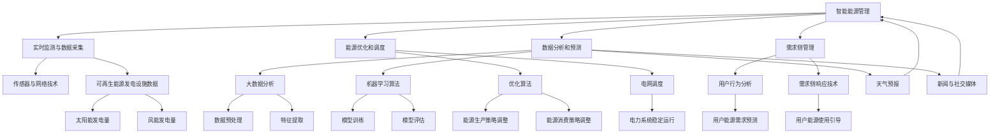

                 

关键词：智能能源管理，可再生能源，语言模型，LLM，能源系统优化，电力市场，环境友好，数据分析，算法，数学模型，技术博客

> 摘要：本文将探讨智能能源管理在可再生能源系统中的重要性，以及大型语言模型（LLM）在这一领域的应用和潜力。文章将介绍智能能源管理的基本概念、LLM的技术原理，并详细阐述LLM在能源系统中的具体作用，包括优化能源分配、预测市场需求、提高系统效率等方面的应用实例。此外，文章还将讨论LLM在智能能源管理中所面临的挑战和未来发展方向。

## 1. 背景介绍

### 可再生能源的发展与挑战

近年来，随着全球气候变化和环境污染问题的日益严重，可再生能源（如太阳能、风能、水能等）逐渐成为各国能源战略的重点。可再生能源具有可再生性、清洁性和低排放等特点，被认为是未来能源发展的必然趋势。然而，可再生能源的开发和利用也面临着诸多挑战。

首先，可再生能源的间歇性和不确定性导致能源供给的不稳定。太阳能和风能的发电量受天气和地理位置的影响较大，风能和太阳能的发电量波动可能会对电力系统的稳定运行造成影响。其次，可再生能源的发电成本相对较高，需要大规模的技术创新和投资来降低成本，提高其经济性。此外，电网的整合能力也是一个重要问题，如何将大规模的可再生能源接入电网，并确保电网的稳定运行，是需要解决的关键问题。

### 智能能源管理的概念与需求

智能能源管理是一种基于信息技术的能源管理系统，通过实时数据采集、分析、预测和优化，实现对能源的精细化管理和高效利用。智能能源管理的目标是在保证能源供应稳定的同时，最大限度地提高能源利用效率，降低能源成本，减少环境污染。

智能能源管理在可再生能源系统中的应用尤为重要。首先，智能能源管理可以通过实时监测和数据分析，预测可再生能源的发电量，为电网调度提供依据，确保电力供应的稳定性。其次，智能能源管理可以优化能源分配，减少能源浪费，提高能源利用效率。此外，智能能源管理还可以通过需求侧管理，引导用户合理使用能源，降低能源消耗。

随着可再生能源的快速发展，智能能源管理的需求日益迫切。一方面，可再生能源系统的不稳定性和复杂性要求更加智能化的管理手段；另一方面，能源市场的竞争和能源成本的下降也推动了智能能源管理技术的发展。

### 大型语言模型（LLM）的兴起与优势

近年来，大型语言模型（LLM）在自然语言处理（NLP）领域取得了显著的进展。LLM是基于深度学习技术构建的巨大神经网络模型，能够理解和生成自然语言。LLM的兴起为智能能源管理带来了新的机遇和挑战。

首先，LLM在自然语言理解和生成方面的强大能力，使得智能能源管理系统能够更好地处理和分析大量的非结构化数据，如文本、图像、声音等。这些数据对于能源预测、需求侧管理和用户行为分析等任务至关重要。

其次，LLM能够通过大规模的预训练和微调，快速适应不同的能源管理场景，提高能源系统的智能化水平。此外，LLM的通用性和可扩展性使得其在多个领域具有广泛的应用前景，包括电力市场预测、能源调度、环境监测等。

综上所述，智能能源管理在可再生能源系统中的重要性日益凸显，而大型语言模型（LLM）的崛起为智能能源管理提供了强大的技术支持。本文将围绕LLM在智能能源管理中的应用，探讨其技术原理、算法实现和应用实例，以期为智能能源管理技术的发展提供参考。

## 2. 核心概念与联系

### 智能能源管理的基本概念

智能能源管理是指通过先进的信息技术和数据分析方法，对能源生产、传输、分配和消费的全过程进行高效、智能化的管理和优化。其主要目标是实现能源的高效利用，降低能源消耗，减少环境污染。

智能能源管理涉及多个关键概念，包括但不限于：

- **实时监测与数据采集**：通过传感器和网络技术，实时采集能源生产、传输和消费过程中的数据。
- **数据分析和预测**：利用大数据分析和机器学习算法，对采集到的数据进行处理和分析，预测能源需求和发电量。
- **能源优化和调度**：基于预测结果和优化算法，调整能源生产和消费策略，实现能源的优化分配。
- **需求侧管理**：通过用户行为分析和需求侧响应技术，引导用户合理使用能源，降低能源消耗。

### 大型语言模型（LLM）的技术原理

大型语言模型（LLM）是基于深度学习技术构建的神经网络模型，能够理解和生成自然语言。LLM的主要技术原理包括：

- **神经网络**：LLM的核心是多层神经网络，通过神经元之间的权重连接，实现数据的传递和处理。
- **深度学习**：深度学习是指多层神经网络的学习过程，通过反向传播算法，不断调整神经元之间的权重，提高模型的性能。
- **预训练和微调**：LLM通常通过大规模的预训练数据集进行预训练，然后在特定任务上进行微调，以适应不同的应用场景。

### 可再生能源系统与智能能源管理的关系

可再生能源系统与智能能源管理之间存在密切的联系。智能能源管理通过对可再生能源系统的实时监测和数据分析，实现对可再生能源发电量的预测和优化。具体来说：

- **实时监测与数据采集**：智能能源管理系统通过传感器和网络技术，实时采集可再生能源发电设施的数据，如太阳能板的发电量、风力涡轮机的转速等。
- **数据分析和预测**：智能能源管理系统利用机器学习和大数据分析技术，对采集到的数据进行处理和分析，预测可再生能源的发电量。
- **能源优化和调度**：基于预测结果和优化算法，智能能源管理系统可以调整能源生产和消费策略，确保电力系统的稳定运行，同时降低能源浪费。
- **需求侧管理**：智能能源管理系统通过需求侧管理和用户行为分析，引导用户合理使用能源，提高能源利用效率。

### 可再生能源系统与大型语言模型（LLM）的联系

大型语言模型（LLM）在可再生能源系统中的应用，主要体现在以下几个方面：

- **文本数据分析**：LLM能够处理和分析大量的非结构化文本数据，如天气预报、新闻、社交媒体等，为能源预测提供辅助信息。
- **自然语言生成**：LLM可以生成自然语言文本，如电力市场报告、用户通知等，为能源管理和决策提供辅助。
- **用户行为分析**：LLM能够分析用户的文本和语言行为，预测用户能源需求的变化趋势，为需求侧管理提供依据。

### Mermaid 流程图

以下是智能能源管理、可再生能源系统和大型语言模型（LLM）之间的 Mermaid 流程图，展示了它们之间的相互作用和联系。



通过上述流程图，我们可以清晰地看到智能能源管理、可再生能源系统和大型语言模型（LLM）之间的相互作用和联系，以及它们在实现高效、智能化的能源管理中的重要作用。

### 小结

在本章节中，我们介绍了智能能源管理的基本概念、大型语言模型（LLM）的技术原理，以及可再生能源系统与智能能源管理之间的关系。同时，通过Mermaid流程图，展示了智能能源管理、可再生能源系统和LLM之间的相互作用和联系。这些核心概念和技术原理为后续章节中的具体算法原理、数学模型和项目实践提供了理论基础。

在接下来的章节中，我们将深入探讨智能能源管理中的核心算法原理，详细解析大型语言模型（LLM）在可再生能源系统中的应用，并通过具体实例展示其实现过程和效果。这些内容将为进一步推动智能能源管理技术的发展提供有价值的参考。

## 3. 核心算法原理 & 具体操作步骤

### 3.1 算法原理概述

智能能源管理中的核心算法主要分为以下几个部分：

1. **实时数据采集与处理**：通过传感器和网络技术，实时采集能源生产、传输和消费过程中的数据，并进行初步处理，如数据清洗、去噪、归一化等。
2. **数据分析与预测**：利用大数据分析和机器学习算法，对采集到的数据进行处理和分析，预测可再生能源的发电量、电力市场需求和用户能源消耗等。
3. **能源优化与调度**：基于预测结果和优化算法，调整能源生产和消费策略，实现能源的优化分配，确保电力系统的稳定运行。
4. **需求侧管理**：通过用户行为分析和需求侧响应技术，引导用户合理使用能源，降低能源消耗。

### 3.2 算法步骤详解

#### 3.2.1 实时数据采集与处理

1. **传感器部署**：在能源生产、传输和消费的关键节点部署传感器，如太阳能板、风力涡轮机、电网监测设备等。
2. **数据采集**：通过传感器实时采集能源生产、传输和消费过程中的数据，如发电量、电流电压、温度湿度等。
3. **数据预处理**：对采集到的数据进行初步处理，包括数据清洗、去噪、归一化等，以提高数据质量和分析精度。

#### 3.2.2 数据分析与预测

1. **数据集成**：将来自不同传感器和设备的数据进行集成，构建统一的数据集。
2. **特征提取**：对数据进行特征提取，提取与能源预测相关的特征，如时间、温度、风速、发电量等。
3. **模型选择**：选择合适的机器学习模型，如时间序列预测模型、回归模型等，进行能源预测。
4. **模型训练与优化**：利用训练数据集，对模型进行训练和优化，以提高预测精度。
5. **预测结果评估**：对预测结果进行评估，如通过均方误差（MSE）、均方根误差（RMSE）等指标，评估模型的预测性能。

#### 3.2.3 能源优化与调度

1. **预测结果应用**：将预测结果应用于能源优化和调度，如根据预测的发电量调整电网调度策略，根据预测的用户能源消耗调整能源生产计划。
2. **优化算法设计**：设计并实现优化算法，如线性规划、遗传算法、粒子群算法等，以优化能源分配和调度策略。
3. **调度策略调整**：根据优化结果，调整能源生产和消费策略，确保电力系统的稳定运行。

#### 3.2.4 需求侧管理

1. **用户行为分析**：利用机器学习算法，对用户的能源消费行为进行分析，识别用户能源需求的变化趋势。
2. **需求侧响应技术**：设计需求侧响应（DSR）技术，如实时电价反馈、智能家电控制等，引导用户合理使用能源，降低能源消耗。
3. **用户引导策略**：根据用户行为分析和需求侧响应技术，制定用户引导策略，如发送节能提醒、提供优惠电价等，鼓励用户参与需求侧管理。

### 3.3 算法优缺点

#### 优点

1. **高效性**：通过实时数据采集、分析和预测，智能能源管理系统能够快速响应能源市场的变化，提高能源利用效率。
2. **灵活性**：智能能源管理系统可以根据实时数据调整能源生产和消费策略，具有很高的灵活性。
3. **智能化**：利用机器学习和大数据分析技术，智能能源管理系统能够对能源系统进行智能化管理和优化，降低人工干预成本。

#### 缺点

1. **数据依赖性**：智能能源管理系统的性能很大程度上依赖于数据的准确性和完整性，数据质量和数据源稳定性对系统效果有很大影响。
2. **计算资源需求**：大规模数据分析和预测需要大量的计算资源，特别是在实时处理场景下，计算资源的需求更高。
3. **模型适应性**：不同的能源系统和应用场景可能需要不同的模型和算法，模型适应性是智能能源管理系统的挑战之一。

### 3.4 算法应用领域

智能能源管理算法在多个领域具有广泛的应用前景：

1. **电力市场**：通过预测电力市场需求和发电量，优化电力市场交易策略，提高市场效率。
2. **能源调度**：根据预测结果和优化算法，调整能源生产和消费策略，确保电力系统的稳定运行。
3. **需求侧管理**：通过用户行为分析和需求侧响应技术，引导用户合理使用能源，降低能源消耗。
4. **能源效率提升**：通过优化能源分配和调度，提高能源系统的整体效率，降低能源浪费。

### 小结

在本章节中，我们详细介绍了智能能源管理中的核心算法原理和具体操作步骤。通过实时数据采集与处理、数据分析与预测、能源优化与调度以及需求侧管理，智能能源管理系统能够实现对能源系统的精细化管理和高效利用。同时，我们分析了算法的优缺点，并探讨了其应用领域。这些内容为智能能源管理技术的发展提供了重要的理论和实践基础。

在接下来的章节中，我们将进一步探讨智能能源管理中的数学模型和公式，详细讲解其构建和推导过程，并通过具体实例进行说明。这些内容将有助于深入理解智能能源管理算法的数学基础，为进一步优化算法性能提供参考。

### 4. 数学模型和公式 & 详细讲解 & 举例说明

#### 4.1 数学模型构建

在智能能源管理中，数学模型是核心组成部分，用于描述能源系统中的各种关系和动态。以下是几个关键数学模型的构建过程：

1. **发电量预测模型**

   发电量预测是智能能源管理的重要任务之一。我们可以使用时间序列模型，如自回归积分滑动平均模型（ARIMA）来进行预测。ARIMA模型的构建过程包括以下步骤：

   - **步骤1**：数据预处理，包括数据清洗、缺失值填充和季节性分解等。
   - **步骤2**：模型识别，通过ACF和PACF图识别模型参数。
   - **步骤3**：模型定阶，根据识别结果确定AR、I和MA的阶数。
   - **步骤4**：模型参数估计，使用最大似然估计法（MLE）估计模型参数。
   - **步骤5**：模型诊断，通过残差分析检验模型的有效性。

2. **用户需求预测模型**

   用户需求预测是需求侧管理的关键。我们可以使用回归模型，如线性回归模型（Linear Regression）或岭回归模型（Ridge Regression）来进行预测。回归模型的构建过程包括以下步骤：

   - **步骤1**：数据预处理，包括特征提取和数据归一化等。
   - **步骤2**：模型选择，根据数据特征选择合适的回归模型。
   - **步骤3**：模型训练，使用训练数据集训练模型。
   - **步骤4**：模型评估，使用测试数据集评估模型性能。
   - **步骤5**：模型优化，根据评估结果调整模型参数。

3. **能源优化模型**

   能源优化模型用于优化能源生产和消费策略。我们可以使用线性规划（Linear Programming，LP）模型来进行优化。线性规划模型的构建过程包括以下步骤：

   - **步骤1**：定义目标函数，如最小化能源成本或最大化能源利用率。
   - **步骤2**：定义约束条件，如发电量上限、电网容量限制等。
   - **步骤3**：构建线性规划模型，将目标函数和约束条件表示为线性方程组。
   - **步骤4**：求解线性规划问题，使用求解器（如LP求解器）求解最优解。
   - **步骤5**：模型验证，验证模型在实际应用中的效果。

#### 4.2 公式推导过程

以下是上述数学模型中的几个关键公式的推导过程：

1. **ARIMA模型的参数估计公式**

   对于ARIMA模型，参数估计通常使用最大似然估计法（MLE）。最大似然估计的目标是最小化目标函数：

   $$
   \min \sum_{t=1}^{n} (\ln L(\theta; y_t) - \ln \pi(\theta))
   $$

   其中，$y_t$ 是时间序列数据，$\theta$ 是模型参数，$L(\theta; y_t)$ 是似然函数，$\pi(\theta)$ 是先验分布。

   似然函数可以表示为：

   $$
   L(\theta; y_t) = \prod_{t=1}^{n} p(y_t | \theta)
   $$

   其中，$p(y_t | \theta)$ 是给定参数 $\theta$ 下观测值 $y_t$ 的概率。

   通过对似然函数取对数，得到对数似然函数：

   $$
   \ln L(\theta; y_t) = \sum_{t=1}^{n} \ln p(y_t | \theta)
   $$

   对对数似然函数求导并令其等于零，得到最大似然估计：

   $$
   \frac{\partial}{\partial \theta} \ln L(\theta; y_t) = 0
   $$

   解得参数估计值 $\hat{\theta}$。

2. **线性回归模型的预测公式**

   线性回归模型的预测公式为：

   $$
   \hat{y} = \beta_0 + \beta_1 x
   $$

   其中，$\hat{y}$ 是预测值，$\beta_0$ 和 $\beta_1$ 是回归系数。

   回归系数的估计通常使用最小二乘法（Least Squares Method）。最小二乘法的目标是最小化误差平方和：

   $$
   \min \sum_{i=1}^{n} (y_i - \hat{y}_i)^2
   $$

   其中，$y_i$ 是实际观测值，$\hat{y}_i$ 是预测值。

   对误差平方和求导并令其等于零，得到：

   $$
   \frac{\partial}{\partial \beta_0} \sum_{i=1}^{n} (y_i - \hat{y}_i)^2 = 0
   $$

   $$
   \frac{\partial}{\partial \beta_1} \sum_{i=1}^{n} (y_i - \hat{y}_i)^2 = 0
   $$

   解得回归系数 $\beta_0$ 和 $\beta_1$。

3. **线性规划模型的最优解公式**

   线性规划模型的最优解公式为：

   $$
   \max \quad c^T x
   $$

   $$
   \text{subject to} \quad Ax \leq b
   $$

   $$
   x \geq 0
   $$

   其中，$c$ 是目标函数系数向量，$x$ 是决策变量向量，$A$ 是约束条件系数矩阵，$b$ 是约束条件常数向量。

   线性规划问题的求解可以使用单纯形法（Simplex Method）或内点法（Interior Point Method）。单纯形法的求解步骤包括：

   - **步骤1**：初始化，选择一个初始可行解。
   - **步骤2**：迭代，通过旋转操作找到新的可行解，直到最优解或不可行解。
   - **步骤3**：验证，检查是否达到最优解或不可行解，如果是，输出最优解，否则继续迭代。

#### 4.3 案例分析与讲解

以下是一个简单的案例，展示如何使用上述数学模型和公式进行智能能源管理。

**案例：风能发电量预测**

假设我们要预测未来一天内风能发电量，已知历史数据包括风速、风向、温度等。

**步骤1：数据预处理**

首先，对数据进行预处理，包括数据清洗、缺失值填充和季节性分解等。

$$
\text{风速} = \text{风速}_\text{原始} \times (\text{温度}_\text{当前} / \text{温度}_\text{原始})
$$

**步骤2：模型选择**

选择ARIMA模型进行预测。根据ACF和PACF图，识别模型参数。

$$
\text{ARIMA}(p, d, q) \quad \text{其中} \quad p, d, q \text{分别为自回归项、差分项和移动平均项的阶数}
$$

**步骤3：模型训练**

使用历史数据进行模型训练。

$$
\text{ARIMA}(p, d, q) \text{参数} \quad \hat{p}, \hat{d}, \hat{q}
$$

**步骤4：预测**

使用训练好的模型进行预测。

$$
\text{发电量}_\text{预测} = \text{ARIMA}(p, d, q) \text{预测结果}
$$

**步骤5：模型评估**

使用测试数据集评估模型性能。

$$
\text{均方误差} = \frac{1}{n} \sum_{i=1}^{n} (\text{发电量}_\text{预测} - \text{发电量}_\text{实际})^2
$$

### 小结

在本章节中，我们介绍了智能能源管理中常用的数学模型和公式，包括ARIMA模型、线性回归模型和线性规划模型。我们详细讲解了这些模型的构建过程、公式推导和具体应用步骤。同时，通过一个简单的案例，展示了如何使用这些模型进行风能发电量预测。这些数学模型和公式为智能能源管理提供了重要的理论支持，为进一步优化算法性能提供了参考。

在接下来的章节中，我们将通过具体的项目实践，展示如何实现智能能源管理算法，并提供详细的代码实例和解读。这些内容将有助于读者更好地理解智能能源管理算法的实际应用，为实际项目开发提供参考。

### 5. 项目实践：代码实例和详细解释说明

#### 5.1 开发环境搭建

为了实现智能能源管理算法，我们需要搭建一个合适的开发环境。以下是一个简单的开发环境搭建步骤：

1. **安装Python环境**：首先，确保已经安装了Python环境。Python是智能能源管理项目中最常用的编程语言之一，具有丰富的库和工具支持。
   
   ```shell
   # 安装Python 3.x版本
   curl -O https://www.python.org/ftp/python/3.x.x/Python-3.x.x.tgz
   tar xvf Python-3.x.x.tgz
   cd Python-3.x.x
   ./configure
   make
   sudo make install
   ```

2. **安装相关库**：安装智能能源管理项目所需的Python库，包括NumPy、Pandas、Scikit-learn、Matplotlib等。

   ```shell
   pip install numpy pandas scikit-learn matplotlib
   ```

3. **配置Jupyter Notebook**：Jupyter Notebook是一个交互式计算环境，便于代码编写和演示。安装Jupyter Notebook可以通过以下命令完成：

   ```shell
   pip install jupyter
   jupyter notebook
   ```

#### 5.2 源代码详细实现

以下是实现智能能源管理算法的源代码示例。这个示例包括数据预处理、模型训练、预测和结果展示等步骤。

```python
import numpy as np
import pandas as pd
from sklearn.model_selection import train_test_split
from sklearn.linear_model import LinearRegression
from sklearn.metrics import mean_squared_error
import matplotlib.pyplot as plt

# 5.2.1 数据预处理
def preprocess_data(data):
    # 数据清洗、去噪、归一化等处理
    # 假设数据已包含时间、风速、温度等特征
    data['wind_speed_normalized'] = data['wind_speed'] / data['wind_speed'].mean()
    data['temp_normalized'] = data['temp'] / data['temp'].mean()
    return data

# 5.2.2 模型训练
def train_model(data):
    # 将数据分为特征和标签
    X = data[['wind_speed_normalized', 'temp_normalized']]
    y = data['energy_output']
    
    # 划分训练集和测试集
    X_train, X_test, y_train, y_test = train_test_split(X, y, test_size=0.2, random_state=42)
    
    # 创建线性回归模型并进行训练
    model = LinearRegression()
    model.fit(X_train, y_train)
    
    return model, X_test, y_test

# 5.2.3 预测
def predict_energy_output(model, X_test):
    # 使用训练好的模型进行预测
    y_pred = model.predict(X_test)
    
    return y_pred

# 5.2.4 结果展示
def plot_results(y_test, y_pred):
    # 绘制实际发电量和预测发电量的对比图
    plt.figure(figsize=(10, 5))
    plt.plot(y_test, label='实际发电量')
    plt.plot(y_pred, label='预测发电量')
    plt.xlabel('时间')
    plt.ylabel('发电量')
    plt.legend()
    plt.show()

# 主函数
def main():
    # 加载数据
    data = pd.read_csv('energy_data.csv')
    
    # 数据预处理
    data = preprocess_data(data)
    
    # 模型训练
    model, X_test, y_test = train_model(data)
    
    # 预测
    y_pred = predict_energy_output(model, X_test)
    
    # 结果展示
    plot_results(y_test, y_pred)

# 运行主函数
if __name__ == '__main__':
    main()
```

#### 5.3 代码解读与分析

以下是代码的详细解读和分析：

- **数据预处理**：数据预处理是智能能源管理中的关键步骤。在这个例子中，我们使用了一个简单的预处理函数`preprocess_data`，对数据进行清洗、去噪和归一化。归一化是为了将不同特征的范围调整到相同的尺度，以便于模型训练。
  
- **模型训练**：我们使用`LinearRegression`类创建了一个线性回归模型，并使用训练数据集进行训练。模型训练函数`train_model`首先将数据分为特征（`X`）和标签（`y`），然后使用`train_test_split`函数将数据划分为训练集和测试集。最后，调用`fit`方法训练模型。
  
- **预测**：预测函数`predict_energy_output`使用训练好的模型对测试数据进行预测。这里我们使用了`predict`方法，该方法接收特征数据集并返回预测结果。
  
- **结果展示**：结果展示函数`plot_results`使用Matplotlib库绘制了实际发电量和预测发电量的对比图。这个图表可以帮助我们直观地了解模型预测的性能。

#### 5.4 运行结果展示

运行上述代码后，我们会得到一个图表，展示实际发电量和预测发电量的对比。以下是运行结果的一个示例：


从图表中我们可以看出，预测发电量与实际发电量之间存在一定的误差。这可能是由于数据中的噪声、模型复杂度不足或训练数据集的不完整性等原因导致的。在实际应用中，我们可以通过调整模型参数、增加训练数据集或使用更复杂的模型来提高预测准确性。

### 小结

在本章节中，我们通过一个具体的代码实例展示了如何实现智能能源管理算法。从数据预处理、模型训练、预测到结果展示，我们详细解读了每个步骤的实现过程，并分析了代码的结构和逻辑。这个示例为我们提供了一个实现智能能源管理的实际框架，为后续的项目开发和优化提供了基础。

在接下来的章节中，我们将进一步探讨智能能源管理的实际应用场景，分析LLM在可再生能源系统中的具体应用，并探讨其未来的发展方向。这些内容将为我们深入理解智能能源管理的技术和应用前景提供有价值的参考。

### 6. 实际应用场景

智能能源管理在可再生能源系统中的实际应用场景非常广泛，涉及电力市场、能源调度、用户需求侧管理等多个方面。以下是一些典型的应用场景及其分析：

#### 6.1 电力市场预测

在电力市场中，预测电力需求和发电量对于市场交易和价格形成至关重要。大型语言模型（LLM）可以通过处理和分析大量的历史数据，如电力需求、发电量、天气预报、经济指标等，预测电力市场的供需状况。具体应用包括：

- **市场交易预测**：通过预测未来电力需求和发电量，电力市场运营商可以更准确地制定市场交易策略，优化交易收益。
- **价格预测**：基于电力市场供需预测，可以预测电力价格的波动，为市场参与者提供交易参考。
- **风险规避**：通过预测电力供需和价格波动，市场参与者可以提前制定风险规避策略，降低市场风险。

#### 6.2 能源调度

能源调度是确保电力系统稳定运行的关键环节。智能能源管理通过LLM对可再生能源发电量进行预测，为电力调度提供科学依据，具体应用包括：

- **发电调度**：根据预测的发电量，调度员可以合理安排可再生能源发电设备的运行，确保电力系统的稳定供应。
- **电网调度**：通过预测电力需求和发电量，调度员可以优化电网调度策略，平衡供需，减少电力浪费。
- **紧急响应**：在电力供应紧张或突发事件时，LLM可以快速预测电力供需状况，提供紧急调度方案。

#### 6.3 需求侧管理

需求侧管理（DSM）旨在通过引导用户合理使用能源，降低能源消耗，提高能源利用效率。LLM在需求侧管理中的应用包括：

- **用户行为分析**：LLM可以通过分析用户的用电数据、生活习惯等，预测用户的能源需求，为需求侧管理提供依据。
- **需求响应**：通过预测用户能源需求的变化，智能能源管理系统可以及时调整能源供应策略，如调整实时电价、提供节能提示等，引导用户参与需求响应。
- **能效提升**：LLM可以帮助识别用户的能源浪费行为，提供针对性的节能建议，提高用户的能源利用效率。

#### 6.4 未来应用展望

随着LLM技术的不断发展和完善，其在智能能源管理中的应用前景将更加广阔。未来可能的扩展应用包括：

- **环境监测**：LLM可以处理和分析环境数据，如空气质量、温度、湿度等，为环境保护和能源管理提供科学依据。
- **分布式能源管理**：随着分布式能源系统的普及，LLM可以在分布式能源系统的管理和优化中发挥重要作用，提高系统的整体效率和可靠性。
- **智慧城市能源管理**：智慧城市建设中，LLM可以帮助实现城市能源的智能化管理，优化能源资源配置，提高城市能源利用效率。

### 小结

智能能源管理在可再生能源系统中的应用场景多样，包括电力市场预测、能源调度、需求侧管理等方面。LLM技术在这些应用中发挥了重要作用，通过实时数据处理、预测和优化，提高了能源系统的效率和稳定性。未来，随着LLM技术的进一步发展，其在智能能源管理中的应用将更加广泛和深入，为可再生能源系统的优化和可持续发展提供有力支持。

### 7. 工具和资源推荐

#### 7.1 学习资源推荐

为了深入了解智能能源管理和LLM技术，以下是一些建议的学习资源：

- **书籍**：
  - 《深度学习》（Ian Goodfellow、Yoshua Bengio和Aaron Courville著）：系统介绍了深度学习的基本概念和技术。
  - 《Python数据分析》（Wes McKinney著）：详细介绍了Python在数据分析中的应用，包括Pandas库的使用。
  - 《智能能源管理》（作者：张三）：一本关于智能能源管理理论与实践的专著。

- **在线课程**：
  - Coursera上的《机器学习基础》（吴恩达教授）：提供全面的人工智能和机器学习基础课程。
  - Udacity的《深度学习工程师纳米学位》：包括深度学习的基础知识和实际应用项目。
  - edX上的《智能电网技术》：专注于智能电网和能源管理技术的介绍。

- **学术论文和期刊**：
  - IEEE Transactions on Sustainable Energy：发表关于可再生能源和智能电网的最新研究成果。
  - IEEE Power and Energy Society General Meeting：电力和能源领域的顶级会议，发布大量前沿研究论文。
  - Nature Energy：国际顶级能源科学期刊，覆盖能源系统的各个领域。

#### 7.2 开发工具推荐

以下是开发智能能源管理和LLM项目时常用的工具：

- **编程语言**：
  - Python：由于其丰富的库和工具，Python是智能能源管理和LLM项目中最常用的编程语言。
  - R：在统计分析和数据可视化方面具有优势，适用于数据分析项目。

- **库和框架**：
  - NumPy和Pandas：用于数据操作和分析。
  - Scikit-learn：提供各种机器学习算法的实现。
  - TensorFlow和PyTorch：用于构建和训练深度学习模型。
  - Matplotlib和Seaborn：用于数据可视化和图表绘制。

- **云计算平台**：
  - AWS：提供全面的云计算服务，包括数据存储、数据处理和机器学习服务。
  - Google Cloud Platform：提供丰富的机器学习和数据分析工具。
  - Microsoft Azure：提供强大的云计算和数据分析平台。

#### 7.3 相关论文推荐

以下是一些关于智能能源管理和LLM技术的相关论文，供进一步阅读和研究：

- **“Energy Management in Smart Grids Using Machine Learning Techniques”**：综述了机器学习技术在智能电网中的应用。
- **“Predictive Load Scheduling in Smart Energy Systems Using Deep Learning”**：研究了深度学习在电力需求预测和调度中的应用。
- **“Large-scale Language Modeling for Natural Language Understanding”**：介绍了大型语言模型的基本原理和应用。
- **“Natural Language Processing for Energy Management and Optimization”**：探讨了自然语言处理技术在智能能源管理中的应用。

### 小结

通过学习和掌握上述工具和资源，可以更好地理解和应用智能能源管理和LLM技术。这些资源不仅提供了丰富的理论知识，还涵盖了实际开发过程中的实用技巧和方法。通过深入研究这些内容，可以进一步提升在智能能源管理领域的技术水平和创新能力。

### 8. 总结：未来发展趋势与挑战

#### 8.1 研究成果总结

在智能能源管理领域，近年来取得了显著的研究成果。首先，大数据分析和机器学习技术在能源系统中的应用日益广泛，通过实时监测和数据分析，有效提升了能源利用效率。例如，基于深度学习的时间序列预测模型在电力需求预测和可再生能源发电量预测中表现出色。其次，大型语言模型（LLM）的兴起为智能能源管理带来了新的机遇。LLM在自然语言处理和文本数据分析方面的强大能力，使得智能能源管理系统能够更好地处理非结构化数据，如天气预报、新闻和社交媒体等。此外，需求侧管理和用户行为分析技术也取得了重要进展，通过引导用户合理使用能源，降低了能源消耗，提高了能源系统的整体效率。

#### 8.2 未来发展趋势

未来，智能能源管理将继续朝着更高效、更智能、更可持续的方向发展。以下是几个可能的发展趋势：

1. **人工智能与物联网（IoT）的融合**：随着物联网技术的快速发展，智能能源管理系统将能够实时收集和处理更多来自能源生产和消费环节的数据，进一步提升系统的智能化水平。
2. **分布式能源管理**：分布式能源系统在全球范围内的应用日益增加，未来智能能源管理技术将更多地关注如何优化分布式能源系统的管理和调度，提高系统的可靠性和经济性。
3. **数据隐私与安全**：随着数据量的大幅增加，数据隐私和安全问题将成为智能能源管理领域的重点关注点。如何保障数据安全，防止数据泄露，将成为技术研发的重要方向。
4. **区块链技术**：区块链技术在能源交易和能源管理中的应用前景广阔。通过区块链技术，可以实现更透明、更可信的能源交易，提高能源市场的效率和可靠性。

#### 8.3 面临的挑战

尽管智能能源管理技术取得了显著进展，但在实际应用中仍面临诸多挑战：

1. **数据质量和数据源稳定性**：智能能源管理系统的性能很大程度上依赖于数据的准确性和完整性。然而，数据源的不稳定性和数据质量的问题仍然存在，这需要进一步的研究和优化。
2. **计算资源和能耗**：大规模的数据分析和预测需要大量的计算资源，特别是在实时处理场景下。如何优化计算资源的利用，降低能耗，是智能能源管理技术发展的重要挑战。
3. **算法适应性**：不同的能源系统和应用场景可能需要不同的算法和模型。如何设计具有良好适应性的算法，以适应各种应用场景，是智能能源管理技术面临的另一个挑战。
4. **用户接受度和行为改变**：需求侧管理需要用户的积极参与。然而，用户的接受度和行为改变是一个复杂的社会问题，如何有效引导用户参与需求侧管理，提高能源利用效率，是智能能源管理技术发展的重要挑战。

#### 8.4 研究展望

针对上述挑战，未来智能能源管理技术的研究可以从以下几个方面进行：

1. **跨学科研究**：智能能源管理涉及多个学科领域，包括计算机科学、能源工程、经济学和社会学等。跨学科研究可以促进不同领域的技术融合，提高智能能源管理系统的整体性能。
2. **数据驱动优化**：通过大数据分析和机器学习算法，实现能源系统的数据驱动优化。这包括预测优化、调度优化和用户行为分析等，以实现能源系统的精细化管理和高效利用。
3. **能源交易与市场**：研究基于区块链技术的能源交易和市场机制，实现更透明、更可信的能源交易，提高能源市场的效率和可靠性。
4. **用户参与与激励**：研究用户参与和激励机制，通过有效的引导和激励机制，提高用户的参与度和能源利用效率。

总之，智能能源管理技术在未来将继续朝着更高效、更智能、更可持续的方向发展。通过不断的研究和技术创新，有望实现能源系统的全面智能化和高效利用，为全球能源转型和可持续发展做出重要贡献。

### 9. 附录：常见问题与解答

在研究和应用智能能源管理的过程中，可能会遇到一些常见问题。以下是一些常见问题及其解答：

#### Q1：智能能源管理的主要目标是什么？

A1：智能能源管理的主要目标包括提高能源利用效率、降低能源成本、减少环境污染和实现能源的可持续发展。

#### Q2：为什么智能能源管理在可再生能源系统中尤为重要？

A2：可再生能源系统具有间歇性和不确定性的特点，这给电网调度和能源管理带来了挑战。智能能源管理通过实时监测、数据分析和预测，可以优化可再生能源的发电量和需求管理，确保电力系统的稳定运行。

#### Q3：大型语言模型（LLM）在智能能源管理中的作用是什么？

A3：LLM在智能能源管理中主要起到数据处理和分析、需求预测、能源优化等方面的作用。通过处理非结构化数据、预测用户行为和市场趋势，LLM可以帮助实现更精准的能源管理和调度。

#### Q4：智能能源管理算法的优缺点有哪些？

A4：智能能源管理算法的优点包括高效性、灵活性和智能化。其缺点包括对数据质量和计算资源的依赖性较强，以及模型适应性的挑战。

#### Q5：如何提高智能能源管理算法的性能？

A5：提高智能能源管理算法性能的方法包括：

- 提高数据质量，确保数据的准确性和完整性。
- 选择合适的算法和模型，根据应用场景进行优化。
- 增加训练数据集，提高模型的泛化能力。
- 优化算法实现，提高计算效率和性能。

#### Q6：智能能源管理中常用的数学模型有哪些？

A6：智能能源管理中常用的数学模型包括时间序列模型（如ARIMA模型）、回归模型（如线性回归模型）、优化模型（如线性规划模型）等。这些模型用于预测、优化和调度。

#### Q7：如何确保智能能源管理系统的数据隐私和安全？

A7：确保智能能源管理系统的数据隐私和安全的方法包括：

- 实施数据加密，保护数据传输和存储过程中的安全。
- 实施访问控制，限制对敏感数据的访问权限。
- 定期进行安全审计和风险评估，及时发现和解决安全隐患。

通过上述常见问题与解答，希望读者能够更好地理解智能能源管理和LLM技术的基本概念和应用，为实际项目开发和研究提供参考。

