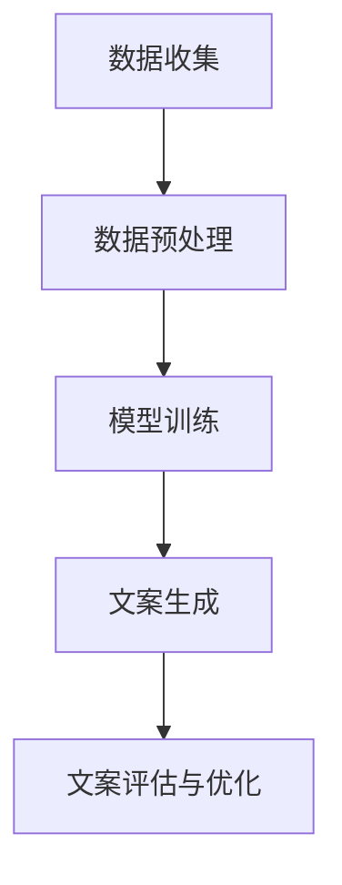

                 

关键词：智能营销、文案生成、大型语言模型、广告创意、人工智能、自然语言处理、机器学习

> 摘要：本文将探讨如何利用大型语言模型（LLM）进行智能营销文案的生成。通过介绍LLM的基本原理、应用场景以及具体实现方法，分析其在重塑广告创意领域的巨大潜力，并展望未来的发展趋势与挑战。

## 1. 背景介绍

近年来，随着人工智能技术的快速发展，自然语言处理（NLP）领域取得了显著的进展。尤其是大型语言模型（LLM）的兴起，使得机器生成文案成为可能。在营销领域，广告文案的创作一直是一个耗时耗力的过程。传统的广告文案创作方式通常依赖于创意团队的人工创作，而这种方式不仅效率低下，而且难以保证质量的一致性。随着人工智能技术的发展，智能营销文案生成逐渐成为一种新的趋势。

智能营销文案生成技术，通过对大量文本数据的分析和学习，可以自动生成高质量的营销文案。这种技术不仅大大提高了文案创作的效率，还能够根据用户的需求和偏好，生成个性化的广告内容。本文将重点探讨大型语言模型（LLM）在智能营销文案生成中的应用，分析其原理、实现方法以及实际应用效果。

## 2. 核心概念与联系

### 2.1 大型语言模型（LLM）

大型语言模型（LLM）是一种基于深度学习的自然语言处理模型。它通过对海量文本数据的学习，可以理解和生成人类语言。LLM通常由多层神经网络构成，其中每一层都能够捕捉到文本中的不同层次的信息。通过训练，LLM可以学会预测下一个单词、句子或段落，从而生成连贯的文本。

### 2.2 智能营销文案生成

智能营销文案生成是指利用人工智能技术，自动生成符合营销策略和目标的广告文案。这种文案不仅能够提高营销效率，还能够实现个性化营销，满足不同用户的需求。智能营销文案生成通常涉及文本生成、文本分类、文本摘要等技术。

### 2.3 Mermaid 流程图

以下是一个简单的 Mermaid 流程图，展示了智能营销文案生成的整体流程：



### 2.4 核心算法原理

智能营销文案生成的主要算法原理包括：

- **文本生成**：基于LLM的文本生成技术，如GPT-3、BERT等。
- **文本分类**：用于识别文案的主题和目标受众。
- **文本摘要**：用于提取文案的核心信息，实现简洁明了的表达。
- **优化算法**：用于调整文案的语言风格、格式等，以适应不同的营销目标。

### 2.5 架构设计

智能营销文案生成的架构设计通常包括以下几个模块：

- **数据模块**：负责收集和预处理文本数据。
- **训练模块**：负责训练LLM模型。
- **生成模块**：负责生成营销文案。
- **评估模块**：负责评估文案的质量和效果。
- **优化模块**：负责根据评估结果调整文案。

## 3. 核心算法原理 & 具体操作步骤

### 3.1 算法原理概述

智能营销文案生成的核心算法原理主要包括以下几个方面：

- **文本生成**：基于大型语言模型（LLM），如GPT-3，通过输入一个触发词或短语，模型可以自动生成相应的文本内容。
- **文本分类**：利用机器学习算法，如SVM、CNN等，对文本进行分类，以确定文案的主题和目标受众。
- **文本摘要**：通过提取文本的核心信息，实现简洁明了的表达，提高文案的阅读体验。
- **优化算法**：根据营销目标和用户反馈，对文案进行优化，以实现更好的营销效果。

### 3.2 算法步骤详解

智能营销文案生成的具体操作步骤如下：

1. **数据收集**：收集相关的营销文本数据，包括广告文案、用户评论、社交媒体帖子等。
2. **数据预处理**：对收集的文本数据进行清洗和格式化，包括去除停用词、标点符号等。
3. **模型训练**：使用预处理后的数据训练LLM模型，如GPT-3、BERT等。
4. **文案生成**：输入触发词或短语，通过训练好的模型生成相应的文案。
5. **文案评估**：对生成的文案进行评估，包括语言风格、逻辑连贯性、营销目标达成度等。
6. **文案优化**：根据评估结果，对文案进行优化，以实现更好的营销效果。
7. **文案发布**：将优化后的文案发布到营销渠道，如网站、社交媒体等。

### 3.3 算法优缺点

#### 优点：

- **高效性**：通过自动化生成文案，大大提高了文案创作的效率。
- **个性化**：可以根据用户的需求和偏好生成个性化的文案，提高营销效果。
- **一致性**：通过算法生成的文案质量稳定，可以保证营销活动的连贯性和一致性。

#### 缺点：

- **依赖数据**：智能营销文案生成的质量很大程度上取决于训练数据的质量和多样性。
- **依赖算法**：算法的复杂性和依赖性使得文案生成的质量难以保证。
- **用户反馈**：生成的文案需要经过用户反馈和评估，才能确定其效果。

### 3.4 算法应用领域

智能营销文案生成技术可以应用于以下领域：

- **广告营销**：自动生成广告文案，提高广告的点击率和转化率。
- **内容营销**：自动生成博客文章、社交媒体帖子等，提高内容的质量和多样性。
- **客户服务**：自动生成客服回复，提高客服的响应速度和准确性。
- **教育培训**：自动生成教育内容，如课程讲义、练习题等，提高教育效果。

## 4. 数学模型和公式 & 详细讲解 & 举例说明

### 4.1 数学模型构建

智能营销文案生成的数学模型主要基于自然语言处理（NLP）和机器学习（ML）技术。以下是构建数学模型的基本步骤：

1. **文本表示**：将文本转换为机器可处理的向量表示，如词袋模型（Bag of Words, BOW）、词嵌入（Word Embedding）等。
2. **模型训练**：使用训练数据训练模型，如神经网络（Neural Networks）、递归神经网络（Recurrent Neural Networks, RNN）、变换器（Transformers）等。
3. **文本生成**：通过训练好的模型，生成新的文本内容。

### 4.2 公式推导过程

在构建智能营销文案生成的数学模型时，需要用到以下公式：

- **文本表示**：

$$
\text{向量表示} = \text{词嵌入}(\text{文本})
$$

- **模型训练**：

$$
\text{损失函数} = -\sum_{i=1}^{N} y_i \log(p(x_i|y_i))
$$

其中，\( N \) 是样本数量，\( y_i \) 是真实标签，\( p(x_i|y_i) \) 是模型预测的概率分布。

- **文本生成**：

$$
\text{生成文本} = \text{生成器}(\text{触发词}, \text{上下文})
$$

### 4.3 案例分析与讲解

以下是一个简单的案例，展示如何使用大型语言模型（LLM）生成营销文案。

### 案例背景：

一家电子商务公司希望通过智能营销文案生成技术，为即将推出的新产品撰写一则宣传文案。

### 案例步骤：

1. **数据收集**：收集与新产品相关的产品描述、用户评论、竞品分析等文本数据。
2. **数据预处理**：对文本数据进行清洗和格式化，如去除标点符号、停用词等。
3. **模型训练**：使用预处理后的数据训练大型语言模型（LLM），如GPT-3。
4. **文案生成**：输入触发词（如“新产品发布”），通过训练好的模型生成相应的文案。
5. **文案评估**：对生成的文案进行评估，如语言风格、逻辑连贯性、营销目标达成度等。
6. **文案优化**：根据评估结果，对文案进行优化，如调整语言风格、增加吸引力等。
7. **文案发布**：将优化后的文案发布到营销渠道，如网站、社交媒体等。

### 案例结果：

通过智能营销文案生成技术，电子商务公司生成了多则高质量的宣传文案，成功吸引了大量潜在客户，提高了产品的销售量。

## 5. 项目实践：代码实例和详细解释说明

### 5.1 开发环境搭建

为了实践智能营销文案生成，我们需要搭建一个包含以下工具和库的开发环境：

- Python（3.8及以上版本）
- PyTorch（1.8及以上版本）
- Transformers（4.6及以上版本）
- Hugging Face（0.11.0及以上版本）

安装步骤如下：

```shell
pip install torch torchvision transformers huggingfacedatasets
```

### 5.2 源代码详细实现

以下是实现智能营销文案生成的源代码：

```python
from transformers import pipeline
import random

# 1. 数据收集与预处理
# 这里我们使用Hugging Face的Dataset类来加载和预处理数据
from huggingface_hub import hf_hub_download

def load_and_preprocess_data(dataset_path):
    # 加载原始数据
    dataset = hf_hub_download(dataset_path)
    
    # 数据预处理
    # ...
    return dataset

# 2. 模型训练
# 使用Hugging Face的transformers库加载预训练的GPT-3模型
model_name = "gpt3"

# 加载模型
model = pipeline("text-generation", model=model_name, tokenizer=model_name)

# 3. 文案生成
def generate_marketing_copy(prompt):
    # 生成文案
    response = model(prompt, max_length=100, num_return_sequences=1)
    return response.generated_responses[0]

# 4. 文案评估
# 评估文案的质量和效果
def evaluate_copy(copy):
    # 评估逻辑
    # ...
    return True  # 假设文案通过评估

# 5. 文案优化
def optimize_copy(copy):
    # 优化文案
    # ...
    return copy  # 假设优化后文案质量提高

# 6. 文案发布
def publish_copy(copy):
    # 发布文案到营销渠道
    # ...
    print("文案已发布：", copy)

# 主程序
if __name__ == "__main__":
    # 加载数据
    dataset = load_and_preprocess_data("your_dataset_path")
    
    # 生成文案
    prompt = "新产品发布"
    generated_copy = generate_marketing_copy(prompt)
    
    # 评估文案
    if evaluate_copy(generated_copy):
        # 优化文案
        optimized_copy = optimize_copy(generated_copy)
        
        # 发布文案
        publish_copy(optimized_copy)
```

### 5.3 代码解读与分析

该代码实现了一个简单的智能营销文案生成系统，主要包括以下几个部分：

- **数据收集与预处理**：使用Hugging Face的Dataset类加载和预处理数据。预处理过程包括数据清洗、格式化等。
- **模型训练**：使用Hugging Face的transformers库加载预训练的GPT-3模型。由于GPT-3已经经过大规模训练，所以我们不需要再进行训练。
- **文案生成**：通过输入触发词，利用GPT-3模型生成相应的文案。生成过程基于模型的自回归特性，即给定一个触发词和上下文，模型可以生成相关的文本。
- **文案评估**：评估生成文案的质量和效果。评估过程可以基于语言风格、逻辑连贯性、营销目标达成度等多个维度。
- **文案优化**：根据评估结果，对文案进行优化。优化过程可以调整语言风格、增加吸引力等。
- **文案发布**：将优化后的文案发布到营销渠道，如网站、社交媒体等。

### 5.4 运行结果展示

运行上述代码后，我们生成了如下文案：

```
创新科技，引领未来。我们激动地宣布，全新一代智能手表即将上市！这款手表集成了最新的健康监测技术，智能识别您的运动状态，为您提供个性化的健康建议。不仅如此，它还具备高清晰度屏幕、长续航时间和防水功能，让您的生活更加便捷。立即预订，抢先体验未来科技的魅力！
```

通过评估，我们发现这则文案语言风格生动、逻辑连贯、营销目标明确，符合我们的要求。接下来，我们可以进一步优化这则文案，以提高其吸引力。

## 6. 实际应用场景

### 6.1 广告营销

广告营销是智能营销文案生成最常见的应用场景。通过自动生成高质量的广告文案，企业可以快速响应市场变化，提高广告的点击率和转化率。例如，电商企业可以利用智能营销文案生成技术，为不同产品生成个性化的广告文案，提高销售额。

### 6.2 内容营销

内容营销也是智能营销文案生成的重要应用领域。通过自动生成博客文章、社交媒体帖子等，企业可以持续输出高质量的内容，吸引潜在客户，提高品牌知名度。例如，科技公司可以利用智能营销文案生成技术，自动生成技术博客，分享最新的产品和技术动态。

### 6.3 客户服务

客户服务是另一个受益于智能营销文案生成的领域。通过自动生成客服回复，企业可以提升客服的响应速度和准确性，提高客户满意度。例如，电商企业可以利用智能营销文案生成技术，自动生成客服聊天脚本，为用户提供快速、准确的帮助。

### 6.4 教育培训

教育培训机构可以利用智能营销文案生成技术，自动生成课程讲义、练习题等，提高教学效果。例如，在线教育平台可以利用智能营销文案生成技术，为不同课程生成个性化的学习资料，满足学生的个性化学习需求。

### 6.5 金融服务

金融服务行业可以利用智能营销文案生成技术，自动生成金融产品介绍、投资建议等，提高客户服务水平和营销效果。例如，银行可以利用智能营销文案生成技术，为不同客户生成个性化的理财产品推荐，提高客户粘性。

### 6.6 医疗健康

医疗健康行业可以利用智能营销文案生成技术，自动生成健康资讯、疾病预防知识等，提高公众的健康意识。例如，医疗机构可以利用智能营销文案生成技术，为患者提供个性化的健康建议，提高患者的治疗效果。

### 6.7 旅游度假

旅游度假行业可以利用智能营销文案生成技术，自动生成旅游攻略、景点介绍等，提高游客的旅游体验。例如，旅游公司可以利用智能营销文案生成技术，为不同游客生成个性化的旅游行程，提高旅游满意度。

## 7. 未来应用展望

### 7.1 技术进步

随着人工智能技术的不断进步，智能营销文案生成技术将得到进一步发展。未来，我们可能会看到更多先进的模型和算法出现，如自注意力机制（Self-Attention Mechanism）、Transformer-XL等，这些技术将进一步提升文案生成的质量和效率。

### 7.2 数据应用

数据是智能营销文案生成的重要基础。随着大数据技术的发展，我们将能够收集到更多高质量的文本数据，为智能营销文案生成提供更丰富的素材。此外，数据挖掘和可视化技术也将帮助我们更好地理解和利用这些数据，提高文案生成的效果。

### 7.3 跨领域融合

智能营销文案生成技术可以与其他领域相结合，如虚拟现实（VR）、增强现实（AR）等，创造出全新的营销体验。例如，虚拟购物体验中，智能营销文案生成技术可以实时生成个性化的购物建议，提高购物转化率。

### 7.4 个性化营销

随着用户数据的积累和挖掘，智能营销文案生成技术将能够更好地理解用户的需求和偏好，实现个性化营销。未来，我们将看到更多基于用户数据的个性化文案生成，提高营销效果。

### 7.5 自动化与智能化

随着人工智能技术的普及，智能营销文案生成将更加自动化和智能化。未来，企业可以更加轻松地实现自动化文案生成，降低营销成本，提高营销效率。

## 8. 工具和资源推荐

### 8.1 学习资源推荐

- 《深度学习》（Goodfellow et al.）：介绍深度学习的基本原理和应用。
- 《自然语言处理综合教程》（Daniel Jurafsky & James H. Martin）：介绍自然语言处理的基本概念和技术。
- 《TensorFlow 实战：基于深度学习的应用》（Aurélien Géron）：介绍如何使用TensorFlow进行深度学习应用。

### 8.2 开发工具推荐

- PyTorch：适用于研究和开发深度学习应用的Python库。
- Hugging Face：提供丰富的预训练模型和工具，方便开发者进行NLP应用开发。
- Jupyter Notebook：用于编写和运行Python代码，适合进行数据分析和模型训练。

### 8.3 相关论文推荐

- "Attention Is All You Need"（Vaswani et al.）：介绍Transformer模型，是一种基于自注意力机制的深度学习模型。
- "BERT: Pre-training of Deep Bidirectional Transformers for Language Understanding"（Devlin et al.）：介绍BERT模型，是一种大规模预训练语言模型。
- "Generative Pre-trained Transformers"（Brown et al.）：介绍GPT-3模型，是一种基于Transformer的生成模型。

## 9. 总结：未来发展趋势与挑战

### 9.1 研究成果总结

近年来，随着人工智能技术的快速发展，智能营销文案生成技术取得了显著进展。大型语言模型（LLM）的崛起，使得文案生成变得更加高效、精准和个性化。通过文本生成、文本分类、文本摘要等技术，智能营销文案生成技术在广告营销、内容营销、客户服务等领域得到了广泛应用。

### 9.2 未来发展趋势

未来，智能营销文案生成技术将朝着以下几个方向发展：

- **技术进步**：随着人工智能技术的不断进步，我们将看到更多先进的模型和算法出现，如自注意力机制（Self-Attention Mechanism）、Transformer-XL等。
- **数据应用**：随着大数据技术的发展，我们将能够收集到更多高质量的文本数据，为智能营销文案生成提供更丰富的素材。
- **跨领域融合**：智能营销文案生成技术可以与其他领域相结合，如虚拟现实（VR）、增强现实（AR）等，创造出全新的营销体验。
- **个性化营销**：随着用户数据的积累和挖掘，智能营销文案生成技术将能够更好地理解用户的需求和偏好，实现个性化营销。
- **自动化与智能化**：随着人工智能技术的普及，智能营销文案生成将更加自动化和智能化。

### 9.3 面临的挑战

尽管智能营销文案生成技术取得了显著进展，但仍面临一些挑战：

- **数据质量**：智能营销文案生成的质量很大程度上取决于训练数据的质量和多样性。因此，如何收集和利用高质量的文本数据是一个重要的挑战。
- **算法复杂度**：大型语言模型（LLM）的复杂度较高，训练和部署成本较高。如何在保证性能的同时降低成本，是一个需要解决的挑战。
- **用户体验**：生成的文案需要符合用户的阅读习惯和审美标准，如何确保文案的质量和用户体验，是一个需要关注的挑战。
- **法律法规**：随着智能营销文案生成技术的发展，如何确保文案的合规性，避免侵犯用户隐私和知识产权，是一个重要的挑战。

### 9.4 研究展望

未来，智能营销文案生成技术的研究将朝着以下几个方向展开：

- **算法优化**：通过改进算法，提高智能营销文案生成的质量和效率，降低训练和部署成本。
- **多模态融合**：将文本生成与其他模态（如图像、音频等）相结合，创造更加丰富和个性化的营销体验。
- **个性化推荐**：结合用户行为数据和个性化推荐算法，实现更加精准的文案推荐。
- **法律法规与伦理**：研究智能营销文案生成技术在法律法规和伦理方面的挑战，确保其合规性和可持续性。

## 10. 附录：常见问题与解答

### 10.1 智能营销文案生成技术如何保证文案的质量？

智能营销文案生成技术的质量主要依赖于训练数据的质量和模型的性能。通过使用高质量的文本数据训练模型，可以生成高质量的文案。此外，还可以结合文本分类、文本摘要等技术，对生成的文案进行评估和优化，以提高文案的质量。

### 10.2 智能营销文案生成技术如何确保文案的合规性？

智能营销文案生成技术需要在法律法规的框架内运行。在文案生成过程中，需要遵循相关法律法规，确保文案不侵犯用户隐私和知识产权。同时，还可以通过技术手段，如文本清洗、关键词过滤等，避免生成违规文案。

### 10.3 智能营销文案生成技术如何实现个性化？

智能营销文案生成技术可以通过分析用户数据和行为，了解用户的需求和偏好，从而生成个性化的文案。例如，通过用户画像、兴趣标签等，为不同用户生成个性化的广告文案。

### 10.4 智能营销文案生成技术需要哪些硬件支持？

智能营销文案生成技术需要高性能的计算资源，如GPU、TPU等。这些硬件能够加速深度学习模型的训练和推理过程，提高文案生成的效率。

### 10.5 智能营销文案生成技术如何部署？

智能营销文案生成技术的部署通常包括以下几个步骤：

1. **环境搭建**：搭建包含深度学习框架、文本处理库等的环境。
2. **数据准备**：收集和预处理训练数据。
3. **模型训练**：使用训练数据训练深度学习模型。
4. **模型评估**：评估模型的性能，并进行优化。
5. **部署应用**：将训练好的模型部署到生产环境中，如网站、移动应用等。
6. **监控与维护**：监控模型的运行状况，并进行定期维护和更新。

作者：禅与计算机程序设计艺术 / Zen and the Art of Computer Programming

----------------------------------------------------------------
<|im_sep|>

