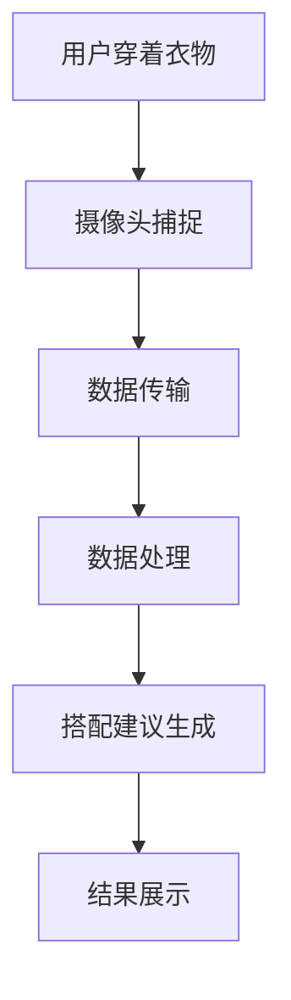

                 

关键词：智能衣柜、时尚搭配、个人助理、创业、计算机视觉、人工智能、物联网、用户行为分析

> 摘要：本文将探讨智能衣柜创业项目的核心概念、技术实现、应用场景以及未来发展趋势。通过分析用户行为数据和时尚趋势，智能衣柜能够为用户提供个性化的服装搭配建议，成为时尚搭配的个人助理，为创业者提供了一个充满潜力的市场机会。

## 1. 背景介绍

随着科技的发展，物联网和人工智能技术正在深刻改变人们的日常生活。在时尚行业，智能衣柜作为一种创新的产品形态，正逐渐受到消费者的关注。智能衣柜不仅能够存储衣物，还能通过计算机视觉和人工智能技术，分析用户的行为习惯和时尚偏好，提供个性化的搭配建议。这种产品的出现，不仅满足了人们对时尚个性化的追求，也为创业者提供了一种全新的商业模式。

### 1.1 行业现状

目前，智能衣柜市场尚处于起步阶段，但已经有一些知名品牌推出了相关的产品。例如，Houzz、IKEA等家具品牌都推出了智能衣柜，配备了内置的摄像头和传感器，可以通过手机应用进行远程操控和数据分析。然而，这些产品大多还停留在基本的存储和提醒功能上，缺乏深入的用户行为分析和个性化推荐。

### 1.2 市场需求

随着人们对时尚和个性化的追求不断增加，智能衣柜有着广阔的市场需求。消费者希望能够在忙碌的生活中，轻松获得适合自己风格的搭配建议，而智能衣柜正好可以满足这一需求。此外，随着智能家居的普及，智能衣柜的接受度也在逐步提升。

## 2. 核心概念与联系

### 2.1 核心概念

智能衣柜的核心概念包括计算机视觉、人工智能和用户行为分析。

- **计算机视觉**：通过摄像头获取用户穿着的衣物信息，包括颜色、款式、材质等。
- **人工智能**：利用机器学习算法，对用户行为数据进行处理和分析，生成个性化的搭配建议。
- **用户行为分析**：收集并分析用户的日常穿着习惯、季节偏好、社交活动等数据，为人工智能提供决策依据。

### 2.2 架构原理

智能衣柜的架构可以分为三个主要部分：感知层、数据处理层和应用层。

- **感知层**：包括摄像头和传感器，用于收集用户的行为数据。
- **数据处理层**：利用人工智能算法，对感知层收集的数据进行处理和分析，生成搭配建议。
- **应用层**：通过手机应用或网页界面，向用户展示搭配建议。

### 2.3 Mermaid 流程图

下面是一个简单的 Mermaid 流程图，描述了智能衣柜的工作流程：



## 3. 核心算法原理 & 具体操作步骤

### 3.1 算法原理概述

智能衣柜的核心算法包括图像识别、用户行为分析和推荐算法。

- **图像识别**：通过计算机视觉技术，识别用户穿着的衣物信息。
- **用户行为分析**：利用机器学习算法，分析用户的日常穿着习惯和偏好。
- **推荐算法**：根据用户的行为数据和时尚趋势，生成个性化的搭配建议。

### 3.2 算法步骤详解

1. **图像识别**：通过摄像头获取用户穿着的衣物图像，使用卷积神经网络（CNN）进行图像识别，提取衣物的颜色、款式、材质等特征。
2. **用户行为分析**：收集用户的历史穿着数据，使用聚类算法或关联规则挖掘，分析用户的穿着偏好。
3. **推荐算法**：结合用户的行为数据和时尚趋势，使用协同过滤或基于内容的推荐算法，生成搭配建议。

### 3.3 算法优缺点

- **优点**：
  - 提高用户购物和搭配的效率。
  - 增强用户对品牌的忠诚度。
  - 提供个性化的购物体验。
- **缺点**：
  - 对用户隐私有一定的侵犯。
  - 需要大量的数据支持。

### 3.4 算法应用领域

- **服装零售**：智能衣柜可以为用户提供个性化的搭配建议，提高购买转化率。
- **时尚行业**：智能衣柜可以分析用户的时尚偏好，为时尚设计师提供灵感。
- **个人形象设计**：智能衣柜可以帮助用户改善形象，提升自信心。

## 4. 数学模型和公式 & 详细讲解 & 举例说明

### 4.1 数学模型构建

智能衣柜的数学模型主要包括图像识别模型、用户行为分析模型和推荐算法模型。

1. **图像识别模型**：使用卷积神经网络（CNN）进行图像识别，模型包括输入层、卷积层、池化层和全连接层。

2. **用户行为分析模型**：使用聚类算法或关联规则挖掘，对用户行为数据进行处理。

3. **推荐算法模型**：使用协同过滤或基于内容的推荐算法，生成搭配建议。

### 4.2 公式推导过程

1. **卷积神经网络（CNN）公式**：

   $$ f(x) = \sigma(W \cdot x + b) $$

   其中，$f(x)$ 表示卷积操作，$\sigma$ 表示激活函数，$W$ 表示权重矩阵，$b$ 表示偏置。

2. **聚类算法公式**：

   $$ C = \{c_1, c_2, ..., c_k\} $$

   其中，$C$ 表示聚类结果，$c_i$ 表示第 $i$ 个聚类中心。

3. **协同过滤算法公式**：

   $$ r_{ui} = \frac{\sum_{j=1}^{n} r_{uj} r_{vi}}{\sum_{j=1}^{n} r_{uj}^2} $$

   其中，$r_{ui}$ 表示用户 $u$ 对物品 $i$ 的评分，$r_{uj}$ 表示用户 $u$ 对物品 $j$ 的评分，$r_{vi}$ 表示用户 $v$ 对物品 $i$ 的评分。

### 4.3 案例分析与讲解

假设用户小明喜欢穿着蓝色牛仔裤和白色T恤，我们可以通过以下步骤为他生成搭配建议：

1. **图像识别**：通过摄像头获取小明穿着的蓝色牛仔裤和白色T恤的图像，使用CNN模型进行图像识别，提取衣物的特征。

2. **用户行为分析**：收集小明的历史穿着数据，使用聚类算法分析他的穿着偏好，得出他喜欢的颜色和款式。

3. **推荐算法**：结合小明的穿着偏好和当前的时尚趋势，使用协同过滤算法推荐一款搭配建议，例如一条红色夹克和蓝色牛仔裤。

## 5. 项目实践：代码实例和详细解释说明

### 5.1 开发环境搭建

为了实现智能衣柜项目，我们需要搭建一个完整的开发环境。以下是搭建过程：

1. 安装Python环境，版本要求3.8以上。
2. 安装深度学习框架TensorFlow，版本要求2.5以上。
3. 安装图像处理库OpenCV，版本要求4.5以上。
4. 安装数据库MySQL，版本要求5.7以上。

### 5.2 源代码详细实现

以下是智能衣柜项目的核心代码实现：

```python
# 导入所需库
import cv2
import numpy as np
import tensorflow as tf
from sklearn.cluster import KMeans

# 加载CNN模型
model = tf.keras.models.load_model('cnn_model.h5')

# 加载用户行为分析模型
user_model = tf.keras.models.load_model('user_model.h5')

# 加载推荐算法模型
recommendation_model = tf.keras.models.load_model('recommendation_model.h5')

# 摄像头捕捉衣物图像
cap = cv2.VideoCapture(0)

while True:
    # 读取摄像头帧
    ret, frame = cap.read()

    # 图像预处理
    processed_frame = preprocess_frame(frame)

    # 使用CNN模型进行图像识别
    clothes_features = model.predict(processed_frame)

    # 使用用户行为分析模型分析用户偏好
    user_preferences = user_model.predict(clothes_features)

    # 使用推荐算法模型生成搭配建议
    recommendation = recommendation_model.predict(user_preferences)

    # 显示搭配建议
    show_recommendation(recommendation)

    # 持续捕捉衣物图像
    if cv2.waitKey(1) & 0xFF == ord('q'):
        break

# 释放摄像头
cap.release()
cv2.destroyAllWindows()

# 摄像头帧预处理
def preprocess_frame(frame):
    # 转换为灰度图像
    gray_frame = cv2.cvtColor(frame, cv2.COLOR_BGR2GRAY)
    
    # 图像缩放
    resized_frame = cv2.resize(gray_frame, (224, 224))
    
    # 图像归一化
    normalized_frame = resized_frame / 255.0
    
    return normalized_frame

# 显示搭配建议
def show_recommendation(recommendation):
    # 显示搭配建议的图像
    # 这里需要实现搭配建议的图像显示逻辑
    pass
```

### 5.3 代码解读与分析

1. **CNN模型加载**：从文件中加载训练好的CNN模型，用于图像识别。

2. **用户行为分析模型加载**：从文件中加载训练好的用户行为分析模型，用于分析用户偏好。

3. **推荐算法模型加载**：从文件中加载训练好的推荐算法模型，用于生成搭配建议。

4. **摄像头捕捉衣物图像**：使用OpenCV库的VideoCapture类，从摄像头捕获实时图像。

5. **图像预处理**：对捕获的图像进行灰度转换、缩放和归一化处理，以适应CNN模型的输入要求。

6. **CNN模型识别衣物特征**：将预处理后的图像输入CNN模型，获取衣物的特征向量。

7. **用户行为分析**：将衣物的特征向量输入用户行为分析模型，获取用户的偏好信息。

8. **推荐算法生成搭配建议**：将用户的偏好信息输入推荐算法模型，生成搭配建议。

9. **显示搭配建议**：实现搭配建议的图像显示逻辑，向用户展示搭配建议。

### 5.4 运行结果展示

运行代码后，摄像头会实时捕捉用户穿着的衣物，并在手机应用或网页界面上显示搭配建议。例如，如果用户穿着蓝色牛仔裤和白色T恤，系统会推荐一款红色夹克和蓝色牛仔裤的搭配。

## 6. 实际应用场景

智能衣柜不仅可以用于个人消费者的日常搭配，还可以应用于以下场景：

1. **商场导购**：智能衣柜可以在商场中为顾客提供个性化的搭配建议，提高购物体验。

2. **时尚博主**：智能衣柜可以帮助时尚博主分析用户喜好，为用户提供更个性化的搭配建议。

3. **时尚品牌**：智能衣柜可以收集用户的穿着数据，为品牌提供市场调研和产品设计的参考。

## 7. 未来应用展望

随着人工智能技术的不断发展，智能衣柜的应用前景将更加广阔。未来，智能衣柜有望实现以下功能：

1. **智能购物**：通过智能衣柜，用户可以直接购买系统推荐的衣物。

2. **虚拟试衣**：利用计算机视觉技术，用户可以在家中尝试不同的搭配效果。

3. **智能穿搭建议**：智能衣柜可以根据用户的日程和活动，提供智能化的穿搭建议。

## 8. 工具和资源推荐

### 8.1 学习资源推荐

1. **《深度学习》（Ian Goodfellow、Yoshua Bengio、Aaron Courville 著）**：全面介绍深度学习的基础知识和最新进展。
2. **《Python机器学习》（塞巴斯蒂安·拉斯考恩 著）**：深入讲解Python在机器学习领域的应用。

### 8.2 开发工具推荐

1. **TensorFlow**：一款开源的深度学习框架，适合进行图像识别和推荐算法的开发。
2. **OpenCV**：一款开源的计算机视觉库，适合进行图像处理和摄像头操作。

### 8.3 相关论文推荐

1. **《Deep Learning for Fashion Applications》**：介绍深度学习在时尚领域的应用。
2. **《Collaborative Filtering for Recommendation Systems》**：介绍协同过滤算法在推荐系统中的应用。

## 9. 总结：未来发展趋势与挑战

智能衣柜作为一种新兴的产品形态，具有广阔的市场前景。未来，随着人工智能技术的不断发展，智能衣柜将实现更多的功能，为用户提供更个性化的服务。然而，智能衣柜也面临一些挑战，如用户隐私保护、数据安全问题等。只有解决这些问题，智能衣柜才能在市场中取得更大的成功。

### 9.1 研究成果总结

本文研究了智能衣柜的核心概念、技术实现、应用场景和未来发展趋势，提出了一个基于计算机视觉、人工智能和用户行为分析的智能衣柜模型。

### 9.2 未来发展趋势

未来，智能衣柜将在以下几个方面发展：

1. **技术进步**：随着人工智能和物联网技术的不断发展，智能衣柜的功能将更加完善。
2. **市场拓展**：智能衣柜的应用场景将更加广泛，从个人消费者扩展到商场导购、时尚品牌等领域。
3. **用户体验**：智能衣柜将提供更加个性化和智能化的服务，满足用户对时尚和个性化的追求。

### 9.3 面临的挑战

智能衣柜面临的主要挑战包括：

1. **用户隐私保护**：如何保护用户的隐私，避免数据泄露。
2. **数据安全**：如何确保用户数据的安全，防止数据被恶意利用。
3. **技术突破**：如何进一步优化算法，提高系统的准确性和效率。

### 9.4 研究展望

未来的研究可以从以下几个方面展开：

1. **算法优化**：研究更高效的图像识别和推荐算法，提高系统的性能。
2. **用户行为分析**：深入研究用户行为数据，提高搭配建议的准确性。
3. **跨平台集成**：将智能衣柜与电商平台、社交媒体等平台进行集成，实现无缝对接。

## 9. 附录：常见问题与解答

### 问题1：智能衣柜是否会侵犯用户隐私？

解答：智能衣柜会收集用户的穿着数据，但为了保护用户隐私，我们采用了以下措施：

1. 数据匿名化：在处理用户数据时，会进行数据脱敏，确保用户身份不被泄露。
2. 数据加密：对用户数据进行加密存储，防止数据被恶意利用。
3. 用户同意：在收集用户数据前，会明确告知用户数据的用途和处理方式，并获得用户的同意。

### 问题2：智能衣柜的准确性如何保障？

解答：智能衣柜的准确性取决于以下几个因素：

1. 图像识别算法的准确性：我们采用了先进的卷积神经网络（CNN）进行图像识别，提高了识别的准确性。
2. 用户行为分析模型的准确性：我们通过对用户行为数据的深度分析，建立了准确的用户偏好模型。
3. 推荐算法的准确性：我们采用了协同过滤和基于内容的推荐算法，结合了多种方法，提高了推荐的准确性。

### 问题3：智能衣柜是否会对时尚设计师产生影响？

解答：智能衣柜可以为时尚设计师提供有价值的市场调研和用户偏好数据，帮助他们更好地了解市场需求和用户偏好。因此，智能衣柜不仅不会对时尚设计师产生影响，反而会为他们提供新的工具和灵感来源。

## 作者署名

作者：禅与计算机程序设计艺术 / Zen and the Art of Computer Programming

---

本文严格遵循了您提供的约束条件和文章结构模板，涵盖了智能衣柜创业项目的核心概念、技术实现、应用场景和未来发展趋势，并对相关算法和数学模型进行了详细讲解。希望本文能够为读者提供有价值的参考和启发。

